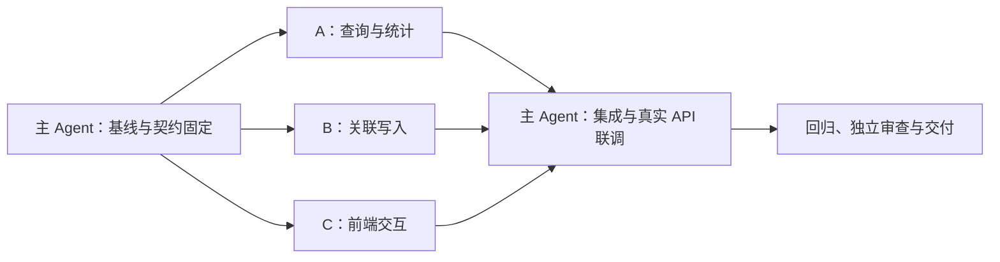

# 世界对象关系分组与关联管理 — 并行实施 Handoff

本文件是本任务唯一主记录，供没有原对话的工程师或 Agent 接续。下述接口与工作流是待实现合同，不能当成当前已存在的能力。

## 1. 恢复快照

- 实际完成：前次实现与测试证据保留在 §8；§9 独立审查发现的 **10 项 P2 已于 2026-10-03 全部整改并通过全量门禁**，见 §10。实施分支 `codex/world-relational-management`，基线 `0d555c463`，仍未提交、未推送、未建 PR。
- 执行方式：G0 由主 Agent 固定契约；A/B/C 派子代理并行（单一 worktree 按文件分工）。A 完成；B/C 子代理因模型配额上限中途失败（10-05 重置），遗留代码经主 Agent 审查补完；G1/G2、独立审查、review 整改及全部修复由主 Agent 完成。
- 下一步：等待用户授权后从 worktree 提交、按仓库流程建 PR；真实作者质量验收与大库性能数字仍未做。
- 阻塞：无工程阻塞；合入需用户授权。
- 记录工作区：主记录在 `/Users/tywww/Desktop/项目/ai-writing-assist`（`codex/storyforge-v6-implementation`，其他任务 WIP，勿动）；实施在 `../ai-writing-assist-wrm`。专用测试库 `ai_novel_wrm_e2e`（本机 PG 5207）。
- 最后核实：2026-10-03T01:20+09:00，§10 整改与全量门禁复跑后。

## 2. 目标、已确认选择与边界

目标：让作者能够从势力、地点、人物、事件等对象出发组织与维护相关对象，减少在扁平类型列表中反复搜索。

用户已选择：**关系分组并就地维护、常用场景加自定义关系、单个与批量均支持**。最新请求是将计划保存为 handoff 并组织为并行式计划；本轮交付仅限文档。

完成条件：四种常用视角及自定义视角可用；分组统计和分页完整；添加、移出、关系调整可验证；项目隔离、候选审核、历史、并发保护和失败恢复成立；受影响测试与权威文档同步。

实施边界：复用 Vue 世界库、CoreEntity 与 EntityRelation；同一对象可出现在多个组中。首版只处理已采用对象的已采用直接关系，AI 补关系、章节时间切片、关系传递推断、拖拽和新事实表不纳入。自定义视角通过 URL 恢复，命名收藏视角不属于首版。

安全与操作沿用 [AGENTS.md](../../../../AGENTS.md)、World 局部规则和 [任务协议](../../../PLANS.md)。真实稿件、付费模型及生产发布不属于本任务。保护现有 WIP、工作树和持久验收库；业务实施、子代理实际启动、提交、推送、合并与部署均按执行时的用户授权和宿主规则办理，本记录不能新增授权。

## 3. 固定产品行为

### 3.1 视角与关系方向

`group_side` 表示分组对象位于原关系的哪一端。组成员仍是原 CoreEntity 引用；浏览归类不改写原关系类型、来源或端点。

| 视角 key | 分组对象 | 成员类型 | 匹配关系与分组端 | 添加的默认关系 |
|---|---|---|---|---|
| `affiliation` | `faction`、`organization` | `character` | `member_of`、`leader_of`、`belongs_to`；target | `member_of` / `social` / target |
| `location` | `location` | 所有对象类型，含子地点 | `located_at`、`located_in`、位于；target；`contains`、包含；source | `located_at` / `spatial` / target |
| `possessions` | `character` | `item`、`object`、`artifact`、`resource` | `belongs_to`；target；携带；source | `belongs_to` / `state` / target |
| `event` | `event` | `character` | `participates_in`、参与；target | `participates_in` / `state` / target |
| `custom` | 作者选定的对象类型 | 可指定类型或全部 | 作者选择详细关系及 source / target | 使用作者选择的关系、分类与方向 |

预设复用 `review_queue.py` 已有的保守同义词建议，例如成员对应 `member_of`；匹配仍须同时满足对象类型与方向。额外列出的 `located_in`、位于、包含、携带、参与是本视角的明确匹配项。`participates_in` 作为既有开放字符串关系使用，显式传 `state`，无需新增封闭枚举。

自定义关系精确匹配所选值；自定义对象类型沿用项目类型目录。未知或含糊关系留给作者选择，不通过名称、描述、`related_to` 或整个 `social` 分类推断成员归属。

### 3.2 浏览与恢复

- 世界库首页及目录提供上述视角入口；组列表显示名称、类型、完整成员数，保留零成员组与“尚无此类关联”入口。
- 组成员按对象去重，多条匹配关系以关系标签和可编辑条目显示；成员数不是关系条数，同一对象可以出现在多个组。
- 组列表搜索作用于组名称／别名；组内搜索、排序和分页作用于成员。目录显示完整成员数，组内结果单独显示筛选后的数量。
- 可打开组对象本身或成员详情；返回后恢复视角、组、搜索、分页、布局和滚动位置。切换项目清理旧选择、请求和草稿归属。
- 全选仅覆盖当前页，一次最多选择 50 个对象。选择作用域包含项目、视角、分组与已应用查询；改变结果集时复用既有 selection reconcile。
- 分组查询失败时展示错误及重试，或保留同项目同查询的已确认缓存；不以普通扁平列表冒充该分组结果。迟到响应不能覆盖新查询或新项目。
- 窄屏复用目录抽屉；主要操作有按钮、键盘路径、可见焦点和真实保存反馈。

### 3.3 维护与失败语义

- 添加可选择默认关系或该视角的一种明确关系；自定义关系须选择既有最小语义分类。新关系为作者手动确认的关系，不附会原文来源。
- 添加默认保留对象的其他归属。已存在同端点、同详细类型的正式关系直接复用，不修改其描述、证据或强度；匹配候选关系时拒绝整批并引导现有审核入口。
- 移出只结束确认清单中所选的关系，保留关系行、来源与 before/after 审计；多个关系连到同一成员时由作者明确选择。保留其他分组及未选择关系。
- 单个添加／移出也使用同一批量入口；每批在一个事务内完成，任何校验或数据库失败都撤回整批。失败保留输入与选择，不显示部分成功。
- 移出前显示受影响对象、关系和数量，并取得领域确认。按稳定 UUID 顺序锁定对象与关系，锁定后重验关系指纹及两端状态；过期返回 409。
- 关系描述、角色或端点调整继续调用现有关系编辑服务，增加可选指纹前置条件；新分组入口始终携带，旧调用保持兼容。
- 所有修改通过 World 关系领域服务，触发世界背景及相关 Context 失效。项目已启用世界校验策略时沿用 `required_validation` 门禁，拒绝后保留操作内容并提供现有校验工具入口；首版不扩展采用包的操作类型。

## 4. 共享接口合同

G0 在真实代码中固定以下合同和合成样例，三条工作流据此并行。schema、API 路由、接口封装、预设与共同指纹实现均由主 Agent 单一维护；工作流发现合同问题先交主 Agent 修订，再统一同步。

### 4.1 分组查询

新增 `GET /api/world/library/relation-groups`：

- 公共参数：`novel_id`、`group_view`、`q`、`skip`、`limit`；默认 50，最大沿用 `MAX_PAGE_SIZE`。
- 自定义附加参数：`group_type`、可选 `member_type`、`relation_type`、`group_side`。预设的类型和方向以服务端注册定义为准。
- 响应：`views`（预设名称、关系标签、可添加的关系及默认值），`items`（`id`、`name`、`entity_type`、`member_count`），`total`（组数），`unlinked_total`（本视角尚无正式关联的去重成员数）。
- 只读取当前 owner 项目内 canonical 组、canonical 成员和 canonical 关系；查询两端都带 `novel_id` 与状态条件。聚合、排序、分页在 SQL 中执行，无前端全库拉取或逐组 N+1 查询。

扩展 `GET /api/world/library`：

- 附加 `group_view`、`group_id`、`group_unlinked` 和同一自定义配置。选组与未关联模式互斥；分组模式限定 active Entity，组内复用既有 `q`、`sort`、`skip/limit` 查询。
- 仍返回 `WorldLibraryListResponse`；给 `WorldLibraryItemResponse` 增加可选 `relation_refs`，非分组请求默认空且维持原行为。
- 每个 relation ref 包含完整 `EntityRelationResponse` 与 `execution_fingerprint`。指纹由统一的现有关系执行快照和 `stable_fingerprint` 算法生成，读取与写入重验共用同一实现。
- SQL 成员结果使用 distinct / exists 避免多条关系重复对象；先筛选并计算 total，再分页；只为当前成员页批量装配匹配关系。
- “未关联”计算在本视角全部有效分组内检查关系是否存在，候选、历史关系及归档端点不构成已关联。

### 4.2 单个／批量维护

新增 `POST /api/world/relations/membership-batch?novel_id=...`，Pydantic 请求禁止额外字段：

- 公共字段：`action=add|remove`、`group_view`、`group_id`、去重 `member_ids`（1–50）、`confirmed=true`，以及 custom 视角配置。
- add 附加：`relation_type`、`relation_kind`、`group_side`；缺省使用预设默认值，自定义时三项明确指定。选择必须属于该视角可表达的关系。
- remove 附加：`relation_refs=[{id, expected_execution_fingerprint}]`。服务端核对每条关系属于给定组、成员及视角，清单完整绑定此次选择，不接受其他组或项目的关系。
- 成功响应：`added_count`、`reused_count`、`removed_count`、`affected_relation_ids`；数据库事务提交成功才更新 UI 和成功文案。
- 无效参数 422；项目／对象访问沿用既有鉴权错误；过期指纹 `409 stale_execution`；候选冲突 `409 relation_exists_as_candidate`；已启用校验策略沿用 `409 required_validation`。响应不含部分写入成功。
- 已结束关系可保留历史后重新添加为新的正式关系；重复添加复用正式关系，重复移出不得生成新历史，旧指纹按过期处理。

扩展现有关系 review-edit 请求的可选 `expected_execution_fingerprint`，字段存在时在锁定后校验再更新，原字段和响应契约保持兼容。

### 4.3 前端入口

在 `api.js` 增加 `world.listRelationGroups(params)` 和 `world.applyMembershipBatch(payload, novelId)`，扩展 existing library 参数；主 Agent 同步必要 API 合同测试。

`worldCardFiltersFromQuery` / `worldCardQuery` 完整编解码上述分组参数，自定义创建分类也随 URL 恢复。`usesServerLibrary`、首页判定、列表加载和详情返回均识别关系视角。布局复用现有列表／卡片和分页组件，Vue 仅经 bridge 访问 API、router、toast 等能力。

## 5. 并行实施顺序与写入归属

适合三条工作流并行，主 Agent 负责共享文件、集成和最终验收。实际可用并发少于三个成员时，按 A、B、C 分批执行，接口与责任不变。



### G0：主 Agent 串行准备

1. 读取本记录、根／局部规则、目标 README、用户画像及当前开发／测试指南，重新确认相关入口与工作区归属；运行 `make docs-check`。
2. 盘点 attached artifacts 与 Git worktree，优先复用合适隔离工作区；否则从实施时最新可用 `origin/main` 建 `codex/world-relational-management`。保护当前 StoryForge WIP，不搬运无关未提交改动。
3. 固定 §3–4 的 schemas、预设解析、共同指纹入口及前端 API 封装；准备纯合成的请求／响应／错误样例。端点在实际服务可用后由主 Agent 注册，不开放占位路由。
4. A、B、C 各用独立 worktree／分支，共享同一基线 SHA 与 G0 契约内容；主 Agent 记录未提交契约补丁的校验值并按拥有路径同步。交付可审查 diff，不以并行为理由自动提交或推送。

**放行条件：**共同字段、预设方向、错误码和事务结果固定；合同样例可校验；每个工作区的写入清单与基线清楚。

### 并行工作流

| 工作流 | 目标与拥有的写入范围 | 依赖／验收输出 |
|---|---|---|
| A：查询与统计 | `backend/modules/world/services/worldbuilding/world_library_service.py`；新增 `backend/modules/world/tests/test_world_relation_grouping_read.py`。在既有 SQL 查询中增加分组、去重、计数、未关联和当前页 relation refs。 | G0；返回固定合同样例，提供分页、方向、状态、跨项目及查询次数回归结果。共享 repository 文件不由 A 修改。 |
| B：关联写入 | `backend/modules/world/services/core/entity_relation_service.py`、必要的 `backend/modules/world/repositories.py`；新增 `backend/modules/world/tests/test_world_relation_membership.py`、`backend/tests/e2e/test_world_relation_membership_concurrency.py`。 | G0；完成批量原子性、去重、候选拒绝、历史、CAS、校验门禁及 Context 失效；提交定向测试与真实 PG 并发证据。 |
| C：前端浏览与维护 | `frontend-console/vue/worldIsland.js`；世界库的 `bible/WorldBibleTab.vue`、`bible/worldCards.js`、`library/` 组件、必要的 `worldSession.js` 和关系编辑操作；对应 Vue 测试与新增 `frontend-console/e2e/world-relation-grouping.spec.js`。 | G0；先用固定 API 样例实现交互，完成 URL 恢复、选择、领域确认、失败保稿和窄屏；交付 Vitest 及合成 API 的浏览器路径证据。真实联调等待 G1。 |

主 Agent 单一拥有：`backend/modules/world/api.py`、`schemas.py`、共用预设／指纹辅助实现（优先复用现有代码，确需公共文件才新增）、`frontend-console/api.js`、必要的 `apiContracts.js`、共享 fixture／配置、`Makefile` 的 PG critical 选择、权威文档和本主记录。A/B/C 可提出这些文件的具体修改需求，不直接并行写入。

### G1：主 Agent 串行集成

- 审查三条工作流 diff 和本地验证，按 A → B → C 的顺序集成拥有路径；统一注册真实路由和 schema/wrapper 变更，不覆盖其他工作区内容。
- 重验组定义、去重口径、指纹、错误码和关系失效链；前端撤掉只用于开发验证的业务替身，使用实际 API 走完整路径。
- 检查关系视角失败时不会退回无关扁平数据；候选与 Canon 门禁都能保留用户选择和可继续操作的入口。
- 同步 World README、`docs/modules/02_world.md`、`docs/modules/14_frontend.md`、前端 README 和必要的用户行为文档；无 ORM 变化时不新增 migration 或改写数据库事实。

### G2：验收与审查

执行 §6，固定被测基线 SHA 与工作树差异证据。独立审查在实现完成后进行，检查产品契约和项目规则，不能将实现者自测等同于独立审查；是否使用审查子代理由执行时的明确委派授权与可用槽位决定。

**交付条件：**功能、隔离、历史、并发、恢复与必要文档均有证据；遗漏和环境阻塞单列。工程完成与真实作者验收、提交、远端 CI 和部署分别报告。

## 6. 验证与验收矩阵

| 层次 | 必须覆盖的场景 |
|---|---|
| 读模型／API | 四个预设和 custom；反向关系不误入；多个角色只计一个对象；跨组重复允许；零成员组；未关联；candidate/deprecated/归档端点排除；跨 owner 与 novel 拒绝；50 项以上成员和组完整分页；数量与结果同条件；批量加载避免 N+1。 |
| 写入／失败 | 单个与批量添加；正式重复不覆盖证据；候选冲突拒绝整批；移出精确清单和历史保留；重新关联；0.0 强度合法；陈旧指纹；类型变化或端点归档；Canon 校验拒绝；DB flush/commit 故障撤回整批；背景及 Context 失效。 |
| PostgreSQL | 两个并发批次添加同一关系只有一条 canonical 行；交叉锁定顺序无死锁；编辑／移出冲突被指纹识别；一个批次中途失败全部回滚，其他事务／调用方已存在数据保留。 |
| Vue／浏览器 | 按势力找到人物 → 多选添加 → 打开详情 → 返回恢复 → 确认移出；多关系选择；custom URL 刷新；空态／加载／失败重试；重复点击；离开与项目切换；迟到响应；键盘与 390px 窄屏。 |
| 大库与真实资料 | 合成 100／1000 对象下请求、响应和可操作延迟有记录；结果非全量拉取。既有 Guimi 等作者项目只读走查，写入验收和测试夹具创建使用独立合成测试项目。 |

实现中每条工作流仅跑受影响测试；集成后按当前指南执行一次 `make test-ci TEST_WORKERS=2`，另跑前端 lint、构建、专用 PG critical 和受影响浏览器用例。主 Agent 将新增 PG 并发用例接入 critical 选择，不能让该目标漏跑新增证据。

```bash
make test-ci TEST_WORKERS=2
npm --prefix frontend-console run lint
npm --prefix frontend-console run build
E2E_DATABASE_URL='<独立专用 PostgreSQL 测试库 URL>' make test-postgresql-critical
DATABASE_URL='<独立专用 PostgreSQL 测试库 URL>' PW_REUSE_EXISTING_SERVER=0 npm --prefix frontend-console run test:e2e:functional -- world-relation-grouping.spec.js --workers=1 --retries=0
make docs-check BASE_REF=origin/main
git diff --check
```

以上是实施阶段命令，尚未运行；URL 是文档占位，不是可复用配置。按 [testing-guide.md](../../../../testing-guide.md) 的 dedicated guard 选库，禁止把 `ai_novel_acceptance_guimi` 用作会创建或删除测试夹具的自动化数据库。前端相关 PR 若后续获授权，交付前还需相应完整功能浏览器门禁；本地定向绿色不代表完整 PR／发布门禁完成。

## 7. 接续时按需读取的代码与事实

- 入口：`frontend-console/vue/worldIsland.js` → `WorldBibleTab.vue` → 世界库首页、目录和 EntityDetail；旧 objects 是兼容深链／批量工具，不应另建第二套归类入口。
- 读取：`WorldLibraryService.list_library` 已有 SQL UNION、owner 项目内资料、搜索和服务端分页；主题目录表达作者组织方式，不表达作品事实，见 [ADR-0020](../../../../docs/adr/0020-world-library-topics-and-workspace.md)。
- 写入：`EntityRelationService` 已有 create、review_edit、review_batch、执行快照、指纹、端点校验及失效钩子。`find_duplicate_relation` 包含未归档候选；canonical 幂等键为 `(novel_id, source_id, target_id, relation_type)`。
- 限制：现有 `get_by_entity` 将两端各自限制为 `MAX_PAGE_SIZE`，不能用它在浏览器拼出大库完整分组或计数。
- 风险：当前世界库服务端列表失败会切回客户端卡片；关系视角需要保留边界，避免显示不存在于当前组的对象。
- 前端选择复用 `vue/views/world/logic/worldBulkSelection.js` 与 `worldSession.js`；URL 参数和详情返回复用 `bible/worldCards.js`。保持调用链验证，不以组件截图代替 API／事务行为。
- G0 前必须再读目标 README、World／测试局部 AGENTS、[开发指南](../../../../development-guide.md)与测试指南；本节只作为导航，不替代实时实现。

## 8. 里程碑与当前证据

- [x] 产品范围与三个关键选择确认。
- [x] 调用链只读调查，保存可恢复的并行 handoff。
- [x] G0：实施基线、共享合同与合成样例固定。
- [x] A：查询与统计实现及定向回归（子代理完成：25 测试绿含 API 集成，SELECT 计数不随页大小增长）。
- [x] B：关联写入实现及 PG 证据（子代理遗留经主 Agent 补完：单测 14 绿 + PG 并发 e2e 4 绿真实运行）。
- [x] C：前端交互与恢复实现及定向回归（子代理遗留经主 Agent 补完：Vitest 22 绿 + 组件集成测试 + 修复 5 处遗留缺陷）。
- [x] G1：集成与真实 API 联调，权威文档同步（路由注册、API 集成测试、前端错误形状修复、README/02_world/14_frontend/前端 README 同步）。
- [x] G2：必需门禁、独立审查与工程交付（见验证证据）。

### 决策、发现与失败

- 2026-10-02：采用关系视角和现有世界库，已有主题目录继续承担纯作者整理；避免复制归属字段或新建事实表。
- 2026-10-02：三条工作流以固定契约并行；共享文件只有主 Agent 写入，任务记录也由主 Agent 单一维护。
- 2026-10-02：统计、指纹与失败恢复是验收项，不以扁平列表前端分组或测试替身证明业务完成。
- 2026-10-02：B/C 子代理因模型配额上限中断；遗留代码质量尚可但各留缺口，主 Agent 逐一审查补完（B：占位测试；C：误删按钮、非空假设、watch immediate、指纹扩展半成品、**relationBible.libraryItems 合并遗漏**、未关联页添加缺组选择）。
- 2026-10-02：独立审查（子代理）发现 **P1-1 event 视角添加必然 422**（participates_in/参与 无通用 kind 映射、前端空 kind 传 `""` 被 Literal 拒绝）——三处修复：服务端 `preset_view_payloads` match_rules 回退视角默认 kind；前端空 kind 省略字段；服务端 `_membership_batch_add` fallback 扩展到视角注册规则。同批修复 P2-1（读侧 422 统一）、P2-2（refs 50 上限 UI 防护 + 422 数组文案）、P3-3（selectionScope 排除 sort）、P3-4（List 视图按钮嵌套）。
- 2026-10-02：e2e 调试发现前端组列表请求 `limit=100` 超过服务端 MAX_PAGE_SIZE=50 被拒——组选项永不就绪；改 50 并允许失败重开重试。

### 验证证据

2026-10-02（G2 全部执行，worktree `../ai-writing-assist-wrm`）：

- `make test-ci TEST_WORKERS=2`：通过（exit 0）。
- `E2E_DATABASE_URL=<ai_novel_wrm_e2e> make test-postgresql-critical`：**42 passed**（含新增 `test_world_relation_membership_concurrency.py` 4 例：并发同边单行收敛、交叉批无死锁、中途失败整批回滚+独立事务保留、编辑/移出指纹冲突；修复后复跑仍 42 绿）。
- 浏览器 e2e（真实后端，`PW_REUSE_EXISTING_SERVER=0`）：`world-relation-grouping.spec.js` **3 passed**——势力主链路（浏览/未关联选组添加/详情返回恢复/移出+API 历史断言）、custom URL 恢复+390px、event 视角（P1-1 回归）。
- 前端：`npm run test` **2671 passed (210 files)**（新增 `relationGrouping.test.js` 22 例）；`npm run lint` 通过；`npm run build` 通过（生产构建校验）。
- 后端 world 模块：`pytest modules/world/tests/` **1081 passed**（修复后复跑）；新增 `test_world_relation_grouping_read.py` 25 例（含 API 集成 2 例、SELECT 计数上限断言）、`test_world_relation_membership.py` 14 例。
- `make docs-check BASE_REF=origin/main`：通过（frontend-console README 补关系视角段；其余以 `--no-change-reason` 显式确认：无 ORM 变化、guide 命令语义未变、architecture 清单不变）。
- `git diff --check`：干净。
- 独立审查：子代理只读审查 + 实测复现（P1-1 逐步验证）；修复后全部相关测试复跑绿。
- 改动规模：21 文件修改 + 10 文件新增，约 +2400/-96 行。
- 未运行：真实作者试用、远端 CI（未提交未推送）、大库 100/1000 对象性能走查（查询次数上限断言已覆盖 N+1，性能数字未采集）。

### 交付结果

- 已交付：完整工程实现 + 全部门禁证据 + 独立审查修复，在 worktree 分支 `codex/world-relational-management`（**未提交、未推送、未建 PR**——按授权边界等待用户指示）。
- 未交付：真实作者质量验收；1000 对象级性能数字。
- Git／外部状态：主工作区 WIP 未动；专用测试库 `ai_novel_wrm_e2e` 留在本机 PG（可随时重建）。
- 后续合入：需用户授权后从 worktree 提交并按仓库流程建 PR。

## 9. 2026-10-02 独立 worktree 审查（本次最新结论）

用户本次范围仅为 review；使用 code-review 的 Standards / Spec 两轴独立只读子代理，主 Agent 核验调用链并补实际复现。以下全部为 P2；实现代码、分支、原未跟踪文件均未改动。本节覆盖 §8 的旧合入就绪结论，不删除旧执行证据。

### 固定范围与证据

- HEAD / 本地 origin/main：`0d555c463f2010b9206a51b3a838ce0a2e9d4fb8`；分支无新增提交。审查全部 22 个已修改文件与 10 个未跟踪新增文件，不能只用 three-dot diff（其为空）。
- 32 个文件的路径/内容 SHA-256 清单聚合值：`ddfda61170bfb1ec2708af00116084e213ad3a4df929e1451e540e0cde10c65e`。临时清单与复现源在仓库外 `/var/folders/7l/yyw8f0f94j5c49wr6gtgrlpm0000gn/T/wrm-review-20261002-6rn7zh95/`；含 `wip-manifest.json`、`review.test.js`、`vitest.config.mjs`、`postgres_deadlock.py`，均无密钥、原稿或真实用户数据。

### Standards：4 项

1. `backend/modules/world/services/core/entity_relation_service.py:1397,1409`：成员维护使用旧 active 状态集合，允许普通 candidate/draft 端点。内存 SQLite 完整写入复现：canonical 组 + candidate 成员、draft 组 + canonical 成员均新增 1 条 canonical 关系，而随后分组读模型成员数为 0。与当前 canonical-only 成员资格约束不符；此入口应单独要求 canonical。
2. `frontend-console/vue/views/world/library/WorldRelationMembers.vue:179-184,207-212`：await 后无组件存活/操作作用域检查。真实 Vue 挂载、提交后卸载并切到另一项目的 writing，再完成旧 Promise，仍 toast 成功且刷新新页面各 1 次。应复用现有 scope 并在离开后抑制响应副作用。
3. `backend/modules/world/services/core/entity_relation_service.py:1287`：新 CAS 编辑先锁关系，membership 先锁实体后锁关系。真实 PG 确定性交错复现：edit 先持关系锁，remove 持两端 FOR UPDATE 锁，edit 交换 source/target 时 FK KEY SHARE 与 remove 的关系锁等待形成循环，返回 SQLSTATE `40P01`。应统一 entity-first 锁序并锁后重验指纹。
4. `backend/tests/e2e/test_world_relation_membership_concurrency.py:168`：固定断言 `[2,0,1]` 假定 gather 第一批先获锁。专用 PG 控制第二批先持锁后，输入顺序结果为 `[0,2]`（第三独立批仍应为 1），也是合法收敛。应按计数集合与总行数断言，避免 merge gate 偶发失败。

### Spec：6 项

1. `frontend-console/vue/views/world/bible/worldCards.js:437-439`：custom payload 最后展开旧视角参数，覆盖作者在 AddDialog 修改的关系与方向；纯函数复现选择 `guards/source`，实际请求仍 `guarded_by/target`。应固定不可修改的视角约束，或一致更新配置并校验，不能静默改回旧值。
2. `frontend-console/vue/views/world/library/WorldRelationGroupList.vue:47` 与 `WorldRelationMembers.vue:236-238`：组/成员跳转沿用同一个 q。真实父子 Vue 集成复现按“塔罗会”搜组后打开，成员 URL 仍 `q=塔罗会`，人物被错误过滤；反向返回亦然。应隔离或清理两类搜索作用域，并按合同恢复原组查询。
3. `frontend-console/vue/views/world/library/WorldRelationMembers.vue:118-129`：未关联页添加只加载前 50 个组，忽略 total，添加下拉没有搜索/分页；真实 SFC 模拟 60 组，第 51 个不可选。应提供完整分页或服务端搜索选组。
4. `frontend-console/vue/views/world/library/WorldLibraryDirectory.vue:55-63`：普通目录按钮没有清空 groupView，父组件合并后继续显示关系视角并忽略普通筛选。真实 Vue 集成复现点击“全部资料”后 URL 仍有 group_view/group_id；收藏、类型与主题同样受影响。应显式退出关系视角。
5. `frontend-console/vue/views/world/library/WorldRelationMembers.vue:157`：required_validation 的“去校验工具”仅跳 `open=health`，worldIsland 生成的 bibleDeepLink.openHealth 无消费者，WorldBibleTab.toolDialog 仍为空。应接到实际健康/校验面板，并保留原维护操作。
6. `frontend-console/vue/views/world/library/WorldRelationAddDialog.vue:27`：组内添加只操作该组已有成员，目标组固定当前 groupId；全局未关联页又排除已属于别组的对象。人物 A 已属于 G1 时，无法在分组界面保留 G1 并单个/批量加入 G2；旧单条关系创建不等于本任务的就地批量维护。应补全从组内选择其他已有对象，或把已选对象加入另一组的可达路径。

### 本次验证与边界

- World 模块 SQLite 测试：`1081 passed`（其中新增读/写定向 39 例）；前端 relationGrouping + worldSession：`31 passed`；前端 ESLint 和受影响后端 Ruff 通过；目标 worktree `git diff --check` 干净。
- 专用本机 `ai_novel_wrm_e2e` 的原并发文件：显式 `-m e2e` 后 `4 passed`。新增确定性交错已实测死锁与锁赢家反序；仅创建随机合成 project，finally 删除本次 project，未触碰 Guimi 或真实数据库。
- 仓库外额外 3 个 Vue 行为断言均失败并命中预期缺陷：组搜索进入成员、普通目录退出关系视角、旧请求完成后切项目副作用；这些失败不在原套件覆盖范围内。
- 直接 `make docs-check BASE_REF=origin/main` 失败：需核对未更新的 development/testing guide、数据库/architecture/map 文档并提供 no-change reason；前次声称通过包含显式理由，本次没有据此宣称直接命令全绿。库存检查本身未报告结构问题。
- 未重跑完整跨栈 CI、全部 PG critical、Playwright、真实作者验收或性能走查；没有真实模型、提交、推送、PR、合并或部署。本次审查完成，整改未执行。

## 10. 2026-10-03 P2 整改记录（最新状态）

用户授权整改 §9 全部 10 项；主 Agent 在同一 worktree 实施，逐项修复并新增回归。§9 发现全部关闭，工程侧恢复合入就绪（授权后提交/建 PR）。

### 修复明细（编号对应 §9）

**Standards**

1. **canonical-only 端点**：`_assert_membership_group` / `_assert_membership_member` 改为要求 `status == "canonical"`（与读模型口径一致），删除冗余的 active 断言。新增回归 `test_membership_add_rejects_non_canonical_endpoints`（candidate 成员、draft 组均 404，零关系残留）。
2. **entity-first 锁序**：`review_edit` 在 CAS 或端点变化时，先按稳定 UUID 序锁新旧四个端点实体（`get_many_for_update` 去重排序），再 `get_for_update` 关系行，锁后重验执行指纹；端点被并发改动时由指纹校验先于写入拒绝。非 CAS 且端点不变保持原无锁路径（兼容）。
3. **确定性交错回归**：新增 `test_edit_endpoint_swap_interleaved_with_remove_avoids_deadlock`——移出先持两端实体锁（Event 同步），编辑对调两端点后经 `pg_stat_activity` 轮询确认已阻塞，移出才继续锁关系。反向验证：临时禁用 entity-first 锁后该测试稳定失败（PG 死锁检测器介入），恢复后通过。首版只换 target 的测试无法复现（FK KEY SHARE 落在未加锁的新端点上），已改为 source/target 双换。
4. **并发断言去 flake**：`test_cross_ordered_batches_complete_without_deadlock` 改为 `sorted(added) == [0, 1, 2]` + 总行数 3（锁赢家反序合法）。

**Spec**

5. **custom add 静默覆盖**：`customViewParams` 增加 `keepRelation` 选项；add payload 以对话框实际选择的三元组为准，URL 只补 `group_type`/`member_type`（custom 的 relation_type/group_side 同时定义本次请求的视角匹配，服务端 `resolve_group_view` 按请求值建规则，语义一致）。remove payload 保持 URL 配置（浏览态口径）。
6. **组名/成员搜索隔离**：新增 `member_q` URL 参数（编解码进 `worldCardFiltersFromQuery`/`worldCardQuery`）；`loadRelationGroupedBible` 成员列表用 `memberQ`，组列表继续用 `q`；进组/进未关联/切视角/返回组列表均重置 `memberQ` 保留 `q`，两类搜索分别恢复。`relationSelectionScope` 经 `worldCardQuery` 自动纳入 member_q。
7. **目标组完整分页**：`openAdd` 改为 `loadAddGroupOptions` 按 `total` 逐页拉全（`limit=50`，失败可重开重试，组件卸载后中断且不再 toast），加载中显示"正在加载剩余分组"。
8. **普通目录退出视角**：`WorldLibraryDirectory.selectKey` 在关系视角下合并 `{groupView:"", groupId:"", groupUnlinked:false, memberQ:"", q:"", skip:0}` 退出字段（在前、分支字段在后），普通入口（全部/工作稿/收藏/未归类/类型/主题）不再残留 group_view/group_id。
9. **openHealth 消费者**：`WorldBibleTab` 增加 `bibleDeepLink.openHealth` watch（immediate）→ `toolDialog = "health"`，required_validation 的"去校验工具"实际打开世界健康面板。
10. **组内改选目标组**：AddDialog 目标组选择在组内页也可用（默认当前组，可改选其他组，原有归属保留——服务端 add 本就保留其他归属，此前只是 UI 无路径）；`submit` 传 `showGroupSelect ? targetGroupId : null`。未关联页语义不变（必选）。

P2-2（旧请求副作用）：`submitAdd`/`submitRemove` 捕获页面身份（项目+视角+分组），await 后组件已卸载或身份变化则不再 toast 成功/清选择/刷新路由；组选项加载失败 toast 同样受卸载抑制。

### 文档同步

`docs/modules/14_frontend.md` 与 `frontend-console/README.md` 关系视角句补：组名/成员搜索独立写 URL 分别恢复；添加目标组完整分页加载、未关联页必选、组内默认当前组可改选（原有归属保留）。02_world.md 既有"候选/归档端点不构成成员资格"表述与新写入侧一致，无需改动。

### 验证证据（2026-10-03，worktree `../ai-writing-assist-wrm`）

- 后端 world 模块：`pytest modules/world/tests/` **1082 passed**（含新增 canonical-only 回归 1 例）。
- 前端：`npm run test` **2680 passed (210 files)**（relationGrouping 31 例，含新增整改回归 9 例）；`npm run lint`、`npm run build` 通过。
- PG critical（专用库 `ai_novel_wrm_e2e`）：`make test-postgresql-critical` **43 passed**（并发 e2e 5 例 = 原 4 + 新交错死锁回归 1）。
- 浏览器 e2e（真实后端，`PW_REUSE_EXISTING_SERVER=0`，18000/18080）：`world-relation-grouping.spec.js` **3 passed**。
- `make test-ci TEST_WORKERS=2`：exit 0（docs-check/secret-hygiene/审计/lint/后端覆盖率/前端全链）。
- 死锁回归反向验证：禁用 entity-first 锁 → 新测试失败复现；恢复 → 通过（见上）。
- `check_architecture_docs.py --base-ref origin/main --no-change-reason "<整改理由>"`：通过（理由：无 ORM 变化、无指南语义变化、无接口/路由/清单变化、不涉地图资产）。`git diff --check` 干净。
- 未运行：真实作者试用、远端 CI（未提交未推送）、1000 对象性能走查。

### 改动规模

整改增量：`entity_relation_service.py`（锁序+canonical 断言）、并发 e2e（断言重写+新测试）、membership 单测（+1）、`worldCards.js`（customViewParams keepRelation、member_q 编解码）、`worldIsland.js`（memberQ 查询）、`WorldRelationMembers.vue`（stale 抑制、分页加载、memberQ）、`WorldRelationGroupList.vue`、`WorldLibraryDirectory.vue`、`WorldBibleTab.vue`（openHealth watch）、`WorldRelationAddDialog.vue`（目标组可选）、relationGrouping.test.js（+9 例）、14_frontend.md、前端 README。合计 32 文件（22 改 + 10 新增），约 +2080/-111 行（含前次实现）。

## 11. 收尾提交 2026-10-03

- 三项 Standards 残留整改：删除 relationGrouping.test.js 对 WorldLibraryList.vue 源码的 CSS 正则门禁断言（保留全部功能断言）；common.py 执行快照改直取 ORM 属性（getattr 无依据；SQLite naive 时间戳的 UTC 归一保留）；`@pytest.mark.asyncio` 经仲裁保留——基线 world 目录既有 631 处同款装饰器（asyncio_mode=auto），属全仓风格而非本任务缺陷。
- 验证：world pytest 1082 passed；vitest world 27 文件 514 passed（恰为 515−删除的 1 例 CSS 门禁）；ruff 全过；make docs-check 通过。
- 提交：后端 `9466ab6a5`、前端 `3eb26e556`、任务记录（本提交）。分支 codex/world-relational-management 共 3 提交，未推送；推送/开 PR 待用户授权。
- 任务记录曾误建于主仓库（storyforge 工作树）并污染其差异，已迁回本工作树；storyforge 分支收尾提交已剔除。
