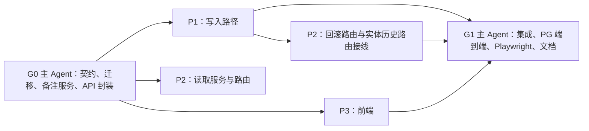

# 世界编辑历史元数据 — 并行实施 Handoff

本文件是本任务唯一的主记录，用于让没有参加原对话的工程师或 Agent 接手。

- §5–§7 的接口和工作流是**待实现的合同**，不是当前已有的能力。
- §3 的代码事实和行号核实于 `main@94f7ba64b`。恢复时先抽查，再使用。
- §4 记录了整条路线图的讨论结论，后续阶段新建任务时从那里引用。

## 1. 恢复快照

- **实际完成**：G0 + P1 + P2 + P2b + P3 + G1 全部完成（2026-10-04）。集成分支
  `codex/world-edit-history`（worktree `../ai-writing-assist-weh`）提交序列：
  G0 `32277f03f` → P1 合入 `cd85be9ec` → P2 合入 `23314fa82` → P2b `123aff728`
  → 注释同步 `d11d8dca9` → P3 合入 `97e99f5a8` → 词典对齐 → G1 e2e+文档 `e0ba48d0d`
  → 样式 `3f499cad1` → Playwright+修复 `6baf3f11d` → 审查整改 `438457f3f`。
  G1 全部门禁通过（见 §11）；Playwright 抓到并修复真实缺陷：实体备注/按修订恢复/
  地图备注三处前端调用方传 camelCase 而后端 schema 为 snake_case+extra=forbid（一律 422），
  已改为调用方直传 snake_case 并同步单测。
  另完成三分支（weh-p1/p2/p3）双轴复审（§10 末节），整改 `a0a84b089`。
- **当前里程碑**：G1 全部完成，含三轮审查与整改。第三轮 R3-1/R3-2/R3-3 已在 worktree
  整改并通过门禁（§10「第三轮审查整改」、§11），2026-10-04 经用户「整理并提交」授权
  提交为 `e2f10568e`（HEAD）。
- **下一步**：
  1. PR #195 已创建（用户授权推送并走合并流程），按固定 head 走必需 CI，绿后合并。
  2. 阶段 1（势力）另建任务，参照 §4。
- **阻塞**：无。
- **工作区**：
  - 实施在 worktree `/Users/tywww/Desktop/项目/ai-writing-assist-weh`（分支 `codex/world-edit-history`，
    基于 `origin/main@94f7ba64b`）。P1/P2/P3 子 worktree 与子分支已于 2026-10-04 回收
    （均先合入集成分支再删除，无提交丢失）。
  - 主记录随本分支入库（`docs(agent)` 提交），合并后随 PR 落到 main。
- **最后核实**：2026-10-04T15:40+09:00。

## 2. 目标与验收

**目标**：作者在世界设定的各类历史里，能看清什么时候改的、为什么改、当时写到哪一章、改了什么；能安全地把实体恢复到某次改动之前；能从一个入口回看整个世界近期的改动。

**完成条件**：

- 下列历史都显示时间（相对时间，悬停显示绝对时间）和作者能看懂的原因：
  - 实体
  - 世界书页面、模板、简介
  - 地图
- 实体、页面、地图的新记录显示“写到第 N 章时”，没有正文时显示“动笔前”。
- 实体历史：
  - 显示改动了哪些字段。
  - 可以展开对比“这次改动前 ↔ 现在”。
  - “恢复到这次改动前”带领域确认和并发保护；恢复本身也会记一条，可以再撤回。
- 实体、页面、地图的历史都可以事后补写、修改、删除备注。
- 世界页有“改动记录”时间线：
  - 合并三类改动，按时间倒序。
  - 支持按类型筛选、游标翻页。
  - 可跳转到对应对象，返回后恢复原来的状态。
- 实体编辑和采用时打的前置快照如果失败，整个操作一起失败。
- 项目隔离、owner 校验、XSS 安全都成立；只有真正写入成功才提示“已保存”。
- §8 的测试和门禁全部通过，§9 的文档全部同步。

**非目标**：

- §4 路线图的后续阶段：势力账本、方案分支、故事内世界线。
- 在编辑或发布时直接填写备注。
- 改动 Canon 模型；为 Canon 历史做作者入口。
- 时间线收录模板、简介、实体新建、Canon 回退。
- 给地图增加“保存原因”列。
- 按 Scene 回滚的已有疑似问题（见 §10）。

## 3. 已确认事实（main@94f7ba64b）

**三张历史表语义不同。**
- 实体历史存的是**改动前**的快照，快照在更新之前写入（`backend/modules/world/services/core/entity_service.py:574-594`）。
- 页面历史存的是**发布后**的内容（`services/worldbuilding/world_bible_lifecycle_service.py:1705-1740`）。
- 地图历史存的是**保存后**的文档（`map_structure_service.py:471`）。
- 实体详情页现在显示“版本 N · 查看快照”，作者容易误以为看到的是改动后的内容。

**页面历史表在数据库层不可变。** `backend/alembic/versions/20260827_world_authority_phase0.py:437-461` 给 `world_bible_page_revisions`、`world_canon_revisions` 等表加了 `BEFORE UPDATE OR DELETE` 触发器，任何更新都会被拒绝。加列不会触发这个触发器。

**按版本回滚现在绕过了编辑检查。**
- 相关代码是 `entity_revision_service.py:113-182` 的 `rollback_to_revision`，它直接调用 `repo.update`。
- 它跳过了 `WorldEntityService.update` 里的全部检查：编辑基线、Canon 写入门禁、兼容影子保护、别名规范化、升级为正式设定的限制，以及缓存失效、简介失效和角色同步。
- 它会把 status 和整个 `content_json`（包括内部来源标记）一起覆盖回去。
- 底层更新会跳过空值，所以快照里为空的字段恢复不回来。
- 对应路由在 `backend/modules/world/api.py:3668-3684`，用查询参数传 `revision_id`，没有并发校验，也没有测试。
- `frontend-console/api.js` 没有封装这个接口。
- facade 导出了它（`event_facade.py:91`），但 world 模块之外没有调用方。

**快照失败只告警，违反模块规则。** `entity_service.py:583-594` 在手动编辑前打快照时用 `try/except Exception` 吞掉异常，只记 `logger.warning`。这违反了 [backend/modules/world/AGENTS.md](../../../../backend/modules/world/AGENTS.md) 第 15 行：DB flush/commit 异常必须向上传播。`promote()`（约 831-850 行）用的是保存点加尽力而为。`delete()`（约 712 行）的尽力而为在 world README 第 88-93 行有说明。

**`revision_reason` 的实际取值**和 `models/core.py:371-376` 的注释不一致：

| 取值 | 写入位置 |
|---|---|
| `manual_update` | `entity_service.py:580`、`588`、`835`、`844` |
| `manual_delete` | `entity_service.py:716` |
| `focused_completion` | `entity_service.py`；`adoption_package_service.py:1046` |
| `rollback` | 实体回滚 |
| `redundant_alias_resolution` | `review_resolution.py:468` |
| `focused_completion_rollback` | `applied_change_reversal.py:176`、`229-238`；`focused_adoption.py:563` |
| `spreadsheet_migration_rollback` | `author_migration.py:1210` |
| `ai_import` | 只是参数默认值，没有地方显式写入 |

页面历史只有 `legacy_create`、`legacy_update`、`manual_publish` 三种；模板历史只有 `create`、`update`、`restore` 三种。简介、地图、Canon 的历史没有 reason 字段。

**历史接口的返回格式。** `entity_revision_service.py:97-110` 的 `get_revisions` 用 `str(created_at)` 输出时间，不是 isoformat，在 SQLite 下还不带时区。返回的 `EntityRevisionListResponse.items` 是 `list[dict]`（`schemas.py:1762`）。

**地图历史的重复行。** 地图保存产生一条 `saved` 历史，不带 confirmation。整份采用 AI 候选时，候选行也会被改成 `saved`，并带上 confirmation，同一次采用于是有两条记录（`map_structure_service.py:471-480`、`631-648`）。地图的内容保护触发器定义在 `20260908_unified_map.py:111-127`。

**写作进度的数据来源。**
- 正文章节就是 `WritingDraft`（`backend/modules/writing/models.py:32`，`chapter_index ≥ 1`）。
- 现有的 `list_effective_chapter_indices`（`writing/facade.py:180`）会读出全文（`writing/repositories.py:443-481`），这里用太重。
- world 模块已有通过 facade 按需导入 writing 的先例：`world_impact_service.py:80`、`focused_adoption.py:34`。
- `EntityRevision.source_chapter_id` 是指向导入章节的外键。生产代码从不写它，所以它不能当写作进度用。

**仓库里没有项目级的活动日志或编辑日志。** ADR-0013 的 operation receipts 只解决长任务幂等；`DeltaLog` 绑定 Scene 和 AI 抽取，不对外提供；两者都不能复用。所有修订请求里也都没有备注字段。

**前端现状。**

| 位置 | 现状 |
|---|---|
| `frontend-console/vue/views/world/library/WorldEntityDetail.vue:309` | 实体历史用 `toLocaleString` 显示时间和“版本 N”，没有原因，没有恢复按钮 |
| `vue/views/world/bible/useWorldBible.js:2756` | 页面历史只显示 `v{n}` 和原因，不显示时间 |
| `useWorldBible.js:2718-2730` | 模板历史显示英文原因和内容哈希 |
| `useWorldBible.js:1628` | 简介历史不显示时间 |
| `vue/views/map/MapStructureEditor.vue:232` | 地图历史显示时间（`formatDate` 在 `:396`） |
| `vue/views/world/logic/worldEntityHelpers.js:134` | `formatBatchTime` 和 `formatBatchTimeFull`：相对时间和绝对时间，可以复用 |
| `vue/views/writing/versionDiff.js` | `buildVersionDiff` 做纯文本段落对比。`renderVersionDiff` 拼 HTML 字符串，没有生产调用方 |
| `vue/views/writing/components/VersionHistoryDialog.vue:55-80` | 已经用 `{{ }}` 按片段安全渲染对比结果 |

**文件行数和迁移状态。**
- 当前行数：`schemas.py` 5127 行（基线 5138），`useWorldBible.js` 2991 行（告警线 3000），`api.py` 4108 行，`api.js` 3097 行。
- alembic 只有一个 head：`20261004_image_reuse_spreadsheet_merge`。

## 4. 上下文：讨论结论与路线图

### 4.1 起因

作者反馈：种田流、群像小说的主角常掌管大型势力，“势力管理”这类建立在对象管理之上的派生能力要求很高。现有的世界版本又不足以让作者构建多个版本、方便地对比故事走向，也撑不起“多时间线”故事。版本还要带编辑时间等信息，方便作者回想。

`docs/product/user-personas.md` 没有覆盖种田流或势力型作者，这一人群按**产品假设**处理。阶段 1 动工前，按画像文档 §4 的门禁补一份评估。

### 4.2 现状

仓库里**没有**世界级的命名版本或分叉。作者感知到的“分叉”都是局部能力：
- 协作试改的“另试一种改法”（`backend/modules/collaboration/api.py:187`，带 diff、seal、merge）
- Scene 推演分叉
- 世界设计检查点
- RP 分支

ADR-0017 规定 Canon 是单父链，v1 不提供命名分支。

势力方面已有：
- `faction` 和 `organization` 类型
- #190 的“势力成员”分组视图
- `FactionProfile`：只有文本字段和一个没有 schema 的 `resources_json`

势力方面还缺：
- 关系有效期
- 数值账本
- 层级和职位
- 势力面板

`EntityProfileTemplate` 有表，但从来没有接入。

### 4.3 “版本”拆成三条轴

1. **编辑历史**：什么时候改的、为什么改。这是本任务的范围。
2. **故事内时间**：第几章时这件事成立。它是势力管理的地基。
3. **平行分支**，分两种，必须分开建模：
   - **3a 作者方案分支**：几种走向择一采用，属于编辑层，不进正典。
   - **3b 故事内世界线**：重生、平行世界、多周目，每条线都是正典，每章只读本线的事实。

### 4.4 用户裁定（2026-10-04）

- **多时间线**：方案比较和故事内世界线两种都要。先做 3a，3b 另起 ADR；账本设计时预留世界线维度。
- **势力痛点**：数值账本随章节变化、组织架构与职位、产业与建设项目、领地与对外关系变化，四项全选。用户还附了一份关键词清单，映射见 §4.6。
- **方案分支范围**：世界设定加势力账本；正文和大纲不分叉。
- **优先级**：先补编辑历史元数据，也就是本任务。

### 4.5 路线图（后续阶段各自新建任务，并引用本节）

- **阶段 0**：编辑历史元数据（本任务）。
- **阶段 1：势力。** 先写 ADR 和画像评估，内容包括：
  - 字段模板和流派预设包
  - 按章节生效的账本
  - 层级、职位、任期
  - 态度和外交状态
  - 生命周期事件
  - 势力面板、势力表、关系矩阵

  ADR 需先裁定：
  1. **时序事实存放在哪。** 倾向由 world 持有账本、给关系加有效期，以后再迁到 ADR-0017 的 Canon 断言。必须写清它和 continuity 观察事件的权威关系，不能形成第三个平行事实源。
  2. **生效点锚定方式。** 锚到章节 ID 而不是章号，并允许锚到大纲节点或故事内纪年。
  3. **世界线维度。** 预留。
- **阶段 2：方案分支、对比、采用。** 复用协作试改 workspace 的骨架（parent、baseline、revisions、diff、seal、merge），覆盖世界设定和势力账本。正典保持单线，采用时走唯一的准入入口。

  方案元数据包括：名称、说明、分叉点、创建时间和最后编辑时间、创建时写到第几章、状态（进行中、已采用、已搁置）。对比可复用 `versionDiff.js` 和 `collaboration/workspaces.py:254` 的 diff。
- **阶段 3：故事内多世界线。** 需要新 ADR，涉及正典作用域，以及 Evidence 和 Context 的物化规则。
- **阶段 4：派生能力。** 一致性检查、编年史、AI 推演（只出建议）。

### 4.6 用户关键词清单 → 能力映射（阶段 1 起）

| 关键词簇 | 映射 |
|---|---|
| 国家、帝国、门派、公会、家族、公司… | 仍用 faction / organization 类型，加一个“形态”字段。按流派提供预设字段包，例如修仙（弟子、灵石、传承）、王国（人口、兵力、税粮）、末日（幸存者、弹药、净水）、公司（市值、安保）。这对应关键词里的“模组”和“数据驱动” |
| 领袖、成员、职位、忠诚、声望 | 隶属层级；职位、任职人、任期。忠诚记在成员关系上，声望记在势力字段上，都按章节变化 |
| 领土、资源、军队 | 领土 = 控制关系（带有效期），显示为地图图层，接入 `LocationProfile.controlling_faction_ids_json`。资源和军队是账本字段 |
| 好感、敌意、信任、恐惧、中立 | 有向、分级、随章节变化的**态度** |
| 和平、同盟、附庸、战争、停战、贸易、贡品、间谍 | 离散的**外交状态**历程，状态转换只做软提示 |
| 继承、分裂、合并、灭亡、背叛 | 由剧情事件承载的**生命周期变化**。例如灭亡 = 从某章起失效，历史保留。必须和产品层的“合并 / 删除对象”严格区分 |
| 关系矩阵、状态机、事件驱动、时间线 | 某个章节时点的关系矩阵；账本条目挂在章节或事件上 |
| 存档、版本、原型、迭代、测试 | 阶段 0 和阶段 2 |
| 调试 | 一致性检查：账本矛盾、已灭亡的势力仍出场、任期重叠、正文数字与账本冲突。只给提示 |
| AI、模拟 | 复用前瞻和推演能力，只出建议。**行为树、效用 AI、数值平衡属于游戏引擎机制，不做**；“平衡”只落成实力对比视图 |
| 选择、后果、伏笔、反转、POV、传闻、档案 | 选择和后果对应方案分支；伏笔和反转对应 `hidden_truth`、`reveal_level`；POV 和传闻对应知识边界和 `public_info` |
| 编年史、势力表、关系图、事件链 | 编年视图、可编辑的势力表、关系矩阵或关系图、基于 `caused_by_event_id` 的因果链 |

## 5. 固定产品行为（阶段 0）

### 5.1 历史显示

- **时间**：显示相对时间（刚刚、N 分钟前……），悬停显示完整时间。
- **原因**：用作者语言显示（词典见 §6.5）。遇到不认识的原因一律显示“其他改动”，不显示英文或内部枚举。
- **写作进度**：显示“写到第 N 章时”，没有正文时显示“动笔前”。功能上线前的旧记录为 NULL，不显示，也不伪造回填。这个值的含义是“保存时写到第几章”，不是剧情发生在第几章。
- **不显示**：raw ID、内容哈希、Canon 术语。
- **实体历史按“一次改动”讲**，去掉“版本 N”的编号。
  - 每条显示：改动了哪些字段、备注。
  - 展开后对比“这次改动前 ↔ 现在”。文本字段的对比用共享组件 `VersionTextDiff`。
- **改动字段的推算**：没有保存时记录（`change_summary` 为空）的旧记录或其他写入路径，由后端额外读取一条相邻记录来推算，界面标为“大致”。
- **页面历史**：显示与上一版相比的改动和备注。
- **模板和简介历史**：只补时间和原因（简介没有原因字段，只显示时间）。
- **地图历史**：补写作进度和备注；时间改用共享的格式化函数。

### 5.2 恢复实体到某次改动前

- **入口**：实体历史里每条记录上的“恢复到这次改动前”。已移除的实体不显示这个按钮，提示先把对象恢复回来。
- **确认流程**：
  1. 先复用 `worldEntityOps.js:996` 的 `confirmEditorialImpact` 做影响确认。
  2. 再展开 Vue 确认区（不拼 HTML），列出：将改回哪些字段（快照与当前逐字段比较）、状态保持不变、恢复后会多一条记录且可以再撤回。
- **恢复哪些字段**：
  - 恢复：类型、名称、简介、公开信息、作者秘密、`content_json`、重要程度、揭示程度。`content_json` 去掉快照里的内部来源标记，再合并当前的来源标记。
  - **不恢复 status。**
  - 快照里为空的字段会被清空。只允许清空三个可空列（`models/core.py:60-74`）。
- **实现**：统一走 `WorldEntityService.update()`，所以全部编辑检查和失效链都照常执行。
  - 带上 `expected_updated_at`，基线过期返回 409，界面提示“这个设定刚在别处改过，已重新读取，请再确认一次”，并重新加载。
  - Canon 门禁的拦截原样返回，界面给出作者能看懂的说明。
  - 别名冲突原样提示。
- **结果**：只有接口真正成功后才提示“已恢复，并记下了这次恢复”。恢复前的快照 reason 为 `rollback`，并记录 `restored_from_revision_id`。
- **保留不动**：按 Scene 回滚的入口（`worldEntityOps.js:975`，`WorldEntityCollection.vue:373`、`384`）。

### 5.3 备注

- 实体、页面、地图历史上的每一条都可以事后补写、修改、删除备注。
- 备注最多 500 字，去掉首尾空白；空串表示删除。
- 地图只有已保存的版本能写备注。
- 备注不进入快照、摘要或 Canon receipt。
- 保存成功后提示“备注已保存”；失败时保留输入，并提示失败。

### 5.4 世界改动记录

- **入口**：世界页头的次级按钮“改动记录”，打开一个浮层，参照压力报告浮层（`WorldView.vue:53-57`、`105`）。
- **内容**：合并三类记录，按时间倒序排列。
  - 实体改动：已移除的实体标注“已移除”，链接仍然可用。
  - 世界书页面发布。
  - 地图保存：只取已保存且没有确认标记的版本。
- **筛选**：全部、设定、世界书、地图。
- **加载**：用游标翻页加载更多。
- **跳转**：
  - 实体：打开详情页，展开历史并高亮对应那条（深链 `open=history&revision_id=`）。
  - 页面：调用 `openPageHistory(version)`。
  - 地图：使用 `MapWorkspaceView.vue:324` 已支持的 `node_id` 和 `revision_id`。
- **返回恢复**：路由带上 `open=change-history`。筛选条件、已加载的条目、游标和滚动位置按作品存进 `worldSession`。切换作品时清掉旧状态，迟到的响应不能覆盖新的查询。
- **异常状态**：
  - 加载失败：显示错误和重试按钮，不拿别的列表冒充。
  - 空态：显示“还没有改动记录”。
  - 窄屏：可用，按钮和键盘都能操作。

### 5.5 失败语义

- **编辑和采用**：前置快照失败时整体失败，实体保持不变。去掉 `update()` 里的 `try/except`；`promote()` 去掉尽力而为，reason 改为 `manual_promote`。
- **删除**：删除前的快照保持尽力而为。理由：删除只是把状态改成 deprecated，内容还在原行里，不能因为历史写失败就拦住删除。README 写明这一点，并补测试。
- **写作进度查询**：出错时直接抛出，不吞异常。

## 6. 共享接口合同

由 G0 在真实代码中定下来，并写进 P1、P2、P3 的派工说明。工作流发现合同有问题时，先交主 Agent 修订，再统一同步。

### 6.1 数据库

新迁移文件：`backend/alembic/versions/20261005_world_revision_metadata.py`，`down_revision` 指向落地时的唯一 head（当前是 `20261004_image_reuse_spreadsheet_merge`）。

| 表 | 变更 |
|---|---|
| `entity_revisions` | 新增 `writing_chapter_index` Integer NULL，约束 `ck_entity_revisions_writing_chapter_index_nonneg`（为空或 ≥ 0）<br>新增 `change_summary` JSON NULL，形如 `{"fields": [...], "restored_from_revision_id": "..." \| null}`<br>新增索引 `ix_entity_revisions_novel_created (novel_id, created_at, id)` |
| `world_bible_page_revisions` | 新增同名列、约束和索引。只在插入时写入 |
| `map_atlas_revisions` | 新增同名列、约束和索引<br>重建 `protect_map_revision_content`，把新列纳入保护 |
| `world_revision_notes`（新表） | 列：`id`、`novel_id`（外键到 projects，随作品级联删除）、`target_kind` String(16)（CHECK 约束只能是 entity / page / map）、`revision_id` UUID、`note` Text、`created_at`、`updated_at`<br>`revision_id` 不加外键，因为它同时指向三张表<br>唯一约束 `uq_world_revision_notes_target (novel_id, target_kind, revision_id)` |

- downgrade 按相反顺序撤销。
- ORM 同步修改：`world/models/core.py`（加 `WorldRevisionNote`，并修正 reason 注释）、`models/__init__.py`、`models/worldbuilding.py:153`、`map_atlas_models.py:279`。
- 用 `alembic check` 确认 ORM 与迁移完全一致。

### 6.2 后端 schema

新文件 `backend/modules/world/revision_history_schemas.py`，先例是 `relation_schemas.py`。

**枚举类型**

- `RevisionTargetKind = Literal["entity", "page", "map"]`
- `EntityRevisionField`，Literal，取值：
  - `entity_type`
  - `name`
  - `summary`
  - `public_info`
  - `hidden_truth`
  - `aliases`
  - `content`
  - `importance`
  - `reveal_level`
  - `status`

**实体历史**

- `EntityRevisionSnapshotView`：带类型的快照，去掉内部来源标记。
- `EntityRevisionItem`，字段：
  - `revision_id`
  - `entity_id`
  - `revision_reason`
  - `created_at`：带时区的 datetime；SQLite 读出的无时区值统一补 UTC
  - `writing_chapter_index`：可空
  - `change_note`：可空
  - `changed_fields`：`list[EntityRevisionField]`，可空
  - `changed_fields_exact`：bool
  - `restored_from_revision_id`：可空
  - `snapshot`
  - `can_restore`
- `EntityRevisionListResponse`，从 `schemas.py:1762` 移过来，字段：
  - `items`
  - `total`
  - `skip`
  - `limit`
  - `current_updated_at`

**请求体（都禁止额外字段）**

- `EntityRevisionRollbackRequest`：`revision_id`、`expected_updated_at`，两者都必填。
- `RevisionNoteUpdateRequest`：`target_kind`、`revision_id`、`note`。
  - `note` 去掉首尾空白，最多 500 字。
  - 空串表示删除。

**其他响应**

- `RevisionNoteResponse`：`target_kind`、`revision_id`、`note`（可空）、`updated_at`。
- `WorldChangeHistoryItem`，字段：
  - `kind`
  - `revision_id`
  - `target_id`
  - `target_title`
  - `target_state`：`Literal["active", "removed"]`
  - `reason`：可空
  - `created_at`
  - `writing_chapter_index`
  - `version_number`：可空
  - `changed_fields`：可空
  - `change_note`：可空
- `WorldChangeHistoryResponse`：`items`、`next_cursor`（可空）。

**现有 schema 的增量（新增字段都可选）**

- `WorldBiblePageRevisionResponse`（`schemas.py:3604`）：增加 `writing_chapter_index`、`change_note`、`changed_fields`。
- `MapRevisionResponse`（`map_structure_schemas.py:302`）：增加 `writing_chapter_index`、`change_note`。

### 6.3 函数签名

```python
# backend/modules/writing/facade.py（经 repositories/services 实现；按章节号倒序分批找第一章有实质正文的章节）
async def get_latest_effective_chapter_index(db, novel_id: str) -> int  # 0 = 尚无正文

# backend/modules/world/services/common.py（按需导入 writing facade）
async def current_writing_chapter_index(db, novel_id) -> int

# entity_revision_service.py
EntityRevisionService.create_snapshot(..., writing_chapter_index=UNSET) -> dict  # 含 revision_id；UNSET 时自行查询
EntityRevisionService.record_change_summary(db, revision_id, fields, restored_from_revision_id=None) -> None
EntityRevisionService.get_revisions(db, entity_id, novel_id, skip, limit) -> EntityRevisionListResponse

# entity_service.py
WorldEntityService.update(..., _revision_reason=..., _restored_from_revision_id=None, _clear_fields=frozenset())
WorldEntityService.rollback_to_revision(db, entity_id, revision_id, *, novel_id, expected_updated_at) -> CoreEntityResponse

# backend/modules/world/services/revision_notes.py（新）
async def load_revision_notes(db, novel_id, kind, ids) -> dict[uuid.UUID, str]
async def set_revision_note(db, novel_id, kind, revision_id, note) -> RevisionNoteResponse

# backend/modules/world/services/revision_history_service.py（新）
WorldChangeHistoryService.list(db, *, novel_id, kinds, cursor, limit) -> WorldChangeHistoryResponse
```

**签名约定**

- `_` 开头的参数只在内部使用，不出现在任何公开请求 schema 里。
- `_clear_fields` 只允许三个可空列。

**`event_facade.py` 的兼容处理**

- `get_entity_revisions` 继续向外返回 dict。
- `rollback_to_revision` 改为调用新方法，`expected_updated_at` 改为必填的关键字参数。
- 同步修改 `backend/tests/unit/test_facade_public_api.py:81`。

**批量调用方**

下列调用方在循环之前只查一次写作进度，再传进去：
- `adoption_package_service.py:1041-1048`
- `applied_change_reversal.py:229`、`237`
- `focused_adoption.py:563`
- `author_migration.py:1210`
- `review_resolution.py:468`

不使用会话级缓存。

### 6.4 路由

| 方法与路径 | 合同 |
|---|---|
| `GET /api/world/entities/{id}/revisions` | 沿用现有参数，响应改为 `EntityRevisionListResponse` |
| `POST /api/world/entities/{id}/rollback-by-revision?novel_id=` | 请求体为 `EntityRevisionRollbackRequest`，删除查询参数 `revision_id`。成功返回 `CoreEntityResponse`。状态码：<br>• 版本不属于这个实体或作品：404<br>• 基线过期：409，沿用 `update()` 现有的错误<br>• Canon 门禁拦截：409<br>• 缺少字段：422 |
| `PUT /api/world/revision-notes?novel_id=` | 请求体为 `RevisionNoteUpdateRequest`，返回 `RevisionNoteResponse`。状态码：<br>• 目标不属于这部作品：404<br>• 地图候选版本：422 或 409，实现时固定一个并写进 README<br>重复写入同样内容是幂等的 |
| `GET /api/world/change-history?novel_id=&kinds=&cursor=&limit=` | `kinds` 可以重复传；`limit` 范围 1–50，默认 30。按 `(created_at, kind, id)` 倒序用游标翻页，每次多取一条判断是否还有下一页。游标是不透明的 base64 JSON，格式不对返回 422。不返回总数 |

**所有路由共同的要求**

- 都通过 `ActiveNovelIdQuery`（`api.py:393`）校验当前账号与项目 owner。
- 查询的两端都带 `novel_id` 过滤。

**时间线的实现方式**

- 在 SQL 里把三段查询 `UNION ALL` 起来，再 LEFT JOIN 备注表。
- 不做逐条查询，不在前端拉全量数据。

### 6.5 前端 API 与词典

**API 封装**

在 `frontend-console/api.js` 和 `apiContracts.js` 中新增以下四个方法，并在 `frontend-console/tests/setup.js` 里补对应的 mock：

- `world.getEntityRevisions(id, novelId, {skip, limit})`
- `world.rollbackEntityToRevision(entityId, {revisionId, expectedUpdatedAt}, novelId)`
- `world.setRevisionNote({targetKind, revisionId, note}, novelId)`
- `world.listWorldChangeHistory(novelId, {kinds, cursor, limit})`

**原因词典**（放在 `frontend-console/shared/revisionHistory.js`）

| 内部取值 | 作者看到的文字 |
|---|---|
| `manual_update` | 手动编辑 |
| `manual_promote` | 采用为正式设定 |
| `focused_completion` | 采用了 AI 补全 |
| `focused_completion_rollback` | 撤销了 AI 补全 |
| `rollback` | 恢复到旧版本 |
| `manual_delete` | 移除了这个设定 |
| `redundant_alias_resolution` | 整理了重复别名 |
| `spreadsheet_migration_rollback` | 撤销了表格导入 |
| `ai_import` | 导入时记录 |
| `manual_publish`（页面） | 发布了这一版 |
| `legacy_create`（页面） | 最初版本 |
| `legacy_update`（页面） | 早期更新 |
| `create`（模板） | 新建模板 |
| `update`（模板） | 修改模板 |
| `restore`（模板） | 恢复旧版模板 |
| 其他任何取值 | 其他改动 |

字段名沿用现有界面的叫法，例如 `hidden_truth` 显示为“作者秘密”。

## 7. 并行实施顺序与写入归属

**执行方式**

- 按用户的全局规范：任务包交给 `model: sonnet`、effort=max 的子代理执行；主 Agent 审查每个包的产出，再验收集成。
- 实际启动子代理、提交、推送、合并，都按执行时用户的授权办理。本记录不构成新的授权。

**工作区**

- 默认做法：G0 完成后，经用户授权，在主题分支上本地提交，作为各包共同的基线；每个包从这个提交建独立的 worktree。
- 没有拿到提交授权时：在单一 worktree 里按文件归属分工，参照 #190 的先例。包之间不能改同一个文件。



### G0：主 Agent 串行准备

1. 读本记录、根目录和 world 模块的 `AGENTS.md`、`backend/modules/world/README.md`、`development-guide.md`、`testing-guide.md`。
2. 跑 `make docs-check`。
3. 确认 `uv run alembic heads` 只有一个 head。
4. 写入并确认以下合同：
   - §6.1 的迁移和 ORM
   - §6.2 的 schema
   - `services/revision_notes.py`，及测试 `backend/modules/world/tests/test_revision_notes.py`
   - §6.5 的 `api.js`、`apiContracts.js`、`tests/setup.js` 的 mock
5. 把 §6.3 的签名逐字写进 P1、P2、P3 的派工说明。

**放行条件**：迁移能干净升级和降级；`alembic check` 一致；备注服务的测试通过；合同样例可以校验。

### P1：后端写入路径（子代理）

| 项 | 内容 |
|---|---|
| 写入范围 | writing 模块：`backend/modules/writing/repositories.py`、`services.py`、`facade.py`<br>world 模块：`services/common.py`、`services/core/entity_revision_service.py`、`services/core/entity_service.py`、`services/worldbuilding/world_bible_lifecycle_service.py`、`map_structure_service.py`<br>五个批量调用方（见 §6.3）、`event_facade.py`<br>以及对应的单元测试和模块测试 |
| 任务 | 新增写作进度查询并在写入时落库；保存时记录改动字段；页面在读取时计算与上一版的差异；`update()` 增加内部参数，快照失败时不再吞掉；`promote()` 改为失败即中止；新的 `rollback_to_revision`，删除旧实现；`get_revisions` 改为强类型输出，并批量读取备注；页面和地图的列表补上备注 |
| 依赖 | G0 |
| 交付 | 可审查的 diff，以及测试结果 |

### P2：后端读取与路由（子代理）

| 项 | 内容 |
|---|---|
| 写入范围 | `backend/modules/world/services/revision_history_service.py`（新文件）、`backend/modules/world/api.py`、`backend/modules/world/map_atlas_api.py`<br>测试：`test_entity_rollback_by_revision.py`、`test_world_change_history.py` |
| 依赖 | 时间线路由和备注路由只依赖 G0，可以先做；回滚路由和实体历史路由要等 P1 合入后再接 |

### P3：前端（子代理）

| 项 | 内容 |
|---|---|
| 写入范围 | 见下方文件清单 |
| 依赖 | 只依赖 G0 的 mock，可以和 P1、P2 并行 |
| 交付 | Vitest 结果；如有条件，补一份基于合成 API 的交互证据 |

**新增文件**
- `frontend-console/shared/revisionHistory.js`
- `frontend-console/vue/components/VersionTextDiff.vue`：从 `VersionHistoryDialog.vue:55-80` 抽出来，写作模块的版本对话框也改为使用它
- `vue/views/world/library/WorldEntityRevisionHistory.vue`：替换 `WorldEntityDetail.vue:309` 的内联历史，以及 `loadInfo` 中加载历史的那部分
- `vue/views/world/bible/worldBibleHistory.js`：从 `useWorldBible.js` 拆出页面、模板、简介三种历史弹窗，内容先经 `esc` 转义，再交给 `showModalHtml`
- `vue/views/world/components/WorldChangeHistory.vue`

**迁移的文件**
- `vue/views/writing/versionDiff.js` 移到 `frontend-console/shared/versionDiff.js`，同时修改 `useWritingWorkspace.js:22` 和 `tests/writing/versionDiff.test.js` 的引用路径

**修改的文件**
- `useWorldBible.js`：拆分后回到 3000 行以下
- `vue/views/writing/components/VersionHistoryDialog.vue`
- `vue/views/world/library/WorldEntityDetail.vue`
- `vue/views/world/logic/worldEntityHelpers.js`：`formatBatchTime` 改为调用共享函数
- `vue/views/map/MapStructureEditor.vue`
- `vue/views/world/WorldView.vue`
- `vue/worldIsland.js`：在 318-341 行附近解析深链
- `vue/views/world/worldSession.js`
- 上述文件对应的 Vitest 测试

**禁止**：动态 `v-html`；从 bridge 之外访问 API 或全局对象。

### G1：主 Agent 集成与验收

- 审查 P1–P3 的 diff，按 P1 → P2 → P3 的顺序集成。
- 去掉开发期用的业务替身，接上真实 API 联调。
- 补写 PG 端到端测试和 Playwright 测试（§8）。
- 同步文档（§9），跑全部门禁。
- 做一次独立审查，并整改发现的问题。

## 8. 测试与门禁

### 后端（SQLite 模块级）

测试替身一律用 `patch.object(..., autospec=True)`；生产代码里不出现 Mock。

| 测试文件 | 覆盖点 |
|---|---|
| `backend/modules/writing/tests/test_latest_effective_chapter_index.py`（新） | 没有正文时返回 0；只有空白的稿件不算；返回最大的章节号 |
| `backend/modules/world/tests/test_entity_revision_history.py`（新） | 时间带时区；改动字段识别（别名单独拆出，忽略内部来源标记，没有改动时返回空）；写作进度；旧记录标为“大致”；同一时间戳的排序 |
| `test_entity_rollback_by_revision.py`（新） | 成功恢复，原本为空的字段会被清空；status 不变；来源标记保留；写入 rollback 记录并带 `restored_from_revision_id`；基线过期返回 409 且没有写入；缺少基线返回 422；跨实体、跨作品返回 404；非作品 owner 被拒；Canon 门禁返回 409；改类型时缓存失效 |
| `test_entity_snapshot_fail_closed.py`（新） | 编辑和采用在快照失败时整体失败，实体不变；删除仍然成功 |
| `test_revision_notes.py`（新，G0） | 三种目标类型；跨作品返回 404；地图候选被拒；超长返回 422；空串删除；重复写入幂等 |
| `test_world_change_history.py`（新） | 三类混排；同一时间戳时排序稳定；游标翻页不重不漏；按类型筛选；作品之间隔离；地图只取已保存行；带上备注；已移除对象的标注；坏游标返回 422；查询次数恒定 |

另外：
- **扩展现有测试**：`test_world_bible_v2.py` 和 `test_map_structure.py`，覆盖写作进度、备注、改动字段。
- **同步修改现有测试**：
  - `backend/tests/unit/test_world_services_revision_event_helpers.py:240-350`
  - `test_event_facade.py:236-260`
  - `test_facade_public_api.py:81`

### PG 端到端

新文件 `backend/tests/e2e/test_world_revision_history_pg.py`，覆盖：
- 加列后，页面历史表仍然拒绝 UPDATE。
- 地图的保护触发器覆盖新列。
- 时间线的 `UNION ALL` 和游标在 PG 上正确。
- 两个请求用同一基线并发回滚：一个成功，一个 409。
- 并发写同一条备注。

另外运行 `test_00_fresh_migrations.py`。阶段 0 暂不把新测试加入 `Makefile` 的 PG critical 列表，避免牵动四份治理文档。

### 前端

**Vitest 新增**
- `tests/shared/revisionHistory.test.js`
- `VersionTextDiff`：断言不使用 `v-html`
- `WorldEntityRevisionHistory`
- `WorldChangeHistory`
- 世界书历史拼装：加入 `tests/xss-rendering.test.js`

**Vitest 同步修改**
- `MapStructureEditor.test.js`
- `WorldEntityDetail.test.js`
- `worldIsland.test.js`
- `versionDiff.test.js`
- `api-contract.test.js`

**Playwright**
- `frontend-console/e2e/world.spec.js` 增加一条完整流程：编辑 → 历史里看到时间、原因、改动字段 → 补备注 → 确认恢复 → 打开改动记录 → 跳转 → 返回后状态恢复。
- 地图相关的检查并入 `map-structure.spec.js`。

### 门禁命令

```
make docs-check
cd backend && uv run alembic heads
make test TESTS="<新增与修改的测试>"
make lint && make format
make test-ci TEST_WORKERS=2
E2E_DATABASE_URL=<专用库> make test-e2e TESTS="tests/e2e/test_world_revision_history_pg.py tests/e2e/test_00_fresh_migrations.py"
make test-postgresql-critical
npm --prefix frontend-console run lint
make test-frontend
DATABASE_URL=<专用库> PW_REUSE_EXISTING_SERVER=0 npm --prefix frontend-console run test:e2e:functional -- world.spec.js map-structure.spec.js --workers=1 --retries=0
make repo-gates
make docs-check BASE_REF=origin/main
git diff --check
```

专用库只用本任务新建、确认可以丢弃的 PG 库，不碰共享库或真实数据。

## 9. 需同步的权威文档

**world 模块**
- `backend/modules/world/README.md`：
  - 581-594 行的路由表
  - 451-464 行的表清单
  - 88-93 行的快照语义：编辑和采用改为失败即中止，删除保持尽力而为
  - 636-640 行的 `EntityRevisionContract`
  - 780-782 行的 facade 列表
- `backend/modules/world/contracts.py:186` 的 docstring，`models/core.py` 的注释

**模块文档**
- `docs/modules/02_world.md`：历史与恢复的语义，改动记录
- `docs/modules/15_map.md`：写作进度与备注
- `docs/modules/11_writing.md`、`backend/modules/writing/README.md`：新增的 facade 函数
- `docs/modules/14_frontend.md`、`frontend-console/README.md`：API 封装、深链、共享模块

**全局文档**
- `docs/01_数据库设计.md`：新列、新表、索引、约束
- `CONTEXT.md` 第 24 行“实体修订”：改为“改动前快照，带写作进度和备注”
- `docs/核心业务场景与预期行为.md`：新增“作者回想并恢复”场景（593 行附近）
- `frontend-console/docs/frontend-backend-gap-analysis.md:75`：按版本回滚现在有前端在用

具体是否需要更新，以 `docs/architecture/documentation-maintenance.md` 和 `architecture-documents.toml` 的判定为准。

## 10. 决策、发现与风险

### 决策

**2026-10-04 · 地图候选版本写备注返回 409（G0 落定 §6.4 的二选一）**

- 理由：候选版本不是已保存的地图状态，属状态冲突而非参数错误；`ConflictError` 语义更准。
- 影响：`revision_notes.py` 抛 409，测试已覆盖；README 路由表在 G1 文档同步时记录。

**2026-10-04 · P1 集成时的两项裁定（主 Agent）**

- 地图修订列表不带 `changed_fields`：§6.2 给 `MapRevisionResponse` 的增量只有
  `writing_chapter_index`/`change_note`，DISPATCH P1 第 7 条“地图列表计算差异”是派工表述笔误
  （§5.1 只要求页面历史显示差异，地图只补进度与备注）；按 §6.2 执行，P1 实现正确。
- `delete()` 的尽力而为 try/except 会连同写作进度查询失败一起吞掉：与 §5.5“删除保持尽力而为”
  一致，按尽力而为处理并在代码注释标明；写入路径（编辑/采用）不受影响。
- 另：`revision_reason` 的 ORM/迁移注释随 `manual_promote`（P1 新增写入路径）同步补齐。

**2026-10-04 · 删掉“Canon 历史列表”**

- 理由：页面发布会同时产生一条页面历史和一条 Canon 历史。作者需要的“发布记录”已经由页面历史承载；单独展示 Canon 链会重复，还会暴露内部术语。
- 影响：Canon 回退保留在后端，不做作者入口。

**2026-10-04 · 备注只支持事后补写**

- 理由一：页面历史表在数据库层不可变。
- 理由二：页面发布走 Canon 准入，输入会被冻结并计算摘要。
- 影响：编辑或发布时填写备注放到后续阶段。

**2026-10-04 · 默认决定（无需再确认）**

- 恢复时不恢复 status。
- 删除前的快照保持尽力而为。
- 地图的“保存原因”列放到后续阶段。
- 时间线不收录模板和简介。
- 新的 PG 测试不加入 critical 列表。
- 被 Canon 门禁拦下的恢复，只给说明。
- 已移除的实体隐藏恢复按钮。

### G1 独立审查结论与整改（2026-10-04，提交 `438457f3f`）

审查（只读子代理，origin/main...HEAD 全量 diff）结论：0 blocker / 2 major / 3 minor，全部整改：

- **[major] 页面备注无前端写入入口** → 页面历史弹窗补齐补写/编辑/删除备注交互
  （与实体/地图一致：500 字、空串删除、失败保留输入），并补显示写作进度；单测覆盖。
- **[major] 并发首次补写同一条备注撞唯一约束 500** → `set_revision_note` insert 路径
  savepoint 包裹，IntegrityError 转更新先落库行；PG e2e 新增双连接真并发备注测试。
- **[minor] queryString 数组逗号拼接在 FastAPI `list[Literal]` 下 422**（我此前
  「逗号实测通过」的记录被 novel 404 依赖掩盖，已勘误）→ 数组序列化为重复键。
- **[minor] can_restore 与时间线「已移除」口径不一** → 统一为作者态 archived 集合
  （deprecated/ignored/merged 等不提供按修订恢复），单测覆盖三状态。
- **[minor] 并发回滚 409 用顺序冒充** → PG e2e 新增双连接行锁真并发测试
  （恰好一胜一 409，胜者结果保留）。

审查同时确认无问题：四路由 novel_id 隔离、UNION 两端过滤、地图候选 409、
fail-closed 快照、迁移对称性、游标三键互补、前端无 v-html、备注双检、
迟到响应 epoch 丢弃、深链与 session 恢复链路。

### 风险

- **迁移 head 可能冲突。** 另有合并任务在进行，落地前要重新确认。
- **失败即中止会暴露以前被吞掉的错误。** 前端只在真正成功时提示，这一点符合规则，但上线后要观察报错量。
- **时间线不可见的改动。** 实体新建、Canon 回退、模板和简介的改动都不在时间线里；地图也无法区分手动保存、恢复和采用。界面文案不宣称“全部改动”。
- **备注表没有外键。** 物理删除实体后会留下孤立的备注；示例项目复制时不会带上备注。
- **疑似问题（未确认）：按 Scene 连续回滚两次，第二次可能什么都不恢复。** 现象与存档中的 `rollback` 行有关。本次没有复现，建议另开任务复核。

### 三分支双轴复审与整改（2026-10-04，提交 `a0a84b089`）

用户要求对三条并行分支 `codex/weh-p1` / `codex/weh-p2` / `codex/weh-p3` 各跑
Standards + Spec 双轴审查（code-review skill，6 个并行子代理，基线
`origin/main@94f7ba64b`；三分支共享 G0 提交 `32277f03f`）。发现按对照集成分支核实分流：

- **分支单独看是问题、集成后已消解（不另改）**：P1 期 api.py 引用已删方法与
  `test_entity_rollback_snapshot` 绕行 facade（计划内过渡态，P2 接线后
  `test_entity_rollback_by_revision.py` 恢复 HTTP 断言）；schemas.py 旧
  `EntityRevisionListResponse` 未删（集成时已删）；README/02_world.md 未收录
  change-history/revision-notes 路由（G1 §9 已同步）；P3 camelCase payload
  （`6baf3f11d` 修复，根因是 G0 派工签名 camelCase vs schema snake_case 的合同自相矛盾）；
  queryString 数组逗号拼接（`438457f3f` 修复）。
- **本轮整改（`a0a84b089`）**：
  1. 改动记录时间线地图段 `target_status` 恒 NULL → `_target_state(None)="removed"`
     → 每条地图保存都被 `WorldChangeHistory.vue` 渲染「已移除」pill（真实缺陷，
     无测试拦截）。改为 join `MapAtlasNode.status`：节点缺失才 removed，
     补 `test_map_target_state_removed_when_node_deleted` 用例。
  2. `WorldChangeHistory` 模态未接 `useModalDialog`：无焦点移入/Tab 陷阱/入口
     焦点归还，违反 frontend-console/README 共享模态契约。已接入（Escape 顺带
     归栈路由）并补模态语义测试。
  3. §8 点名的 `WorldEntityDetail.test.js` 未同步修订历史断言，已补（面板默认
     收起不发请求、展开按 entity+project 读取、restored 转发 refresh）。
- **判断题 smell（记录不改）**：测试 `_make_entity` 三份重复、备注编辑草稿/限长/
  失败保留逻辑在 entity/map 两组件重复（可提 composable）、`_NOTE_KINDS` 与
  `CHANGE_HISTORY_KINDS` 同形、schema 与服务双层 strip 限长、UNSET 哨兵
  `type: ignore`、xss 测试复制 esc 实现而非导入。均延续仓库既有惯例或属低价值
  抽象，不在过检前夜扩大改动面。
- **Spec 轴结论**：P1 忠实实现（§6.3 签名逐字一致；focused_adoption/
  author_migration 经 `reverse_applied_changes` 间接路径已满足单次查询）；
  P2 除地图 target_state 外游标三键互补/坏游标 422/limit 1–50/地图 saved+无
  confirmation 过滤全部符合；P3 原因词典 16 词条逐字一致、worldSession/深链一致。

### 第三轮只读审查（2026-10-04，主会话，HEAD `a0a84b089`，未改代码）

- **R3-1 [中] 恢复确认区与「这次改动前 ↔ 现在」对比的「其他资料」判定错误。**
  后端 `_snapshot_view` 从快照 `content_json` 去掉了 `aliases`（`entity_revision_service.py:123`），
  前端 `normalizeJson` 只去 `_meta`/`updated_at`（`WorldEntityRevisionHistory.vue:273`），
  当前实体的 `content_json.aliases` 仍在。后果：有别名的实体，即使快照和当前完全一致，
  确认区也列出「其他资料」；`compareRows` 又过滤掉 JSON 字段（`:284`），只改了其他资料的
  修订展开后显示「这份快照与当前内容一致。」（`:63`）。违反 §5.2 逐字段比较和 §5.1 对比。
  单测夹具把 aliases 放在快照 `content_json` 里，和后端真实形态不符，所以没拦住。
  已用临时 vitest 复现（用后删除）。
- **R3-2 [中] 批量路径逐条查写作进度，违反 §6.3。** `adoption_package_service.py:741` 和
  `author_migration.py:1010` 在循环里调 `update(_automated=True)`，`update()` 内部
  `create_snapshot(UNSET)` 每项都查一次写作进度；前者 `:708` 已在循环前算好，但 `update()`
  没有参数可以传入。叠加 `get_latest_effective_chapter_index` 首批 `batch_size = 50`
  （`writing/repositories.py:505`）：最新章有正文时也会一次读出最多 50 章正文。
  表格迁移 N 行 = N ×（2 次查询 + 最多 50 章正文），都在同一事务里。第二轮 Spec 结论
  只核对了 `reverse_applied_changes` 的撤销路径，漏了正向路径。
  建议：`update()` 增加内部参数 `_writing_chapter_index=UNSET`，透传给 `create_snapshot`；
  两处循环传入循环前查好的值；首批缩小（例如 1 起步、逐批放大）。
- **R3-3 [低] 时间线为回退标题读出整份快照。** `revision_history_service.py:131`、`:167`
  每行都带出实体快照或页面 `snapshot_json`（含正文和分区），只为目标行缺失时取 name/title。
  可改为只取 JSON 路径。
- **复核无问题**：四条路由的 `novel_id`/owner 校验，UNION 两端过滤，迁移对称性，
  失败即中止的快照，并发备注和并发恢复，游标，前端无动态 `v-html`，弹窗 `esc`，
  深链（归档页面经 `state: 'archived'` 回退可达）。
- **复验**：后端定向 7 个文件 59 passed；前端定向 4 个文件 42 passed。

### 第三轮审查整改（2026-10-04，主会话，基于 `a0a84b089`，已提交 `e2f10568e`）

- **R3-1 已修**：`WorldEntityRevisionHistory.vue` 的 `normalizeJson` 与后端快照视图同口径，
  去掉 `_meta`/`aliases`/`updated_at`；比较改用键序无关的 `stableStringify`；对比区新增
  「其他资料」行（`AssistantValue` 渲染前后值，不展示 `_meta` 和别名）。单测夹具改为后端
  真实形态（快照 `content_json` 不含 aliases，当前实体带 aliases/_meta），新增 2 例
  （一致快照 + 键序不同 → 不误报；只改其他资料 → 对比和确认区都列出）。旧组件下 2 例失败。
- **R3-2 已修**：`EntityService.update()` 增加内部参数 `_writing_chapter_index=UNSET`，
  透传给 `create_snapshot`。采用包补齐分支传入循环前已算好的值；作者迁移 `_execute_plan`
  在循环前查一次并逐项传入。`get_latest_effective_chapter_index` 批量改为 1、4、16 起步，
  之后每批最多 50。新增回归：作者迁移补 3 个实体只查 1 次（旧代码 3 次）、采用包补齐
  只查 1 次（旧代码 2 次），快照都记录了写作进度；写作模块新增跨批跳过空白章用例。
- **R3-3 已修**：时间线三段改为 `snapshot["name"]` / `snapshot_json["title"]` 的
  `as_string()` JSON 路径取 `snapshot_title`，地图为 `null()`；`_to_item` 直接用
  `title_current or snapshot_title`。悬空实体回退标题由既有单测覆盖，PG 上 UNION 执行由
  e2e 覆盖。
- 未改权威文档：三项都是让实现符合既有合同（§5.1/§5.2/§6.3），文档无相关细节描述。

## 11. 验证证据

**G0（2026-10-04，worktree `ai-writing-assist-weh`，基线 `origin/main@94f7ba64b`）：**

- `make docs-check`：通过（worktree，开工前基线）。
- `uv run alembic heads`：唯一 head `20261004_image_reuse_spreadsheet_merge`（开工前）。
- 一次性 PG 库 `weh_g0_check`（localhost:5207，用后已删）：
  - 全量 `upgrade head` 干净；`downgrade -1` → 再 `upgrade head` 循环干净。
  - `alembic check`：No new upgrade operations detected（ORM 与迁移一致）。
  - 触发器行为：`entity_revisions` 新列可 UPDATE（P1 依赖）；`map_atlas_revisions`
    改 `change_summary`/`writing_chapter_index` 被触发器拒绝；`world_bible_page_revisions`
    加列后 UPDATE 仍被拒绝。
  - `world_revision_notes` 表结构、唯一约束、索引核对无误。
- `uv run pytest modules/world/tests/test_revision_notes.py`：8 passed。
- 受影响回归：`test_entity_rollback_snapshot.py` + `test_world_services_revision_event_helpers.py`
  + `test_facade_public_api.py`（61 passed）；`test_event_facade.py`（8 passed）；
  `test_world_bible_v2.py` + `test_map_atlas.py` + `test_map_structure.py`（93 passed）。
- schema 合同样例校验：RevisionNoteUpdateRequest 的 kind 白名单/UUID 校验/strip→500 顺序、
  EntityRevisionItem/WorldChangeHistoryResponse 构造，全部通过。
- 前端：`tests/api-contract.test.js` + `tests/vue/world/WorldEntityDetail.test.js`：25 passed。
- 后端 ruff check/format：改动文件全部通过。

**G1 集成验收（2026-10-04，分支 `codex/world-edit-history`，提交至 `6baf3f11d`）：**

- 集成顺序：P1 `b2c035644` → P2 `478601e83` → P2b `123aff728`（api.py 请求体/响应接线、
  删旧 dict 定义、4 条 API 测试）→ P3 `4a74fe68c`；跨包对齐修正：PAGE_REVISION_FIELD_LABELS
  按 P1 实际快照键重排。（勘误：此前记录「kinds 逗号形态实测通过」有误——探测请求的
  novel 校验依赖先 404，掩盖了参数校验；用最小 FastAPI 应用实证 `list[Literal]` 只按
  重复参数解析、逗号拼接 422，已随审查整改把 queryString 数组序列化为重复键。）
- PG e2e（`weh_e2e` 库，`make test-e2e` 定向）：`test_world_revision_history_pg.py` 6 例 +
  既有 e2e 全量 230 passed（含 test_00_fresh_migrations）。map 触发器探针改
  `begin_nested()` savepoint 隔离（db_session.rollback 会回滚整个测试事务）。
- Playwright（本地配方：专用库 + PW_REUSE_EXISTING_SERVER=0 + 端口 18000/18080 + 本地
  MinIO S3 env）：world.spec + map-structure.spec 27/27 passed。新增两条：
  world.spec 全流程（编辑→历史元数据→补备注→确认恢复→改动记录筛选/跳转深链→返回恢复会话）、
  map-structure.spec 地图历史（写作进度"动笔前"+补写备注）。map-structure 既有"城市子图"
  一例曾 30s 超时一次，复跑通过（本地 flake，非本分支回归）。
- **e2e 抓到的真实缺陷（已修，`6baf3f11d`）**：`setRevisionNote`/`rollbackEntityToRevision`
  的三个前端调用方（实体备注、实体恢复、地图备注）传 camelCase 请求体，后端
  snake_case+extra=forbid 一律 422——单测 mock 自洽所以没拦住。按仓库惯例改为调用方
  直传 snake_case，同步两处单测断言。
- `make test-ci TEST_WORKERS=2`：通过（exit 0）。
- `E2E_DATABASE_URL=<weh_e2e> make test-postgresql-critical`：55 passed。
- 前端：`npm run lint` 通过；`make test-frontend` 217 文件 2750 用例全过。
- `make repo-gates`：file size / release evidence / module import 全过（api.js 3110 行为
  既有 warning）。
- `make docs-check BASE_REF=origin/main`：通过（impact 列出 database-migrations/
  frontend-wire/module-contract/module-schema 四规则全部命中）；`git diff --check` 干净。
- 已知基线：`make format` 对 origin/main 既有 210 个未格式化文件报红（CI 不跑 format），
  本分支仅格式化触碰过的文件，未扩大 diff。

**G1 独立审查整改复验（2026-10-04，提交 `438457f3f`）：**

- `make test-e2e` 全量：232 passed（基线 230 + 新增双连接并发备注、并发同基线恢复 2 例）。
- world 模块定向（notes/revision_history/rollback_by_revision）：30 passed。
- 前端定向（xss-rendering + 实体历史 + 地图编辑器）：84 passed。
- ruff check/format、eslint 改动文件全过；`make docs-check BASE_REF=origin/main` 通过；
  `git diff --check` 干净。

**三分支复审整改复验（2026-10-04，提交 `a0a84b089`）：**

- 后端：`pytest modules/world/tests -q` 1175 passed（含新增节点删除用例）；
  ruff check/format 改动文件通过。
- 前端：`vitest tests/vue/world/` 29 文件 537 passed（含新增模态语义与详情集成断言）；
  eslint 改动文件通过。
- Playwright 定向（专用库 `weh_review_e2e`，用后已删）：`world.spec.js` 18/18
  passed——含改动记录打开→跳转→返回→重开闭环，验证 inert 背景不破坏既有流。

- 第三轮整改（提交 `e2f10568e`）：后端 `modules/world/tests` + `modules/writing/tests` 1462 passed；
  前端 `vitest tests/vue/world/` 29 文件 539 passed；PG e2e（一次性专用库
  `weh_r3_e2e_*`，`alembic upgrade head` 后跑 `test_world_revision_history_pg.py` +
  `test_00_fresh_migrations.py`，14 passed，用后已删）；改动文件 ruff check / eslint 通过；
  ruff format 只有 `author_migration.py` 和 `test_author_migration.py` 两个文件不合格式，
  origin/main 上同样不合格式（既有存量），新增行已符合格式；`git diff --check`、
  `make docs-check BASE_REF=origin/main` 通过。

## 12. 交付结果

- **已交付**：G0+P1+P2+P2b+P3+G1（含三轮审查与全部整改）完成。分支
  `codex/world-edit-history`（worktree `../ai-writing-assist-weh`，基线
  origin/main@94f7ba64b，HEAD `e2f10568e`）：迁移与 ORM、备注/改动记录/按修订恢复后端、
  实体/页面/地图三处历史备注前端、改动记录浮层与深链、PG e2e（含真并发用例）+
  Playwright 全流程测试、§9 权威文档同步。全部门禁绿（§11），三轮审查发现清零。
- **未交付**：PR #195 的必需 CI 与合并（进行中）。
- **交付边界**：实现全部在 worktree 分支，主仓库仅更新本任务记录。
- **后续任务**：阶段 1 的势力 ADR、画像评估和实施任务，等用户启动后，参照 §4 另建任务。
