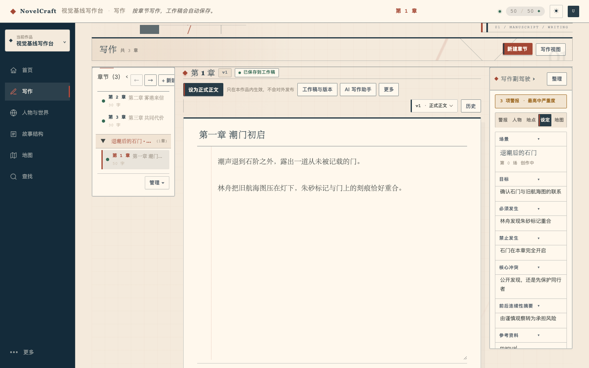
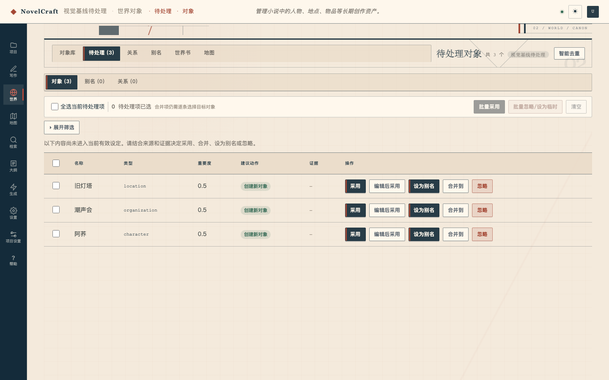
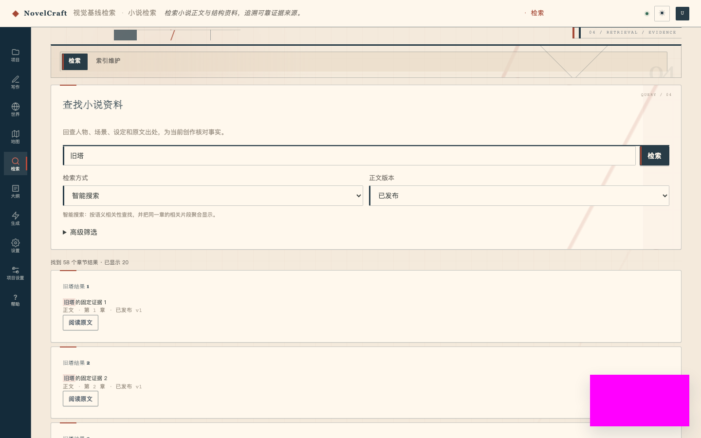
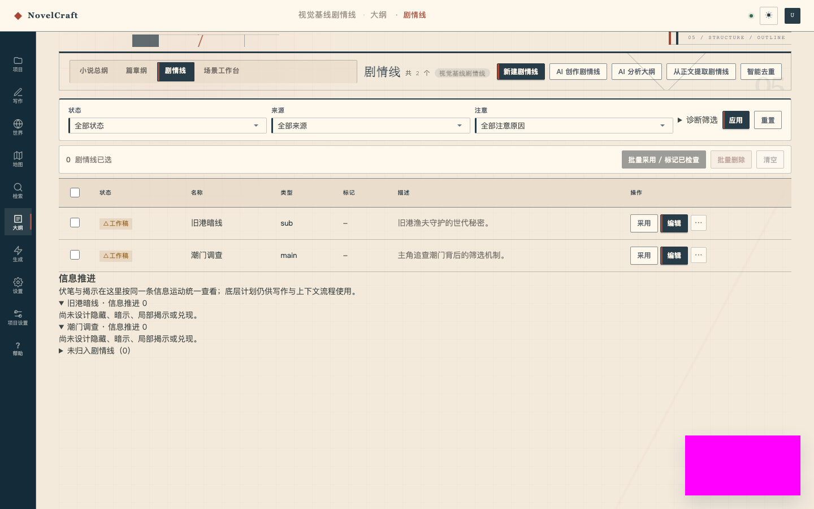
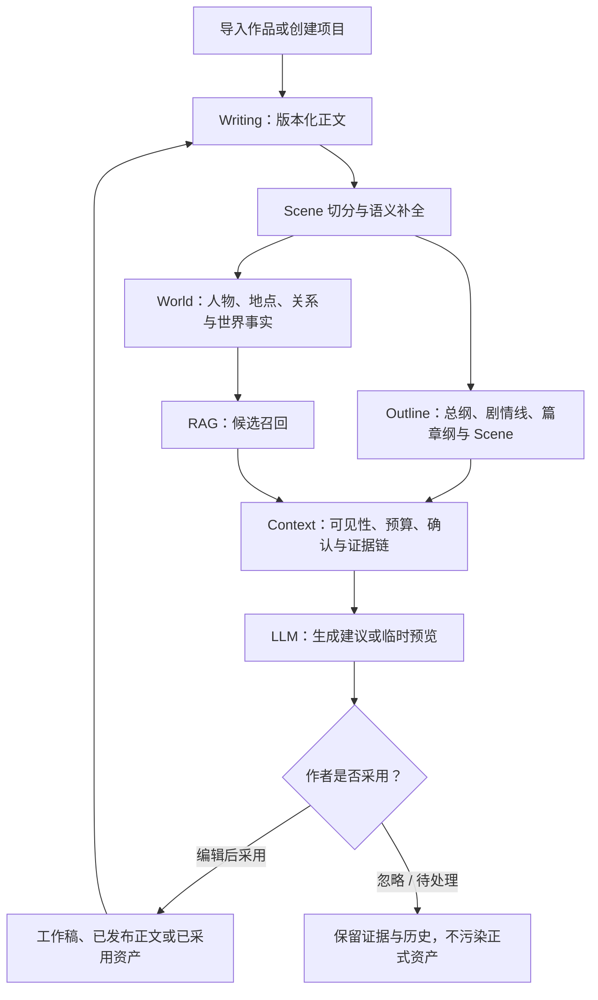
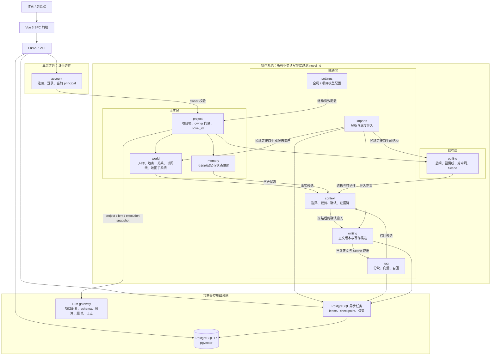
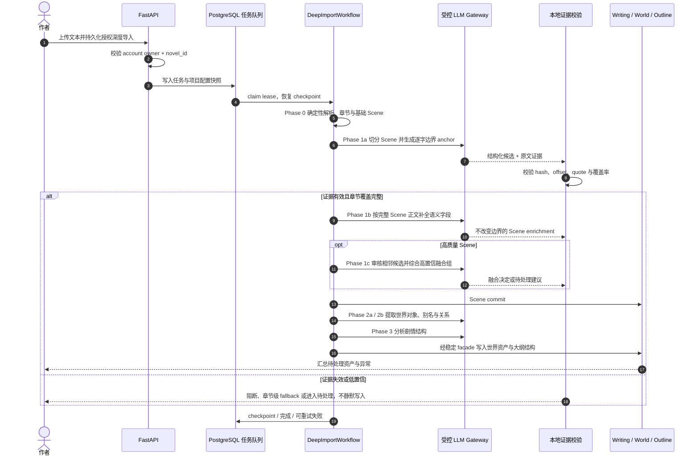
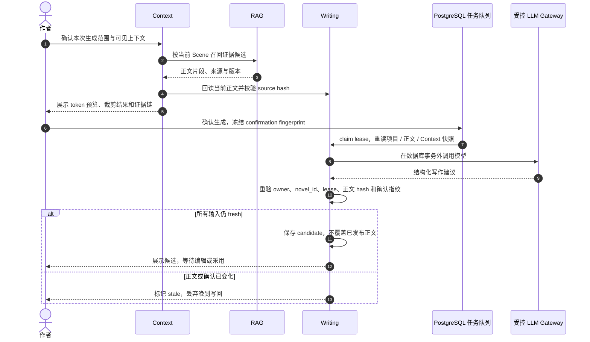
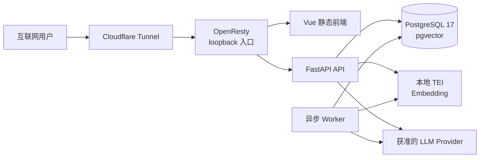

# NovelCraft｜AI 长篇小说结构化创作引擎

> 让大模型参与长篇创作，但不让它直接污染作品事实。
>
> FastAPI 后端 · Vue 3 SFC 控制台 · PostgreSQL + pgvector · 异步任务队列

[](https://github.com/FengHuoLinShan/ai-writing-assist/actions/workflows/backend-ci.yml)
[](https://github.com/FengHuoLinShan/ai-writing-assist/actions/workflows/backend-postgresql-e2e.yml)


[在线体验](https://novel.zhh.se) · [30 秒了解项目](#30-秒了解项目) · [系统架构](#系统架构) · [核心时序](#核心时序) · [五分钟项目导览](#五分钟项目导览) · [开发者快速开始](#开发者快速开始)

NovelCraft 是一个已上线的 AI 长篇小说创作 Alpha：它把正文版本、Scene、世界事实、剧情结构、检索证据和 AI 建议放进同一条可追踪的工作流，让作者始终保留最终决定权。

> 在线环境需注册；模型调用需要在项目中配置 OpenAI-compatible LLM。项目不提供公共共享账号，也不包含真实稿件、密钥或个人联系方式。

---

## 30 秒了解项目

| 核心问题 | 回答 |
| --- | --- |
| 它解决什么问题？ | 长篇小说持续数十万字后，人物设定、时间线、伏笔和章节结构很容易失控；普通 Chat 或简单 RAG 只能生成文本，难以管理长期状态和写回副作用。 |
| 它怎么解决？ | 用版本化正文和 Scene 作为证据锚点，建立世界事实与剧情结构，再由 RAG 召回候选、Context 编译可见上下文，最后让 LLM 生成可审查的候选内容。 |
| 核心差异是什么？ | AI 输出默认不是正式事实。候选必须带来源、经过校验，并由作者编辑或采用后，才进入工作稿或已采用资产。 |
| 当前做到哪一步？ | 已公开部署的 Alpha / 工程验证系统，具备导入、写作、世界设定、大纲、检索、上下文编译、异步任务和项目级模型配置等完整主链路；不包装为成熟商业产品。 |
| 个人职责是什么？ | 负责产品构思、用户流程、需求拆解、架构与安全约束、AI Coding 编排、代码 Diff Review、测试验收和持续迭代；大规模实现主要由 AI Coding 工具完成。 |

**项目角色：产品负责人 + AI 应用工程编排者｜能力方向：AI 产品与 AI 应用开发。** 这个项目重点证明的不是“调用过一个模型”，而是能否把不稳定的模型能力约束成可解释、可恢复、可验收的产品系统。

## 产品界面

以下画面来自仓库内受版本控制的 warm 主题视觉回归基线，使用脱敏 Fixture 数据，不复制生产数据。

<table>
  <tr>
    <td width="50%">
      
      <br>
      <strong>写作工作台</strong>：正文、章节、Scene 与 AI 辅助共处一屏。
    </td>
    <td width="50%">
      
      <br>
      <strong>世界对象待处理</strong>：AI 抽取先进入审核区，不直接污染正式设定。
    </td>
  </tr>
  <tr>
    <td width="50%">
      
      <br>
      <strong>小说检索</strong>：召回正文证据，而不是只返回一段不可解释的答案。
    </td>
    <td width="50%">
      
      <br>
      <strong>大纲 / 剧情线</strong>：把创作意图组织成可执行的结构层。
    </td>
  </tr>
</table>

## 为什么不是 Chat + RAG

一次对话可以写出一段文字，但长篇创作需要管理四类额外问题：

- **长期状态**：人物关系、地点、物件和规则会跨越大量章节，且会随创作演化。
- **版本与证据**：正文修改后，旧的摘要、向量和 AI 结论可能已经失效，必须知道它们来自哪个版本、哪个字符区间。
- **可见性边界**：生成当前 Scene 时，不能让未来情节成为模型证据；“能检索到”不等于“现在可以看”。
- **写回副作用**：模型建议、工作稿、已发布正文和正式世界事实具有完全不同的权限与风险。

因此系统把职责拆开：

> **RAG 负责找；Context 负责选、裁、确认和追踪；领域模块决定能不能写，以及写成什么状态。**

这也是 NovelCraft 与“聊天框外接向量库”的本质区别：检索只是输入链路的一环，产品真正管理的是从证据到决策、再到受控写回的完整生命周期。

## 产品闭环



闭环中的关键设计是：**AI 输出先成为候选，作者采用后才成为正式资产**。系统允许自动化，但自动化必须有持久化授权范围、可回滚标记和冲突处理；低置信或无法消歧的结果仍回到待处理区。

## 系统架构



图中的箭头表达**资料流与产品协作关系**，不代表生产代码可以任意跨模块导入。代码层的跨模块依赖必须经过 `contracts.py`、`facade.py` 或已注册 DI port。

| 模块 | 领域职责 |
| --- | --- |
| `account` | 邮箱 / 可选 Authing 微信身份、单浏览器会话、重新认证与延期删除；位于三层创作架构之外。 |
| `project` | 项目聚合根、项目级配置和 `owner_id + novel_id` 双重边界。 |
| `imports` | 文件解析、确定性 Phase 0 和可恢复的深度导入工作流。 |
| `world` | 人物、地点、关系、时间线、事件与地图子系统等长期世界事实。 |
| `memory` | 带来源的记忆、状态快照与可追踪上下文资产。 |
| `outline` | 总纲、剧情线、篇章纲、Scene 和结构覆盖关系。 |
| `rag` | 正文分块、embedding、向量召回和候选证据。 |
| `context` | 上下文选择、可见性、token 预算、确认快照和证据链。 |
| `writing` | 当前正文、版本、发布状态、写作生成与候选内容。 |
| `settings` | 全局默认与项目覆盖的 LLM provider / profile 配置。 |

可继续深挖：

- [可编辑 Draw.io 架构源文件](docs/architecture/module-architecture.drawio)
- [HTML 架构图预览](docs/architecture/module-architecture.html)
- [架构文档导航](docs/architecture/README.md)
- [整体设计](docs/00_整体设计.md)

## 核心时序

### 1. 深度导入：从原文到可审核资产



这条链路把“模型理解长文本”拆成确定性解析、分阶段语义补全和本地证据验证。模型不能自行选择工具或跨模块编排，工作流、预算、超时、schema 和写入权限都由业务代码控制。

### 2. 写作生成：防止晚到结果覆盖新正文



这里解决的是典型异步竞态：用户等待模型时仍可能继续编辑。如果只在任务开始前检查一次版本，晚到结果就会覆盖新正文；因此系统在 LLM 返回后再次验证来源哈希、任务 lease 和确认指纹，只允许 fresh 结果落为候选。

## 技术亮点

| 能力 | 工程做法 | 可深入讨论 |
| --- | --- | --- |
| 受控 LLM 工作流 | 业务代码确定步骤，统一注入项目级模型配置，并对输出做 schema、预算、超时和日志约束。 | 为什么不做自由 ReAct Agent？如何处理 provider 切换和任务恢复？ |
| 证据绑定 | AI 结论携带原文 quote、字符区间、source hash 和 workflow 来源；正文变化后可以识别陈旧资产。 | 如何防止模型引用不存在的原文？offset 和 hash 各解决什么问题？ |
| RAG / Context 分离 | RAG 只负责候选召回；Context 负责可见性、token 预算、优先级、确认快照和证据追踪。 | 如何避免未来 Scene 泄漏？为什么检索结果不能直接进 prompt？ |
| PostgreSQL 可恢复任务 | 任务使用 lease、checkpoint、幂等边界和项目配置快照，API 重启后仍可恢复。 | 为什么现阶段不用 Redis / Kafka？如何防止重复消费和晚到写回？ |
| 双重租户隔离 | 公开浏览器请求同时校验当前 account 对项目的 `owner_id`，所有业务读写仍显式过滤 `novel_id`。 | owner 边界为什么不能代替 `novel_id`？worker 如何避免绕过用户权限？ |
| 建议与正式资产分离 | 普通模型输出进入候选或预览；只有作者采用，或有持久化授权的可回滚流水线，才能写入允许的资产。 | 如何设计人工确认、撤销、冲突和低置信回退？ |
| Vue 渐进迁移 | 保留现有 hash route-host seam，业务页以 Vue 3 SFC island 接入统一 bridge。 | 为什么不一次性重写前端？如何在迁移期保持 API、state 和路由一致？ |

## 关键设计取舍

| 没有选择 | 当前选择 | 原因 |
| --- | --- | --- |
| 自由 ReAct Agent 自主选工具、跨模块写数据 | 确定性业务工作流 + 统一 LLM gateway | 创作数据需要可预测权限、成本、超时、日志和回滚边界。 |
| Redis / Kafka 作为第一版任务基础设施 | PostgreSQL 任务表 + lease + checkpoint | Alpha 阶段优先减少运维面；当前吞吐量下，一致性和可恢复性比总线扩展性更重要。 |
| 立即引入图数据库 / 全量 GraphRAG | PostgreSQL 关系模型 + pgvector + 明确的领域关系 | 现阶段查询模式可以由关系表和向量召回覆盖；先验证关系价值，再为真实瓶颈增加基础设施。 |
| 一次性重写旧前端 | Vue 3 SFC 渐进迁移，复用 route host 与 bridge | 降低大爆炸式迁移风险，让产品功能与架构改造可以并行演进。 |
| 让 AI 自动改正式设定和已发布正文 | 候选、待处理、采用和发布状态分离 | 模型不确定性不能被包装成数据库中的确定事实，作者必须保留最终控制权。 |

这些选择不是“永远不用”，而是按当前产品阶段控制复杂度。只有当吞吐量、查询模式、多人协作或运营数据证明现有边界成为瓶颈时，才升级基础设施。

## 个人贡献与 AI Coding 边界

我在这个项目中承担的是“产品负责人 + AI 应用工程编排者”的复合角色：

- 从长篇创作的状态失控问题出发，定义用户流程、产品闭环与分阶段路线。
- 拆解模块职责，制定 `owner_id + novel_id` 隔离、候选 / 正式资产分离、证据绑定和受控 LLM 等硬约束。
- 将需求转译为可验收的设计、接口契约、任务和测试门禁。
- 使用 Codex、Claude Code + DeepSeek 等 AI Coding 工具完成大规模实现，并负责提示上下文、任务编排、代码 Diff Review、问题定位和返工决策。
- 对最终行为负责：运行测试、检查架构边界、验收前端路径、维护文档，并把线上结果与本地未提交状态分开。

需要明确的是：**我不会把 AI Coding 生成的大规模代码包装成逐行手写。** 这个项目展示的是另一种工程能力——能否定义正确的问题和约束，组织 AI 产出，在真实代码库中识别风险，并把结果收敛到可运行、可测试、可解释的系统。

它能证明：

- 可以把模糊产品问题拆成稳定的领域边界和工程任务。
- 理解 RAG、Context Engineering、异步工作流、LLM 治理与多租户安全的组合关系。
- 能够 Review AI 生成代码，而不是只接受“能跑”的表面结果。
- 能围绕证据、失败路径和验收标准持续迭代。

它不能单独证明：

- 已经获得商业化 PMF 或稳定留存。
- 所有代码均由本人逐行手写。
- 在大规模真实用户并发下已经完成容量验证。

## 工程证据

### 持续集成与质量门禁

| 门禁 | 当前验证内容 |
| --- | --- |
| Backend quality | 密钥与敏感信息卫生检查、Ruff、快速测试和覆盖率门禁。 |
| PostgreSQL critical | 从空库执行 migration，并验证关键 PostgreSQL 并发与任务契约。 |
| Frontend unit quality | 前端单元测试和生产构建。 |
| PostgreSQL full E2E | 独立工作流按夜间或手动触发，运行更完整的 PostgreSQL 端到端验证。 |
| 视觉回归 | Playwright 基线覆盖写作、世界设定、检索、大纲等核心页面。 |

README 使用实时 CI Badge，而不是把某一天的静态测试数量当作长期质量结论。

### 发布、备份与恢复

- 生产发布只能接受 `origin/main` 可达的 **40 位固定 commit SHA**，由 `deploy/scripts/release.sh` 执行；服务器以 detached HEAD 运行，避免“分支名等于生产版本”的漂移。
- 发布状态记录于 `deploy/.state/current-commit`，本地未提交修改、未推送 commit 或主题分支都不能成为生产输入。
- 部署脚本、健康检查、备份和恢复流程均在仓库中留有可审查入口；密钥只通过环境配置注入，不进入 README 或版本库。

<details>
<summary><strong>展开部署拓扑</strong></summary>



OpenResty 与应用服务位于受控网络边界内；数据库不直接暴露给公网。Cloudflare Tunnel 提供公开入口，API 和 worker 只向配置过的 embedding / LLM provider 发起必要出站请求。

</details>

## 五分钟项目导览

1. **第 0–1 分钟：建立问题。** 打开在线首页并创建项目，说明为什么长篇创作不是“一次生成”，而是长期状态管理。
2. **第 1–2 分钟：展示事实与结构。** 进入世界对象待处理和大纲工作台，演示 AI 结果如何保留证据、等待作者采用。
3. **第 2–3 分钟：展示检索与 Context。** 用小说检索找到正文片段，说明 RAG 只召回候选，Context 还要处理 Scene 可见性、预算和确认。
4. **第 3–4 分钟：展示受控生成。** 从写作台发起一次候选生成，解释 source hash、确认指纹和晚到结果防护。
5. **第 4–5 分钟：回到工程。** 展示本 README 的架构图、时序图和 CI，回答“为什么这样设计、失败后如何恢复、AI Coding 如何验收”。

建议按以下路径深入了解：

`产品边界` → `RAG 与 Context` → `LLM 输出治理` → `异步一致性` → `多租户隔离` → `部署与恢复`

## 当前边界与下一阶段

这是一个**已部署的 Alpha / 工程验证系统**，不是成熟商业产品。当前边界包括：

- 尚未通过正式用户研究证明留存、付费意愿和真实创作效率提升。
- 不宣称实体抽取准确率、生成采纳率或 P95 延迟达到某个未经持续评测的数字。
- 当前架构以单作者项目和可控并发为主，多人实时协作与大规模容量验证不在现阶段完成范围内。
- 视觉基线与自动化测试能证明主要路径可回归，但不能替代真实作者的长期创作反馈。

下一阶段优先级：

1. 建立脱敏的长篇小说评测集，分别量化 Scene 边界、实体 / 关系抽取、证据有效率和跨章一致性。
2. 记录“候选 → 编辑 → 采用 / 拒绝”的产品漏斗，用真实采纳行为校准模型和交互。
3. 增强任务耗时、LLM 成本、重试、stale 结果和证据失效的可观测性。
4. 在真实负载证明需要后，再评估队列拆分、缓存、图查询或多人协作基础设施。

## 开发者快速开始

<details>
<summary><strong>展开本地运行与测试命令</strong></summary>

### 环境

- Python 3.12+
- Node.js + npm
- Docker / Docker Compose
- PostgreSQL 17 + pgvector（由 Compose 提供）

### 启动

```bash
cp backend/.env.example backend/.env
make db
make migrate
make dev
```

后端与前端会分别启动；实际端口和环境变量以 `.env.example`、`development-guide.md` 与终端输出为准。

### 自检与测试

```bash
make doctor
make test
```

需要验证真实 PostgreSQL 语义时，使用仓库的 PostgreSQL critical / E2E 入口；前端开发和视觉回归命令见 `frontend-console/README.md` 与 `testing-guide.md`。

</details>

## 权威文档索引

| 想了解什么 | 入口 |
| --- | --- |
| 项目术语与跨模块边界 | [CONTEXT.md](CONTEXT.md) |
| 整体产品与技术设计 | [docs/00_整体设计.md](docs/00_整体设计.md) |
| 架构图与阅读约定 | [docs/architecture/README.md](docs/architecture/README.md) |
| 各模块稳定接口 | [backend/modules/](backend/modules/)（各模块 `README.md`、`contracts.py` 与 `facade.py`） |
| Prompt 与运行时调用契约 | [docs/prompts/Prompt体系设计.md](docs/prompts/Prompt体系设计.md) |
| 开发、测试与发布 | [development-guide.md](development-guide.md) · [testing-guide.md](testing-guide.md) · [deploy/README.md](deploy/README.md) |
| ADR 与长期架构决策 | [docs/adr/](docs/adr/) |

---

如果只记住一句话：**NovelCraft 不是让 AI 替作者写完一本书，而是把 AI 放进一个有证据、有权限、有版本、可回滚的长篇创作系统。**
