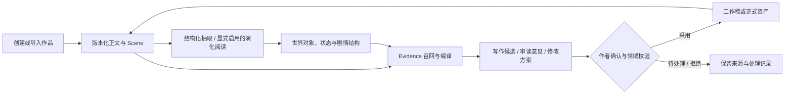
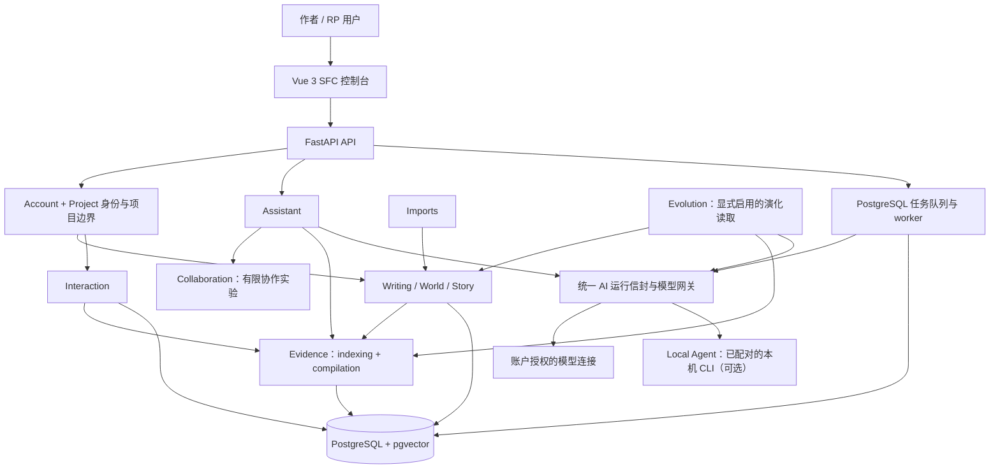

# NovelCraft｜AI 长篇创作与私人故事引擎

> 用证据与版本维护长期叙事状态，用可恢复任务与受控 Agent 把 AI 输出变成可审查、可采用的创作成果。

**Python 3.12+ · FastAPI · SQLAlchemy Async · PostgreSQL 17 / pgvector · Vue 3 · PydanticAI**

[](https://github.com/FengHuoLinShan/ai-writing-assist/actions/workflows/backend-ci.yml)
[](https://github.com/FengHuoLinShan/ai-writing-assist/actions/workflows/frontend-ci.yml)
[](https://github.com/FengHuoLinShan/ai-writing-assist/actions/workflows/backend-postgresql-e2e.yml)
[](https://github.com/FengHuoLinShan/ai-writing-assist/actions/workflows/codeql.yml)

[体验入口](https://novel.zhh.se) · [项目定位](#项目定位) · [能力与状态](#能力与状态) · [系统架构](#系统架构) · [核心工程设计](#核心工程设计) · [本地运行](#本地运行) · [开发文档](#开发文档)

> 文档内容最近按 2026-09-28 的 `main` 核对。项目处于 **Alpha / 工程验证阶段**；代码存在、功能启用、真实模型验收和线上发布是不同状态。体验入口与线上能力以实际部署为准。

## 项目定位

NovelCraft 面向两类使用场景：作者需要持续创作和维护长篇小说；RP 用户希望进入一个故事世界，保留可以重新选择、继续发展的私人叙事。

它不是一个只负责续写的聊天窗口。系统把正文版本、Scene、世界对象、剧情结构、证据来源和 AI 建议放进同一套可追踪工作流，并把“模型输出”和“正式资产”分开管理。

作者路径管理“这本书目前是什么、某项结论来自哪里、修改后哪些资料失效”；RP 路径管理“当前选择了哪段历史、允许知道哪些原作信息、断流之后如何继续”。二者共享账号与受控模型基础设施，但不混用正式世界事实和私人故事历史。

### 30 秒理解

| 问题 | 项目的回答 |
| --- | --- |
| 长篇内容为什么不能只依赖聊天历史？ | 正文会修改，事实有来源和生效范围，人物知识与作者知识不同，历史分支也不能任意混合。 |
| RAG 在这里承担什么职责？ | 召回只是候选发现；Evidence 还负责原文回读、版本校验、可见性、预算、确认快照与证据追踪。 |
| AI 能直接改书吗？ | 普通生成先形成候选、建议或方案；采用和领域写入需要具体授权、基线检查与领域执行。 |
| 新的演化能力是什么？ | 以 Scene 为顺序处理单位，保存结构化观察、身份解析、状态操作与提交回执，支持范围确认、追加及保守后缀重算。 |
| Agent 的自主性在哪里？ | 在服务端冻结的工具、权限和预算内选择查证步骤；不获得任意数据库写权限。 |
| 当前最需要验证什么？ | 长篇语义质量、真实模型成本与恢复、用户采纳行为，以及完整回归稳定性。 |

## 产品路径

### 作者：从正文到可审查的长期创作资产


```mermaid
flowchart LR
  A[创建或导入作品] --> B[版本化正文与 Scene]
  B --> C[结构化抽取 / 显式启用的演化阅读]
  C --> D[世界对象、状态与剧情结构]
  B --> E[Evidence 召回与编译]
  D --> E
  E --> F[写作候选 / 审读意见 / 修改方案]
  F --> G{作者确认与领域校验}
  G -->|采用| H[工作稿或正式资产]
  G -->|待处理 / 拒绝| I[保留来源与处理记录]
  H --> B
```

默认导入仍走现有 `deep_import`。演化阅读是需要显式启用的另一条路径，不应理解为旧导入已被全量替代。

### RP：在选定的历史中继续故事

RP 使用独立 `interaction` 领域管理私人旅程。重新生成或编辑产生新节点，而不是覆盖旧历史；只有当前选中路径进入后续上下文、回顾和导出。

无来源绑定的旅程可直接通过自然语言开场；绑定作品的旅程读取冻结的 source revision，并遵守剧情截止点和原作证据范围。私人互动结果不写回原作正文、World 或 Story。

流式正文通过持久化缓冲和 offset 恢复。技术失败产生的部分结果不会自动成为已选择的故事历史。

## 能力与状态

下表的“主干已有”指仓库存在相应实现与接口，**不等于本次已重新运行全部测试或确认线上启用**。

| 能力 | 当前范围 | 状态与限制 |
| --- | --- | --- |
| 作者工作台 | 正文版本、工作稿、发布与候选；精确范围批注与按批注生成的局部修订候选；Scene 和章节结构；世界资料与大纲 | 主干已有；模型结果与正式资产分离，修订候选另存、不覆盖工作稿。 |
| 证据检索与上下文 | 混合召回、指定对象补查、原文回读、版本/hash 校验、可见性与确认快照 | 主干已有；LLM Query Planner 与 Reranker 默认关闭，不能把实验配置写成默认效果。 |
| 世界观与统一地图 | 对象、关系、资料库、共创与复核；区域/城市/街区/街道空间结构；底图校准和按章导航 | 主干已有作者端能力；地图展示不反写世界事实，站内付费图片 API 不宣称已完成验收。 |
| 演化阅读 | 来源锚定、结构化观察、顺序提交、bootstrap/append、revise/scoped_recompute、冻结恢复 | 试用 / 显式启用；默认导入仍为 deep_import，精细依赖图与旧入口等价替代尚未完成。 |
| 私人 RP | 不可变节点、选中分支、来源版本冻结、截止点、流式恢复与自动回顾 | 主干已有；原作与私人分支隔离，不代表已完成长期用户效果验证。 |
| 项目助手 | 跨页讨论、查证、成组提案、确认与恢复 | `ASSISTANT_ENABLED` 默认关闭。 |
| RP 有界 Agent | 每轮在限定工具与资料范围内查证 | `INTERACTION_AGENT_ENABLED` 默认关闭。 |
| 编辑审读 | 冻结工作稿与编辑约定，分段近读、分层汇总、意见卡、作者处置与改后复核 | 需要 `ASSISTANT_ENABLED` 和 `ASSISTANT_EDITORIAL_ENABLED`；后者默认关闭。意见是建议，不替代领域审稿结论。 |
| 后台编辑提醒 | 明确授权后触发审读，复用稳定期、额度与执行槽 | `ASSISTANT_EDITORIAL_AUTOMATIC_ENABLED` 默认关闭，且需项目授权。 |
| 短期前瞻 | 基于保存稿和已有回执提出候选；只读 feed 与显式 evaluate 分离 | 语义任务、自动触发与 RP 各有默认关闭开关；未保存编辑器内容不是正式分析来源。 |
| 本机 CLI Agent | 作品可改用作者 Mac 上已配对的 Codex、Claude、Kimi、DSH 或 Pi CLI 执行 Agent 任务 | 项目默认仍用账户模型连接；每个根任务需作者确认本机权限，工作目录不是沙箱，中断不自动重放。 |
| 有限协作 | 深度审稿、世界观压力测试、跨章修订、盲读、专题研究、导入会诊、排演与多角色演绎 | 实验能力，分别受独立开关和同一运行预算约束；不宣称已证明优于单 Agent。 |

## 系统架构

项目采用模块化单体，而不是按目录数量包装成微服务。FastAPI API 与独立 worker 共享 PostgreSQL；模块通过稳定 contracts、facade 或已注册的依赖注入端口协作。


```mermaid
flowchart TB
  U[作者 / RP 用户] --> FE[Vue 3 SFC 控制台]
  FE --> API[FastAPI API]
  API --> ID[Account + Project 身份与项目边界]
  ID --> W[Writing / World / Story]
  ID --> RP[Interaction]
  API --> AS[Assistant]
  AS --> CO[Collaboration：有限协作实验]
  AS --> EV[Evidence：indexing + compilation]
  W --> EV
  RP --> EV
  IM[Imports] --> W
  EO[Evolution：显式启用的演化读取] --> W
  EO --> EV
  API --> Q[PostgreSQL 任务队列与 worker]
  Q --> RUN[统一 AI 运行信封与模型网关]
  AS --> RUN
  EO --> RUN
  RUN --> LLM[账户授权的模型连接]
  RUN --> LA[Local Agent：已配对的本机 CLI（可选）]
  W --> DB[(PostgreSQL + pgvector)]
  RP --> DB
  EV --> DB
  Q --> DB
```

图表达主要职责与资料流，不表示代码可以跨模块任意导入。正式写入仍由对应领域执行。

### 12 个业务模块

| 模块 | 所有权与职责 |
| --- | --- |
| `account` | 登录、账号身份、账户级模型连接等身份边界。 |
| `project` | 项目聚合根、owner 校验、项目偏好与模型运行快照。 |
| `writing` | 正文、草稿、版本、候选与采用/发布流程。 |
| `world` | 世界对象、关系、资料库、共创、复核与地图。 |
| `story` | 连续性状态与记忆、总纲、剧情线、篇章纲和 Scene。 |
| `imports` | 解析和既有深度导入；向领域提供经校验的候选与结构。 |
| `evidence` | 唯一小说证据领域：索引、召回、编译、来源验证与审计。 |
| `interaction` | 私人 RP 旅程、不可变历史、选中路径、流式生成与回顾。 |
| `assistant` | 跨页面会话、运行、方案批次、通知、前瞻与编辑审读；不取得其他领域事实所有权。 |
| `evolution` | 观察与来源契约、顺序演化、冻结尝试、窄提交、回执和受控重算。 |
| `collaboration` | 受协议约束的协作能力；不把各角色意见直接升级为正式事实。 |
| `local_agent` | 作品绑定的本机 CLI 设备、逐次运行授权与调用回执；不拥有世界事实或正文。 |

## 核心工程设计

### 1. 检索候选不等于可用证据

Evidence 内部保留 `indexing` 与 `compilation` 两条流水线，但不建立两套服务或双写事实表。

索引阶段负责分块、embedding、混合召回与索引新鲜度；编译阶段按照当前任务回读原文，验证 source ID/hash、草稿版本、角色/读者可见性、截止点和预算，再生成确认快照与证据链。

作者当前稿与 RP 冻结原作版本使用不同 manifest。旧版本不能被新索引悄悄替换，未来章节也不能因为相似度高就成为当前 Scene 的证据。候选稿、作者规划和历史资料均保留自身语义，不能伪装成已发生事实。

实现入口：[Evidence](backend/modules/evidence/README.md)。

### 2. 演化的是带来源的认知，不是不断累加的摘要

Scene 理解保留 `ObservationEnvelope`：发生的事件、角色陈述、信念、假设、作者计划、比喻和不明信息具有不同语义。

例如“角色说城门已关闭”首先是角色陈述，不能未经校验就写成客观世界状态“城门已关闭”。状态提议必须绑定同批观察及真实原文，无法支撑的提议进入待裁定区。

来源引用同时绑定真实 Writing 草稿、内容 hash 和码点区间；同长度替换也需要判为来源变化。跨章 Scene 对每个来源区间分别校验，在末段完成后才提交，不把后文事件泄漏到首章。

当前前序理解使用有界的结构化观察窗口，保留模态并披露截断；这不是“已经完整理解整本小说”的保证。

实现入口：[Evolution](backend/modules/evolution/README.md)。

### 3. 外部模型调用与数据库提交分离

演化流水线在数据库长事务之外调用 provider，先耐久化请求与采样结果，再执行确定性编译、独立语义复核与短事务提交。

`apply_frozen` 重验 owner epoch、真实来源与前序回执，在允许时执行领域 applier 并保存回执；`recover_attempt` 复用冻结负载，不重新采样。已经完成的 attempt 可以重放原回执，避免普通恢复路径重复写入。

这是可恢复与幂等提交协议，不是对所有外部模型计费行为的“端到端 exactly-once”承诺。响应是否已计费但无法确认时，需要保留 unknown 状态，而不能当作免费失败自动重试。

实现入口：[commit.py](backend/modules/evolution/commit.py)。

### 4. 长任务返回后，输入必须仍然有效

PostgreSQL 任务领取使用 `FOR UPDATE SKIP LOCKED`，以任务状态与 lease 约束当前 worker。正文生成返回时再次检查正文 hash、授权与确认指纹；RP 返回时还检查 selection epoch 和选中路径。

因此，“任务开始时有权限”和“任务完成时仍有权写入”是两次不同判断。用户在等待期间编辑正文、切换分支或撤销授权，旧结果不应覆盖新状态。

### 5. Agent 的自主查证与业务写入分权

PydanticAI 单 Agent 在服务端注册的工具目录中选择查证顺序。工具版本、参数签名、来源范围与预算随运行冻结，新工具不会自动进入旧运行。

Agent 形成提案；用户确认具体方案批次后，领域模块重验基线并按业务原子组执行。某组失败会阻断依赖项，已成功组保留回执。不能把这类批次说成所有跨模块操作自动全局原子提交。

`AIRunEnvelopeV1` 统一约束根能力、累计请求额度和 deadline；重试、恢复和 requeue 不重置账本。未知用量不能被记录成零成本。

实现入口：[Assistant](backend/modules/assistant/README.md)。

### 6. 编辑审读不冒充事实或质量证明

作者编辑台冻结工作稿、编辑约定、排除范围与模型快照。读者层只消费已读文本与先前读者状态，作者层才可以消费相应范围的世界资料和结构资料。

模型意见必须包含冻结正文中的准确引用；分段失败、缺章与预算不足会保留覆盖缺口。意见标记为 `editorial_suggestion`，不会直接写入正文或替代 Writing 的独立审稿结果。改后复核保留“仍在 / 可能改善 / 无法判断”等不确定性，关闭问题由作者决定。

### 7. 原作与私人故事、展示与事实分别隔离

RP 只使用选中分支和获准的固定来源版本，不反写原作。地图的空间呈现与底图校准也不反写正式世界事实。

这些边界让创作试验、私人分支和可视化改动不必靠 Prompt 中的一句“不要污染设定”维持。

## 技术栈

| 层次 | 当前实现 |
| --- | --- |
| 前端 | Vue 3 SFC、Vite、JavaScript；Vitest、Playwright。 |
| API 与类型契约 | Python 3.12+、FastAPI、Pydantic。 |
| 持久化 | SQLAlchemy 2 异步接口、asyncpg、Alembic；PostgreSQL 17。 |
| 检索 | pgvector、分块与混合召回、来源绑定及上下文编译；高级 Planner/Reranker 按开关启用。 |
| AI 运行 | PydanticAI、OpenAI-compatible client、账户级连接与统一运行信封；以仓库配置和真实门禁支持的模型为准。 |
| 异步执行 | PostgreSQL 持久任务、独立 worker、lease、checkpoint、恢复和提交重验。 |
| 交付与质量 | Docker、GitHub Actions、Ruff、pytest、浏览器回归、固定 SHA 发布与恢复脚本。 |

依赖以 [backend/pyproject.toml](backend/pyproject.toml)、[backend/uv.lock](backend/uv.lock) 与 [frontend-console/package.json](frontend-console/package.json) 为准。SQLite 测试依赖不意味着生产语义可以等价地用 SQLite 验收。

## 本地运行

### 前置条件

准备 Python 3.12+、uv、与前端锁定依赖兼容的 Node.js/npm、Docker Compose 和 Make。以下命令适用于 macOS/Linux shell；Windows 可在 WSL 等相应开发环境中执行。

```bash
git clone https://github.com/FengHuoLinShan/ai-writing-assist.git
cd ai-writing-assist

# 安装锁定依赖；开发工具位于 dev extra。
(cd backend && uv sync --locked --extra dev)
(cd frontend-console && npm ci)

# 仅首次创建；已有配置时不要覆盖 backend/.env。
[ -f backend/.env ] || cp backend/.env.example backend/.env
source backend/.venv/bin/activate

make db
make migrate
make dev
```

`make migrate` 显式升级到 Alembic head。开发服务会检查 schema 状态，不应依赖启动过程悄悄迁移数据库。后端默认开发端口为 `8000`，前端脚本默认为 `8080`，具体以终端输出和环境配置为准。

### 配置注意事项

业务模型连接在账户设置中管理。需要持久保存模型密钥时，配置 `LLM_SETTINGS_ENCRYPTION_KEY`，可用下列命令生成并安全保存：

```bash
python -c "from cryptography.fernet import Fernet; print(Fernet.generate_key().decode())"
```

不要提交 `.env`、API Key、真实稿件或生产数据。示例数据库密码与 `AUTH_MODE=local` 仅用于本地开发；公开部署需另外配置会话密钥、邮件、来源限制、正向速率限制及受控出站访问。连接验证或真实模型测试可能产生费用。

Embedding 服务、首次启动和公开部署细节见 [development-guide.md](development-guide.md) 与 [deploy/README.md](deploy/README.md)。本文命令由仓库配置静态核对，不构成本次端到端启动验收记录。

## 测试与工程证据

```bash
make doctor
make docs-check
make test
make test-frontend

# 包含本地质量门禁，但不等于 PostgreSQL / 浏览器 / 镜像 / 真实模型全验收。
make test-ci
```

PostgreSQL 并发和 E2E 需要专用测试库：

```bash
# 先设置 E2E_DATABASE_URL，必须指向可用于测试的隔离数据库。
make test-postgresql-critical
make test-e2e
```

前端的功能、助手、编辑审读和协作浏览器用例分别有独立入口，见 [frontend-console/package.json](frontend-console/package.json) 与 [testing-guide.md](testing-guide.md)。付费真实模型、图片与长上下文测试必须显式授权，不属于默认免费测试。

`pyproject.toml` 配置了 **85% 覆盖率门槛**，这不等于本次已测得覆盖率达到 85%。门禁当前状态以页首的实时 CI Badge 为准，README 不把某一天的运行结果或静态测试数量写成长期质量结论。其中 PostgreSQL E2E 每晚运行不含付费模型和外部数据的完整 E2E，PR 只运行其 critical 子集。

## 个人贡献与 AI 辅助研发

本项目的个人工作重点是产品构思、用户流程、需求拆解、领域边界、AI 运行约束、AI Coding 任务编排、代码 Diff Review、测试验收与持续迭代。

大规模实现借助 AI Coding 工具完成。项目不把生成代码包装成全部逐行手写，而以可解释的架构决策、真实故障处理、代码审查与验证结果体现工程责任。

## 当前限制与下一阶段

当前尚未证明正式用户留存、付费意愿、长期创作效率提升或大规模并发容量。模型可返回结构化结果，不等于人物与世界推断一定正确；单元测试通过，也不等于真实模型的内容质量已通过。

近期重点是建立脱敏、版本化长篇评测集，补齐演化入口与原有消费者的等价性验证，逐项完成编辑审读、前瞻及有限协作的真实质量准入，再根据采纳和恢复数据决定默认开启范围。

## 开发文档

| 阅读目的 | 文档 |
| --- | --- |
| 产品与整体设计 | [整体设计](docs/00_整体设计.md)、[用户画像](docs/product/user-personas.md) |
| 架构与模块边界 | [CONTEXT.md](CONTEXT.md)、[架构导航](docs/architecture/README.md) |
| 演化协议与范围阅读 | [Evolution](backend/modules/evolution/README.md) |
| 证据与上下文编译 | [Evidence](backend/modules/evidence/README.md) |
| 能力质量证据账本 | [发布证据](docs/evidence/README.md)（CI 校验：schema/sha256/commit 可达/超期） |
| 助手、前瞻与编辑审读 | [Assistant](backend/modules/assistant/README.md) |
| RP 与协作 | [Interaction](backend/modules/interaction/README.md)、[Collaboration](docs/modules/21_collaboration.md) |
| 开发、测试与发布 | [开发指南](development-guide.md)、[测试指南](testing-guide.md)、[部署](deploy/README.md) |
| 许可与安全 | [MIT License](LICENSE)、[安全政策](SECURITY.md)、[第三方许可](THIRD_PARTY_LICENSES.md) |

---

**NovelCraft 的核心不是让 AI 写得更多，而是让长期创作中的来源、状态、授权、分支与恢复保持可解释。**
