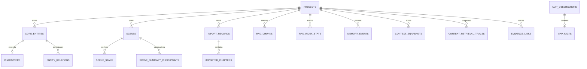

# AI 长篇小说结构化创作引擎：数据库设计（当前实现）

本文件描述当前 ORM 与迁移所表达的数据库设计，而不是历史计划中的目标 schema。它以
2026-07-10 工作树中已注册的 **66 张表** 为基线。

## 1. 权威来源与维护规则

数据库事实的优先级如下：

1. 活跃 ORM 模型：`backend/modules/**/models*.py`、`backend/infrastructure/tasks/models.py`
2. Alembic migration：`backend/alembic/versions/`
3. 本文与对应模块设计文档

本文用于解释表的归属、关系和不变量；不要把它当作可复制执行的全量 DDL。字段类型、
默认值、索引和约束可能在模型与 migration 中分别定义，发生冲突时以当前 migration 和
模型为准。修改表结构时必须同步更新三者以及受影响测试。

当前迁移以 `20260703_squashed_current_schema.py` 为 demo 基线；之后的 migration 补充
自动导入元数据、生成模板、settings、写作 provenance、关系复核元数据、安全/性能索引，
以及 `scene_spans` / `rag_chunks.scene_span_id`。`20260710_novel_evidence` 增加
正文 hash、版本绑定 span/checkpoint、canonical/working RAG 索引状态和
evidence provenance。demo 开发库可重建，不要求保留旧迁移链的数据兼容性。
`20260710_asset_state_simple` 不增加列，只把旧的人工 CoreEntity 草稿和已经采用但
历史上仍落为 draft 的创设建议结果收敛为 canonical；展示状态继续由领域响应派生。

## 2. 跨表不变量

- **项目隔离**：除 `projects`、全局设置和 `async_tasks` 等全局/基础设施表外，业务表以
  `novel_id → projects.id` 隔离。服务、repository 和 API 仍必须在查询条件中显式使用
  `novel_id`；外键本身不能替代租户边界。
- **主键与时间戳**：多数业务表使用 UUID 主键与 UTC 时间戳 mixin，但不能假定每张表都有
  `status` 或 `updated_at`；表级模型是唯一准确来源。
- **原始状态与作者展示分离**：领域表继续用 `draft` / `candidate` / `canonical` 等原始状态
  表达兼容和实现差异；API/contract 将持久化创作资产投影为 `display_state = review / active /
  archived`。来源、注意原因和推荐动作不是生命周期状态。正文另保留 working/published
  成熟度，任务状态和地图 Observation/Fact 分层不纳入该投影。
- **采用边界**：普通 AI 输出先进入建议队列、临时预览或兼容 candidate 记录，用户采用后才
  调用目标领域写入。自动流水线只有在任务持久化了用户授权范围后才能直接采用规则明确且
  可回滚的结果；异常结果仍进入待处理。
- **JSON、向量与文本**：可变的业务载荷使用 JSON/JSONB；`core_entities` 和 `rag_chunks`
  保存 embedding。PostgreSQL 下的实际 JSONB、pgvector、pg_trgm 与索引细节以 migration
  为准，SQLite 测试替身不改变生产 schema 的语义。
- **不存在的旧表不是当前契约**：`chapter_cards`、`memory_records`、`entity_candidates`、
  `entity_aliases`、`geo_*`、`timeline_events` 与 `review_reports` 都不是当前 ORM 注册表。
  Scene 的权威模型是 `scenes`，章节关联由 `scene_chapter_links` 和 `scene_spans` 表达。

## 3. 表清单

### 3.1 项目与设置（4 表）

| 表 | 归属 | 设计要点 |
|---|---|---|
| `projects` | project | 小说根聚合；保存题材、创作阶段、`settings` 和软删除时间 `deleted_at`。 |
| `global_llm_defaults` | settings | 按 `owner_id` 唯一的全局模型默认值；不保存项目 API Key。 |
| `global_author_preferences` | settings | 按 `owner_id` 唯一的全局作者偏好。 |
| `project_author_preferences` | settings | 每个项目最多一行的作者偏好覆盖，`project_id → projects.id`。 |

`settings` 是第九个业务模块；其模型在
[`backend/modules/settings/models.py`](../backend/modules/settings/models.py)。项目级 LLM
设置仍存于 `projects.settings`，读取时遵循项目配置与全局默认的领域优先级。

### 3.2 世界事实、人物与版本（7 表）

| 表 | 归属 | 设计要点 |
|---|---|---|
| `core_entities` | world | 统一世界对象根表；人工创建默认 canonical，AI 待处理结果仍可兼容读取 candidate/draft；`entity_type` 区分人物、地点、事件等，别名位于 `content_json`，带 reveal/status/embedding 与来源元数据。 |
| `characters` | world | `entity_id → core_entities.id` 的人物扩展，保留人物专属字段、名称/别名和状态。 |
| `character_knowledge` | world | 人物对目标的知识边界；目标以 `target_type` + `target_id` 表达，缺少学习章的旧数据只有 `is_public_baseline=true` 才可见。 |
| `events` | world | 事件是世界对象的扩展记录，通过 `entity_id` 指向 `core_entities`，不使用独立 timeline 模块。 |
| `entity_relations` | world | 双端对象关系；保留来源章节、事件因果、引文、强度、状态与 `review_meta`。 |
| `entity_revisions` | world | 兼容型实体快照；回滚主路径优先使用 Delta 与文本归档。 |
| `text_archive` | world | 长文本字段的版本归档，与 `delta_log` 共同支持可追溯修改。 |

`entity_relations` 的 canonical 边在 PostgreSQL 使用
`(novel_id, source_id, target_id, relation_type)` 的部分唯一索引。关系、实体和人物的
具体字段、外键与索引以
[`backend/modules/world/models/`](../backend/modules/world/models/) 为准。

### 3.3 世界对象 Profile（8 表）

这些表都扩展 `core_entities`，用稳定的对象类型字段承载特定类型的结构化资料，而非把所有
属性塞入一个 JSON 文档。

| 表 | 对象类型或用途 |
|---|---|
| `species_profiles` | 种族/生物设定 |
| `faction_profiles` | 势力、领袖、资源与领地引用 |
| `location_profiles` | 地点、气候、人口、资源与地图引用 |
| `rule_profiles` | 世界规则、约束、例外与后果 |
| `item_profiles` | 物品、能力、限制与归属 |
| `secret_profiles` | 秘密、持有者、揭示状态 |
| `entity_profile_templates` | 可配置的 Profile 展示/数据模板 |
| `generic_entity_profiles` | 没有专属表的扩展对象 Profile |

### 3.4 世界书、生成模板与知识边界（13 表）

| 子域 | 表 | 设计要点 |
|---|---|---|
| 生成模板 | `generation_prompt_templates`, `generation_prompt_template_revisions` | 项目级模板及其不可变版本；以 `(novel_id, target_kind, template_key)` 标识模板。 |
| 世界书 | `world_bible_pages`, `world_bible_page_revisions`, `world_bible_page_projections` | 作者编辑页、版本快照和可编译投影分离，避免把渲染结果作为事实源。 |
| 知识标签 | `knowledge_tags`, `character_knowledge_tags`, `asset_knowledge_tags`, `knowledge_tag_exclusions` | 定义标签、授予人物/资产标签，并记录明确排除。 |
| 可见性 | `knowledge_visibility_policies`, `reader_reveal_policies` | 作者/读者视角下的可见性和揭示时点策略。 |
| 待处理队列 | `creation_suggestion_queue`, `conflict_check_queue` | 将创设建议和冲突检查作为待处理记录；接受创设建议时再通过 world 领域服务创建对象、关系或别名。 |

### 3.5 动态地图（12 表）

动态地图属于 world 子系统；模型统一位于
[`backend/modules/world/map_models.py`](../backend/modules/world/map_models.py)，详细用户和
API 设计见 [`modules/15_map.md`](modules/15_map.md)。

| 子域 | 表 |
|---|---|
| 地图与基础格 | `map_configs`, `map_tiles` |
| 地点布局 | `map_location_bindings`, `map_location_layouts` |
| 地形编辑 | `map_terrain_layers`, `map_terrain_regions`, `map_terrain_patches`, `map_terrain_bindings` |
| 时间/对象标记 | `map_markers`, `map_territory_tiles` |
| 动态事实 | `map_observations`, `map_facts` |

`map_observations` 是带证据的观察层，`map_facts` 是采用后的地图事实层。两者通过时间锚点、
空间锚点、证据和 Scene/章节来源保持可追溯；作者界面只把可操作 observation 显示为待处理，
不会为了统一文案压平两张表。

### 3.6 剧情结构与 Scene（9 表）

| 表 | 归属 | 设计要点 |
|---|---|---|
| `plot_threads` | outline | 剧情线及其人物、实体、记忆关联。 |
| `outline_arcs` | outline | 篇章结构与覆盖范围。 |
| `scenes` | outline | 最小叙事单元；保存逻辑顺序、结构字段、旧 `scene_chunks` 映射和 `structure_meta`。 |
| `scene_spans` | outline | 从 `scenes.scene_chunks` 派生的版本绑定物理片段索引；以 `(novel_id, scene_id, content_mode, part_no)` 唯一，保存 source draft/hash、mapping status 和 anchor hash。 |
| `scene_summary_checkpoints` | outline | 按 Scene、content mode 与可见截止位置保存可重建摘要、source refs 和 `based_on_hash`。 |
| `scene_chapter_links` | outline | Scene 与章节的轻量关联表。 |
| `scene_cross_chapter_suggestions` | outline | 跨章 Scene 检测的持久建议队列；保存 task、来源 Scene 与 fingerprint、建议内容、`pending/adopted/dismissed/stale` 状态和处理结果。 |
| `foreshadowing_plans` | outline | 伏笔播种、强化与回收计划。 |
| `reveal_plans` | outline | 信息揭示计划与阶段。 |

`scene_spans` 不是新的作者编辑入口。`rag_chunks.scene_span_id` 是 nullable 引用，
刻意不建立跨模块硬外键；只有 source draft/hash 一致且精确定位的 span 可用于
自动证据归因，`chapter_only/unresolved` 默认排除。

`scene_cross_chapter_suggestions` 以 `(novel_id, suggestion_key)` 幂等，所有读写都按
`novel_id` 隔离。来源变化后旧建议转为 `stale`；融合保存可原子写入
`adopted` 和 `result_scene_id`，批量忽略写入 `dismissed`。该表是建议状态的权威来源，
不借用 `SceneSpan.mapping_status` 表达建议是否已处理。

### 3.7 导入、检索、记忆与上下文（11 表）

| 子域 | 表 | 设计要点 |
|---|---|---|
| imports | `import_records`, `imported_chapters` | 导入元数据与章节正文分离；章节属于项目和导入批次。 |
| rag | `rag_chunks`, `rag_index_state` | 可重建检索块与 novel/chapter/content-mode 级请求/已索引 source ID+hash 状态；canonical/working 唯一键独立。 |
| memory | `memory_events`, `memory_snapshots`, `delta_log` | 事件溯源、阶段快照与字段级变化日志；`memory_records` 已移除。 |
| context | `context_confirmations`, `context_snapshots`, `evidence_links`, `context_retrieval_traces` | 用户确认、自动工作流审计快照、TargetRef provenance 和隐私安全的检索运行摘要分离；trace 不保存 raw query/正文。 |

`memory_events` 的 `(novel_id, chapter_index, sequence)` 是章内事件幂等键。`
context_snapshots.rendered_context` 默认不保存完整内容；保留期到期只清空正文，不删除审计
metadata。

### 3.8 写作与异步任务（4 表）

| 表 | 归属 | 设计要点 |
|---|---|---|
| `writing_drafts` | writing | 正文版本事实源；保存 content hash、冲突检查快照、生成/采用 provenance 与不重排版本号。普通 working 选择排除未采用 candidate；采用时复制为新 draft 并把原建议转入历史。published 不可原地修改，常规删除改为 deprecated。 |
| `writing_conflict_checks` | writing | 对某个草稿/Scene/章节范围的冲突检查运行。 |
| `writing_conflict_items` | writing | 逐项证据、严重性、AI 判断与建议处理状态。 |
| `async_tasks` | infrastructure/tasks | 全局任务队列；使用五状态、heartbeat、lease/attempt/recovery policy、进度与 result/meta。API 仍必须以 `meta.novel_id` 隔离访问。 |

## 4. 关系与写入边界



- 跨模块表关系不能成为跨模块业务调用的理由；生产代码仍通过 `contracts.py`、`facade.py`
  或 DI port 协作。
- API/服务写入必须先完成 Pydantic schema 校验。不得使用 LLM 原文、未受限 JSON 或拼接
  SQL 直接写表。
- 永久删除仅限项目删除等明确操作；常规对象优先进入历史。冲突是注意原因，未采用 AI 内容进入待处理，不与历史混成主工作区状态。

## 5. Schema 变更检查

修改 ORM 或 migration 时，至少检查：

1. 新表/新列的 `novel_id` 归属、外键、唯一键和索引是否符合查询与隔离边界。
2. SQLite 测试模型注册是否涵盖新增 FK 依赖。
3. 受影响的 Pydantic schema、repository/service、模块 README、本文和测试是否同步。
4. 索引或数据清理前运行：

   ```bash
   cd backend
   python scripts/db_duplicate_diagnostics.py --fail-on-duplicates
   ```

历史 plan、旧 schema 片段和以前的 "完整 DDL" 文本均不得用来覆盖上述当前来源。
