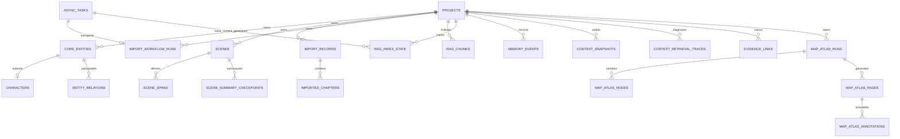

# AI 长篇小说结构化创作引擎：数据库设计（当前实现）

本文件描述当前 ORM 与迁移所表达的数据库设计，而不是历史计划中的目标 schema。它以
当前 Alembic head 和已注册 ORM 为基线；不再维护容易随 migration 漂移的手工总表数。

## 1. 权威来源与维护规则

数据库事实的优先级如下：

1. 活跃 ORM 模型：`backend/modules/**/models*.py`、`backend/infrastructure/tasks/models.py`
2. Alembic migration：`backend/alembic/versions/`
3. 本文与对应模块设计文档

本文用于解释表的归属、关系和不变量；不要把它当作可复制执行的全量 DDL。字段类型、
默认值、索引和约束可能在模型与 migration 中分别定义，发生冲突时以当前 migration 和
模型为准。修改表结构时必须同步更新三者以及受影响测试。

当前迁移以 `20260703_squashed_current_schema.py` 为 demo 基线；之后的 migration 补充
自动导入元数据、生成模板、settings、写作 provenance、关系复核元数据、安全/性能索引，
以及 `scene_spans` / `rag_chunks.scene_span_id`。`20260710_novel_evidence` 增加
正文 hash、版本绑定 span/checkpoint、canonical/working RAG 索引状态和
evidence provenance。demo 开发库可重建，不要求保留旧迁移链的数据兼容性。
`20260710_asset_state_simplification` 不增加列，只把旧的人工 CoreEntity 草稿和已经采用但
历史上仍落为 draft 的创设建议结果收敛为 canonical；展示状态继续由领域响应派生。
`20260713_schema_reconciliation` 将 demo squash 基线、存量开发库与当前 ORM
收敛到同一 schema；后续迁移移除空的 `core_entities.aliases` 旧列，并恢复
关系边和顶层地图名的 PostgreSQL 部分唯一索引。
`20260714_smart_dedup_workbench` 增加项目级指纹裁决表，仅服务智能去重工作台。
`20260724_task_coalescing_owners` 为 `async_tasks` 增加数据库级 keyed coalescing，为 RAG 索引状态
增加 owner/generation，并新增 imports-owned 可恢复 workflow run。
`20260728_account_llm_credentials` 增加 owner/provider 唯一的加密账户凭据，并清除
`projects.settings.llm` 中遗留的 Key 字段；`20260728_interaction_rp` 增加
`projects.project_kind` 与 RP 互动旅程表。
`20260805_task_novel_id` 将 `async_tasks.novel_id` 升格为可空的一等项目隔离键：有效项目
任务回填规范 UUID、以 `ON DELETE CASCADE` 外键和索引关联 `projects`；全局任务保持 NULL。
迁移拒绝畸形、孤儿或 JSON 投影不一致的旧数据，并用数据库 trigger 固定列与兼容
`meta.novel_id` 投影的一致性及列不可变性；项目投影必须逐字等于 canonical 小写连字符 UUID，
不接受大写、无连字符或空字符串变体。
`20260827_project_author_tasks` 新增 project-owned 轻量作者任务；它与
`async_tasks` 后台队列物理分离，只保存有界标题/备注/日期/状态和封闭来源。
`20260901_rp_source_context` 新增 RP 作品资料版本、旅程/attempt source 冻结字段与
`context_snapshots.consumer_novel_id`，并将 chapter-text chunk 唯一键扩展为具体 source draft，
使同章历史版本可并存。

`20260911_assistant_runtime`（ADR-0023）增加助手执行状态，并给
`interaction_generation_attempts` 增加私有 `agent_checkpoint_json`。后者只保存当前 attempt
的有限工具循环和累计预算；正式故事完成后去掉模型历史与原文副本，只保留预算与证据回执。

| Assistant 表 | 所有权与约束 |
|---|---|
| `assistant_runs` | 项目、owner、会话、请求指纹、任务、累计预算及结果；同会话仅一个 pending/running 执行 |
| `assistant_action_batches` | 每 run 一个成组预览；复合 project/run 外键、基线、依赖、确认与逐组回执；重试不重复成功组 |
| `assistant_notices` | 按项目/证据指纹去重；仅管理展示、暂缓和忽略，不改变领域 finding |
| `assistant_watches` | 每项目一项持续授权与待检变更；版本撤销、稳定期、每日额度及一个后台执行所有者 |

World 通用讨论 ORM 的代码所有权转入 Assistant，但仍使用 `world_cocreation_sessions` 与
`world_cocreation_messages`；不复制行、不重建 ID、不迁移成果或 checkpoint 的领域归属。
所有新增业务表保留 `novel_id` 外键；浏览器仍需 account owner 门禁。后台授权冻结 owner
并在 provider 请求及结果提交前重验，不以 system principal 代替此检查。

## 2. 跨表不变量

- **项目隔离**：`projects.owner_id → accounts.id` 确定唯一账号 owner；项目内业务表以
  `novel_id → projects.id` 隔离。服务、repository 和 API 仍必须在查询条件中显式使用
  `novel_id`；外键本身不能替代租户边界。
- **主键与时间戳**：多数业务表使用 UUID 主键与 UTC 时间戳 mixin，但不能假定每张表都有
  `status` 或 `updated_at`；表级模型是唯一准确来源。
- **原始状态与作者展示分离**：领域表继续用 `draft` / `candidate` / `canonical` 等原始状态
  表达兼容和实现差异；API/contract 将持久化创作资产投影为 `display_state = review / active /
  archived`。来源、注意原因和推荐动作不是生命周期状态。正文另保留 working/published
  成熟度；异步任务、生成 attempt、confirmation、snapshot 和地图空间/图片审查等
  运行/审计状态不纳入该投影。
- **采用边界**：普通 AI 输出先进入建议队列、临时预览或兼容 candidate 记录，用户采用后才
  调用目标领域写入。自动流水线只有在任务持久化了用户授权范围后才能直接采用规则明确且
  可回滚的结果；异常结果仍进入待处理。
- **JSON、向量与文本**：可变的业务载荷使用 JSON/JSONB；`core_entities` 和 `rag_chunks`
  保存 embedding。PostgreSQL 下的实际 JSONB、pgvector、pg_trgm 与索引细节以 migration
  为准，SQLite 测试替身不改变生产 schema 的语义。
- **不存在的旧表不是当前契约**：`chapter_cards`、`memory_records`、`entity_candidates`、
  `entity_aliases`、`geo_*`、`timeline_events` 与 `review_reports` 都不是当前 ORM 注册表。
  Scene 的权威模型是 `scenes`，章节关联由 `scene_chapter_links` 和 `scene_spans` 表达。
- **task transport 与领域 owner 分离**：`async_tasks` 负责排队、claim、lease、attempt 和
  通用终态；RAG/imports 等需要可恢复领域状态的流程由所属模块保存 owner、generation 与
  checkpoint。`coalescing_key` 只做无 secret 的排队身份，不能替代 source/version CAS。

### HTTP 读后写一致性

数据库 schema 之外，使用 `DbSession` 的普通 HTTP 请求以一个 request-owned transaction
执行。path operation 与普通响应序列化完成后、HTTP 响应开始前才提交该 transaction；所以
成功的非流式数据库写响应表示该写入已对独立连接可见。若最终 commit 失败，事务会 rollback
并返回既有错误响应，而不是先返回成功状态。流式迭代器和 detached work 不属于该 transaction，
必须使用自己的 session，不能延迟消费请求 ORM 对象。

## 3. 表清单

### 3.1 账号、项目与设置

| 表 | 归属 | 设计要点 |
|---|---|---|
| `accounts` / `account_identities` | account | 账号状态、支持码与唯一邮箱或 Authing 微信身份。 |
| `web_sessions` / `email_login_challenges` | account | 只保存会话令牌、CSRF、邮箱和验证码的 keyed HMAC 摘要。 |
| `account_security_events` / `account_consents` | account | 脱敏安全事件与版本化协议同意。 |
| `projects` | project | 隔离根；`owner_id` 非空，`project_kind=author/interaction` 区分作者项目和隐藏 RP 项目，并保存题材、创作阶段、非 secret `settings` 与软删除时间。 |
| `smart_dedup_workbench_decisions` | project | 按项目、资产类型、规范 pair 和双方 semantic fingerprints 保存有效 `keep_separate`；新指纹使旧记录失效，项目永久删除时级联清理。 |
| `account_llm_credentials` | account | 按 `(owner_id, provider_id)` 唯一保存已真实验证的加密 API Key、指纹和验证时间；账号删除时级联。 |
| `global_llm_defaults` | account | 按 `owner_id` 唯一保存当前账户模板/provider 及非 secret 兼容默认；不保存 API Key。 |
| `global_author_preferences` | account | 按 `owner_id` 唯一的全局作者偏好。 |
| `project_author_preferences` | project | 每个项目最多一行的作者偏好覆盖，`project_id → projects.id`。 |
| `project_author_tasks` | project | 作者主动建立的轻量待办；`novel_id → projects.id` 级联清理，状态限 `open/completed/archived`，来源限世界页/对象、章节或 Scene 的 kind + ID。 |

作者“今日工作”的 `workspace-summary` 是对现有 `projects`、`writing_drafts`、world 待处理表、
outline 场景表和 `project_author_tasks` 的只读 facade 聚合，不新增缓存表或计数列。owner 门禁仍由 project
读取完成，每个下游统计继续显式使用同一 `novel_id`；摘要仅返回任务计数和最多 3 条今日预览，不返回正文、owner、完整任务列表或后台任务。

`account` 同时拥有公开身份边界、owner 级连接与全局偏好；相关模型在
[`backend/modules/account/settings_models.py`](../backend/modules/account/settings_models.py)。项目偏好模型在
[`backend/modules/project/settings_models.py`](../backend/modules/project/settings_models.py)。新业务调用的
provider/model/Key 来自当前账户模板与对应凭据；`projects.settings.llm` 只保留非 secret
工作流兼容字段，不得覆盖账户连接。可恢复任务的 snapshot 不保存 Key。

### 3.2 世界事实、人物与版本（7 表）

| 表 | 归属 | 设计要点 |
|---|---|---|
| `core_entities` | world | 统一世界对象根表；人工创建默认 canonical，AI 待处理结果仍可兼容读取 candidate/draft；`entity_type` 区分人物、地点、事件等。别名位于 `content_json.aliases`，每项以 `kind=name/title/identity` 保存最小分类、以开放短文本 `type` 保存精确类型，并保留来源与审核元数据。 |
| `characters` | world | `entity_id → core_entities.id` 的人物扩展，保留人物专属字段、名称/别名和状态；canonical 人物 CoreEntity 必须有最小扩展行，自动 scaffold 可被作者原位升级。 |
| `character_knowledge` | world | 人物对目标的知识检查点历史；目标以 `target_type` + `target_id` 表达。模型上下文只消费 canonical 记录，缺少学习章的旧数据只有 `is_public_baseline=true` 才可见，并按目标确定性选择唯一有效检查点；归档记录仍供作者审阅。 |
| `events` | world | 事件是世界对象的扩展记录，通过 `entity_id` 指向 `core_entities`，不使用独立 timeline 模块。 |
| `entity_relations` | world | 双端对象关系；`relation_kind` 保存 `state/social/spatial/causal/temporal/epistemic/intentional` 七类最小语义，`relation_type` 保留精确关系，并保留来源章节、事件因果、引文、强度、状态与 `review_meta`。 |
| `entity_revisions` | world | 兼容型实体快照；回滚主路径优先使用 Delta 与文本归档。 |
| `text_archive` | world | 长文本字段的版本归档，与 `delta_log` 共同支持可追溯修改。 |

`core_entities.image_version` / `image_updated_at` 是对象图片的唯一持久化元数据；图片字节与 object
key 不进入数据库或公开响应，`has_image` 由版本派生。软废弃、融合和别名化保留图片，项目永久
删除才创建私有对象存储前缀清理。

`entity_relations.relation_kind` 对 candidate 可空，但 canonical 必须非空且为七个合法值之一；
迁移只为已知详细类型补 kind，未知类型的旧 canonical 边转回 candidate 待作者分类，不猜测语义。
该字段不参与去重。canonical 边仍在 PostgreSQL 使用
`(novel_id, source_id, target_id, relation_type)` 的部分唯一索引。关系、实体和人物的
具体字段、外键与索引以
[`backend/modules/world/models/`](../backend/modules/world/models/) 为准。

### 3.3 世界对象 Profile（9 表）

这些表都扩展 `core_entities`，用稳定的对象类型字段承载特定类型的结构化资料，而非把所有
属性塞入一个 JSON 文档。

| 表 | 对象类型或用途 |
|---|---|
| `species_profiles` | 种族/生物设定 |
| `faction_profiles` | 势力、领袖、资源与领地引用 |
| `location_profiles` | 地点、气候、人口、资源与地图引用 |
| `rule_profiles` | 世界规则、约束、例外与后果 |
| `item_profiles` | 物品、能力、限制与归属 |
| `secret_profiles` | 秘密、持有者、揭示状态 |
| `entity_profile_templates` | 可配置的 Profile 展示/数据模板 |
| `entity_profile_template_revisions` | Profile Template 的不可变快照与内容 digest；供封闭 Canon resolver 精确引用 |
| `generic_entity_profiles` | 没有专属表的扩展对象 Profile |

### 3.4 世界正典权威、世界书、生成模板与知识边界（28 表）

| 子域 | 表 | 设计要点 |
|---|---|---|
| 正典权威 | `world_assertions`, `world_canon_revisions`, `world_canon_heads` | CanonRevision 保存完整 manifest、内联准入回执和 decision 投影；head 以同 novel 复合外键及 CAS 只向前推进。Phase 0 只启用 C0、Page 选择和追加式 revert，Assert carrier 尚无准入入口。 |
| 生成模板 | `generation_prompt_templates`, `generation_prompt_template_revisions` | 项目级模板及其不可变版本；以 `(novel_id, target_kind, template_key)` 标识模板。 |
| 世界书 | `world_bible_categories`, `world_bible_page_drafts`, `world_bible_pages`, `world_bible_page_revisions`, `world_bible_page_projections` | 自定义类别、服务器工作稿、发布页、版本快照和可编译投影分离；PageRevision 持久化 `revision_digest`，并以 `(novel_id, page_id) → world_bible_pages(novel_id, id)` 复合外键阻止跨项目快照。发布以 `base_version_number` 与 expected Canon head 双重检查，在同一事务中 seal revision、选入 CanonRevision 并 CAS 推进 head。 |
| 资料库主题目录 | `world_library_topics`, `world_library_topic_members` | 作者组织用主题树：`parent_id` 经 `(novel_id, parent_id) → world_library_topics(novel_id, id)` 复合外键保证同项目嵌套，service 层拒绝成环移动；成员是对 Page / Draft / Entity 的多主题引用（`target_kind + target_id`，无跨表外键），独立工作稿发布时由 lifecycle 转换为 page 引用并去重。目录仅表达组织方式，不构成地理或事实依赖，也不进入生成上下文。 |
| 资料库工作区 | `world_library_favorites`, `world_library_recents`, `world_library_workspace_profiles` | 作者工作区收藏、最近访问（按 `novel_id + target` 唯一，服务端保留最近 50 条）与每项目一条的视图偏好 JSON；不保存 checkpoint 或正文，属于 World 模块自有数据，随项目 CASCADE 删除。 |
| 世界书校验 | `world_validation_runs` | 按 `novel_id` 保存冻结的 policy/manifest/dependency/target hash、ReviewPacket 输入/结果 hash、coverage/budget 账本、verdict/gate 和 warning 签收。第四期追加冻结影响清单 `impact_json`、分批计划 `plan_json`、失效原因 `stale_reason`（policy/manifest/dependency/target）与作者续接计数 `continued_count`；`(novel_id, id)` 唯一约束支撑复核记录复合外键。`task_id` 唯一关联 `async_tasks`；部分唯一索引只限制同项目的一个 `full + queued/running`，不阻断 targeted run。项目永久删除时 CASCADE，task 删除时仅 SET NULL。 |
| 校验复核记录 | `world_validation_review_items` | 逐条 finding 的作者处置（resolved/acknowledged/deferred）与快照；`(run_id, finding_id)` 唯一，复合外键 `(novel_id, run_id)` 随回执 CASCADE。快照绑定当时的 target/manifest hash 与处置人；run 失效后复核不再满足门禁，需在新回执上重新裁定（ADR-0022）。 |
| 世界书页面模板 | `world_bible_page_templates`, `world_bible_page_template_revisions` | 项目自定义页面布局模板与不可变版本；内置模板仍由代码注册，模板不能保存 Prompt、provider、工具或可执行表达式。 |
| 世界观简介 | `world_bible_synopsis_heads`, `world_bible_synopsis_revisions` | 每项目 head 保存 stale/pin/active task/自动授权；revision 不可变并保存 claims、source manifest/hash、coverage 与 LLM/project snapshot provenance。 |
| 知识标签 | `knowledge_tags`, `character_knowledge_tags`, `asset_knowledge_tags`, `knowledge_tag_exclusions` | 定义标签、授予人物/资产标签，并记录明确排除。 |
| 可见性 | `knowledge_visibility_policies`, `reader_reveal_policies` | 作者/读者视角下的可见性和揭示时点策略。 |
| 待处理队列 | `creation_suggestion_queue`, `conflict_check_queue` | 将创设建议和冲突检查作为待处理记录；`world_core_checkpoint.v1`、`world_design_checkpoint.v1`、`world_worldbook_import.v1` 与 `world_adoption_package.v1` 同样复用前者，不新增提案表；导入冲突使用 `worldbook_import_conflict`。 |
| 共创会话 | `world_cocreation_sessions`, `world_cocreation_messages` | 持久化共创会话与终态消息（ADR-0021）：会话以 `source_kind + source_id` 绑定项目/资料页（正式页或工作稿）/世界对象/主题并保存工作区形状与 `current_checkpoint_id` 指针（无跨表外键，service 校验同项目 checkpoint suggestion）；消息经 `(novel_id, session_id)` 复合外键级联删除，只落作者消息、完成的模型回复与作者决定，生成回合绑定 `context_confirmation_id`（无外键，调用时门禁校验）与 `task_id`（FK → async_tasks，SET NULL），候选成果以 `outcome_suggestion_id` 引用建议队列，读取时 join 推导 待审阅/已存工作稿/已采用/已否定。指针推进要求 `expected_checkpoint_id`，漂移返回 409 保留提案；归档软删除，历史不回写。 |

### 3.5 统一地图（5 表）

AI 地图册属于 world 子系统；ORM 位于
[`backend/modules/world/map_atlas_models.py`](../backend/modules/world/map_atlas_models.py)，
详细契约见 [`modules/15_map.md`](modules/15_map.md)。

| 表 | 设计要点 |
|---|---|
| `map_atlas_runs` | 一次计划/生成或独立上传的授权、secret-free 快照、来源 hash、Prompt 确认选项、计划、进度与停止状态。 |
| `map_atlas_nodes` | 唯一地图目录；当前空间版本与任务指针，来源 run 可空且 SET NULL。 |
| `map_atlas_revisions` | 追加的空间结构与图片展示配置；仅审查状态可变，当前 head 使用同项目/同节点复合外键。 |
| `map_atlas_pages` | 独立候选/已采用/拒绝/移出图片；必填项目、run 和 node，记录站内/站外生图选择及 prompt-only 终态，派生历史用自引用表达。 |
| `map_atlas_annotations` | 前端名称标注、归一化坐标、来源目标、可选下钻节点和乐观并发版本。 |

图片字节不进入数据库，而是保存到私有 S3 key
`map-atlas/{novel_id}/pages/{page_id}/attempts/{task_id}-{attempt}/image.png`。表只保存胜出 attempt 的对象定位、SHA-256、尺寸、模型、
来源分类和审查状态；浏览器不能读取裸 key。项目永久删除使用全局前缀清理任务删除对象。
旧动态地图 17 表由 `20260812_ai_map_atlas` 迁移直接删除；
`20260813_map_prompt_upload` 增加 Prompt 复核、站外生图和独立上传状态。
`20260908_unified_map` 增量增加空间版本，不转换或删除既有图片、标注和层级。
空间保存、采用和恢复均追加版本，`base_revision_id` 比较失败返回 409；PostgreSQL trigger
阻止修改版本内容。图片保存其来源地图版本与空间指纹；图片生成与上传先 flush run，再写节点/页面，
避免新增节点—版本外键环影响依赖写入顺序。

### 3.6 剧情结构与 Scene（11 表）

| 表 | 归属 | 设计要点 |
|---|---|---|
| `story_outline_heads` | story/outline_state | 每项目唯一的小说总纲 current 指针；写入先锁定 head，再用调用方提交的 `base_revision_id` 做 CAS；`(current_revision_id, novel_id)` 复合外键阻止跨项目指针。 |
| `story_outline_revisions` | story/outline_state | 小说总纲不可变版本；项目内 version 单调递增，保存 creative core、Markdown 总纲、主要剧情线导航、宏观推进、开放决策、source/provenance、base/restore 来源和幂等请求指纹；base/restore 使用同项目复合外键，更新由数据库 trigger 拒绝。 |
| `plot_threads` | story/outline_state | 剧情线及其人物、实体、记忆关联；作者侧聚合信息推进，AI 修订历史与 movement 摘要保存于 provenance。 |
| `outline_arcs` | story/outline_state | 篇章结构与覆盖范围。 |
| `scenes` | story/outline_state | 最小叙事单元；保存逻辑顺序、结构字段、旧 `scene_chunks` 映射和 `structure_meta`。后者可记录可恢复的 `organize_ignored` 人工裁决，只隐藏结构提醒，不改变映射或 SceneSpan。Planned Scene 允许空映射并以 `planning_state=planned` 区分正文定位损坏。 |
| `scene_spans` | story/outline_state | 从 `scenes.scene_chunks` 派生的版本绑定物理片段索引；以 `(novel_id, scene_id, content_mode, part_no)` 唯一，保存 source draft/hash、mapping status 和 anchor hash。 |
| `scene_summary_checkpoints` | story/outline_state | 按 Scene、content mode 与可见截止位置保存可重建摘要、source refs 和 `based_on_hash`。 |
| `scene_chapter_links` | story/outline_state | Scene 与章节的轻量关联表。 |
| `scene_fusion_suggestions` | story/outline_state | Scene 融合与重复提取替换建议队列；保存 workflow、类型/动作、来源 Scene、候选 payload 与 fingerprint、`pending/adopted/dismissed/stale` 状态和单/多结果 Scene。 |
| `foreshadowing_plans` | story/outline_state | 伏笔播种、强化与回收的底层投影；`related_thread_ids` 可关联多条剧情线。 |
| `reveal_plans` | story/outline_state | 信息揭示阶段的底层投影；`related_thread_ids` 非空数组字段可关联多条同项目剧情线，空数组表示未归类。 |

`scenes` 与 `scene_chapter_links` 本轮不新增列、索引或 migration。写作台的章节级
关联在事务内锁定同项目 Scene，合并、去重 `scenes.chapter_ids` 并同步
`scene_chapter_links`，不改写 `scene_chunks` / `scene_spans`。快速创建在项目级顺序锁内
读取当前最大 `scene_index`，一次事务创建 `manual/draft` Scene 并建立章节级关联。

`scene_spans` 不是新的作者编辑入口。`rag_chunks.scene_span_id` 是 nullable 引用，
刻意不建立跨模块硬外键；只有 source draft/hash 一致且精确定位的 span 可用于
自动证据归因，`chapter_only/unresolved` 默认排除。

`scene_fusion_suggestions` 以 `(novel_id, suggestion_key)` 幂等，所有读写都按
`novel_id` 隔离。来源变化后旧建议转为 `stale`；融合保存可原子写入
`adopted` 和 `result_scene_id`，replacement 另以 `result_scene_ids` 保存全部结果；
批量忽略写入 `dismissed`。该表是建议状态的权威来源，
不借用 `SceneSpan.mapping_status` 表达建议是否已处理。

`story_outline_revisions` 以 `(novel_id, version_number)` 和
`(novel_id, idempotency_key)` 唯一。创建新版或应用历史版都产生新 revision 并原子推进
head；相同请求重试返回首次结果，不原地更新历史。StoryOutline 是
`World → StoryOutline → OutlineArc → Scene` 中的上位结构，采用动作不会向
`plot_threads`、`outline_arcs`、`scenes`、`foreshadowing_plans` 或 `reveal_plans`
写入任何下层资产。

P20 的 PlotThread `information_movements` 不新增聚合表。seed/reinforce/payoff 节点投影到
`foreshadowing_plans`，partial/full reveal 节点投影到 `reveal_plans`；同一 movement 的两类
记录通过 `provenance_meta.information_movement_id` 关联。两张投影表独立保留，以继续承载
reader reveal decision、Context/Writing 和深度导入读取。所有 `related_thread_ids` 在服务层
验证同一 `novel_id`；线程进入历史不级联删除计划。

### 3.7 导入、检索、记忆与上下文

| 子域 | 表 | 设计要点 |
|---|---|---|
| imports | `import_records`, `imported_chapters`, `import_workflow_runs` | 导入元数据与章节正文分离；workflow run 保存项目级活动流程、generation、当前 task/attempt/lease owner、授权/LLM 快照和可恢复 checkpoint。 |
| evidence/indexing | `rag_chunks`, `rag_index_state`, `rag_entity_appearances` | 可重建检索块、novel/chapter/content-mode 级新鲜度状态，以及按 Scene 去重（无法映射时按章去重）的对象出场派生索引；index state 以 `active_task_id + generation` fence 旧 attempt，appearance 保存 source hash，只消费每章最新新鲜 working、否则 canonical。 |
| story/continuity | `memory_events`, `memory_scene_checkpoints`, `memory_scene_snapshots`, `memory_snapshots`, `delta_log` | Story 内部连续性事件溯源、`entities / relations / locations / knowledge` 四维 checkpoint、稀疏全量快照与字段级变化日志；AI 地图册不属于 Scene memory，`memory_records` 已移除。 |
| evidence/compilation | `context_confirmations`, `context_confirmation_asset_refs`, `context_snapshots`, `evidence_links`, `context_retrieval_traces`, `context_activation_profiles`, `context_activation_profile_revisions` | 用户确认、确认记录精确资产引用索引、自动工作流审计快照、TargetRef provenance、检索运行摘要和版本化激活规则分离；运行时只消费已发布 Profile revision，confirmation/snapshot 固定实际规则与来源 hash。非持久化预览与自然语言提议不写业务行；最终确认只写一行，并在既有 `compile_options` 保存 `compiled_context_fingerprint`、实际检索锚点、作者请求章节及逐项 pinned/excluded refs，无新增表或 migration。 |

写作台 Scene Lens 不新增表或缓存投影；它只读 Outline Scene、World 角色可见投影和
Memory 已存在的 Scene checkpoint，不通过 GET/POST 查看动作补建 checkpoint。写作恢复位置仅
保存在浏览器项目隔离的安全指针中，不写入数据库，也不包含正文。

`rag_entity_appearances` 以
`(novel_id, content_mode, entity_id, occurrence_key)` 幂等唯一，
`occurrence_key` 为 `scene:<id>` 或 `chapter:<index>`。它不对 `core_entities` 建跨模块
外键，不保存排名分数；跨章 Scene 以最后一个实际命中章作为 `chapter_index`，因此一个对象在
同一 Scene 只贡献一次热度。对象变化后的 `rag_reannotate_entities` 任务仅重做术语关联与该表，
不修改 embedding。删除该表后可从当前有效 `rag_chunks` 完整回建。

`import_workflow_runs` 首版保持 `id == task_id` 兼容既有 workflow ID；`task_id` 随 task
删除级联，当前 write-capable attempt 另由 nullable `owner_task_id + owner_attempt +
owner_lease_id + generation` 完整识别。一个项目最多存在一个
`pending/running` 或 `recovery_required=true` 的 run；完成、失败且无需恢复、取消的历史
不占活动唯一约束。

`memory_events` 的 `(novel_id, chapter_index, sequence)` 保留章内兼容幂等键；新路径同时使用
`(novel_id, scene_id, scene_sequence)`，并以 `scene_index + dimension` 驱动确定性重放。
`memory_scene_checkpoints` 保存版本化当前投影与 coverage gap；
`memory_scene_snapshots` 只物化 stage0、周期、章末和 latest。测试项目可重建，不从旧章节事件
猜测 Scene 锚点。
`context_snapshots.rendered_context` 默认不保存完整内容；保留期到期只清空正文，不删除审计
metadata。

### 3.8 Story Scene 派生资产（4 表）

| 表 | 归属 | 设计要点 |
|---|---|---|
| `story_character_cards` | story | `(novel_id, scene_id, character_id)` 唯一的人物卡 head；只保存 Scene 时点状态，不替代 World Character。 |
| `story_character_card_revisions` | story | 不可变 Pydantic 人物卡 payload、source task/context snapshot 和 source hash；通过复合 novel 外键绑定 head。 |
| `story_scene_script_files` | story | Scene 的命名剧本文件；`current_revision_id`（最近保存）与 `adopted_revision_id`（执行版本）分离。 |
| `story_scene_script_revisions` | story | 不可变可编辑剧本文本/structured content 与 provenance；只有 adopted revision 进入 Outline/Writing 的 Story read seam。 |

Story 复用 `async_tasks` 承载 card/reaction/script/one-click 四类任务，不建立 run 表。所有 API
和 repository 读写同时带 `novel_id`；复合 `(id, novel_id)` 约束阻止跨小说 head/revision 指针。
普通 AI 结果是预览；one-click 仅在显式授权下写缺失或 source hash 变化的人物卡，不写 World、
Memory、Writing。

### 3.9 写作与异步任务（4 表）

| 表 | 归属 | 设计要点 |
|---|---|---|
| `writing_drafts` | writing | 正文版本事实源；保存 content hash、冲突检查快照、生成/采用 provenance 与不重排版本号。普通 working 选择排除未采用 candidate；采用时复制为新 draft 并把原建议转入历史。published 不可原地修改，常规删除改为 deprecated。 |
| `writing_conflict_checks` | writing | 对某个草稿/Scene/章节范围的冲突检查运行。 |
| `writing_conflict_items` | writing | 逐项证据、严重性、AI 判断与建议处理状态。 |
| `async_tasks` | infrastructure/tasks | 全局任务队列；使用五状态、heartbeat、lease/attempt/recovery policy、进度与 result/meta。`novel_id` 是可索引、不可变的一等项目边界并外键级联到 `projects`；`meta.novel_id` 只是受 trigger/ORM 校验的兼容投影，全局任务两者皆为空。内部 `coalescing_key` 对规范化项目、task type 与有序 scope 的 canonical JSON 做 SHA-256；数据库分别限制每个 key 最多一个 pending 和一个 running，终态保留历史。ADR-0013 的作者长任务复用 UUID 主键作为 operation receipt，并在 meta 保存不含 secret 的请求指纹；相同项目/类型/指纹恢复原终态任务，不新增表或索引。API 一律以列隔离访问，内部 key/指纹不进入作者界面。 |

### 3.10 RP 互动旅程（8 表）

| 表 | 设计要点 |
|---|---|
| `interaction_source_revisions` | 同 owner author 项目的不可变资料目录；`(source_novel_id, version_number)` 和 `(source_novel_id, manifest_hash)` 唯一，保存 draft/hash manifest、锚点、对象目录、歧义决议、workflow/task、就绪状态和 ready 整体 fingerprint，不复制全文。source project 删除时级联，但旅程对 revision 的 RESTRICT 会在有引用时阻断。 |
| `interaction_journeys` | 一个隐藏 interaction 项目恰好对应一个旅程；可空冻结 source revision、章节内锚点、玩家身份、固定/忽略策略与 source context epoch；另保存 owner、旅程开关、当前选中叶和回顾 head/epoch。 |
| `interaction_message_nodes` | 不可变用户/模型消息树；正式节点区分 setup/story 与 complete/partial，模型节点可保存安全分支提示和行动建议。 |
| `interaction_branch_selections` | `(journey_id, parent_key)` 唯一选择当前子节点；Prompt、回顾、默认导出和路径索引只消费选中路径。 |
| `interaction_generation_attempts` | 除原请求/流式/路径字段外，冻结 source revision、source context epoch、Evidence snapshot/fingerprint 和可安全展示的引用理由摘要；晚到结果必须同时重验 selection/source epoch。 |
| `interaction_summary_segments` | 以路径 hash 和覆盖起止节点持久化分段概要；producer 只保存脱敏 provider/model、Prompt/schema 版本和 usage。 |
| `interaction_overview_revisions` | 不可变的自动/手工总回顾 revision；journey head 只提升与当前路径、overview epoch 一致的结果，晚到结果保留但不能覆盖。 |
| `interaction_account_preferences` | owner 唯一的低频 RP 体验确认，目前记录看海费用提示已读状态。 |

上述表同时携带 `novel_id` 与 journey/owner 领域范围；repository 和 service 不得只依赖外键。
作者项目 API 默认只接受 `project_kind=author`，interaction API 只接受
`project_kind=interaction`。旅程永久删除由 project 的 kind-aware facade 级联隐藏项目、
interaction 数据和任务；普通模型输出不会写入作者正史表。
唯一跨项目例外是同 owner author source → interaction consumer 的显式版本化只读引用。
`context_snapshots.novel_id` 保存 source project，`consumer_novel_id` 保存 hidden RP project；快照不保存
原始用户对话或长期 rendered source context。

## 4. 关系与写入边界



- 跨模块表关系不能成为跨模块业务调用的理由；生产代码仍通过 `contracts.py`、`facade.py`
  或 DI port 协作。
- API/服务写入必须先完成 Pydantic schema 校验。不得使用 LLM 原文、未受限 JSON 或拼接
  SQL 直接写表。
- 永久删除仅限项目删除等明确操作；常规对象优先进入历史。冲突是注意原因，未采用 AI 内容进入待处理，不与历史混成主工作区状态。

## 5. Schema 变更检查

修改 ORM 或 migration 时，至少检查：

1. 新表/新列的 `novel_id` 归属、外键、唯一键和索引是否符合查询与隔离边界。
2. SQLite 测试模型注册是否涵盖新增 FK 依赖。
3. 受影响的 Pydantic schema、repository/service、模块 README、本文和测试是否同步。
   `make docs-check BASE_REF=origin/main` 会从 ORM `__tablename__` 反查本文，并检查所属模块
   设计文档/README 是否仍登记该表；它不能替代字段、索引和约束的人工语义核对。
4. 索引或数据清理前运行：

   ```bash
   cd backend
   python scripts/db_duplicate_diagnostics.py --fail-on-duplicates
   ```

5. 运行 `alembic check`。比较层忽略通用 ORM `JSON` 与 PostgreSQL
   `JSONB`、应用侧默认值和文档注释的预期差异。HNSW、trigram、部分唯一
   及表达式索引由 migration 专管；检查会额外验证这些索引实际存在，
   而不会将它们误判为应删除的 ORM 漂移。
6. 至少在一个空 PostgreSQL 数据库上验证 `alembic upgrade head` 和
   `alembic check`。Squashed baseline 使用当前 metadata 初始化 demo 库，因此后续
   增量迁移必须对已存在的表、列和索引保持幂等。

历史 plan、旧 schema 片段和以前的 "完整 DDL" 文本均不得用来覆盖上述当前来源。

RP 长期约定复用 `interaction_overview_revisions.sections.long_term_agreements`，不新增表或migration。
旧记录读为空，省略字段保留现值、显式空字符串清空。首次手工回顾绑定当前分支，覆盖锚点为空、
覆盖路径为SHA256空路径，表示尚未压缩任何原文；旧NULL/NULL覆盖仍采用原兼容解释。

### 专项查证与补全的既有存储复用

此能力不新增表或 migration。`evidence_focused_search` 使用 async_tasks 内部 checkpoint
保存冻结请求、词项/分章游标、一跳名单及无正文的引用回执；公开读取时重验并回读。
ImportWorkflowRun 的既有 JSON 保存 completion_hints、专项授权引用、分页进度和采用包回执。
creation_suggestion_queue 以封闭 focused_world_authorization carrier 保存 owner 授权，
world_adoption_package.v2 保存逐项 before/after 与撤销结果；原 context_snapshots 记录
真实模型调用。旧任务没有专项授权时不会自动开启新写入，既有表名与 Canon family 状态不变。
### 地图持续创作的文档载荷

`map_atlas_revisions.document` 保留既有 JSON 结构并增加受限空间关系值与可选
`generated_by_task_id` 来源标记，不新增表/列。普通保存不能伪造生成来源；部分采用追加新保存版
和剩余候选，旧文档/来源/问题保持不可变。Evidence 的章首 offset=0 修复只影响请求校验，
不改变正文 hash、区间或索引存储；真实演示库不得因这些无 DDL 变更而重建。

ImportWorkflowRun 现有 checkpoints JSON 保存 completion_control 暂缓/继续状态与 base_structure_complete 标记；恢复增加原 generation。总览的结构来源沿用 revision provenance.source_refs。上述行为没有新增表、列或迁移。
### World 工作区的事务边界

`world_library_*` 元数据变更按项目获取事务级 advisory lock，覆盖目录防环和多态引用的读后写幂等；只读偏好查询不创建行。`world_cocreation_sessions.current_checkpoint_id` 在行锁内刷新后比较基线并推进。`world_validation_runs.scope_json.context_confirmation_id` 保存续接使用的原确认；`world_validation_review_items.disposition=deferred` 不计入已完成裁定。以上均复用现有列、索引和 JSON 载体，不新增表或 migration。

持续共创补全继续使用已有表：模型变化落在 suggestion 的 world_design_checkpoint.v1 JSON，当前指针与成果消息在同一会话事务中推进；world_cocreation_turn 的请求指纹、固定 LLM snapshot 和恢复结果使用 async_tasks。validation run manifest 保存 semantic_items、确认/范围指纹、review_domains/depth 与无正文的 Focused Evidence 回执。没有新增表、列或 migration。

### 智能整理回执

`import_review_resolution` 复用 import_workflow_runs 的版本化授权、checkpoints 和 progress，不新增业务表。World 复用 creation_suggestion_queue 保存采用包及应用前后值；world.review_resolution.v1 不扩张旧 focused 授权。人工成组采用的 source_type=author_decision 绑定原任务与候选指纹，不冒充原文证据。资产原生命周期保留，展示分流与采用状态分别表达。
