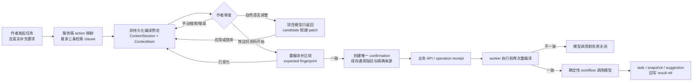

# Context 能力与任务前确认诊断（2026-09-01 复核）

## 结论

本轮把 Context 从“按 section 看一眼再确认”升级为作者可操作、可追踪的任务前资料合同。当前
代码已形成同一条主链：真实任务意图先参与检索，预览不落业务记录，作者逐项或通过模型提议
调整，最终确认只写一条 confirmation，worker 在 provider I/O 前重新编译并比较同一通用
指纹。既有未来 Scene 截止、POV 知识边界、P20 排除和 semantic review 绑定没有另起实现。

本结论是代码与自动测试证据，不等于真实作者已经喜欢该体验，也不等于真实模型质量达标。

## 独立 Review 闭环

- Scene 融合不再只验证 confirmation ID：请求 Scene 必须等于 pinned Scene，provider 使用
  rematerialized confirmed Markdown，旧 related-context overlay 不再旁路回流。
- 世界健康的语义分片和人工简介刷新均按 confirmation 的实际 selected assets 过滤；确定性
  World 校验与自动简介维护仍保留完整 manifest。
- confirmation 请求期间冻结资料编辑、搜索、AI 调整与重新整理，并在响应落地前复核 dirty
  状态和已审查指纹；取消仍可用。

## Context 能力矩阵

| 能力 | 本轮前 | 当前实现 | 自动证据 | 仍需外部证据 |
|---|---|---|---|---|
| 打开即预览 | 点击确认后才编译并关闭 | 打开自动整理；有效指纹前禁用主按钮 | 前端首次加载/失败/迟到请求测试 | 真实作者首次价值时间 |
| 预览与落库 | 重新整理会产生 confirmation | compile、搜索、AI 提议、取消均零 confirmation；最终只写一条 | 后端行数与 409 测试 | 生产数据库观测 |
| 逐项控制 | 主要是 section 排除 | `ContextItem` + TargetRef/SourceRangeRef 逐项加入、排除、恢复 | 精确 rendered section、P0、预算测试 | 大项目资料可发现性 |
| 预算语义 | 自动裁剪，作者难判断 | required/author_pinned 不静默裁剪；超限 blocker | pinned 超限测试 | 长篇真实 token/延迟 |
| 通用指纹 | 特定场景有局部指纹 | provider 可见 items、来源、选择和范围统一 SHA-256 | 预览—确认—执行重编译测试；Scene 自动推导章节的即时 409 回归 | 真实 worker/模型日志抽样 |
| 作者真实意图 | 补充要求可能在检索后拼接 | `user_note` 先进入最多三条 query clause并成为必需项 | planner 与 modal payload 测试 | 作者指令命中率 |
| 自然语言增减 | 无 | 单次 suggest/read-only step，只提议、作者应用后重编译 | 未知短键、放弃/应用、越界过滤测试 | 真实模型提议准确率 |
| 结果追踪 | 部分任务绑定 confirmation | task、context snapshot 或 suggestion 回写 result ref | API/任务契约与静态门禁 | 生产任务完成态抽样 |

## 手动任务覆盖矩阵

| 作者入口 | action / 执行方式 | 确认策略 | 领域 overlay 约束 | 状态 |
|---|---|---|---|---|
| Writing 生成/续写/POV | `writing.generate` | 每次作者任务确认；执行前重验 | 精确消费 confirmed Context | 已覆盖 |
| 冲突 AI 判断/建议 | `writing.conflict_check.*` | 每个作者动作确认 | 原检查证据与 confirmation 绑定 | 已覆盖 |
| 独立语义审查/定向返修 | 原生成 action | 复用原 confirmation，不重复弹窗 | 重验正文来源与 hidden guard | 已覆盖 |
| 大纲层生成/分析 | `outline.generate` / `outline.analyze` | 每次确认 | P20/范围指纹继续生效 | 已覆盖 |
| 故事总览生成 | `outline.story_outline.generate` | 每次确认，wire 新增 ID | confirmed Markdown 入模；自动背景按 allowlist | 已覆盖 |
| Scene 融合 | `outline.scene_fusion.preview` | 融合预览前确认 | 请求 Scene 必须等于 pinned Scene；provider 消费 confirmed Markdown | 已覆盖 |
| 人物卡/反应/剧本/一键推演 | `story.*` | Scene 级确认 | 角色 overlay 继承 pinned/excluded/可见截止 | 已覆盖 |
| 生成中心聊天/收束/探索/建议/页面检修 | `world.generation.*` | 每个作者动作确认 | generation-background 精确消费 confirmation | 已覆盖 |
| 问世界 | `world.ask` | 每次问题确认 | 候选仅保留 confirmed selected assets | 已覆盖 |
| 世界对象融合建议 | `world.entity_fusion.suggest` | 启动任务前确认 | worker 只扫描确认后的对象 ID | 已覆盖 |
| 世界书简介人工刷新 | `world.world_bible.synopsis.refresh` | 人工刷新确认一次 | 人工 source manifest 按 selected assets；自动维护仍用完整 manifest | 已覆盖 |
| 世界健康语义校验 | `world.validation.semantic` | 仅启用语义 policy 时确认 | 完整 manifest 做确定性检查；模型分片只用 confirmed allowlist | 已覆盖 |
| AI 地图册 | `world.map_atlas.generate` | run 启动时确认一次 | plan/图片内部阶段复用 run snapshot | 已覆盖 |
| RP Interaction | 独立 attempt/context path | 不接入作者创作 Context | 保持原边界 | 按计划排除 |

## 任务与资料的统一链路

## UI 与掌控感

- 首屏先回答“这次做什么、资料能否开始、AI 会看到什么”，高级范围、模式、待处理内容和
  Activation Profile 渐进展开。
- 作者不接触 raw ID、JSON、Prompt 或 token；诊断信息仍可在次级入口查看。
- 每个可选 item 有“本次不用/恢复使用”，预算遗漏项可升级为作者显式加入；必需项没有伪按钮。
- 自然语言命令与任务补充要求是两个字段：前者只改资料，后者参与检索并进入最终任务。
- 主按钮在预览加载、选择标脏、blocker、未处理 AI patch 和 409 期间保持 disabled。
- 统一 modal 支持 Escape/取消、错误焦点、`aria-live`、可见 focus、44px 点击区和小屏整屏布局。

## 质量门禁与证据分层

| 证据层 | 当前结论 |
|---|---|
| 自动测试 | 后端 `4747 passed / 12 skipped / 6 deselected`、前端 `2117 passed`；专用 PostgreSQL 浏览器 E2E 已覆盖 Writing、大纲、Story 一键推演、生成中心、问世界和地图册 |
| 离线检索评测 | 冻结通用 RAG 基线仍为 P@5 `0.1656`、MRR `0.6098`、R@10 `0.8996`、no-answer FP `1.0`、visibility leakage `0`；本轮不改写为更好数值 |
| 问世界专用离线门禁 | 本轮实跑 23 例：P@5 `0.96875`、no-answer FP `0.0`、source hash/citation open 均 `1.0`、ready=true；只证明固定数据集证据排序与引用合同 |
| Context 选择合同 | 必需/手选/排除、指纹一致与非法引用由确定性测试要求 100%；这证明合同，不证明检索语义质量 |
| 真实模型验收 | 尚未运行本轮专用 real-LLM probe；自然语言提议的实际准确率不可宣称 |
| 真实作者体验 | 尚无作者试用、采用率、撤销率或任务完成时间；“掌控感提升”仍是待验证产品假设 |

全局 `RERANKER_ENABLED` 继续默认关闭。`eval-context-planner` 已有严格目标
`no_answer_false_positive_rate <= 0.20`；冻结基线当前不满足，因此不能用本轮 UI/合同改进声称
RAG 已达标，也不应为每次打开确认窗增加 reranker 延迟和费用。启用必须另以冻结数据证明：
必需/手选/排除遵守率与三阶段指纹一致率均为 100%，visibility leakage 为 0，no-answer FP
不高于 0.20，answerable R@10 相对 `0.8996` 下降不超过 1 个百分点，且自然语言操作无未知或
越权引用。

## 剩余风险与下一步验证

1. 六条作者入口已在专用数据库完成浏览器 E2E；仍需带真实 worker 的测试 provider 日志抽样，
   对照 UI 指纹、confirmation 指纹与 worker 指纹。
2. 运行 20–30 个真实模型自然语言调整 probe，人工标注“正确加入/正确排除/不应操作/未知”，
   不能把结构化 schema 通过率当作建议准确率。
3. 邀请长期创作作者完成“生成前删除一项、补一项、处理一次 409”任务，记录完成率、耗时、
   放弃点和是否理解“本次不用”只影响当前任务。
4. 通用 RAG abstention 仍是独立质量缺口；在 dev split 校准前保持 reranker 关闭，test split
   只作冻结验证。
