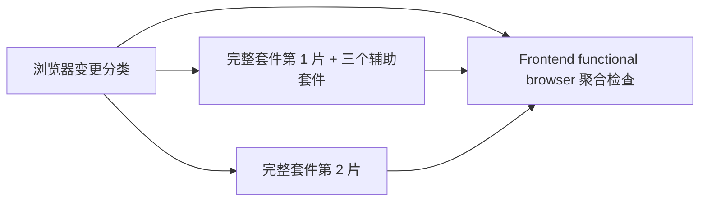

# CI 优化计划

日期：2026-10-04。状态：计划已核查，性能优化尚未实施。建议先完成已有门禁修复，再做完整浏览器套件的两片并行；其余优化按新瓶颈决定。

## 目标与范围

缩短 PR 获得全部必需检查结果的等待时间，保留现有测试、覆盖率、隔离、依赖审计及安全门禁。第一批只改 CI 编排、相关验证和测试文档，复用已安装的 Playwright，不新增依赖或常驻服务。

完整浏览器回归的首轮验收目标为：同等测试源码和依赖版本下，3 组对照的浏览器检查中位耗时下降至少 25%，且不超过 12 分钟；对应分类、分片、聚合 jobs 的 runner 分钟合计不超过串行对照的 1.25 倍。这是推广条件，尚无分片运行实测支持，不能承诺耗时减半。另计排队时间，确认新增 runner 没有把执行收益抵消。

本轮用户要求做计划；没有实施性能优化、触发外部 CI、提交、推送、合并或部署。

## 已核实的基线

- PR [#188](https://github.com/FengHuoLinShan/ai-writing-assist/pull/188) 已于 2026-10-04 00:17:54+09:00 合并。当前已 fetch 的 `origin/main` 为 `4d7540470a166930836dfdf244a20fa7d1ef65bf`；开工时重新核实，使用新的 `codex/` 主题分支和后续 PR。
- 本工作树仍在 `codex/storyforge-v6-implementation`，HEAD 为 `c10b6983c3c35f213db641e668e73e37ec3553b8`，上轮七项修复尚未提交。保留全部改动；这份计划不授权处理这些改动或再次更新已合并的 PR。
- 上述两个 commit 的 CI workflows、分类脚本、Makefile、前端依赖与测试配置无差异；下列完成态运行可作初始参考。最新 main 的部分 CI 在取样时仍运行，不能算作全绿。

| 检查或步骤 | 已完成参考运行耗时 | 判断 |
| --- | --- | --- |
| Frontend functional browser job | 17 分 15 秒 | 当前关键路径 |
| 其中完整 functional 套件 | 14 分 05 秒 | 优先分片 |
| assistant / creative / editorial | 21 / 82 / 16 秒 | 继续各跑一次 |
| 后端依赖 / 前端依赖 / Chromium 安装 | 4 / 3 / 28 秒 | 缓存调整优先级低 |
| Backend quality job | 5 分 01 秒 | 当前无需分片 |
| PostgreSQL critical job | 1 分 14 秒 | 保持串行 |
| Frontend unit quality job | 1 分 43 秒 | 当前无需分片 |

时间来源：[Frontend 运行](https://github.com/FengHuoLinShan/ai-writing-assist/actions/runs/37104703592)、[Backend 运行](https://github.com/FengHuoLinShan/ai-writing-assist/actions/runs/37104703585) 的 job/step 起止时间；仅一份参考样本，不是历史中位数或 P95。完整 functional 当时为 296 passed、2 skipped，另三套件合计 8 passed。

2026-10-04 已运行 Playwright `--list --reporter=json`，仅收集测试，不启动服务器或连接数据库：完整套件 43 文件、298 项；原生 `--shard=1/2` 为 22 文件、155 项，`--shard=2/2` 为 21 文件、143 项。两片测试多重集合的并集等于完整集合，交集为空；四文件 smoke 为 58 项，亦完成并集校验。assistant / creative / editorial 分别 1 / 6 / 1 项。

历史日志按文件累计的测试时间约为第一片 381 秒、第二片 434 秒，不包含服务器与 hook 等全部开销，只用于选择辅助套件先放第一片，不能作为分片耗时预测。清单与方法摘要在 `/private/tmp/ci-opt-shard-feasibility-20261004.json`，临时文件可能被系统清理，事实可用下述方法重新核验。

## P0：交付已有正确性修复，建立可比对照

上轮已本地修好两项，尚未进入 main：

1. `scripts/check_file_sizes.py` 对 `--head` 的行数检查读取对应 Git blob，工作区改小或删除文件不能绕过门禁；沿用既有治理负例。
2. `.github/workflows/backend-postgresql-e2e.yml` 的既有 diagnostics artifact 包含 `backend/.test-artifacts/scale-*.json`，保留失败时上传和隐藏目录支持。

先按任务交付安排把这些修复纳入后续 PR，并在固定新 head 核实远端门禁和 nightly 产物。其他业务修复沿用[主任务记录](../../.agent/tasks/2026/T-20261002-storyforge-v6-review/TASK.md)，不得为了拆 CI PR 丢弃 WIP 或只搬测试而漏掉实现。P1 的串行对照应基于修复交付后的同等业务版本。

用 GitHub job/step 时间及现有测试报告记录：固定 SHA、事件类型、选中的 suite、实际测试数、排队时间、最长检查用时、runner 分钟、失败/取消与跳过数。首轮取 3 组对照，保留原始失败；不把重跑成功替换首次失败，不建立新的监控服务或基准框架。

## P1：完整浏览器套件用两个独立 runner

### 编排

在 `.github/workflows/frontend-ci.yml` 增加轻量 browser 分类 job，继续调用 `scripts/classify_ci_changes.py`，输出原有 `browser` 和 `browser_suite`。分类成功且确需浏览器时才创建带 PostgreSQL/MinIO 的测试 jobs，避免文档 PR 初始化这些服务。前端 unit job 先保持原状，避免扩大改动。

- 完整套件使用 matrix `[1, 2]`、`fail-fast: false`、`max-parallel: 2`。每片独立 hosted runner、专用 PostgreSQL、MinIO 数据目录和应用进程，继续 `PW_REUSE_EXISTING_SERVER=0`、`workers=1`、`retries=0`、`fullyParallel: false`。
- 继续通过现有 npm script 执行，追加 `--shard=1/2` 或 `--shard=2/2`。文件内部仍串行，不调整断言或合并三个专用 harness。Playwright 提供原生文件分片，未开启 fullyParallel 时按文件分配。[官方说明](https://playwright.dev/docs/test-sharding)
- assistant、creative、editorial 仅在第一片正常流程依次执行，各一次，保留原有专用配置、合成模型 harness 和开关。先按当前时间分布选择第一片；若后续明显不均衡，再按实测调整。
- 后端相关 PR 的 smoke 保持单 runner，三个辅助套件也各一次；仅完整套件启用两片。文档等无需浏览器的 PR 不启动测试 runner。前端/未知路径 PR 与 main 仍使用完整套件，分类策略不收窄。
- 两片上传独立命名的诊断与原生 blob 报告，辅助套件的报告目录也分别命名，避免后一次 Playwright 调用清空前一次产物。相关 jobs 结束时保留失败报告，使用现有固定 SHA 的 Actions 和 14 天保留期。首版无需额外 HTML 合并 job。

GitHub matrix 可原生控制并行和 fail-fast，无需自建调度。[官方说明](https://docs.github.com/en/actions/how-tos/write-workflows/choose-what-workflows-do/run-job-variations)

### 必需检查必须真实反映结果

`main public alpha quality gate` ruleset 当前启用，包含 `Architecture docs`、`Backend quality`、`PostgreSQL critical`、`Frontend unit quality`、`Frontend functional browser`、`Production image contract`。传统 branch protection 接口返回 404，不能据此推断没有门禁；已读取实际 ruleset。

保留原 job ID `frontend-functional-browser` 和显示名 `Frontend functional browser` 作为不带数据库的聚合检查，通过 `needs` 等待分类及测试 jobs，使用 `if: always()` 执行结果判断。不要把原必需检查名直接用于 matrix，也不要改 ruleset。

| 分类与执行结果 | 聚合结果 |
| --- | --- |
| 分类成功，明确 `browser=false` | 成功，说明该变更无需浏览器 |
| 分类成功、需要浏览器，预期测试 jobs 全部成功 | 成功 |
| 分类失败、输出缺失或值异常 | 失败 |
| 需要浏览器，但任何分片失败、取消、超时或意外跳过 | 失败 |
| smoke 被选中但 suite/片数不符，或必要辅助套件未执行 | 失败 |

聚合判断拒绝不符合预期的结果；不能用 `continue-on-error`、workflow paths 过滤、`--pass-with-no-tests` 或允许失败来制造通过。测试与报告步骤的必要执行条件由合同检查覆盖；失败注入还须证明 GitHub 实际聚合行为。

### 修改范围与验证

预计修改 `.github/workflows/frontend-ci.yml`、`backend/tests/unit/test_repository_security_automation.py` 和 `testing-guide.md`；只有实际需要时才调整现有分类输出/对应测试。优先通过 CLI reporter 与现有配置实现，不为分片新增配置层。

原自动化合同测试把 service、分类步骤和执行命令都绑定在旧单个 job 上。迁移时保留专用数据库、MinIO digest 校验、零重试、所选 suite 和稳定检查名等有效断言，增加聚合失败路径验证；不能简单删除旧测试来过检。

验收按以下顺序执行：

1. `make docs-check`；更新后用仓库锁定工具链运行 `backend/tests/unit/test_ci_change_selection.py`、`test_repository_security_automation.py`，并完成修改脚本的适用 lint。CI 变更属于未知路径，远端应运行完整质量门。
2. 同一 checkout 收集未分片、两片的 `--list --reporter=json` 清单，按 project、file、line、column、title 比较多重集合，验证并集完整且没有重复。实际值随新增测试更新，不把 298 写成永久常数；当前全量另加辅助套件应收集 306 项，参考运行的两个既有 skip 保留原因，禁止新增未经解释的 skip。
3. 在一次性合成数据库/MinIO 上实际执行两片完整套件及各一次辅助套件，确认没有跨文件前置依赖、共享缓存或端口冲突；清单校验不替代这一步。
4. 在专用验证 PR 注入一个分片失败，验证另一片仍完成、失败诊断可下载、必需聚合检查失败；另验证分类失败、需要执行却跳过和取消均不能通过。注入改动仅用于验证，最终 head 恢复正常并重新运行相关检查。
5. 核验前端变更 PR 全量、后端变更 PR 单片 smoke、纯文档 PR 无浏览器服务、未知路径 PR 全量、main 全量，以及删除/重命名、无效固定 SHA 的失败关闭契约。
6. 在相同测试源码/锁版本下完成 3 组串行与分片对照，记录两侧固定 SHA；确认全部覆盖与稳定性后，再按前述耗时及 runner 分钟标准决定推广。只有三组样本时不宣称长期 P95 改善。
7. 收尾 `make docs-check BASE_REF=origin/main`、`git diff --check`；更新测试指南与主任务证据，在最终固定远端 head 完成全部必需检查。测试绿色仍只代表工程验证。

## P2：仅在实测表明值得时追加

- 若独立 runner 的队列等待抵消收益，先核实账户并发额度和 job 分布，不自动升级付费规格或扩到四片。
- 若新关键路径由个别测试文件主导，先修该文件已证明的等待/夹具成本；确有收益再拆独立文件，保留状态相关测试的顺序。暂不启用同数据库多 worker 或 fullyParallel。
- 若大量无关 PR 的 service 初始化成为显著成本，再把分类前置模式应用到 PostgreSQL critical/镜像 jobs，仍用稳定聚合检查报告结果。
- 只有安装步骤成为明显占比时再实验 Chromium 等缓存，并比较恢复与安装总时长。现有 npm/uv 缓存继续使用；当前安装合计仅 35 秒，不先做这项。

不减少 CodeQL、依赖审计、coverage、PG critical、nightly 全量与规模门；不把有效测试移出 PR；不引入重试掩盖失败。Backend 快速层与真实 PostgreSQL 并发层继续采用现有并行/串行策略。

## 回退与交付

先交付 P0，再以独立后续 PR 交付 P1；P2 仅在新证据支持时启动。回退按普通新增 commit 恢复原串行浏览器 job 和相关合同文档，保留稳定检查名及 P0 正确性修复，不重写历史。

新增漏测、数据串扰、异常跳过、聚合假绿或基准没有达到推广条件时，修复并重验；无法达到则保留串行方案，不以提速名义放宽门禁。首轮可验收交付物为完整测试清单比较、固定 SHA 的成功/失败证据、3 组耗时与 runner 分钟对照，以及更新后的 CI/测试文档。

本计划的维护入口为[StoryForge 主任务](../../.agent/tasks/2026/T-20261002-storyforge-v6-review/TASK.md)。实施授权和交付授权以当时用户指令为准。
