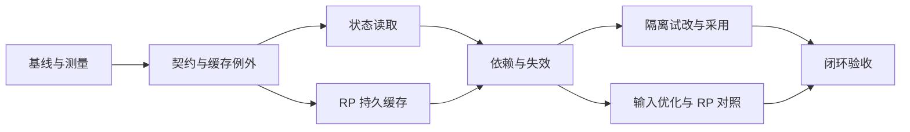

# 远景第一阶段：世界状态与修改闭环，连带 RP 成本优化

日期：2026-10-06，修订：2026-10-07（Asia/Tokyo）。状态：开发计划；M0 已有实测，业务重构尚未实施。

本次修订依据已合入的架构优化 PR #201 与事件软删 PR #202；固定基线见第 2 节。
D1–D6 和 USD 20 规划上限保持；本次新增 D7 检索质量验收决定与 M3 重构设计。

本计划交付一个可使用的小闭环：在指定场景查看带来源的世界状态，隔离修改一个条件、
比较有限后果，经作者确认进入原领域；同一套来源、版本与可见性契约支持 RP 原作资料复用。
第一阶段保持现有事实权威和生成质量，降低重复处理与输入成本。

规划与交接记录见 [任务笔记](../../.agent/tasks/2026/T-20261006-world-foundation-phase1-plan/TASK.md)。
本计划不替代现行 ADR、模块契约或旧任务的完整验收；实施进度记录在任务笔记，不把计划写成完成报告。

## 1. 已确认的关键决定

| ID | 用户选择 | 对实施的约束 |
|---|---|---|
| D1 | 状态底座＋隔离试改＋RP 优化的完整小闭环 | 同时交付可操作的作者路径和 RP 路径；规则仅覆盖少量明确场景 |
| D2 | 保持当前生成质量，减少重复查询与输入 | 固定当前 provider/model/档位；不减少知识审查，不以降档或换模型取得收益 |
| D3 | 先贯通现有权威，正式切换后置 | 不启用 ADR-0017 的 formal family，不迁移作者事实到第二套权威 |
| D4 | 私有数据库持久缓存编译正文 | 支持跨 worker/重启；实施先同步 ADR-0018 的缓存例外与隐私生命周期 |
| D5 | 仅缓存、重复查询去重、输入优化 | 本阶段不实施按需免检索，也不实施影子免检索；新查询仍走现有 Evidence 路径 |
| D6 | 真实模型验收累计上限 USD 20 | 仅规划预算；本轮无模型调用；实施时冻结样本、执行范围和唯一累计账本 |
| D7 | 检索片段与排序可变化，以任务质量不退化验收 | 冻结关键证据召回、知识边界与最终 RP 质量门禁；不要求复制旧检索集合/排序 |

初版规划本身不授权实施；事件软删基线集成与随后独立开展的 M0 测量分别留有任务记录。
M0 测量见 [实施笔记](../../.agent/tasks/2026/T-20261006-world-foundation-phase1-impl/TASK.md)。
本次依据实测讨论并保存设计，不修改业务代码、现行 ADR 或数据库；实际付费运行与发布
仍遵守对应授权与门禁，预算选择不触发调用模型。

## 2. 基线、既有能力与衔接

- 初版基线为 77620459d；修订时主干已包含架构优化
  [PR #201](https://github.com/FengHuoLinShan/ai-writing-assist/pull/201)，
  以及先行集成的事件软删
  [PR #202](https://github.com/FengHuoLinShan/ai-writing-assist/pull/202)。
  当前计划工作树固定在 85fb1c7be35ae687f949863d179f5fd63c53f3c0。
- 原主工作区 codex/event-soft-delete@221ef2339 和未跟踪文件保留；事件修复经独立工作树完成
  主干集成及必需 PR 检查。合入 main 不等于生产发布，合并后 main CI 与部署分别记录。
- 开始实施前重新固定主干 SHA，核对相关在途工作；已合入的架构 seam 直接复用，
  本阶段不再安排先做一轮全仓架构清理。

### 2.1 架构优化后的可复用底座

| 已合入的变化 | 对本计划的调整 |
|---|---|
| ADR-0031 依赖裁定、实际依赖边冻结、facade SQL/动态导入门禁 | M1 直接沿合法方向和现有 SPI 接线；不通过增加函数内导入或放宽基线绕门 |
| ServiceKey、消费方协议与组合根装配 | 复用有类型的键；新 eval/独立 CLI 按既有入口装配并测冷启动，不另建服务定位器 |
| Evidence 的 SourceRangeRefContract、Writing 稿源与 Story Scene port | 原文与 Scene 回读经现有 port；状态/缓存共享来源锚点，不另造引用格式 |
| ContextConfirmationRequest 与 Scene memory 版本解析 | 手动确认沿现有请求契约；缓存绑定实际解析的版本，不把 None 当作固定版本 |
| Collaboration creative_manifest 与 world_stress_checks 已归本域 | M5 沿已有冻结输入、baseline/overlay、检查与采用实现补局部比较，不迁回 Evidence/World |
| World API/schema/生成中心按职责拆分，前端 API 按领域拆分 | 修改所属子域与 api/story.js、context.js、interactions.js、collaboration.js，继续经 Vue bridge 消费 |
| worker schema guard、生产 pgvector fail-closed、PG ORM parity | 新缓存 migration 使用现有启动与迁移门禁，不另建健康检查；应用回退保留 schema |
| stable_hash 收敛、embedding 两条路径说明 | 复用字节等价的 hash；M0 按实际 embedding 链测量，不用本地结果代替生产成本 |
| 事件扩展软删、写锁和安全降级保护 | M0/M4 复用既有生命周期与并发门；相关依赖的废弃要复验，不新建第二套删除状态 |

以上是降低接线和维护成本的基础，不表示历史状态、依赖闭包或 RP 持久缓存已经完成。
架构优化记录中的测试数量只说明对应提交的工程验证，不能代替本阶段行为/模型/作者验收。
events.status 只控制事件扩展行当前是否活跃；删除不废弃 CoreEntity，复活使用同一行的新字段。
软删保留行不构成不可变的逐次修订历史，也不证明事件何时发生；M2 的历史状态仍经 Story
版本/事件重放与精确来源恢复，不能把 deprecated 或当前 World 行直接解释为过去的世界状态。

### 2.2 仍需补齐的业务能力

| 现有能力 | 可以复用的实现 | 第一阶段要补齐的部分 |
|---|---|---|
| 世界事实与正典版本 | World 领域、ADR-0017 Phase 0、专用版本与采用入口 | 统一读取语义与来源证明；formal family 仍关闭 |
| 历史状态 | Story continuity 单一 reducer、Scene checkpoint、在场投影 | 指定版本/场景/视角的一致只读状态与覆盖说明 |
| 来源与持续理解 | Evidence 原文回读/确认，Evolution 观察、真实回执与失效 | 同闭环消费者的依赖登记、失效与复用；未知依赖仍保守扩大 |
| 隔离修改 | Collaboration 基线＋overlay、检查、领域 prepare/apply、采用回执 | 原状态与候选状态的局部比较，来源/版本冲突和就地作者入口 |
| 有限规则/行动 | Story observations、SimulationSeed、ResolutionBatch | 对资源、位置、知识的少量确定性约束，失败/未知不冒充成功 |
| RP 原作引用 | 冻结 source revision、固定/排除、角色/读者截止、每轮 Evidence 编译 | 私有持久缓存、同轮去重、稳定输入；继续独立审查新正文 |
| 降本观测 | 检索耗时、embedding 缓存、LLM 用量与缓存诊断、既有 eval | 按同一输入比较冷/热缓存、跨 worker、输入布局与质量 |

调查确认 RP compiler 调用 retrieve(top_k=12, rerank=False)，随后精确回读原文；
Agent 补查再次调用 compile_interaction_story_context。本地 BGE ONNX 已有 LRU 向量缓存，
生产 TEI HTTP 客户端未接入这份缓存；M0 分别实测重复 embedding 和回读/编译成本。
本阶段通过资料包复用减少重复调用，不另建向量缓存，也不据 provider 名称推断费用。
查询由当前输入、回顾和最近发展组成，通常每轮变化：完整资料包的精确缓存不保证跨轮命中，
也不保证整个 RP 请求的费用显著下降。

关联既有 [V4 长期计划](novelcraft-v4/README.md)、[复核所有权](../adr/0022-world-review-ownership.md)、
[创作试验模块](../modules/21_collaboration.md)、[RP 来源版本](../adr/0018-versioned-author-source-context-for-rp.md)。
旧 V4、协作试验与认知研究的未完成验收继续保留；不移用旧任务的预算或把旧报告当当前质量证据。

## 3. 第一阶段的范围与完成定义

### 3.1 作者闭环

作者从既有正文/场景工作台进入“当前世界”，查看人物、关系、位置、持有资源与知识的
已知/未知状态及依据；从当前状态发起一次隔离试改，比较原方案与候选方案的有限后果，
核对确定关联与尚未检查范围，再确认保存到原领域工作稿或正式资产。

首个验收切片使用合成故事：甲将钥匙交给乙保管，所有权证据与保管证据分开；某个秘密仅
特定人物知道；锁的开启需要明确条件。作者试改已选世界书工作稿中的规则或场景安排，
比较两种结果。没有明确资源状态或规则依据时返回不确定，不把缺少记载当作“没有钥匙”。

修改进入 Collaboration 已支持的 world_bible_draft、scene 或 writing_draft port。
对象/关系的直接试改若不在当前 port 内，仍走已有领域提案，不扩大为任意表写入。
候选推演与采用后的作者规划均不自动成为“已经发生”的故事事件。

### 3.2 RP 闭环

绑定作品的已登录 RP，在相同有效输入下复用资料包，跨 worker/重启仍可命中；
Agent 重复补查不重复付出相同召回/编译成本；固定原作资料与本轮变化分别组装，
新正文继续经原独立知识审查后释放。

原作资料、私人选中分支和新输出的审查资格分开。资料复用不把原作正史写成私人新事件，
也不让未选分支、未来章节、角色不可知内容进入生成或用户 API。

### 3.3 明确后置

正式事实 family 准入/切换、完整形式推理、通用规则 DSL、全世界经济/物理模拟、
长期自治 NPC、新多 Agent 平台、作者正典分支合并、按需/影子免检索、模型降档、
全文持续自动重写、跨作品 RP、公开/匿名持久缓存、新队列/缓存服务和生产部署均不在本阶段。

本阶段不承诺完整小说理解或完整依赖闭包。未有可靠来源的历史状态、未登记的隐含影响，
保留 unknown/not_checked/unsupported，并在作者界面用易懂文字说明。

## 4. 共同架构契约

### 4.1 指定范围的状态读取

- 请求明确 novel、精确来源版本、StoryPosition、读者/角色/作者视角；世界内时间仅在资料明确时表达。
- 正文顺序、世界发生时间和资料修订版本分开。未知日历或路线不推算成具体日期/时长。
- 复用 Story 当前契约的 entities/relations/locations/knowledge 归约。
  timeline/causality 返回带来源的事实/陈述，不能把保存的因果文字称为已执行规则。
- 返回状态指纹、实际来源/事件/回执、投影契约版本、已检查/未知/未支持维度；
  使用现有契约适配出一个有限只读投影，不建立通用世界模型框架。
- 历史状态只能从该时点合法来源与 Story 事件重放；禁止用今天的 World 当前行补齐过去。
  文档来源、AI 解释、已采用事实、人物信念与候选假设分别标注。
- 作者后见解释、Collaboration 持久理解和排演 overlay 不回流较早 Scene 的角色知识。
- 无法精确恢复的资产返回缺口；不要用空列表表示“世界中确定不存在”。

### 4.2 唯一职责

| 所有者 | 负责的内容 | 消费边界 |
|---|---|---|
| World | 采用事实、对象身份、世界书/规则、变更复核聚合 | facade/contracts；现有权威不切换 |
| Story | Scene/事件、历史状态解释、有限行动裁决及状态只读投影 | 单一 reducer；投影及字段覆盖由 Story 解释 |
| Evidence | 来源/版本/可见性复验、上下文编译与 RP 派生缓存 | RP 不直读 World/Writing/RAG 表 |
| Evolution | 来源变化、顺序理解、真实回执与保守重算 | 不替代世界复核 owner 或私人分支 owner |
| Collaboration | 冻结基线、试改覆盖、检查和精确采用编排 | 写入仍归领域；不能直接写正史 |
| Interaction | 私人分支、回顾、每轮输入与生成释放 | 原作包独立于私人历史及输出审查 |

跨模块依赖沿当前 facade/contracts 或已注册 DI port；组合根只装配。
为新消费者增加的适配必须落在语义所属领域，不以新增转发层或 DI 数量作为完成指标。
具体方向按 [ADR-0031](../adr/0031-module-dependency-directions.md)；Evidence 消费稿源和 Scene
沿 WRITING_MANUSCRIPT_SOURCE / STORY_SCENE_SOURCE，创作资源沿 COLLABORATION_RESOURCES。
SourceRangeRefContract 由 Evidence 定义，Writing 仍是正文事实源，契约搬迁不改变事实所有权。
Scene memory 缺省版本先解析为 Story 当前具体版本，再参与投影、缓存和回执指纹。

### 4.3 依赖与修改成本

每份本阶段派生成果记录实际消费的来源：资产类型/身份、精确版本/hash、范围、视角、
截止点、解释方法版本；依赖派生结果时保留它的传递来源。复用已有 provenance/manifest/
receipt 载体，仅实际缺少持久载体的 RP 缓存新增专用派生表。

正文/场景/世界书修改先做确定性差异，再传播显式依赖。消费者包括本阶段状态投影、
试改检查、Evidence 包和 RP 缓存；未登记语义依赖不能宣称不受影响，沿既有路径保守扩大。
世界知识/地图册先复用其本域新鲜度入口接入可证明来源，旧无来源资产仍列未支持；
状态图层与底图/插画独立，不因为人物位置改变就重新生成图片。

历史与作者确认保留，派生结果标记过期；失效和昂贵重算分开。只有来源、范围、权限、
解释版本及完整依赖均重新验证的结果才能复用，不以摘要相似度绕过来源门。

本阶段不承担清零剩余 9 个双向对和 525 条函数内导入，也不前置全仓文件拆分。
AO-7 延后的 Writing/Interaction/Scene workbench 编排，仅在本阶段必须实质修改对应职责时
做局部拆分并覆盖真实调用方；无需触碰的文件保持原状。hash 复用只收敛字节等价实现，
保留旧 confirmation、幂等键和回执解释，不用“统一”重置历史。

## 5. RP 持久缓存与输入优化

### 5.1 存储和生命周期

在 Evidence compilation 内建设仅服务 RP 原作包的专用派生缓存，继续使用 PostgreSQL。
缓存全文是已确认的 ADR-0018 例外；M1 先修订该 ADR、Evidence/RP README 与数据库设计。
ContextSnapshot 和调用账本继续只记录指纹/引用/预算摘要，不把缓存正文复制到审计 JSON。

缓存内容包括编译正文、精确来源引用、包含/排除与覆盖、正文摘要指纹、预算/方法版本及到期时间。
不保存 API Key、原始 Prompt、用户检索原句、私人旅程历史、模型正文或生成审查 PASS。
查询只存规范化后的哈希，不保存原句；编译包确含玩家身份描述时按本 owner 私有数据处理。

入口只服务已登录、绑定来源的普通 RP 与已授权 Agent 补查；匿名公开演示沿原路径运行。
跨 worker 共享同一私有缓存，命中仍通过当前 principal、owner、source/consumer 和来源活跃门禁。
首期不做跨账户共享或自动共享私人视角包。

保留参数暂定 24 小时、单条正文不超过 256 KiB、每 consumer 项目总量不超过 32 MiB；
M0 用真实编译尺寸校准并冻结，调整记录于决策台账。过期条目立即不可命中，
采用已有任务/维护机制物理清理，不新增常驻服务；项目删除级联清理派生行。
来源归档/权限撤回/必需引用失效时立即拒绝使用，随后清理；不能等待 TTL 再生效。

缓存不进入正文索引、demo copy、项目导出、公开 API 或日志；备份策略排除缓存正文表数据，
恢复后作为冷缓存重建。备份脚本变化做本地静态/恢复契约验证，生产应用仍另行授权。
与已授权来源一同作为敏感数据保护，SQL 错误和诊断不能包含缓存正文。

### 5.2 缓存命中与复验

整包精确 key 至少覆盖：owner/consumer/source、source revision 整体指纹及实际 manifest、
完整 chapter/offset 截止、知识主体/可见性版本、玩家身份、固定/排除/歧义决议、
查询摘要、top_k/召回参数、索引/目录版本、编译/渲染版本、实际预算与 tokenizer/profile。
如果某字段实际影响正文或选择，必须进入 key 或被当场重新验证。

不能只用 source_revision_id、query 或 TTL。依赖尚未冻结的 mutable 别名/排序目录时，
登记实际目录指纹或禁用该路径的缓存，不能靠时间有效期推断没有变化。
原作包 key 不混入无关的私人 selection epoch；每轮生成与释放仍独立重验当前选中分支。

命中复验权限、来源可用性、引用版本、截止/视角/选择、缓存内容/契约完整性及预算适配。
可靠版本标记或不可变来源经过验证前，继续精确原文回读；不要为节省 DB 查询放宽 hash/offset 门禁。
每次 attempt 建自己的来源使用与审查记录，不复制旧 task/attempt 的成功资格。

同 key 并发使用唯一约束与短事务协调，模型/embedding I/O 不持数据库锁；
不得以避免重复冷查询为由引入跨 worker 长锁。重复缓存填充可以幂等覆盖相同派生结果。
缺失/过期/损坏缓存走原编译路径；权限或来源失效仍失败关闭。数据库故障不得被吞掉为“缓存未命中”。

### 5.3 去重与稳定输入

- 初始编译和 Agent 补查共用 Evidence 缓存入口；同轮同 query/scope 的重复查询复用。
- 预算不同的包不得直接套用。可复用同来源/视角的候选与回读结果，再按原必需项、
  排除、顺序和预算重新裁剪；不能给 8K 补查套入 16K 的编译正文。
- 将已固定身份、规则和必需证据与本轮动态召回分开组装；仅相同精确来源身份/版本/范围
  可以去重，不合并内容相同但来源不同的证据。
- 普通新 query 继续检索；全包缓存不命中时，固定部分仍可复用，动态部分按原语义选择。
- 稳定规则/原作部分置于稳定前缀，最新输入和动态资料放后部；权威优先级、用户最新修正、
  引用数据转义、分支有效回顾、重抽和长度续写语义保持明确。
- 生成与知识审查读取相同的实际完整消息；不减少审查覆盖，不复用上一正文的 PASS。
  新输出、返修与新 hash 仍走原释放门禁。
- 优先确定性组装和精确去重；需要新 AI 摘要时属于新增方法与费用，必须在 M0/M1
  重新提出，不能静默进入本阶段。首期不增加摘要模型或摘要调用。

供应商前缀缓存依实际账户/model 能力与返回 usage 计量，不能把命中率当保证。
DeepSeek 的匹配/计量依据见 [官方上下文缓存文档](https://api-docs.deepseek.com/guides/kv_cache/)；
实施时重新核对，不在计划冻结未来价格。

### 5.4 根据 M0 实测调整检索与缓存设计

专用 PG、本地 BGE 的 M0 实测显示，35/104 chunks 下普通 RP 编译中位约 1.0/2.0 秒，
search 占代表性 attempt 的约 70%/98%；回读与快照合计不足 20ms。瓶颈是每个短句
分别展开 n-gram，再用数百 OR-ILIKE 与 CASE 对行扫描和排序；本地向量暖态约 6ms。
这些是本机小规模结构证据，不代表生产 TEI 费用或真实小说质量。

因此 M3 同时处理精确命中与新查询 miss，详见
[RP 检索与编译重构设计](2026-10-07-rp-retrieval-refactor.md)。
原 D5 的不按需/影子免检索边界保留；D7 允许在 Evidence 内设计新查询的检索优化。
查询规划采用冻结且可见的 RP 引用目录，保持完整语义输入，另生成全查询有界的词项；
词法索引、候选排序与原文证明分工，预算裁剪和本轮审计与可复用证据材料分工。
首期只用现有 PostgreSQL、Evidence 编译入口及一张计划中的私有缓存表，不新增缓存服务。

原文回读保持，命中不复用旧 snapshot 或审查 PASS；不同预算从完整预算前材料重新编译，
不截短已经裁剪的旧正文。索引方法、查询计划与编译方法分别版本化，变化使对应缓存失效。
延迟门禁分别计量 search、embedding、材料复验、渲染和快照，不把 search <200ms
写成包含约 200ms 新 embedding 的 retrieve <200ms。性能阈值仍待冻结，质量验收按 D7。

## 6. 交付顺序与工作包

每个工作包都以固定代码 head 验收；表中是待实施工作，不表示已经完成。

| 包 | 交付 | 主要 owner / 修改面 | 前置 | 完成门禁 |
|---|---|---|---|---|
| M0 | 固定架构优化/事件软删集成后的基线、业务差距与真实链性能/费用观测 | 任务记录、既有 eval/metrics | 无 | 不重复架构工程；普通/Agent RP、实际 embedding、冷/热路径可复跑，冻结目标与样本族 |
| M1 | 增量状态/依赖/缓存契约、ADR-0018 例外及 ORM 设计 | 既有 Story/Evidence port、World 契约及权威文档 | M0 | 复用来源锚点与具体版本，依赖方向符合 ADR-0031；key、兼容、TTL/删除/备份、失败语义明确 |
| M2 | 指定场景状态读取与一个作者入口 | Story projection、Evidence 可见性、既有工作台 | M1 | 历史/知识/来源正确，未知可见，同输入多入口一致 |
| M3 | 检索重构、私有持久缓存和同轮去重 | Evidence indexing/compilation、Interaction 共用入口、迁移 | M1 | 经现有稿源 port 复验；新查询质量按 D7，跨 worker/重启命中，来源/权限变更拒绝，同方法冷热等价，冷启动已装配 |
| M4 | 状态/包/试改的依赖登记与失效 | 各域本有新鲜度 seam、Evolution、World 复核 | M2/M3 | 本闭环无静默旧结果，未支持依赖明确，历史与作者修改保留 |
| M5 | 原状态→隔离试改→有限比较→领域确认 | Collaboration creative_manifest/检查与既有领域资源 port | M2/M4 | 不重建试改框架；预览无事实写入，unknown 不冒充成功，采用 CAS/幂等/事务可验 |
| M6 | 稳定输入与质量不变的 RP 对照 | Interaction prompts、Evidence 包组装、eval | M3/M4 | 选择/权限/审查等价，去重与缓存 usage 可解释；新 query 仍检索 |
| M7 | 完整闭环验收与工程交付包 | 各受影响模块、PG、浏览器、质量/费用账本 | M5/M6 | 通过第 7 节门禁，未完成项明示；发布由独立授权触发 |

M2 与 M3 为逻辑独立开发线；M5 与 M6 汇合验收。并行不自动授权开发子代理，
当前按单主责推进，后续确需委派时由用户明确授权并划定写入面。
若目标主干已经提供某工作包能力，先对照验收复用，不再重写。



按上述门禁排期，M0 完成后给出基于实际差距的工期估计；本计划不预设人员数或上线日。
可以逐包本地交付，模型或作者验收未通过的能力保持原默认/实验状态，不用工程绿灯替代产品验收。

## 7. 验收矩阵与成本证据

### 7.1 必须通过的工程行为

| ID | 场景 | 必须观察的结果 | 验证层 |
|---|---|---|---|
| A01 | 相同事件经状态视图、写作资料与地图状态图层读取 | 同版本、同 Scene、同视角核心事实一致，来源可回开 | 单测/集成/浏览器 |
| A02 | 后文揭密、倒叙、旧稿缺状态 | 发生时间与揭示位置分开；不补今天事实，缺口明确 | 确定性夹具 |
| A03 | 保管/所有权、角色误信、资源未交代 | 观察/信念/事实分开；没有证据不造资源或结果 | reducer/规则/模型 |
| A04 | 正文同长度替换、Scene 重排、规则修订 | 真实源指纹变化触发本闭环失效，旧历史和作者决定保留 | PG/集成 |
| A05 | 来源超出范围、排除对象被关系带回 | 生成/缓存都拒绝扩大；完整必需资料缺失时失败关闭 | 权限/知识边界 |
| A06 | 隔离试改、取消、采用重试、采用时改稿 | 预览零领域写入；确认重验、幂等；冲突不覆盖后续人工修改 | PG/浏览器 |
| A07 | 缓存跨 worker/重启、同 key 并发 | 命中有效包，稳定输入等价，派生行无串项目/重复资格 | 原生 PG/运行集成 |
| A08 | 角色/截止/固定项/排除/预算/方法变化 | 新范围重新验证或 miss；不能复用高权限/超预算包 | compiler/集成 |
| A09 | owner 撤权、来源归档/软删、引用失效、TTL 到期 | 立即拒绝命中；原生成失败边界保留；正文不流入日志/导出 | PG/API/生命周期 |
| A10 | 相同 query 补查、重抽、长度续写、分支切换 | 可复用资料，新证据 ID/使用回执绑定本轮；未选分支不进入输入 | Agent/RP/PG |
| A11 | 优化布局、缓存缺失/损坏、数据库错误 | 必需信息和审查覆盖保持；正常 miss 回原路径，真实错误不隐藏 | 差分/失败注入 |
| A12 | 备份恢复、demo copy、导出、缓存清理 | 缓存正文不被复制/导出，恢复后冷重建；不删除权威历史 | 复制/部署静态/PG |
| A13 | 状态入口首次/空态/加载/失败/窄屏/离开恢复 | 作者能区分确定、待核对、试改、已保存和已采用；草稿不丢失 | 受影响浏览器流程 |

只有 A01 的历史覆盖与来源门通过，才称为“指定场景状态读取”；只有 A06 通过，
才称为“修改闭环”；缓存 API 有响应不构成 A07–A12 完成。

### 7.2 离线与工程命令

复用项目锁定工具链和现有目标，不为本计划新增测试框架。实现前和收尾执行：

```bash
make docs-check
make docs-check BASE_REF=origin/main
git diff --check
```

逻辑变更完成受影响的 World、Story continuity/observations、Evolution、Evidence、
Collaboration、Interaction 和 eval 模块测试及 lint。覆盖固定输入多入口一致、失败、
实际缓存分支/线程/跨 worker 路径；不为内部函数逐个增加复述实现的测试。

数据库验证沿 make test-postgresql-critical 与新增专用 PG 用例；新缓存 migration 同时验证
新库 upgrade、ORM parity、唯一约束、项目/来源清理和非破坏性应用回退。
显式设置 E2E_DATABASE_URL/DATABASE_URL，使用明确可丢弃且名称含 e2e 的专用库，
不复用环境默认库，不清空持久 Guimi 数据。生产迁移、备份/恢复实施另行授权。

前端沿 make test-frontend 和现有 functional Playwright 中 interaction、writing、
world-review、creative-forecast 的受影响用例；覆盖行为与数据，不以旧截图像素阻断改进。
共享契约/安全/数据库变更按 testing-guide 扩大回归，收尾执行模块导入、Prompt 契约、
secret hygiene 等对应门禁。文档依据 [测试指南](../../testing-guide.md) 与
[开发指南](../../development-guide.md)，不复制当前 Makefile 为新工作流。
新增/扩充独立 eval 入口必须验证冷容器装配；依赖门同时检查实际边集合、函数内导入和
facade 薄层，不仅比较数量。UI 验收覆盖领域 API 模块的实际加载和 REST 路由，避免仅凭 build
遗漏运行期接线错误。固定 head 完成 repo-gates，新增 migration 完成实际 PG ORM parity。

### 7.3 性能与费用

M0 冻结相同来源、输入族、provider/model/档位、tokenizer、方法版本、样本顺序和执行环境。
分别比较原路径、精确缓存冷/热路径、去重路径、输入优化路径；独立列首次填充、
跨 worker 命中、重启命中、新 query、预算变化、失效重建与来源复验成本。
不拿缓存预热后的候选同未预热原路径混为一对，也不把不支持的场景删出统计。

每 attempt 记录：检索/embedding/回读/编译/缓存耗时，命中/miss/失效原因，
资料输入与完整输入/输出 token、生成/审查/返修请求数、供应商实际缓存读写 token、
已知费用与未知用量，覆盖/遗漏、请求与结果指纹。复用现有 metrics/usage，
不持久化私有原句或正文到公开诊断。

确定性降本门禁：

1. 相同有效输入命中持久包时，不重复召回/embedding/完整编译；必要来源复验仍保留。
2. 同轮相同查询去重确实减少这些重复步骤，budget/视角不一致不会误命中。
3. 缓存冷热包的事实、范围、来源、必需项、遗漏语义一致；精确包渲染正文一致。
4. 输入优化没有因裁掉必需证据取得 token 收益，审查与生成仍消费实际同一消息集合。

生产费用方向的验收：在冻结的成对混合场景中计入首次填充、失败、审查和返修，
生成质量达标且总已知费用下降；未知用量计入上界并单独报告。缓存只改善耗时、
整体模型费用无明确收益时，只报告实测收益，不称为“RP 总费用优化完成”。
M0 根据实际瓶颈提出费用/延迟目标，向用户确认后冻结；当前不虚构节省百分比或供应商价格。

### 7.4 真实模型与作者验收

先跑离线/PG/浏览器，再执行明确授权的真实模型阶段；每对使用相同实际模型与档位，
包含原作身份、规则数量、持有物、秘密、往事回忆、新查询、重抽/续写、分支切换和失效。
真实样本以合成故事为主；复用受保护的已有 Guimi 项目时，只在另行确认的只读范围内查阅，
不重建项目、不清库，不把版权原文写入仓库。能确定测量的 raw input/output 留私有目录。

先冻结 dev 与独立 holdout 来源族，不能在 holdout 结果上调 Prompt；
长程候选与基线拥有独立私人旅程，固定相同初始来源/剧情点/玩家选择序列，
不拿不同模型自己生成的随机发展当作完全相同材料。

质量门禁：零跨 owner/项目泄漏、零已知剧透/必需证据丢失/资源凭空新增；
来源忠实度、规则遵守、连续性和人物质感不得下降。精确缓存首先用离线等价证明；
输入布局变化另做真实成对与匿名化顺序评阅。语义自动审查不是独立人工验收，
没有足够证据时标记未验证并保留原布局。

USD 20 为本任务未来全部真实调用的累计上限，包含 baseline、candidate、审查、
返修、评阅和失败。规划分配：适配/小基线 USD 3，dev 成对 USD 9，holdout/长程
USD 6，失败预留 USD 2；总额不变时可依据 M0 测量重分配并留记录。
实际开跑前再次确认材料、样本量、账户连接和费用估算；预算未知或余额不足时停止发新请求，
保留未知收费请求，不自动重采样，不新建账本重置额度。

完整私有账本只有一份累计源，仓库保留去原文快照、费用上界、指纹和结论；
不能用脱敏快照继续计费。沿 [付费证据规则](../../testing-guide.md#付费实测账本与证据)。
预算不足以完成冻结样本时记录未完成，不删场景、不降低质量标准、不宣称长程验收通过。

作者验收至少完成一次“看状态→试改→比较→确认→改稿后重新核对”，能够解释哪些结论确定、
哪些是假设、哪些没检查，并确认操作摩擦与手工修复量可接受。用户未实际试用前，
只能报告工程与模型结果，不能报告作者价值已经成立。

## 8. 实施中必须询问用户的决策点

日常内部实现和可逆参数按契约自主处理。以下在证据齐备、方案可审查时开问题，
仅暂停受该决定影响的部分；等待期间继续独立工作。

| 时点 | 需要用户决定的内容 | 提问前交付的证据 |
|---|---|---|
| M0 完成 | 实测瓶颈对应的费用/延迟成功阈值、工期与样本量 | baseline、冷热拆分、当前模型价格/用量完整性和测量限制 |
| M1/M2 | 如历史恢复必须扩大为正式事实切换、通用规则或额外资源 port，是否扩展范围 | 当前不能满足的真实场景、最小补充与迁移/兼容影响 |
| M1/M3 | 如来源不能低成本可靠复验，或保留/备份要求明显改变隐私或存储成本 | 读取/验证证据、缓存容量/保留/备份方案；不放宽来源门换收益 |
| M6 | 完整费用未改善或布局质量下降，保留哪些已证明有效的优化 | 同材料/同模型成对结果和失败；按需检索/换模型仍需新范围确认 |
| M7 真实评测前 | 本次材料与发送范围、样本及 USD 20 内的具体执行 | 冻结清单、私有账本位置、费用上界与未知处理，不先发请求 |
| 预算到顶/未知收费 | 是否追加预算或停止对应验收 | 原累计账本、已完成/失败/未知和剩余场景；不默认追加 |
| 合并或上线前 | 固定 head 的合并/发布授权 | 评审、必需检查、迁移/回退、实际未完成项；发布另走 release.sh |

上述后续确认不撤回 D1–D6，不反复询问已经明确的范围。用户若调整范围，
更新本计划对应决定及唯一主任务记录，不借“优化”自动扩大功能。

## 9. 灰度、回退与交接

- 新状态读取为 additive，旧客户端/旧契约继续读取其原语义；不把历史 receipt 自动升级为新解释。
- RP 持久缓存与输入布局优化分别控制开关/方法版本。冷 miss 回原编译；
  关闭缓存/布局优化保留原来源/知识/输出门禁，缓存行可按派生数据清理。
- 应用回退保留新派生表和权威历史，禁止通过生产 downgrade 删除真实数据；
  旧进程不消费未知缓存版本。缓存不构成另一份可回退的正史。
- 未通过的质量或费用门禁保持实验/关闭，交付其余已验收能力并明确未完成项，
  不将它们移到“以后”后宣称本阶段完成。
- 提交/PR/合并/部署未由本计划自动授权。实施在独立 codex 主题分支，
  集成前更新主干，按固定 head 完成评审、受影响门禁和文档；
  生产仅经已授权的 origin/main 可达固定 SHA 发布。
- 重要决定、范围变化、验证、失败和结束前更新唯一任务记录；准备实施时先核实实际
  HEAD/WIP、ADR 和任务状态，再创建或恢复与实施结果匹配的记录。

## 10. 实施启动检查清单

1. 用户明确启动实施；重新 fetch 并固定主干和任务分支，核对 PR #201、事件软删和相关在途工作；
   已吸收能力直接复用，不把剩余架构债务作为本阶段全量前置。
2. 复核 D1–D6 和现行 ADR；运行基线 docs-check，记录已有失败，不调整门禁掩盖失败。
3. 恢复关联 V4、World 复核、Collaboration、RP 的当前代码与未完成项。
4. 为 M0 建立合成场景和离线基线、显式测试数据库/保护清单；不触碰真实项目。
5. 给出基于测量的验收阈值与工作量，询问第 8 节第一项决定，然后依次推进 M1–M7。

本计划于 2026-10-06 完成规划并依据架构优化修订；第一阶段状态闭环、缓存表、ADR 例外、
真实模型验收与生产发布均未实施。既有事件软删的先行集成单独记录，不算 M0–M7 完成。
实际文档验证与交付边界见主任务笔记。
