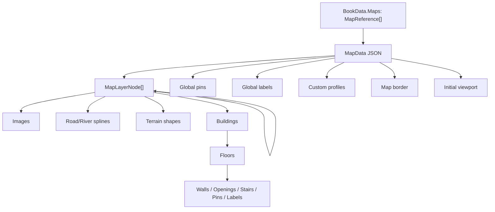
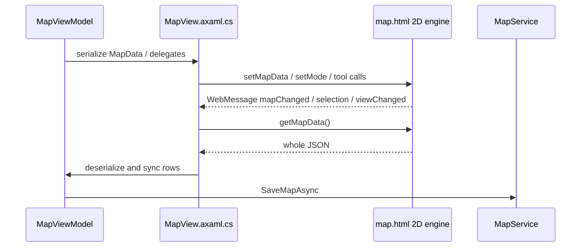

# Novalist 地图能力定义与实现分析

> 性质：外部开源项目代码研究，供本项目地图设计参考，不构成当前仓库契约。  
> 核实对象：`Drommedhar/novalist-official`  
> 本地路径：`/Users/tywww/Desktop/项目/novalist-official`  
> 核实提交：`8827483e45dcf06096e2aad56347eb588936e56d`（2026-07-05）  
> 核实时间：2026-07-14

## 1. 结论

Novalist 对地图的核心定义是：**供作者在写作时创建和查阅的手工空间资产**。
它不是 GIS、叙事时间引擎或 AI 自动制图器，而是一套接近轻量图像编辑器、平面规划器和
只读 3D 漫游器的组合：作者在共享世界坐标中组织图片、图层、地形、道路、建筑、室内、
标签和实体图钉，再从同一份地图数据派生 2D 编辑视图与 WebGPU 3D 场景。

它最值得借鉴的不是某个孤立工具，而是三条设计主线：

1. **统一递归图层树**：图层和组不分类型，有子节点即为组；地图元素共享显隐、锁定、
   透明度、缩放区间和层级顺序。
2. **空间资产与小说语义分离后窄连接**：地图几何保持独立，图钉通过 `entity_id` 连接
   Codex 实体，并提供实体与地图之间的双向跳转。
3. **同源多表示**：2D 是编辑真相源，3D 从同一聚合派生，不要求作者重复建模。

但 Novalist 不应作为本项目动态地图的整体架构模板。它没有 Scene/章节时间切片、人物轨迹、
势力变化、证据来源、待处理观察、已采用事实或世界动态播放；其复杂 JS 引擎缺少自动化测试，
持久化还有书级引用与草稿级正文所有权冲突、非原子写、高频全量 JSON 往返和弱校验等问题。

对 `ai-writing-assist` 的直接判断是：

- Novalist 强在**空间资产编辑深度**。
- 本项目强在**叙事时空事实、来源与审查语义**。
- 合理方向是把 Novalist 的编辑语义接到本项目既有 `MapObservation → MapFact → playback`
  事实链上，而不是用 Novalist 的文件模型或 WebView 状态模型替换现有 `world/map` 子系统。

## 2. 产品边界

### 2.1 它认为什么是地图

专项手册把地图描述为世界地图、城市平面、建筑布局及其他写作空间参考。地图由递归图层树、
置于共享世界坐标中的内容和覆盖全图的实体图钉组成：

- `docs/manual/29-maps.md:3-11`
- `Novalist.Core/Models/MapData.cs:5-52`
- `Novalist.Core/Models/MapData.cs:146-210`

坐标只有 `x/y/width/height/rotation` 等画布值，没有经纬度、投影或真实比例尺。地图因此是
作者控制的视觉空间，而不是现实地理数据模型。

产品把三个维度明确分开：

| 维度 | Novalist 的定义 |
|---|---|
| 内容真相 | 独立 `MapData` JSON 和书级共享图片 |
| 编辑 | 2D View/Edit 模式；Edit 才显示完整工具与操作柄 |
| 浏览 | 2D View 模式和只读 3D 漫游；3D 不写回另一套几何 |

证据：`docs/manual/29-maps.md:13-18,293-310`。

### 2.2 它不是什么

当前实现没有以下能力：

- GIS 坐标、比例尺、测距、投影、真实地图瓦片或寻路；
- Scene、章节或时间线直接关联地图状态；
- 人物移动轨迹、势力边界历史或世界状态回放；
- AI/程序化世界生成；程序化只用于建筑 footprint 和 3D 视觉细节；
- 地图打印/导出管线，以及常见 GIS/矢量格式导入；
- 可编辑 3D、物理、碰撞或游戏逻辑，3D 相机可穿墙；
- 以地图元素为一等领域事实的来源、置信度、采用、回滚和冲突语义。

与小说语义的直接连接集中在 `MapPin.EntityType/EntityId`。自由标签只是文本；道路、地形、
建筑和区域也没有直接绑定 Scene 或领域对象。

## 3. 用户能力全景

### 3.1 创建与编辑

| 类别 | 已实现能力 | 主要证据 |
|---|---|---|
| 地图管理 | 每本书多地图；新建、打开、切换、重命名、删除；保存视口 | `docs/manual/29-maps.md:285-291` |
| 图片 | 从图库、文件、剪贴板、URL 添加；移动、缩放、旋转、换层、删除、多边形裁剪 | `docs/manual/29-maps.md:20-64` |
| 图钉 | 放置、拖动、标签、颜色、关联实体、换层、缩放可见区间 | `docs/manual/29-maps.md:66-78` |
| 标签 | 多行文本、字号、字体、对齐、颜色、移动、换层 | `docs/manual/29-maps.md:80-99` |
| 地形 | 草、森林、混凝土、沙地、丘陵、山地、水域；多边形、平滑、羽化、颜色、层内顺序 | `docs/manual/29-maps.md:101-126` |
| 地图边界 | 单一全图裁剪多边形、描边颜色/宽度、顶点编辑 | `docs/manual/29-maps.md:128-145` |
| 道路/河流 | 平滑样条、闭环、逐节点宽度/类型/锐度/方向、线型与颜色、类型渐变 | `docs/manual/29-maps.md:188-227` |
| 自定义剖面 | 道路/河流 casing、填充 bands、markings、dash、默认宽度 | `docs/manual/29-maps.md:229-238` |
| 建筑 | 8 类 footprint、道路吸附、旋转、屋顶、楼层、显示阈值、层内顺序 | `docs/manual/29-maps.md:147-169` |
| 室内 | 分层绘制墙、门、窗、楼梯，以及楼层专属标签和图钉 | `docs/manual/29-maps.md:171-186` |

这里的“程序化建筑”边界很窄：类型驱动 footprint 和屋顶初值，用户仍手工放置、旋转、
调整并编辑内部，不是从小说文本或地点属性自动生成城市。

### 3.2 组织、可见性与导航

- 图层采用任意深度递归树；同一节点既可承载内容，也可因含 children 成为组。
- 父级的 hidden、locked、opacity 向下传播；图层和多数元素都有独立 min/max zoom。
- drag/drop 支持 before、after、inside，并阻止把父节点移入后代。
- Connected/Floor mode 让组内一次只显示一个子层，适合楼层或互斥细节层。
- Isolate 是不持久化的临时检查模式。
- 2D 中图钉保持屏幕尺寸，标签使用世界单位并随地图缩放。
- 中键平移、滚轮围绕鼠标缩放，视口按地图持久化。

主要证据：

- `docs/manual/29-maps.md:31-38,240-283`
- `Novalist.Desktop/Assets/Map/map.html:932-1069`
- `Novalist.Desktop/ViewModels/MapViewModel.cs:1028-1525`

### 3.3 与小说世界对象的连接

正向路径：在地图 View 模式点击已关联实体的图钉，复用正文编辑器的 Focus Peek 数据，
显示实体卡片并可继续打开完整实体编辑器。

反向路径：正文/实体 Focus Peek 会扫描当前书的全部地图，按 `EntityId` 建立图钉索引；作者可
从实体跳到对应地图，自动切换 View 模式、居中并闪烁目标图钉。

证据：

- `Novalist.Desktop/Editor/FocusPeekExtension.cs:389-424`
- `Novalist.Desktop/ViewModels/MainWindowViewModel.cs:1647-1660`
- `Novalist.Desktop/ViewModels/MapViewModel.cs:37-46,1013-1024`

这是一条设计得很好的窄 seam：地图不复制实体详情，只保存稳定标识；实体展示继续由
Codex/Focus Peek 拥有。

## 4. 领域模型与持久化

### 4.1 聚合结构



完整模型集中在 `Novalist.Core/Models/MapData.cs`：

- 聚合根、边界、profile：`5-144`
- 递归图层、图片、图钉、标签：`146-350`
- 道路/河流 spline：`360-461`
- 地形和建筑：`463-568`
- 室内结构：`570-648`
- viewport 与轻量引用：`650-677`

模型是可变 POCO。注释声明了闭合多边形至少 3 点、枚举取值、比例范围等语义，但没有统一
validator 强制这些不变量。

### 4.2 文件布局

```text
<project>/.novalist/project.json
  └─ Books[].Maps[]                  # 书级轻量引用

<project>/<book>/
  ├─ Images/                         # 书级共享图片
  └─ Drafts/<active-draft>/Maps/
       └─ <map-id>.json              # 草稿级地图正文
```

`IMapService` 只提供 CRUD、rename 和 Maps root：
`Novalist.Core/Services/IMapService.cs:5-13`。`MapService` 的主要行为是：

- Create 先写地图 JSON，再添加书级引用并保存 project metadata；
- Load 必须先命中书级引用，再从当前草稿目录读取文件；
- Save 直接用缩进 JSON 覆盖目标文件；
- Delete 删除地图 JSON 和书级引用，但不删除可能共享的图片；
- Rename 同时修改书级引用和当前草稿中的地图名。

证据：`Novalist.Core/Services/MapService.cs:19-65,125-161`。

### 4.3 v1 → v2 兼容

v1 使用 `groups[].layers[]`；v2 改为统一递归 `layers[]`。加载时服务把旧 group 变成父节点，
旧 layer 变成 children，并设置 `version=2`：`MapService.cs:67-123`。

迁移只发生在内存。首次打开不会立即把磁盘文件重写为 v2，必须等后续保存才落盘。因此手册
`docs/manual/29-maps.md:11` 的“首次打开自动迁移”若被理解为即时磁盘升级，表述过强。

### 4.4 所有权不一致

当前最重要的持久化问题是：**引用属于书，正文属于草稿**。

- `BookData.Maps` 不随草稿切换而替换。
- 空白新草稿不复制 `Maps/`，但仍显示同一书级引用，加载时会找不到 JSON。
- 克隆草稿会递归复制地图文件，所以初始可用；但重命名只改共享引用和当前草稿 JSON，
  删除会移除共享引用却只删当前草稿文件，其他草稿留下不可发现孤儿。

证据：

- `Novalist.Core/Services/ProjectService.cs:381-447,499-517`
- `Novalist.Core/Models/BookDraftData.cs:33-44`
- `Novalist.Core/Models/BookData.cs:114-117`
- `Novalist.Core/Services/MapService.cs:55-64,134-160`

手册同时称地图视图“per-book”（`docs/manual/29-maps.md:5`），又称内容“per-draft”
（`:11`）。这不是简单文案漂移，而是产品所有权尚未裁定并造成可观察错误。

## 5. 桌面端实现

### 5.1 组件分工



职责如下：

| 组件 | 职责 | 规模/证据 |
|---|---|---|
| `MapView.axaml` | 原生工具栏、图层/属性面板、loading 与 Focus Peek | `152-737` |
| `MapViewModel.cs` | 地图/选择/工具状态、图层命令、桥接 delegates、持久化协调 | 约 1792 行 |
| `MapView.axaml.cs` | NativeWebView 生命周期、C#↔JS 消息、跨平台与 overlay 协调 | 约 1238 行 |
| `map.html` | 内联 CSS + 2D DOM/SVG 编辑器 | 约 5985 行 |
| `map3d.js` | Three.js WebGPU 3D 派生渲染 | 约 3943 行 |

关键调用链：

- 加载与 VM → Web：`MapViewModel.cs:923-956,1538-1544`；
  `MapView.axaml.cs:318-341,545-586`；`map.html:1415-1466`。
- Web → VM 消息：`map.html:861-869`；`MapView.axaml.cs:569-774`。
- 回拉并保存：`MapView.axaml.cs:559-567,708-712,776-780`；
  `MapViewModel.cs:1562-1624`。

### 5.2 2D 引擎

2D 不是 Canvas，而是 DOM/SVG 混合：

- 图片使用 ``；
- 图钉和标签使用 HTML overlay；
- 地形、建筑、道路、河流和边界使用 SVG；
- pan 主要平移 world 容器，zoom 分别重算图像、SVG 和 screen-space overlay；
- 每次 `render()` 按地形 → 图片 → 建筑 → spline → 图钉 → 标签顺序重建主要内容。

证据：`map.html:463-507,883-910,1445-1466`。

这一选择让 HTML 表单、文本编辑、上下文栏和 SVG 几何易于组合，但大型地图会承担 DOM/SVG
全量重建成本。

### 5.3 3D 派生

3D 使用随应用打包的 Three.js WebGPU/TSL、WaterMesh、SkyMesh、GLTF/DRACO/KTX2：
`map3d.js:1-27,224-305`。

进入 3D 时，`buildScene()` 从当前 `mapData` 依次构建底图、地形、草木、道路/水体、建筑与
annotations：`map3d.js:3664-3694`。主要表现包括：

- 地图图片成为地面纹理；
- 建筑按楼层挤出，生成 gable/hip/flat 屋顶，并显示楼板、墙、门窗、楼梯；
- 草地使用 tile cache、预分配 InstancedMesh pool 和远距 billboard；
- 森林使用 GLTF 树资产与实例化；
- 河流和湖泊使用带深度、泡沫、焦散、反射/折射与流动效果的 shader；
- 鼠标 pointer lock + WASD/QE + Shift 完成自由漫游。

3D 是只读近似表示，不是 2D 的完全等价投影：它忽略 opacity 与全部 zoom range，也不保留
全图 border 和图片 clip polygon。证据：`map3d.js:1194-1220`；
`docs/manual/29-maps.md:302-310`。

### 5.4 跨平台 WebView

- Windows 直接加载本地文件，并为 ES module 开启 `--allow-file-access-from-files`：
  `MapView.axaml.cs:125-159`。
- macOS 通过随机 loopback 端口同时提供打包资源和当前书目录；`SafeJoin` 拒绝路径穿越：
  `MapAssetServer.cs:11-49,80-165`。
- Native WebView 会盖住 Avalonia overlay，因此菜单/对话框前先截图、隐藏 WebView，关闭后恢复：
  `MapView.axaml.cs:30-102`；`MainWindow.axaml.cs:425-453,1482-1500`。

## 6. 已确认问题与实现局限

### 6.1 高优先级

#### A. 新地图并没有手册声称的默认图层

手册称新地图有一个默认图层：`docs/manual/29-maps.md:285-291`。实际 Create 只设置
id/name/fileName，`Layers` 为空：`MapService.cs:26-53`。

首次添加图片时 JS 会隐式创建 `Base` layer，但图钉/标签会成为无 layer 元素；terrain、
spline、building 的首次提交只寻找 active/first leaf，没有图层时可能静默不落入模型：
`map.html:3145,4450,4844,5640,5802`。这是实际首操作 UX 缺陷。

#### B. 高频变更可能挂起或乱序保存

每个 `mapChanged` 都 fire-and-forget 拉取整份 JSON；`RequestMapJsonAsync` 只有一个
`_pendingJsonResponse`，新请求会覆盖旧 TCS：

- `MapView.axaml.cs:559-566,587-590,776-780`
- `MapViewModel.cs:1562-1579`

连续拖动/编辑可能让旧任务永远不完成，并产生乱序覆盖。滚轮每个事件也直接触发 viewport
写盘：`map.html:5510-5537`；`MapViewModel.cs:909-914`。这里需要串行化、request id、
debounce/coalescing，而不是继续扩大全量 JSON 桥。

#### C. 核心 JS 引擎没有自动化保护

现有 Core/VM/asset server 测试覆盖 CRUD、v1 迁移、工具互斥、图层操作、JSON roundtrip 和
macOS 路径穿越，但 `MapView` 因 native WebView 整类排除 coverage，未发现 `map.html`、
`map3d.js` 或消息协议的自动化/E2E 测试。

证据：

- `tests/Novalist.Core.Tests/Services/MapServiceTests.cs:33-225`
- `tests/Novalist.Desktop.Tests/ViewModels/MapViewModelTests.cs:79-799`
- `tests/Novalist.Desktop.Tests/Services/MapAssetServerTests.cs:12-60`
- `Novalist.Desktop/Views/MapView.axaml.cs:20`

因此仓库的 C# 100% coverage 门禁不能证明核心地图编辑与 3D 正确。

#### D. 书/草稿所有权冲突

见 4.4。它会产生失效引用和跨草稿孤儿文件，应先裁定地图究竟属于 book 还是 draft。

### 6.2 中优先级

- **图层删除语义不完整**：删除节点会删除节点内图片/spline/shape/building，但全图 pins/labels
  只保留失效 `layerId`，随后按无 layer state 继续显示。证据：
  `MapViewModel.cs:1294-1320`；`MapData.cs:28-35`；`map.html:1025-1069`。
- **2D/3D 语义不完全一致**：3D 忽略 opacity、zoom range、border、image clip。
- **3D 不增量同步**：存在 `Map3D.rebuild()`，但当前仓库未见调用；3D 打开后修改模型，
  场景可能保持旧状态直到退出重进。`map3d.js:3936-3941`。
- **全量重建与全量持久化放大**：2D 经常清空并重建主要 DOM/SVG；每个逻辑变更跨桥传整份
  JSON 并覆盖文件；3D 每次退出完整销毁 GPU 资源，下次重新建场景。
- **失败处理偏静默**：WebView 回拉 JSON 反序列化 catch-all 后不报告；脚本调用 fault 也没有
  统一观测。`MapViewModel.cs:1564-1579`；`MapView.axaml.cs:1230-1237`。
- **schema 边界弱**：颜色、枚举、坐标、闭合点数、zoom 关系、floor count 等大多只有注释，
  没有服务层结构化验证。
- **保存不是原子写**：地图 JSON 直接覆盖，Create/Delete/Rename 跨地图 JSON 与 project JSON
  也没有事务或补偿。`MapService.cs:26-53,125-161`。

### 6.3 安全与隐私边界

- macOS `SafeJoin` 能阻止 URL 路径越出根目录，但 loopback server 没有 capability token 或
  Origin 校验；知道端口的本机进程可请求当前书目录内容。
- Windows 允许 file 页面读取本地 file 资源；`MapImage.Path` 与 `MapReference.FileName` 没有
  basename/根目录约束。篡改的本地项目 metadata 理论上可使加载越出预期目录。
- JS 日志可能包含故事路径/名称；C# 当前正确地只送 `Debug.WriteLine`，没有进入可导出的
  diagnostic log：`MapView.axaml.cs:716-720`。

这些是本地受信项目模型中的防御纵深问题，不等同于已经证明可被远程利用。

## 7. 文档与实现漂移

专项地图手册整体较准确，但确认存在以下漂移：

1. 新地图没有默认图层，见 6.1.A。
2. 手册说删除图层会删除嵌套内容，但 pins/labels 会成为仍可见的孤儿。
3. Interface Overview 的 Activity Bar 清单漏掉实际存在的 Maps 入口：
   `docs/manual/02-interface-overview.md:66-83`；`MainWindow.axaml:443-451`。
4. 反向“实体 → 地图图钉”跳转已实现但未写入用户手册。
5. Layer Properties 汇总漏列 shape/building，虽然各自章节有说明。
6. 手册未明确 3D 不保留 border 与 image clip polygon。
7. “首次打开自动迁移”没有说明只在内存发生。

另有发现性缺口：Maps 有 Activity Bar 入口，但未注册内置 hotkey/Command Palette action。

## 8. 与 `ai-writing-assist` 的能力对照

| 维度 | Novalist | `ai-writing-assist` 当前方向 | 判断 |
|---|---|---|---|
| 基础空间 | 任意 2D 世界坐标、图片/矢量元素 | 六边形 tile、地点布局与绑定 | 模型不同，可共存，不宜强行互换 |
| 编辑深度 | 图片、裁剪、递归层、样条、建筑、室内 | baseTerrain、terrainOverlay、location、marker、territory 分层编辑 | Novalist 的元素/图层编辑明显更深 |
| 小说对象 | Pin ↔ Codex entity 双向跳转 | 地点绑定、任意实体 marker、统一 open target | 本项目语义面更广；可借鉴双向聚焦体验 |
| 时间 | 无 Scene 时间模型 | Scene 范围 marker、scene summary | 本项目已有决定性优势 |
| 事实来源 | 无 | Observation、证据、置信度、review state | 不应被纯地图 JSON 冲淡 |
| 采用/回滚 | 无 | MapFact、软状态、批量审查 | 本项目应保持正式事实边界 |
| 世界动态 | 无 | dashboard、轨道、playback 派生 | 本项目核心差异化 |
| 3D | WebGPU 同源只读漫游 | 未实现 | 可作为远期派生视图，不应先于 2D 语义闭环 |
| 持久化 | 本地 JSON + 图片 | PostgreSQL、`novel_id` 隔离、稳定 API | 不应照搬文件级所有权和全量覆盖写 |

## 9. 可借鉴项与不应照搬项

### 9.1 值得进入后续设计候选

1. **统一图层树和统一元素属性协议**  
   将显隐、锁定、透明度、z-order、zoom range、临时 isolate 抽成一致编辑语义；不要为每类
   元素复制一套互不兼容的控制。

2. **View/Edit 明确分离，但查看处就近进入编辑**  
   默认保持清晰的阅读/总控台；选中对象后在统一 inspector 中进入局部修改，批量修改仍由
   inspector 管理。

3. **实体与地图的双向聚焦**  
   地图对象信息框可打开世界对象；世界对象页也应列出它在哪些地图、Scene 和事实中出现，
   点击后统一打开目标、居中、闪烁，而不是只提供 ID。

4. **缩放语义与楼层/互斥层**  
   zoom range 能把世界、城市、街区、室内细节放在连续体验中；connected/floor set 可以成为
   地下城、建筑楼层或互斥状态层的通用表示。

5. **道路/河流的 typed spline**  
   将线路视为带 profile、逐节点宽度和类型变化的领域元素，比把 road 作为普通 terrain tile
   更适合高质量城市/区域图。若引入，应通过独立 schema、API 和测试落地。

6. **2D 真相源、3D 只读派生**  
   远期 3D 应消费已采用地图事实与可编辑 2D 资产，不拥有第二套事实；对无法表达的 2D 语义
   明确降级，不承诺完全同构。

### 9.2 不应照搬

- 不采用书级引用 + 草稿级正文的分裂所有权；本项目继续由 `novel_id`、map_id 和明确时间锚点
  决定归属。
- 不把 WebView 内整份可变 JSON 当唯一编辑真相，也不在每次交互后全量覆盖写盘。
- 不依赖字符串消息和注释约束替代 Pydantic/API schema。
- 不让 3D 或视觉层直接写入正式 `MapFact`；仍需 suggestion/observation、用户授权和可回滚边界。
- 不因追求视觉效果弱化 Scene、防剧透窗口、证据锚点、冲突与 candidate/confirmed 区分。
- 不在核心渲染器没有自动化测试时把“宿主语言 100% coverage”当作地图功能已验证。

## 10. 推荐吸收顺序

这不是实施承诺，只用于后续设计排序：

1. 先补齐双向实体聚焦、统一 inspector、图层/元素一致编辑语义。
2. 再评估 zoom range、互斥楼层和 typed spline 是否能接入现有 map schema，而不破坏
   Observation/Fact 事实链。
3. 然后增强图片底图、自由形状、道路/河流和建筑等空间资产能力。
4. 只有在 2D 编辑、Scene 时间语义、持久化和测试闭环后，再设计 3D 派生视图。

任何实际引入新地图元素表、WebGPU/Three.js、WebView 或新的前端渲染基础设施，都属于
schema/基础设施/技术栈变化，必须另行设计、说明 API/schema/wire 风险，并按仓库规则取得
确认或 ADR。

## 11. 验证范围与限制

本次采用以下证据互证：

- 顶层 README 与 `docs/manual/29-maps.md`；
- `MapData`、`IMapService`、`MapService`、Project/Draft 持久化；
- `MapViewModel`、`MapView`、`map.html`、`map3d.js` 和跨平台 asset server；
- Core、Desktop VM 与 asset server 测试文件；
- 地图相关 Git 历史。

本机没有 .NET SDK，`dotnet --version` 返回 `command not found`，因此无法现场执行目标项目的
C# 测试。本报告把“存在测试覆盖”与“本次测试已通过”严格分开；所有实现结论均来自当前提交
源码和已有测试断言，不声称运行时实测通过。
