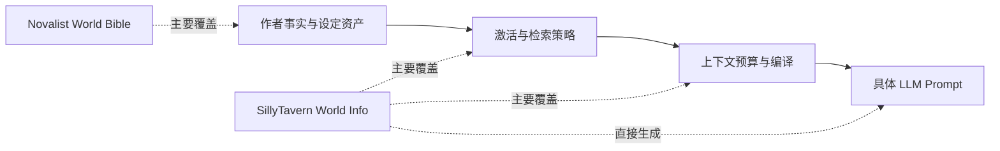
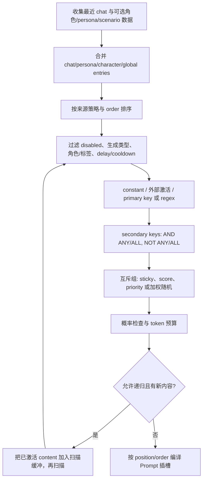

# Novalist 与 SillyTavern 世界书设计深度对比

> 性质：外部开源项目代码研究，供本项目世界书与上下文设计参考，不构成当前仓库契约。  
> Novalist：`Drommedhar/novalist-official`，本地
> `/Users/tywww/Desktop/项目/novalist-official`，提交
> `8827483e45dcf06096e2aad56347eb588936e56d`（2026-07-05）。  
> SillyTavern：`SillyTavern/SillyTavern`，本地
> `/Users/tywww/Desktop/项目/SillyTavern`，提交
> `8172dcd0ee672d3cd9a5e5f7af134f91a45cd2b8`（2026-07-07）。  
> 核实时间：2026-07-14。

## 1. 执行摘要

两者都使用了“世界书”这一称呼，但它们解决的不是同一个问题：

- **Novalist 的 World Bible 是作者维护的、跨书共享的结构化世界资料库。** 它回答
  “这个人物、地点、物品或设定是什么，以及多本书如何共用它”。核心能力是类型化实体、
  Markdown sections、自定义属性、关系、模板、图片、地点层级和章节/Scene 覆盖。
- **SillyTavern 的 World Info/Lorebook 是运行时 Prompt 激活与注入引擎。** 它回答
  “这次生成应该把哪些文本片段放到 Prompt 的什么位置”。核心能力是多来源聚合、关键词/
  正则/向量触发、二级条件、互斥组、概率、时序效果、递归、token 预算和多插槽注入。

因此，二者更像互补的两个层，而不是同类产品的不同实现：



对 `ai-writing-assist` 的直接结论是：**本项目已经存在世界书类似设计，而且分层比两者都
完整，不应再新增一套同名 WorldBook 聚合。** 当前 `world` 负责 CoreEntity、关系、世界书页、
工作稿、修订和简介；`context` 负责选择、裁剪、预算、确认、可见性和审计。真正可借鉴的
方向是：用 Novalist 增强作者资料编辑体验，用 SillyTavern 增强“为何激活、为何排除、放到
哪一层”的规则表达与调试体验，但继续保持事实、激活规则和最终 Prompt 三者分离。

## 2. 研究口径

本报告没有只依据产品文案，而是沿以下链路核对：

1. 产品手册与 README：确认产品对“世界书”的公开定义；
2. 数据模型与持久化服务：确认资料真正保存在哪里、以什么粒度保存；
3. 编辑器和运行时调用链：确认字段是否实际参与行为；
4. Prompt 组装入口：确认激活结果最终进入什么位置；
5. 测试目录：区分“有实现”与“有自动回归保障”；
6. 本仓库 `world/context` 当前代码：只做映射，不把外部项目设计误写成当前契约。

固定提交源码：

- [Novalist Codex 手册](https://github.com/Drommedhar/novalist-official/blob/8827483e45dcf06096e2aad56347eb588936e56d/docs/manual/06-codex.md)
- [Novalist EntityService](https://github.com/Drommedhar/novalist-official/blob/8827483e45dcf06096e2aad56347eb588936e56d/Novalist.Core/Services/EntityService.cs)
- [SillyTavern world-info.js](https://github.com/SillyTavern/SillyTavern/blob/8172dcd0ee672d3cd9a5e5f7af134f91a45cd2b8/public/scripts/world-info.js)
- [SillyTavern worldinfo endpoint](https://github.com/SillyTavern/SillyTavern/blob/8172dcd0ee672d3cd9a5e5f7af134f91a45cd2b8/src/endpoints/worldinfo.js)
- [SillyTavern 官方 World Info 文档](https://docs.sillytavern.app/usage/core-concepts/worldinfo/)

## 3. Novalist：世界书是跨书共享的结构化 Codex

### 3.1 产品定义与所有权

Novalist 先定义了一个 Codex：所有具名人物、地点、物品、组织、魔法、历史等都可成为实体。
内置 `Character / Location / Item / Lore` 四类，同时允许用户和扩展定义自定义实体类型。
World Bible 不是另一种实体，而是**实体的项目级归属范围**：

- 普通实体属于当前 book；
- `IsWorldBible=true` 的实体属于 project，对项目内每本 book 可见；
- 单书项目不需要 World Bible；
- 同 ID 同时出现在 book 与 World Bible 时，加载代码保留 book 版本，跳过共享版本。

这是一种清晰的“局部覆盖共享”模型。它适合系列小说共享人物、城市、神系和魔法规则，但
没有角色/聊天/会话级的运行时绑定语义。

主要证据：

- `docs/manual/06-codex.md:1-18,109-126`
- `Novalist.Core/Services/EntityService.cs:346-404`
- `Novalist.Core/Services/ProjectService.cs:32-34,564-577`

### 3.2 资产模型

Novalist 的优势在于“资料作为长期作者资产”的表达能力：

| 维度 | 设计 |
|---|---|
| 实体类型 | Character、Location、Item、Lore，以及用户/扩展贡献的自定义类型 |
| 长文本 | 可增删、重命名、排序的 Markdown sections |
| 强字段 | 人物外貌/角色/年龄，地点 parent/type，物品 origin 等 |
| 自定义字段 | String、Int、Bool、Date、Enum、Timespan、EntityRef |
| 关系 | 带描述的类型化目标连接，并支持学习/建议逆关系 |
| 模板 | 内置与自定义类型均可用模板预填默认值 |
| 媒体 | 多图、caption、主图、排序 |
| 叙事时点 | 人物字段支持 act/chapter/scene override |

其中 `EntityRef`、地点父子层级和 Scene 覆盖，使它明显强于“标题 + 一段 lore 文本”的
传统 lorebook。覆盖会在 Focus Peek、正文视图和导出时应用，但这是**资产投影**，不是依据
当前 Prompt 自动检索资料。

证据：`docs/manual/06-codex.md:20-105,128-200`。

### 3.3 持久化与故障边界

共享实体存储为：

```text
<Project>/WorldBible/<type>/<entity-id>.json
```

book 实体存入当前书对应目录。加载时逐文件反序列化，损坏文件被静默跳过；保存使用
`File.WriteAllTextAsync` 覆盖单个 JSON；删除直接删文件。这种方式具有离线、可携带、可用
普通工具查看的优点，但也带来以下边界：

- 保存不是显式原子替换，也没有数据库事务；
- 损坏文件被跳过后，作者可能只看到“资料消失”，缺少集中错误清单；
- 删除是物理删除，不具备采用/历史/回滚语义；
- 文件内容依赖 .NET 反序列化，未形成类似 API schema 的强入站校验层。

### 3.4 它没有 SillyTavern 式世界书运行时

固定提交中虽然 SDK 定义了 `IAiHook.OnBuildSystemPrompt(AiPromptContext)`，但上下文只含当前
chapter/scene 标题和各类实体**名称列表**；全仓库调用搜索只找到接口、SDK 示例和测试，未
找到 Novalist 主程序调用该 hook 的生产链路。也没有以下结构：

- entry 关键词、负向条件或正则；
- 每次生成的扫描深度、token 预算和激活 trace；
- 递归激活、互斥组、概率或 sticky/cooldown；
- before/after/depth/role 等 Prompt 插槽编译。

所以不能因为它有 `World Bible` 和 `IAiHook` 就推断“Codex 内容已按需注入 AI”。当前可靠
结论是：Novalist 实现了世界资料管理，没有实现可与 SillyTavern 对等的 lorebook 激活器。

## 4. SillyTavern：世界书是上下文规则引擎

### 4.1 数据来源与作用域

SillyTavern 官方把 World Info 描述为一个动态字典：当消息文本出现关联关键词时，把相关
entry 内容插入 Prompt。运行时会并发加载并合并：

1. chat-bound lorebook；
2. persona lorebook；
3. character 主 lorebook 与额外 lorebooks；
4. 全局选择的 lorebooks。

Chat Lore 和 Persona Lore 固定先进入候选序列；character 与 global 的相对顺序由
`sorted evenly / character first / global first` 策略决定。character card 只嵌入一个主
lorebook，额外绑定属于本地关联。

证据：官方文档“Context-Specific Sources / Lore Insertion Strategy”，以及
`public/scripts/world-info.js:4363-4531`。

### 4.2 一个 entry 同时混合了四类信息

`newWorldInfoEntryDefinition` 约有四十个字段，可归为：

| 类别 | 代表字段 |
|---|---|
| 载荷 | `comment`、`content` |
| 激活条件 | `key`、`keysecondary`、`selectiveLogic`、`constant`、`vectorized`、角色/标签过滤、生成触发类型、额外扫描源 |
| 选择策略 | `order`、`probability`、`group`、`groupOverride`、`groupWeight`、`useGroupScoring` |
| 递归/状态 | `excludeRecursion`、`preventRecursion`、`delayUntilRecursion`、`sticky`、`cooldown`、`delay` |
| 编译位置 | `position`、`depth`、`role`、`outletName`、`ignoreBudget` |

这种一体化记录的优点是一个高级用户可以独立控制每段 lore 的完整生命周期；缺点是资料
内容、召回规则和 Prompt 布局耦合在同一 entry，字段之间存在大量组合状态，理解、迁移和
测试成本都很高。

### 4.3 运行时激活算法

核心链路位于 `checkWorldInfo()`：



关键细节如下：

- 默认扫描最近 2 条消息；entry 可覆盖 scan depth，硬上限为 1000 条。
- 普通 key 默认不区分大小写，可选 whole-word；合法 JavaScript regex 会绕过普通匹配。
- secondary key 支持 `AND ANY / AND ALL / NOT ANY / NOT ALL`。
- 可额外扫描 persona description、character description/personality/note、scenario、creator
  notes，以及标记为可扫描的 extension prompt。
- `constant` entry 不依赖关键词；向量召回由 Vector Storage 扩展提供外部激活，随后仍通过
  角色过滤、概率、互斥和预算等门禁。
- inclusion group 默认按 `groupWeight` 加权随机只留一个；可改为 order 优先，或先以命中
  key 数评分缩小候选。
- sticky、cooldown、delay 以消息数计，并把状态保存在当前 chat metadata；分支继承父 chat
  状态。
- recursive scan 会把新 entry 的 content 重新作为触发文本；可排除被递归、阻止继续递归、
  延迟到指定递归层；max recursion 为 0 时主要由预算终止。
- min activations 可逐步向更早消息扩大扫描，直到命中最小条数、达到 max depth 或预算耗尽；
  它与 max recursion steps 互斥。

### 4.4 预算不是检索后的装饰，而是激活门禁

预算按 `round(context_percent × max_context)` 计算，并可再受绝对 token cap 限制。候选在
概率与互斥组决策后逐条计 token；普通 entry 触顶后不再进入激活集合，`ignoreBudget` entry
可以越过门禁。官方文档还规定 constant entry 优先，然后按较高 insertion order 处理。

这一设计值得借鉴，因为“命中了多少资料”和“最终允许多少资料进入模型”被显式分开；但
`ignoreBudget`、无限递归、随机概率和随机互斥组会削弱复现性，不适合直接复制到需要审计、
重放和质量比较的小说生产流水线。

### 4.5 编译目标不是一个字符串，而是一组 Prompt 插槽

激活 entry 最终可进入：

- character definitions 之前/之后；
- example messages 之前/之后；
- Author's Note 顶部/底部；
- chat 指定 depth，并选择 system/user/assistant role；
- 命名 outlet，由 `{{outlet::Name}}` 宏在其他 Prompt 位置消费。

Text Completion 路径把 before/after 注入 story string；Chat Completion 路径把二者注册为
有 identifier 的 system prompt，并由 Prompt Manager 排序；depth entries 通过 extension
prompt 进入聊天深度。也就是说，SillyTavern 的世界书不是“检索列表”，而是完整参与最终
Prompt 编译。

证据：`world-info.js:855-914,5070-5162`、`public/script.js:4576-4675`、
`public/scripts/openai.js:1201-1209,1358-1371`。

### 4.6 持久化、校验与测试

每本 lorebook 是当前用户 `worlds` 目录中的一个 JSON 文件。服务端会清理文件名，保存和
导入使用 atomic write，优于 Novalist 的直接覆盖；多用户目录也避免普通情况下互相读取。

但服务端导入/编辑只验证顶层存在 `entries`，没有逐字段 schema 校验。字段默认值、兼容映射
和迁移大量由前端 JavaScript 完成。这对可导入多种 lorebook 格式的桌面工具很灵活，却不是
强数据边界。

当前固定提交的 `tests/` 中没有直接覆盖 `checkWorldInfo()`、递归、预算、互斥组或时序效果的
World Info 行为测试；仅有 story-string macro 测试使用 `wiBefore/wiAfter` 示例值。因此，
这条复杂核心链路的回归保障明显弱于其功能复杂度。该判断只针对当前提交和仓库内自动测试，
不等于断言项目外没有人工测试。

## 5. 深度对比矩阵

| 维度 | Novalist | SillyTavern | 判断 |
|---|---|---|---|
| 首要目标 | 作者维护世界事实与资料 | 每次生成动态选择 Prompt 片段 | 两个不同层次 |
| 基本单元 | 类型化 Entity | 文本 Entry + 激活/插入配置 | Entity 更适合长期资产，Entry 更适合运行时规则 |
| 身份 | 稳定实体 ID | lorebook 内 UID + world 名 | Novalist 更接近领域身份 |
| 类型系统 | 内置类型、自定义类型、强字段、EntityRef | 无领域类型；字段主要描述激活器 | Novalist 显著更强 |
| 长文本 | 多个可排序 Markdown sections | 单个 content | Novalist 更适合编辑，ST 更适合压缩注入 |
| 关系 | 一等关系、逆关系建议 | 通过 content/递归隐式连接 | Novalist 可查询性更好 |
| 叙事时点 | act/chapter/scene 字段覆盖 | chat 消息深度与 timed effects | 一个是故事时间，一个是会话时间 |
| 作用域 | project World Bible + active book | global + character + persona + chat | ST 的运行时作用域更细 |
| 激活 | 无运行时规则 | keyword/regex/vector/constant/外部激活 | ST 核心优势 |
| 负向条件 | 无 | NOT ANY / NOT ALL | ST 更强 |
| 选择冲突 | book 同 ID 覆盖 shared | inclusion group、score、priority、weighted random | 语义完全不同 |
| 递归 | 无 | entry content 可触发其他 entry | 强大但解释成本高 |
| 预算 | 无 World Bible token 预算 | 百分比、绝对 cap、逐 entry token、ignore | ST 更成熟 |
| Prompt 位置 | 无已闭合调用链 | before/after/examples/AN/depth/role/outlet | ST 是 Prompt 编译器的一部分 |
| 确定性 | 文件加载基本确定 | probability、weighted group、vector、timed state 可非确定 | 小说生产更应偏 Novalist 式确定性 |
| 持久化 | entity-per-file JSON，直接覆盖 | lorebook-per-file JSON，原子写 | 两者都是 filesystem-first |
| 入站校验 | 反序列化为模型，损坏时跳过 | 仅检查顶层 `entries`，前端补默认 | 都弱于 Pydantic/DB 边界 |
| 采用/历史 | 直接编辑、直接删除 | enable/disable，不是事实采用状态 | 两者都没有本项目的 review/active/archived 语义 |
| provenance | 主要是作者文件，无证据链 | 记录命中 entry，不记录事实来源 | 都不适合直接作为可审计事实源 |
| 自动测试 | Codex 有服务/模型测试，但无 lorebook runtime | 核心 WI 扫描无直接行为测试 | ST 风险更突出 |

## 6. 各自最值得借鉴与不宜复制的部分

### 6.1 从 Novalist 借鉴

1. **世界书是范围，不是第二份事实。** 同一种实体可在 book 与 project scope 间移动，避免
   “项目角色”和“世界书角色”成为两套互不一致的对象。
2. **世界资料编辑要有领域结构。** 自定义类型、类型化字段、EntityRef、关系和 sections
   比一段自由文本更适合查找、校验、地图绑定和后续生成。
3. **叙事时点覆盖应在资产投影层处理。** 人物改名、年龄和伪装不应靠复制多个实体解决。
4. **实体资料应在写作界面就地可查。** Focus Peek 减少作者离开当前正文的成本。

不宜复制：filesystem-primary、直接物理删除、非原子实体覆盖、损坏文件静默跳过，以及把
项目共享范围直接等同于本项目的 `novel_id` 多租户边界。

### 6.2 从 SillyTavern 借鉴

1. **候选、选择和编译分阶段。** 先聚合来源，再判断激活，再执行预算，最后按插槽渲染。
2. **激活原因可表达。** primary/secondary、正向/负向、来源、角色过滤、生成类型和递归来源
   都可成为“为什么选中”的 trace。
3. **预算是一等约束。** 百分比与绝对 cap、逐段 token 计数、overflow 可见性都值得保留。
4. **规则应可预览。** dry-run 和 activated event 说明同一引擎可以服务编辑器调试与真实生成。
5. **不同上下文有不同 scope。** global/character/persona/chat 的思想可转换为项目、工作流、
   Scene、角色视角和本次操作，但不能原样照搬名称。

不宜复制：把可执行指令和世界事实混在 raw content、允许 entry 直接进入任意 role/depth、
随机概率/加权互斥、默认无限递归、动态事件监听器修改扫描状态、前端承担 schema 边界，以及
用向后扩大 chat 扫描来满足“最少激活数”。最后一项在小说系统中可能越过 Scene 可见边界或
引入剧透，不能让数量目标覆盖可见性策略。

## 7. 与 ai-writing-assist 当前设计的映射

本项目不是“尚无世界书”。当前实现已经把外部两种思路拆到正确边界：

| 外部概念 | 本项目当前承载 | 当前优势 |
|---|---|---|
| Novalist Entity/Codex | `CoreEntity`、类型化 profile、关系、别名 | `novel_id` 隔离、canonical/candidate/history、来源与回滚 |
| Novalist World Bible scope | 世界书页、类别、工作稿、修订、projection、synopsis | 页面只组织/解释事实，不取代 CoreEntity；工作稿与已采用版本分离 |
| SillyTavern source aggregation | context loaders + world/context facade | 跨模块稳定 seam，reader/character/author 可见性 |
| SillyTavern activation | `ActivationPreviewService`、RAG、显式选择 | 确定性 score、TargetRef、关系和页面 link 展开 |
| SillyTavern budget/compiler | `CompiledContext`、tier、budget events | 可审查 IR、evict/truncate 原因、section source/status |
| SillyTavern dry-run/trace | confirmations、snapshots、retrieval traces | 用户确认、真实调用审计、hash/revision/result provenance |

当前 `ActivationPreviewService` 以 explicit、canonical relation、page-linked 等来源给候选固定
权重，并限制 `depth<=2`、`top_k<=256`；`context` 再负责预算与最终资料审查。这比把全部行为
塞进一个 lorebook entry 更符合本仓库边界。

相关当前代码与文档：

- [`CONTEXT.md`](../../CONTEXT.md)
- [`backend/modules/world/README.md`](../../backend/modules/world/README.md)
- [`backend/modules/context/README.md`](../../backend/modules/context/README.md)
- [`ActivationPreviewService`](../../backend/modules/world/services/worldbuilding/activation_preview_service.py)

### 7.1 仍存在的能力差距

这不意味着当前系统已经吸收 SillyTavern 的全部优点：

- 激活预览主要依赖显式 ID、关系和页面 link，尚无面向作者的、可版本化的正/负条件规则；
- 缺少针对“某工作流/某操作/某视角”的可复用 activation profile；
- 虽然 `CompiledContext` 有 `activation_reason` 和预算事件，但尚未形成 SillyTavern 那种逐规则
  命中/落选调试面板；
- 世界书页与 CoreEntity 很丰富，但作者从页面内容建立受控上下文规则的路径仍可加强。

这些是“规则与解释体验”的差距，不是再建一套世界事实表的理由。

## 8. 建议方向（非当前契约）

### 8.1 保持三层模型

```text
事实/资料层：CoreEntity、关系、世界书页、修订、工作稿
规则层：ContextActivationRule / ActivationProfile（只引用 TargetRef）
编译层：CompiledContext、预算、可见性、确认、snapshot、最终 renderer
```

如果未来增加可编辑激活规则，规则只应引用资产，不能复制资产正文。建议最小语义包括：

- scope：novel、workflow/action、scene、character/reveal mode；
- match：显式引用、正向词、负向词、关系/页面 link、可选受控语义检索；
- select：priority、top_k、per-rule token cap、最大展开深度；
- safety：visibility cutoff、candidate opt-in、不可越过的 P0 section；
- explain：matched clause、source、score、excluded reason、token before/after；
- lifecycle：enabled、revision、created/updated by、stale reason。

### 8.2 明确拒绝四种移植

1. **不把 lore content 当 system 指令。** 世界书内容是不可信资料，renderer 应加数据边界；
   用户不能通过资料页绕过固定 scaffold。
2. **不默认引入随机激活。** 概率和 weighted group 会破坏 snapshot 重放与评测对比；如产品
   未来需要随机事件，应由拥有该概念的确定性工作流记录 seed/decision，而不是隐藏在 context。
3. **不以“凑够 N 条”为目标突破可见性。** 当前 Scene + 前序可见证据边界优先于 min
   activations；future Scene 不能因预算尚空而被扫描。
4. **不让插件事件修改核心扫描状态。** 扩展只能提供经 schema 校验的候选或 matcher port，
   最终门禁仍由 context 确定性工作流拥有。

### 8.3 优先补“可解释性”，再补“规则复杂度”

推荐顺序是：

1. 先把当前 explicit/relation/page/RAG 候选的命中、落选和预算原因做成统一 trace；
2. 再增加可复用的 workflow/action activation profile；
3. 只有真实用例证明必要时，再增加二级负向条件或有限递归；
4. 不以复刻 SillyTavern 四十字段 entry 为目标。

## 9. 验收与测试启示

若未来实现规则层，至少需要固定以下测试矩阵：

| 类别 | 必测行为 |
|---|---|
| 隔离 | 任意规则、TargetRef、页面、实体都不能跨 `novel_id` |
| 可见性 | reader/character cutoff、当前 Scene、前序 Scene 与 future Scene 边界 |
| 匹配 | 正向、负向、大小写、中文无空格文本、空 key、非法规则 |
| 展开 | 关系环、页面互引、重复目标、最大深度与稳定排序 |
| 预算 | 精确边界、evict、truncate、P0 保留、单规则 cap、总 cap |
| 确定性 | 相同 revision/输入得到相同候选、顺序、token 与 prompt hash |
| 生命周期 | rule revision、资产更新后 stale、confirmation/snapshot 回放 |
| 安全 | raw 世界书文本不能改变 system scaffold 或触发工具/跨模块写入 |

## 10. 最终判断

如果只问“谁的世界书更强”，答案会误导：

- **作为作者世界资料库，Novalist 更完整。**
- **作为运行时上下文激活器，SillyTavern 更完整。**
- **作为需要事实状态、来源、隔离、可见性、审查和可复现 LLM 调用的小说生产系统，二者都
  不能整体照搬。**

`ai-writing-assist` 当前“world 管事实与世界书、context 管选择与编译”的边界是正确方向。
下一步若继续吸收外部经验，应补的是**可版本化的激活规则与可解释 trace**，而不是新增一套
世界书数据源，也不是允许作者直接编辑最终 Prompt。
