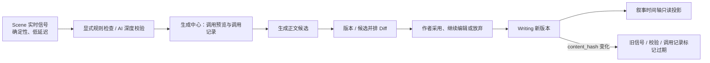
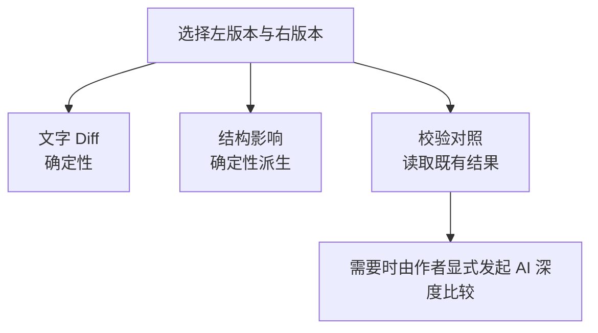
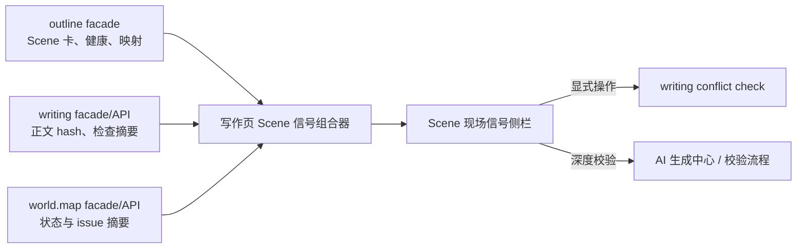
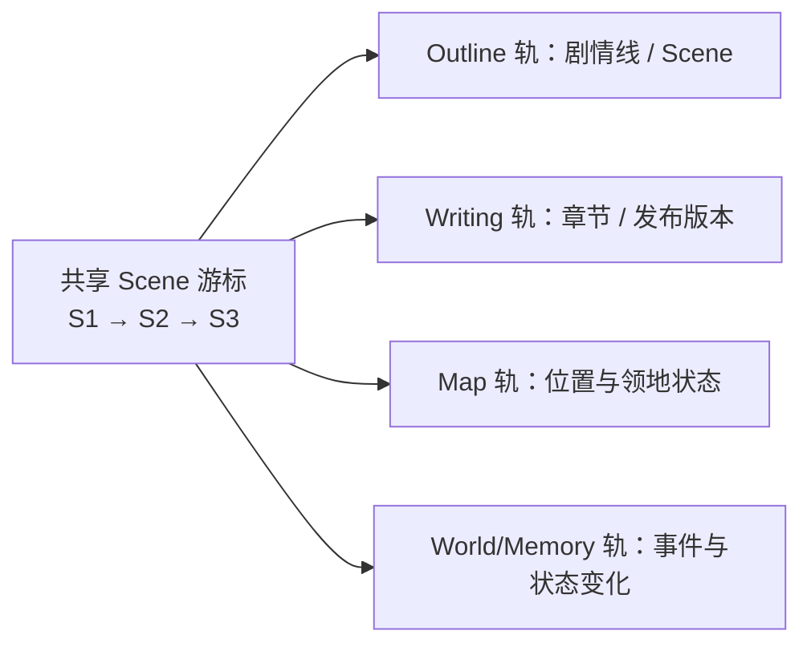
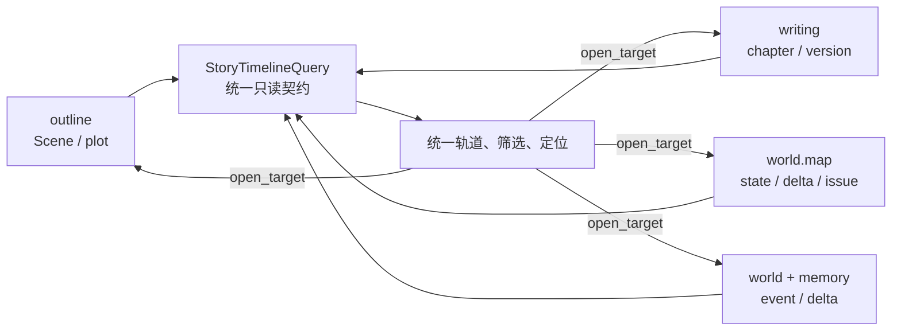
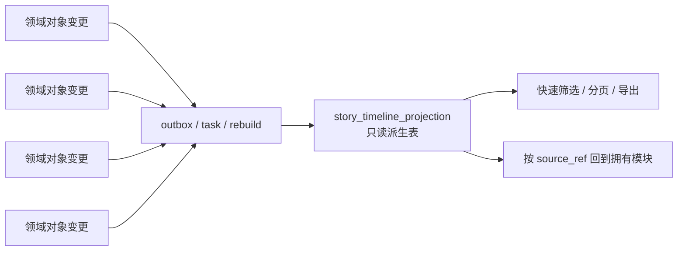
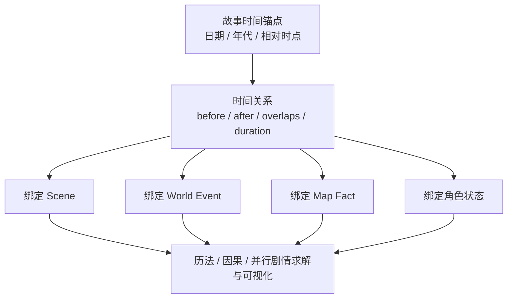
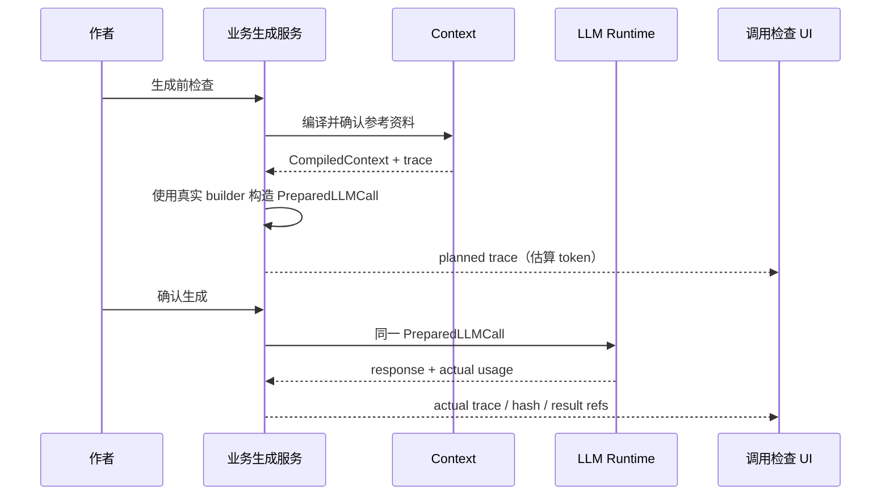
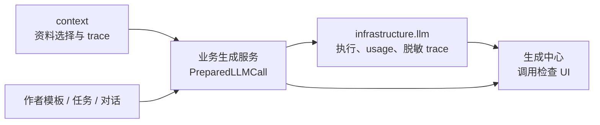

# 四项作者工作台能力深化设计：版本 Diff、Scene 信号、叙事时间轴与调用透视

> 性质：基于 2026-07-15 当前代码的产品/架构研究，供后续立项与 ADR 使用，
> 不构成当前 API、schema 或 wire 契约。
> 范围：只分析设计，不修改业务代码。
> 关联研究：`2026-07-14-novalist-sillytavern-worldbook-design-analysis.md`。

## 1. 执行结论

这四项能力应该**按领域拆分实现、按作者工作流组合呈现**，不应建立一个同时拥有正文、
Scene、时间、上下文和 LLM 调用数据的“大一统工作台模块”。推荐归属如下：

| 能力 | 推荐所有者 | 产品入口 | 是否建议新顶级模块 |
|---|---|---|---|
| 版本并排 Diff | `writing` | 写作页版本历史 / 候选采用前 | 否 |
| Scene 实时信号侧栏 | `outline` 提供结构信号，`writing` 提供正文与校验信号，前端组合 | 写作页 Scene 侧栏 | 否；尤其不恢复 `review` |
| 统一叙事时间轴 | 第一阶段为跨模块只读投影；需要物化或可编辑故事时间后再独立立项 | 独立时间轴工作区或 Outline 子视图 | 第一阶段否；后续需用户确认和 ADR |
| 最终 Prompt 透视器 | 各业务生成服务构造调用，LLM 基础设施提供统一脱敏 trace，生成中心组合 | AI 生成中心“调用检查” | 否；不让 `context` 冒充最终 Prompt 所有者 |

推荐的整体关系是：



四项的共享点不应是共同数据库表，而应是最小身份与新鲜度协议：

```text
novel_id
+ chapter_index / scene_id
+ draft_id / version_number / content_hash（涉及正文时）
+ source_type / source_id / source_revision_or_hash
+ observed_at / generated_at
```

这一协议允许 UI 判断“这条信息对应哪份正文、是否仍然有效”，又不改变各模块的事实所有权。

## 2. 当前实现基线

### 2.1 已经存在的能力

1. `writing_drafts` 已有章级版本、`content_hash`、状态和 provenance；历史页支持预览、
   软废弃、copy-on-write 恢复和 candidate 采用，但没有文本 Diff。
2. `writing_conflict_checks/items` 已经区分规则检查与 AI 软冲突，AI 路径有 context
   confirmation、异步任务、证据、状态和修复建议。
3. Scene 工作台已经派生“未复核、未关联章节、缺设定、待整理”等结构健康信号；其职责是
   Scene 管理、章节映射和结构整理，不是正文 AI 审稿。
4. `context` 已有结构化 section、预算、激活原因、排除/截断、confirmation 和 snapshot；
   生成中心已经有“上下文预览”，但它只展示编译上下文，不是业务服务最终发给模型的消息序列。
5. 地图已有以 Scene 为轴的 canonical state、delta、candidate observation 和 continuity issue
   时间线；`memory` 已有世界状态事件与 delta log；`world.Event` 有 `timeline_order`。

### 2.2 必须保留的边界

- 旧 `review` 顶级模块已归档。跨模块审查不能借本功能恢复它。
- 旧 `timeline` 顶级模块已归档。第一阶段不能把旧模块名和旧 API 原样复活。
- `context` 只拥有引用选择、预算、确认和快照，不拥有每个业务工作流的 system scaffold、
  作者指令和消息编排。
- 世界事实、Scene 结构、正文、地图状态各自仍由原模块拥有；统一时间轴只能先做只读投影。
- LLM 结果仍是建议或候选；任何采用都走拥有模块既有状态迁移。
- 所有新读模型、比较和 trace 都必须保持 `novel_id` 隔离。

## 3. 方向一：版本并排 Diff

### 3.1 产品目标

Diff 的目标不是简单显示红绿字符，而是让作者回答三个层次的问题：

1. **文字改了什么**：增加、删除、替换了哪些段落和句子；
2. **叙事影响是什么**：POV、Scene 目标、人物/地点提及和必须发生项是否变化；
3. **这次改动是否更安全**：两个版本分别对应哪次规则/AI 校验，结果是否已经过期。

这三个层次应分 Tab，不应把 AI 评判偷偷混入基础 Diff：



### 3.2 推荐交互

桌面端使用左右并排，移动端自动切为逐块统一 Diff：

```text
┌──────────────────── 第 12 章版本比较 ────────────────────┐
│ 左：v7 已发布        交换        右：v9 当前工作稿       │
│ +318 字  -94 字  12 段修改     [文字] [结构影响] [校验] │
├────────────────────────┬─────────────────────────────────┤
│ v7 原段落               │ v9 新段落                        │
│ 删除内容                 │ 新增内容                          │
│ 未变化上下文可折叠       │ 未变化上下文可折叠                │
└────────────────────────┴─────────────────────────────────┘
```

版本选择器应允许：

- 当前工作稿与任意历史 active 版本；
- published 与 working；
- candidate 与当前 working；
- 未来若存在同批多个候选，可选择 2–4 个进入比较矩阵。

“采用右侧”“从左侧恢复”等写操作继续调用既有专用状态迁移。Diff 本身永远只读，不因为打开
比较页而创建版本。

### 3.3 文本 Diff 算法

中文正文不适合只按空格分词。推荐分两级对齐：

1. 先按段落、空行和稳定标点边界做块级对齐；
2. 仅在已判定变化的块内做字符/中文标点/英文单词级 Diff；
3. 超长章节先使用行/段落锚点切块，避免全章二次复杂度计算；
4. 完全相同的大段默认折叠，但保留上下文展开；
5. 统计字数变化、段落移动、纯标点变化和正文变化，不能只给一个百分比。

段落移动应表现为“移动”，而不是一边整段删除、另一边整段新增。第一版可以用段落 hash 与
相似度匹配识别移动；无法稳定判断时退化为删除/新增，不能用 LLM 猜测。

### 3.4 结构影响层

结构影响是正文 Diff 的派生视图，不是新事实源。可优先做以下确定性比较：

| 信号 | 计算方式 | 所有者 |
|---|---|---|
| POV 配置变化 | 对照关联 Scene 的 POV 与版本 provenance | `outline`/`writing` 只读组合 |
| Scene 目标与 must/must_not | 对照 Scene 卡，不重新生成 | `outline` |
| 人物、地点、物品提及变化 | 对两个版本做同一套字面/别名匹配 | `world` 稳定查询能力 + `writing` 派生 |
| 冲突检查变化 | 对照两个版本各自检查快照/最新检查 | `writing` |
| 地图位置风险 | 显示既有 map issue 或规则检查结果 | `world.map`/`writing` |

“新版更好”“情绪更自然”属于主观 AI 判断，只能作为显式 AI 比较任务，不能伪装成 Diff
算法的确定性结论。

### 3.5 数据与 API 方案

#### P0：任意两个已有版本的临时 Diff（推荐）

- 复用现有版本列表与草稿详情接口取得全文；
- Diff 在前端 Web Worker 或后端纯函数中临时计算；
- 不保存 Diff，不新增表；
- 返回前端时所有正文片段按文本节点或统一 `esc()` 渲染，禁止未转义 `innerHTML`。

选择前端还是后端取决于章节体量与复用需求：

| 方案 | 优点 | 风险 |
|---|---|---|
| 前端 Worker | 无新 API；切换显示模式快；服务器无计算压力 | 大章内存占用；算法实现只在 Web 端可用 |
| 后端 Diff endpoint | 可统一算法、测试和未来导出 | 新增 additive API；需限制正文大小、超时和响应体 |

当前仓库是 Vanilla JS，若不新增依赖，P0 更适合先做一个可取消的前端 Worker；如果后续需要
导出、E2E 一致性或服务端语义影响分析，再下沉后端。

#### P1：候选比较

先允许作者任意选择现有 candidate/working/published 比较，不需要 schema 变化。对照栏同时
展示 provenance：生成模板、context confirmation、模型、provider、生成时间和来源版本。

#### P2：一次生成多个一等候选

若产品需要“同一请求生成 N 个方案”，则应新增显式 `generation_group_id`、`variant_index`、
共同 request/confirmation/profile hash。每个变体仍是独立 candidate，不能复制聊天产品里
隐藏的 swipe 状态。

这一阶段会改变 API/schema/migration 和任务预算，必须单独确认；同批未采用候选应进入历史，
不能硬删除。

### 3.6 可借鉴但不照搬

- Novalist Snapshot Compare 值得借鉴：Scene 快照、并排红绿 Diff、字数差和恢复前自动快照。
- SillyTavern swipe picker 值得借鉴：快速切换多个候选与分支来源。
- 本项目不应照搬“当前 swipe 就是正史”的会话语义；正文 candidate 必须保留一等身份、
  provenance 和显式采用。

## 4. 方向二：Scene 实时信号侧栏与 AI 校验的边界

### 4.1 重叠确实存在，但生命周期不同

如果侧栏继续叫“Scene 实时分析”，并且自动输出“动机断裂、情绪跳变、POV 漂移、修复建议”，
它会与现有 AI 校验重复，还会引入不可控调用成本。建议改名为**Scene 现场信号**或
**Scene 状态**，把“自动信号”和“深度校验”明确分层：

| 维度 | Scene 现场信号 | 规则检查 | AI 深度校验 |
|---|---|---|---|
| 触发 | 输入后 debounce / 打开 Scene 自动刷新 | 作者点击 | 作者确认引用后点击 |
| 算法 | 确定性、低延迟 | 确定性跨域规则 | LLM + schema/guard |
| 范围 | 当前编辑缓冲区 + 当前 Scene | 当前章/Scene 与结构事实 | 更深上下文与软冲突 |
| 持久化 | 默认不持久化；只保存 UI 偏好 | `writing_conflict_checks/items` | 同一检查追加 AI 结果 |
| 建议 | 不生成改写建议 | 可定位证据 | 可请求 AI 修复建议 |
| 新鲜度 | 随编辑即时重算 | 绑定 draft/content hash | 绑定 confirmation/snapshot/hash |

### 4.2 推荐侧栏结构

```text
┌─ Scene 现场信号 ─────────────────────┐
│ 当前：S-18「旧港追逐」 · 第12章       │
│ 1,842 字 · 17 段 · 4 个人物提及       │
├─ 结构信号 ───────────────────────────┤
│ POV：林澈   目标：逃离港区             │
│ ⚠ 缺 emotional_beat  ✓ 章节映射精确   │
├─ 正文信号 ───────────────────────────┤
│ ⚠ must_happen「拿到账本」尚未字面出现 │
│ 地点：旧港 → 船坞（读取既有地图状态） │
├─ 最近校验 ───────────────────────────┤
│ 2 高 / 3 中 · 基于 v8                 │
│ 当前为 v9，结果已过期                 │
│ [查看结果] [运行规则检查] [AI深度校验]│
└──────────────────────────────────────┘
```

侧栏可以展示的自动信号：

- 当前 Scene/章节/正文版本和保存状态；
- 字数、段落、对话比例等纯文本统计，但不把固定比例当质量标准；
- Scene 健康：是否复核、章节映射、缺设定、待整理；
- 当前 Scene 的 POV、goal、core conflict、must/must_not；
- 确定性字面覆盖提示、已知实体提及和现有地图/连续性 issue 摘要；
- 最近一次规则/AI 检查数量、状态、对应版本和是否过期。

侧栏不应自动做：

- LLM 调用；
- 新建 `writing_conflict_items`；
- 输出“更有张力”之类主观质量结论；
- 自动产生或采用修复文本；
- 以侧栏临时状态覆盖 Scene/世界事实。

### 4.3 同名信号如何避免重复

允许相似主题同时出现，但必须解释来源和深度。例如：

- 现场信号：“Scene 未设置 POV 人物”——读取结构字段即可确定；
- AI finding：“第 8–10 段出现超出林澈认知边界的信息”——需要正文证据与角色可见性；
- 现场信号：“must_happen 文本未字面命中”——只是提示，不等于剧情没有发生；
- AI finding：“账本虽被提到，但未完成 Scene 要求的交接行为”——是需要人工复核的语义判断。

因此，侧栏的文案要使用“未检测到、尚未配置、已有风险记录”，AI 校验才能使用“疑似漂移、
语义冲突、建议修复”。

### 4.4 模块拆分

推荐不建立后端 `scene_analysis` 或 `review` 模块：



P0 可以由前端并发调用现有 API 组合，避免新聚合契约。若请求数和一致性成为问题，再新增窄的
只读 `SceneStatusProjection`：

- Scene 结构部分由 `outline` 拥有；
- prose/check 部分由 `writing` 提供稳定 port；
- 地图摘要由 `world.map` 提供稳定 port；
- 聚合服务不能直接 import 其他模块的 models/repositories/services；
- 响应只是一张读卡，不拥有任何写操作。

### 4.5 新鲜度协议

侧栏加载检查结果时应比较：

```text
check.novel_id == current.novel_id
check.scene_id / chapter_index == current scope
check.draft_id == current draft_id
check.content_hash == current content_hash
```

当前检查模型还没有完整暴露上述全部字段时，可先按 `draft_id/version_number` 判定；要做到内容
级可靠判 stale，应为检查快照增加来源 hash（additive schema/API 变化）。正文变化后只显示
“结果已过期”，绝不能自动重跑 AI。

### 4.6 与生成中心的关系

侧栏的“AI 深度校验”可以跳到生成中心的任务模式，并预填：

- action：`writing.conflict_check.ai_review`；
- 当前 novel/chapter/Scene/draft identity；
- 是否包含待处理对象；
- 已有规则检查 ID。

这样侧栏保持轻量，AI 引用确认、调用预览、后台任务和结果 provenance 都在统一生成体验中，
但最终 finding 仍由 `writing` 保存。

## 5. 方向三：统一叙事时间轴的四种方案

### 5.1 先区分两种“时间”

当前系统同时存在：

1. **叙事顺序**：Scene/章节在作品中的呈现顺序；
2. **故事时间**：事件在虚构世界中实际发生的日期、时刻、持续时间和因果先后。

现有数据更成熟的是第一种：Scene 顺序、`timeline_order`、地图 Scene 状态和 memory delta。
因此第一阶段应做“以 Scene 为游标的统一观察面板”，不能假装已有完整故事历法。

### 5.2 方案 A：共享 Scene 游标，多块专业时间轴



特点：

- 每个模块保留自己的查询和 UI，只共享 `novel_id + scene_id/scene_index`；
- 拖动游标时，各轨分别刷新；
- 不存在统一 timeline record，也不新增表；
- 最适合“我想看某个 Scene 时各系统是什么状态”。

优点是耦合最低、可以最早落地；缺点是无法自然做全局搜索、统一筛选、跨轨导出和稳定分页。

### 5.3 方案 B：联邦只读时间轴（推荐 P0）



各来源适配为共同读契约：

```text
TimelineItem
  id                # source_type + source_id 的稳定复合身份
  novel_id
  anchor             # scene_id/scene_index/chapter_index，可选 story_time
  lane                # plot/world/character/map/writing
  kind/status/label/summary
  source_ref          # 模块、对象 ID、revision/hash
  open_target         # 跳回拥有模块
  confidence/review_state
  occurred_at?        # 真实故事时间；没有就不伪造
```

查询服务只负责 fan-out、归一化、稳定排序和分页游标，不允许编辑来源数据。`memory_events` 只能
贡献一条轨，不能成为世界事件、计划 Scene、地图状态和正文版本的总事实表。

优点是无 migration、可统一筛选和交互；缺点是 fan-out 延迟、跨来源稳定分页和局部失败处理
更复杂。契约必须返回 `partial_sources/warnings`，不能因为一条轨失败就把其他轨伪装为空。

### 5.4 方案 C：物化跨域时间轴读模型



物化记录必须保存 `source_type/source_id/source_revision_or_hash/projection_version`，并支持：

- 幂等 upsert；
- stale 标记；
- 单来源和全项目 rebuild；
- 源对象软废弃后的历史语义；
- 任务失败与部分更新可观测性。

优点是查询快、可稳定分页和全局筛选；缺点是最终一致、需要 migration/任务/重建策略，且容易
被误当成第二事实源。适合项目规模和筛选需求证明联邦查询不足之后采用，需用户确认和 ADR。

### 5.5 方案 D：可编辑的故事时间域



这是唯一真正拥有“故事日期、持续时间、因果和并行关系”的方案。它需要新的 aggregate、schema、
校验、编辑器和跨模块绑定语义，甚至需要处理不可靠叙述与角色认知时间。

优点是能支持倒叙、并行剧情、自定义历法和时间连续性验证；缺点是复杂度最高，会重新提出旧
Timeline 模块被移除时的所有权问题。只有作者明确需要编辑故事时间，而不只是统一观察时才应
立项，必须用户确认和 ADR。

### 5.6 方案对比

| 方案 | 真相来源 | DB 变化 | 一致性 | 全局筛选 | 可编辑故事时间 | 建议阶段 |
|---|---|---:|---|---|---|---|
| A 共享游标 | 各模块 | 无 | 各模块实时 | 弱 | 否 | 最快试用 |
| B 联邦读模型 | 各模块 | 无 | 查询时实时 | 中强 | 否 | **推荐 P0** |
| C 物化读模型 | 各模块，projection 仅派生 | 新表/任务 | 最终一致 | 强 | 否 | 数据量证明需要后 |
| D 故事时间域 | 新时间 aggregate + 各模块绑定 | 大幅变化 | 领域事务/约束 | 强 | **是** | 独立产品立项 |

### 5.7 推荐路线

先做 **A 的共享 Scene 游标 + B 的统一只读契约**：

1. 先统一 Scene anchor 和 `open_target`；
2. 接入 Outline、Map、World/Memory、Writing 四条轨；
3. 观察查询延迟、单项目 item 数、筛选和导出需求；
4. 只有真实指标证明联邦查询不足时才升级 C；
5. 只有作者要编辑虚构世界日期/持续时间时才讨论 D。

这一路线既利用现有地图时间轴，也不会把 `memory_events` 或新 projection 错当成第二套正史。

## 6. 方向四：将最终 Prompt 透视器纳入 AI 生成中心

### 6.1 结论

应纳入生成中心，但产品名建议从“最终 Prompt 透视器”收敛为**调用检查**。原因是作者真正
需要检查的不只是一个拼接后的字符串，而是：

- 参考资料为何进入/被排除；
- system、作者模板、上下文和任务按什么 role/顺序组成；
- 预计与实际 token；
- 使用的模型、provider、模板、profile、snapshot 和 request hash；
- 这次记录是调用前计划，还是 provider 返回后的实际结果。

### 6.2 生成中心的信息架构

现有“上下文预览”可升级为“调用检查”，内部保留三层：

```text
AI 生成中心
├─ 自由共创
├─ 角色视角正文
├─ 任务
└─ 调用检查
   ├─ 参考资料      # 现有 CompiledContext：section、预算、激活/排除
   ├─ 消息序列      # role、顺序、来源、token、内容/摘要
   └─ 调用记录      # planned/actual、model、provider、usage、hash、snapshot、result
```

更适合高频使用的形态是：每个生成模式右侧都有可展开“调用检查”抽屉；顶层“调用检查”则用于
浏览最近调用和跨模式比较。二者复用一个组件，不重复状态。

### 6.3 调用前与调用后必须分开



- `planned`：调用前的确定性消息计划和 token 估算；
- `actual`：实际 model/provider、返回 usage、结果/错误和 request hash；
- 如果 provider adapter 会改写消息，UI 必须标明“业务级计划”与“provider 级实际”差异，
  不能把前者宣传为绝对最终 payload。

### 6.4 防止预览与真实调用漂移

当前 world 对象共创的 `_chat_messages/_structured_messages` 已经是业务消息构造入口。未来不能
再写一套 `preview_messages()` 复制逻辑，而应提取为无副作用 builder：

```text
build_prepared_call(input, confirmed_context, template, execution_snapshot)
  -> PreparedLLMCall

preview 读取 PreparedLLMCall
execute 也只接受同一个 PreparedLLMCall
```

建议的共同 trace 形状：

```text
PromptTrace
  phase: planned | actual
  action / step_name
  novel_id
  message_manifest[]
    ordinal / role / logical_key
    source_refs[] / content_hash
    estimated_tokens / truncated / redacted
    author_visible_content?
  context_confirmation_id / context_snapshot_id
  template_id / template_version
  activation_profile_revision
  model / provider
  estimated_input_tokens
  actual_usage?
  request_hash
  result_refs[] / error_code?
```

这个共同结构只统一可观测性，不统一业务 Prompt。`writing`、`world`、`outline` 仍各自拥有消息
构造；`infrastructure/llm` 只负责规范化调用、provider 执行、usage 和脱敏 trace。

### 6.5 作者视图不是 raw HTTP payload

当前 Prompt 文档明确不允许模板 validator 暴露隐藏 system prompt、API key 或 raw LLM
payload。因此生产作者视图应采用两级可见性：

| 内容 | 作者视图 |
|---|---|
| 作者任务、模板、对话 | 显示完整内容 |
| 编译后的参考资料 | 显示完整作者有权查看的内容与排除原因 |
| 固定 system scaffold | 默认显示名称、版本、hash、规则摘要；不直接暴露隐藏全文 |
| message role/order | 完整显示 |
| model/provider/usage | 显示 |
| API key、Authorization、请求头、内部 URL secret | 永不显示 |
| raw provider payload / SDK 对象 | 不显示 |

如果产品确实要求作者看到固定 system scaffold 的每个字，这会改变当前 Prompt 安全契约，
需要单独产品决定和 ADR；不能借“透视器”绕过既有边界。

所有世界书、正文和粘贴资料仍应标为**不可信数据块**，透视 UI 只读展示，不允许直接在最终
消息里编辑。作者要修改内容，应回到模板、任务、世界书或引用选择，再重新编译。

### 6.6 保存策略

默认不持久化 raw 最终消息：

- 调用前响应可临时返回作者有权查看的消息；
- snapshot 长期保留 message/source hash、manifest、模型、模板、profile 和 token metadata；
- 完整 rendered 内容仅在用户明确开启保留时保存，并复用过期时间/清理策略；
- 调用记录列表只返回摘要，详情再按权限读取；
- 来源 revision 不可变时优先按 ID/hash 重建，而不是永久复制大段正文。

现有 `ContextSnapshot` 已能存 prompt hash、模型、compile options、included/excluded assets、
section/token metadata 和可选过期的 rendered context，可作为基础，但它只代表 Context。
“最终调用 hash”应覆盖规范化 message sequence 与生成参数，不能把现有 context hash 改名冒充。

### 6.7 模块拆分与风险



- 不建立通吃所有业务的 `generation` 后端模块；
- 不让 `context` 拼装业务 system prompt；
- 公共 `PreparedLLMCall/PromptTrace` 若放入 `infrastructure/llm`，属于共享层变更，实施前必须
  逐调用方评估，并保持现有 `LLMCallRequest/LLMResponse` 兼容；
- P0 可先由单个 Generate Center workflow 提供 business-level planned trace；
- provider-final trace、跨工作流记录和历史保存属于 P1，可能需要 additive API/wire 变化。

## 7. 四项之间的集成点

### 7.1 只共享链接，不共享所有权

| 从 | 到 | 共享内容 | 禁止做法 |
|---|---|---|---|
| Scene 侧栏 | AI 校验 | scope、draft/hash、规则检查 ID | 侧栏直接创建 AI finding |
| AI 校验 | 调用检查 | confirmation、snapshot、trace、task ID | Context 保存 writing finding |
| 生成中心 | Diff | candidate ID、base draft、generation provenance | Diff 自动采用候选 |
| Diff | 时间轴 | “版本已采用/发布”的只读事件链接 | 时间轴成为 writing 真相源 |
| 时间轴 | 各模块 | source_ref + open_target | 直接编辑 projection |

### 7.2 建议的跨界共同契约

可以抽象两个小契约，而不是一个“大工作台对象”：

```text
SourceIdentity
  novel_id
  module
  source_type
  source_id
  source_revision_or_hash
  chapter_index?
  scene_id?

OpenTarget
  route_kind
  object_id
  query
```

`SourceIdentity` 解决证据、Diff、trace 和 stale；`OpenTarget` 解决统一时间轴/侧栏跳回来源。
它们不能携带跨模块写权限。

## 8. 推荐实施路线

### Phase 0：不改数据库的四个薄切片

1. `writing`：任意两个现有版本/候选的临时文本 Diff；
2. 写作页：组合 Scene 健康、正文统计和最新检查摘要，明确 stale，不自动 LLM；
3. 时间轴：共享 Scene 游标 + 联邦只读 `TimelineItem` 契约，先接 Outline 与 Map；
4. 生成中心：把“上下文预览”升级为“调用检查”，先显示 context + business-level planned
   message manifest。

这一步主要是 additive API/wire 或纯前端变化，原则上不需要 migration；但如果为 conflict check
补 `content_hash`，仍需 schema/migration 评估。

### Phase 1：闭合 provenance 与作者选择

1. Diff 增加结构影响与校验对照；
2. Scene 侧栏一键进入生成中心深度校验，并带上稳定 scope；
3. 时间轴接入 World/Memory/Writing 轨和 partial-source 状态；
4. 生成调用引入共用 `PreparedLLMCall/PromptTrace`，展示 actual usage 与 request hash。

涉及 `infrastructure/llm` 的共享层变更必须单独审查；公共 wire 契约变化要同步测试与文档。

### Phase 2：有证据再引入持久化

- 多候选同批生成与 `generation_group_id`；
- 物化 `story_timeline_projection`；
- Prompt 调用历史的长期保留策略；
- 可编辑故事时间域。

这四项都涉及 schema、任务、保留策略或新领域所有权，不能作为 Phase 0 的“顺手扩展”。

## 9. API、schema、wire 与 ADR 风险清单

| 项目 | P0 风险 | 后续风险 | 确认/ADR |
|---|---|---|---|
| 文本 Diff | 可纯前端，无契约变化 | 后端 Diff API、导出 | API 时同步文档；通常不需 ADR |
| 候选组 | 无 | 新字段、任务预算、状态迁移 | 需用户确认；视范围决定 ADR |
| Scene 信号侧栏 | 前端组合现有 API | 聚合读 API、check source hash | additive API/schema；不恢复 review |
| 联邦时间轴 | 新只读契约/API | 跨模块 port 与分页 | 跨模块设计评审；不复活旧 API |
| 物化时间轴 | 无 | 新表、任务、rebuild | **需用户确认 + ADR** |
| 故事时间域 | 无 | 新 aggregate/表/校验/UI | **需独立立项 + ADR** |
| 调用检查 P0 | 单 workflow additive wire | 公共 trace 契约 | 影响 Prompt 文档与测试 |
| provider-final trace | 无 | 改 `infrastructure/llm` 共享层 | **需高风险评审** |
| raw system 可见 | 当前不允许 | 改 Prompt 安全边界 | **需明确产品决定 + ADR** |

## 10. 验证策略

### 10.1 Diff

- 中文标点、移动段落、超长章节、空白变化和完全相同文本；
- candidate/published/deprecated 权限与只读状态；
- stale 版本恢复仍由既有 CAS 阻断；
- 动态文本全部安全转义；
- 移动端 unified 与桌面并排结果一致。

### 10.2 Scene 信号

- 输入 debounce 和取消旧请求；
- draft/hash 变化后最近校验立即显示 stale；
- side panel 不触发 LLM、不创建 finding；
- 跨 `novel_id` 的 Scene/check/map 数据不可组合；
- API 部分失败时展示来源级 warning，不伪装为“无问题”。

### 10.3 时间轴

- 同 Scene 多轨稳定排序；
- source failure、pagination cursor、soft-deprecated 和 rebuild；
- map candidate observation 不进入 canonical 轨；
- 没有故事日期的 item 不伪造日期；
- `open_target` 始终回到真实拥有模块。

### 10.4 调用检查

- preview 与 execute 使用同一 builder；
- request hash 对消息顺序、内容和生成参数敏感；
- estimated 与 actual token 明确区分；
- API key、headers、内部 secret 和 raw SDK payload 永不出现在响应；
- context visibility/candidate/POV 门禁不能被 viewer 放宽；
- full rendered retention 过期与清理可验证。

## 11. 最终建议

四项都值得做，但优先级不是“四个独立大功能同时开工”，而是一个作者闭环中的四个薄切片：

1. 先用 Scene 现场信号降低作者发现问题的成本；
2. 用生成中心调用检查解释 AI 到底看到了什么；
3. 用版本 Diff 让候选采用成为可比较决策；
4. 用共享 Scene 游标和联邦时间轴把结果放回整体叙事位置。

模块拆分是正确方向。真正应统一的是身份、来源、新鲜度和打开目标；正文、Scene、地图、世界
状态、上下文和 LLM 调用的事实所有权仍应分开。

当前最推荐的第一批组合为：

- `writing`：P0 版本/候选 Diff；
- 写作页：Scene 现场信号侧栏，仅组合确定性状态与既有检查；
- Timeline：A+B 混合，即共享 Scene 游标 + 联邦只读轨道；
- 生成中心：将“上下文预览”升级为三层“调用检查”，不暴露 raw secret/system payload。

这个组合无需先恢复旧 `review/timeline` 模块，也无需先建立新的大表，就能验证四项是否真的
改善作者决策。后续只有候选组、物化时间轴、可编辑故事时间和 provider-final trace 需要扩展
到 schema、任务或共享基础设施。

## 12. 代码证据索引

下表用于把本文判断追溯到当前实现；路径是研究时点的代码位置，不把本报告升级为契约：

| 判断 | 当前代码证据 |
|---|---|
| 正文已有版本、hash、状态、provenance | `backend/modules/writing/models.py`、`backend/modules/writing/repositories.py` |
| 版本 UI 只支持选择、预览、恢复和软废弃，没有 Diff | `frontend-console/views/writing/versions.js` |
| 规则检查与 AI 软冲突已分层 | `backend/modules/writing/models.py`、`backend/modules/writing/conflict_ai.py`、`frontend-console/views/writingConflictModal.js` |
| Scene 工作台拥有结构健康与映射整理 | `backend/modules/outline/scene_workbench.py`、`backend/modules/outline/README.md` |
| 旧 review/timeline 顶级模块已归档 | `docs/archive/review-module-removed.md`、`docs/archive/timeline-module-removed.md` |
| Context 已有 section、预算、activation trace、confirmation/snapshot | `backend/modules/context/README.md`、`backend/modules/context/models.py` |
| 生成中心当前只展示编译上下文 | `frontend-console/views/generateView.js` |
| 最终业务消息由各生成服务构造 | `backend/modules/world/services/worldbuilding/object_draft_generation_service.py`、`backend/modules/writing/services.py` |
| LLM runtime 已返回 model/provider/token usage | `backend/infrastructure/llm/schemas.py`、`backend/infrastructure/llm/client.py` |
| Prompt validator 当前不暴露隐藏 system/raw payload | `docs/prompts/Prompt体系设计.md` |
| 地图已有 Scene 轴 canonical state/delta/issue 查询 | `backend/modules/world/services/map/map_timeline_service.py`、`backend/modules/world/map_schemas.py` |
| Memory 是世界状态事件与 delta 的拥有者之一，不是全局时间轴 | `backend/modules/memory/models.py`、`backend/modules/memory/README.md` |
| 世界书资料与激活规则已经分属 world/context | `docs/adr/0006-world-bible-context-activation-ownership.md` |
| Novalist 的 Snapshot Compare 参考 | `/Users/tywww/Desktop/项目/novalist-official/docs/manual/17-snapshots.md` |
| SillyTavern 的候选切换参考 | `/Users/tywww/Desktop/项目/SillyTavern/public/scripts/swipe-picker.js` |
