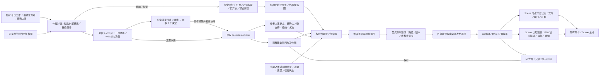

# AI 小说软件世界书系统重构计划：以“真名回响”创作历程为用户研究样本

> 性质：基于截至 2026-08-11 的当前仓库、真名回响创作史与可读取会话形成的产品研究及分阶段实施计划；不构成新的 API、schema、wire 或运行时契约。
> 改造目标：仅限 `ai-writing-assist`，重点覆盖 `world`、生成中心、`context`、`writing`、`rag`、地图与前端作者工作流。
> 研究样本：真名回响 Vault、历史会话、校验结果与 `worldbuilding-engine` 只作为用户行为证据和回放夹具，不是本计划的改造对象，也不由产品直接读写。
> 目标画像：首先服务长期维护复杂设定的长篇作者；阅读／RP 用户只消费通过既有可见性门禁的派生结果。
> 证据截止：主体研究截至 2026-08-10；Scene 认知／时点状态预演与运行时复审增量截至 2026-08-11。开源比较只采用项目官方仓库或官方文档。
> 证据限制：Novalist 与 SillyTavern 的新增细节用本机官方仓库复核；本轮另刷新了 Git、Kanboard、novelWriter、Ink、Yarn Spinner、Open Policy Agent、Cucumber、Godot、Storybook、Vale、Gerrit、Review Board、MediaWiki、OpenRefine、restic、SonarQube Community Build、QGIS、JOSM、Krita、ComfyUI、dbt、DVC、Bazel、KurrentDB、XTDB、Pi 与 LLM Wiki 官方资料。其他外链沿用此前核对过的官方资料，进入实现前仍应刷新易变细节。

## 1. 执行结论

1. **问题不在“再多生成一些设定”，而在软件没有完整承接作者从探索到收敛的过程。** 真名回响样本中，复杂主题会自然经历数十轮扩展、压力测试、否定和改写，最后才形成少量可采用决定。当前产品更擅长管理结果对象，仍不够擅长管理这段过程。
2. **先补齐现有“今日工作”，不再新建世界书工作台。** 仓库已经有任务恢复首页、世界资料待处理计数和本地生成会话；第一步是让它继续世界观创作、显示真正需要作者决定的事项，再把生成中心已有的 author decision state 显示给作者，以现有 `CreationSuggestion` 和前端会话形成创作意图视图。
3. **候选山先进入“收束预览”，不进入另一批待处理建议。** 完整细账、当前决策面和本次采用范围是三种不同对象：系统确定性枚举来源，只把最多 7 个顶层决定交给作者；选择结果先形成可编辑的作者消息，发送后才走现有决定编译、单目标建议和工作稿路径。
4. **不新建 Decision Ledger、Change Bundle、Review、Wiki 或 Agent 顶级模块。** 第一阶段以现有数据的薄读模型与前端编排为主，只补一条“修订 pending suggestion”的窄 CAS 动作，并复用现有 JSON 列，不建版本表。只有跨设备持久会话、跨领域生命周期或原子采用被真实使用证明不可缺少时，才通过 ADR 讨论新 schema 或模块。
5. **需要“LLM Wiki 式能力”，不需要第二套 Wiki 平台。** 在现有 `context`、`rag` 与证据回读上增加只读、带引用、受可见性约束的“问世界”；回答只能保存为建议，不能直接写正典。
6. **当前不以开源 Pi 作为产品基座。** 产品硬约束要求确定性业务工作流，而现有任务队列、confirmation、snapshot、schema 与预算能力已覆盖主路径。Pi 仅在满足明确触发条件后用于隔离、只读、可回放的研究实验。
7. **把真名回响历史转成产品回放集。** 它用于验证软件是否能保留作者决定、及时提示收口、区分候选与正典、解释引用与校验结果；不把其中的地名、制度或 Vault 约定硬编码进产品。
8. **外部模型交接先做有界回包，不先做文件平台。** 真实样本的一次交接已有 5 份材料、6,003 行、205,256 字节，后续累计包更达到 12,627 行、196,683 字符；这已经否定“把完整包一次粘进 60,000 字符字段”。但首批五份都能按单 target／单包落在安全余量内，可依次进入同一个只读收束预览。只有这种顺序回流在真实产品项目中仍丢失来源、重复项或覆盖证据，才评审 `world` 自有的窄导入预览与新存储；不得借用会把文本写成章节工作稿的 `imports`。
9. **视觉辅助先做“简报＋结构化预览”，不先做生图／图库。** 白堤两版候选图和随后来源升级证明，图片评审与设定权威必须分开。首批复用 quick-create、source manifest、地图 candidate／fact 和 editor revision；批准简报或喜欢图片都不确认事实。只有真实跨会话复用反复失败，才评审图片资产存储。
10. **正典改动先显示显式下游与未知范围，不先建依赖图平台。** 真名回响曾在新增依赖边后让既往影响复核失效；当前产品虽会让被修改页面自身的 projection、简介和已消费 context stale，却没有告诉作者“谁显式引用它、哪些领域没有检查”。首批只在当前项目内从既有 `linked_asset_refs_json` 计算零写入反向影响预演，显示路径、版本、自动失效项和未跟踪范围；不持久化第二张依赖图或通用审查记录。
11. **一句灵感先给最低充分方案，抽象框架饱和后只深化一个实例。** 当前生成中心已经允许作者直接说一句话、先聊天且零业务写入，缺的不是 `seed/candidate/instance` 表或深度选择器，而是回答纪律：短输入先给一个可评价方向、少量成立条件、一个生活切片和最高风险；长素材若继续横向扩展已不改变人物选择、场景路线、依赖、冲突或采用边界，就保持同一地点／群体／时间锚点，推演一条“普通日→故障→历史反馈”的纵切。第一版只改现有 Prompt 与回放，不加 endpoint、wire、状态或 Agent。
12. **写 Scene 前先让作者预演 POV 认知，不先建知识图谱或策略引擎。** 真名回响反复区分作者真相、学界理论、民间说法与人物实际所知；当前产品已经有 `CharacterKnowledge`、章节截止、误信替换和 `role_visible_knowledge`，但角色卡只提供新增表单，确认弹窗只给截断预览，同一角色／目标多条记录还缺少确定性的“当前生效版本”。首批把既有记录变成可读的知识进程，在 POV 确认处展开并就地修复；不建新表、不接 Pi、不让 RAG 命中自动授予角色知识。
13. **同一 Scene 还要过“当时世界可证状态”一门，不能拿今天的正典回填过去。** 仓库已经有按 Scene 重放的五维 memory checkpoint、覆盖缺口、人工修复和下游重建，地图侧也已有作者界面；但 `context` 仍只取章级 panorama，作者模式会把字典迭代成字段名，角色模式只给占位说明，现有 POV 生成没有消费 Scene checkpoint。首批只把这条既有投影接入 Scene 生成前确认，严格分开“Scene 时点可证状态／人物所信版本／当前正典”；缺口允许作者明确带警告继续，但不得静默回退到当前 World，也不建设统一时间轴、双时态数据库或新 Agent。

## 2. 用户研究样本说明

### 2.1 样本覆盖

| 样本 | 可观察的创作行为 | 对产品的要求 |
|---|---|---|
| 白堤城连续创作 | 约 36 轮候选扩展、14 类材料，先形成 84 条问题，再压为 74 条技术边界，最终收成 B0—B6 采用菜单 | 软件要识别“继续发散的边际价值已低”，主动提供收口入口；一轮创作应形成少量作者决定，而不是候选山 |
| 三河根桥诸国 | 约 60 轮后，把 38 个并列问项压为 7 个入口，并建立 G0＋G1—G5 审查顺序 | 细账可以很多，作者决策面必须少、可排序、能表达依赖 |
| 180 个候选 Idea | 先完整覆盖 180 项，再按主题簇去重与归属，最终只询问 5 个上游选择；地区骨架可采用，单项仍保持候选 | “完整覆盖”和“逐项打扰作者”必须分开；未入本轮决定的材料既不丢弃，也不自动进入待办 |
| 折光塔／千阶城 | 约 51 轮跨教育、家庭、城市、产业与压力夹具；最终只采用制度骨架，具体数字继续留白 | 产品必须稳定区分已确认、受支持发展、压力夹具、待决定与明确放弃 |
| 全量交叉审计 | 结构校验 `0 error / 0 warning` 时仍出现“已采用对象留在候选池”“开放因果被当正典”“授权来源含混”“索引滞后” | 结构全绿不等于语义同步；作者要看到跨对象状态漂移和需要本人裁定的事项 |
| 持续校验与风险收口 | 风险会被关闭、拆分、保留为情景触发门槛、留候选或交还作者；每项按“证据→影响→根因→最小修复”收口 | 延期问题和未触发情景不能永久污染待办；产品要区分机器可判、当前需作者行动和仅在条件成立时重开 |
| 外部成果导入 | 兼容内容采用，小冲突修订，大冲突保留为候选／灵感 | 导入结果应先成为带来源的建议组，而不是直接成为事实 |
| 地图与视觉创作 | 白堤底稿仍为 `proposed` 时先后生成“候选示意图”和单独保存的结构剖面修订；次日底稿升为 `regional-canon`，但大陆坐标、邻接、正式测绘等仍开放 | 图片评审状态与来源设定权威必须分轴；来源升级只触发重新核对，不能自动让旧图变正典。先讨论画面用途与分图范围，再生成；事实采用仍回到结构化地图 |
| 跨会话目标修订 | 作者把“首部小说主舞台”从旧设定指向另一个地点；这同时影响故事总纲与世界设定 | 最新明确意图必须与现状做差异提示，并分别路由到拥有事实的领域，不能由一个页面静默改写全部 |
| 外部模型交接 | 作者多次把本地成果交给在线模型审查，再把结果带回；首批 5 份材料累计 6,003 行／205,256 字节，后续累计包为 12,627 行／196,683 字符；包含字节相同的重复文件、外部临时 ID、外部未执行的本地校验声明和三类兼容性分流 | 需要人类可读快照、逐包来源 manifest、精确去重和安全回流；完整累计包明确超出当前粘贴上限，但外部 ID／“已校验”声明仍不能取得本地权威，单个大包也不自动证明需要通用导入平台 |
| 作者纠错后重写 | 作者指出上一版候选的阶层、因果或知识边界有误，明确以修订版替代旧候选，同时保留旧版作为形成史 | 软件必须区分“纠正 AI 理解”“修订待采用提案”和“另起备选”；只有明确修订才建立替代关系，旧前提不能因检索或恢复再次激活 |
| 已采用设定再修订 | 作者明确采用一批事实，但保留事件证据、法名或人物分工等开放项；之后又以新裁定替换已采用的核心机制 | 部分采用只关闭所选事实；修改已采用内容走既有工作稿／revision／发布与影响检查，不能伪装成 pending suggestion 的下一版 |
| 来回跳跃式创作 | 从一个势力跳到其边缘地理、组织、人物和旧地图，探索后再回头检修原势力；人物草稿也会反推出社会环境缺口 | 创作辅助要支持有界邻接探索和反向影响检查，同时把不同领域的结果交还各自 owner，不能演化成无界 Agent 循环 |
| 依赖边补建后的历史复核 | 新页面／方法论加入依赖关系后，严格检查曾先后发现 2 条和 23 条既往变更记录没有覆盖新增下游；补记影响范围后才恢复通过 | “以前检查过”只有在来源 baseline 与显式引用图未变化时才成立；作者需要当前反向引用路径、范围指纹和未跟踪领域，不能让旧回执继续显示为当前结论 |
| 一句灵感与“横向完整、纵向实例薄” | 极短创意曾被过早展开成六类循环、22 个方面和多条耦合链；另三条长期轨道已形成成熟通用框架，却仍缺少共享同一人口、空间、设施、组织、家庭与时间线的具体实例 | 简单输入应先得到可评价的最低充分方案而非完整问卷；抽象框架领先具体实例时，应停止继续补百科，固定一个锚点推演普通生活、故障、历史沉积与下一代反馈 |
| 作者真相、世界理论与人物说法分层 | 作者层可记录精确机制，世界内学派会竞争解释，人物只能依据地域、职业、教育与亲历说话；历史审查曾专门修复角色层偷用作者层术语，并要求知识升级有可追溯发现路径 | 写 Scene 前必须按 POV、章节和公开基线计算人物当前可用知识，显示其所信版本与来源；作者能就地修正，但检索相似度、世界正典更新或模型猜测都不能自动授予知识 |
| 多时钟、长史与历史沉积 | 同一创作过程先后把固有时／守时／服务进度分账，又把事件／物证、社会记忆与制度遗产分账；九段长史让旧政体通过债、道路、职业和物证延续，普通年还要求同一资源在月、季与代际尺度上连续变化 | 软件不能把页面修订时间、故事有效时间、人物认知和当前正典压成一个“最新版本”；Scene 写作应读取可重放的时点状态，证据未锚定时显示缺口，不把“当前存在”推成“当时存在”，也不把“投影未记录”推成“当时不存在” |

当前抽样覆盖白堤、三河根桥、折光塔／千阶城、宏观协调、全量审计、地图和外部成果回流等会话。Vault 的创作日志中可见 98 次状态操作，其中候选、校验、采用、保存、变更与导入长期交错，而不是“生成一次、发布一次”的直线流程。另一个工具快照包含 249 个受管页面、9,666 条 WikiLink、53 个待裁定页、60 份变更记录、140 个依赖节点／489 条边；严格校验为 `0 error / 0 warning`，Ruby 回归为 36 runs／423 assertions。这些数字只证明样本规模和流程密度，不是产品 KPI，也不意味着 Vault 的实现方式应被复制。

### 2.2 从样本中提炼的端到端任务

真实作者的工作不是“打开一个对象表单”，而是以下循环：

1. 带着一句灵感或模糊目标继续上次探索。
2. 看见当前已确认、已否定和仍待决定的边界。
3. 选择当前最低充分动作：短创意先变得可评价；抽象框架已成熟时只深化一个具体实例。
4. 让 AI 在这些边界内补充、推演或压力测试。
5. 检查本轮对世界对象、页面、关系、地图和下游创作的影响。
6. 只采用作者确认的部分，其余保留候选或放弃。
7. 重新校验，并能解释“哪里有问题、依据是什么、下一步做什么”。
8. 写 Scene 前先核对当时可证的世界状态，再按 POV 预演人物此刻知道、误信或尚不知道什么；两者分别修复、共同约束生成。
9. 明确区分 Scene 时点状态、人物版本和当前正典；缺少时间锚时宁可带警告省略，也不静默拿当前资料回填。
10. 在写作时询问世界知识，回到原始证据，而不是相信无来源回答。
11. 必要时从当前对象探索一个相邻缺口，再用新结果反查原对象是否需要修订。
12. 修改已采用设定前后，看清当前显式下游、会自动失效的派生物，以及本次根本没有检查的领域。

本计划围绕这个循环改造软件。真名回响只是足够复杂的测试样本，不是目标产品的数据模型。

## 3. 当前产品证据与根因

### 3.1 已经存在、应直接复用的能力

- 生成中心已有 `GeneratedWorldGenerationDecisionState`，字段覆盖 `current_author_goal`、`confirmed_requirements`、`supported_developments`、`rejected_elements`、`forbidden_exact_terms`、`unresolved_choices` 和 `naming_policy`。
- 生成中心已经先编译决定状态，再用语义 guard 审计结构化提案；违反已确认要求、复用拒绝项或替作者解决未决项时会触发受控重试。
- 生成中心会编译 author decision state 并用于语义 guard；核心对象建议的部分元数据会保留它，但页面提案与当前响应并未形成统一、可供前端读取的路径。自由聊天本身不会写入正式资产。
- `CreationSuggestion` 已有 `review_group`、目标类型、动作 schema、payload、证据引用、风险和结果引用，可承载分组审查的项目级素材；但当前生成中心的 `review_group` 是粗粒度常量，不能把它误当成“同一创作意图”的稳定 ID。
- 前端世界书已经按 `review_group + target_type + action_schema` 提供兼容性分组与部分批量操作；它解决的是“这些建议能否用同一动作处理”，不是“这些建议是否来自同一个作者意图”。页面提案仍需编辑后逐项落入工作稿。
- `world` 已有世界对象、页面工作稿、发布 CAS、不可变 revisions、冲突队列 schema／API 与 `get_author_attention_summary()`；但当前代码扫描只找到冲突队列的读取、决议、简介消费和测试造数，没有生产写入者，不能把它当作已工作的项目级校验来源。
- 地图已有不落库、不跑 LLM 的 quick-create preview：已采用地点可选择和调整，`draft`／`candidate` 地点只读预览；确认后才一次写入地图。地图编辑另有 `expected_revision`、不可变 `MapVisualRevision` 和恢复能力，但这里的“视觉 revision”保存的是 tile、地点布局、路径、地形、标记等结构化画布状态，不是 PNG／JPEG。仓库当前没有 world-owned 图片／blob 资产 seam；`POST /maps/{map_id}/generate` 还会清空并重建 tile，不能伪装成候选生图预览。
- `context` 已有引用选择、可见性、预算、confirmation、snapshot、stale reason、evidence link 和 retrieval trace。
- `world` 已有 `CharacterKnowledge`：按角色和 typed target 保存公开基线、知识等级、已知版本／误信版本与起始章节；服务已校验目标和项目隔离，HTTP 已有 list／create／update／delete。`context`／`writing` 也已支持 POV＋章节截止，将不知道的内容排除、将错误信念替换为人物所信版本，并返回 `role_visible_knowledge`。缺口主要在“当前生效记录”的确定性归并和作者端的查看／修复，而不是新知识模型；首版不把现有硬 DELETE 暴露为普通作者动作。
- `memory` 已有完整的 Scene 投影 seam：五个 checkpoint 维度为人物与对象、关系、人物位置、知识边界和地图事实；从空 stage0 按 Scene 事件重放，绝不以当前 World 作历史 fallback，并提供 `missing / retry_pending / manual_required / gap / ready`、证据、人工修复 CAS 和后续 Scene 重建。前端 API 与地图侧 `SceneMemoryRepairPanel` 已能调用 ensure／repair，`scene_id` 也已有稳定深链接。它仍不是全量世界史：生产写入目前主要来自 deep import，普通 World 编辑不会自动形成 Scene event；因此 `ready` 只证明已知事件流可投影，不能单独证明所有当前正典对象都有历史锚。
- `rag` 已有候选召回与按正文版本／hash 回读原文；无需为了“问世界”再建向量库。
- 生成中心的 `WorldGenerationRequestBase` 已把消息限制为 40 条、`pasted_context` 限制为 60,000 字符，并为世界书页面携带 page／draft baseline；provider 返回前后会重验 source snapshot。它适合一个当前目标的有界回包，不适合把 205 KB 多文件包伪装成一次粘贴。当前快速意图提取还只查看粘贴文本尾部 1,500 字符，因此作者目标必须留在普通消息／决定状态，不能埋在大包开头。
- World Bible synopsis 已有确定性 source manifest、hash、重复／预算 omission、500,000 总字符预算、任务合并、source CAS 和不可变 revision。外部交接只借它的 manifest／fence 纪律，不直接复用私有服务，也不新建第二套 synopsis。
- 通用任务设施已支持项目隔离的 pending／running 取消、lease 清除、heartbeat 取消 runner 和失效 lease 写入回滚；状态 API 还给出后端决定的 `available_actions`。R08 应直接复用这一语义，而不是创建 Agent 停止协议。
- `imports` 虽可安全读取白名单文件并限制 50 MB，但其稳定职责是“小说文件→章节工作稿→发布任务”，且不会保存原始交接包。把外部审查材料送入该服务会产生错误业务写入；仓库当前也没有可直接复用的通用附件／blob 存储。
- 项目首页已经是任务式“今日工作”：支持“接着上次写”“需要你决定”和长任务恢复，由 `ProjectWorkspaceSummaryService` 组合各模块稳定投影；当前 world attention 只含对象、别名、关系和地图计数。
- 前端已有服务器工作稿、本地生成会话恢复、长任务状态与统一 toast／router seam。生成会话按项目／来源页／目标类型保存在当前设备，保存消息、上下文选择、建议 ID 和页面提案草稿，但未发送输入框只存在内存，`savedAt` 只是技术快照时间，而且没有供“今日工作”读取的项目级恢复指针；它不是跨设备创作会话。
- 世界设定工作区已经允许作者直接输入一句自然语言；自由聊天只返回经长度／非空 schema 校验的 `reply`，不写 suggestion 或业务资产。`不带模板` 已明确不强制对象表格，系统 Prompt 也允许自主发展、比较、质疑或收束。缺口是它没有“最低充分回应”或“框架已领先实例”的稳定合同，当前测试只证明“帮我设计一个反派”能安全往返，不能证明不会追问成问卷或继续横向堆设定。
- `outline` 已有带不可变 revision 和显式采用的 `StoryOutlineContent.open_decisions`。例如“首部小说主舞台改变”属于故事总纲与世界设定两个 owner，应产生两个可分别审查的建议，不应由 world 越权改写 outline。
- World Bible page／draft 已保存 `linked_asset_refs_json`，section 还能用 `linked_asset_ref_hashes` 精确指向同页引用；引用仅允许当前项目内已采用的实体、关系、地图事实或页面。页面发布已有行锁＋CAS、不可变 revision、page source hash，并会让该页 projection、项目简介和实际消费该页的 context confirmation stale。它们足以计算当前项目内的反向影响预演，但仓库尚无通用反向索引、跨领域依赖图或“作者已复核全部影响”的持久事实。

因此，最小正确改造不是重新实现这些能力，而是把它们组合成作者能理解、能反复使用的工作流。

### 3.2 当前产品没有承接好的部分

1. **决定状态被藏在生成内部。** 系统知道作者确认、拒绝和未决了什么，作者却无法在生成结果与审查界面核对这份理解；页面提案路径还没有持久化同一状态。
2. **已有分组按技术兼容性，不按作者意图。** 同一轮对话影响世界页、对象、地图和故事总纲时，作者仍需跨入口自行还原“为什么要改”。
3. **“今日工作”还没有恢复世界观创作。** 它已经是正确的顶层入口，但当前 continuation 只面向正文，world attention 也未覆盖世界页建议、工作稿、生成会话和开放决策；世界书当前页只在内存会话中保留，浏览器刷新后可能回到首个页面。仅按草稿／建议更新时间也无法区分作者主动创作、后台刷新和旧候选；world 冲突在有真实生产者前还不应计入。进入世界书后仍会遇到同级动作过多及 `Activation Profile` 等内部术语。
4. **校验信号语义不同且入口分散。** 正文冲突已具备证据、定位和处理动作；context stale 只在复用具体 confirmation 时有意义；RAG 健康主要是诊断；任务失败是重试问题；world 冲突队列当前还缺生产写入者。把它们直接堆成一张“问题表”会制造新的误导。
5. **知识召回缺少作者级入口。** 技术上已有 evidence 与 trace，产品上仍缺“用自然语言问设定并查看原始依据”的稳定体验。
6. **多个领域各自正确，用户仍要人工编排。** 世界对象、页面、地图、上下文与生成中心的边界合理，但前端缺少围绕一次创作意图的统一视图。
7. **候选修订没有稳定谱系。** 当前会话可以连续产生多个 suggestion，但服务器不知道哪一版替代哪一版；新生成会覆盖前端保存的最新 ID，旧建议仍在服务器待处理。核心对象两版还会各自产生 candidate compatibility shadow，因此仅靠本地历史无法阻止双重采用。
8. **没有“探索一跳再回看”的受控动作。** 生成中心能针对选定对象／页面提案，却不能先列出邻接缺口、让作者选一项，再把新发现对源对象的影响作为独立建议返回。
9. **没有不写入的收束步骤。** “生成建议”会立即创建一条目标建议，自由聊天只返回自然语言；二者之间缺少“先把全部候选压成少量决定、核对采用范围与留白、确认后再生成”的只读预览。
10. **现有消息边界不能证明完整覆盖。** 生成请求只带最近 40 条消息，本地最多缓存 5 个生成会话；语义 top-k 也不能证明 180 项候选全部进入过收束。因此全量收束必须先确定性列出所选来源，再让模型分批归并并校验覆盖，不能把检索命中当全集。
11. **外部回流只有单目标短文本通道。** 当前页面 baseline 能阻止运行期间覆盖，但项目级多文件交接没有跨包 manifest、精确重复检测、外部 ID 映射或“外部声称已校验／本地实际未运行”的显式投影；直接创建建议还会跳过作者先看分流的步骤。
12. **停止与检查范围尚未成为用户合同。** 基础设施已经能取消任务并拒绝失效 lease 的后续写入，但产品还没有统一表达“已停止排后续步骤，不保证远端请求瞬间断线”“本次只检查哪些目标／哪些未检查”，也不应为“每三轮全检”发明通用轮次调度器。
13. **视觉辅助没有“先定用途、再验事实”的闭环。** 当前结构化地图预览不能承接“先讨论生图提示词”、总览图／城区图／工程剖面的拆分，也不会记录一张候选图引用了哪版来源；反过来，产品又没有图片资产生命周期。若直接把 `MapVisualRevision`、quick-create confirm 或地图 observation 当图片采用按钮，会把渲染结果、空间提案和正式事实混成一层。
14. **“受影响目标”没有可复算定义。** R08 已要求应用后检查“显式依赖”，但当前产品只失效被修改页面自身的派生物；没有反向列出引用该实体／关系／地图事实／页面的 World Bible pages，也没有记录本次 universe、路径、来源版本和未跟踪领域。更危险的是，新增显式引用后，旧检查范围不会自动显示为过期。
15. **自然聊天缺少最低充分深度和纵向实例停止条件。** 短输入可能得到过多分类、问题或百科式补全；长项目则可能在已有规则、制度和资源框架上继续增加同级概念，却没有把同一地点、群体和时间窗口放进普通日与故障中检验。R03 解决“候选山如何收束”，R10 解决“如何探索一个相邻缺口”，都没有回答“此刻应少做一点，还是把一个实例做深”。
16. **角色知识存在于后端，却还不是 Scene 创作工具。** 角色卡的“知识”动作只打开新增表单，已有 list API 没有形成查看／编辑／历史进程；表单还把 target type 固定成 entity。POV 确认虽已返回角色可见知识，却只显示短 preview，作者看不清“角色为何相信这个版本”，也不能从现场修正。更关键的是，同一角色／target 可存在多个已到期记录，而当前读取与字典覆盖没有定义稳定胜出顺序，知识升级可能随查询顺序变化。
17. **Scene 历史投影存在，却没有进入写作上下文。** `MemoryRecordsLoader` 只调用章级 panorama 并把 `model_dump()` 字典写进声明为 list 的字段；作者 section 随后只迭代出字典 key，character section 又把 key 数量称为“记忆记录”并明确只留待以后拆解。与此同时，当前世界对象仍可进入上下文，世界事件也只按 `timeline_order` 取全局前若干项。已有 checkpoint 没有被消费，`ready` 又尚未覆盖普通 World 编辑生产者；因此产品既可能把今天的状态带进过去，也可能把“投影没记录”误解为“当时不存在”。

这些是由当前代码、视觉基线与历史回放共同支持的产品假设，仍需真实可用性测试验证。

## 4. 重构边界

### 4.1 必须保持的不变量

- 保持 `novel_id` 隔离、account principal＋项目 owner 门禁、Pydantic/schema 校验与来源版本检查。
- 世界对象、关系、事件、地图事实继续是事实源；世界书页面是作者可编辑的组织与解释层，不成为平行事实库。
- Scene checkpoint 只作为 memory 拥有、可重建、带覆盖边界的历史投影；当前正典修订史、人物认知和 Scene 有效状态分别保留，不把任一层升级成第二事实库。
- LLM 输出默认进入建议、工作稿或预览；正式采用继续调用拥有领域的现有 endpoint。
- `world` 拥有世界内容，`context` 拥有引用选择、预算、可见性与 trace，`rag` 拥有候选召回；不恢复顶级 `review` 模块。
- 公开界面不展示 raw ID、JSON、Prompt/token 或内部枚举；诊断信息渐进展开。
- 草稿、当前上下文和长任务进度不得因导航或晚到响应静默丢失。

### 4.2 本计划明确不做

- 不修改真名回响 Vault、其校验器、工程规范或 `worldbuilding-engine`。
- 不让产品直接连接、同步或写入本机 Vault。
- 不把真名回响的候选／正典目录结构复制为产品 schema。
- 不复制 Vault 的 `canon-dependencies.json`、change record 或 `reviewed_impacts` 字段；不新建通用 dependency／impact-review 表。
- 不把 `MapVisualRevision` 改造成图片版本库，不因一组白堤图片先建通用图片资产平台、ComfyUI 节点运行时或图像 Prompt 管理后台。
- 不新建通用 Agent runtime、第二知识库、图数据库、向量数据库或工作流框架。
- 不因 R14 引入 XTDB／事件数据库、新故事时间 aggregate、统一时间轴页面或全量双时态 schema；只有作者需要编辑任意故事日期／持续时间，且 Scene 锚无法表达时才重新立项并走确认／ADR。
- 不提供“AI 自动采用全部”或跨领域伪原子操作。
- 不在尚无真实使用证据时建设跨项目世界包、双向 Obsidian 同步或自治研究代理。

## 5. 目标产品形态

第一阶段以扩展现有“今日工作”和现有数据的薄投影为主；唯一写侧增量是 7.3 的 pending suggestion 替代 CAS：



“统一”发生在作者视图，不在数据库里复制各领域事实。只有后续证据证明薄投影无法支撑生命周期，才考虑更深的领域重构。

## 6. 成熟开源项目比较基线

| 项目 | 可借鉴的成熟做法 | 本项目采用 | 不复制的部分 |
|---|---|---|---|
| [novelWriter](https://github.com/vkbo/novelWriter) / [章节与 Scene](https://novelwriter.io/docs/usage/chapters_and_scenes.html) / [存储](https://novelwriter.io/docs/technical/storage.html) / [恢复](https://novelwriter.io/docs/more/handling_errors.html) | 面向小说的作品树、明确高亮当前文档、按项目保存界面选项；Scene 是可单独组织的小说单位，并可带 POV、人物和地点元数据；正文独立保存，损坏索引可重建 | 让当前任务高于后台对象分类；抽象设定准备好后路由到现有 Scene owner，用具体人物／地点检验；把正式工作稿、可重建索引和本地界面恢复分层 | 重做桌面编辑器、复制磁盘项目格式、再建一个 Scene 模型，或把缓存误当事实源 |
| [Cucumber Gherkin](https://cucumber.io/docs/gherkin/reference/) | 一个 business rule 应由具体 Example／Scenario 说明；示例以已知情境、事件和可观察结果表达，并建议保持少量步骤以免失去说明力 | 每轮只让一组世界规则落到一个“普通情境→扰动／故障→可观察后果”，用实例暴露规则真正缺口 | Gherkin 语法、step definition、BDD runner，或把小说世界写成自动化测试脚本 |
| [Godot Scene Instancing](https://docs.godotengine.org/en/stable/getting_started/step_by_step/instancing.html) / [Storybook Stories](https://storybook.js.org/docs/8/writing-stories) | Godot 把可复用 scene 当 blueprint，每个 instance 共享结构又可独立调整；Storybook 用一组 args 捕获并测试一个具体渲染状态 | 把成熟框架当约束来源，只生成一个带地点／群体／时间锚点的可编辑实例；变化仍回到来源约束和当前实例分别审查 | 游戏 scene graph、继承／资源系统、前端 story 文件或新的 fixture runtime |
| [Kanboard：限制进行中工作](https://docs.kanboard.org/introduction/) | 每个阶段可设 WIP limit，以聚焦当前工作和暴露瓶颈；限制进行中数量不等于删除 backlog | 收束预览只展示最多 7 个顶层决定，完整细账仍留在原来源 | 把创作变成看板、为每条候选建任务或照搬列状态机 |
| [Git `add --patch`](https://git-scm.com/docs/git-add) | “工作区材料”“已暂存到下一次提交的部分”“最终 commit”彼此分离；未暂存内容仍保留 | 作者先选择本次采用／留白／放弃，再显式发送决定；选择本身不写建议、更不写正典 | 代码 diff／hunk UI、index 数据结构或把选择误称为已采用 |
| [Git bundle](https://git-scm.com/docs/git-bundle) / [`git apply --check`](https://git-scm.com/docs/git-apply) | 离线 bundle 声明 refs 与 prerequisite，接收端可先 `verify`；patch 可先只检查能否应用，再决定是否真正修改 | 交接包声明来源 manifest／baseline；先做无写入预检，再由作者选择现有建议／工作稿入口，应用后复验 | Git 对象库、patch 文本格式、自动三方合并或把“可应用”当“语义正确” |
| [dbt state selection](https://docs.getdbt.com/reference/node-selection/methods#state) / [graph operators](https://docs.getdbt.com/reference/node-selection/graph-operators) | 以旧 manifest 为比较 baseline；`state:modified` 找变化节点，`+` 可选择其下游并限制遍历层数 | 影响预演绑定 source baseline 与当前显式引用图，按直接／间接路径列出当前下游；图变化后旧 scope 失效 | dbt manifest、SQL 模型 DAG、构建选择器，或把图可达误当成内容必然冲突 |
| [DVC `repro`](https://dvc.org/doc/command-reference/repro) | 以显式 deps／outs 恢复流水线，只执行需要的阶段；`--dry` 可先列出命令，`--downstream` 可限定目标之后的阶段 | 发布前先零写入显示“会自动刷新／建议复核／未检查”；应用后只对当前显式下游做定向复验 | 数据流水线、缓存、锁文件或自动执行所有下游修复 |
| [Bazel `rdeps`](https://bazel.build/query/language#transitive-closure-of-reverse-dependencies-rdeps) | 反向依赖查询必须给定 universe，可选深度上限，并保留依赖顺序 | universe 固定为当前 `novel_id` 的已采用 World Bible pages；首批只遍历显式 typed refs，路径可解释、循环安全 | 通用查询语言、构建图服务或跨领域猜测依赖 |
| [OpenRefine reconciliation](https://openrefine.org/docs/manual/reconciling) / [History](https://openrefine.org/docs/manual/running/#history-undoredo) | 外部名称先得到候选与分数，原值与匹配并存，未明确时需要人工 judgment；数据变更有可恢复历史 | 外部 ID 只作标签，按“匹配当前目标／需修复／候选／未映射／重复”预览；保留原始回包 hash 和作者选择 | 表格工作台、批量自动匹配阈值、通用 operation log 或让模型分数决定权威 |
| [restic repository checks](https://restic.readthedocs.io/en/stable/077_troubleshooting.html) | 可按特定 snapshot／path 做范围检查，也可读全量数据；修复后必须再次检查并明确是否真正无错 | 每次应用后只重检受影响目标；发布／采用门禁才跑所属领域全量检查，并显示范围、遗漏与未运行项 | 备份仓库模型、固定“每 N 轮”调度或把局部通过显示成整个世界完整 |
| [JupyterLab Workspaces](https://jupyterlab.readthedocs.io/en/stable/user/workspaces.html) | workspace 以明确 ID／URL 绑定布局和打开对象，导入时校验 ID，当前 workspace 可见 | 恢复指针保存并校验明确目标字段，不从字符串键或“最近修改”猜路由 | 保存整个页面布局、创建服务器 workspace 管理系统 |
| [VS Code Hot Exit](https://code.visualstudio.com/docs/editing/codebasics#_hot-exit) / [设计说明](https://code.visualstudio.com/blogs/2016/11/30/hot-exit-in-insiders) | 未保存输入有独立备份；恢复与自动保存正式文件分离；设计上强调备份必须可发现 | 刷新后恢复未发送输入和未应用编辑；入口失效时明确显示“原目标已变化” | 自动重放 LLM 请求、恢复所有面板，或把本地备份当跨设备事实 |
| [Novalist](https://github.com/Drommedhar/novalist-official) | 人类可读项目目录、稳定 scene identity、scene snapshot／Git，以及含 codex 附录的 Codex Markdown 导出 | 交接优先用可读快照，明确来源版本，保留独立恢复点 | 复制其磁盘项目格式、编辑器或扩展系统 |
| [Gerrit Patch Sets](https://gerrit-review.googlesource.com/Documentation/concept-patch-sets.html) / [Attention Set](https://gerrit-review.googlesource.com/Documentation/user-attention-set.html) / [Submit Requirements](https://gerrit-review.googlesource.com/Documentation/config-submit-requirements.html) | 同一 Change-Id 下保留多次 patch set，只提交最新一版；旧版仍可查看、比较并保留审查语境。Attention Set 与 `applicableIf` 只激活当前应处理事项 | “修订此版”才形成同一意图的当前版；旧版保留但退出待处理。校验仍按当前动作激活 | 分支、投票、多角色审批和代码提交模型 |
| [Review Board Diff Revisions](https://www.reviewboard.org/docs/manual/latest/users/reviews/reviewing-diffs/) / [Diff API](https://www.reviewboard.org/docs/manual/latest/webapi/2.0/resources/diff/) | 一个 review request 可有多个不可改写的 diff revision；所有公开版本可回看，interdiff 比较两版，旧版评论有明确归属提示 | 修订版保留纠错原因、旧版可回看，并提供“上一版→当前版”的窄比较语境 | 通用 diff 引擎、逐行评论和完整代码审查系统 |
| [MediaWiki Page History](https://www.mediawiki.org/wiki/Help:History/en) / [What links here](https://www.mediawiki.org/wiki/Help:What_links_here) / [Export](https://www.mediawiki.org/wiki/Help:Export) / [Import](https://www.mediawiki.org/wiki/Help:Import) / [Approved Revs](https://www.mediawiki.org/wiki/Extension:Approved_Revs) | 页面历史保留并可比较任意修订；What links here 反向列出链接／嵌入该页的页面；导入导出保留来源但可能遗漏依赖；Approved Revs 把“最新”和“已批准”分开 | 交接快照明确当前版、历史与依赖遗漏；页面显示“哪些世界页显式引用我”，同时继续分离工作稿／最新修改与正式采用 | 把 backlink 当语义依赖、XML dump、管理员导入、自动带入依赖、多级审核矩阵和第二套 Wiki |
| [KurrentDB event streams](https://docs.kurrent.io/server/v25.0/features/streams) / [Projections](https://docs.kurrent.io/server/v26.1/features/projections/intro) | 事件保留状态变化，projection 从 checkpoint 继续或 reset 后从头重放；投影输出由投影独占，另有明确的写放大与一致性成本 | 复用现有 memory event→Scene checkpoint→稀疏 snapshot 和“修一点、重建后续”；投影只约束查询／生成，不成为可任意编辑的正典 | 新事件数据库、第二条事件总线、让业务直接写投影输出，或为已有 Postgres 投影再造一套物化时间轴 |
| [XTDB bitemporality](https://docs.xtdb.com/intro/what-is-xtdb.html) | 同时记录 system time 与 valid time，能区分“何时录入／修正”与“何时在业务世界有效”，并支持乱序到达和历史更正后的 as-at 查询 | 用它校准术语和升级门槛：页面 revision／`updated_at` 不是故事有效时间；当前只用 Scene anchor＋checkpoint，未来若真的需要任意日期／区间才设计 valid-time 语义 | 替换 PostgreSQL、全表双时态化、把作者修改时间当故事日期，或在没有真实任意时点查询前新增四个时间列 |
| [Wikibase Data Model](https://www.mediawiki.org/wiki/Wikibase/DataModel) | statement、qualifier、reference、rank | 对回答和重要建议显示来源、条件与当前状态 | 通用本体、RDF 和第二知识图谱 |
| [Vale](https://vale.sh/docs/styles) / [MinAlertLevel](https://vale.sh/docs/keys/minalertlevel) | error／warning／suggestion 分级、定位、规则范围；只有 error 默认导致失败退出 | 用作者动作而非技术子系统组织检查结果，只有确定性失败可阻断 | 把写作偏好或 LLM 判断升级为阻断规则 |
| [SonarQube Community Build](https://docs.sonarsource.com/sonarqube-community-build/user-guide/issues/solution-overview) | open／accepted／false-positive／fixed 生命周期、再次分析自动关闭，以及相对 baseline 聚焦新问题 | 只显示当前 source version 新增或仍有效的问题；已关闭、已接受和未触发项留历史 | 全局质量总分、把长期创作债务一次性倒给作者 |
| [QGIS Print Layout](https://docs.qgis.org/3.44/en/docs/user_manual/print_layout/overview_layout.html) / [导出检查](https://docs.qgis.org/3.44/en/docs/user_manual/print_composer/create_output.html) | 结构化 raster／vector layer 与项目先存在，layout 再组合并导出 PNG／PDF／SVG；导出前会检查比例尺、overview 等是否正确关联 | 让结构化地图继续是可编辑事实层，候选图片只是用途明确的投影；导出／生成前检查标签、比例、方向和来源绑定 | GIS 工程格式、坐标系统、完整排版器，或把导出图片反向当图层事实 |
| [JOSM Layer List](https://josm.openstreetmap.de/wiki/Help/Dialog/LayerList) / [Validator](https://josm.openstreetmap.de/wiki/Help/Dialog/Validator) / [Upload](https://josm.openstreetmap.de/wiki/Help/Action/Upload) | 背景影像、可编辑数据和 validator layer 分开；发布前只校验 modified objects，并要求说明数据来源，自动修复仍需用户检查 | 候选图只作参考；作者选择的结构化地点／关系才进入待确认改动，应用前校验受影响项并保留来源 | OSM 服务端、changeset 协作、地理数据上传协议，或从像素自动“描成正典” |
| [Krita Reference Images](https://docs.krita.org/en/reference_manual/tools/reference_images_tool.html) | 参考图可独立显示、隐藏、成组保存，并明确选择嵌入 `.kra` 或链接外部文件 | 若未来真的需要持久图片，明确“参考图”身份、嵌入／外链和缺失来源；P1 先不建存储 | 绘画画布、图层编辑器和仅凭参考图存在就提升内容状态 |
| [ComfyUI Workflow](https://docs.comfy.org/development/core-concepts/workflow) / [Save Image](https://docs.comfy.org/built-in-nodes/SaveImage) | 生成图可携带工作流／Prompt 元数据，工作流也能独立存为可版本化 JSON | 若以后接入生图，只保留最小可复现 manifest：视觉简报 hash、来源 hash、模型／参数、尺寸和生成时间；普通作者界面仍显示作者语言 | 节点图、通用媒体 runtime、原始系统 Prompt UI，或让可复现性替代事实审查 |
| [SillyTavern World Info](https://docs.sillytavern.app/usage/core-concepts/worldinfo/) | lore 激活、角色过滤、上下文来源、预算、递归和 overflow 可观察；已有导入／导出与覆盖确认 | 解释哪些设定因当前角色／上下文被纳入、排除或裁剪；外部内容回流先预览 | 关键词／随机激活、分组权重、无限递归、暴露 Prompt 细节或让导入覆盖正式资产 |
| [Ink](https://github.com/inkle/ink/blob/master/Documentation/WritingWithInk.md) / [Yarn Spinner 变量与逻辑](https://docs.yarnspinner.dev/2.2/getting-started/writing-in-yarn/logic-and-variables) / [预览](https://docs.yarnspinner.dev/write-yarn-scripts/yarn-spinner-editor/previewing-your-dialogue) | 明确的叙事状态／变量决定可见对白与分支；作者预览时可查看当前变量，不必靠模型猜人物知道什么 | 用既有角色知识进程和 Scene 截止决定可见内容，并在生成前给作者可读预览 | 新脚本语言、全局变量运行时、对话引擎或让作者维护程序状态 |
| [Open Policy Agent](https://www.openpolicyagent.org/docs) / [REST explain](https://www.openpolicyagent.org/docs/rest-api) / [Policy Testing](https://www.openpolicyagent.org/docs/policy-testing) | 将输入、规则、决定和解释分开，并以用例验证同一输入得到稳定结果 | 让 POV、章节、公开基线与知识检查点产生可解释、可测试的纳入／替换／排除结果 | Rego／OPA runtime、外部策略服务、通用决策日志或把敏感知识送出项目边界 |
| [Khoj](https://github.com/khoj-ai/khoj) / [AnythingLLM](https://github.com/Mintplex-Labs/anything-llm) | 文档问答、语义检索、来源引用和多文档入口 | “问世界”使用现有项目证据并强制回源 | 通用 Agent、独立 workspace 和新向量库 |
| [OpenDeepWiki](https://github.com/AIDotNet/OpenDeepWiki) / [DeepWiki-Open](https://github.com/AsyncFuncAI/deepwiki-open) | 目录生成、内容问答和增量刷新 | 只借鉴按主题导航与受影响内容发现 | 自动生成第二套百科并视为事实 |
| [LangGraph](https://langchain-ai.github.io/langgraph/index.html) / [Temporal](https://docs.temporal.io/) | checkpoint、暂停、恢复、重放和幂等纪律 | 校准长会话恢复与人工确认语义 | 在现有任务队列上叠第二运行时 |
| [Pi](https://github.com/earendil-works/pi) | Agent session、工具、扩展和本地 fork 的 Goal Mode／工作图／评测；官方同时明确默认没有内建文件、进程、网络或凭据权限系统，需要外部容器／沙箱 | 只作为未来受限、只读、外部隔离的研究实验候选 | 嵌入产品、默认命令／文件能力、把 allowed roots 当安全边界，或让模型自主写入 |
| [Promptfoo](https://www.promptfoo.dev/docs/configuration/test-cases/) / [Ragas](https://docs.ragas.io/en/stable/concepts/datasets/) / [OpenAI Evals](https://github.com/openai/evals) | case 级 assertion、数据集与实验结果分离、自定义评测注册 | 借鉴历史回放数据集、场景切片、分层评分与可复现结果 | 首轮为评测再引入依赖或第二套 registry；优先复用仓库现有 eval |

直接的 LLM Wiki 项目仍快速演化。[LangChain OpenWiki](https://github.com/langchain-ai/openwiki) 与 [nashsu/llm_wiki](https://github.com/nashsu/llm_wiki) 已展示“原始来源→自动生成 Wiki→review／lint／graph／查询 Agent”的完整平台形态；后者还包含 shell 审批与 MCP 等更大的平台能力。这反而加强了“不引入第二平台”的结论：本计划只研究其引用、review 和只读查询纪律，不复制自动维护 Wiki 或 Agent／shell 面。治理基线仍是 MediaWiki／Wikibase，检索体验基线仍是 Khoj／AnythingLLM。

## 7. 分项方案

### 7.1 P0：扩展现有“今日工作”，不新建 Worldbook Workbench

**目标用户与价值**

长篇作者返回项目后，先看到“该继续什么”，而不是先理解系统模块。现有“今日工作”已经满足正确的信息架构，最小改造是让它也能恢复世界观创作。作者会喜欢它的产品假设是：恢复创作所需点击和回忆显著减少，同时保留专业功能的次级入口。

**最小实现**

真名回响的恢复不是“打开最近修改文件”。创作日志反复记录上一轮来源、已完成范围、仍开放边界和校验结果；白堤、三河根桥等轨道还会并行推进。某一轨道完成收口或正典采用后，正确下一步可能转向故事架构，而不是继续扩写同一候选山。因此产品中的恢复包应是：

`上次明确的作者动作 → 当前稳定资产 → 仍未完成的边界 → 一个安全下一步`

后台索引、投影刷新、任务轮询和另一轨道的更新时间都不能偷走这个入口。没有明确作者动作时，产品应展示可恢复选项，而不是伪装成知道作者的下一步。

当前数据的真实能力如下：

| 来源 | 可恢复内容 | 不能证明的内容 | P0 用法 |
|---|---|---|---|
| 本地生成会话 | 精确的项目／来源页／target、最近消息、上下文选择、suggestion ID、未应用整页编辑 | `savedAt` 不等于作者意图；未发送输入框刷新即丢；最多五个 session 快照且会淘汰 | 恢复同设备生成内容，不作为全局“最近活动”日志 |
| 服务器世界书工作稿 | 跨设备保存的页面或新页草稿，按 `updated_at` 可列出 | 不知道作者是否仍想先做它，也没有聊天语境 | 本地指针失效时提供可发现的稳定恢复点 |
| 服务器待处理建议 | suggestion 内容、来源、状态和结果引用 | 只知道仍待处理，不知道它是否是当前主线 | 进入既有审查／应用路径，不重建聊天 |
| `worldSession.bible` | 当前浏览器会话内的页面、工作稿和编辑基线 | 刷新／重启后不保留，Today 也读不到 | 继续承担组件内状态，不冒充持久恢复 |
| 项目摘要／任务恢复 | 正文 continuation、attention 计数和未完成后台任务 | 不含世界页工作稿或本地生成意图 | 保持现有正文与任务行为；后台任务独立显示 |

第一批只增加一个**项目级本地恢复指针**，复用现有 route、session、工作稿和建议 API，不新增服务器表、endpoint 或 Agent 状态机：

1. 指针只存 `project_id`、允许列表内的目的地（生成会话／世界书工作稿／建议审查）、对应 route 字段和 `last_meaningful_at`；页面标题、阶段和下一步均从现有数据派生，不保存会话正文副本。
2. 只有作者的明确动作更新指针：发送／编辑输入、编辑整页提案、打开或保存世界书工作稿、进入某条建议审查。轮询、上下文预览加载、自动索引、任务完成和迟到响应不能更新它。
3. 同设备存在有效指针时，“今日工作”用一个主操作恢复精确目的地；导航本身不得发起 LLM 请求。中断回复继续显示既有终态提示，由作者决定是否重试。
4. 没有有效指针时，不用不同来源的时间戳猜作者意图：保留现有正文 continuation 为主操作，把最新世界书工作稿和待处理页面建议放在“未完成创作／需要你决定”中；若还没有正文，才依次以世界书工作稿、待处理建议、空项目引导作为主操作。
5. 未发送输入框与未应用页面编辑使用现有 session 容量边界一起恢复。session 损坏、被淘汰或超过容量时，指针同步失效并降级到服务器工作稿／建议；不能打开一个内容已不存在的空壳会话。
6. 来源页已删除、归档或不属于当前项目时，不再未经作者选择自动改成“项目来源＋核心对象”。保留本地副本，显示“原目标已变化”，让作者选择回到世界书、复制内容或以新目标继续。
7. 建议已应用时，指针前进到返回的 `draft_id`；建议已接受／拒绝或工作稿已发布时，不再显示“继续审查／继续生成”。若没有可确定的下一阶段，就回到已有入口让作者选择，不由模型推断“继续扩写”。
8. 换设备时只恢复服务器工作稿和建议，并诚实说明本地未发送文本／聊天不会跨设备出现。只有真实使用证明这会反复阻断创作，才评审在现有 suggestion 或 project seam 上增加跨设备会话摘要；不先建 creative-session 表。

世界书内部仍保留资产编辑，但把目录、模板、分类、规则和诊断放入次级区域。R01 第一批由前端组合 `getWorkspaceSummary()`、`listBibleDrafts()`、`listSuggestions()` 与本地指针即可完成；世界页建议计数等 R05／待决定需求若被多处消费，再对 `WorldAttentionSummaryContract` 做向后兼容的最小扩展。

**开源对比**

- 借 novelWriter 的“当前文档高亮、正式文档／可重建索引／项目界面选项分层”和可识别的 recovered 状态；不复制桌面文件格式。
- 借 JupyterLab workspace 的显式 ID／URL 绑定与导入校验；只保存窄 route，不快照整个 UI。
- 借 VS Code Hot Exit 的“未保存输入也必须可发现地恢复”；不自动保存为正式资产，更不重放 LLM。
- 借 LangGraph 的恢复／重放区别作为测试纪律；不引入其 runtime。复用本项目“今日工作”，不造第二个任务首页。

**影响与验收**

- 第一批只影响 `frontend-console` 的现有 Today、generate session 和 world bible 恢复 seam；不改数据库、HTTP API、schema 或稳定 facade。后续若扩 project/world contract，必须另行补兼容测试。
- 验收首次进入、空态、仅有正文、仅有世界书草稿、仅有待处理、正文与世界观并存、加载失败、项目切换、换设备降级、来源页删除、缓存损坏／淘汰、离开恢复和窄屏。
- 主任务不出现 raw ID、内部英文名或横向溢出。
- R01 断言打开 continuation 不产生 chat／generation 网络请求，未发送输入刷新后仍在，失效指针不会打开错误 target。白堤收口回放中，采用完成后不得再次把候选扩写设为主操作；空项目仍优先引导第一章，不把世界观复杂度强加给新用户。

### 7.2 P0：把现有 Author Decision State 交还给作者

**目标用户与价值**

作者需要确认“AI 到底把我哪些话当成了要求”。这不是新建决策引擎，而是显示生成中心已经编译并用于 guard 的状态；真名回响的纠错史还证明，“事实是什么”和“谁能知道／该用什么层级表达”不能混成同一条冲突。

**最小实现**

生成结果返回后和建议审查页，以作者语言显示：

- `本轮目标`：`current_author_goal`；
- `必须保留`：`confirmed_requirements`；
- `可以发展`：`supported_developments`；
- `不要再出现`：`rejected_elements` 与必要时的禁止原词；
- `仍由我决定`：`unresolved_choices`；
- `命名边界`：把 `naming_policy` 翻译成自然语言；
- `谁能知道／如何表达`：增加一个可选、受长度约束的 `knowledge_expression_boundaries`，只记录本轮生成约束；已有具体人物／资产时仍由 `CharacterKnowledge`、`public_info / hidden_truth` 与 reveal 规则拥有正式事实。

作者发现理解有误时，直接补一条明确纠正再重新生成；前端不提供可编辑 JSON，也不直接伪造服务端决定结果。置信度不展示成分数：`confidence` 低或存在未决项时只显示“请核对”。

当前 `WorldGenerationSuggestionResponse` 没有返回 decision state，前端无法稳定读取；只有核心对象建议的 `content_json._meta` 保留它，页面提案路径不完整。首版做三个兼容性小改动：

1. 给 `WorldGenerationSuggestionResponse` 增加可选 `decision_state`，核心对象与页面提案都返回同一投影；
2. 页面提案在现有 typed payload 中增加可选的生成决定元数据，核心对象继续复用既有 `_meta.author_decision_state`；建议列表响应通过一个服务端 helper 统一投影，不让前端猜不同 payload 形状；
3. `GeneratedWorldGenerationDecisionState` 只增加上述可选知识／表达边界，不新建术语本体、Decision Ledger 或持久表。

P0 不增加“生成前预检” endpoint，也不为每次聊天持久化状态。只有回放证明作者频繁在生成完成前就能识别编译错误，且一次无效生成的成本明显，才评估复用同一 compiler 的显式预检动作。

**开源对比**

- 借 LangGraph 的显式 interrupt／resume：模型到达作者决定点就暂停，恢复时使用明确状态。
- 借 Gerrit 的 patch set 与 Review Board 的 revision-bound review：后续修订不抹掉前一版的决定语境，旧反馈不会无归属地漂到新版本。
- 不引入 LangGraph runtime，也不创建独立 Decision Ledger aggregate。

**影响与验收**

- 影响生成中心 schema／服务响应与前端；可选字段保持旧调用方兼容，页面 payload 变更补读写与恢复测试。
- 回放必须证明：最新明确纠正覆盖旧意图、拒绝项不再复活、未决问题不被自动选边、暂不命名不会生成正式名称、作者层术语不会无证据泄露为角色常识。
- 状态很长时默认摘要，细节可展开；窄屏可读。纠正仍在原输入框完成，不把界面变成配置后台。

### 7.3 P0：以现有建议组形成“创作变更集”审查

**目标用户与价值**

作者关心的是“这一轮创作想改变什么”，而不是数据库里出现了多少种对象。真名回响手工形成 B0—B6、G0—G5 的行为证明需要分组审查，但不证明需要新的持久化聚合。

**最小实现**

保留世界书当前按 `review_group + target_type + action_schema` 的兼容性分组与同类批处理。当前前端会话只保存一个最新 `suggestionId`，不足以还原整轮变化；P0 可在同一本地会话形状中增加有上限、只存 ID 的 `suggestionHistory`，形成“本轮创作”只读视图，但它只负责同设备恢复和浏览，不承担版本正确性。服务器侧继续使用现有 `CreationSuggestion`，`review_group` 只作来源类别，不冒充意图 ID。该视图显示：

- 本轮目标与作者决定摘要；
- 建议项及目标类型；
- 来源、baseline、风险、冲突和下游影响；
- 每项状态：待审／稍后再看（仍为 pending）、已采用、已拒绝、失败。

P0 只提供“当前设备上作为一组查看、逐项采用”。每项仍调用拥有领域的现有 endpoint、CAS 与资格检查；现有同类型批处理可以继续使用，但不提供跨领域“采用全部”，避免部分失败时伪装成原子事务。清除本地会话后，建议仍在服务器列表中，只是退回按兼容类型查看，不丢数据。跨设备保存整轮意图分组仍后置，不先建 creative-session／change-set 表。

对**已经生成的 suggestion**，现有队列的可执行状态只有待处理、采用和拒绝语义。首版作者动作应诚实映射为：`采用`→现有 accepted／工作稿路径，`不采用`→现有 rejected，`稍后再看`→继续 pending 并在当前意图组内折叠；不虚构一个服务器并不存在的“已保存候选”状态。下述收束卡片发生在 suggestion 之前，选择只编辑作者消息，不使用这些队列状态。若真实回放证明 pending 的“稍后再看”持续污染待办，再评估在现有队列增加可恢复的 deferred 行为。

#### R03／R04：先做收束预览，再进入现有建议

真名回响的收束史揭示了三个不能混成同一队列的对象：

| 层 | 真实用途 | 产品表示 |
|---|---|---|
| 完整细账 | 保留 74 条技术边界、180 个候选及其来源，供回查和以后按故事需要取用 | 留在原聊天、来源页、工作稿或既有待处理建议；不复制成 74／180 条新 suggestion |
| 当前决策面 | 把重复项和共同前提压成 3—7 个现在值得作者决定的入口 | 一次只读 `收束本轮` 预览，顶层卡片硬限制 `<=7` |
| 本次采用范围 | 明确“采用什么”以及“哪些数字、实例、组织、因果仍不自动采用” | 作者可编辑决定消息→现有 decision compiler→一个明确 target 的建议／工作稿 |

第一批增加一个显式的次级动作 **“收束本轮”**。只要当前世界观会话有作者输入就可用；接近既有 40 条消息边界，或可见 decision state 中的发展项／未决项已经超过 7 个时，可以显示非阻断提示，但不得自动调用 LLM、自动切换模式或根据“第几轮”猜作者意图。

只读收束流程固定为：

1. **冻结所选范围。** 复用当前请求最多 40 条有效消息、`pasted_context`、source snapshot、作者明确选择的资产／待处理建议，先形成带类型、版本和 hash 的 source manifest。界面必须显示“最近 40 条对话／当前来源／已选材料”等实际范围和被排除的更早本地消息数；首版只承诺该范围，不把它写成“当前完整会话”或“全项目所有候选”。作者需要全历史时，应先选择稳定来源或粘贴可见快照，不能静默漏掉旧消息。
2. **先枚举、后归并。** 单次上下文装得下时只做一次结构化调用；超出预算时，复用现有任务队列按固定块处理，每块返回自己覆盖的 source key，最后做一次固定 reduce／去重。manifest 的 key 并集不完整、重复归属无法解释或任一来源 stale 时，预览标为不完整并禁止进入采用消息。语义检索可以帮助找相似项，不能定义全集。
3. **只返回预览。** 新的 typed response 只包含 `coverage`、细账压缩统计和最多 7 张 decision card；不创建 `CreationSuggestion`、世界对象、页面工作稿或新的服务器 session。
4. **作者先选，再说出口。** 每张卡允许把建议范围分到“纳入本次决定／仍然开放／明确放弃”，并能展开共同依据、依赖、影响目标和来源。前端把选择编成一段自然语言作者消息，完整显示在原输入框中，作者可改写；只有作者点击发送，现有 compiler 才把它编译为 confirmed／unresolved／rejected。
5. **最后才生成目标建议。** 作者仍使用当前的“生成世界对象建议／整页提案”动作，一次只针对当前 target。跨 world／outline 或多个页面的卡片必须分开进入各自 owner，不提供“采用全部”。

收束响应的最小形状如下；字段名在实现评审时可调整，但语义不得被自由 JSON 取代：

| 区块 | 最小内容 | 硬约束 |
|---|---|---|
| `coverage` | 可读 scope label、source 总数、已覆盖／缺失／stale key、排除数量、manifest hash | `complete=true` 只表示所示范围全覆盖；不能生成决定消息时必须说明缺失来源 |
| `detail_summary` | 合并前数量、去重／归组数量、仍保留在来源中的数量 | 只是可审计统计，不转成待办或质量分 |
| `decision_cards` | `title`、共同前提、建议采用范围、明确留白、依赖、影响 target、`source_refs`、为何现在需要决定 | 顶层 `<=7`；每张都至少有一个可打开来源 |
| `next_boundary` | 若继续横向扩展，必须改变人物选择、场景路线、依赖、冲突或采用判断的原因 | 只是停止发散的解释，不是自动“完备”认证 |

前端只在现有生成 session 中增加有界 `convergenceDraft`，保存 manifest hash、卡片摘要、作者选择和可编辑消息，不保存来源正文。刷新后可恢复选择；来源 hash 已变则只能回看并重新收束。超过现有 512 KiB 边界时应保留 source refs 和作者消息、舍弃可重建的展开文本并明确提示，不能静默删掉采用／留白选择。跨设备保存只有真实回放证明本地恢复不够时再评审，首版不建收束记录表。

“选择性采用”也不新增 claim-level 状态：

- 主 payload 只能包含作者本次纳入的事实；`仍然开放` 进入 7.2 的 unresolved／decision metadata，不能混进 `public_info`、`hidden_truth` 或可投影正文后被误读为已采用。
- 核心对象继续把开放边界保存在既有 `_meta.author_decision_state`，审阅页必须用作者语言显示；需要修改内容时复用现有 `edit-confirm`，不另建事实审批表。
- 整页提案继续只应用到工作稿。开放边界默认留在 suggestion 的决定元数据；作者确实要随工作稿保留时，复用现有 `projection_policy=excluded`＋`sensitivity_hint=author_only` 分区，明确标为“仍开放”，不得进入普通 context 投影。
- 未选择的细账仍留在原来源；它们既没有被拒绝，也没有变成新的 pending suggestion。只有作者明确发出的“不采用”才进入 rejected elements。
- 页面或对象最终采用仍调用当前 CAS／工作稿／发布入口；收束卡上的选择不是采用，不能显示“已采用”成功态。

**开源对比与取舍**

- 借 [Kanboard 的 WIP limit](https://docs.kanboard.org/introduction/) 区分“现在同时处理多少件事”和“积压仍存在”：`<=7` 限制当前决策面，不删细账，也不要求每条材料变成任务。
- 借 [Git `add --patch`](https://git-scm.com/docs/git-add) 的三段式边界：原始材料仍在工作区，作者只选择下一次进入正式动作的部分，最终提交仍是另一动作。本项目借语义，不复制 diff、hunk 或 index。
- 借 [novelWriter 的 Active／Inactive Documents](https://novelwriter.io/docs/usage/organising_project.html#active-and-inactive-documents) 保留暂不进入当前作品的材料，而不是移动到不可见黑洞；但本项目不新增通用 active 状态。
- MediaWiki Approved Revs 只能批准整页 revision，不能表达“页面骨架采用、数字留白”。因此继续借它分离工作稿／已批准版本，不把它误当 R04 的部分采用模型，也不为此建设 statement 级 Wikibase。

这条流程的删除测试是：若当前会话不超过单次上下文，删除分块任务；若选择可由一段作者消息表达，删除 claim 表与新状态；若一张页面提案能承接同一 target，删除跨领域 change bundle。只有固定 manifest 的真实任务仍不能完成覆盖，才讨论更深基础设施。

本地 `suggestionHistory` 不能阻止服务器上的两版分别采用，尤其不能处理核心对象两份 compatibility shadow。R09 因而在 P0 明确区分四种作者动作：

| 作者动作 | 产品语义 | P0 行为 |
|---|---|---|
| 纠正 AI 的理解 | 旧目标／前提作废，但还未决定如何处理当前提案 | 纠正作为新用户消息，重新编译 7.2；若已有 pending 提案，生成前要求选择“修订此版”或“另起方案” |
| 修订此版 | 新提案替代一条仍待采用的旧提案 | 请求携带可选 `revises_suggestion_id`；成功后旧版退出当前待办并标为“已被修订版替代”，新版成为当前版 |
| 另起方案 | 有意保留一个独立方向 | 不带 parent，创建普通独立 suggestion；P0 不虚构互斥组，并明确提示两项是可分别采用的独立方案 |
| 修改已采用设定 | 已发布事实需要修订或部分增补 | 不走 suggestion supersedes；进入现有资产编辑／工作稿／revision／CAS／发布和影响检查，旧 revision 继续作为历史 |

“修订此版”只增加一条线性、强校验的替代关系，不建设通用版本图：

1. 请求先校验 parent 属于同一 `novel_id`、仍为 pending、来自 generation center，且 target 类型兼容；已有页面还必须是同一 `target_page_id`，新页必须同为 `create_new`。
2. LLM 生成新版后，在同一数据库事务中创建新版，再用现有 pending CAS 领取旧版。若旧版已被采用／拒绝，整个新建议与新 compatibility shadow 回滚并返回 `409`，不留下半条版本链。
3. 旧版复用现有 `rejected` 终态，但用一个 Pydantic 校验的窄 `revision_link` 区分 `superseded`，指向新版；新版反向指向 parent。该子结构落在现有 `result_ref_json` 并在采用／拒绝写入结果时保留，不新增表、列或状态枚举，也不让前端直接解释任意 JSON。
4. supersede 核心对象建议时复用现有 reject/archive 路径封存旧 compatibility shadow；页面 baseline CAS 继续作为内容变化的独立安全网。
5. 旧版仍可打开和比较，但不会自动重开；拒绝新版也不会复活旧版。作者要继续调整时修订当前 pending 版，或从历史明确另起一个新方案。

这条轻量链只表达“同一待采用提案的替代”，不表达部分采用、跨领域原子事务或已采用正典修订。`revision_link` 必须有独立 schema／服务 helper 和 CAS 测试；不得把 `review_group`、创建时间或未经校验的自由 JSON 当作谱系。

**开源对比**

- 借 Gerrit 的 Change-Id／Patch Set 组织同一意图和当前版本，只让最新 patch set 提交。
- 借 Review Board 的不可改写 revision 与 interdiff：旧版、纠错原因和比较入口仍可追溯。
- 借 MediaWiki page history／Approved Revs 保持历史、最新工作稿与已批准版本分离。
- 借 Novalist snapshot 的“修改前仍可比较和恢复”。
- 不复制分支、投票和复杂审批；作者仍是唯一最终裁决者。

**影响与验收**

- 第一版由前端基于当前会话增加意图视图，`world` 继续复用现有 suggestion 与状态机；不得重复实现现有兼容性分组，也不得让 facade 承载跨领域业务判断。
- API/wire 风险为中：增加一个只读收束响应、可选 `revises_suggestion_id` 与只读 revision 投影，但复用现有 JSON 列，无数据库 migration。旧客户端不调用收束入口、或省略 parent 时行为不变。
- 收束预览的选择、刷新恢复和“回到来源”都必须使 suggestion／draft／entity 写入数保持为零；只有作者发送决定并再次点击现有生成动作后才允许创建一个当前 target 的 suggestion。
- manifest 覆盖不完整、来源 stale 或最终 reduce 无法解释重复归属时必须 fail closed；模型不能用“看起来已经概括”替代 source key 覆盖断言。
- baseline 变化必须 fail closed，并保留作者未提交编辑。
- 部分采用后，已采用项不能重复执行，其他项仍可审查。
- R02—R04 必须能表达“只采用骨架／数字留白”“留在原来源／稍后再看”“明确放弃”；留白不得进入普通事实投影，未选择细账不得膨胀 pending 数。“主舞台改变”分别产生 outline 与 world 建议，任一领域的失败不伪装成整体成功。
- R09 中上一版和修订版不能同时成为正式结果；并发采用、刷新、拒绝修订版或 source baseline 变化都不应丢失历史或留下第二份活动 shadow。

### 7.4 P0：先统一作者动作，不造统一校验队列

**目标用户与价值**

作者不需要理解每条检查来自哪个模块，只需要知道：这件事现在是否真的需要我处理、为什么、下一步打开哪里。真名回响的校验史还给出一个更重要的反例：延期问题、未来情景门槛和未采用候选如果常驻“待办”，作者很快会忽略整张列表。

**从真实创作史提炼的路由规则**

真名回响内部使用过 `CLOSE / SPLIT / KEEP-GATE / CANDIDATE / AUTHOR-REQUIRED` 等收口动作。本产品不复制这些内部枚举，只保留其行为语义：

- 已关闭、已忽略、已采用和已被新版替代的结果退出主视图，仍可在历史中审计；
- “框架已闭合、实例仍开放”只在当前场景真的需要该实例时重新出现；
- “未来遇到具体情景再检查”必须保存触发条件，条件未成立时不计入待办；
- 候选属于“需要决定”，不是校验错误；作者明确暂缓后也不应反复制造红点；
- 只有作者才能决定的价值、因果与权力边界进入“需要决定”，LLM 不替作者选边；
- 机器结构检查全绿只说明可检查的合同通过，不能显示“世界观完全正确”。

每项收口仍遵守“证据→影响→根因→最小修复”。重检默认只覆盖受影响目标；全量检查是显式动作和回归门禁，不因修一条建议自动重跑整个项目。

**仓库真实信号与作者动作映射**

| 当前信号 | 实际语义 | P0 作者路由 | 明确不做 |
|---|---|---|---|
| world 对象／别名／关系／地图 `display_state=review` | 候选、冲突或低置信资产等待采用 | 保持在现有“需要你决定”，打开所属审查页 | 不改名为错误，不计入“必须修复” |
| outline Scene candidate／proposal 与 fusion suggestion | 候选或替换／融合决定；建议自身可 pending／adopted／dismissed／stale | 保持领域审查；只显示当前仍有效的 pending | 不把 dismissed／stale 变成全局问题 |
| writing conflict items | 已有 `open / resolved / ignored / later`、证据、正文定位、来源打开、修复草稿和发布前置检查 | 直接作为交互基准；当前章节的高风险 open 项可在发布动作中阻断 | 不复制其模型和服务到 world，不为首页卡片新建跨模块 facade |
| context confirmation stale／source hash mismatch | 某次已确认上下文不能安全复用 | 仅在用户继续该次生成／采用时显示“必须重新确认” | 不把所有历史 confirmation stale 堆到首页 |
| RAG freshness／evidence health | 可重建的检索健康与诊断；`insufficient_data` 也不是绿色 | 当前检索或依赖检索的动作降级时提示“修复查找功能”；其他时候留在诊断页 | 不把索引片段数当创作错误，不伪造通过状态 |
| 失败／未知任务 | 后台动作需要重试、取消或打开原页面 | 继续使用“今日工作”的工作流卡，不混入语义冲突 | 不把基础设施失败交给 LLM 分类 |
| world `conflict_check_queue` | schema、目标 hash、证据和决议 API 已存在，但当前没有生产写入者，前端只展示严重度＋摘要 | 暂不计入首页或宣称已覆盖；先证明一个真实生产者和完整处理闭环 | 不围绕空队列建设全局聚合器 |
| world 简介／页面投影 stale | 派生内容需要刷新，正式资产本身未必有错 | 仅在当前页面或生成动作依赖该投影时激活 | 不把所有派生缓存过期显示成作者债务 |

作者界面最终只使用三类动作，但它们是**运行时投影**，不是新生命周期：

- `必须修复`：当前动作已被确定性条件 fail closed，例如 owner／`novel_id`、schema、source hash、CAS、断链或发布前置条件失败。LLM 结果永远不能进入这一类；
- `需要决定`：当前有效候选、多个合理解释、作者保留的未决选择或需要作者确认的冲突；
- `可以改进`：真实性、覆盖、表达与低置信软建议，默认折叠且不显示阻断红点。

`KEEP-GATE` 式延期项、无当前消费动作的诊断、历史结果和已关闭项不属于以上任何一个当前待办桶。每个被激活的结果至少要能提供：作者可读标题、激活原因、影响目标、来源／当前版本、可打开证据、下一步动作和定向重检范围。技术枚举、规则版本、hash 与统计只放次级诊断。

当前 suggestion 队列没有持久 `deferred` 状态。P0 只能复用 7.3 的当前意图组折叠来减少重复打扰，不能承诺跨设备后仍隐藏；只有 R03／R05 的真实回放证明 pending 长期污染待办，才给现有队列设计可恢复的延期语义，不能为此另造校验生命周期。

**最小实施顺序**

1. 不新建校验首页。保留“今日工作”的候选决定和失败工作流，先在各领域现有页面统一上述三类文案、证据与动作；前端只做小型映射，不持久化统一结果。
2. 复用正文 `ConflictDetailDialog` 的交互合同作为视觉／行为基准：证据、定位、打开来源、已处理、忽略、稍后和定向再检；不复用 writing 内部实现。
3. 不把 world 冲突队列计入任何摘要，直到代码中出现至少一个真实、用户可触发的生产写入者。首个生产者应是“检修当前世界页／对象”的固定 workflow：绑定 target hash 与证据 manifest，先跑确定性检查；可选 LLM 只返回 schema 化的“需要决定／可以改进”。
4. 该 workflow 复用现有任务、项目 LLM、`ConflictCheckQueueItem` 和页面／对象 source snapshot，不加表、不加框架；重跑只处理当前 target，新 hash 使旧结果退出当前视图。实现前先把 `ConflictResolveRequest.status` 从任意字符串收窄到现有允许动作，并补兼容测试。
5. 只有两个以上首页调用方反复需要同一组**已激活**计数，才向 project workspace summary 增加向后兼容的窄读投影；不能先为“统一”发明跨模块 aggregate。

真名回响发现的“已采用仍标候选、开放因果被写死、授权来源含混、投影滞后”只转成通用 R05 回放，不给产品增加专名规则。前两类需要模型／人工语义判断时只能作为 diagnostic；状态、hash、引用和投影同步仍由确定性断言负责。

**R08：把“每轮／每三轮”翻译成动作范围，不翻译成调度器**

样本曾采用“每轮定向检查、每三轮全回归”，之后又修改节奏并明确停止跨会话协调。稳定需求不是数字 `3`，而是作者能知道本次检查覆盖什么、何时必须扩大范围，以及停止后不会继续排任务。第一批只定义以下固定事务：

| 时点 | 默认检查 | 写入语义 | 作者看到的结果 |
|---|---|---|---|
| 应用前 | target、owner／`novel_id`、schema、baseline／source hash、目标是否仍可处理 | 只读 preflight，业务写入 `0` | 可应用／已过期／缺来源／需改选目标；“可应用”不等于语义正确 |
| 作者应用后 | 受影响目标及 R11 可确定的显式下游检查；R11 未实现前只检查当前 target | 复用现有 suggestion／工作稿／revision；检查结果不再改正文 | “已检查当前页与 N 个显式下游”，列出路径、遗漏与未检查范围 |
| 发布、采用或作者点“完整检查”前 | 所属领域已有全量门禁；没有实现的检查必须显示未运行 | 仍由拥有领域决定是否阻断 | scope、source version、checks run／not run、omissions 与完成时间 |
| 修复后 | 重跑刚才失败的定向检查；全量门禁失败时再重跑同一全量门禁 | 新 receipt 替代当前显示，旧结果留任务／revision 历史 | 明确“复验通过”，不显示“世界观完全正确” |

检查回执先放在现有 task 公共 result、suggestion `result_ref_json` 或工作稿／revision provenance 能承载的位置，只保存范围、版本、结果引用和遗漏，不保存原始 Prompt，也不建通用 validation 表。只有两个以上领域需要跨设备查询同一套回执生命周期且现有 JSON 重复失控，才评审稳定 contract／schema。

停止直接复用任务生命周期：pending／running 才显示后端返回的 `cancel`；API 接受后立即显示“已停止后续处理”，不再排 follower 或下一轮。running task 的 lease 被清除，worker 会在下一次 heartbeat 取消 runner；即使 provider 已返回，finalize 也因 lease 失效回滚后续业务写入。界面不能承诺远端模型连接在点击瞬间物理断开。取消前已经显式提交的领域 checkpoint 或已生成的可见工作稿不自动删除；需要清理的流程必须像 imports 的 `abandon` 一样拥有领域级补偿，不能让通用 cancel 猜。R03／R06 的新预览在作者选择前本就零业务写入，因此停止只留下可复制输入和终态提示。

“每轮定向／每三轮全检”只作为 R08 回放中的初始作者偏好；作者改成其他节奏时，下一次手动动作读取新选择即可。首批不保存通用 `round_number`，不跨会话唤醒，不自动继续，也不把 LLM 语义审查升级为发布阻断。

**开源对比**

- 借 [Vale](https://vale.sh/docs/keys/minalertlevel) 的三档严重度和明确阻断边界：只有 error 导致失败；本项目进一步规定只有确定性合同失败可进入“必须修复”。借其 scope／filter 思路按当前目标激活规则，不建设作者可编程规则语言。
- 借 [Gerrit Attention Set](https://gerrit-review.googlesource.com/Documentation/user-attention-set.html) 的“只列当前轮到谁行动”，以及 [Submit Requirements](https://gerrit-review.googlesource.com/Documentation/config-submit-requirements.html) 的 `applicableIf`：触发条件未成立就隐藏；不复制多用户审批与投票。
- 借 [Gerrit Checks API](https://gerrit-review.googlesource.com/Documentation/pg-plugin-checks-api.html) 以 change／patchset／attempt／checkName 识别重跑结果；本项目用已有 target／target_hash／任务尝试，不新增 patch-set 模型。
- 借 [SonarQube Community Build issue lifecycle](https://docs.sonarsource.com/sonarqube-community-build/user-guide/issues/solution-overview) 的再次分析、accepted／false-positive／fixed 与相对 baseline 聚焦新问题；不引入全局质量总分或“世界观质量门”。
- 借 [`git apply --check`](https://git-scm.com/docs/git-apply) 的无写入可应用性预检；通过只允许进入作者选择，不能证明内容应采用。
- 借 [restic check](https://restic.readthedocs.io/en/stable/077_troubleshooting.html) 的范围过滤、全量数据检查与修复后复验；本产品按动作选择 scope，不照搬固定周期或仓库扫描。
- 借 [OpenRefine History](https://openrefine.org/docs/manual/running/#history-undoredo) 的变更后可追溯与明确回退点；继续使用各领域 revision／工作稿，不造跨模块通用 undo 日志。
- 借 Wikibase reference／qualifier 表达“依据什么、在什么条件下成立”；不自动修复正典，也不把风格偏好变成阻断项。

**影响与验收**

- P0 主要影响前端文案、领域内映射与现有测试；world 定向校验生产者属于后续窄 workflow，影响 `world`、`context`、任务和生成中心，LLM 必须通过 `open_project_llm_client()`，不得扩大写权限。
- 必须保持 `novel_id`、owner、source hash、页面 CAS 与现有 wire；若 workspace summary 增字段，必须可选／有默认值并补旧客户端兼容。
- R05 静态回放至少覆盖：当前阻断、当前作者决定、非阻断建议、未触发门槛、已关闭历史、source 更新后旧结果失效；每项都验证证据、定位、下一步和定向重检。
- R08 必须覆盖：preflight 零写入；定向／领域全量 scope 可测；回执列出未运行项；取消后 task 数不增加、旧 lease 无法 finalize、刷新后不出现下一轮；状态文案不承诺瞬时中断 provider。
- 浏览器验收覆盖空态、加载失败、证据不可打开、重检进行中／失败、离开恢复和 390px；不得因聚合失败隐藏已有候选入口。
- 全部确定性检查通过时只能显示“已完成本次检查”，不能显示“世界观没有问题”或“语义完整”。

### 7.5 P1：有界的“邻接探索→反向检修”

**目标用户与价值**

真名回响最有效的创作方式之一，是从一个势力跳到它暗含的道路、地方制度、旧地图、职业或人物，先做探索式定义，再用这些结果反查原势力。作者会喜欢它的假设是：软件帮助发现真正有后果的空白，却不会自动把世界扩成一片候选山。

**最小实现**

首版只做作者触发的一跳工作流，不建立通用 Agent：

1. 绑定当前世界页／对象及 source snapshot，从 `linked_asset_refs_json`、实体关系、页面目录、当前 decision state 的未决项和 context trace 中召回邻接项。
2. LLM 只返回最多 3 个结构化 `探索目标`：缺口、为何影响当前对象、建议 owner（world／outline）和仍需作者决定的边界；不生成正式内容。
3. 作者选择 1 项后，调用该 owner 的现有生成／建议入口；未选择项不入队。
4. 新建议生成后，对原 source snapshot 做一次反向影响检查；只有发现具体变化时，另建一个源对象修订建议。
5. 每次点击最大深度 1、最大分支 3，服从现有预算、超时、日志和 source revalidation；继续探索必须由作者再次触发。

人物草稿反推出社会环境缺口时，同样只把缺口送回 world suggestion；人物、故事总纲和世界对象仍由各自稳定接口负责。第一版可以先限 world→world，待 R10 证明跨域价值后再接 outline，不为理论上的任意领域建立路由框架。

**开源对比**

- 借 SillyTavern World Info 已有 recursion budget、max recursion steps、exclude／prevent recursion 和 overflow 提示，落实明确深度、预算和停止原因。
- 借 Wikibase statement／reference 表达“通过什么关系发现这个邻接项”。
- 借 Gerrit 依赖变更与 baseline 纪律，让反向修订仍是独立、可审查的变化。
- 不复制关键词自动递归，不让模型自主决定下一跳，也不引入 Pi／LangGraph runtime。

**影响与验收**

- 影响 world 生成中心、context 只读召回和前端；跨到 outline 时只能调用其稳定 facade／workflow，不能直接导入实现。
- 首版不新增表；若需要异步任务，复用现有任务队列。只有多轮探索图必须跨设备恢复时才评审持久生命周期。
- R10 中最多出现 3 个入口、1 个被选建议和至多 1 个反向修订建议；任一步 stale 都 fail closed。
- 作者停止、切换目标或不选择时立即结束，不产生后台续跑和跨会话状态播报。

### 7.6 P1：上下文透明化，而不是暴露 Prompt 后台

**目标用户与价值**

高级作者需要知道 AI 为什么记得或忽略某条设定；普通作者只需要可信的简短解释。

**最小实现**

把已有 context trace 翻译为三组作者语言：

- `本次会使用`：高优先级事实、页面和当前决定；
- `本次未使用`：与任务无关、不可见或预算不足；
- `被缩短／替换`：因预算、更新版本或更权威来源而变化。

默认只显示摘要和来源标题；token、内部 profile、rank score、raw trace 放在高级诊断。`Activation Profile` 等内部术语不出现在主界面。

**开源对比**

- 借 SillyTavern World Info 的激活／预算可观察性。
- 不复制关键词调参后台、随机激活或向普通作者展示 Prompt 拼装细节。

**影响与验收**

- 主要是 `context` 现有 trace 的展示适配与前端；不改变选取算法。
- 同一输入和 snapshot 的解释必须可重放；不可见证据不得通过解释泄漏。
- 画像 A 可展开诊断，画像 B 默认只看到自然语言结论。

### 7.7 P1：“问世界”——窄范围 LLM Wiki 能力

**目标用户与价值**

作者需要用自然语言找到设定、比较冲突和追溯来源，尤其在长篇世界中无法记住所有页面位置。这个入口应提高检索可信度，而不是再生成一套百科。

**最小实现**

新增一个受控 workflow：

1. 问题经 schema 校验并绑定 `novel_id`、owner、当前角色／作者可见性和 source version。
2. 使用现有 `rag` 召回候选，按既有 evidence service 回读原始事实／正文／页面。
3. `context` 在预算内编译证据，并保留 included／excluded／truncated trace。
4. 回答的关键主张必须附可打开的来源；证据不足时明确说“不确定／需要作者决定”。
5. 回答只读；`保存`只创建 `CreationSuggestion`，再进入现有审查流程。

首版只服务作者，不向 RP／阅读入口开放；这样可以先避开角色知识边界和剧透策略的额外复杂度。

**开源对比**

- 借 Khoj／AnythingLLM 的自然语言问答、引用与回源体验。
- 借 MediaWiki／Wikibase 的版本、引用与批准治理。
- 借 OpenDeepWiki 的主题导航，以及 nashsu/llm_wiki 的原始来源／review／lint／只读查询分层，但不生成或维护第二套 Wiki。
- 不引入其 Agent、workspace、向量库或独立服务。

**影响与验收**

- 影响 `context`、`rag`、`world` 建议入口和前端；LLM 必须通过 `open_project_llm_client()`。
- 需要 schema、预算、超时、日志、权限、引用版本和无证据拒答测试。
- 引用必须能打开；回答不得泄露其他项目或当前主体不可见内容。
- 保存回答不会直接改变对象、页面、地图或正典状态。

### 7.8 P1：用真实创作史建立回放评测

**目标用户与价值**

重构不能只证明页面可打开；它必须证明作者几十轮后的边界不会丢、收敛速度会提升。

**最小夹具格式**

不把 Vault 日志格式做成产品事件模型。每个离线夹具只保存：`scenario_id`、合成化的 `initial_state_refs`、按顺序排列的 `author_events`、`expected_read_model`、`forbidden_outcomes` 与 `metrics`。真实专名替换成角色名或不透明 ID，长正文改为短合成句，但保留“候选→采用”“目标修订→冲突”“外部来源→建议”的状态转换。CI 不读取 Vault；私人原文、会话全文和本机路径不进入仓库。

**Phase 0 回放清单**

| ID | 脱敏事件序列 | 产品必须表现 | 禁止结果 | 开源校准 |
|---|---|---|---|---|
| R01 恢复创作 | 并行世界观轨道；本地会话含未发送输入，上一轮响应中断；服务器另有工作稿／建议；随后来源页删除或建议已应用 | “今日工作”优先恢复最后一次明确作者动作；恢复未发送输入／未应用编辑；失效时明确降级到工作稿、建议或选择页 | 用最新更新时间猜意图、后台任务抢主入口、静默重跑 LLM、删除来源后打开错误 target、已采用后继续扩写 | novelWriter 当前文档／Recovered；JupyterLab workspace identity；VS Code Hot Exit；LangGraph restore≠replay |
| R02 作者改目标 | 旧故事总纲把 A 城作为首舞台；作者最新明确改为 B 城，并限定作者层术语不能直接成为角色常识 | 生成结果与审查页显示新目标、已作废目标、未决项和知识／表达边界；分别形成 outline 与 world 建议 | world 越权改总纲、自动覆盖旧事实、把较早陈述当最新意图、把作者层解释当角色已知 | Gerrit patch set／明确 baseline；Review Board revision comments；Approved Revs |
| R03 候选山收口 | 数十轮探索形成大量候选，作者要求“整理所有成果”；另含 180 项固定覆盖样本 | source manifest 完整；细节留在原来源；当前决策面不超过 7 个入口；预览不写业务数据 | 再生成一批同级候选、top-k 冒充全集、摘要丢失否定项、把细账全部变成 pending | Kanboard WIP limit；novelWriter outline／inactive；Gerrit change summary |
| R04 选择性采用 | 作者只采用制度骨架，数字、案例和结果继续留白 | 选择先形成可编辑作者消息；主 payload 仅含纳入范围，留白仍可追溯且不投影为事实 | “采用整组”、勾选即写入、具体数字偷渡成事实、未选择项被当拒绝 | Git interactive staging；Approved Revs 的整页边界；Wikibase qualifier／reference |
| R05 语义漂移 | 结构检查全绿，但已采用项仍标候选、开放因果被写死、授权来源含混、索引滞后 | 按“必须修复／需要决定／可以改进”给出证据、定位和重检 | 用 `0 error` 宣称一切正确、LLM 自动修正作者选择 | Vale 分级；Gerrit checks；Wikibase references |
| R06 外部交接回流 | 导出当前创作边界；5 份回包合计 205,256 字节，含精确重复、临时外部 ID、未运行本地检查声明与三类冲突 | 按单 target 顺序预览；每包 manifest 全覆盖，精确重复 no-op；兼容／修复／候选／未映射分流后先形成作者消息，保留 page baseline | 截断成一次粘贴、外部 ID 取得本地权威、外部“已校验”冒充本地回执、粘贴即生成多条建议 | Git bundle／apply check；OpenRefine reconciliation；MediaWiki export／import |
| R07 视觉候选 | 来源 v1 仍是候选时生成总览图与单独保存的结构剖面修订；来源 v2 后来升级为地区正典，但正式坐标、邻接和测绘仍开放 | 分别显示“这张图是否经作者选作参考”和“它引用的设定当前是什么状态”；来源变化只标记需复核。先审视觉简报，再按结构化地点／关系／设施逐项采用 | 来源升级后自动晋升旧图、把旧图静默丢弃、把北箭头／比例尺／画面细节当证据、把“同意提示词”当“采用地图事实” | QGIS project／layout；JOSM imagery／data／validator；Krita reference image；ComfyUI workflow metadata |
| R08 校验节奏与停止 | 作者要求每轮定向检查、每三轮全检，随后调整节奏并停止跨会话协调 | 把偏好翻译为本次 `targeted / domain-full` scope 与本地回执；允许取消当前 task，停止后不排下一步 | 通用轮次调度器、Agent 自主扩任务、把局部通过说成全量正确、停止后继续协调 | restic scoped／full check；Git apply preflight；OpenRefine history；现有 task cancel fence |
| R09 作者纠错修订 | 第一版 pending 候选建立了错误的阶层／因果前提；作者指出问题并明确选择“修订此版” | 新版继承明确纠错；旧版与旧 compatibility shadow 原子退出当前待办，历史仍可查看；拒绝新版不复活旧版 | 只改本地最新 ID、静默覆盖旧版、把纠错丢掉、旧新版都 pending／都落地 | Gerrit patch set；Review Board revision／interdiff；MediaWiki history |
| R10 邻接探索回查 | 从势力跳到道路、地方制度、人物等边缘概念，选一项探索后返回检修源对象 | 最多列 3 个入口，由作者选 1 个；生成独立建议并至多返回 1 个源修订建议 | 无界递归、一次生成候选山、跨 owner 直接写入、停止后续跑 | SillyTavern recursion budget／max steps；Wikibase references；Gerrit baseline |
| R11 正典变更影响预演 | 页面 v3 将被发布；两页通过 typed refs 直接／间接引用它，outline 只在自由文本提及；作者看过预演后又新增一条引用边 | 零写入列出当前项目内显式下游、路径、版本、自动 stale 项与未跟踪领域；引用图变化使旧 scope 失效，刷新后才确认发布 | “无显式引用”显示成“无影响”、LLM 猜全图、隐藏 outline／free-text 未检查、旧 scope 继续显示当前、递归自动修复 | dbt state＋downstream；DVC dry-run／downstream；MediaWiki What links here；Bazel rdeps universe |
| R12 最低充分深度与单一纵切 | 一句“黎明时道路会重排”的灵感；另一个项目已有大量规则、制度和资源说明，却没有共享同一地点／群体／时间的生活实例 | 短输入先给一个推荐方向、少量成立条件、一个生活切片、最高风险与下一步；框架领先实例时只深化一个锚点，保持普通日／故障／历史反馈使用同一组约束 | 把一句话变成完整问卷、继续新增同级百科条目、同时铺多个实例、把生活夹具写成正典或由 world 直接创建 outline Scene | Cucumber Rule／Example；Godot scene instance；Storybook story；novelWriter Scene |
| R13 Scene 认知预演 | 同一人物对某目标先有公开常识，后听到传言、形成误解，再于后续章节获知真相；本章内新发现尚不应被本章早先 Scene 使用 | 按 POV 与目标章节稳定选出每个 target 的当前检查点，展开人物会使用的版本与来源；同章新增从下一章生效，作者可就地修正后重新整理上下文 | 查询顺序改变结果、把隐藏真相与误信一起送入模型、RAG 命中自动授予知识、正典更新自动改写人物认知、向作者暴露 raw enum／ID | Ink／Yarn Spinner 叙事状态与预览；SillyTavern 角色过滤；OPA input→decision→explanation／tests |
| R14 Scene 时点可证状态 | Scene 1 的组织、道路和人物位置后来改变；当前正典只描述新状态，另有一项当前对象从未建立 Scene 事件，一条旧事件后来被人工纠正 | 生成前分栏显示 Scene 时点可证状态、POV 所信版本和当前正典；只把 ready／人工确认的历史状态作为导演约束，未锚定与 coverage gap 明示并省略；修复后重建下游并要求重新确认 | 用当前正典回填旧 Scene、把 checkpoint 未记录说成当时不存在、把页面 revision 时间当故事时间、RAG／Agent 自动补 gap、预览后 checkpoint 变化仍沿用旧确认 | KurrentDB event projection／checkpoint；XTDB valid time vs system time；MediaWiki revision history |

R02 还要验证作者知识层级：故事层可以使用便于叙事的称呼，作者层可以保留更精确的机制；产品不能把两个层级压成一条互相冲突的“唯一表述”。R06 同时作为创作交接快照的首个往返验收，不另造一套导入评测。R07 的两张历史图片只作为离线人工／视觉回放证据：它们的“候选示意图”标记、分图用途、标签和空间关系可核对，但图片文件不因此成为产品事实源。R09 必须同时覆盖“修订此版”“另起方案”和“修改已采用设定”，证明三者不会串线；R09—R14 都不泛化成自治 Agent。R11 只保存合成 typed refs／版本和预期路径，不复制 Vault 的依赖图或历史变更记录。R12 只保存合成创作提示与预期回答特征，不复制六类循环、22 面、成熟度分数或 Vault 工程状态。R13 只保存合成人物、typed target、章节和知识检查点；R14 只保存合成 Scene、事件、checkpoint 状态和预期 omission，不复制真名回响专名、年表、三时序或历史制度。

确定性断言进入现有测试。需要判断收口质量、歧义识别和回答忠实度的样本复用现有 eval 的缓存、provenance、人工审查和报告能力，但不能冒充当前 `world` Pilot：现有 `world` runner 测的是深度导入实体／别名／关系抽取，不测生成中心的多轮收口。第一阶段不改四套件基线，也不引入 Promptfoo；先把模型输出作为独立 diagnostic 回放，稳定后才决定是否需要在现有 eval 内增加窄 runner。

**开源对比**

- 借 Promptfoo 的数据集、断言和模型／Prompt 对比。
- 借 LangGraph／Temporal 的 replay 与恢复纪律。
- 不把真实 Vault 当 CI 运行依赖，不保存私人正文原文，也不新增评测框架。

**验收**

- 真实 creation-replay runner 建立后，其脱敏输入可在没有 Vault 的环境运行。
- 数据来源、脱敏规则、预期行为和失败解释可审查。
- 结果区分确定性正确性、模型质量和产品可用性，不混成一个总分。

### 7.9 P1：创作交接快照——先复制文本，不建导入平台

**目标用户与价值**

真名回响历史反复出现“把当前成果交给另一个模型／会话审查，再把结果带回”的真实行为。作者需要的是一份不会漏掉当前目标、否定项、未决项和来源版本的便携上下文，不是专有同步协议。

**真实上限与最低可行范围**

一次真实交接已包含 5 份 Markdown、6,003 行、205,256 字节；其中有字节完全相同的重复内容、外部临时 `FIX-*` 标识、外部明确声明“未读取本地 Vault／未运行本地严格校验”的结果，以及兼容／小冲突／大冲突三类内容。后续单份累计包已有 12,627 行、196,683 字符／410,307 字节，确定超过当前 `pasted_context` 的 60,000 字符上限，所以“把完整包粘一次”已经被样本否定。首批五份各自仍小于 55,000 字节，可先验证**一个当前目标、一份不超过 55,000 字符的回包、顺序处理多份**；累计大包则必须由外部先按 target 产出受限回包。总量大不等于必须先建文件平台。

**P1 出站快照**

在生成中心提供“复制创作交接快照”或下载人类可读 Markdown／`.txt`。第一批只为当前 world target 生成，不做跨领域全项目 dump，固定包含：

1. `handoff_version`、项目／目标可读标题、导出时间和当前 target 类型；raw ID、API Key、raw Prompt、token 与不可见证据不渲染给作者。
2. 当前作者目标、已确认、已拒绝、未决、命名规则和知识／表达边界；作者目标同时保留为普通 user message，不能只埋在长附件中。
3. 当前 page／draft baseline，以及显式选择来源的可读标题、类型、版本／hash、是否纳入和 omission reason。若现有 wire 不能提供完整 manifest，优先给 7.2／R03 的只读响应增加兼容字段，不让前端猜 hash，也不建 export 表。
4. 来源的当前已采用／候选／历史状态；外部模型只能引用这些标签，不能提升状态。
5. 最近一次已运行检查的 scope、source version、结果和未运行项；没有回执就写“未运行”，不能留空暗示通过。
6. 外部任务与固定回包约定：单目标、正文不超过 55,000 字符、列出原来源标题／hash、`checks_run`／`checks_not_run`，每项只选 `compatible / repair / candidate / unmapped / exact_duplicate` 之一，并说明依据。外部 ID 只是来源标签，不得作为本地对象 ID。

下载和复制使用同一字符串；复制失败时仍保留可下载／手动选择的文本，不重新调用模型。首版不把完整聊天、私有诊断或所有项目资产塞入快照；遗漏必须列清单。

**P1 回流：先预览，再形成作者消息**

1. 作者把一份回包粘入现有 `pasted_context`；前端用 Web Crypto 计算精确文本 SHA-256，只在当前有界 session 内识别字节完全相同的重复输入。语义相似不能自动判重复。
2. 长度、项目、当前 target 和 page／draft baseline 先做确定性检查。世界书页面沿用现有 baseline／`409`；项目级多资产在 P1 **不能证明所有来源自导出后均未变化**，因此只允许作为参考并明确提示重新选择当前来源，不宣称全项目 stale 已被关闭。
3. 回包进入 R03 已规划的只读收束／分流预览，source key 必须覆盖本包，顶层仍 `<=7`，suggestion／draft／entity 写入均为 `0`。不能粘贴后立刻创建一组建议。
4. `compatible` 表示“与当前已采用状态无明显冲突，可作为当前 target 的提案”；`repair` 必须显示当前 baseline、冲突点与最小改动；`candidate`／作者价值选择只进入决定卡；`unmapped` 保留原文并要求作者选 target；`exact_duplicate` 是无操作。三类内容都没有直接写正式资产的权限。
5. 作者只选择一个当前 target 的结果，系统把选择编成可编辑普通消息；发送后才调用现有生成动作并最多创建一条 typed suggestion。outline 与 world 分开处理，一边失败不显示整体完成。
6. 建议应用后按 7.4 做受影响目标定向复验；外部声明的“已校验”永远只显示为来源声明，本地 `checks_run` 必须来自本地实际回执。

多份顺序回流时，每份显示 `packet_index / packet_total`、文本 hash 和当前处理状态，但这些先存在当前生成 session 的有界摘要中；不建立跨设备 import batch。某一份超限时，首版要求外部模型按上述约定压缩或按 target 拆包，不静默截断。

**开源对比**

- 借 [Git bundle](https://git-scm.com/docs/git-bundle) 的离线交接、prerequisite 与接收端 `verify`：快照声明 baseline／manifest，接收端先验证；不复制 Git 对象格式，也不把 hash 一致等同语义可采用。
- 借 [`git apply --check`](https://git-scm.com/docs/git-apply) 把“是否可应用”与“真正应用”分开；本项目再多一道作者语义选择，不做自动三方合并。
- 借 [OpenRefine reconciliation](https://openrefine.org/docs/manual/reconciling) 保留原值、列候选并要求人工 judgment；外部 ID 先映射到当前 target，未映射／多候选不自动创建对象。
- 借 [MediaWiki Export／Import](https://www.mediawiki.org/wiki/Help:Export) 对当前版／完整历史和缺失模板依赖的明确选择，以及导入日志；不复制 XML dump、管理员导入或自动带入全部依赖。
- 借 Novalist Codex Markdown 的“人能读、工具也能交接”和 snapshot／Git 可追溯性；借 SillyTavern World Info 的便携导出，但不复制覆盖当前世界书的导入语义。

**影响与验收**

- 第一批影响 frontend 与 world 生成中心；优先组合 7.2／R03 的只读 response、现有 `source_context` baseline、`pasted_context` 和单 target suggestion。若补 manifest 字段，保持可选／兼容；不 migration、不新增依赖、不调用 `imports`。
- R06a 测一份 55,000 字符以内回包；R06b 以 5 份合计 205,256 字节的脱敏 manifest 顺序回放，证明每包覆盖、精确重复 no-op、外部 ID 不映射、外部未运行校验不冒充本地通过；R06e 用 196,683 字符累计包验证前端在请求前拒绝并给出按 target 拆包说明。任一包缺失或顺序中断只显示部分完成。
- page baseline 变化、项目切换、不可见来源、跨 owner、超长、schema 失败均 fail closed，并保留作者输入。项目级全量 stale 在 P1 明确标为未覆盖，不能写成已解决。
- 预览／选择阶段业务写入为零；每次发送最多为一个 owner／target 创建一条 suggestion；本地复验回执与外部声明分栏。
- 不承诺自动识别任意工具格式、跨设备 import batch、全项目无损往返或语义去重；先用真实产品回放判断顺序文本流是否足够。

### 7.10 P1：视觉简报→候选预览→结构化采用，先不建图片资产平台

**目标画像与价值假设**

这一流程只服务画像 A，尤其是用地图检修空间关系、基础设施和场景路线的长期作者。作者喜欢的不是“多一个生图按钮”，而是能先决定这次要画总览、城区、工程剖面还是场景路线，并清楚看见哪些是已采用约束、哪些仍开放、图片又补了哪些未经授权的细节。前端必须使用“画面用途／必须保留／仍开放／不要新增／建议分图”等作者语言，不展示 raw Prompt、节点、seed 或 token；高级复现信息只放次级详情。

**真实证据与当前边界**

- 白堤第一次图像请求先生成候选总览，第二次保留原图并另存结构剖面；随后作者明确要求“先讨论生图提示词”，说明“讨论画什么”和“真的生成”是两个不同动作。
- 两图生成时来源仍是 `proposed / author-required`；当前来源已是 `regional-canon`，B0—B6 整体采用，但正式大陆、国家、经纬、邻城、跨区路线和世界内法定测绘继续开放。旧图既不能自动晋升，也不能因来源升级就被删除。
- 当前 quick-create 已经提供确定性、零写入、可拖动的结构化预览，候选地点只读，确认时只允许已采用地点；这是首批应复用的产品 seam。
- `MapVisualRevision` 是结构化地图编辑历史，不是图片 revision；现有快速地形生成会覆盖 tile；仓库也没有通用图片存储。因此首批**不在产品内持久化 PNG、不接图像模型、不新增上传 endpoint**。先把视觉简报和结构化采用做对，外部候选图继续通过可下载简报交接。

**两个状态轴，禁止状态级联**

| 作者看到的轴 | 来源 | P1 表达 | 不能推断 |
|---|---|---|---|
| 来源设定当前权威 | 现有实体／关系／页面／地图事实与 revision | 已采用、待处理、历史、仍开放；带 source version／hash | 来源变成正典，不代表旧图片也被采用 |
| 本次视觉结果评审 | 当前有界前端 session／人工回放 | 未生成、候选预览、来源已变化需复核、作者选作参考；首批只是界面状态，不新增 DB enum | 选作参考、喜欢画风或批准视觉简报，都不确认任何地点／距离／设施事实 |

结构化地图自身继续使用已有 map、observation／fact、candidate owner 和 editor revision 语义。不要把第三套“图片正典状态”塞进这些状态，也不要用图片文件名反推 authority。

**固定流程**

1. 从当前世界页、地点或地图进入次级动作“准备视觉稿”。默认先打开“讨论画什么”，业务写入和图像调用均为零。
2. 复用 R03 source manifest 和 7.2 Author Decision State，编译一份可编辑视觉简报：单一用途、必须保留的已采用约束、可作为候选表现的受支持发展、仍开放项、禁止新增项、精确标签和遗漏来源。普通作者只看可读标题；hash／模型参数进入次级详情。
3. 一份简报只服务一种叙事用途。信息同时挤入城市总览、十六坊、潮门工程剖面和人物路线时，界面推荐拆成“总览／城区或坊域／设施剖面”最多 3 份简报；不靠一个超载 Prompt 假装一次解决。
4. 作者点击“确认简报”只固定本次生成意图，并允许继续编辑；不创建 suggestion、map、observation、fact 或 revision。来源在生成前变化时 fail closed，保留编辑并要求重新核对。
5. 产品内的第一预览优先复用 quick-create：已采用地点可选择和调整，待处理地点维持只读灰态，缺少方向／距离关系时显示现有 warning。不得调用会清空 tile 的 `/generate`，也不得从候选图反向自动创建对象。
6. 需要绘制风格化总览或工程剖面时，P1 复用 R06 生成同一份 Markdown／`.txt` 视觉交接简报，由作者交给外部图像工具；文件名包含可读 target 与 brief 版本，正文带 source manifest、候选标记和“不得补齐”的开放项。产品不声称保存或比较返回图片。
7. 若以后已有受控图像 provider seam，首个实验仍只返回当前页面的临时预览／下载，并附最小 manifest；关闭页面后不可恢复要明确提示。不得把 base64 塞进 `generateSession`、task result 或 `MapVisualRevision`。
8. 候选图验收分五栏：文件／尺寸是否可用、精确标签是否一致、空间关系与方向是否符合来源、是否泄漏仍开放或凭空新增细节、是否满足本次叙事用途。前四栏可由确定性清单＋人工核对；多模态模型只能给 diagnostic，不能覆盖 source hash、状态或作者裁定。
9. 作者要把候选图里的内容落回项目时，只能选择可核对的结构化项：已有地点布局进入 quick-create／editor，动态状态进入 observation review，世界设定补充进入当前 target 的可编辑作者消息／suggestion。每项仍走 owner、`novel_id`、baseline 和 CAS；“整张图采用”为禁止主操作。
10. 来源随后更新时，旧 brief hash 显示“来源已变化，需复核”，并提供“查看变化／基于当前来源重做简报／保留外部历史参考”。不自动晋升、不自动作废，也不把图片中的旧标签重新写回当前事实。

**开源对比与取舍**

- 借 QGIS 的 project／layer→layout→export 分层和导出前关联检查；结构化地图是源，渲染图是用途明确的输出。不复制 GIS 坐标系统或排版器。
- 借 JOSM 的 imagery layer／data layer／validator 分离：参考影像不等于待发布数据，只校验本次修改并记录来源。不复制 changeset 服务端或自动描图。
- 借 Krita 对参考图“嵌入或外链”的显式选择；当前没有存储前两者都不假装支持。借 ComfyUI 的 workflow metadata 做未来复现 manifest，但不引入节点图 runtime，也不向普通作者暴露 raw Prompt。
- 继续复用现有 quick-create、candidate preview、observation review 和 map editor revision；它们已经覆盖结构化采用与恢复，不新增 `visual_asset`、`prompt_version` 或 `render_job` 表。

**第一批验收**

- “讨论画什么”“确认视觉简报”“生成／交接候选图”“应用地图更改”四个动作文案和副作用不同；前三步 map／fact／suggestion／revision 写入均为零。
- source manifest 缺失、hash 变化、项目切换、跨 owner 或候选地点被误选时 fail closed，并保留作者简报。
- 总览图不会因为画面漂亮、含比例尺／北箭头或来源后来升级就显示为已采用；批准简报也不会让 candidate 变 confirmed。
- 390px 下仍先看到用途、必须保留和开放项，复现详情渐进展开；没有图片存储时明确说明“下载后由你保管”。

**何时才建设图片资产生命周期**

至少 3 个真实 `ai-writing-assist` 项目，或同一长期项目连续 3 次，出现“必须跨会话重新打开、比较、引用或替换候选图，而文本简报＋外部文件无法承接”的同类失败；同时能说明图片如何用于写作／地图，而不只是希望产品像图库。届时才评估 world-owned reference asset、对象存储、缩略图、保留／删除、项目级权限和 source-hash stale。它是新的稳定数据生命周期，必须用户确认；引入新基础设施时写 ADR。仍不得复用 `MapVisualRevision` 或让图片本身成为 MapFact。

### 7.11 P1：正典变更影响预演——只算显式引用，明确未知范围

**目标画像与价值假设**

这一流程只服务画像 A。长期作者修改已采用页面时，真正的不安不是“能不能保存”，而是“这一改会让哪些既有解释、场景准备或派生内容需要重看”。作者会反复使用的价值，是发布前用一屏看清当前显式下游与检查边界，发布后能逐项打开复核；不是看到一张看似完整的关系网。普通界面使用“会自动刷新／建议核对／本次未检查”，不显示 `rdeps`、graph hash 或内部 target type。

**真实证据与当前边界**

- 真名回响两次出现同一失败模式：新依赖边加入后，严格检查分别发现 2 条和 23 条既往变更记录没有覆盖新增下游。说明“已检查”同时依赖当时的 source baseline 与当时已登记的边；引用图改变后，旧范围不能继续冒充当前结论。
- 当前 `WorldBiblePage`／draft 已有 typed asset refs，section 还有引用 hash；发布会校验引用属于同一项目且已采用，并保存 page version、source hash、不可变 revision 与 CAS。这些是现成的显式边和 baseline。
- 当前发布只把被改页面自己的 projection、项目 synopsis 与实际消费该页的 context confirmation 标 stale。它不会反向列出其他 World Bible pages，也不能证明 outline、writing、地图自由文本或仅靠语义相似关联的内容已检查。
- 因此首批只做 **World Bible page publish** 的影响预演。实体、关系和地图事实虽可成为起点引用，但在各 owner 没有一致 source-version／preview seam 前，不把同一接口包装成“全项目影响分析”。

**作者看到的四类结果**

| 分组 | P1 的确定性来源 | 作者动作 | 不能声称 |
|---|---|---|---|
| 本次修改 | 当前 page version、工作稿 identity／`updated_at`、内容 hash 与 outgoing ref diff | 查看将发布的页面与新增／移除引用 | 这是一份语义 diff 或完整事实级变更集 |
| 发布后会自动处理 | 现有 revision、page projection stale、synopsis stale、实际消费该页的 context confirmation stale | 无需逐项确认；下次使用派生物时按现有流程刷新／重确认 | 其他引用页已经自动修正或重新验证 |
| 建议核对 | 当前 `novel_id` 内 canonical／confirmed pages 对本 target 的显式直接或间接 typed-ref 路径；section hash 能定位时显示具体分区 | 打开引用页，选择定向检查或继续发布 | 图可达就一定有冲突，或未列出的内容没有影响 |
| 本次未检查 | outline、writing、free-text 语义提及、未建 typed ref 的地图／人物内容、不可见或损坏来源、超出 owner 的领域 | 明确知道结论边界；必要时分别去所属领域检查 | “0 个显式引用”等于“0 个影响” |

**最小固定流程**

1. 在现有 World Bible 工作稿“发布”确认区内增加次级的影响预演，不新建项目级图谱页。首次进入、加载失败和空结果都保留工作稿与原发布能力；空结果文案固定为“未发现显式引用；自由文本和其他创作领域未检查”。
2. 新只读预演以当前 draft 模拟发布后的页面节点，复用 `WorldBibleLifecycleService` 的 page／draft baseline、引用校验和 `TargetRef` 归一化。返回 source title、版本、hash、draft identity 与 outgoing ref 增删；业务表写入数必须为零。
3. universe 固定为当前 `novel_id` 内已采用的 World Bible pages。一次查询读取 page id／title／version／status／sections／linked refs，在内存构造 `target → 引用页` 邻接表，以循环安全的广度遍历得到直接／间接显式下游；每项保留最短可解释路径和 source version。首批复杂度是项目内 `O(P+E)` 扫描，不新增表或索引；只有测得真实作者等待明显受影响，才优化查询或评审物化索引。
4. section 的 `linked_asset_ref_hashes` 命中时显示可读分区；只有 page-level ref 时只显示页面。解析失败、跨项目、非已采用 target 或 response 上限导致遗漏时不能静默跳过，必须列入 omission 并令 `complete=false`。
5. response 计算 `impact_scope_hash = hash(source baseline + normalized explicit edges + checked page id/status/version + omissions + checked universe)`。界面仅把它作为新鲜度标记；普通作者不看 hash。打开确认区或真正发布前都重新读取；source、引用边或相关页面版本变化时，旧预演显示“引用关系已变化，请重新核对”，不沿用旧数字。
6. 若实现端需要把“我已看过这份预演”与发布动作绑定，只给现有 publish request 增一个**可选** `expected_impact_scope_hash`；新界面传入、旧客户端可不传。服务端不匹配时返回 `409` 并保留工作稿。它不是审批记录，也不要求锁住全项目；并发引用在发布后才提交时，下一次读取会让此前 scope 进入历史，而不是伪造永久完整性。
7. 发布成功后继续由现有 lifecycle 写 revision 并失效 projection／synopsis／context；不让影响解析器直接改引用页。R08 的定向检查只消费本次显式 affected set，回执列出 `checked / not_checked / omissions / impact_scope_hash`；没有实际执行就不生成“已复核”状态。
8. 第一批不持久化作者逐页勾选，不把 impact scope 塞进 page revision `snapshot_json`，也不回写历史 revision。当前 session 可保留折叠状态；已有 task result／suggestion provenance 真正保存了定向检查回执时才携带 scope hash，显示时仍需与当前 scope 比较。
9. free-text、outline 与 writing 的可能语义影响始终留在“本次未检查”。只有第 10 节“问世界”达到引用／拒答门槛后，才允许一个非阻断动作“寻找可能漏掉的引用”；LLM 只能给带证据的候选 link，不能进入确定性 affected set、阻止发布或标记复核完成。
10. 任何后续动作仍由 owner 执行：world page 打开现有工作稿／检查入口，outline／writing 只提供 deep link 或“未跟踪”说明。不得让 Agent 沿图递归生成修复、跨 owner 写入或自动把 backlink 变成依赖事实。

**开源对比与取舍**

- 借 dbt 的 previous manifest＋`state:modified`＋downstream 选择：baseline 和当前图共同决定 scope；不复制数据模型 DAG，也不把图可达当语义失败。
- 借 DVC `repro --dry --downstream` 的“先看会执行什么，再只处理显式下游”；本项目预演不执行修复，也不引入 pipeline／cache／lockfile。
- 借 MediaWiki “What links here”的作者入口，让页面能回答“谁显式引用我”；但 backlink 只产生“建议核对”，不产生正典依赖或审批。
- 借 Bazel `rdeps` 必须声明 universe、可限制深度和保留路径的纪律；本项目 universe 永远是当前项目、首批没有查询语言或跨领域图服务。

**第一批验收**

- **R11a 直接／间接路径**：page v3 被 A 直接引用、B 经 A 间接引用；预演完整列出 A／B、距离、路径和版本，写入为零，发布不会改写 A／B。
- **R11b 诚实空态**：没有 typed backlink，但 outline 和一段自由文本提到 source；结果显示“0 个显式引用＋这些领域未检查”，不能显示绿色“无影响”。
- **R11c 引用图漂移**：作者看过 scope S1 后，C 新增 typed ref；S1 不能继续用于新界面的确认发布，刷新得到 S2 并包含 C。旧 task receipt 若存在只显示历史。
- **R11d 图与隔离**：循环引用只各出现一次；跨 `novel_id` target、损坏 ref、未采用页和 omission 都有确定性处理，不能泄漏标题或被模型补齐。
- **R11e 副作用与语言**：预演不调用 LLM、不新建 task／suggestion／revision；390px 先显示修改目标、建议核对数和“本次未检查”，路径／hash 放次级详情。

**何时才增加持久影响审查生命周期**

只有至少 3 个真实 `ai-writing-assist` 项目，或同一长期项目连续 3 次，因“跨会话必须证明谁在何时复核了哪一版 scope，而现有 revision＋task result 无法回答”产生返工，才评审 `impact_review` 类持久语义。届时要先确认 owner、保留期、失效规则、API/schema/wire、迁移和删除行为，并按影响决定 ADR。单纯页面多、想画关系图或一次 O(P+E) 扫描存在，不满足建表条件。

### 7.12 P1：最低充分创作深度——一句灵感先变具体，框架饱和后只做一条纵切

**目标画像与价值假设**

这一行为只服务画像 A，但同时照顾两种看似相反的作者：刚冒出一句灵感、希望马上看到它是否有意思的人；以及已经积累大量规则和制度、却发现软件只会继续补百科的人。作者会重复使用的价值假设是：第一轮就得到可评价内容，问题少而关键；长期项目又能从“看起来很完整”前进到“放进具体生活仍成立”。普通界面不出现 `seed / candidate / instance`、成熟度分数或“框架领先两级”等工程术语。

**为什么这是独立缺口，而不是 R03／R10 的重复**

- 当前生成中心已经有正确入口：作者可直接输入一句话，自由聊天零业务写入，`不带模板` 不强制字段，随后仍由作者决定是否点击现有“生成建议”。因此不需要新建灵感页、深度选择器、创作阶段表或另一个 Agent。
- R03 回答“几十轮候选怎样完整收束成少量决定”；R10 回答“怎样探索一个相邻缺口再回查源对象”。R12 回答的是更早、更窄的问题：**当前这一轮最少做多少才有价值，以及何时停止横向增加概念，改用一个实例检验已有框架。**
- 当前 chat 输出只有自然语言 `reply`；系统 Prompt 允许发散、比较、质疑或收束，却没有稳定的最低回应形状。测试证明一句“帮我设计一个反派”可以安全往返，不证明模型不会回问一串问题、填满一套百科，或在已有大框架上继续生成同级条目。

**两个触发场景，共用一个“只做当前最小有用动作”的原则**

1. **短输入／资料很少**：作者只给一句创意，且没有明确要求完整地区、制度、页面或正典准备。默认先给最低充分方案，不要求作者先选择深度，也不建立任何持久状态。
2. **横向资料已多、具体实例仍薄**：当前来源已经能说明若干规则、资源、制度或组织，但继续新增同级内容不再改变人物选择、Scene 路线、显式依赖、已知冲突或采用边界；同时还没有一个共享同一地点、群体与时间窗口的生活／故障实例。此时聊天把“用一个实例试运行”作为建议下一步，不把该判断保存为事实或阻断作者继续扩展。

作者明确要求“系统完善整个制度”“生成完整页面”“准备主舞台”时，服从明确范围；最低充分不是暗中缩短作者请求。判断含混时仍先给内容，再最多问一个真正阻断方向的高杠杆问题，不把创作退化成问卷。

**短输入的最低充分回应**

第一版只调整现有 `_CHAT_SYSTEM_PROMPT` 和必要的内置 `none` 模板说明，保持当前 request／response、target、source snapshot 与零写入语义。自然语言回答按内容需要组织，但至少应让作者看见：

1. 一个推荐的具体方向；只有存在实质取舍时才附最多两个短备选，不为了“显得丰富”列平行方案。
2. 三至七条真正决定它能否成立的规则／条件，优先写边界、代价、维护或失败方式，不填固定栏目。
3. 一个普通人物在普通一天怎样遇到它；这是可评价的生活切片，不是自动创建的 Scene、人物或正典事实。
4. 一个最高风险缺口或必须由作者决定的边界；其余低价值空白不一次性倾倒给作者。
5. 一个自然下一步，例如继续推演、选择某个 target 生成建议，或在已有世界充分时转到 Scene 规划。

这里的“三至七”和“最多两个”先作为 Prompt／回放质量约束，不新增结构化 chat schema。若模型偶尔少一项但回答已经直接解决作者问题，不为凑数重试；若连续真实回放出现问卷化、无生活切片或多方案失控，再评审是否需要一个**可选、非持久**的 request focus hint，而不是先建数据模型。

**横向饱和后的单一纵切**

一次只固定一组可读锚点：`地点或制度载体＋承受它的群体／人物视角＋时间窗口＋一个扰动`。随后保持这组锚点不变，按因果需要贯穿：

`空间位置 → 资源／设施 → 组织／权利 → 家庭／身体 → 普通日 → 故障 → 历史沉积 → 下一代反馈`

这不是八格表，也不要求每次逐项显示；无关环节可以合并或省略，但“普通日”和“故障后的可观察后果”不能同时缺失。模型只有发现当前因果无法成立时才能引入一个新概念，并必须说明它修补哪条断裂；不能借纵切再生成一批城市、组织或人物候选。若有多个可行锚点，只先推荐一个，最多列两个仅含取舍的替代锚点，作者未选择的实例不展开、不入队。

纵切结果仍是聊天中的候选预览，业务写入为零：

- 若暴露的是世界规则、地点、组织或资源缺口，作者把当前回答编辑成普通消息，再走现有 world target suggestion／page draft 路径。
- 若世界约束已经足够，而价值在具体人物选择或事件变化，界面只建议转到 outline 现有 `planned_scene` 入口，并携带作者可见摘要；world 不直接写 StoryOutline，也不新建第二个 Scene 模型。
- “普通日”“七日故障”“下一代反馈”只是压力夹具。除非作者明确将其中内容发送并采用，它们不会成为对象详情、页面正文、Scene 或正典。

**开源对比与取舍**

- 借 [Cucumber Gherkin](https://cucumber.io/docs/gherkin/reference/) 的 Rule→Example 纪律：抽象规则要由一个已知情境、事件和可观察结果说明，且示例步骤过多会失去表达力。本项目只借“一个具体例子验证一条规则”，不引入 Gherkin、step definition 或 BDD runner。
- 借 [Godot scene instancing](https://docs.godotengine.org/en/stable/getting_started/step_by_step/instancing.html) 把可复用 blueprint 与可独立调整的 instance 分开：既有框架提供共同约束，一个纵切实例允许具体差异。不复制 scene graph、继承或资源系统。
- 借 [Storybook stories](https://storybook.js.org/docs/8/writing-stories) 用一组明确 args 捕获一个可交互具体状态，并以不同 story 暴露边界；本项目只保留“一个锚点、一种状态、可观察结果”，不创建 story 文件或新的测试 runtime。
- 借 [novelWriter Scene](https://novelwriter.io/docs/usage/chapters_and_scenes.html) 把 Scene 作为小说中的小型可组织单位，并通过人物／POV／地点元数据连接素材；当纵切已经成为叙事问题时，路由到当前项目已有 Scene owner，而不是让世界书继续吞并故事规划。

**Pi 与 LLM Wiki 复审**

R12 的输入、停止条件、输出上限和 owner 路由都能预先描述；运行时没有未知工具，也不需要跨会话自动续跑。Pi 官方仍明确默认没有内建权限系统，而当前本地 fork 即使已有 Goal Mode／工作图，也不能为“少问一点、做深一个实例”提供抵消部署与权限成本的收益。因此 **Pi 必要性继续下降**。

LLM Wiki／现有 RAG 可以在纵切前找回当前规则、地点、人物和来源，避免模型凭空补设定；它不能决定“框架已经成熟”、把相似资料算成全量覆盖、自动创建实例页，或把压力夹具晋升为事实。即使采用 nashsu/llm_wiki 的 review／lint／只读 API 思路，也只需要落在第 7.7 节现有“问世界”与来源展示中，不需要其自动维护 Wiki 平台。

**第一批验收与升级门槛**

- **R12a 一句灵感**：输入“每到黎明道路会重排”；首轮给一个可评价方向、三至七条相关成立条件、一个普通生活切片、一个最高风险和下一步，最多一个问题；不要求填写完整世界表，业务写入为零。
- **R12b 框架领先实例**：来源含大量规则、资源与制度说明，却没有共享锚点；回答只深化一个地方／群体／时间窗口，不新增同级百科清单，并保持普通日、故障和历史反馈的关键量一致。
- **R12c 明确大范围请求**：作者明确要求完整页面或主舞台准备时，不强行压成一句种子；仍遵守当前 target、source baseline、decision state 和建议／工作稿边界。
- **R12d owner 路由**：纵切已足以形成叙事 Scene 时只生成可编辑摘要和 deep link；未触发 outline apply，world／outline 写入均为零。
- **R12e 失败边界**：来源不足、项目切换、晚到响应或模型输出问卷化时保留输入并允许继续聊天；不自动重试成多轮 Agent，也不把“框架领先实例”的模型判断显示成阻断错误。

Phase 0 先把 R12 加入现有生成中心 diagnostic 回放，人工分项记录首次可用内容、问题数、无依据横向新增、锚点漂移、普通日／故障是否可观察和作者下一步选择；不合成“世界观成熟度总分”。只有连续 3 个真实 `ai-writing-assist` 任务在 Prompt 调整后仍无法稳定选择最低充分回应，且作者确实需要显式覆盖自动判断时，才评审一个兼容、非持久 focus hint；仍不新增表、enum 生命周期、专用页面、Pi 或第二 Wiki。

### 7.13 P1：Scene 认知预演与就地修复——先看人物此刻会怎样理解世界

**目标画像与价值假设**

这一行为只服务画像 A。作者准备以某个人物视角写 Scene 时，真正需要的不是再看一遍完整世界百科，而是确认：这个人物此刻知道什么、听说过什么、相信哪个错误版本、哪些内容只属于作者，以及这些判断从哪一章起成立。作者会重复使用的价值假设是：在生成前发现知识泄漏比写完后返修更省力，而且修复无需离开当前写作流。

这不是 R02 的重复。R02 保存“本轮生成要怎样表达”的临时作者约束；R13 读取已经持久化的 `CharacterKnowledge`、公开基线、目标章节和 POV，为一个具体 Scene 计算当前生效知识。一个世界页也不会因此多出全局的“角色可见”开关：不同人物、章节和误信版本必须分别计算。

**第一批只打通两处已有断点**

1. 角色卡的“知识”从只会新增的表单变成小型知识进程：按目标显示可读标题／类型、人物所知或所信版本、从何时起生效，以及“当前／较早记录”。继续调用现有 list／create／update；归档用 PUT 更新 status，普通 UI 不调用硬 DELETE。前端只补缺失的 bridge 动作，不新增 endpoint、表或第二套 history。
2. 目标从现有 typed target 选择器取得，`target_type` 随选择结果生成，不能继续固定为 `entity`，普通界面不显示 raw ID。
3. 等级翻译成作者语言：`还不知道／听说过／知道一部分／清楚知道／相信错误版本／只知道这段／理解偏了`。内部 enum 只留在 request 适配层；误信与理解偏差必须显示“人物会使用的版本”，不能同时暴露隐藏真相。
4. 在现有 AI 参考确认里展开 response 已有的完整 `role_visible_knowledge`，不新增 wire；把内容分成“会交给角色视角模型”和“仅供作者约束，不是角色知识”。作者可从一条知识 deep link 回到角色卡修改，返回后只执行现有“重新整理”，不自动再次生成正文。
5. 知识管理本身不调用 LLM。模型只消费确定性编译后的结果，作者编辑、关闭、刷新或取消都不新建 suggestion／task／revision。

**同一角色／目标的确定性知识进程**

现有数据允许同一角色／target 有多条记录，因此首批必须先定义一个最小、可回放的“当前检查点”，不能依赖数据库返回顺序：

- 只考虑当前项目内、角色与 target 都有效且 `status == canonical` 的记录；损坏、跨项目或已归档记录从模型上下文 fail closed，但历史仍可在作者端查看。
- 公开基线从故事开始可用；带 `source_chapter_index` 的记录只有在 `source_chapter_index < 目标章节` 时可用。沿用现有保守语义，同章新得知识标记为“从下一章起可用”，首批不假装知道 Scene 内先后顺序。
- 每个 `(character, target)` 只把一个检查点送入上下文：先选生效位置最晚者；同一位置出现 legacy 重复时按 `updated_at`、稳定 ID 依次决胜，并在管理器提示清理。作者在已有位置新增时，界面默认改为更新该检查点，避免继续制造重复；不为此先加唯一索引或 migration。
- 后续章节获知真相时新建较晚检查点；纠正同一检查点则更新该条。这样既保留“曾经误信”的创作历史，又不需要 revision graph 或 `supersedes` 表。
- 世界正典变化不能自动改写人物知识。首批也不新增 target-version tracking 或自动提醒；R11 只能把角色知识列为尚未跟踪的领域。若真实使用反复漏检，再评审基于现有 target link 的确定性提醒，作者未确认前仍不改记录。

**第一批明确不做**

- 不启用当前尚未形成完整生产链的 `KnowledgeTag`、`CharacterKnowledgeTag`、`KnowledgeVisibilityPolicy` 或 `ReaderRevealPolicy` 作为主路径，也不造职业／阵营自动继承。只有至少 3 个真实项目反复给同一职业、势力或地区复制同一事实时，才用既有 tag 先做“批量建议预览”，且永不自动授予。
- 不增加 `source_scene_id`、Scene offset 或时间线数据库。只有至少 3 个真实 Scene 因章内学习而被保守规则错误拦截，并形成稳定返工，才评审兼容字段与 migration；此前用“下一章起可用”保持诚实。
- 不把首版开放给读者／RP。角色问答只有在作者 POV 编译、隐藏真相隔离和引用稳定后，才另行评审剧透与主体门禁。

**开源对比与取舍**

- 借 Ink／Yarn Spinner 的明确叙事状态：当前变量决定能出现的对白，作者还能在预览中看见变量；本项目以既有知识检查点替代脚本变量，不引入对话语言或运行时。
- 借 SillyTavern World Info 的角色过滤与上下文激活可见性；本项目的权威来自角色／target／章节记录，不借关键词、随机命中、递归或 group weight 决定人物知识。
- 借 Open Policy Agent 的 `input → decision → explanation → test` 纪律：预演说明因 POV、章节、公开基线还是误信而纳入／替换／排除；不引入 Rego、OPA 服务或通用决策日志。

**Pi 与 LLM Wiki 复审**

R13 的输入和步骤完全已知：POV、目标章节、公开基线、现有知识检查点、上下文编译、作者修改、重新整理。Agent 自主判断只会增加“猜人物知道什么”、跨 owner 修改知识和隐藏真相泄漏的风险，因此 **不需要 Pi**；若未来出现章内复杂时间线，先增加确定性字段和测试，也不是先加 Agent。

LLM Wiki／RAG 可以帮作者找到“这条人物知识可能依据哪一页”，但语义相关不等于人物获知。检索命中只能成为作者可见的来源候选，不能创建／升级 `CharacterKnowledge`，也不能改变章节截止。nashsu/llm_wiki 已扩展到自动 Wiki、graph、review、查询 Agent、shell 审批与 MCP，更不适合作为这一窄决策的基座。未来“问这个角色会怎么回答”也必须先经过同一确定性过滤；作者端“问世界”未达到引用／拒答门槛前不启动。

**第一批验收与升级门槛**

- **R13a 知识升级**：公开基线→第 2 章传言→第 5 章真相；第 1／3／6 章分别得到正确版本，第 5 章同章仍使用先前版本，输入顺序打乱不改变结果。
- **R13b 误信隔离**：人物相信错误版本时，模型上下文只含人物所信内容和可用措辞，不含隐藏真相；作者约束区仍可解释为什么被替换。
- **R13c 就地修复**：作者从 POV 确认打开知识进程，编辑后返回并重新整理；不暴露 raw ID／enum，不丢 Scene 输入，不触发新的 LLM 调用或业务写入。
- **R13d 失败边界**：同位置重复、归档记录、损坏 target、跨项目记录和已归档角色都稳定处理；任何异常都不能退化成“把完整世界资料交给模型”。
- **R13e 来源变化**：正典 target 更新后人物知识记录与 Scene 编译不会被静默改写，也不显示“已同步”；作者明确修改检查点后才改变后续编译。
- **R13f 窄屏与恢复**：390px 先显示“人物会怎样理解”与一个修复动作，历史和技术来源渐进展开；刷新、项目切换或晚到响应不覆盖当前 Scene 输入。

Phase 0 先补 R13 的确定性回放和现有确认弹窗走查；首个实现批次只修稳定选择、角色知识管理和完整预览。只有章内时序或群体默认的真实门槛满足后，才讨论字段／批量建议；不新增策略引擎、知识图谱、Agent 或第二 Wiki。

### 7.14 P1：Scene 时点可证状态预演——把已有 checkpoint 接到写作，不用“今天”回填“当时”

**目标画像与价值假设**

这一行为首先服务画像 A 中会写倒叙、长时段历史、关系变迁和地点变化的作者。作者准备写一个既有 Scene 时，需要同时知道“当时世界能证明成什么样”和“POV 人物会怎样理解它”。作者会重复使用的价值假设是：生成前发现时代错置、未来对象提前出现或旧地点被当前状态覆盖，比正文生成后逐段返修更省力；证据不足时软件诚实留空，比用最新页面补一个流畅但错误的答案更可信。

**这不是 R13，也不是重启统一时间轴**

- R13 的问题是认知有效性：人物在该章知道、误信或不知道什么。R14 的问题是世界有效性：人物之外，组织、关系、位置和地图在该 Scene 到底有什么可证状态。错误信念可以不等于实际状态，两门不能互相覆盖。
- 既有《四个作者工作台方向设计》已把统一时间轴拆为共享 Scene 游标、联邦只读投影、物化投影和可编辑故事时间域，并明确暂缓。R14 不提供跨轨浏览、任意日期、持续时间、历法或编辑关系，只在现有写作确认里查询一个 `scene_id`。
- 仓库已经完成难度最高的基础 seam：`memory_events → memory_scene_checkpoints → sparse snapshots`、五维 coverage、人工修复 CAS、下游重建、HTTP／facade 和地图侧 UI。最小正确动作是消费它，不是再建 timeline module、表或数据库。

**三层状态必须分开**

| 作者看到的层 | 当前 owner／来源 | 本次模型用途 | 不能冒充 |
|---|---|---|---|
| Scene 时点可证状态 | `memory` 的当前 Scene checkpoint；只由已锚定事件、已确认地图事实或人工 coverage 决定组成 | 作为导演约束：当时存在／变化／位置／关系／地图；不替角色发言 | 全量世界真相、当前正典、人物认知 |
| POV 所信版本 | R13 的 `CharacterKnowledge`＋公开基线＋章节截止 | 只进入 `role_*`，决定角色判断、内心与台词 | 物理实际状态、作者隐藏真相 |
| 当前正典与修订史 | `world` 当前对象／页面／revision | 作者回看与修复依据；首批不进入历史 Scene 的 POV payload | Scene valid-time；`updated_at`／revision 时间不是故事时间 |

checkpoint 的 `ready` 也必须诚实解释：它表示当前已知 Scene 事件流在该维度可重放，并不表示所有现有 World 对象都已有初始历史。当前生产写入主要来自 deep import，普通 World 编辑没有自动生成 Scene event；因此首批还要把当前 Scene／POV／显式选择涉及的 entity ID 与 checkpoint state 对照。未命中只能标为“尚无时间锚”，不能自动判定“当时不存在”，也不能送入历史导演约束。

**第一批最小流程**

1. 先修共同根因：`MemoryRecordsLoader` 不再把 panorama 字典塞进声明为 list 的 `memory_records`，section renderer 不再以字典迭代输出 `novel_id / entities / relations` 等字段名。章级兼容路径规范化成可读记录；不新增 loader 框架。
2. 首个闭环只启用在 `writing.generate + scene_id + reveal_mode=character`。编译经现有 `memory.facade.ensure_scene_checkpoints()` 核对并更新派生投影，不调用 LLM、不新建 task／suggestion／正式资产；普通 author-safe draft／continue 只修错误序列化，**不宣称已经获得完整历史门禁**。
3. 新增一个现有 `ContextSection` 形状内的稳定 `scene_world_state` section，不增 endpoint 或响应模型。只把 `ready` 或明确人工确认的 `entities / relations / locations / map` 转成 allowlist、无 raw ID／JSON 的可读导演约束；`knowledge` 维度只展示 coverage／证据，不覆盖 R13 的 `CharacterKnowledge` owner。
4. 相关当前对象不在 checkpoint、checkpoint 缺维度或状态为 `retry_pending / manual_required / gap` 时，该项不进入模型。确认弹窗显示“尚无时间锚／正在重建／需要判断／证据不完整”，并提供现有地图深链接 `scene_id + mode=live`；继续使用时，现有“确认使用”就是对明确 omission 的确认，不能悄悄回退到 current World。
5. 修复继续复用 `SceneMemoryRepairPanel`、`expected_checkpoint_id`、三种现有决定和后续 Scene rebuild；不把 Vue 面板复制进 vanilla modal。返回写作页后只执行现有“重新整理”，不自动重发正文。
6. 确认必须固定本次五维 checkpoint ID／status 的排序指纹。最小实现沿用已有 outline fingerprint 模式，把一个可选 `scene_state_fingerprint` 放进 confirmation 的 `compile_options` JSON；执行前重算，不一致则要求重新确认。无需 migration，但这是兼容性 contract 增量，必须补旧 confirmation／旧客户端测试。
7. `scene_world_state` 只约束环境事实；POV 内心、判断和台词仍只能使用 R13 的 `role_*`。若 checkpoint 证明旧桥仍在、人物却误信桥已毁，导演约束保留桥，角色文本保留误信，两者都不能被模型“自动统一”。
8. 第一批不自动把普通 World 创建／编辑转成 memory event，因为调用方没有可靠 Scene 锚；也不从页面 revision 时间猜 valid-time。真实未锚定摩擦达到门槛后，先在拥有对象的现有编辑流增加“从哪个 Scene 起成立”的显式候选／预览，再决定是否扩稳定契约。

**开源对比与取舍**

- 借 [KurrentDB projections](https://docs.kurrent.io/server/v26.1/features/projections/intro) 的 event→projection→checkpoint／reset 纪律：派生状态由事件重放并独占自己的输出，reset 从头处理；本项目继续让 memory 拥有 checkpoint，人工修复形成显式 coverage boundary 后只重建下游。不引入 KurrentDB，也不让业务把投影当可随意编辑的第二事实源。其官方文档还明确 projection 有写放大与一致性成本，正好支持“已有投影够用，不再物化一条统一时间轴”。
- 借 [XTDB](https://docs.xtdb.com/intro/what-is-xtdb.html) 对 valid time／system time 的分离：故事中何时有效与作者何时录入／修正是两条时间轴，乱序补录也不能改写旧审查语义。本项目当前用 Scene anchor＋checkpoint 解决一个离散时点；只有任意日期／区间查询、回溯更正和 Scene anchor 明显不足被真实项目反复证明时，才讨论 valid-time 领域模型，不替换 PostgreSQL 或全表双时态化。
- 借 [MediaWiki Page History](https://www.mediawiki.org/wiki/Help:History/en) 的版本定位与任意两版比较，但把它作为反例边界：页面 revision 只能回答“作者何时改了文本”，不能回答“世界在故事中的那个 Scene 是什么状态”。

**Pi 与 LLM Wiki 复审**

R14 的全部步骤——选定 Scene、重放既有事件、核对五维 coverage、对照相关对象、等待作者修复、重算指纹——都能预先确定。让 Agent 自主“补全历史”最可能把当前正典、语义相似页面或常识猜测塞进 gap，破坏 fail-closed，因此 **不需要 Pi**。本地 Pi 继续只读，现有用户未跟踪文件不处理。

nashsu/llm_wiki 的自动维护目标是把来源编译成持续更新的当前 Wiki；它的 source、search、graph 和 review 可以帮助作者找到“也许说明过这段历史”的证据候选，却没有 valid-time／coverage 权威。检索命中旧版、当前版或相似页面都不能证明某事实在 Scene N 有效，更不能证明“没搜到就是不存在”。若以后接入，只允许在 gap 卡片之后提供带来源的非阻断候选，作者仍须通过现有 repair 决定；**不引入 LLM Wiki 平台**。

**第一批验收与升级门槛**

- **R14a 未来状态不回流**：对象在 Scene 3 创建、关系在 Scene 5 结束、当前页面只描述最终状态；Scene 2／4／6 分别得到可证的旧状态，payload 不含不该出现的 current World 内容。
- **R14b 未记录不等于不存在**：Scene 相关当前对象没有任何事件／人工 baseline；界面显示“尚无时间锚”，模型不收到它，也不能显示“当时不存在”或“状态完整”。
- **R14c gap 与修复**：只有章锚的事件触发 `manual_required`；作者从深链接修复后，下游 checkpoint 重建，旧确认指纹失效，重新整理才得到新摘要。409 时保留输入和当前 Scene。
- **R14d 实际与认知分离**：checkpoint 证明桥仍在，POV 记录为“相信桥已毁”；导演 section 与 `role_visible_knowledge` 各自保留，生成不得把实际事实写成角色已知。
- **R14e 顺序、隔离与副作用**：事件乱序录入后重放结果稳定；跨项目 Scene／checkpoint 404 且不泄露；整理／修复过程 LLM、suggestion、正式 world 写入均为零，只有既有 derived projection／confirmation 变化。
- **R14f 舒适度与诚实范围**：390px 先显示“当时可证／人物所信／尚未覆盖”，证据和技术状态渐进展开；普通 author-safe 生成仍明确标为未纳入首批历史门禁，不能借 R14 宣称所有写作模式已安全。

只有连续 3 个真实项目出现“Scene 离散锚无法表达任意日期、区间、并行时钟或回溯修正”，并且作者确实要编辑这些关系，才重启第 5 节既有统一时间轴评估，优先共享 Scene 游标＋联邦只读查询；若进一步需要通用 valid-time aggregate、migration 或新存储，必须用户确认并按影响写 ADR。单纯 checkpoint 多、历史很长或想看一张时间线，都不满足门槛。

### 7.15 P2（有触发条件才做）：结构化世界书包与外部导入预览

当前不建设双向同步。205,256 字节五包与 196,683 字符累计包证明 P1 必须支持受限回包、顺序回流和诚实显示上限，尚未证明产品需要把原始大包持久化为 import batch。仓库没有通用附件存储，而 `imports` 会把文件写成章节工作稿；因此 P2 一旦启动就涉及新的 world-owned source 存储／schema 或对象存储选择，必须先由用户确认并按影响决定是否写 ADR，不能悄悄藏进 task `meta`／`result`。

若触发，最小产品也只做“外部审查包预览”，不做通用世界书格式：

1. 首版只接受当前安全白名单内的 `.txt`；硬上限不超过现有 50 MB，实际可分析字符预算另行设置并在上传前显示。不得为方便直接开放 `.md`／`.zip`。
2. 原始 source 保持不可变，manifest 记录可读文件名、字节数、SHA-256、包序号、声明 target 与 `checks_run/not_run`；精确 hash 重复直接 no-op，内容相似只列候选。
3. 预检先验证 owner／`novel_id`、格式、预算、baseline、依赖与本地 target 映射。外部临时 ID 只作标签；模型可以建议候选映射，不能决定权威。
4. preview 固定显示 `compatible / repair / candidate / unmapped / exact_duplicate`、来源、当前 baseline、冲突和 omission；此时业务写入为零。
5. 作者逐项选择后，仍逐个调用现有 owner 的 suggestion／工作稿入口；不批量直写正典，不跨 world／outline 伪造原子提交。应用后生成 7.4 的本地复验回执。
6. 长分析复用现有 task queue、source hash fence、cancel 与 `available_actions`；正文不得塞入 task meta，停止后不排新 chunk，失效 lease 不能 finalize。

新存储的删除、保留期、加密、备份、owner 隔离和项目删除行为必须在实现前明确。若不能给出比“顺序粘贴多个回包”更好的作者价值和可回滚路径，删除 P2 设想。

**开源对比**

- 借 Git bundle 的 manifest／prerequisite／verify，OpenRefine 的候选 reconciliation＋人工 judgment，MediaWiki 的版本／依赖／导入日志，以及 restic 的 hash／修复后复验。
- 借 Novalist 的人类可读项目文件和 snapshot；借 SillyTavern 的格式识别与覆盖警告，但本项目始终改为“预览后生成建议”。
- 不复制 Git／MediaWiki／Vault 文件格式、OpenRefine 表格 UI、Wikibase 本体、restic 仓库或后台持续同步。

**启动门槛**

- 至少 3 个真实 `ai-writing-assist` 项目，或同一长期项目连续 3 次，出现“单个不可再按 target 拆分的回包超过 P1 上限／跨包 provenance 与去重丢失”的同类失败；
- 顺序回流的点击、返工或遗漏已成为主要摩擦，并有 R06 失败回放，不只是作者偏好 `.zip`；
- 现有 `pasted_context`＋R03 预览＋suggestion 路径无法用小扩展承接；`imports` 不计为可用路径；
- 新 source 存储、保留／删除、迁移、API/wire 和回滚方案已获用户确认；若引入新基础设施或稳定领域生命周期，先写 ADR。

## 8. 是否需要更深的架构重构

### 8.1 当前判断

**需要重构产品表面、少量读模型与一条窄的建议替代动作，不需要立即重构顶级模块。** 现有“今日工作”、本地生成会话、建议队列、角色知识、Scene memory projection 和各领域所有权已经提供主骨架；主要缺口是世界观 continuation、作者决定状态、不写入的收束预览、最低充分回应、单一纵向实例、创作意图视图、待采用提案修订、有界邻接探索、触发式校验、显式影响预演、Scene 前的 POV 认知预演，以及 Scene 时点可证状态尚未进入写作确认。先扩已有 seam 并用 R01—R14 验证，能以最小风险回答产品问题。

### 8.2 触发 ADR／新领域生命周期的条件

只有同时出现以下真实证据，才评估新 `creative_workflow` 类聚合或等价边界：

1. 同一创作意图稳定跨越至少 3 个领域 owner；
2. 必须跨设备保存完整审查生命周期；
3. P0 的线性 pending-suggestion 替代关系仍无法表达跨领域版本、部分采用和结束状态，且多个调用方开始重复补逻辑；
4. 用户确实需要跨领域批量采用、补偿或原子语义；
5. 薄读模型已上线并有测量证据，问题不是前端信息架构造成的。

单纯出现 180 个候选、需要固定分块或希望跨设备恢复一份收束预览，都不单独满足上述门槛；先分别使用 source manifest＋现有任务队列、本地有界草稿或一个窄服务端摘要。只有这些局部 seam 在多个调用方重复形成同一生命周期，才讨论聚合。

届时必须先做 deletion test，并通过 ADR 明确领域所有权、失败补偿、API/schema/wire、迁移和回滚。不能把跨模块业务判断塞进 facade、组合根或前端。

## 9. Pi 基座持续审查

### 9.1 当前结论：不引入产品运行时

本地 Pi fork 已有 Goal Mode、持久工作图、工程记忆、workspace overlay、reviewable patch stack、impact gate 和能力评测，技术上适合长时动态研究；但它不是当前产品主路径的最小答案：

- 仓库硬约束要求确定性业务工作流，模型不能自主选工具、跨模块编排或绕过确认。
- 产品已有 PostgreSQL 任务队列、snapshot、confirmation、schema、预算、日志与恢复语义。
- Pi 的默认安全模型不是 OS sandbox；仅靠 allowed roots 不能承担公开产品的权限边界。
- 引入 TypeScript／Node runtime 会增加部署、审计和故障面，却不能直接解决当前 UI／收敛问题。
- 真名回响历史中的跨会话／多执行者协调曾产生大量锁、交接和状态播报，作者最后明确要求停止；这是“不把内部 Agent 编排暴露为常规创作体验”的直接反证，而不是扩展 Agent 的理由。

### 9.2 允许启动影子实验的条件

同时满足以下条件才建独立实验，不接生产写路径：

1. 至少 3 个真实创作任务需要在运行时动态发现未知步骤，确定性 workflow 明显难以表达；
2. 现有流程的人工作回合或编排维护成本有基线数据；
3. 只读工具白名单、固定项目、预算／轮次／超时上限和完整 trace 已定义；
4. 任何产品写入仍回到现有 suggestion＋confirmation；
5. 实验可重放，可与现有 workflow 做同任务对照。

建议门槛：在零越权、零直接写入、结果可重放前提下，人工往返减少至少 30%，或被作者采用的建议质量有显著提升。实验学到的稳定步骤优先回写为现有 Python 确定性 workflow，而不是长期保留通用 Agent。

### 9.3 每轮计划复审问题

- 新出现的用户任务是否真的需要未知步骤，还是已有 workflow 少了一个分支？
- 是否已有能力可由 suggestion、task、snapshot 或 context 组合完成？
- Agent 的收益是否来自动态规划，还是仅仅来自更好的 Prompt／检索／界面？
- 新权限是否能用更窄的只读工具替代？
- 若停止实验，产品核心流程是否完全不受影响？

### 9.4 2026-08-10 主体／2026-08-11 R14 复审增量

新增会话证据包含连续“下一轮”审查、作者纠错重写、从势力跳到边缘概念再回查，以及从人物草稿反推社会环境。它们看似适合 Agent，实际步骤均可预先描述：读取权威顺序→选一个缺口→生成候选→检查影响→等待作者下一次触发。R01 进一步表明，恢复缺口首先是一个显式 route／artifact 指针问题：固定字段、现有工作稿／建议和确定性降级即可解决，Agent 反而可能把“恢复”误做成“继续自主执行”。

R02／R09 的新增证据同样只需要固定状态机：编译最新作者决定→生成一条建议→若作者明确“修订此版”，用 pending CAS 封存 parent→等待逐项采用；已采用内容则进入现有 revision／发布流程。这里最危险的不是步骤未知，而是 Agent 自行猜测“这次算修订还是另起方案”、自行复活旧意图或跨 owner 改写。没有任务必须在运行时自主发现工具，也没有收益数据证明多 Agent 协调优于固定 workflow；相反，跨会话状态播报曾成为明确摩擦。因此本轮结论仍是 **Pi 必要性未上升**，先用 R01、R02、R08—R10 测固定流程。

R03／R04 对这一结论形成了更强的反证。180 项候选的处理集合、固定分块、覆盖 key、最终去重、最多 7 个输出和等待作者确认都能在运行前确定；需要的是受限 map／reduce 与覆盖断言，不是 Agent 自主发现工具。若单次上下文不足，复用现有任务队列按 manifest 固定分块即可，多个模型调用也不等于多 Agent。只有来源集合、必要步骤和 owner 都无法预先定义，并连续 3 个真实任务证明固定 workflow 维护成本更高时，Pi 影子实验门槛才可能上升。

R06／R08 继续降低引入 Pi 的必要性。外部回流的步骤已经稳定为“manifest／baseline 预检→候选匹配→作者选择→现有 owner 应用→定向复验”，停止也已有 task lease 与 cancel fence；未知的是内容判断，不是下一步工具。把 Pi 放进这条链只会增加外部 ID 被误当本地权威、停止后继续排任务和跨 owner 写入的风险。即使未来启用 P2，也应先实现固定 chunk manifest 与 task handler；只有连续真实包出现无法预先列举的格式／工具，而且只读 Pi 对照显著减少人工往返，才重新计入 9.2 的影子实验。

R07 同样不提高 Pi 的必要性。视觉流程已经能固定为“编译简报→作者确认用途→结构化预览或外部生成→五栏核对→按 owner 采用结构化项”；source hash、候选只读、CAS 和禁止整图采用都能确定性执行。调用图像模型不等于需要 Agent，自主选择绘图工具、反复改图或从像素创建事实反而扩大权限和误写面。只有第 7.10 节的图片资产门槛已满足，且连续 3 个真实任务还必须在运行时选择不可预先列举的视觉工具，才把只读 Pi 对照重新列入 9.2；否则仍删除 Agent 编排。

R11 更直接排除了 Pi。输入 universe、typed refs、page／draft baseline、反向遍历、scope hash、omission 和后续 owner 都能在请求前确定；运行时没有“下一步工具未知”。Agent 沿图自主追查只会把“显式引用”扩成未经授权的语义依赖，并增加跨 owner 修复和停止不彻底的风险。先用当前 Python 服务做一次项目内 `O(P+E)` 只读扫描；只有 9.2 的动态任务门槛独立成立时，Pi 才重新进入研究，而不是因为图上有多条边就提高优先级。

R12 进一步说明，创作辅助质量不等于编排步骤更多。短输入的固定目标是“推荐方向＋少量成立条件＋生活切片＋风险＋下一步”；框架饱和后的固定目标是“选一个锚点→普通日→故障→历史反馈→等待作者”。两者都不需要动态发现工具，甚至不需要新 endpoint。Pi 上游当前仍把 agent loop、工具与 session 作为核心，并明确默认没有内建文件／进程／网络／凭据权限系统；本地 fork 又存在用户未整理的工作树，不能作为产品依赖基线。本轮仍只读审查，未修改 Pi。结论是先用现有 Python Prompt＋回放证明价值，**Pi 必要性没有上升**。

R13 再次给出更强的 deletion test：POV、目标章节、公开基线、知识检查点、误信替换、作者编辑和 context 刷新都能在请求前确定，而且仓库已经有相应模型、API 与编译 seam。最需要修的是稳定排序和作者可见性，不是未知步骤规划。让 Agent 自主“研究这个角色应该知道什么”会把世界相关性误当获知事实，并扩大隐藏真相与跨 owner 写入风险。因此先用当前 Python 服务和前端 deep link 完成固定流程，**Pi 必要性继续下降**。

R14 更不需要 Pi。Scene 选择、既有事件重放、五维 coverage、当前对象对照、人工修复和 confirmation 指纹都能确定性执行；最危险的恰是 Agent 把当前正典或语义相似页面补进历史 gap。KurrentDB 的 event projection／checkpoint 与 XTDB 的 valid time 只强化“历史状态必须由可追溯时间证据得到”的数据语义，并不要求引入 Agent runtime。首批复用当前 Python projection 和地图修复入口，**Pi 必要性没有上升**。

## 10. LLM Wiki 能力持续审查

### 10.1 当前结论：引入能力，不引入平台

成熟项目共同证明“自然语言查询＋来源引用”有稳定用户价值；MediaWiki／Wikibase 则证明版本与来源治理不能由生成模型代替。因此只评估“问世界”，不创建 LLM 自动维护的第二套百科。它的优先级低于已有真实行为直接证明的恢复、收口、选择性采用和创作交接。

### 10.2 从只读问答升级的条件

以下能力按证据逐级开放：

1. **作者只读问答**：P1 默认范围。
2. **保存为建议**：复用 `CreationSuggestion`，仍需作者审查。
3. **自动生成导航／受影响页面候选**：只有问答日志显示作者经常找不到同类内容时评估。
4. **读者／角色问答**：只有作者端准确率、引用和可见性门禁稳定后，另做剧透与角色知识边界设计。

任何阶段都不允许回答直接成为正典事实。

### 10.3 2026-08-10 主体／2026-08-11 R14 复审增量

“完整描述世界观”“解释两个概念关系”“根据当前设定推荐下一项创作”等历史说明，自然语言进入知识体系确有价值，但应拆成两类：

- 查事实、比较关系、追来源：进入只读“问世界”，必须有引用和不确定性说明；
- 推荐下一项、补设定、反推社会环境：进入生成中心／7.5 邻接探索，结果只成为建议。

这批证据提高了 LLM Wiki **查询能力**的价值，却没有证明需要自动写百科、自动刷新目录或建立第二事实库；R01 还说明向量检索可以找“相关设定”，却不能可靠推断“作者上次明确想做什么”，因此不得用 embedding／Wiki activity 生成恢复指针。

R02／R09 再增加一条硬门槛：检索命中旧候选、历史来源或被替代 revision 时，可以作为形成史返回，但不能因更新时间更近、语义更相似或召回分更高而恢复其权威。进入模型前必须由确定性过滤器按“当前已采用／当前 pending revision／已被替代历史”标注状态，并优先使用最新明确作者裁定；回答若讨论历史版本，必须明确说“这是旧版”。这属于现有 suggestion／revision／可见性投影，不是让 LLM Wiki 推断权威顺序。

R03／R04 再划出一条边界：LLM Wiki／RAG 可以帮助作者寻找相关候选、打开来源和解释关系，但不能承担“所有候选是否已覆盖”或“哪些细节随骨架一起采用”的裁决。全量收束先由确定性 manifest 枚举，top-k 召回只能作为补充相似项；采用范围必须来自作者可见消息。否则 180 项样本会被悄悄缩成“模型最容易召回的若干项”，并把缺失误报为收束完成。

R06 只增加一个受限用途：在某份外部回包已被显式纳入当前 session 后，现有检索可帮助定位可能对应的页面／对象和打开来源，但只能返回候选映射。它不能判定外部临时 ID 的权威、不能把外部 `checks_run` 变成本地验证回执，也不能跨 5 个包证明全量覆盖。若 P2 后来持久化 source，原始包仍是外部来源库而非第二套 Wiki；自然语言查询只读，应用仍回到 suggestion／工作稿。

R07 让 LLM Wiki 的边界更清楚：检索可以为视觉简报找出当前来源、精确标签、开放项和禁止新增项，也可以在作者点击后解释某个设施为何存在；它不能从一张渲染图反推 source authority、判断图片已经采用，或以像素中出现的地名补写世界书。多模态检查若启用，只是“标签／关系／开放细节泄漏”的 diagnostic，必须与确定性 manifest 和作者裁定分栏。没有证据需要把图片向量化、自动写图像百科或新建视觉知识库。

R11 只给 LLM Wiki 一个后置、非阻断用途：在确定性反向引用预演完成后，帮助作者寻找“自由文本可能提到、但尚未建立 typed ref”的候选页面，并逐条打开证据。它不能定义 checked universe、补全 graph、把相似度当依赖、生成 `impact_scope_hash` 或标记作者已复核。若问答引用／拒答门槛未通过，这个动作直接删除；显式 affected set 仍完全可用。

R12 只提高“在一个具体实例开始前找回相关约束”的检索价值，不提高自动 Wiki 的优先级。nashsu/llm_wiki 的原始来源、自动页面、review、lint、graph 和只读 API 是一个完整知识平台；本项目已经有 World Bible、context、RAG、revision 和 suggestion，复制它会形成第二事实面。纵切可以用现有检索找来源，但“该做浅还是做深”“框架是否领先实例”只是创作建议，不能由 Wiki activity、图密度或召回分数决定，更不能让自动页面取得权威。

R13 把检索与授权的边界钉得更死：LLM Wiki／RAG 可以找“与该人物知识相关的来源”，却不能证明人物何时、通过谁、以什么版本获知。角色上下文必须先由 `CharacterKnowledge`＋章节截止确定性过滤；检索结果最多是作者可见的来源候选，不能自动创建或升级知识记录。nashsu/llm_wiki 当前包含自动 Wiki、graph、review、查询 Agent、shell 审批和 MCP，已经是远大于当前缺口的平台；这里复用既有 list／context 即可，**不引入 LLM Wiki 平台**。

R14 只允许 LLM Wiki／RAG 在确定性 coverage 已明确为 gap 后，帮助作者寻找可能的事件或来源候选。它不能给候选分配故事 valid time，不能把页面修订时间当故事时间，也不能把“未检索到”裁定为“当时不存在”。nashsu/llm_wiki 擅长维护当前知识页、图和检索队列，但这里缺的是 Scene 时点证据，不是另一套当前 Wiki；因此仍只复用已有 checkpoint／来源入口，**不引入 LLM Wiki 平台**。

“问世界”的范围不扩大，优先级仍排在恢复、修订、收口、交接、Scene 认知预演和 Scene 时点门禁之后。

仓库当前已提交的 `pilot-v1.1-corrected` 报告（2026-07-12）进一步限制了上线判断：RAG `p_at_5=0.1656`（目标 `0.8`）、`no_answer_false_positive_rate=1.0`（目标不高于 `0.05`），`source_hash_validity` 仍不可计算；World 抽取虽然实体／别名 precision 为 `1.0`，关系 precision 仍不可用，普通物件污染率为 `0.0952`（目标不高于 `0.02`）。这些数值不是“问世界”专用数据集，但足以否定当前直接上线；必须先补作者问答的引用／拒答样本并重新跑目标流程，不能用实体抽取 precision 代替百科问答质量。

## 11. 实施路线

### Phase 0：回放基线与 UX 规格（1 个小批次）

- 按 7.8 定义 R01—R14 的脱敏输入、期望读模型、禁止结果和指标；先用现有直接测试覆盖主链，真实 creation-replay runner 存在后才维护最小脱敏输入，不复制 Vault schema。
- 记录现有“今日工作→世界书／生成中心→确认→采用→重检”的点击、回合、耗时和错误恢复基线。
- 用现有组件／视觉测试方式补“今日工作”世界观 continuation、决定状态、收束预览、最低充分回应、单一纵切、意图视图、三类校验、R07 四步视觉动作、R13 POV 认知预演和 R14“当时可证／人物所信／当前正典”静态规格；R03 用 180 项覆盖清单测试“全覆盖但只显示少量决定”。
- 不改 schema，不新增依赖。

**退出条件**：R01—R14 都有可审查规格，现有直接测试至少覆盖恢复、拒绝项、未决项、选择性采用、候选修订、最低充分回应、单一纵切、有界探索、显式反向影响、POV 知识升级／误信隔离、Scene 时点 coverage／current fallback 禁止、stale baseline／scope，以及校验项的“当前不激活／历史”路由；真实 runner 建立后再要求回放可离线运行。

### Phase 1：P0 作者闭环（2—3 个小批次）

1. 扩展现有“今日工作”，先以项目级本地指针＋既有工作稿／建议完成 R01；恢复未发送输入，失效时确定性降级，不建第二工作台或服务器会话表。
2. 以兼容响应／payload 字段显示现有 Author Decision State，并补知识／表达边界；纠正仍作为新作者消息重新编译。
3. 增加不写业务数据的“收束本轮”预览：确定性 manifest、必要时固定分块、顶层 `<=7`、本地有界选择草稿；作者把选择编辑并发送后，才进入现有单 target 生成动作。
4. 保留当前兼容性分组，在前端增加“本轮创作”意图视图；为明确的“修订此版”增加可选 parent、typed revision link 与 CAS 封存，继续逐项调用现有采用入口，不建通用版本表。
5. 按当前动作把 live signal 投影为“必须修复／需要决定／可以改进”，同时排除未触发门槛、历史 stale 与纯诊断；不围绕无生产者的 world queue 建聚合器。

**退出条件**：R01—R05、R09 可完成“恢复→无写入收束→明确采用范围／修订→现有入口落地→重检”；完整 manifest 有覆盖证据，收束选择不产生业务写入，不新增顶级模块或持久表。

### Phase 2：P1 证据闭环（1—2 个小批次）

1. 用 R12 调整现有 world chat Prompt，并加入一句灵感／框架领先实例的 diagnostic 回放；不改 API、wire、页面或持久状态。
2. 用 R13 先固定同一角色／target 的当前知识检查点，再把角色卡 list／edit／归档（PUT status）与现有 POV 确认串起来；展开已有完整上下文并允许 deep link 修复，不改表或现有 HTTP 路由。
3. 用 R14 先修正章级 `memory_records` 的 dict／list 渲染错误，再只为带 `scene_id` 的 POV 生成把既有 Scene checkpoint 接入确认；ready／人工确认维度成为导演约束，gap 省略并给地图修复 deep link，指纹变化要求重新确认。不加表、路由或时间轴页面。
4. 把其余 context trace 翻译为作者语言。
5. 上线单 target 创作交接快照，以现有 `pasted_context` 顺序完成 R06a／R06b；每包不超过 55,000 字符，先进入 R03 只读分流，验证 205,256 字节多包 manifest 后仍不建 import batch。
6. 用 R07 完成“讨论画什么→确认简报→quick-create 结构化预览／R06 外部交接→按结构化项应用”；不接图像模型、不存图片，先测来源漂移和错误采用。
7. 在 World Bible page publish 前增加 R11 显式影响预演：项目内 typed refs 反向遍历、scope hash、自动 stale 项和未检查领域；不建依赖表，不自动改下游。
8. 先做 world→world 的一跳探索与反向检修，达到 R10 的分支、停止和 stale 门槛后再考虑 outline 路由。
9. 只有离线问答评测达到引用与拒答门槛后，才上线作者端只读“问世界”。
10. 允许把问答结果保存为建议，不直接写事实。

**退出条件**：短输入不被问卷化，框架领先实例时只深化一个锚点；POV 预演在乱序／重复记录下仍稳定，隐藏真相不进入角色模型；Scene 历史 gap 不用当前 World 回填、不把未锚定对象说成当时不存在，checkpoint 变化使旧确认失效；外部结果、视觉候选、邻接探索与问答结果都只进入预览、建议或现有地图草稿；无引用时明确拒答；跨项目／不可见证据零泄漏；作者停止后无后台续跑；批准视觉简报或候选图不确认事实。

### Phase 3：测量后决定是否深化重构

- 若薄读模型足够，继续优化 UI 和回放，不建新领域。
- 若满足第 8.2 节门槛，先写 ADR，再决定持久 creative workflow／change set 生命周期。
- 若满足第 9.2 节门槛，运行隔离 Pi 影子实验。
- 若满足第 7.15 节门槛，研究结构化世界书包和导入预览。

## 12. 产品与工程指标

### 12.1 作者价值指标

- 返回项目后到恢复有效创作任务的中位点击数；
- 从一轮探索到形成首个可采用决定的回合数；
- 每轮需要作者处理的顶层决定数，复杂回放目标不超过 7；
- 收束 manifest 覆盖率与未解释重复归属数；可进入决定消息的预览要求覆盖率 `1.0`、未解释缺失／重复为零；
- 收束前后 pending suggestion 增量；只读预览与选择阶段目标为零；
- 已拒绝方向再次出现率；
- 未决选择被错误写成事实的次数；
- 作者采纳建议的比例及退回原因；
- 作者纠错在修订版中的保留率、被替代前提复活率，以及旧版／修订版同时 pending、同时落地或遗留双 compatibility shadow 的次数（目标均为零）；
- 邻接探索入口被选择的比例、每次生成的入口数和反向修订采用率；
- 一句灵感到首个可评价方案的回合数、首轮追问数、作者继续／改写／放弃比例；短输入出现完整问卷或无依据横向扩展的次数；
- 单一纵切被作者选择的比例、同一地点／群体／时间锚点漂移率、普通日与故障后果可观察率，以及纵切引出的世界建议／Scene 路由采用率；不合成“成熟度总分”；
- 创作交接回流后，manifest 覆盖率、精确重复 no-op 率、外部 ID 未误映射率，以及被正确拆为兼容／修复／候选／未映射的比例；page stale 拦截单列，项目级全量 stale 在 P1 标记未覆盖；
- 视觉简报一次确认率、因信息过载而拆图的比例、候选图中标签／空间关系／开放细节泄漏的分项问题数，以及最终落回结构化地图的项目数；不合成“画面质量总分”；
- 来源升级后旧图自动晋升、图片单独确认事实、批准简报误写地图的次数，目标均为零；
- 已采用页面从发布入口回答“哪些显式下游需复核”的中位耗时、受影响页打开率和定向复验完成率；同时单列无 typed ref 的语义影响，不把它计入召回率；
- 旧 `impact_scope_hash` 在 source／引用边变化后仍显示当前、`0 backlink` 被显示成“无影响”、跨项目标题泄漏的次数，目标均为零；
- 写 Scene 前发现并修正人物知识边界的比例、从预演到修复完成的点击／耗时、同一知识点跨章节得到正确版本的比例，以及生成后因知识泄漏返修的次数；不把“人物知道得多”当质量指标；
- 写历史 Scene 前发现并修正时点错置的比例、checkpoint gap 修复完成率、旧确认因 projection 变化而正确失效的比例；当前 World 静默回填与“未锚定即不存在”次数目标均为零；
- “问世界”关键主张引用可打开率与证据不足正确拒答率。

### 12.2 前端舒适度

- 首次进入、空态、加载、失败、冲突、保存反馈、离开恢复、误操作保护与窄屏都有验收；
- 主界面不暴露 `Activation Profile`、raw ID、JSON、token、内部枚举；
- 长决定／长引用默认摘要，可渐进展开；
- 一句灵感可直接发送，不要求先选创作阶段；系统建议“先把灵感变具体／用一个地方和一天试运行”时不暴露 `seed`、`instance` 或成熟度枚举；
- “纳入本次决定／仍然开放／明确放弃”和最终“采用／应用到工作稿”必须使用不同文案与成功反馈，不能让作者误以为勾选卡片已经改写世界；
- “讨论画什么／确认视觉简报／生成或交接候选图／应用地图更改”必须是四个不同动作；同屏显示来源状态和当前视觉结果状态，不能只用一个“已完成”徽标；
- 发布确认区先显示“会自动刷新／建议核对／本次未检查”；零 backlink 时仍保留未检查说明，路径与 scope hash 只在次级详情；
- POV 确认先用作者语言显示“人物会怎样理解”与“仅供作者约束”，允许展开完整内容并一跳修复；raw level、target ID、章节下标和 trace 放次级详情或不显示；
- 带 Scene 的 POV 确认同屏区分“当时可证／人物所信／当前正典”，gap 只给一个可读修复入口；checkpoint ID、status 和 fingerprint 放次级详情或不显示；
- 项目切换、晚到响应和重试不会污染另一项目或覆盖当前编辑。

### 12.3 安全与正确性

- 跨 `novel_id`／owner 泄漏为零；
- LLM 直接写正式资产为零；
- stale baseline 静默采用为零；
- source hash 变化后旧视觉简报静默沿用、候选图自动确认 MapFact 的次数为零；
- source baseline 或显式引用图变化后旧 impact scope 静默沿用的次数为零；
- POV 角色上下文包含隐藏真相、跨项目知识、同章尚未生效知识或因查询顺序选择不同版本的次数为零；
- Scene 生成 payload 静默回退到当前 World、把未锚定对象当作当时不存在、或沿用已变化 checkpoint 的确认次数为零；
- 外部 ID／校验声明被当成本地权威为零；
- 作者停止后新增任务或新业务写入为零；
- 没有可打开证据却给出确定性回答的比例持续下降；
- 所有长任务具备 schema、预算、超时、日志、权限和恢复测试。

## 13. 模块、契约与文档风险

| 项目 | 主要模块 | 稳定接口风险 | schema／wire 风险 | ADR 条件 | 验证 |
|---|---|---|---|---|---|
| 扩展“今日工作” | frontend；后续才可能涉及 project/world | 低 | R01 首选组合现有请求、无 wire 变化；扩 contract 时需兼容 | 无 | 本地指针／session、组件、视觉／E2E＋窄屏；若扩 contract 再跑 workspace 测试 |
| 决定状态展示 | world 生成中心、frontend | 中 | 可能扩响应；需兼容 | 无 | schema、服务、API、恢复回放 |
| 收束预览与选择性采用 | world 生成中心、frontend；超预算时复用任务队列 | 中 | 新只读 response 与可选来源选择；本地增加有界草稿，无 DB migration | 持久跨设备收束记录或 claim 生命周期才需要 | manifest 覆盖、`<=7`、stale、零业务写入、留白不投影、390px |
| 创作意图视图 | world、frontend | 低到中 | 复用现有建议；本地增加有界 ID 历史，只用于视图 | 持久跨领域意图生命周期才需要 | 权限、部分采用、幂等、缓存淘汰 |
| 待采用提案修订 | world、frontend | 中 | 可选 request／response 字段＋现有 JSON 列中的 typed revision link；无 DB migration | 跨领域／分支／部分采用版本生命周期才需要 | parent 资格、CAS、回滚、shadow 封存、版本比较、双重采用防护 |
| 有界邻接探索 | world/context/frontend；后续 outline | 中 | 新受控 workflow 响应；首版无新表 | 动态跨域运行时才需要 | 分支／深度／预算／停止／stale／owner 路由 |
| 最低充分回应与单一纵切 | world 生成中心；只读 context，必要时 deep link 到 outline | 低 | 第一批只改现有 Prompt／模板与回放，无 API／schema／wire 变化 | 连续真实失败证明需要显式 focus 且兼容字段仍不够时再评审；不单独触发 ADR | chat 零写入、一句灵感、明确大范围请求、锚点一致、问卷化、owner 零越权、390px |
| 触发式校验动作投影 | frontend 与各领域现有入口；后续窄 world workflow | 中 | P0 不扩 wire；真实生产者成立后才评审兼容 read projection | 新顶级模块或持久统一生命周期才需要 | 激活／不激活／历史映射、定位、重检、隔离 |
| 校验范围与停止 | frontend、现有领域动作、tasks | 低到中 | 复用 `available_actions`／cancel；compact receipt 优先放现有 result／provenance | 通用 round scheduler、跨领域 receipt 表或新停止协议才需要 | preflight 零写入、scope／omission、旧 lease finalize、取消后零 follower、checkpoint 诚实保留 |
| 正典变更影响预演 | world lifecycle、frontend；context 只复用现有 stale 语义 | 中 | 新只读 response；若新 UI 绑定发布则只增可选 `expected_impact_scope_hash`，旧 publish 调用兼容；无 migration | 持久 impact-review 生命周期、物化反向索引或跨领域依赖 contract 才需用户确认并按影响决定 ADR | 项目隔离、直接／间接路径、循环、omission、scope drift、零写入、旧客户端、390px |
| Scene 认知预演与修复 | world character knowledge、context、writing、frontend | 中 | 首批复用现有 model／GET／POST／PUT／archive 与 context response；只补稳定选择和前端 bridge，无 migration／新 HTTP 路由 | `source_scene_id`、群体默认或新策略生命周期才需用户确认并评估 migration／ADR | 章节截止、公开基线、重复决胜、误信替换、隐藏真相隔离、跨项目、归档、零额外 LLM、390px |
| Scene 时点可证状态预演 | memory、context、writing、frontend；world 只作当前对照 | 中 | 复用既有 checkpoint API／ContextSection／地图修复入口；只在 confirmation `compile_options` 增可选 `scene_state_fingerprint`，无 migration／新 HTTP 路由 | 任意 valid-time 查询、可编辑故事时间域或新事件生产生命周期才需用户确认并评估 ADR | 五维 coverage、无 current fallback、未锚定不等于不存在、projection drift、owner／novel 隔离、390px |
| 上下文解释 | context、frontend | 低到中 | 展示适配 | 无 | snapshot 重放、可见性、预算 |
| 创作交接快照 | frontend、world；outline 只接收分流后的独立建议 | 中 | 复用决定状态、R03 预览、page baseline 与 `pasted_context`；可能兼容增加只读 manifest 字段 | 持久多包 source／跨设备 import batch 才需要，且先确认存储 | 脱敏、每包长度、覆盖、精确去重、外部声明隔离、page baseline、预览零写入 |
| 视觉简报与候选预览 | world map、frontend；文本交接复用生成中心 | 低到中 | P1 复用 quick-create／R03 manifest／R06 文本，不新增图片 wire 或表；若后续接图像 provider 则需独立评审 | 图片资产生命周期、对象存储、图像上传或新 provider 能力均需用户确认；新基础设施写 ADR | brief/source hash、候选只读、quick-create confirm、editor CAS、零副作用动作、390px、人工视觉回放 |
| 问世界 | rag/context/world/frontend/LLM infra | 中高 | 新受控 workflow contract | 若引入新存储／平台 | 引用、拒答、权限、预算、stale |
| 深层 creative workflow | 跨模块 | 高 | 新生命周期与迁移 | **必须 ADR＋用户确认** | 补偿、幂等、回滚、全链路 |
| Pi 产品运行时 | 基础设施／部署 | 极高 | 新 runtime 与权限面 | **必须 ADR＋用户确认** | 隔离、重放、越权、成本对照 |

任何实际实现仍需在开始前阅读目标模块 README／稳定接口，先运行 `make docs-check`，结束运行 `make docs-check BASE_REF=origin/main`。公共契约、用户行为或数据模型变化时，同步权威模块文档和测试。

## 14. 持续更新协议

本计划是持续研究入口，不把一次调查包装成永久结论。后续每轮只做以下最小闭环：

1. **新增证据**：补充新的真名回响会话、其他真实作者行为、产品使用记录或失败回放。
2. **映射摩擦**：标注它属于恢复、探索、决定、采用、校验、检索还是跨模块协作。
3. **先查现有能力**：确认仓库是否已有可复用 schema、队列、trace、snapshot、suggestion 或前端 seam。
4. **开源对比**：每个新增方案至少对比一个成熟官方项目，并写清“借什么／不借什么”。
5. **复审 Pi 与 LLM Wiki**：按第 9、10 节门槛更新结论，不因技术吸引力提前引入。
6. **更新计划而非直接扩大实现**：改变模块边界、schema、运行时或安全面时，先触发用户确认／ADR。

研究样本只读；不因更新本计划而修改真名回响正典、候选、校验器或引擎。

### 14.1 2026-08-13 实施状态补充

本小节按上列协议做最小闭环补记，只记录实施状态，不修订第 1–16 节的任何计划决策。

**已落地**（分支 `codex/worldbook-continuous-implementation`，核心提交
`4496f9b1c feat: complete governed worldbuilding author flow`）：

- R01 恢复指针：项目级本地指针（`generateSession.js` `last_meaningful_at`），只由作者明确动作更新，恢复不重放 LLM。
- R02 decision state：`WorldGenerationSuggestionResponse.decision_state` 可选字段 + 页面提案 typed 元数据 + `knowledge_expression_boundaries`，核心对象沿用 `_meta.author_decision_state`。
- R03/R04 收束与选择性采用：`POST /api/world/generation-center/convergence` 只读收束（顶层 `decision_cards <= 7`、manifest 覆盖断言、三阶段零写入），选择编成可编辑作者消息后走现有 decision compiler。
- R05 触发式校验：`POST /api/world/generation-center/semantic-inspection`（页级窄检修）+ `conflict_check_queue` 的 `semantic_inspection` 生产者 + 前端「必须修复／需要决定／可以改进」三桶投影。
- R06 交接快照：前端复制/下载 Markdown 快照（target/决定状态/manifest/检查回执）+ 外部回包 `<=55,000` 字符、SHA-256 精确去重、五类 disposition 分流。
- R07 视觉简报：前端「讨论画什么→视觉简报→候选预览→结构化采用」四步，批准简报零写入，source hash 变化只标复核。
- R09 修订谱系：`revises_suggestion_id` + pending CAS 领取 + 旧版 `rejected+superseded` + typed `revision_link` 同事务；「另起方案」「修改已采用设定」各自独立路径。
- R10 邻接探索：`POST /api/world/generation-center/explore`（深度 1、入口 ≤3、只执行所选、源修订建议 ≤1）。
- R11 影响预演：发布前零写入反向 typed-ref 遍历 + `impact_scope_hash` 新鲜度门 + 前端「自动处理／建议核对／本次未检查」分栏。
- R12 最低充分：chat system Prompt 落「默认最低充分、一句灵感先给可评价方向、框架领先实例只做一条纵切」纪律。
- R13 Scene 认知预演：同一角色／target 确定性当前检查点（公开基线最早、`source_chapter_index < target_chapter` 最晚胜出、同位置 `updated_at`+稳定 ID 决胜）+ 角色卡知识进程 UI + POV 确认展开完整 `role_visible_knowledge` 并就地修复。
- R14 Scene 时点预演：`scene_world_state` context section（`ready`/人工确认维度才进入模型，gap 显式省略）+ `scene_state_fingerprint` 执行前重算 + `MemoryRecordsLoader` dict/list 合同修复。
- 问世界：`POST /api/world/ask-world` + citations 打开 + 保存为建议；确定性离线证据门禁 `backend/evals/ask_world.py`（四门：source_hash_validity=1.0 / citation_open_rate=1.0 / p_at_5≥0.8 / no_answer_false_positive_rate≤0.05）。

**本轮补强（2026-08-13，基于上述分支）**：

- 分支健康验证：后端定向集 281 passed、`make test-fast` 4823 passed、`make test-ci` 全绿（coverage 88.2% ≥ 85% 门槛）、`make docs-check BASE_REF=origin/main` 无架构敏感改动、前端 vitest 1874 passed；Playwright/PG critical 交 CI。零修复。
- 问世界门禁：数据集 9 → 23 行（正例 16 + 负例 7：单源/多源多跳/干扰密度阶梯 1-4-8/近失负例/reader 与跨 novel 隔离变体/边界歧义含 1 个 p@5=0.5 部分命中例）；runner hash 校验从 ranked 上移到 eligible 全集；测试增补负例误答、低分干扰坏 hash、open_hash 缺失、blocklist 扩展；门禁实测 `p_at_5=0.96875`、`no_answer_false_positive_rate=0.0`、hash/open 两门 1.0/1.0、`ready=true`。另建 `ask-world-model-probes-v1.jsonl`（7 行，同 schema，不接门禁）供未来模型质量层。
- R01–R14 行为继续由对应 Pytest、Vitest 与 Playwright 直接覆盖；无 runner 的重复回放数据和只验证自身格式的结构测试已删除，待真实 creation-replay runner 存在时再建立输入合同。
- CI 接入：`backend-ci.yml` backend-quality job 增加非阻断（`continue-on-error`）的 `make eval-ask-world` 门禁 step + 报告 artifact 上传；`eval-ask-world` Makefile 目标改用锁定 CI 环境（对齐 lint/test-deploy 的 `BACKEND_LOCKED_CI_RUN` 模式），本地与 CI 行为一致。Makefile 改动保守触发 `architecture-governance` 影响规则：目标范围与文档声明不变（仍是同一组契约测试 + 确定性证据门禁），PR 按模板勾选「已逐项核对未更新文档，确认无当前架构影响」并附说明。

**仍未落地（维持原计划门槛）**：

- 7.15 结构化世界书包与外部导入预览：触发条件（真实项目反复跨包 provenance 失败）未满足，保持未启动。
- 9.2 Pi 影子实验：动态任务门槛未满足，保持未启动。
- 10.x 问世界模型质量层（回答忠实度人工审查/judge 校准）：数据已备（model-probes），judge 校准达标前不设自动门。
- `evals/tests` 纳入 `BACKEND_FAST_TESTS` 转 CI 阻断：数据集稳定后作为独立决策。

**复用 seam 映射**（协议第 3 步）：收束复用 `WorldGenerationRequestBase`/decision compiler/`pasted_context`；修订复用 pending CAS + compatibility shadow 封存；检修复用 `conflict_check_queue` + 现有任务队列；影响预演复用 `linked_asset_refs_json`/page baseline/现有 stale 钩子；R13 复用 `CharacterKnowledge` 既有 list/create/update + 章节截止；R14 复用五维 checkpoint/`ensure_scene_checkpoints`/地图修复面板；问世界复用 RAG 召回 + evidence 回读。

**声明**（协议第 6 步）：未修改真名回响 Vault、正典、候选、校验器或引擎；未新增评测框架、未新增 make eval-* 命令、未新建顶级模块或数据库表；研究样本只读原则不变。

## 15. 下一批建议任务

按最小可验证顺序：

1. 先把 R01a 同设备未发送输入、R01b 多轨道／后台刷新、R01c 来源失效、R01d 换设备降级固化为脱敏夹具和失败断言，再补 R02—R06、R09—R14。
2. 为现有“今日工作”画单一主操作＋次级未完成项的低保真流，用 `getWorkspaceSummary()`、工作稿、建议列表和项目级本地指针逐项核对；第一批不扩服务端摘要。
3. 设计 `WorldGenerationSuggestionResponse` 的最小兼容 decision state 字段，并验证核心对象与页面提案两条持久／恢复路径；知识／表达约束只增加一个可选列表。
4. 用 180 项脱敏 fixture 先写 `source manifest 完整／decision cards <=7／选择阶段零写入` 的失败断言，再定只读收束 response；单次调用装得下时明确删除分块任务。
5. 画“收束本轮→三类选择→可编辑作者消息→发送→当前 target 生成”的 390px 静态流，验证留白不进入普通事实字段，且未选择项不增加 pending。
6. 为“修订此版”设计可选 `revises_suggestion_id`、typed `revision_link` 与 parent CAS；用核心对象／已有页／新页各一例证明旧版退出当前待办、旧 shadow 被封存且并发冲突整笔回滚。意图分组仍只记跨设备缺口，不先建表。
7. 把现有 live signal 映射成三类作者动作，并用 R05 静态回放；明确验证未触发门槛、历史 stale 与诊断状态不会污染当前待办。
8. 用一个现有世界页做单 target 交接快照，再把 5 份／205,256 字节样本脱敏成多包 manifest：逐包经 `pasted_context` 进入零写入分流、精确重复 no-op、外部校验声明隔离，作者发送后才产生一条 typed suggestion；同时补取消后零新任务的 R08 断言。再做“一跳三选一→反向影响”静态样例，先证明无需 Pi 或新运行时。
9. 用白堤式脱敏夹具固化 R07：来源 v1 为候选时有总览／剖面两版，来源 v2 后来部分升级且仍有开放项；先画四步静态流，再证明 quick-create candidate 只读、批准简报零写入、source hash 变化只标记复核。首批只输出文本简报，不接生图和图片存储。
10. 用三页合成图固化 R11：A 直接引用 source、B 经 A 间接引用、outline 只有自由文本提及；先为现有 World Bible publish 画内联影响预演，再写 scope S1→新增边 C→S2 的失败断言。第一批只扫当前项目已采用 pages，不建表、不跑 LLM、不自动修复。
11. 用两组短夹具固化 R12：一句“黎明时道路会重排”与一个横向框架丰富但无具体生活实例的项目；先只调整现有 Prompt，验证首轮不问卷、只做一个纵切、零业务写入和 owner 路由，再决定是否需要任何请求提示字段。
12. 用一个合成人物和同一 target 的“公开基线→传言→误信→真相”固化 R13：先让乱序数据在第 1／3／5／6 章得到稳定结果，再把角色卡已有 list／update 与 AI 参考弹窗接通；首批不加 Scene offset、知识 tag 自动继承、LLM 调用或新表。
13. 用 Scene 1／3／5 的合成状态固化 R14：先修正 `memory_records` 的 dict／list 边界，再把现有 checkpoint、地图修复入口和 POV confirmation 串起；未锚定只显示 gap，指纹变化要求重新整理，首批不补普通 World 事件生产者、不建时间轴／新表、不调用 LLM。

前五项完成并有真实回放结果后，再决定“问世界”的首个受控 workflow；结构化世界书包、Pi 实验和深层领域重构继续保持未启动。

## 16. 实施追踪矩阵：现有数据、真实缺口与最小改动

这张表用于防止实现阶段把“代码里有相近能力”误写成“用户流程已经成立”，也防止为一个缺口新建整套平台。

| 回放 | 当前可复用证据 | 当前缺口 | 第一批最小改动 | 首个失败检查 |
|---|---|---|---|---|
| R01 恢复创作 | `generateSession.js` 已按项目／来源页／target 保存消息、suggestion ID 和未应用页面草稿；中断响应会转成终态提示；工作稿／建议有既有 server API 和 deep link | Today 只读正文摘要；未发送 composer 与世界书 active page 刷新即丢；`savedAt` 会被技术写入刷新且最多五个 session 会淘汰；来源页缺失时当前代码会提示后自动切到项目／核心对象 | 在现有前端存储 seam 增一个项目级、allowlist、无正文的显式指针；一起持久化 composer，Today 组合既有请求；指针失效后降级到 server artifact，并在应用／发布后前进或清除 | 后台刷新不抢指针；刷新／切项目／换设备／缓存损坏或淘汰／来源删除／建议已处理／响应中断均不静默重试、不丢未发送内容、不打开错误 target |
| R02 作者改目标 | decision compiler、核心对象 `_meta.author_decision_state`、现有 `CharacterKnowledge`／reveal seam、StoryOutline `open_decisions`、world／outline 各自 revision 与采用入口 | `WorldGenerationSuggestionResponse` 不返回 decision state，页面提案也不持久同一状态；知识／表达边界只能混在普通要求里 | 增加可选 decision state 响应和页面 payload 元数据，并加一个可选 `knowledge_expression_boundaries`；显示 world／outline 两类影响和分别处理入口，不做预检 endpoint 或跨域采用 | 旧客户端兼容；核心对象／页面恢复一致；最新明确意图优先；作者层表述不泄露到角色层；world 不写 StoryOutline |
| R03 候选山收口 | decision state、当前聊天／`pasted_context`、source snapshot、显式资产选择、建议列表与现有任务队列 | 没有“完整来源→最多 7 个决策入口”的稳定输出；请求最多 40 条消息，本地最多 5 个缓存，top-k 不能证明全集 | 增加只读收束 response 与本地有界 `convergenceDraft`；先建 manifest，超预算才固定分块并校验 key 覆盖；预览不物化 suggestion | 180 项 fixture 覆盖率 1.0、顶层 `<=7`；缺失／stale fail closed；预览、选择和刷新恢复阶段业务写入为零 |
| R04 选择性采用 | decision compiler；suggestion CAS；核心对象 `_meta`；页面建议只应用到工作稿；页面分区已有 excluded／author_only | queue 只有 pending／processing／accepted／rejected；选择卡片无法表达“骨架采用、精度留白”，核心对象主审阅 UI 只编辑名称／类型／概要 | 三类选择先编成可编辑作者消息；发送后只为当前 target 生成；主 payload 只含纳入范围，留白进 decision metadata，必要时复用 author-only excluded 分区；不新增 claim 状态 | 选择阶段零写入；留白不进入普通 context／正典主字段；未选择细账不增 pending；最终采用／工作稿仍 CAS、幂等且可回看来源 |
| R05 语义漂移 | writing 已有完整冲突处理；world／outline review、context stale、RAG 健康、任务失败各自有领域语义；world conflict queue 有 schema/API 但无生产写入者 | 不能直接聚合：候选不是错误、历史 stale 不是当前待办、诊断不等于作者动作；authority order／开放问题写死仍需窄语义审查 | 先做触发式三类前端投影并复用领域入口；不计空 world queue。若回放仍缺语义发现，再用现有 queue 增加“检修当前页／对象”的固定 workflow | 当前阻断、作者决定、软建议、未触发门槛和历史关闭均正确路由；每个 active item 有证据、定位、下一步、source version 与定向重检 |
| R06 外部交接 | `pasted_context` 上限 60,000 字符、page baseline／source snapshot、R03 只读预览、typed suggestion、Web Crypto；synopsis 已有 manifest／hash 模式 | 真实 5 包共 205,256 字节，另有单包 196,683 字符；没有回包约定、跨包覆盖／精确去重、外部 ID 与本地验证声明隔离；项目级全量 stale 无法证明 | 单 target 快照＋`<=55,000` 字符回包约定；多包顺序进入 R03 分流，当前 session 记 compact manifest／hash；超限累计包请求前拒绝并指导拆分；选择编成作者消息后才生成；不调用 imports | 不含 secret／raw Prompt／内部 ID；每包覆盖、重复 no-op、超限不截断／不请求 LLM、外部 checks 不冒充本地；page stale `409`；预览零写入；项目级 stale 明示未覆盖 |
| R07 视觉候选 | quick-create preview 零写入且 candidate 地点只读；confirm 只接受已采用地点；observation 有 candidate／conflicted／confirmed／ignored；editor 有 CAS 与结构化 `MapVisualRevision` | 两张真实候选图先于来源采用，来源后来升级但仍有开放项；当前无视觉简报、source-hash drift、图片资产或图像 provider。`MapVisualRevision` 不能保存 PNG，快速地形生成还会覆盖 tile | 先在现有 map／生成入口增加可编辑视觉简报，复用 R03 manifest、quick-create 和 R06 文本交接；当前 session 双轴显示来源权威／视觉评审，按结构化项应用。不接生图、不存图片、不新增状态表 | 批准简报与候选图写入均为零；candidate 不可选；source 变化只标需复核；不得调用覆盖式 generate；图片细节不能直接成为 observation／fact；跨项目关闭 |
| R08 校验节奏与停止 | 现有任务队列、`available_actions`、project-isolated cancel、lease／heartbeat／finalize fence；各领域已有定向或发布门禁 | UI 未说明 scope／omission／checks not run；停止语义未区分“停止后续写入”和“远端连接瞬时断开” | 固定 preflight→apply→targeted recheck→domain-full gate；compact receipt 放现有 result／provenance；直接复用 cancel，不存通用 round | preflight 零写入；scope／未运行可测；旧 lease 不 finalize；取消后零新任务／跨会话播报；已提交 checkpoint 不被假装删除 |
| R09 作者纠错修订 | 聊天消息、suggestion pending CAS、`result_ref_json`、核心对象 compatibility shadow、页面 baseline／draft CAS | 本地只记最新 ID；服务器两版独立 pending，核心对象会留下两份活动 shadow；“修订”“另起”“改正典”没有动作区分 | 本地有界历史只做视图；“修订此版”携带 parent，在同一事务创建新版并 CAS-reject 旧版，用 typed `revision_link` 保留双向历史；另起方案与已采用修订走各自既有路径 | parent 同项目／同目标／pending；并发冲突整笔回滚；旧版与 shadow 退出当前待办；拒绝新版不复活旧版；两版不可同时落地 |
| R10 邻接探索回查 | 页面资产引用／目录、实体关系、decision state、context trace、生成中心 source snapshot 与 typed suggestion | 没有“先列邻接缺口、作者选一个、再反查源对象”的固定 workflow | 新增一个 schema 化的三选一预览，再调用现有生成入口；影响回查只生成独立 suggestion，首版限 world→world | 深度 1、分支 ≤3、未选不入队、stale fail closed、停止后不续跑 |
| R11 正典变更影响预演 | page／draft baseline、typed `linked_asset_refs_json`、section ref hash、revision、projection／synopsis／context stale | 只有被改页面自身派生物失效；没有反向引用路径、checked universe、omission 或 scope drift；旧检查不能因新增边自动退出当前 | 在现有 lifecycle 内增加 page-publish 只读预演；项目内扫描已采用 pages、规范化 refs、循环安全反向遍历并算 scope hash；UI 分“自动处理／建议核对／未检查”，不建图表 | 零写入；直接／间接路径与版本完整；零 backlink 不报无影响；新增边使旧 scope stale；跨项目／损坏 ref 不泄漏；发布不改下游 |
| R12 最低充分深度与单一纵切 | world chat 已零业务写入、只返回自然语言 `reply`；`none` 模板不强制字段；source snapshot、decision state、R03 收束与 outline `planned_scene` owner 已存在 | 没有短输入的最低回应合同，也没有“横向框架已多、应固定一个生活实例”的停止条件；当前测试只证明安全往返 | 只调整现有 chat Prompt／必要的内置模板并加 diagnostic 回放；一句灵感先给可评价方案，框架领先实例时只深化一个锚点；采用仍走现有 target／owner | chat 写入为零；首轮最多一个问题；不生成完整问卷；一个锚点贯穿普通日／故障；明确大范围请求不被缩窄；world 不写 outline |
| R13 Scene 认知预演 | `CharacterKnowledge` 已有等级、known／misconception、公开基线、起始章节与 list／create／update／delete；context／writing 已有 POV、章节截止、误信替换和完整 `role_visible_knowledge` | 角色卡只会新增，target type 固定；确认弹窗只显示短 preview；同一角色／target 多条生效记录没有确定性胜出规则，knowledge status 未参与上下文过滤，已有 tag／policy 又尚未形成生产链 | 在现有服务定义单检查点选择；角色卡显示／编辑知识进程，以 PUT status 归档且不暴露硬删除；AI 参考展开已有 full content 并 deep link 修复；不加表、endpoint、Agent 或策略引擎 | 乱序／重复结果稳定；同章不提前生效；误信不携带隐藏真相；归档／损坏／跨项目 fail closed；管理零 LLM；正典变化不自动改人物知识 |
| R14 Scene 时点可证状态 | `memory` 已有五维 checkpoint／snapshot、coverage gap、人工修复、下游重建、API 与地图修复面板；writing 已传 `scene_id`，confirmation 可保存 `compile_options` | context 只取章级 panorama，当前 author renderer 会把 dict 迭代为字段名；POV 生成不消费 Scene checkpoint；事件生产者主要来自深度导入，ready 不能代表全量历史真相 | 先修 dict／list 根因；仅对带 `scene_id` 的 POV 动作调用既有 ensure，组合 ready／人工确认维度并显式省略 gap；对照当前相关对象只标“尚无时间锚”；复用地图 deep link，并固定 checkpoint 指纹 | Scene 1／3／5 状态正确；无 current fallback／unknown-as-absent；修复使下游与旧确认失效；乱序稳定；跨项目 404；整理过程零 LLM／suggestion／正式 world 写入 |

### 16.1 第一批必须承认的十四个事实

1. “今日工作”能恢复正文和后台任务，但**目前不能精确恢复任意世界观本地会话**；R01 需要一个由作者动作更新的小型本地指针和未发送输入恢复，不是纯文案改版，也不是服务器 session 表。
2. Author Decision State 已在服务内使用，但**当前 wire 没有返回**；7.2 是兼容性 API 变化，不是只改前端。
3. `CreationSuggestion` 的 `review_group` 是来源类别，现有批处理按兼容类型工作；**两者都不是创作意图或版本谱系**。
4. 真名回响的来回跳跃证明固定的“一跳探索＋一次回查”有价值，尚未证明需要模型自主规划未知步骤；因此它增强了确定性 workflow 的优先级，**没有提高引入 Pi 的必要性**。
5. 本地 `suggestionHistory` 能恢复视图，**不能阻止服务器上的旧版与修订版分别采用**；R09 的最低正确性边界是明确 parent、现有 pending CAS 与旧 compatibility shadow 封存，而不是更多 localStorage。
6. 当前生成请求最多携带 40 条消息，“模型摘要得像”不能证明 180 项候选已全部处理；R03 的最低正确性边界是先列 source manifest，再以 coverage key 证明完整。
7. 当前核心对象可编辑后采用、页面提案可编辑后进入工作稿，但收束卡片上的选择还不是其中任何一种动作；R04 必须先形成作者消息，再走现有采用路径，不能新增一个看似成功的前端假状态。
8. `pasted_context` 的 60,000 字符上限**已经小于真实五包交接总量**，但单份／单 target 顺序回流尚未被否定；先做多包 manifest 与精确重复检测，不能因总量 205,256 字节就建设 source 平台。`imports` 会创建章节工作稿，不是可复用交接 seam。
9. task cancel 已有 project fence、lease 失效和 finalize 回滚，**缺的是作者可见语义而不是停止引擎**；首批要说明停止后续处理、检查 scope 与未运行项，不能承诺 provider 网络瞬断，也不能保存通用轮次计数。
10. `MapVisualRevision` 保存结构化画布快照，**不是图片版本**；quick-create 已有正确的零写入 preview／显式 confirm，而快速地形生成是覆盖式写入。仓库没有图片资产存储，所以 R07 首批应做简报＋结构化预览＋外部文本交接，不是假装已有生图平台。
11. World Bible 已有足够的 typed refs、section ref hash、page baseline 和 stale hooks 来计算**当前项目内的显式反向影响**；缺的是可见预演，不是持久依赖图。首批 O(P+E) 扫描和 scope hash 足以验证价值，不能复制 Vault 图或先建 `impact_review` 表。
12. 生成中心已经支持**一句话直聊且零业务写入**；R12 缺的是 Prompt／回放中的最低充分深度与实例化停止条件，不是 `seed/candidate/instance` enum、成熟度表、深度选择器、新 endpoint 或 Agent runtime。
13. 角色知识的模型、HTTP API、章节截止、公开基线和 POV 上下文**已经存在**；R13 缺的是稳定选择与作者端查看／修复，不是新知识图谱。RAG 相关性不能替代“人物如何获知”，同章时序未建模时必须保守到下一章。
14. Scene memory projection、五维 coverage、人工修复、API 和地图面板**已经存在**；R14 缺的是写作接线与诚实 coverage，不是时间轴或双时态数据库。现有事件生产者主要来自导入，所以 ready 只表示已知事件重放完成，不能把未记录对象判成当时不存在。

### 16.2 开始实现前的删除测试

- 若一个需求能由“今日工作＋现有列表入口”完成，删除新 Workbench 设想。
- 若一个需求能由本地 session 摘要完成，删除服务器创作会话表设想。
- 若一个邻接探索能由固定两步 schema 完成，删除 Agent runtime／工作图设想。
- 若候选收束能由 manifest＋固定分块＋一次 reduce 完成，删除多 Agent／Pi 编排设想；单次上下文能装下时连分块也删除。
- 若选择性采用能由可编辑作者消息＋现有 suggestion／工作稿完成，删除 claim table、部分采用状态和事实级审批 UI。
- 若线性的 pending suggestion 替代能由现有 JSON 列＋typed link＋CAS 完成，删除通用版本表／版本图设想。
- 若外部交接能由单 target Markdown／`.txt`＋多包顺序粘贴＋R03 预览完成，删除结构化导入器设想；总字节数超过一次粘贴不单独触发 P2。
- 若视觉需求能由视觉简报＋quick-create 结构化预览＋外部可下载交接完成，删除图片资产平台、Prompt 版本表和 ComfyUI／Pi runtime 设想；只有第 7.10 节的真实复用门槛触发才重开。
- 若影响范围能由当前项目 pages 的 typed refs 现场反向遍历并以 scope hash 失效旧结果，删除 dependency table、图数据库、通用 impact-review lifecycle 和 Agent 递归检修设想；只有第 7.11 节的持久审计门槛触发才重开。
- 若一句灵感与单一纵切能由现有 chat Prompt＋diagnostic 回放稳定承接，删除创作深度字段、阶段表、专用实例页和自动成熟度评分；作者明确的大范围请求继续由当前 target 表达。
- 若 Scene 认知预演能由现有 `CharacterKnowledge`、章节截止和 context section 完成，删除新知识表、策略引擎、知识图谱、Agent 与角色专用 RAG 设想；只有章内时序或群体默认的真实门槛触发才重开。
- 若 Scene 时点预演能由现有 checkpoint、地图修复入口和 confirmation section 完成，删除统一时间轴、双时态数据库、第二套 projection、Agent 与 LLM Wiki 补史设想；只有任意 valid-time 查询或可编辑故事时间成为真实高频需求才重开。
- 若“问世界”能由现有 RAG／context 回源完成，删除第二 Wiki／第二向量库设想。

### 16.3 R01 第一批切片

第一批只解决“找得回、回得准、不会擅自继续”，不建立通用创作历史：

1. 在现有前端恢复层增加一个项目级指针，目的地只允许 `generate / world_bible_draft / world_suggestion_review`；保存结构化 route 字段，不解析 localStorage key，不保存聊天副本。
2. 由生成中心的发送／编辑、世界书的打开／保存、建议的进入／应用这几类现有用户事件写指针；自动 watcher、轮询、task update 和索引刷新不写。
3. 把未发送 composer 纳入现有 512 KiB session 边界；继续保留 pending assistant 转中断终态的逻辑。读取 continuation 只能导航，测试中 chat／generate API 调用数必须为零。
4. Today 先并行读取现有 workspace summary、世界书工作稿和 generation-center pending suggestion。本地指针有效则恢复它；无指针时正文仍为默认主任务，服务器世界资产作为可发现的次级入口；没有正文时才提升世界资产。
5. 指针引用的 session、page、draft 或 suggestion 不存在／不再 active 时，清除或推进指针并给可读反馈；来源页删除不得沿用当前未经作者选择就切到“项目来源＋核心对象”的自动回退。
6. 首批不做跨设备聊天同步、recent-activity feed、多轨道工作图、阶段分类器或服务器创作会话。只有两个以上真实作者反复因跨设备缺失本地语境而无法继续，才评审最小服务端摘要。

R01 的四个脱敏夹具：

- **R01a 未发送输入**：输入框已有文字后刷新；文字恢复，未产生请求。
- **R01b 多轨道与后台刷新**：作者明确打开轨道 A，轨道 B 的投影任务稍后完成；主入口仍为 A。
- **R01c 目标失效／阶段前进**：来源页被删除时提示选择；建议应用后继续工作稿，发布后不再引导生成旧提案。
- **R01d 换设备／淘汰**：无本地指针或对应 session 已淘汰；仍能找到服务器工作稿／建议，并明确本地聊天不可用。

### 16.4 R05 第一批切片

第一批不实现“全项目统一校验中心”，只留下最小可证伪切片：

1. 用脱敏静态夹具把同一组输入映射为 `必须修复 / 需要决定 / 可以改进 / 当前不激活 / 历史`，其中 LLM 来源不得产生 `必须修复`。
2. 扩现有 Today／领域页测试，证明候选仍走“需要你决定”，失败任务仍走工作流卡，context／RAG 诊断只在当前消费动作受影响时出现。
3. 以 writing 冲突详情为行为基准审查 world 当前弹窗；在 world queue 仍无生产写入者时，不先美化空入口，也不扩 project summary。
4. 若真实 R05 回放必须发现 authority order 或开放问题写死，再为一个当前世界页／对象增加固定、用户触发、可取消的窄检查；结果复用现有 queue，旧 target hash 结果退出当前视图。
5. 只有上述切片在至少两个作者任务中证明需要同一项目级计数，才增加兼容 read projection；仍不建统一表、顶级 review 模块或 Agent runtime。

### 16.5 R02／R09 第一批切片

第一批只解决“作者看得见系统理解”和“明确修订不会留下两个当前版”：

1. `WorldGenerationSuggestionResponse.decision_state` 为可选字段；核心对象沿用现有 `_meta.author_decision_state`，页面 suggestion 补可选 typed 元数据，列表／恢复由同一服务 helper 投影。旧记录没有该字段时显示“本次生成未保存决定摘要”，不调用 LLM 补写历史。
2. compiler 新增的唯一概念是可选 `knowledge_expression_boundaries`；它只是本轮生成约束，不创建角色知识、术语表或世界事实。低置信和未决项只映射为“请核对”，不把分数交给作者。
3. 生成按钮在已有 pending 提案时只增加两个明确动作：“修订此版”和“另起方案”。默认不替作者猜；没有 pending 提案时保持现有单一步骤。
4. “修订此版”请求携带 parent；服务在 LLM 前做资格快检，生成后再以现有 pending CAS 领取 parent。新版创建、旧版 `rejected + superseded`、旧 compatibility shadow 封存和双向 typed link 必须同一事务成功或回滚。
5. `revision_link` 只允许一前一后，不允许分支、合并或自动重开；terminal result 写入必须保留 link。已采用 parent、跨项目 parent、不同 target、页面 baseline 变化和并发领取都 fail closed。
6. “修改已采用设定”继续进入现有资产／页面 revision；P0 不把 canonical revision 包装成 suggestion patch set，也不新增 diff 引擎。比较视图先显示决定摘要与关键字段变化，完整文本继续用现有内容展示。

R02／R09 的最小脱敏夹具：

- **R02a 最新目标**：旧目标 A、作者明确改为 B；响应只把 B 作为当前目标，A 进入已作废，并分别提示 world／outline 影响。
- **R02b 知识层级**：作者层精确机制、角色层通俗说法同时存在；两者不报互相冲突，角色层不得看到未授权机制。
- **R09a 核心对象修订**：新版成功后旧 suggestion 与旧 shadow 都退出当前待办，只能采用新版。
- **R09b 页面修订**：已有页同一 baseline 可修订；baseline 在生成期间变化时整笔 `409`，作者编辑仍保留。
- **R09c 并发裁决**：生成期间 parent 被另一请求采用／拒绝；新版 suggestion 与 shadow 均不落库。
- **R09d 拒绝新版**：旧版仍可查看但不自动回到 pending；当前待办中两版均不活动。
- **R09e 另起与改正典**：另起方案不带替代关系并明确可独立采用；已采用对象的修改只产生既有工作稿／revision，不改写旧 suggestion 状态。

### 16.6 R03／R04 第一批切片

第一批只在现有生成中心补“聊天”和“创建建议”之间缺失的一步，不建立候选管理平台：

1. 在现有世界观工作区增加次级按钮“收束本轮”；调用一个不写业务数据的 generation-center endpoint。继续聊天仍走当前自然语言接口，“生成建议”仍走当前写 suggestion 接口，三者名称和反馈不能混淆。
2. 请求复用 `WorldGenerationRequestBase` 的项目、source snapshot、消息、`pasted_context` 与已选资产；若需要纳入现有 pending suggestion，只增加有上限的显式 ID 列表并由服务端按 `novel_id`／owner 回读，前端不发送任意 payload。
3. 服务先生成 deterministic source manifest。当前消息按 conversation hash＋位置标识，页面／资产／suggestion 按 typed ID、version、hash 标识；同一来源只出现一次。RAG 可建议相似项，但除非作者把它加入范围，否则不改变 manifest。
4. manifest 在单次上下文内时只调用一次结构化收束；超预算才通过现有 task queue 固定切块。每块输出 `covered_source_keys`，最终 reduce 必须证明并集等于 manifest 且没有无法解释的重复归属。首版不并发多 Agent，不让模型决定是否继续分裂任务。
5. response 用 Pydantic 限制 `decision_cards <=7`，每张卡至少含一个 source ref；`coverage.complete=false`、source hash 变化或 schema 修复失败都只返回可读错误／不完整预览，不创建 suggestion。
6. `generateSession.js` 在现有 512 KiB／5 项边界内增加一个可选、版本化 `convergenceDraft`，只存摘要、refs、选择与作者消息。超限压缩只删可重建展开文本；若作者选择仍无法保存，则保持当前页并提示复制，不假装已恢复。
7. 卡片选择生成可编辑作者消息。发送前 API 写入计数必须为零；发送后它只是普通 user message。作者随后针对当前 target 点击现有生成按钮，才创建一条 suggestion。
8. 核心对象提案的普通事实字段只含“纳入本次决定”的内容，开放边界留在现有 decision metadata 并在审阅页显示；首批不暴露 raw `content_json`。整页提案继续可编辑并只应用到 working draft，随页保留的开放项复用 excluded／author-only section。
9. 不增加 `deferred`、`partially_accepted` 或 claim status，不建 candidate ledger／creative session 表。未选择项留在原来源；明确放弃只有在作者发送消息后才进入 rejected state。
10. 若卡片涉及不同 owner 或 target，界面只让作者选择下一项去向并逐个生成。首批不提供跨 target “一次采用”，也不在前端补偿部分失败。

最小脱敏夹具：

- **R03a 白堤式细账**：84 个问题／74 个保留边界压为 7 个以内入口；74 个 source key 全部有归属或明确保持在细账，pending 数不变。
- **R03b 180 项候选**：固定 20 块输入顺序打乱后仍覆盖 180／180；输出只保留 5 个上游选择，任一块缺失时 `complete=false`。
- **R03c 当前会话边界**：接近 40 条消息时提示可收束但不自动运行；刷新恢复选择，不重发请求；来源更新后禁止沿用旧选择。
- **R04a 只采用骨架**：制度结构进入核心对象／页面主内容，数字、预算、具体组织和人物保留开放，普通 context 看不到开放项。
- **R04b 三种结果**：纳入、留白、放弃生成的作者消息可编辑；未发送时三类都不改变服务器状态，发送后 compiler 正确映射 confirmed／unresolved／rejected。
- **R04c 多 target**：同一收束结果涉及 world page 与 outline；只能分别生成和处理，一边失败不显示整体完成。

### 16.7 R06／R08 第一批切片

第一批只证明“交得出去、带得回来、停得下来、知道检查了什么”，不建立导入平台或轮次调度器：

1. 从一个现有 World Bible page／draft 进入生成中心，复用当前 target、7.2 decision state、R03 source manifest 和 page baseline 生成同一份 Markdown／`.txt`；复制与下载不重复编译内容。缺少 hash／omission 时只兼容扩只读 response，不建 export 记录。
2. 快照尾部带固定回包说明：单 target、`<=55,000` 字符、来源标题／hash、`checks_run/not_run` 和五类 disposition。作者目标仍在普通 user message，避免当前尾部 1,500 字符意图提取丢掉目标。
3. 回包粘贴后先用 Web Crypto 计算精确 hash；当前 session 同 hash 只提示重复，不请求 LLM。不同文本即使语义相似也继续进入预览，不做自动去重。
4. 复用 R03 endpoint 生成零写入分流；manifest 覆盖本包，顶层 `<=7`。作者选择后编译普通消息，再点现有生成动作；未发送／未生成时 suggestion 数不变。
5. page baseline 在导出后变化就 `409` 并保留回包；项目来源／多资产只显示“无法证明全部来源未变”，要求重选，不用模型判断 stale。
6. 五包顺序回放只在 `generateSession` 的现有容量内保存 compact `packet_index/hash/status`；部分完成可恢复，缺包不显示全量完成。超限包要求按 target 重拆，不截断。
7. 外部临时 ID、`checks_run` 和“已通过”只在来源列显示；本地 target mapping 与 validation receipt 只能由本地确定性读取／实际任务产生。
8. 应用前跑零写入 preflight；应用后定向重检当前 target／显式依赖；发布／采用门禁才选择所属领域 full scope。receipt 明示版本、范围、遗漏和未运行，不显示“世界观完全正确”。
9. 长任务按钮只渲染后端 `available_actions`。取消成功后不排下一包／下一检查；旧 lease finalize 失败。UI 显示“已停止后续处理”，不承诺 provider 网络瞬断，也不删除已提交 checkpoint。
10. 第一批结束仍不新增上传 endpoint、source 表、blob service、round table、Pi 或 LLM Wiki 写入。只有 7.15 门槛满足后才重新设计 P2。

最小脱敏夹具：

- **R06a 单页往返**：page v3 导出，回包预览后作者选择一项；只创建一条 suggestion，来源仍为 v3。
- **R06b 五包与重复**：5 个 manifest item 共 205,256 字节，逐包均小于上限；其中两个 hash 相同，第二个 no-op；任一包缺失时只显示部分完成。
- **R06c 权威与校验声明**：外部 `FIX-147`、`checks_run=[strict]`；本地没有对应 ID／receipt，结果显示未映射＋本地未运行。
- **R06d stale／跨域**：导出后 page 到 v4，回流 `409`；同一包含 outline 项时只提示另开 outline target，不跨域写入。
- **R06e 累计大包**：196,683 字符输入在发请求前被拒绝；原文仍在输入区，可复制，并提示按 target 生成多个受限回包，不静默截断。
- **R08a 范围回执**：定向检查只覆盖当前页和两个直接依赖，项目其他部分明确未检查；full gate 必须是另一次显式动作。
- **R08b 运行中取消**：取消后 lease 清空、旧 attempt 结果无法提交、task 数不增加；刷新后仍为 cancelled。
- **R08c checkpoint**：取消前已提交的可见 checkpoint 保留且标明来源；取消后没有新写入，也没有跨会话续跑。

### 16.8 R07 第一批切片

第一批只证明“先定用途、候选不冒充事实、来源变化可看见”，不建设图片平台：

1. 用脱敏夹具表达 source v1（候选）→候选总览图→单独剖面修订→source v2（部分升级且仍有开放项）；图片只保留短说明和合成缩略图，私人原图不进入 CI。
2. 从现有 map／world target 打开“准备视觉稿”，复用 R03 manifest 和 7.2 decision state，输出单一用途、必须保留、仍开放、禁止新增、精确标签和 omission。批准前后业务写入均为零。
3. 结构化预览只调用 quick-create preview；candidate 地点保持只读，缺少方向关系继续显示 warning。测试显式断言不会调用覆盖式 `/generate`，关闭预览不会新增 map／fact／revision。
4. 风格化图片首批只下载 R06 文本简报；没有图片存储就明确提示作者外部保管。若 UI 用合成候选图做走查，它只存在当前测试／页面内存，不能塞进 localStorage 或 task result。
5. 验收清单分别记录文件、标签、空间关系、开放细节泄漏和叙事用途；多模态输出只作人工 diagnostic，不能改 source 状态或自动创建 observation。
6. 只有作者选择结构化地点／关系／设施后，才分别进入 quick-create confirm、editor apply、observation review 或当前 target suggestion；继续复用 owner、`novel_id`、baseline 和 CAS。
7. source hash 从 v1 变 v2 时，当前视觉结果只显示“需复核”；作者可重做简报或保留外部历史参考，旧图不自动晋升也不自动删除。
8. 第一批不新增图像模型、图片 upload、对象存储、表、enum、Prompt 管理器或 Pi／ComfyUI runtime。

最小脱敏夹具：

- **R07a 简报零副作用**：确认、编辑、取消简报均不新增 map／observation／fact／suggestion／revision，也不发图像请求。
- **R07b 候选只读**：preview 同时含 canonical 与 candidate 地点；candidate 可见但不可选择，confirm payload 不能夹带 candidate。
- **R07c 来源漂移**：brief 基于 v1，来源升到 v2；旧结果显示需复核，不能显示已采用或把 v2 开放项补齐。
- **R07d 动作语义**：批准简报、选作参考和应用结构化地图三种反馈互不混淆；390px 下主操作仍是下一步，不暴露 raw Prompt。

### 16.9 R11 第一批切片

第一批只回答“这个 World Bible 工作稿发布后，当前显式引用链上谁值得复核”，不建立全项目依赖权威：

1. 入口只放在现有 page draft 发布确认区；新建 page 以空 baseline，已有 page 以 `base_version_number`＋draft identity／`updated_at`＋内容 hash。预演失败保留工作稿，不把失败渲染成 0 个影响。
2. 服务复用 lifecycle 的引用校验和 `TargetRef`；一次 novel-scoped 查询读取已采用 pages 的最小字段，把 draft 作为将来节点替换当前 page，在内存构造反向邻接表。首批不抽 generic graph interface，不加 facade，不加 DB index。
3. 返回 source、outgoing ref diff、automatic effects、direct／indirect dependents、path、section、source version、checked universe、omissions、not-tracked domains 和 `impact_scope_hash`。普通 UI 只显示标题与动作，typed ref／hash 放详情。
4. 遍历必须 cycle-safe；同一 dependent 只显示一次并保留最短路径。free-text mention、outline、writing 和没有 typed ref 的地图内容不进入图，固定列在 `not_tracked`。
5. 新 UI 真正发布前重新请求 scope；若选择绑定确认发布，只传可选 expected scope hash，旧客户端无 body 的发布行为保持兼容。hash 变化返回 `409` 并保留工作稿；不把 advisory 预演升级为全项目发布门。
6. 发布仍只调用当前 lifecycle；依赖页、outline、writing、地图和 suggestion 写入数都为零。作者点某个 dependent 才打开 owner 页面；定向检查需要时复用 R08 receipt，不自动排 follower。
7. 当前 session 可记展开状态，但不保存“作者已审核”事实。task result 真正执行过检查时才携带 scope hash；当前图不匹配就显示历史。page revision snapshot 不塞审查元数据。
8. 第一批不调用 LLM。未来“寻找可能漏链”只有在问世界门槛通过后才作为 diagnostic 候选，不改变 affected set、阻断条件或完成状态。

最小脱敏夹具：

- **R11a 两跳图**：source v3←A←B；预演返回 A／B 和路径，revision／task／suggestion 计数不变。
- **R11b 零 backlink＋语义提及**：typed graph 为空、outline／free-text 有同名短句；主结果明确未检查，不给绿色安全结论。
- **R11c scope 漂移**：S1 后 C 增加 ref；expected S1 不能被新 UI 当作已确认，刷新 S2 包含 C，草稿未丢。
- **R11d 循环／损坏／隔离**：A↔B 不重复；损坏 ref 使 `complete=false`；另一项目 page 不出现在 count、title 或 path。
- **R11e 当前自动失效**：发布只让 source page projection、synopsis 和实际消费 source 的 confirmation stale；A／B 只列建议核对，不被静默改写或假装已重检。

### 16.10 R12 第一批切片

第一批只改变现有聊天的回应纪律，不增加产品概念：

1. 在 `_CHAT_SYSTEM_PROMPT` 增加“默认最低充分、先给内容再少量追问、框架领先实例时只做一个纵切”的窄指令；只在必要时同步 `none` 内置模板，避免同一规则散落到每个对象模板。
2. 不改 `WorldGenerationChatRequest/Response`、API、路由、target 或 session schema；聊天仍只校验非空／长度并返回自然语言，业务写入数保持零。
3. 一句灵感的质量回放检查推荐方向、三至七条相关成立条件、一个普通日、一个最高风险和下一步；“三至七”不是结构化重试门槛，内容已直接解决问题时不为凑字段再调用模型。
4. 框架领先实例的回放只提供一个地点／群体／时间／扰动锚点，要求普通日、故障和历史反馈共享关键约束；没有具体因果断裂时不得增加同级城市、制度、组织或人物列表。
5. 作者明确要求完整页面／主舞台时保持当前范围；模型不得借“最低充分”拒绝任务。纵切已转为叙事问题时只给可编辑摘要和 outline deep link，不调用 outline apply。
6. 前端第一批无需新控件；现有输入框、发送、上下文详情和“生成建议”已覆盖完整路径。只有真实走查证明作者看不懂下一步，才考虑一个纯前端建议动作，不先加模式选择器。

最小脱敏夹具：

- **R12a 最低充分**：一句灵感首轮不出现完整分类表，最多一个问题，且不创建 suggestion／draft／entity。
- **R12b 单一纵切**：抽象来源丰富但无实例；回答保持同一锚点，普通日与故障的资源、设施、权利和时间不自相矛盾。
- **R12c 显式覆盖**：作者要求完整页面；回答不擅自缩为 seed，也不越过 page target／baseline。
- **R12d 路由与恢复**：建议转 Scene 时 world／outline 写入均为零；项目切换、取消或晚到响应继续服从现有 request owner，composer 和已见回复不被覆盖。

### 16.11 R13 第一批切片

第一批只把现有角色知识真正接到 Scene 前，不建设通用知识治理平台：

1. 在现有 character knowledge／context 路径定义唯一的 effective-record 规则：只读 `status == canonical`、同项目、有效角色／target；公开基线最早，`source_chapter_index < target_chapter` 的最晚检查点胜出，同位置再按 `updated_at`＋稳定 ID 决胜。所有 POV 生成都复用这一处结果，不能由调用方各自覆盖 dict。
2. 保留 list API 返回完整历史；模型 context 每个 `(character, target)` 只接收当前检查点。`unknown` 排除，rumor／partial／restricted 保持受限文本，false belief／misunderstood 只传人物版本，full 才传其确知内容。
3. 把现有角色卡“知识”入口改成 list-first：空态可新增，非空先看当前与历史；typed target 选择决定 `target_type`。同一生效位置再次保存默认调用 PUT 更新，仍允许作者明确新增较晚章节检查点。
4. 前端 bridge 只补现有 PUT wrapper；归档以 status 更新完成，是可恢复历史动作，普通 UI 不调用现有硬 DELETE。保存成功后刷新当前角色列表，不预加载全项目知识。
5. AI 参考弹窗复用当前 `ContextSectionItem.content` 展开完整 `role_visible_knowledge`，显示生效章节、人物版本和可读原因；director／author-only 约束独立分栏。修改 deep link 返回后调用现有 recompile，不自动重发生成请求。
6. 第一批不追踪 world target 版本，也不自动遍历或改写知识。R11 只把角色知识列为尚未自动检查的领域，不伪造 typed dependency；真实漏检达到门槛后才另评审提醒。
7. 不接 knowledge tag／policy、RAG 写入、读者问答、章内 Scene offset、任务队列、LLM 或 Pi；管理和编译都是同步、确定性动作。

最小脱敏夹具：

- **R13a 顺序无关**：同一组 baseline／第 2 章传言／第 5 章真相以三种查询顺序输入，第 1／3／5／6 章输出完全一致。
- **R13b 误信与隐藏真相**：作者详情可看到“人物相信另一版本”的原因，角色模型 payload 不含真实版本原文。
- **R13c 重复／归档／隔离**：同位置 legacy 重复稳定决胜并提示；归档胜出项后回退到前一检查点；跨项目、损坏 target 和 inactive 角色均 fail closed。
- **R13d 就地修复与恢复**：从 Scene 确认打开、修改、返回、重新整理；当前输入和滚动位置保留，LLM／suggestion／task 调用数不增加，390px 不显示 raw ID／enum。

### 16.12 R14 第一批切片

第一批只把已有 Scene projection 接进 POV 写作确认，不建设统一时间轴或历史事实平台：

1. 先修 `MemoryRecordsLoader`／section renderer 的 dict／list 边界，让章级 panorama 按可读记录渲染；不在每个调用方分别加兼容分支。
2. 只有 `writing.generate` 同时带 `scene_id` 且 `reveal_mode=character` 时，才调用既有 `ensure_scene_checkpoints`；普通 author-safe 动作首批不宣称已经受历史门禁保护。
3. 从 ready／人工确认的 `entities`、`relations`、`locations`、`map` checkpoint 生成独立 `scene_world_state` 导演 section；`knowledge` 维度只显示 coverage，人物可见内容仍由 R13 的 `CharacterKnowledge` 决定。
4. 相关当前 World 对象只用于作者侧对照。对象未出现在 checkpoint 时标“尚无时间锚”，不得进入模型，也不得推断为“当时不存在”；任何维度非 ready 时省略该维度并明确 warning，绝不 fallback 到当前 World。
5. 修复继续 deep link 到现有地图 Scene memory panel；确认弹窗只显示作者语言摘要和“带警告继续／去修复／重新整理”，不复制第二个 checkpoint 编辑器。
6. 把排序后的 checkpoint ID／status hash 保存为可选 `scene_state_fingerprint`；执行前重算，变化则 `409`／要求重新确认并保留当前输入。旧 confirmation 没有该字段时保持兼容，但不伪装成已做历史门禁。
7. 第一批不为普通 World 编辑自动造 memory event，不加 valid-time 字段、时间轴页面、新表、新路由、后台任务、LLM、Pi 或 LLM Wiki。

最小脱敏夹具：

- **R14a 未来状态不回流**：对象在 Scene 3 创建、关系在 Scene 5 结束；Scene 2／4／6 分别得到可证状态，payload 不含当前最终状态。
- **R14b 未记录不等于不存在**：相关当前对象没有 event／baseline；界面只显示“尚无时间锚”，模型不收到对象，也不显示“当时不存在”或“状态完整”。
- **R14c gap／修复／stale**：只有章锚的事件触发人工修复；修复后下游重建、旧指纹失效，重新整理后才得到新摘要。
- **R14d 实际与认知分离**：checkpoint 证明桥仍在，人物误信桥已毁；导演 section 与 `role_visible_knowledge` 同时保留但互不覆盖，跨项目读取 fail closed，整理过程业务 LLM 与正式 world 写入均为零。

## 17. 回放评测落地：三层证据，不合成总分

### 17.1 当前能力与硬缺口

仓库已经具备可复用的评测骨架：`backend/evals` 支持 JSONL 数据集、确定性 QC、模型与 Prompt provenance、缓存、人工审查导入／导出、双审一致性、冻结基线和版本化报告；`make eval-fast` 可完全离线验证工具链。现有前后端测试也已经覆盖：

- 生成会话按项目／来源页／target 隔离、损坏与超限降级、中断后不静默重跑；
- 卸载时取消请求、拒绝迟到响应、页面工作稿恢复与 `409` baseline 冲突保留编辑；
- 生成中心只创建 pending suggestion，作者决定编译后拦截已拒绝词和被写死的未决选择；
- “今日工作”恢复正文或后台任务，并在摘要失败时保留可用入口。

但十二个缺口必须写明：

1. 当前 `world` eval 只测深度导入抽取，不能证明多轮创作收口、纠错保留或选择性采用正确。
2. 当前“今日工作”测试没有世界观 continuation；生成会话没有项目级显式指针，未发送 composer 不跨刷新，世界书当前页也只在内存中保留。
3. 当前 `pilot-v1.1-corrected` 的人工标签几乎只有接受类，judge／human kappa 与 ordinal 相关性不满足校准门槛，LLM 指标仍是非阻断项；回放集必须主动加入失败与歧义样本，不能继续靠单一正例分布。
4. 当前生成中心测试证明 decision compiler 能拦截拒绝词与被写死的未决项，但没有断言作者可见投影、页面提案持久化、suggestion supersedes 或并发下旧／新版双重采用。
5. 当前没有收束 response、source manifest 或选择草稿；“生成建议”会立即写入 pending suggestion。已有测试不能证明 180 项输入完整覆盖、只形成少量决定，或“只采用骨架”的留白没有进入普通事实投影。
6. 当前没有交接快照／回包 schema、多包 manifest 或外部声明隔离测试；单次 60,000 字符上限无法承接 196,683 字符累计包，五份顺序材料也没有部分完成／重复测试，且项目级多资产 stale 尚无确定性闭环。
7. 当前 task 测试证明 project-isolated cancel 与 lease fence，但用户流程没有断言取消后零 follower、scope／未运行项可见、旧 checkpoint 保留和“不承诺网络瞬断”的文案。
8. 当前 map 测试证明 quick-create candidate 只读、confirm／editor revision 可恢复，却没有视觉简报、source-hash drift 或“批准简报不等于采用事实”的产品断言；仓库也没有图片资产 seam，不能虚构图片版本测试。
9. 当前 page publish 测试证明 revision、CAS 和 source 自身的 projection／synopsis／context stale，却没有反向 typed-ref affected set、checked universe、omission 或 scope drift 断言；不能从“当前页已失效派生物”推断“所有下游已被识别”。
10. 当前 chat 测试只证明一句输入可安全返回自然语言且不写业务资产；没有模型／人工回放检查最低充分回应、问卷化、横向新增、单一锚点一致或明确大范围请求是否被错误缩窄。
11. 当前角色知识测试证明章节 cutoff 与 level 变换，但允许同一角色／target 多条记录，尚未断言稳定当前检查点；前端没有 list／edit 知识进程测试，AI 参考测试只证明短 preview 出现，不能证明隐藏真相未进入模型或作者能就地修复。
12. 当前 Scene projection 测试证明事件重放、五维 coverage、人工修复和下游重建，地图侧也有修复面板；但 context 仍只取章级 panorama，`memory_records` 的 dict／list 合同会让作者区只渲染字段名，POV 写作没有消费 checkpoint。普通 World 编辑又不是完整事件生产者，所以现有测试不能证明历史 Scene 没有 current fallback，也不能证明“未记录”不会被误报为“不存在”。

### 17.2 三层门禁

| 层 | 回答的问题 | 执行方式 | 阻断规则 |
|---|---|---|---|
| A. 确定性合同 | 状态、权限、版本和副作用是否正确 | 现有 Pytest、Vitest、Playwright；stub LLM，只断言稳定 schema 与调用 | 每次相关改动必跑；安全、隔离、stale、幂等和直接写入任一失败即阻断 |
| B. 模型质量 diagnostic | 最新意图、否定项、未决项、收口、分流、最低充分深度与视觉说明是否被正确理解 | R02／R03／R05／R06／R07／R09／R10／R12 的脱敏样本；R07 首批只做人审或可选多模态 diagnostic；复用现有 cache、provenance、人工审查与报告，非默认 CI | 分场景报告，不与 RAG／抽取 Pilot 混分；judge 未校准前不得单独阻断或放行 |
| C. 作者可用性 | 作者是否找得到、看得懂、敢采用并能恢复 | 现有组件／E2E 加真实浏览器走查；覆盖首次进入、空态、加载、失败、冲突、离开恢复与 390px | 关键流程有不可恢复草稿丢失、错误主操作或隐藏副作用即阻断；其余先记录基线再比较 |

Phase 0 不新增 `EvalSuite`、不改 Pilot readiness、不引入 Promptfoo／Ragas runtime。只有同一批模型回放需要反复比较两个以上 Prompt／模型，且现有 artifact＋review 流程无法表达时，才在 `backend/evals` 增加一个窄的 creation-replay runner；它仍不得变成第二评测框架。

R13／R14 不进入模型质量层：模型不负责判断人物应当知道什么，也不负责补全 Scene 历史 gap。两者只进入确定性合同与作者可用性层，验证已记录知识／事件的选择、隔离、coverage、解释和修复。

### 17.3 R01—R14 的准确落点

| 回放 | A. 首个确定性红灯 | B. 模型／人工判断 | C. 浏览器与作者观察 |
|---|---|---|---|
| R01 | 扩 `generateSession.test.js`、`GenerateView.test.js`、`todayIsland.test.js` 与 world bible 现有测试：指针只由明确动作更新并按项目隔离；composer 刷新恢复；损坏／淘汰／来源删除／建议已处理安全降级；导航时 LLM 调用为零 | 不需要模型评分；恢复目标来自确定性指针与 artifact 状态，不让模型猜 | 390px 下一步回到有效目标；中断提示和未发送输入可见；换设备时工作稿／建议可找回且本地语境缺失说明诚实；已发布内容不再被当作待生成 |
| R02 | 扩 `test_world_generation_center_api.py` 与 outline 既有测试：兼容返回／恢复 decision state；核心对象与页面一致；最新明确意图优先；world 不写 outline | 人工标注目标修订、知识／表达层级和跨域影响是否正确；旧意图复活率与角色层泄露率单列 | 作者看得到系统理解并在原输入框纠正；冲突卡分别进入 world／outline，不能用一个“全部采用”越权处理 |
| R03 | 收束 response 断言 manifest key 全覆盖、缺失／stale fail closed、顶层 `<=7`；预览／选择／恢复阶段 suggestion、draft、entity 写入均为零；固定块顺序不影响覆盖结果 | 双人按“归组覆盖、去重、可决定性、是否新增同级候选”评分；模型分数不能覆盖 deterministic coverage 红灯 | 长内容默认摘要且可打开来源；390px 在一个纵向流看清当前决策面；接近消息边界只提示、不自动运行 |
| R04 | 选择先生成普通 user message；未发送零写入。生成后的主 payload 不含 keep-open 内容；核心 `_meta`／页面 excluded-author-only 路径可恢复；最终工作稿／采用继续 CAS、幂等 | 评估“骨架／细节／明确放弃”分类与作者改写率；失败样本检查数字、实例或因果是否偷渡为事实 | “纳入本次决定”和最终“采用”明显不同；留白、返回来源和跨 target 分流可理解；没有误导性“采用整组”主操作 |
| R05 | 三类投影、当前不激活／历史路由、证据定位、定向重检和 source version 都做确定性断言；LLM 来源不能映射为阻断 | 用正反例判断 authority order、开放问题写死、授权含混与投影滞后；LLM 只能提议“需要决定／可以改进” | 作者能从问题直达对象／页面并只重检受影响项；延期门槛与旧结果不制造红点 |
| R06 | 快照不含 secret、raw Prompt、内部 ID；每包 `<=55,000`，5 包 manifest key 全覆盖；精确重复 no-op；预览零写入；page baseline／owner fail closed；外部 `checks_run` 不生成本地回执 | 兼容／修复／候选／未映射分流混淆矩阵，另记无依据新增、临时 ID 误映射和项目级 stale 未覆盖率 | 复制／下载失败不丢内容；多包进度、部分完成、超长、过期、项目切换和“本地未校验”都有可读反馈 |
| R07 | 扩 quick-create／map editor 既有测试：candidate 可见但不可选，简报／预览／批准写入为零且不调用覆盖式 generate；source hash 变化只进入需复核；结构化 confirm／apply 继续 CAS | 人工分别核对精确标签、空间关系、开放细节泄漏和叙事用途；可选多模态结果仅作 diagnostic，不能覆盖 manifest 或作者状态 | 同屏分开来源权威与视觉评审；四个动作含义不同；无图片存储时说明外部保管，不承诺产品内比较旧图 |
| R08 | preflight 业务写入为零；定向／领域全量 scope、遗漏和未运行项可测；取消后任务数不增加、旧 lease 不能 finalize；不创建通用轮次调度器 | 不需要模型评分 | 立即反馈“已停止后续处理”但不承诺网络瞬断；返回页面后不出现跨会话续跑或重复播报；既有 checkpoint 诚实保留 |
| R09 | parent 同项目／同目标／pending 校验；新版创建与旧版 CAS-reject／shadow 封存同事务；terminal 写入保留 typed link；双重 pending／采用、stale 与并发冲突测试 | 纠错保留率、错误前提复活率和无依据改写率分开报告；模型不判断“修订还是另起” | 作者能看到“上一版→当前版”和决定差异；拒绝新版仍可回看旧版但不会误以为已恢复；另起方案与修改已采用设定入口含义不同 |
| R10 | schema 强制深度 `1`、入口 `<=3`、只执行作者所选一个、源修订建议 `<=1`；owner／停止／stale 全覆盖 | 邻接入口相关性与反向影响是否有证据由人工评分；不评分模型“自主规划” | 两步流程可退出、可返回源对象，未选入口不污染待处理队列 |
| R11 | 扩 `test_world_bible_v2.py`／synopsis workspace 与 `WorldBibleTab.test.js`：novel-scoped universe、直接／间接路径、循环、omission、零写入、scope hash drift、旧 publish 调用兼容 | 第一批不需要模型评分；free-text 候选漏链若以后启用，只能单列 diagnostic precision／recall | 发布前同屏看见自动处理、建议核对和未检查；0 backlink 不显示无影响；`409` 后草稿与阅读位置保留；390px 不暴露 hash |
| R12 | 扩 `test_world_generation_center_api.py` 证明仍使用原 chat contract、target／source fence 且业务写入为零；前端只验证现有输入、响应、取消与 owner deep link，不新增模式控件 | 人工分项标注最低充分回应、问题数、问卷化、无依据横向新增、单一锚点漂移、普通日／故障可观察性，以及明确大范围请求是否被错误缩窄 | 作者一句话即可开始；建议实例化时看见一个具体切入和下一步，不学习深度枚举；转 Scene 仍需显式进入 outline，已见回复与输入可恢复 |
| R13 | 扩 `test_character_knowledge_levels.py`、`test_context_compiler.py` 与 writing 生成测试：同 target 多检查点确定性胜出，同章排除，误信替换且隐藏真相不存在，归档／损坏／跨项目 fail closed；管理动作不调用 LLM | 不需要模型评分；人物是否“应该知道”属于作者裁定，测试只验证已记录状态如何编译 | 角色卡能查看／编辑进程；AI 参考展开完整人物版本并一跳修复；重新整理不重发正文；390px 不暴露 raw enum／ID，当前 Scene 输入不丢 |
| R14 | 扩 `test_scene_projection.py`、`test_context_compiler.py` 与 writing 生成测试：五维 checkpoint 只由事件／人工 baseline 得到，非 ready 省略，current World fallback／unknown-as-absent 为零；指纹 drift、乱序、跨项目和旧 confirmation 兼容 | 不需要模型评分；LLM／RAG 只能在 gap 后提供来源候选，不能裁定 valid time 或补历史 | 确认同屏分开“当时可证／人物所信／当前正典”；gap 有一个地图修复入口，修复后要求重新整理；390px 不暴露 raw checkpoint 状态且输入不丢 |

### 17.4 指标与阈值纪律

- **永不平均掉的零容忍项**：跨 `novel_id`／owner、LLM 直接写正式资产、stale 静默采用、明确 supersede 后旧版／修订版同时 pending 或落地、遗留双活动 shadow、外部 ID 取得本地权威、外部校验声明冒充本地回执、停止后新任务、来源升级自动晋升旧图、批准简报确认事实、角色模型收到隐藏／尚未生效知识、Scene 历史静默回填当前 World、未锚定对象被判为当时不存在、无可打开证据却给确定性回答，计数都必须为零。
- **结构约束是合同，不是模型分数**：R03 manifest 覆盖率 `1.0`、预览阶段业务写入 `0`、顶层决定 `<=7`；R06 每包 `<=55,000`、多包 manifest 覆盖 `1.0`、精确重复二次 LLM 调用 `0`；R07 简报／预览／批准业务写入 `0`、candidate 选择数 `0`、source drift 后自动采用数 `0`；R10 深度 `=1`、入口 `<=3`、源修订 `<=1`；R11 预演业务写入 `0`、跨项目命中 `0`、scope drift 静默通过 `0`；R13 每个角色／target 当前检查点 `=1`、乱序结果差异 `0`、同章提前生效 `0`、管理 LLM 调用 `0`；R14 current fallback `=0`、unknown-as-absent `=0`、projection drift 静默执行 `=0`、整理业务 LLM 调用 `=0`，全部由 schema／代码断言。
- **R12 不伪装成结构化合同**：chat 业务写入 `0`、owner 零越权、旧 wire 不变是确定性红灯；“三至七条条件”“最多一个问题”“一个锚点”属于模型／人工 diagnostic，未达到稳定性时不通过额外重试制造成本，也不把偶发格式差异写成 API 失败。
- **模型质量分项报告**：目标保留、否定项复活、未决项写死、纠错保留、冲突分流、引用忠实、最低充分回应、锚点一致和无依据新增各自展示；禁止压成“世界书质量 87 分”。
- **先建有区分力的样本再设提升目标**：每个需要模型判断的场景至少同时有应通过、应拒绝／修订和边界歧义例；当前 judge 缺少负标签支持，未达到仓库既有校准门槛前保持非阻断。
- **“问世界”上线门槛**：目标数据集至少保持 source hash validity `=1.0`、可见引用打开率 `=1.0`，并达到仓库既有 `p_at_5>=0.8`、`no_answer_false_positive_rate<=0.05`；指标不可用视为未通过，不以零或抽取 precision 代替。
- **可用性先记现状**：点击数、耗时、错误恢复、决定数和退回原因先在同一已导入项目上记录旧版基线，再比较新版；没有独立作者样本时只称“产品假设／走查结果”，不称用户验证。

### 17.5 可执行验证入口

当前就能运行、并作为后续实现落点的命令：

```bash
cd backend
pytest \
  modules/world/tests/test_world_generation_center_api.py \
  modules/world/tests/test_world_bible_v2.py \
  modules/world/tests/test_world_bible_synopsis_workspace.py \
  modules/world/tests/test_character_knowledge_levels.py \
  modules/world/tests/test_map_quick_create_service.py \
  modules/world/tests/test_map_visual_revisions.py \
  modules/world/tests/test_map_observation_inbox.py \
  modules/project/tests/test_workspace_summary.py \
  modules/memory/tests/test_scene_projection.py \
  modules/context/tests/test_context_compiler.py \
  modules/writing/tests/test_writing_api_generation.py \
  infrastructure/tasks/test_api.py \
  infrastructure/tasks/test_lifecycle.py -q

cd ../frontend-console
npx vitest run \
  tests/aiReferenceModal.test.js \
  tests/vue/generate/generateSession.test.js \
  tests/vue/generate/GenerateView.test.js \
  tests/vue/world/bible/WorldBibleTab.test.js \
  tests/vue/map/MapWorkspaceView.test.js \
  tests/vue/map/SceneMemoryRepairPanel.test.js \
  tests/vue/map/useMapQuickCreate.test.js \
  tests/vue/writing/writingCommandController.test.js \
  tests/vue/todayIsland.test.js
npx playwright test --config=playwright.functional.config.js \
  e2e/generate.spec.js e2e/author-workspace.spec.js

cd ..
make eval-fast
make docs-check BASE_REF=origin/main
```

这不是宣称 R01—R14 已经通过；它列的是现有可复用目标入口，完整合并门禁仍按仓库 `make test-fast`／`make test-frontend` 执行。Phase 0 的第一个实现批次应先在这些文件中加入会失败的新断言，再做最小产品改动。真实模型回放只手动触发、缓存并记录版本；在 creation-replay runner 真正存在前，不虚构新的 `make eval-*` 命令。

### 17.6 开源评测取舍

- 借 [Promptfoo test cases](https://www.promptfoo.dev/docs/configuration/test-cases/) 的逐 case 输入、metadata 与多 assertion，但继续用当前 Pydantic／JSONL 和测试框架。
- 借 [Ragas datasets](https://docs.ragas.io/en/stable/concepts/datasets/) 的“数据集与实验结果分离”、版本与 metadata 切片；仓库已有同等骨架，不安装其新 runtime，现有 `ragas_adapter` 只保留窄 RAG 指标用途。
- 借 [OpenAI Evals](https://github.com/openai/evals) 的用例专属 custom eval 思路；不把 R01—R14 塞进通用榜单，也不建立第二 registry。
- 借 [LangGraph persistence](https://docs.langchain.com/oss/python/langgraph/persistence) 对 checkpoint／replay 的严格语义：恢复与重放不同，重放后的 LLM 和副作用会再次执行；R01 因而必须断言“恢复不重跑”。不引入 LangGraph runtime。
- 当前仓库对 provenance、人工双审、冻结和 unavailable 指标已有更严格的本地规则；最小方案是补一个任务特定回放层，而不是换框架。Pi 的能力评测只在第 9.2 节影子实验触发后使用，不参与当前产品放行。

## 18. 主要参考

- 当前仓库：`AGENTS.md`、`CLAUDE.md`、`CONTEXT.md`、`docs/product/user-personas.md`、`backend/modules/world/README.md`、`backend/modules/context/README.md`、`backend/modules/memory/README.md`、`backend/modules/rag/README.md`、`frontend-console/README.md`。
- 当前代码：`frontend-console/vue/views/today/TodayView.vue`、`frontend-console/vue/todayIsland.js`、`frontend-console/vue/generateIsland.js`、`frontend-console/vue/views/generate/GenerateView.vue`、`frontend-console/vue/views/generate/components/WorldWorkspace.vue`、`frontend-console/vue/views/generate/generateSession.js`、`frontend-console/vue/views/generate/logic/generateLogic.js`、`frontend-console/vue/views/generate/components/WorldResult.vue`、`frontend-console/vue/views/world/worldSession.js`、`frontend-console/vue/views/world/bible/useWorldBible.js`、`frontend-console/vue/views/world/logic/worldEntityOps.js`、`frontend-console/vue/views/writing/components/ConflictDetailDialog.vue`、`frontend-console/vue/views/map/useMapQuickCreate.js`、`frontend-console/vue/views/map/components/MapQuickCreateDialog.vue`、`frontend-console/vue/views/map/components/SceneMemoryRepairPanel.vue`、`frontend-console/api.js`、`frontend-console/shared/aiReferenceModal.js`、`frontend-console/shared/contextSummaryRenderer.js`、`backend/shared/target_ref.py`、`backend/infrastructure/tasks/api.py`、`backend/infrastructure/tasks/lifecycle.py`、`backend/infrastructure/tasks/worker.py`、`backend/modules/imports/api.py`、`backend/modules/imports/services.py`、`backend/modules/project/workspace_service.py`、`backend/modules/memory/facade.py`、`backend/modules/memory/scene_projection.py`、`backend/modules/world/contracts.py`、`backend/modules/world/asset_state.py`、`backend/modules/world/models/worldbuilding.py`、`backend/modules/world/models/character.py`、`backend/modules/world/repositories.py`、`backend/modules/world/schemas.py`、`backend/modules/world/worldbuilding_facade.py`、`backend/modules/world/map_models.py`、`backend/modules/world/map_schemas.py`、`backend/modules/world/services/attention_summary_service.py`、`backend/modules/world/services/core/character_knowledge_service.py`、`backend/modules/world/services/core/character_service.py`、`backend/modules/world/services/worldbuilding/activation_target_service.py`、`backend/modules/world/services/worldbuilding/world_bible_lifecycle_service.py`、`backend/modules/world/services/worldbuilding/world_bible_synopsis_service.py`、`backend/modules/world/services/worldbuilding/conflict_queue_service.py`、`backend/modules/writing/services.py`、`backend/modules/context/contracts.py`、`backend/modules/context/services/loaders/characters_loader.py`、`backend/modules/context/services/loaders/memory_records_loader.py`、`backend/modules/context/services/loaders/world_entities_loader.py`、`backend/modules/context/services/loaders/events_loader.py`、`backend/modules/context/services/context_compiler.py`、`backend/modules/rag/facade.py`、`backend/modules/world/llm_schemas.py`、`backend/modules/world/services/worldbuilding/world_generation_center_service.py`、`backend/modules/world/services/worldbuilding/suggestion_queue_service.py`、`backend/modules/world/services/map/map_quick_create.py`、`backend/modules/world/services/map/map_revision.py`、`backend/modules/world/services/map/map_config_service.py`、`backend/modules/outline/story_outline_schemas.py`。
- 当前评测与测试：`backend/evals/datasets/README.md`、`backend/evals/schemas.py`、`backend/evals/readiness.py`、`backend/evals/runners/world.py`、`backend/evals/artifacts/reports/pilot-v1.1-corrected.report.md`、`backend/infrastructure/tasks/test_api.py`、`backend/infrastructure/tasks/test_lifecycle.py`、`backend/modules/memory/tests/test_scene_projection.py`、`backend/modules/world/tests/test_world_generation_center_api.py`、`backend/modules/world/tests/test_character_knowledge_levels.py`、`backend/modules/context/tests/test_context_compiler.py`、`backend/modules/writing/tests/test_writing_api_generation.py`、`backend/modules/world/tests/test_map_quick_create_service.py`、`backend/modules/world/tests/test_map_visual_revisions.py`、`backend/modules/world/tests/test_map_observation_inbox.py`、`backend/modules/project/tests/test_workspace_summary.py`、`frontend-console/tests/aiReferenceModal.test.js`、`frontend-console/tests/vue/generate/generateSession.test.js`、`frontend-console/tests/vue/generate/GenerateView.test.js`、`frontend-console/tests/vue/map/MapWorkspaceView.test.js`、`frontend-console/tests/vue/map/SceneMemoryRepairPanel.test.js`、`frontend-console/tests/vue/map/useMapQuickCreate.test.js`、`frontend-console/tests/vue/writing/writingCommandController.test.js`、`frontend-console/tests/vue/todayIsland.test.js`、`frontend-console/e2e/generate.spec.js`、`frontend-console/e2e/author-workspace.spec.js`。
- 既有产品研究：[`2026-07-14-novalist-sillytavern-worldbook-design-analysis.md`](2026-07-14-novalist-sillytavern-worldbook-design-analysis.md)、[`2026-07-15-four-authoring-workbench-directions-design.md`](2026-07-15-four-authoring-workbench-directions-design.md)。
- 真名回响历史：白堤、三河根桥、折光塔／千阶城、宏观协调、全量交叉审计、持续校验、地图、外部成果导入、文化人物／反面人物、淤泥理想主义者纠错修订、白堤代替代稿、正典部分采用／后续裁定、远誓塔来回跳跃式创作、一句灵感前向测试、作者／学界／民间三层术语审查与人物发现路径校验、相对论与三时序分账、三河根桥长时段历史、白堤普通年／公共日、历史沉积／事故记忆／制度遗产，以及白堤／折光塔／三河根桥“横向完整、纵向实例薄”的长期迭代会话；候选总览图、独立结构剖面修订和“先讨论生图提示词”也只用作用户研究／人工回放，不进入产品或 CI 事实库。
- 开源项目：novelWriter、Ink、Yarn Spinner、Open Policy Agent、Cucumber、Godot、Storybook、Kanboard、Git interactive staging／bundle／apply check、JupyterLab Workspaces、VS Code Hot Exit、Manuskript、Novalist、Gerrit Patch Sets／Attention Set／Submit Requirements／Checks API、Review Board Diff Revisions／interdiff、MediaWiki Page History／What links here／Export／Import／Approved Revs、KurrentDB streams／projections、XTDB valid time／system time、dbt state／graph operators、DVC repro、Bazel rdeps、OpenRefine reconciliation／History、restic check、Wikibase、Vale、SonarQube Community Build、QGIS、JOSM、Krita、ComfyUI、SillyTavern、Khoj、AnythingLLM、OpenDeepWiki、DeepWiki-Open、nashsu/llm_wiki、LangChain OpenWiki、LangGraph、Temporal、Pi、Promptfoo、Ragas、OpenAI Evals。
- 本轮本地官方快照：SillyTavern `8172dcd0ee672d3cd9a5e5f7af134f91a45cd2b8`（2026-07-07），Novalist `8827483e45dcf06096e2aad56347eb588936e56d`（2026-07-05）；只读研究，未修改。
- 本轮 Pi 只读快照：本地 `/Users/tywww/Desktop/项目/pi` 为 `7fbe785401ad99f6d43cdda74b550c15a7185dc1`，工作树已有用户未跟踪文件；本轮未清理、未修改。上游官方资料继续明确 Pi 默认无内建权限系统，需要外部容器／VM／策略沙箱承担安全边界。
