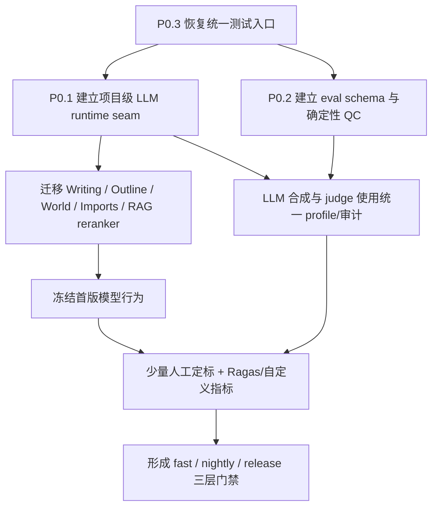

# P0 能力闭环实施计划与验收标准

> 日期：2026-07-11  
> 上游分析：[`2026-07-11-模块能力与跨模块需求分析.md`](../../audit/2026-07-11-模块能力与跨模块需求分析.md)  
> 状态：**Pilot 数据、工程基础设施与首轮 SUT 基线已闭环，仓库级最终复验已完成**；通用 Pilot v1.1 已重冻结 351 条。旧 RAG 聚合/可见性与 World 0÷0 假满分问题已修复，corrected RAG/Scene/World/Outline 四件套及联合 JSON/Markdown report 已通过 dataset/version、suite 唯一性、SUT profile、artifact hash 与 timing 交叉校验；旧 RAG/World 数值继续作废。  
> 范围：P0.1 统一项目级 LLM 配置消费、P0.2 建立高质量语义评测基线、P0.3 补齐跨模块统一测试入口。

## 0. 2026-07-12 完成快照

- P0.3：统一 `make test-fast` 已恢复为单 pytest session，root fixture 归属与 conftest 静态守卫已覆盖全部 backend 测试源码，`make test-collect` 仅作收集诊断。最终复验为 1625/1634 collected、9 deselected；`make test-fast` 在同步旧预算断言 3072→32768 后一次最终运行 3079 passed、31 deselected。遵循“不过度重复测试”，未再做第二次性能重复运行。
- P0.1：生产可达的 novel-scoped 生成/rerank 已迁移 project runtime seam；client 成功、异常、取消路径统一关闭。深度导入在任务提交时持久化 secret-free effective-profile snapshot，恢复时冻结 model/参数/字段来源和 deep-import 设置，允许 Key 轮换，但 endpoint/extra 漂移会 fail closed。managed step 记录实际 request model、`novel_id`、step name、profile source/summary/hash，worker 在成功、失败和取消路径都合并进 task result，不保存 Key、完整 URL/query、prompt 或正文。旧 `modules.world.facade.run_entity_extraction` 及 DI 注册已删除，正式 World 评测复用 imports `world_objects` 深度导入阶段。Phase 2/3 和 high-quality 请求传递实际 phase model；embedding 仍与 project chat profile 强制隔离。
- legacy `SceneSegmentationService` 作为兼容/测试工具保留，但已迁移到 `open_project_llm_client(db, novel_id)` 并移除 direct-client 静态例外；生产主路仍是 Phase 0/1a/1b，静态测试证明 legacy 入口无生产调用方。
- P0.2：首轮 raw 400 暴露 259 条真实语义重复后，已修复 frozen input 覆盖、persona-only 伪多样性、批内/跨批最终形态唯一性和精确数量契约，并在 `pilot-v2-work` 重新生成 400 条（RAG 160、Scene 80、World 100、Outline 60）。合并确定性 QC 为 0 exact duplicate、0 split leakage；327 条直接通过，53 条仅进入 safety 人审，24 条因 hard-negative 含答案淘汰。
- v2 raw Pilot 已完成双 judge，原 v1.0 冻结 353 条。最终 v1.1
  baseline 重冻结为 351 条：RAG 127、Scene 75、World 92、Outline 57。
  `scene-000077` 因章节事实错置排除；`rag-000083` 在可见性字段
  机器可执行化后因 positive source 越过 cutoff 被确定性 QC 排除。
  manifest 如实记录 generator=`gpt-5.6-luna`、
  judge=`mixed:gpt-5.3-codex-spark,gpt-5.6-luna`、range locator=
  `gpt-5.3-codex-spark` 及 reviewer versions，并聚合 48 次 generation、
  97 次 judge、12 次 range-locator 运行来源；不因被测模型
  更换 dataset、case、metric 或 threshold。
- manifest 不把历史缺失字段伪写为实测：48 次 generation run 保留
  实际 duration/cache 来源；旧 judge/range-locator 的 executor hash 显式标记
  `reconstructed_from_model_config`，reasoning 标记 `inferred_from_model_policy`，
  duration/cache 标记 `unknown_historical`，整体 provenance 为
  `partial_reconstructed`。
- 人审覆盖已离线验证：主审按 suite 为 RAG 67、Scene 30、World 30、Outline 30，覆盖全部 53 条 safety case、全部 23 条 RAG no-answer 和 25 条 visibility-cutoff；40 条双审严格是主审子集。review HTML 已升级为纯本地交互页，可直接选择 status/score/reason、校验 edited reference JSON 并下载可导入 JSONL，不使用 `innerHTML`、网络或 LLM。
- 历史 v1.0 校准使用透明标记的 surrogate reviewer A=`gpt-5.6-terra`、B=`gpt-5.6-sol`；Scene range repair 仍按当时规则完成 Terra 30 条、Sol 双审 9 条和 5.3 adjudication。自 2026-07-12 用户新指令起，后续审查固定为 A=`deepseek-v4-flash`（读取 disposable project 的 effective profile/key）、B=`gpt-5.6-luna` + 独立 `reasoning_effort=medium`、分歧裁决=`gpt-5.6-terra`。CLI 已强制 role/model 映射；A 走 novel-scoped project runtime 并关闭 client，B/裁决仍走隔离 Codex CLI。所有 reviewer 均必须收到 source/hard-negative refs 对应小说上下文，且继续标为模型 surrogate，不能伪称真实人工。
- 冻结后 accepted baseline 的 readiness 为 `ready=true`；LLM metric 校准因 label support 不足保持 non-blocking。raw 400 候选集中 5/205 已复核样本为 invalid（2.44%），未达原定 ≤2% 目标；该数值作为生成管线诊断单独报告，不能通过删除 accepted baseline 中的难例来美化。accepted baseline 本身的已审 invalid 为 0%。
- DeepSeek v4 Flash token ratio 已做多轮方差校准：`0.36`、`0.4`、`0.6` 均出现过 `finish_reason=length`；`0.75` 一次四窗首轮通过（末窗 10542/19898），但同一 1–60 章复跑的末窗仍在 19898/19898 处截断。默认系数因此提升为 `1.0`；正式四窗运行全部首轮 `stop`，末窗 16800/26531，`length_retry_count=0`。后续不再为 DeepSeek 的低价 token 做细粒度最小化：深度导入结构化调用统一给予 32768 上限，复杂任务保留高 reasoning，锚点/别名等简单任务关闭 thinking；上限不代表强制消耗。
- 最后配置审计发现 Phase 1b enrichment 仍保留旧的 4096 默认上限，
  与“简单/复杂任务统一预算”的用户策略不一致。该值已修正为
  32768，并随其他 deep-import settings 在任务提交时物化进
  secret-free execution snapshot。
- Phase 2 World 和 Phase 3 Outline 也收口为每次结构化请求单一
  `max_tokens=32768`，移除只改变 token 上限的阶梯扩容重试。
  transport/schema repair 与业务级 replacement rerun 仍各自保留原有语义，
  不与 token 预算扩容混为一类 retry。
- 配置闭环复核同步修复了三个暗角：Phase 1b payload 不再遮蔽
  项目 `enrich_max_tokens`；Phase 2 context snapshot 从活跃配置读取实际
  32768，不再错记 16384；Phase 3 新增项目可配置的
  `structure_max_tokens`（默认 32768），并进入前端设置和任务
  execution snapshot。
- 同一 corrected profile 上的 fresh Scene v1.1 运行为 55 个 Scene
  （53 exact、2 unresolved）、84 个 span（82 exact、2 unresolved），source hash
  错误 0，章节覆盖 100%。canonical boundary precision/recall/F1 为
  0.2680/0.3350/0.2978，远低于 0.90/0.85/0.87 目标；
  high-quality fallback rate=0.12，也高于 0.05 门槛。结论是
  “章节覆盖和 hash 安全达标，Scene 粒度/边界语义与完全定位仍未达标”，
  不得用 coverage 替代语义指标。
- World 旧 v6 报告的 entity/alias/relation precision=1.0/1.0/1.0 已
  确认是无 prediction 时把 0÷0 误记为 1.0 的历史错误，不再是
  能力证据。新 runner 为 entity/alias/relation 各输出 blocking precision、
  non-blocking recall 和 prediction coverage；0 prediction 时 precision 必须
  `available=false`。endpoint、quote/range 和 rollback 无证据时仍 unavailable。
- corrected World baseline 不重复消耗 LLM，而是对同一真实
  workflow 产物离线重算指标，因此显式记录
  `execution_reused=true`。原运行生成 275 个实体、186 个别名和
  559 条关系；当时的 `phase2a_failed` 仅由 1 个 unresolved Scene
  触发，代码现已将该类单元改为 non-blocking skip。评测所需
  35/35 个章节均有 exact span；2 个 residual unresolved span 仅作诊断。
  离线重算结果：entity precision/recall/coverage=
  1.0/0.6667/0.6667，alias=1.0/0.6087/0.6087；relation 无预测，
  precision unavailable、recall/coverage=0；false merge/source-ref=0 通过，
  ordinary pollution=0.095238 失败，endpoint/quote/rollback 仍 unavailable。
- RAG 旧数值已作废：no-answer case 不应进入 ranking metric
  聚合，`visibility_cutoff` 必须具有机器可执行的
  `visible_until_chapter`。修复后的 127-case fresh artifact 结果为
  P@5/MRR/R@10=0.1656/0.6098/0.8996，其中 R@10 达标，P@5/MRR
  未达标；no-answer FP=1.0 未达标，visibility leakage=0 通过。
- Outline suggestion-only baseline 已完成：`unconfirmed_asset_write_count=0` 通过；source ref、unsupported fact、false merge、hidden knowledge 和 rubric 因当前 preview 不返回可证明的 case-level evidence，全部如实标记 `available=false`，不按 0 分或通过处理。
- corrected 联合报告已对四个 runner artifact 执行 suite 唯一性、
  dataset/version 兼容性、同一 SUT profile、artifact path/hash 和 timing
  校验。四件套均 `timing_status=complete`：RAG 105.789s、Scene
  286.741s、World 971.871s、Outline 70.330s，`runner_errors=[]`。
  历史 `pilot-v1.1-final-100` 报告因时间戳倒置及旧 RAG/World
  指标错误继续作废，没有被篡改或当作当前 baseline。
- 已离线生成 gitignored 的 full/v1 corpus manifest：`lotm-clown-v1`，213 章，正文文件 hash 为 `9e7e85752038f480bc709c959ad7dce43da9439acb54c0b0588bf5662ac984f0`；同时冻结 7 个仓库 fixture source 的脱敏 hash manifest。两者都不包含正文，也未调用 LLM；它们不是 v1 dataset manifest。
- eval CLI 已提供 `--cache-only`（Makefile 为 `CACHE_ONLY=1`）保险丝；任一 cache miss 立即失败，不启动 Codex。
- Codex executor 使用独立进程组；超时会清理整个进程组，避免 model-refresh 子进程在父进程终止后继续挂起。
- 额度调查期间的 13:13 探针曾卡在本地 Codex model refresh/子进程
  退出超时；执行器随后改为独立进程组清理。13:43 不含小说正文的
  结构化复查确认 `gpt-5.3-codex-spark` 可用；后续经用户恢复
  generate/judge/review 后已完成 v1.1 冻结。此条只作历史执行诊断，
  不再表示当前等待额度或用户授权。
- 最终门禁：`make eval-fast` 80 passed；`make test-integration`
  70 passed、22 deselected；前端 928 passed；prompt contracts 6 passed；
  Ruff lint 通过，`make format` / Ruff format check 569 files，`git diff --check` 通过。
- 完成证据汇总见 [`2026-07-12-P0能力闭环完成审计.md`](../../audit/2026-07-12-P0能力闭环完成审计.md)。

## 1. 目标与非目标

### 1.1 总目标

完成三个互相依赖的 P0 闭环：

1. **同一 novel 的业务 LLM 调用使用同一 effective project profile**，不再出现设置页已保存、生产调用仍使用系统默认的情况；
2. **对 RAG、Scene、World 抽取/去重、Outline 结构建立可重复质量基线**，使用“LLM 自动生成 + 自动质检 + 少量人工”的数据生产线，并用 Ragas 与确定性指标形成分层评测；
3. **恢复一条真正覆盖全部默认测试面的统一命令**，消除当前多模块 pytest 收集时的 conftest 冲突，并把配置消费、模块接口和评测 smoke 纳入门禁。

### 1.2 非目标

- 不引入新的生产数据库、向量库、队列或前端框架；
- 不把 Ragas、pandas、LangChain 等评测依赖加入生产 `dependencies`；
- 不把 embedding provider 强行并入项目聊天模型设置；
- 不用 LLM judge 分数替代 novel 隔离、source hash、可见性、用户确认等确定性安全门禁；
- 不在本轮修改现有 HTTP API、数据库 schema 或前端 wire shape；
- 不建立自治评测 Agent、自治修复 loop 或自动改写正史资产的能力；
- 不把真实用户小说正文、受版权限制的外部语料或 API Key 提交到仓库。

## 2. 总体顺序



推荐实施顺序：

1. 先修 P0.3，使后续每个 commit 都有可靠回归入口；
2. 再做 P0.1 的深 module 和调用方迁移；
3. P0.2 独立使用本机 Codex CLI，不依赖 P0.1 的项目 profile seam；schema/QC、LLM 生成和 judge runner 可与 P0.1 并行；
4. 首版数据集冻结后，再启用数值回归门禁，避免拿未经校准的 judge 分数阻断开发。

## 3. P0.3：统一跨模块测试入口

### 3.1 当前问题

当前各模块独立运行全部通过，但把九个模块测试目录放进同一 pytest 进程时会在收集阶段失败：

- `modules/memory/tests/` 缺少 `__init__.py`，其 `conftest.py` 可能以顶层 `conftest` 被导入；
- `backend/tests/conftest.py` 使用 `from conftest import ...`；
- RAG/Writing 测试又显式 `from tests.conftest import ...`；
- 多个测试目录存在同名 `conftest.py` 和同名 fixture，导致导入解析依赖执行入口与收集顺序。

仓库已经声明 root `backend/conftest.py` 拥有共享数据库、项目、实体、人物和 API client fixture。因此修复方向应是**恢复 root fixture 的唯一所有权**，而不是新增一个测试 runner 去分别启动九个 pytest 进程掩盖冲突。

### 3.2 目标 interface

统一入口保持现有命令，不新增平行测试体系：

```bash
make test-fast        # 默认后端完整离线门禁
make test-integration # 跨模块 SQLite flow
make test-frontend    # Vitest
make test-all         # 后端 fast + frontend
```

测试调用方只需要知道 marker 和上述命令；fixture 的导入位置、metadata 注册、事务/savepoint 和 DI reset 都隐藏在 root test harness 后面。

### 3.3 文件计划

修改：

- `backend/modules/memory/tests/__init__.py` — 把 memory tests 变成明确 package；
- `backend/tests/conftest.py` — 删除从顶层 `conftest` 手工导入 fixture 的兼容写法；
- `backend/modules/rag/tests/test_indexing.py` — 删除 `from tests.conftest import ...`；
- `backend/modules/writing/tests/test_writing.py` — 删除 `from tests.conftest import ...`；
- 其他出现 `from conftest` / `from tests.conftest` 的测试文件；
- `backend/tests/unit/test_test_harness.py`（新建）— test harness 结构守卫；
- `Makefile` — 在需要时增加 `test-collect`，但 `test-fast` 仍是权威执行入口；
- `testing-guide.md` — 明确 fixture 不允许作为普通 Python 符号 import。

### 3.4 实施步骤

#### Task 3.1：冻结复现

- [x] 记录当前独立模块测试结果和合并收集错误；
- [x] 新增最小回归测试或 shell acceptance，证明 `pytest modules -q --collect-only` 不得出现 import mismatch；
- [x] 确认普通 `pytest`、`make test-fast` 和显式多个模块目录使用同一 rootdir。

#### Task 3.2：消除 conftest 模块歧义

- [x] 添加 `backend/modules/memory/tests/__init__.py`；
- [x] 删除所有 `from conftest import ...`；
- [x] 删除所有 `from tests.conftest import ...`；
- [x] 测试函数继续通过参数名声明 fixture，不能把 fixture 当普通函数调用；
- [x] module `conftest.py` 只保留本模块 factory/mock，不重新定义 root 通用 fixture，确有覆盖需要时必须改成更具体的名称。

#### Task 3.3：增加静态守卫

新增测试检查：

- [x] `backend/modules/**/tests` 都是 package；
- [x] 测试源码不存在 `from conftest import`；
- [x] 测试源码不存在 `from tests.conftest import`；
- [x] root `backend/conftest.py` 仍注册全部 ORM metadata；
- [x] `pyproject.toml` marker 保持 strict，默认排除 `e2e/real_llm/external_data`。

#### Task 3.4：恢复统一命令

- [x] `make test-fast` 单 pytest 进程通过；
- [x] `make test-integration` 通过；
- [x] `make test-frontend` 通过；
- [x] `make prompt-contracts` 通过；
- [x] `make lint` 通过；
- [x] `make format` 通过；最终文件数随当前工作树复验，不固化早于后续新文件的计数；
- [x] 如添加 `test-collect`，它只能做快速收集诊断，不替代 `test-fast`。

### 3.5 P0.3 验收标准

#### 必须满足

- `pytest modules -q --collect-only` exit code 0；
- `make test-fast` exit code 0，且没有 collection warning/import mismatch；
- 九模块可以在同一 pytest session 中执行，而不是 Makefile 隐式拆成九个进程；
- `make test-integration` exit code 0；
- `npm test -- --run` exit code 0；
- 静态守卫发现任何 conftest 显式 import 时失败；
- 原有 `real_llm/external_data/e2e` 分层不改变；
- 测试数据库仍是每 test 外层 transaction + savepoint，应用 `commit()` 不泄漏到下一测试。

#### 性能与稳定性

- 首次记录 `make test-fast` wall time 作为 baseline；
- 后续无合理原因不得比 baseline 增加超过 20%；
- 连续运行 `make test-fast` 两次结果一致，不出现顺序依赖；
- `pytest --random-order` 不作为新依赖或本轮门禁；如未来引入，需单独评估。

## 4. P0.1：统一项目级 LLM 配置消费

### 4.1 精确范围

必须项目化的是**带 novel_id 的业务文本/结构化生成与 LLM judge**：

- writing candidate、冲突 AI review、冲突修复建议；
- outline analyze/generate/Scene extract、结构去重、跨章判断、PlotStructureGenerator；
- world entity fusion 以及仍未使用 project profile 的业务生成；
- imports 活跃的 Scene/实体/别名关系 adapter；
- RAG LLM reranker；
- 业务模块内所有 novel-scoped LLM workflow；P0.2 评测生成与 judge 明确排除在外，使用独立的本机 Codex executor。

不属于本 P0 的调用：

- `generate_embedding()`：当前由 `EMBEDDING_PROVIDER/MODEL/BASE_URL/API_KEY` 独立配置；
- health/doctor、provider template、单元测试 fake；
- 无 novel_id 的显式开发工具；
- 默认关闭且已确认不在生产调用链中的 legacy 文件，需先分类为“迁移”或“删除”，不能静默保留。

RAG 当前通过 `LLMClient().generate_embedding()` 访问独立 embedding provider，命名容易误导，但不能因此把 embedding API Key 或模型继承到项目聊天 profile。后续可单独提炼 `EmbeddingClient`，不纳入本轮必要范围。

### 4.2 深 module 设计

新增一个高 leverage 的项目 LLM runtime module，由 project 拥有 effective settings，由 infrastructure 拥有 client：

```python
# modules/project/facade.py
@asynccontextmanager
async def open_project_llm_client(
    db: AsyncSession,
    novel_id: str,
    *,
    timeout_override: int | None = None,
) -> AsyncIterator[LLMClient]: ...
```

interface 不允许调用方传 `base_url/api_key/provider_id` 绕过项目设置。workflow 需要切换模型时，在 `LLMCallRequest.model` 中选择允许的 phase model；连接、Key、base URL、默认参数仍来自 effective profile。

实现内部流程：

1. project service 读取未删除 project；
2. settings service 物化 `project > global > system`；
3. `LLMClient.from_project_settings()` 构造 client；
4. client 暴露只读脱敏 `profile_summary`；
5. context manager 统一关闭 provider connection；
6. project 不存在、Key 未配置、profile 无效时返回稳定的错误类型。

删除该 module 后，settings load、profile precedence、client 构造、脱敏和 close 会重新散落到多个调用方，符合 deep module 的 deletion test。

### 4.3 文件计划

新建：

- `backend/modules/project/llm_runtime.py` — profile load、client lifecycle、稳定错误；
- `backend/modules/project/tests/test_llm_runtime.py`；
- `backend/tests/unit/test_novel_scoped_llm_usage.py` — AST/static guard。

修改：

- `backend/modules/project/facade.py` — 暴露 `open_project_llm_client`；
- `backend/infrastructure/llm/client.py` — 保存只读 sanitized profile summary；
- `backend/modules/writing/services.py`；
- `backend/modules/writing/conflict_ai.py`；
- `backend/modules/writing/tasks.py`；
- `backend/modules/outline/ai_workflow_service.py`；
- `backend/modules/outline/generator.py`；
- `backend/modules/outline/cross_chapter_detection.py`；
- `backend/modules/outline/structure_dedup.py`；
- `backend/modules/world/entity_fusion.py`；
- `backend/modules/imports/workflow_llm_adapters.py`；
- `backend/modules/imports/entity_extraction/scene_entity_llm_adapters.py`；
- `backend/modules/imports/scene_segmentation.py`（确认仍活跃的路径才迁移）；
- `backend/modules/rag/reranker.py`、`retrieval.py`；
- 相关 module README 和 `docs/modules/12_infrastructure.md`。

### 4.4 实施步骤

#### Task 1.1：建立调用清单与分类守卫

为每个 `LLMClient()` 记录：

- 文件/函数；
- 是否有 novel_id；
- generate / generate_structured / embedding / health；
- 当前是否生产可达；
- 目标：migrate / explicit project-agnostic allowlist / delete。

静态测试至少识别：

- `backend/modules/**` 中直接 `LLMClient()`；
- `LLMClient.from_project_settings()` 在调用方重复解析 profile；
- allowlist 只允许 embedding adapter 和明确开发工具；
- allowlist 每项必须包含原因，不能写目录级通配。

#### Task 1.2：实现 project runtime seam

- [x] `open_project_llm_client()` 验证 novel 存在且未软删除；
- [x] 使用 `get_project_context()` 已物化的 effective settings；
- [x] `LLMClient` 保存 `profile_summary`，其中不含 Key、完整 base URL query 或 secret extra；
- [x] context manager 在成功、异常、取消时均 `close()`；
- [x] `timeout_override` 只允许正数并有上限；
- [x] 不允许 facade 接受任意 `provider_kwargs`；
- [x] fake client 仍可通过业务 module 构造函数注入，测试不必访问真实 project profile。

#### Task 1.3：迁移 writing

- [x] task handler 在一个 async context 内创建 client并注入 `WritingGenerationService`；
- [x] conflict AI review/suggestion 按请求 novel 创建 client，移除模块级默认 client；
- [x] confirmation 校验在 LLM 调用之前；
- [x] provenance 记录 `profile_summary` 或其稳定 hash，不记录 secret；
- [x] candidate/adopt/publish 语义不变。

#### Task 1.4：迁移 outline

- [x] `OutlineAIWorkflowService` 的 analyze/generate/extract 使用 project client；
- [x] `PlotStructureGenerator` 接收注入 client，不自行创建默认 client；
- [x] cross-chapter detection 和 structure dedup 在外层 run/pair batch 复用同一 client；
- [x] RAG evidence fallback 和 preview/apply 语义不变；
- [x] 所有 LLM 结果仍先 preview/needs_review，不扩大自动写入权限。

#### Task 1.5：迁移 world/imports

- [x] world entity fusion 通过 novel_id 获取 project client；
- [x] 已经 project-aware 的 extraction/object draft/world bible 路径只补一致性测试，不重写；
- [x] imports 主 workflow adapter 保持现有 profile 逻辑，可改为复用新 seam但不改变 phase model/high-quality override；
- [x] Phase 2a/2b 当前活跃 adapter 移除 direct default client；
- [x] legacy scene segmentation 先做 production reachability test，活跃则迁移，不活跃则另行删除，不能一边保留一边加入永久 allowlist；
- [x] context snapshot 的 sanitized provider summary 与实际 client 一致。

实际收口选择：`SceneSegmentationService` 仍被保留为兼容/测试工具，
但 batch 和 single-chapter 路径都已使用
`open_project_llm_client(db, novel_id)`，不再保留 direct-client allowlist。
生产 workflow 仍走 Phase 0/1a/1b seam，AST reachability 测试证明 legacy
入口没有生产调用方。

#### Task 1.6：迁移 RAG reranker，保留 embedding 边界

- [x] 先修复 `hybrid_search()` 过早截断导致 reranker 不可达的问题；
- [x] reranker 接收注入 client，不在内部 `LLMClient()`；
- [x] 只在配置和 mode 允许时创建 project client；
- [x] embedding query/index 继续走 `EMBEDDING_*`，不读取 project chat Key；
- [x] reranker 失败继续使用原始排序并返回 warning；
- [x] P0.2 RAG baseline 显示相关性与 abstention 未达标，因此
  `RERANKER_ENABLED` 继续默认关闭；后续只能在同一冻结 baseline
  上证明改善后再评估开启。

#### Task 1.7：完成静态和运行验收

- [x] AST guard 对所有 novel-scoped业务生成生效；
- [x] 使用两个 project、两个 fake provider profile 验证 runtime 隔离，并以精确 AST 调用参数守卫证明每个 DB-backed workflow 传入自身 `novel_id`；imports workflow 以 project-owned snapshot client seam 的精确调用守卫和 adapter 生命周期测试覆盖；
- [x] 修改 project A 设置不影响 project B；
- [x] 全部日志、task result、snapshot 和 API response 不出现 Key；
- [x] client 在异常/取消后关闭。

### 4.5 P0.1 验收标准

#### 配置正确性

- 所有生产可达、带 novel_id 的 text/structured/judge 调用，项目 profile 消费覆盖率 100%；
- project/global/system precedence 与 settings effective API 完全一致；
- 同一 task artifact 中的 provider/model/base_url_host 与实际 client summary 一致；
- project A/B 并发调用不串 profile、Key、model 或 result；
- 项目设置更新后，新创建 task 使用新 profile；已运行 task 不被中途换 profile。

#### 安全

- API Key 在响应、日志、exception、task meta/result、context snapshot、eval report 中出现次数为 0；
- 缺 Key 的远程 provider fail closed，不回退另一个项目或旧环境 Key；
- soft-deleted/missing novel 不得发起 LLM 调用；
- timeout override 不允许覆盖 provider/base URL/Key。

#### 行为兼容

- HTTP API、schema、task type、candidate/preview/apply 语义不变；
- imports high-quality phase model 选择不变；
- RAG embedding 维度/provider 行为不变；
- 现有模块测试、prompt contracts、真实 LLM smoke 通过；
- 无新增跨模块 internal import，业务代码只通过 project facade 使用该 seam。

#### 可观测性

- 每次 managed LLM step 能记录 `novel_id`、step name、脱敏 profile summary/hash；
- 不记录完整 prompt/正文，沿用现有 snapshot/artifact 保留规则；
- 可按 step name 汇总“项目 profile / system default / test fake”来源。

## 5. P0.2：高质量语义评测基线

### 5.1 原则

采用用户指定的生产方式：

```text
受控源语料/结构 fixture
  -> LLM 批量生成候选 case
  -> 确定性 QC
  -> LLM judge 自动质检与分歧处理
  -> 少量、分层人工复核与 judge 校准
  -> 冻结 dataset version
  -> 确定性指标 + Ragas + 自定义 rubric
  -> fast/nightly/release 分层门禁
```

#### 高质量 LLM 的固定定义

P0.2 中凡需要高质量 LLM 的步骤，统一使用本机 Codex CLI 的
**`gpt-5.3-codex-spark`**，包括：

- 评测 case/query/reference/hard negative 的生成；
- Scene、World、Outline reference 候选的辅助标注；
- 第一、第二 LLM judge；
- Ragas 中依赖 LLM 的 Context Precision/Recall、Noise Sensitivity、Faithfulness、rubric/criteria 指标；
- 失败样本分类与评测报告的 LLM 辅助归因。

模型 surrogate review 不属于上述 generator/judge“高质量 LLM”角色。后续
reviewer A/B/adjudicator 按独立校准策略固定为
`deepseek-v4-flash` / `gpt-5.6-luna`（reasoning=`medium`）/
`gpt-5.6-terra`；该分工只改变审查来源，不改变冻结 dataset、指标或阈值。
Reviewer A 必须使用 disposable project 已配置的 effective profile，不从环境或
Codex CLI 猜测 Key；其 client 生命周期和脱敏 provenance 仍受 P0.1 runtime seam
约束。

执行时调用本机已登录的 Codex CLI，默认显式锁定
`model=gpt-5.3-codex-spark`；仅在用户明确授权且 5.3 返回 usage/rate limit 时，
才允许通过 `EVAL_CODEX_MODEL=gpt-5.6-luna` 临时选择已批准备用模型，并独立
传入 `model_reasoning_effort="medium"`。缓存键、
case、judge decision、manifest 和 readiness report 必须记录实际模型；既有 5.3
缓存回放仍保持 5.3 provenance，不得伪装成备用模型。备用模型
`gpt-5.6-luna` 与 reasoning `medium` 必须作为两个独立维度
传入、记录和校验，不得拼成一个模型字符串。
执行器不读取项目数据库中的 API Key，不经过项目
DeepSeek/OpenAI-compatible profile，也不依赖 P0.1 project LLM runtime seam。
执行器必须使用 stdin、`--ephemeral`、`--ignore-user-config`、
`--ignore-rules`、`--sandbox read-only`、空临时工作目录和
`--output-schema`，并显式关闭 plugins、image generation、shell 和 tool
suggest；禁止读取仓库/用户插件上下文、调用工具或未授权的静默回退。
模型不可用、CLI 未确认请求模型或 schema 校验失败时，本次 LLM 阶段标记为
`unavailable/error`，确定性 QC 结果仍可落盘。dataset manifest、judge cache
和 report 必须记录实际 model、executor hash、prompt hash、参数与运行时间，
但不得复制小说原文、Codex 登录凭据或项目 API Key。

Ragas 官方当前把 testset generation 拆为 Knowledge Graph enrichment 和 scenario/testset generation，并支持 single-hop specific、multi-hop abstract、multi-hop specific 等 query distribution；这套思想适合补充中文小说的 query 分层。官方同时提供 Context Precision、Context Recall、Noise Sensitivity、Faithfulness 和通用 rubric/criteria metrics。本文采用其**当前 collections-based metric API**，不采用已标记 legacy 的旧 API。

参考：

- [Ragas Testset Generation for RAG](https://docs.ragas.io/en/latest/getstarted/rag_testset_generation/)
- [Ragas available metrics](https://docs.ragas.io/en/stable/concepts/metrics/available_metrics/)
- [Ragas Context Precision](https://docs.ragas.io/en/stable/concepts/metrics/available_metrics/context_precision/)
- [Ragas Context Recall](https://docs.ragas.io/en/stable/concepts/metrics/available_metrics/context_recall/)
- [Ragas Noise Sensitivity](https://docs.ragas.io/en/stable/concepts/metrics/available_metrics/noise_sensitivity/)

### 5.2 依赖策略

- 新增 `[project.optional-dependencies].eval`，不进入生产 dependencies；
- 已实测固定 `ragas==0.4.3`；因其与 `langchain-community==0.4.2` 存在
  上游已知的 `ChatVertexAI` 导入断裂，eval extra 同时固定
  `langchain-community==0.4.1`；
- 优先使用 Ragas collections API，并通过 `InstructorBaseRagasLLM` adapter
  复用本机 Codex executor；
- 不为 Ragas quickstart 引入整个 LangChain；如果 testset generator 必须依赖 LangChain，则只允许 eval extra，并先比较直接使用现有 `LLMClient` 生成 case 的成本；
- 评测数据、judge cache 和 report 默认本地文件，不要求云端平台；
- `rapidfuzz` 已是现有依赖，可用于非 LLM duplicate/similarity QC。

### 5.3 eval module interface

新建开发期 package，不创建第 10 个业务模块：

```text
backend/evals/
├── schemas.py             # DatasetCase / DatasetManifest / EvalResult
├── corpus.py              # 合法 source snapshot 与 logical source ref
├── generation.py          # synthetic generator
├── qc.py                  # deterministic + judge QC
├── review.py              # human review import/export
├── cache.py               # generation/judge cache
├── metrics.py             # P@K/MRR/F1/安全指标/置信区间
├── ragas_adapter.py       # 可选 Ragas collections adapter
├── runners/
│   ├── rag.py
│   ├── scene.py
│   ├── world.py
│   └── outline.py
├── datasets/
│   ├── README.md
│   ├── manifests/
│   └── baselines/
└── cli.py
```

对开发者保持少量稳定命令：

```bash
make eval-generate SUITE=rag SIZE=300
make eval-qc SUITE=rag DATASET=v1-candidate
make eval-fast
make eval-rag DATASET=evals/datasets/local/pilot-v1.jsonl \
  NOVEL_ID=<isolated-project-id> DATASET_ID=pilot-v1 DATASET_VERSION=1.0.0
make eval-full DATASET=evals/datasets/local/pilot-v1.jsonl \
  NOVEL_ID=<isolated-project-id> DATASET_ID=pilot-v1 DATASET_VERSION=1.0.0
```

Ragas 只存在于 `ragas_adapter.py` 内部。业务 runners 输出仓库自有 `EvalResult`，避免将第三方版本变化扩散到四个业务模块和数据文件。

### 5.4 数据 schema

每条 `DatasetCase` 至少包含：

```json
{
  "case_id": "rag-alias-000123",
  "suite": "rag",
  "scenario": "alias_paraphrase",
  "risk_level": "normal",
  "source_group_id": "lotm-clown-ch001-060",
  "source_refs": [],
  "input": {},
  "reference": {},
  "hard_negative_refs": [],
  "visibility": {},
  "rubric": {},
  "generation_meta": {},
  "qc": {},
  "human_review": {},
  "split": "train"
}
```

强制字段语义：

- `source_refs` 使用稳定 logical ref：source group、chapter、content hash、range hash/offset，不依赖一次数据库重建生成的 UUID；
- `reference` 同时支持 reference answer、reference context IDs/ranges、expected assets/boundaries；
- `hard_negative_refs` 必须真实存在且与正例可混淆；
- `visibility` 显式记录 author/reader/character 和 cutoff；
- `generation_meta` 只记录脱敏 model/profile/prompt hash/seed，不记录 Key 或 raw hidden prompt；
- `split` 按 source group 划分，禁止同一 Scene/章节的改写样本跨 train/test；
- `human_review` 保留 reviewer version、结论和理由，不保存个人敏感信息。

### 5.5 数据来源

本轮 P0.2 的主评测小说固定为用户指定的本地语料：

1. **Pilot 默认语料（前 60 章）**：`/Users/tywww/Desktop/项目/wirting skill/诡秘之主_第一部 小丑_前60章.txt`；
2. **v1/full 默认语料（第一部全文）**：`/Users/tywww/Desktop/项目/wirting skill/诡秘之主_第一部 小丑.txt`。

两份文件均已在本地核实存在。执行者可在成本或运行时间受限时只使用前 60 章版本；完整 v1 基线默认使用第一部全文。它们属于同一作品且前 60 章内容重叠，必须遵守以下规则：

- 正文只作为用户明确授权的评测输入，通过本机 Codex CLI 发送给已登录的
  Codex/OpenAI 服务；不经过项目 DeepSeek profile，不复制、提交或嵌入仓库；
- 仓库可提交的 manifest 只保存 logical path alias、文件 hash、章节号、range hash 和生成配置，不保存绝对路径或可还原大段正文的内容；本地运行 manifest 可记录绝对输入路径，但不得提交；
- report/review artifact 仅保留判定所需的最短 excerpt，并默认加入 `.gitignore`；
- 前 60 章文件和全文文件中的同一章节视为同一 source group，不能因文件 hash 不同而跨 train/dev/test；
- 切换文件版本后先做章节标题、章节数、编码和 content hash 校验，再生成 source snapshot；
- 全文 v1 可以沿用 Pilot 已人工确认的章节 1-60 reference，但必须通过新 manifest 的 source/range 重锚定校验。

辅助数据来源的优先级：

1. 上述《诡秘之主》第一部本地语料；
2. 仓库现有 synthetic fixture 和测试小说，用于安全边界、no-answer 和跨 novel 隔离测试；
3. 使用本机 `gpt-5.3-codex-spark` 生成且明确标记 synthetic 的中文微型长篇，用于补足真实语料不便构造的 hard negative；
4. 禁止默认抓取新的小说语料或提交上述本地小说正文。

每个真实或 synthetic source group 都要有可计算的结构：

- 章节与正文 source hash；
- Scene 边界和 SceneSpan；
- canonical/review world objects、alias、relations；
- character knowledge 和 reveal cutoff；
- plot thread、arc、foreshadow/reveal；
- 至少一组同名、近义、时间错位和未来剧情 hard negative。

### 5.6 四套 suite

#### RAG suite

场景分层：

- 精确专名、别名/称号、无空格中文复合词；
- 语义改写、事件原因/结果、人物目标；
- 单跳和多跳；
- 相邻章节、远距离伏笔、时间衰减；
- 同名对象、相似事件、普通词 n-gram hard negative；
- no-answer；
- canonical/working 差异；
- reader/character cutoff、Scene strict filter；
- stale source/hash 和未映射 Scene。

主要 reference：logical chunk/range IDs、reference answer、hard negative IDs。

#### Scene suite

场景分层：

- 地点/时间/POV/目标切换；
- 对话连续但目标变化；
- 章节内多 Scene、跨章单 Scene；
- 只有弱边界、无边界、歧义边界；
- overlap/window 边缘；
- future Scene/跨章未来 span；
- exact/reanchored/chapter_only/unresolved。

主要 reference：Scene 数、边界 paragraph/offset、locked fields、source refs、mapping status。

#### World suite

场景分层：

- 值得长期维护的实体；
- 路人、代词、普通道具和一次性地点负例；
- alias/称号/旧名和同名不同对象；
- 关系、方向、强度、quote；
- temporal delta 和 map observation；
- canonical/review/ignored 状态；
- duplicate merge、alias-only、keep-separate、needs-review。

主要 reference：expected asset/action、实体类型、alias target、relation endpoint、source quote/range。

#### Outline suite

场景分层：

- plot thread、arc、Scene、foreshadow、reveal；
- 结构引用有效/无效；
- 重复结构与主题相似但应分离；
- reveal 过早、同章顺序不明；
- 跨章 Scene 建议；
- 低置信和无 Scene 证据；
- preview/apply 与不允许自动采用。

主要 reference：结构类型、章节范围、supporting Scene、action、rubric、禁止项。

### 5.7 LLM 自动生成

#### Task 2.1：生成 source world

- [x] 默认从前 60 章文件建立 Pilot source snapshot，从第一部全文建立 v1/full source snapshot；
- [x] 对章节标题、顺序、数量、编码、文件 hash 和逐章 content hash 做预检；
- [x] 当前已有 7 个固定 fixture source 覆盖安全边界、no-answer 与隔离场景，尚无证据需要新增 synthetic 小说；后续若 accepted 分层暴露缺口，才使用固定 seed、配置和本机 `gpt-5.3-codex-spark` 补充；
- [x] 生成器输出必须经过 Pydantic schema；
- [x] 先写 writing/outline/world 的 reference snapshot，再生成问题，避免“问题先行后补答案”；
- [x] generator prompt 要求提供 answer、supporting refs、hard negatives 和 scenario；
- [x] generator 不可看到目标系统的当前检索排序，避免过拟合；
- [x] 每条 case 保存 generator model、prompt hash、seed 和 source hash。

#### Task 2.2：生成 query/case

- [x] 每个 source group 按配置生成 single-hop、multi-hop、no-answer、visibility 和 hard-negative case；
- [x] 生成 2-3 倍目标数量，允许后续 QC 大量淘汰；
- [x] query 要模拟作者语言，不直接复制 source 前 80 字；
- [x] 专名 case 可以保留必要名称，但长 query 的 lexical overlap 必须检查；
- [x] 对同一 reference 生成多个 persona：作者检索、写作冲突、融合证据、跨章判断。

### 5.8 自动质检

#### 第一层：确定性 QC（每次生成必跑）

- schema/type/enum 完整；
- source ID/hash/range 可重读；
- reference answer 的关键 claim 能在 source 中定位；
- quote 唯一或显式标记 ambiguous；
- hard negative 存在且不包含 reference answer；
- no-answer case 在允许范围内确实无答案；
- visibility cutoff 后的 evidence 不得进入 reference；
- novel/source group 不串；
- case ID、source ref、logical context ID 唯一；
- normalize 后 exact duplicate=0；
- semantic near duplicate 进入 cluster，只保留信息量最高样本；
- train/dev/test 按 source group 隔离；
- query/source lexical overlap 超阈值时进入 review，而非一律删除专名 case；
- 长度、语言、空字段、模板化话术和答案泄漏检查。

#### 第二层：LLM judge QC

judge 对每条 case 输出结构化结论：

- natural_query；
- answerable / correctly_no_answer；
- reference_faithful；
- reference_complete；
- hard_negative_valid；
- ambiguity；
- risk_flags；
- accept/reject/review 和理由。

策略：

- 普通 case 先用一次本机 `gpt-5.3-codex-spark` judge；
- safety-critical、自动 reject 边界和 judge 不确定 case 使用第二次独立的本机 `gpt-5.3-codex-spark` judge；
- 两 judge 分歧进入人工队列，不用第三次相同 prompt 无限投票；
- generator、第一 judge、第二 judge 使用不同 prompt template、上下文裁剪和 rubric view；judge 不读取 generator 的 reasoning 或 accept/reject 自评；
- 因 generator 与 judge 使用同一模型，不能把双 judge 当作真正独立的模型证据，必须依靠分层人工样本校准共同偏差；
- judge 输出 cache key 包含 case hash、metric/rubric version、prompt hash、model 和温度；
- judge 失败不自动接受 case。

### 5.9 少量人工定标

人工不逐条重做 LLM 工作，而负责校准和高风险样本：

- safety-critical case 100% 人工：跨 novel、未来泄漏、canonical 自动合并、no-answer、隐藏知识；
- 每个 suite/场景至少抽查 15%，且每 suite 不少于 30 条；
- 人工样本中至少 25% 双人独立标注；
- 二元判断记录 Cohen's kappa，序数 rubric 记录 Spearman 相关；
- 分歧由一次 adjudication 解决并更新 rubric 示例；
- 人工修改 reference 后，原生成值和修改原因保留在 audit metadata；
- 每次 dataset major version 重新做校准，普通增量只复核新增/变化 strata。

### 5.10 Ragas 与自定义指标

#### blocking 的确定性指标

- logical ID-based P@K、R@K、MRR、NDCG；
- source/hash/range validity；
- novel/visibility/Scene leakage；
- boundary precision/recall/F1；
- schema validity、duplicate/pollution/error rates；
- preview/confirm/rollback 状态机。

#### Ragas 指标

- `ContextPrecision`：评估相关 chunk 是否排在前部；
- `ContextRecall`：reference claim 是否被 retrieved contexts 支持；
- `IDBasedContextPrecision/Recall`：适用于已有 stable logical context IDs 的 RAG suite；
- `NoiseSensitivity`：评估 irrelevant/hard-negative context 对答案的污染；
- `Faithfulness/ResponseRelevancy`：只用于包含下游生成回答的 eval，不替代 retrieval ID 指标；
- `DiscreteMetric/RubricsScore/AspectCritic`：用于 Scene、World、Outline 的定制 rubric。

Ragas LLM-based 分数在完成 human calibration 之前只做趋势指标，不作为 blocking gate。ID-based 和安全指标可从首版开始 blocking。

### 5.11 数据集规模与版本

#### Pilot v0

目标：验证 pipeline，而非宣称模型达标。

- 自动生成 raw candidates ≥ 300；
- source corpus 默认使用《诡秘之主》第一部前 60 章版本；
- QC 后 accepted cases ≥ 200；
- RAG ≥ 80、Scene ≥ 40、World ≥ 50、Outline ≥ 30；
- safety-critical 全审 + 分层人工抽查至少 60 条；
- 形成一份 baseline report 和错误分类表。

#### Release baseline v1

- accepted cases ≥ 800；
- source corpus 默认使用《诡秘之主》第一部全文；
- RAG ≥ 300、Scene ≥ 180、World ≥ 200、Outline ≥ 120；
- 每个必需 scenario 至少 20 条；
- source-group split 60/20/20；
- test split 冻结，不参与权重、prompt、阈值调优；
- 数据集 manifest 记录 schema、generator、judge、rubric、source 和 metric version；
- dataset major version 才允许改变 test split 或 reference 语义。

#### 样本正则化与汇总

- dataset 不按被测模型分叉；DeepSeek、Kimi 或其他模型共用同一套冻结 case 和门槛；
- 生成阶段用每 suite/scenario 目标数与精确数量契约保证覆盖；
  人审抽样才在 suite 内按 scenario round-robin 补齐，避免把
  “覆盖约束”误写成生成器的随机平衡策略；
- report 同时保留 micro 样本加权值和等权 suite×scenario macro 值；
  最终 v1.1 的 351 条 Pilot 含 18 个 stratum，每层 11–27 条；
- 冻结后不通过过采样、删难例或按模型换题来“平均化”分数；优化只能改系统、prompt、检索或预算，然后在同一 baseline 上复测。

### 5.12 数据集质量验收

Pilot/v1 数据集采用两层质量视图：

1. **accepted baseline blocking gate**：只有已接纳且通过当前确定性不变式的 case 才能冻结；
2. **raw candidate diagnostic**：完整报告候选生成的 faithful/invalid 率，用来改进 generator/judge，但不会因 accepted-only 冻结而消失。

accepted baseline 进入冻结前必须满足：

- schema valid：100%；
- source/hash/range 可重读：100%；
- cross-novel 或 cross-split source leakage：0；
- exact duplicate：0；
- near-duplicate cluster 中未标记重复率 < 1%；
- accepted case 的已审 reference faithful/answerable 通过率 ≥ 95%；
- accepted case 的已审 ambiguous/invalid = 0；raw candidate 的 ambiguous/invalid 目标仍为 ≤ 2%，超过时作为生成管线诊断报告；
- LLM judge 与人工二元结论 Cohen's kappa ≥ 0.75；
- 序数 rubric 与人工 Spearman rho ≥ 0.70；
- 达不到 agreement 的 judge metric 不得 blocking，只能报告；
- safety-critical case 人工覆盖率 100%；
- committed dataset 不包含真实用户全文、API Key、完整 hidden prompt 或未授权语料。

### 5.13 模型/系统质量验收

以下为 v1 目标门槛。首次 baseline 如果未达到，应如实记录现状和失败类别，不得通过删除难例“达标”。

#### RAG

- P@5 ≥ 0.80；
- MRR ≥ 0.85；
- R@10 ≥ 0.75；
- no-answer false-positive rate ≤ 5%；
- source/hash validity = 100%；
- reader/character/Scene leakage = 0；
- stale chunk 输出为证据 = 0；
- calibrated Ragas Context Precision ≥ 0.85；
- calibrated Context Recall ≥ 0.75；
- calibrated Noise Sensitivity ≤ 0.10；
- release test split 相对冻结 baseline 的主要指标不得下降超过 2 个百分点；安全指标不得下降。

#### Scene/SceneSpan

- 章节覆盖 = 100%；
- boundary precision ≥ 0.90；
- boundary recall ≥ 0.85；
- boundary F1 ≥ 0.87；
- boundary match 定义为同一 reference paragraph，或字符 offset 在 ±150 内；
- future Scene/span leakage = 0；
- exact/reanchored 错归因 = 0；
- source/hash 失效仍自动归因 = 0；
- high-quality fixture fallback rate ≤ 5%；真实困难语料单独报告，不通过放宽安全规则降低 fallback。

#### World 抽取/去重

- 长期资产 entity precision ≥ 0.92；
- alias target precision ≥ 0.95；
- relation endpoint/type precision ≥ 0.90；
- ordinary prop/pronoun/一次性对象污染率 ≤ 2%；
- canonical-to-canonical 自动错误 merge = 0；
- unresolved endpoint 被伪造为有效 relation = 0；
- source quote/range validity = 100%；
- workflow rollback 越界 = 0。

#### Outline

- supporting Scene/source ref validity = 100%；
- 无 evidence 的结构被标成高置信且自动采用 = 0；
- duplicate 建议 false merge = 0；
- reveal/character hidden knowledge 安全违规 = 0；
- calibrated rubric 平均 ≥ 4.0/5；
- 人工抽查 unsupported fact rate ≤ 2%；
- preview 未确认写入普通资产 = 0。

### 5.14 三层执行门禁

#### Fast / 每次 PR

- 不调用远程 LLM；
- schema、source ref、split leakage、duplicate、ID metrics；
- 每 suite 固定小样本；
- 目标运行时间在记录 baseline 后控制，不超过 `make test-fast` 的合理比例；
- safety invariants blocking。

#### Nightly / 手动完整评测

- 全 v1 dataset；
- Ragas LLM metrics 与 custom judge；
- 缓存命中时可复用 judge 输出；
- 输出 JSON + Markdown report、错误样本和成本/延迟；
- judge failure 单独报错，不按 0 分或通过处理。

#### Release / 模型或 Prompt 大改

- full deterministic + LLM metrics；
- safety-critical 人工复核；
- 分层随机人工抽查；
- 与冻结 baseline 比较置信区间和 error taxonomy；
- 人工/judge agreement 不足时，人工结论优先。

### 5.15 P0.2 实施任务

#### Task 2.1：schema、manifest、logical source ref

- [x] 新建 `backend/evals/schemas.py`；
- [x] 定义 dataset/schema/rubric/metric version；
- [x] 从 writing/outline/world fixtures 导出稳定 source snapshot；
- [x] 添加 schema round-trip、hash 和 split 测试。

#### Task 2.2：确定性 QC

- [x] source/range/visibility 校验；
- [x] duplicate/near-duplicate；
- [x] no-answer 和 hard-negative 校验；
- [x] train/dev/test source-group split；
- [x] CLI 和 JSON report。

#### Task 2.3：LLM generator 与 judge

- [x] 使用独立本机 Codex executor，不读取项目 API Key 或项目 LLM profile；
- [x] executor 默认锁定 `gpt-5.3-codex-spark`；只接受 allowlist 中的用户授权备用模型，禁止未授权静默回退；
- [x] generator/judge Pydantic schema；
- [x] prompt/model/hash/cost metadata（Codex CLI 不暴露可信的单次价格，显式记为 `unavailable_codex_cli`）；
- [x] cache、retry、分歧队列；
- [x] secret/raw text 保留规则。

#### Task 2.4：Ragas adapter spike

- [x] 验证 Python 3.12、本机 Codex adapter 和 Ragas collections API；
- [x] 决定固定版本；
- [x] 不引入生产依赖；
- [x] 实现 IDBased precision/recall、ContextPrecision/Recall 和 NoiseSensitivity；
- [x] 对 Ragas 失败返回明确 unavailable/error，不影响确定性结果落盘。

#### Task 2.5：四 suite runner

- [x] RAG runner 走 `modules.rag.facade.retrieve`；
- [x] Scene runner 走正式 Scene slicing/commit interface；
- [x] World runner 复用正式 imports `world_objects` 阶段，再通过 World facade 读取结果，使用隔离 DB；
- [x] Outline runner 走 preview/suggestion interface，不自动 apply；
- [x] runner 不直接 import其他业务模块 repository/model，fixture setup 例外按测试规范处理。
- [x] `eval-run`/`eval-rag`/`eval-full` CLI 与 Make 入口可执行；结构化 suite
  必须显式声明 disposable isolated DB，结果按 suite 写入版本化 JSON。
- [x] suite baseline 是跨模型通用标准：所有 DeepSeek、Kimi、OpenAI-compatible
  或其他项目 profile 必须使用同一冻结 dataset、case、metric 和 threshold；模型
  只作为实验运行变量。每个 `EvalResult` 记录被测 effective `provider_id`、`model`
  和脱敏 profile hash，禁止按模型换题、换阈值或维护模型专属 baseline。
- [x] baseline runner 默认先执行纯离线 readiness gate：Pilot 强制 accepted
  总数/分 suite 下限 200/80/40/50/30、必需 scenario 覆盖和 safety 人工全审；
  每条 case 还必须保留固定 generator/judge 模型与有效 executor/prompt/source
  hash，safety case 至少两轮 judge，并满足 judge-human κ、ordinal ρ 与
  inter-reviewer κ 门槛；`ALLOW_UNFROZEN=1` 仅允许 smoke，并在
  结果中写入不可冻结标记。
- [x] 四 suite runner 输出完整目标 metric inventory；当前 output 能证明的指标
  正常计算，Ragas/source hash/归因/endpoint/rollback/rubric 等证据缺失时显式
  `available=false` 并记录原因，不把缺失数据按 0 或通过处理。

#### Task 2.6：人工 review 工具

- [x] 导出 compact CSV/JSONL/HTML review 包；
- [x] 展示 query、reference、source excerpt、hard negatives、judge reason；
- [x] 支持 accept/edit/reject/ambiguous；
- [x] 导入人工结果并计算 agreement；
- [x] reviewer 决策以追加方式保留，至少 25% 的确定性双人包可独立导出；
  分歧进入 `ambiguous` 并等待显式 adjudication，不覆盖第一位 reviewer；
- [x] 人工编辑保留原生成 reference、修改理由和 reviewer version；readiness
  强制每 suite/scenario 15%/至少 30 条、双人比例 25% 和 safety 全审；
- [x] freeze 对 accepted-only 输出执行 blocking quality gate，同时保留完整 reviewed raw candidate 的
  faithful/answerable 与 ambiguous/invalid 诊断；两者不混成一个分数，不能通过删难例篡改 raw 历史；
- [x] LLM metric 只有 judge-vs-human Cohen's kappa、序数 Spearman 和
  inter-reviewer Cohen's kappa 三个门槛同时通过后才可 blocking；
- [x] 不新建复杂前端评测工作台，首版使用离线 artifact。

#### Task 2.7：冻结 Pilot 和 v1

- [x] 历史 Pilot v1.0 曾冻结 353 条；canonical range repair 和
  visibility cutoff 确定性 QC 修正后，权威 Pilot v1.1 冻结 351 条。
  accepted-only baseline 满足当前
  数据质量门槛；raw 5/205=2.439% invalid 作为候选生成诊断
  保留，原 ≤2% 目标如实记为未通过；
- [x] 修正 rubric/judge 并重新校准；因 label support 不足，LLM metrics 正确保持 non-blocking；
- [x] 生成 Pilot v1 manifest；全文 release baseline v1 manifest 仍待扩充至 ≥800 条；
- [x] 修复后的 corrected RAG/Scene/World v1.1 artifact 已落盘；
  World 使用同一真实 workflow 产物离线重算，不重复消耗 LLM。
  corrected Outline 与新联合报告也已落盘，并保留未达阈值、
  unavailable 指标与 error taxonomy，未删难例；
- [x] `eval-freeze` 保留完整 reviewed 输入并经当前确定性 QC + readiness gate
  原子写出 accepted-only JSONL；manifest 记录输入 hash、排除数量/ID hash、选择
  规则和 corpus/prompt/version 元数据，防止 raw/judged manifest 被误当 baseline；
- [x] 将确定性小样本接入 `make eval-fast`；
- [x] 文档记录如何扩充、升级和废弃 dataset。

报告实施证据：四 suite 结果必须唯一、dataset/version 必须兼容且
SUT profile 必须一致；跨版本复用必须提供 suite case hash proof。
本次可见性 QC 导致 RAG 从 128 变为 127 条，因此旧 v1.0
RAG artifact 不再允许复用，必须生成 fresh v1.1 result。报告同时记录 artifact path/hash、
failed-case 来源和 raw reviewed diagnostic。历史四份 runner 结果因时间戳
顺序错误而标为 `invalid_completed_before_started` / `duration_ms=null`；
runner 已修正新结果的时间顺序，但不篡改历史 artifact。

corrected report 为
`backend/evals/artifacts/reports/pilot-v1.1-corrected.report.{json,md}`；
聚合 351 条 case（RAG/Scene/World/Outline=127/75/92/57），四份
artifact 共用 profile hash
`5577118ece037359013e5c85b8b01cf88b70d270d0a175d0aa7a7bf4691363cd`，
timing 全部 complete，`runner_errors=[]`。raw candidate invalid 仍为
5/205=2.439% 并未通过 2% 目标；judge-human label support 不足，
LLM metrics 继续 non-blocking。

#### 首轮 baseline 后的 P0 收口顺序

1. **P0.2-S1：Scene 精确来源定位**
   - Phase 1a 在冻结章节正文上输出每个 Scene 的 chapter-local boundary anchor，不再只输出起止章号；
   - 确定性 materializer 将 anchor 唯一匹配为 `start_offset/end_offset`，并绑定 `source_draft_id/source_content_hash/anchor_hash`；
   - 不唯一、越界或 hash 不匹配必须保留 `chapter_only/unresolved + needs_review`，不允许伪造 exact；
   - 验收：Pilot 章节覆盖 100%，boundary precision/recall/F1 分别 ≥0.90/0.85/0.87，错 hash 自动归因=0，未解析 span 全部可审计。
   - 2026-07-12 运行审计补充：现有 Scene case 的 `boundary_offsets` 是相对合成 `input.text` 的坐标，其中只有 22/76 条 `input.text` 能在 frozen canonical 正文中逐字唯一定位；其余多数是概括、跨章拼接或省略号文本。章内 SceneSpan offset 与该坐标不可直接比较。v1.1 repair 必须为每条 Scene gold 增加 canonical `source_ref.start_offset/end_offset/range_hash`（跨章则逐段记录），readiness 在这些字段缺失或 hash 不一致时 blocking；旧数值仅保留为 runner 缺陷证据。
   - corrected profile 最终运行：55 个 Scene 中 53 exact/2 unresolved，
     84 个 span 中 82 exact/2 unresolved；boundary P/R/F1=
     0.2680/0.3350/0.2978，high-quality fallback rate=0.12。章节覆盖和
     source hash 安全达标，但“完全定位”、“语义边界”和 fallback
     目标未完成。

2. **P0.2-W1：World 深度导入 activation 闭环**
   - World runner 继续只调 imports `world_objects`，不恢复旧 World 抽取 facade；
   - 阶段启动前汇总 `exact/reanchored` Scene 覆盖；覆盖不足时立即输出 blocking unavailable result，不启动无效 LLM 调用；
   - Scene 门槛达标后复跑 World，每个 entity/alias/relation 必须保留 workflow 与 source range；
   - 验收：43/43 `current_scene_span_coverage_missing` 清零，entity/alias/relation precision 分别 ≥0.92/0.95/0.90，ordinary pollution ≤2%，假 merge、伪 endpoint、越界 rollback 均为 0。
   - 历史 v6 运行的 entity/alias/relation precision=1.0/1.0/1.0
     是 0÷0 假满分，已作废。corrected artifact 对同一真实
     workflow 产物离线重算（`execution_reused=true`）：entity
     precision/recall/coverage=1.0/0.6667/0.6667，alias=
     1.0/0.6087/0.6087；relation precision unavailable、recall/coverage=0。
     false merge/source-ref=0 通过，ordinary pollution=0.095238
     超过 0.02 门槛；endpoint/quote-range/rollback 继续 unavailable。
     原 `phase2a_failed` 仅由 1 个 unresolved Scene 触发，现已按
     non-blocking skip 处理；35/35 个必需章节均有 exact span，
     2 个 residual unresolved span 仅作诊断。

3. **P0.2-R1：RAG 召回与 abstention**
   - 先修 no-answer：基于 dev split 校准 top score/margin 与空结果判定，test split 只验证，不参与调参；
   - 再按 scenario macro 查看 exact-name、alias、multi-hop 和 visibility 短板，优化 hybrid weights/rerank；
   - 每次变更同时报告 micro 与等权 scenario macro，不用样本数量稀释 no-answer 失败；
   - 验收：P@5/MRR/R@10 ≥0.80/0.85/0.75，no-answer false-positive ≤5%，leakage/stale evidence=0。

4. **P0.2-O1：Outline 可证明 preview**
   - suggestion-only seam 返回可校验的 supporting source refs、unsupported-fact 判定、false-merge/hidden-knowledge 证据和 rubric 输入；
   - eval runner 只读 preview，仍不 import/call apply seam；
   - 验收：source refs 100% 有效，unsupported fact ≤2%，false merge/hidden leak/unconfirmed write=0，calibrated rubric ≥4/5；缺证据继续标记 unavailable。

5. **DeepSeek v4 Flash token ratio 校准**
   - `0.36` 已被实测否决；`0.4` 起步复测记录了 input chars、initial max tokens、finish reason、completion tokens 和 length retry，并暴露末窗 98.4% 预算占用及跨轮截断方差；
   - 早期峰值 `12794/26531 ≈ 0.482` 曾导出 `0.6`，且一轮四窗首次通过；但后续末窗在 `15917/15919` 再次截断，证明单轮通过不足以覆盖模型方差；
   - `0.75` 复跑仍在 19898/19898 截断，说明完成量存在方差，不能以单次通过标定上界；
   - 系数 `1.0` 的正式四窗运行首轮全部 `stop`，token-budget 验收完成。为加快后续验收，DeepSeek 结构化调用统一使用 32768 上限；只区分 reasoning 开关，不再单独试验简单任务的最小 token 上限。Scene 结构质量继续独立评估，不能用加 token 掩盖边界错误。

#### Legacy raw Pilot 迁移诊断（不作为 baseline）

以下数据只读取旧 300 条生成时已经落盘的确定性 QC 聚合报告，没有重新运行
QC、judge 或 LLM。它用于解释为什么新版 raw target 提升到 400 且 generation
schema/cache 必须失效，不能作为质量达标或系统能力结论：

| suite | raw | 确定性直接通过 | 被阻断 | 主要阻断/警告 |
|---|---:|---:|---:|---|
| RAG | 120 | 63 | 57 | no-answer 带正例 26；safety 待人工 20；hard negative 含答案 19 |
| Scene | 60 | 45 | 15 | safety 待人工 13；正负引用重叠 3 |
| World | 75 | 39 | 36 | safety 待人工 22；exact duplicate query 12 |
| Outline | 45 | 36 | 9 | safety 待人工 6；正负引用重叠 3 |
| 合计 | 300 | 183 | 117 | safety 标记共 61 次；其余错误可能与 safety 在同一 case 重叠 |

迁移处置：

- no-answer 的 positive refs 在 materialization 时强制清空；
- hard-negative 与 positive ref 重叠时在 materialization 时移除；
- hard-negative 是否包含 reference answer 继续由确定性 QC 阻断；
- duplicate query 继续阻断，near duplicate 进入 review cluster；
- `reference_answer_not_verbatim` 只作为警告，因为小说语义问答允许忠实改写，最终由
  judge 与人工 faithful/complete rubric 裁决；
- safety-critical 不自动判 accepted，必须进入安全样本人工全审。因此旧报告的
  183 条“直接通过”不等于最终 accepted 数量。

## 6. Commit 与交付拆分

建议保持每个 commit 可独立验证：

1. `test: isolate module conftest packages`
2. `test: restore unified backend collection gate`
3. `feat: add project llm runtime seam`
4. `refactor: route writing llm calls through project runtime`
5. `refactor: route outline llm calls through project runtime`
6. `refactor: route world and imports llm calls through project runtime`
7. `fix: make rag reranker reachable and project-aware`
8. `test: guard novel-scoped llm client usage`
9. `feat: add evaluation dataset schemas and source refs`
10. `feat: add deterministic evaluation quality checks`
11. `feat: add synthetic generation and judge pipeline`
12. `feat: add optional ragas evaluation adapter`
13. `feat: add rag scene world outline eval runners`
14. `docs: freeze pilot evaluation baseline and acceptance report`

不要把三个 P0 压成一个超大 commit；P0.3 应先独立合入，P0.1 每迁移一个模块就运行该模块和统一 fast gate，P0.2 的第三方依赖必须单独 commit 便于回滚。

## 7. 最终 Definition of Done

三个 P0 只有同时满足以下条件才算完成：

- [x] `make test-fast` 在单 pytest session 中通过；
- [x] `make test-integration`、`make test-frontend`、`make prompt-contracts`、`make lint` 通过；
- [x] 仓库级 `make format` 通过；最终文件数以交付复验为准；
- [x] 所有生产可达 novel-scoped 业务 LLM 调用使用 project runtime seam；
- [x] embedding 配置保持独立且测试证明未被 project chat profile 覆盖；
- [x] API Key 泄漏测试通过；
- [x] Writing/Outline/World/RAG 的所有 DB-backed client 调用均由 AST 守卫证明传入自身 `novel_id`，双项目 runtime profile 隔离与更新测试通过；Imports 冻结 project snapshot seam 与 client 生命周期测试通过；
- [x] 可恢复任务在提交时持久化 secret-free LLM execution snapshot，
  恢复时拒绝 endpoint/extra 漂移且允许 Key 轮换；managed provenance
  在 worker 成功/失败/取消路径都保留；
- [x] Pilot v1.1 eval dataset 已重冻结 351 条 accepted/review-adjudicated
  case（RAG/Scene/World/Outline=127/75/92/57），四 suite 均有覆盖；
- [x] accepted baseline 的 schema/source/split/safety 质量门槛全部通过；raw candidate 2.44% invalid 作为独立诊断保留；
- [x] human/judge agreement 未获得足够的 label support，相关 LLM metric 已正确保持 non-blocking；
- [x] `make eval-fast` 无远程依赖并可重复运行；
- [x] 完整 eval 能输出版本化 JSON + Markdown report、失败 case 和 metric availability；
- [x] corrected RAG/Scene/World/Outline artifact 已落盘；World artifact 显式
  标记同一真实 workflow 产物离线重算。新统一 JSON/Markdown
  report 已通过来源/哈希/profile/timing 交叉校验；
  未达阈值或 unavailable 指标必须按真实状态保留；
- [x] 当前未达目标的指标有 error taxonomy 与后续实施顺序，不通过删难例或放宽安全规则伪造达标；
- [x] 受影响模块 README、`testing-guide.md`、`docs/modules/12_infrastructure.md` 和本计划状态同步。

数值复验记录：`make test-collect` 1625/1634 collected、9 deselected、2.04s；
`make test-fast` 最终运行 3079 passed、31 deselected，pytest 34.40s，
real/user/sys=37.97/27.60/6.44s。首次运行只因旧预算断言
3072→32768 失败，同步断言后已通过；按用户“不过度重复测试”
的要求不再做第二次性能重复运行。`make test-integration`
70 passed、22 deselected；`make eval-fast` 80 passed；前端 928 passed；
prompt contracts 6 passed；Ruff lint 通过，`make format` / Ruff format check 569 files，
`git diff --check` 通过。
该回填不改变上述质量结论：RAG/Scene 仍未达目标，World
的 relation coverage/pollution 与 endpoint/quote/rollback 证据缺口、Outline
证据缺口仍保留为后续工作。

## 8. 风险与回滚

| 风险 | 控制 | 回滚 |
|---|---|---|
| 统一 client 改变模型/参数 | 双项目 fake profile + request snapshot test | 按模块回滚调用方迁移，保留 seam |
| client lifecycle 导致连接提前关闭 | task 级 async context，流式调用单独测试 | 回滚到注入 client 的显式生命周期 |
| RAG embedding 被误项目化 | embedding 独立配置 contract test | 回滚 RAG embedding 改动 |
| Ragas 版本/API 漂移 | adapter 隔离、eval extra、collections API、固定版本 | 禁用 Ragas adapter，保留确定性指标 |
| synthetic 数据过易或泄漏答案 | lexical overlap、source-group split、hard negative、人工抽查 | 废弃 dataset minor/major version |
| `gpt-5.3-codex-spark` 同时生成又裁判产生共同偏差 | 独立 prompt/context/rubric view、分层人工校准 | judge metric 降为 non-blocking |
| 前 60 章与全文重复导致 split 泄漏 | 以作品+章节+content hash 归一 source group | 重建 split 和 manifest，不沿用污染的 baseline |
| judge 成本和不稳定性 | cache、分层运行、nightly/release 才全量 | 只跑 deterministic fast suite |
| 测试统一后时长上升 | 记录 baseline、复用 session schema、按层运行 | 优化 fixture，不拆回九个隐式进程 |

## 9. 实施前确认点

本计划不需要新 ADR，因为不改变生产技术栈、HTTP contract、schema 或模块所有权。开始实现前只需确认：

1. Ragas 作为 `eval` optional dependency 可接受，不进入生产依赖；
2. synthetic baseline 可以提交；《诡秘之主》语料只作本地输入，仓库只提交不含正文的 schema、规则和脱敏 manifest 示例；
3. 首版人工复核以离线 artifact 完成，不新增前端评测工作台；
4. v1 数值门槛作为目标，首次 baseline 如未达标则记录差距，不阻止评测基础设施本身合入；安全门禁始终 blocking。
