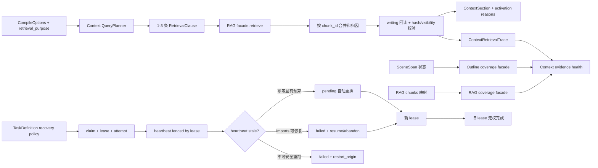

# P1 运行盲区收敛实施计划与验收标准

> 日期：2026-07-12  
> 上游审计：[`2026-07-11-模块能力与跨模块需求分析.md`](../../audit/2026-07-11-模块能力与跨模块需求分析.md)  
> P0 完成证据：[`2026-07-12-P0能力闭环完成审计.md`](../../audit/2026-07-12-P0能力闭环完成审计.md)  
> 状态：已实施；验收结果与放宽项见 `docs/audit/2026-07-12-P1运行盲区收敛完成审计.md`
> 范围：P1.1 Scene/证据覆盖遥测、P1.2 context 确定性查询计划、P1.3 任务 stale 闭环

## 0. 执行摘要

P0 已经完成配置消费、语义评测基础设施和统一测试入口的首轮闭环。P1 不再增加新的业务模块，而是让三个已经存在、但运行时仍不可解释或不完全收敛的 seam 形成闭环：

1. **知道证据为什么缺失**：把 SceneSpan、RAG 映射、context 候选剔除和安全空结果按 `novel_id + content_mode` 变成可持久化、可聚合、可定位的诊断数据；
2. **知道为什么搜这些内容**：context 不再把任意 `task` 文本原样当作唯一 RAG query，而是生成有版本、有限条数、带硬边界和 activation reason 的确定性查询计划；
3. **知道任务是否真的还活着，以及下一步能做什么**：用 lease、attempt 和恢复策略统一普通任务、深度导入和 context snapshot 的 stale 语义，并让前端只展示后端明确授权的恢复动作。

本计划的核心设计决策如下：

- 不引入 Prometheus、Redis、Celery、新向量库或自治 Agent；遥测落在现有 PostgreSQL，聚合由模块 facade/API 提供。
- 不新增第六种任务状态；继续使用 `pending / running / done / failed / cancelled`。stale 是失败原因和恢复能力，不是新的状态枚举。
- 不让查询 planner 调用 LLM，也不在 RAG 内解析业务意图。planner 由 `context` 拥有，RAG 继续只执行单条受控检索。
- 不把 coverage 当语义精度。Scene 边界 P/R/F1、RAG P@5/MRR 等继续由 P0 eval 体系衡量；P1 遥测只回答运行覆盖、过滤原因和安全边界是否正确。
- stale 后不再对所有普通任务无条件自动改回 `pending`。只有声明为幂等且未耗尽 attempt 的任务才自动重排；其他任务 fail closed 或走已有 imports 恢复入口。

## 1. 当前代码事实与问题定义

### 1.1 P1.1 当前事实

- `SceneSpan.mapping_status` 已有 `exact / reanchored / chapter_only / unresolved`，但没有按项目和正文模式聚合的稳定 facade/API。
- RAG chunk 已有 `scene_id / scene_span_id / source_id / source_content_hash`，索引时只接受 `exact/reanchored` span；当前 `get_index_status()` 不返回映射分母、正确映射数或失效映射数。
- `/api/rag/metrics` 来自进程内 `RagMetrics` 单例：重启即清零，不能按 `novel_id`、`content_mode` 或 consumer 区分，也不能解释某次 context 编译为什么返回空证据。
- `RagChunksLoader` 会重新读取 writing 正文并校验 hash，但目前只把原因折叠成两条 warning：版本不匹配或原文引用失效。stale、可见性拒绝、范围错误、读取错误没有独立计数。
- character/reader 场景可能因为安全边界正确地返回空证据，但当前无法区分“没有召回”“全部 stale”“全部越过可见截止”“严格 Scene 映射缺失”。

### 1.2 P1.2 当前事实

- `RagChunksLoader.load()` 直接执行 `query=options.task`。
- `CompileOptions` 已经拥有 Scene、章节、entity、character、可见截止和 content mode，但这些字段只作为单次检索过滤参数，没有形成可审计的 query plan。
- `ContextSection.activation_reason` 已存在，前端也会展示，但 RAG section 目前固定写成“RAG 检索命中”，无法说明是当前 Scene、实体焦点、剧情线还是任务目标触发了证据。
- RAG facade 的单查询接口已能接收 entity/character/thread/chapter/scene/visibility 等硬过滤，因此 P1.2 不需要扩张 RAG 的领域职责。

### 1.3 P1.3 当前事实

- `async_tasks` 有 `heartbeat_at`，但没有 lease、attempt、最大尝试次数或恢复策略。
- worker stale scanner 当前把所有非 `deep_import` stale 任务直接改回 `pending`；这会把可重复生成 candidate 或带业务写入的任务也视为可安全重跑。
- stale deep import 保持 `status=running`，只在 `meta/result` 写入 `recovery_required=true`；UI 虽能出现继续/放弃按钮，但状态本身仍表示“运行中”。
- stale scanner 的普通任务更新没有租约 fencing。旧 worker 如果稍后恢复，仍可能把已经重排、取消或恢复的任务写成 `done/failed`。
- heartbeat `UPDATE` 只按 task ID，不校验 `status/lease`；取消 running task 后，原 handler 仍可继续执行，最终状态也可能被覆盖。
- `context_snapshots` 的 stale 判断使用 `created_at`，没有利用拥有它的 task heartbeat。长任务健康运行超过 snapshot timeout 时可能被误判；反过来，task 已终止但 snapshot 仍 running 也不会立即收敛。
- 通用 `workflowProgress` 只理解五种状态和 terminal；imports 有专用恢复 UI，但其他任务没有后端驱动的 `retry/resume/restart` action contract。

## 2. 目标、非目标与完成定义

### 2.1 总目标

P1 完成时，系统必须能回答下面三个问题，并能用自动化测试证明答案：

1. 某个项目某种正文模式下，SceneSpan 和 RAG Scene 映射到底覆盖了多少，哪些是不可精确定位？
2. 某次 context 编译发出了哪些受控 query、每条 query 为什么存在、哪些候选在哪一层被丢弃？
3. 某个 running task 是健康、stale、已自动重排、需用户恢复还是只能从来源模块重启；旧 worker 是否仍有资格提交结果？

### 2.2 非目标

- 不在本 P1 修复 P0 eval 已发现的 Scene 边界 F1、RAG P@5/MRR、World recall/pollution 或 Outline evidence unavailable；这些是独立质量改进项。
- 不启用默认关闭的 RAG reranker，除非同一评测集证明收益且无安全回归。
- 不把 task/result/raw prompt/正文或完整 query 文本写入新的遥测表。
- 不实现通用工作流引擎、任务 DAG 或 exactly-once 业务事务。
- 不改变 AI 输出的 candidate/确认/采用语义。
- 不为前端引入新框架、OpenAPI codegen 或强制类型检查器。

### 2.3 P1 完成定义

- 三个子项都具备：稳定数据定义、实现入口、单元/集成/E2E 测试、运行诊断 API、文档和回滚方式。
- P1.1 和 P1.2 使用同一 retrieval trace，不创建两套互相漂移的统计。
- P1.3 的 stale 状态转换全部由后端生命周期 contract 驱动；前端不从 heartbeat 时间或 task type 自行猜动作。
- 所有新增查询和任务生命周期数据严格按 `novel_id` 隔离。
- 全部 wire 变更为加性字段或新端点；现有调用方在不传新字段时仍可运行。

## 3. 受影响模块、稳定接口与契约风险

| 层/模块 | 变更职责 | 稳定接口 | 风险等级 |
|---|---|---|---|
| `context` | query planner、retrieval trace、证据健康聚合、snapshot 对账 | 扩展 `CompileOptions`；新增 health facade/API；现有 compile/confirm 保持兼容 | 高 |
| `rag` | 提供 chunk 映射覆盖聚合；单查询接口保持执行器定位 | 新增只读 coverage facade；`retrieve()` 不改必需参数 | 中 |
| `outline` | 提供 SceneSpan 覆盖聚合 | 新增只读 coverage facade；不改变 Scene/Span 写入 contract | 中 |
| `writing` | 仍是 source/hash 事实源 | 复用现有 manuscript source facade | 低 |
| `infrastructure/tasks` | task definition、lease、attempt、stale transition、action contract | 扩展 `task_handler/enqueue_task` 和 task status response | 高 |
| `imports` | 适配 failed+recoverable 语义，保留继续/放弃 | 现有 `/deep/resume`、`/deep/abandon` 路径不改 | 高 |
| 其他任务生产模块 | 显式声明 recovery policy | 只改注册元数据和测试，不改业务 HTTP 请求 | 中 |
| `frontend-console` | 统一任务恢复动作与 evidence health 展示 | 消费加性字段；旧响应有兼容 fallback | 中 |
| 数据库 | 新增 retrieval trace 表；扩展 async_tasks lifecycle 字段 | demo 阶段允许重建开发库 | 高 |

### 3.1 API/schema/wire 风险

计划中的 HTTP 变化：

- 新增 `GET /api/context/evidence-health`；
- 新增 `GET /api/context/retrieval-traces`；
- 新增受策略限制的 `POST /api/tasks/{task_id}/retry`；
- `TaskStatusResponse` 加性返回 `heartbeat_at / attempt / max_attempts / stale / lifecycle / available_actions`；
- context section 加性返回 `retrieval_metadata`，不修改已有 `activation_reason/sources`；
- `ContextSelectionRequest` 加性接受 `retrieval_purpose`，默认 `generic_context`。

不修改现有 URL、必需请求字段和已有响应字段语义。前端 registry、API wrapper 测试和 E2E mock 必须同步。

### 3.2 ADR 判断

本计划不改变默认技术栈，也不引入新基础设施，因此实施前不需要新 ADR。若实施中决定引入外部指标系统、新任务状态、跨进程消息总线或通用工作流引擎，必须停止并走用户确认/ADR。

## 4. 目标架构



## 5. 共享定义与指标口径

### 5.1 coverage 不是 precision

P1 使用以下术语，不能与 P0 的语义评测指标混用：

- `precise_span_count`：`mapping_status in {exact, reanchored}` 的 active SceneSpan 数；
- `imprecise_span_count`：`chapter_only + unresolved`；
- `precise_span_rate`：`precise / all_active_spans`，只表示定位状态；
- `expected_overlap_chunk_count`：与同 novel、同 content mode、同 source/hash 的 precise span 发生字符区间重叠的 RAG chunk 数；
- `valid_span_mapped_chunk_count`：上述 chunk 中，`scene_span_id/scene_id` 指向正确 span/Scene 的数量；
- `eligible_mapping_rate`：`valid / expected_overlap`；
- `overall_span_mapping_rate`：全部 chapter chunks 中带 span ID 的比例，只作信息展示，不作阻断门禁；
- `source_invalid_drop_count`：RAG candidate 因 source ID/hash/range 与当前 writing 事实源不一致而剔除；
- `visibility_drop_count`：候选越过 reader/character 截止位置而剔除；
- `safe_empty_reason`：零条 hydrated evidence 的确定性分类。

### 5.2 drop reason 枚举

首版固定枚举，禁止在调用点自由写字符串：

| reason | 含义 |
|---|---|
| `source_missing` | 当前正文视图没有对应 source |
| `source_id_mismatch` | source ID 不一致 |
| `source_hash_mismatch` | source hash 已变化 |
| `invalid_range` | offset 缺失、越界或顺序错误 |
| `visibility_denied` | 越过 reader/character 可见截止 |
| `read_failed` | 稳定 source ref 构建或回读失败 |
| `duplicate_candidate` | 多 query 命中同一 chunk，被合并 |
| `rank_budget` | 合并后超过最终 top_k |
| `strict_scene_unmapped` | 严格 Scene 模式下无可用映射 |

### 5.3 safe empty reason 枚举

- `no_query_clause`
- `no_retrieval_match`
- `all_source_invalid`
- `all_visibility_filtered`
- `strict_scene_unmapped`
- `retrieval_degraded_empty`
- `mixed_filtered_empty`

每次返回空 RAG evidence 时必须且只能有一个 primary reason，可附加多个 drop counts。

## 6. P1.1：Scene/证据覆盖遥测

### 6.1 数据所有权

采用“各模块计算自己的事实，context 聚合消费者视角”的分工：

- `outline` 计算 Scene/SceneSpan coverage，不读取 RAG 内部表；
- `rag` 计算 chunk/Scene/Span mapping coverage，不读取 context 表；为了验证 span 引用，可通过 outline 稳定 facade 获取精确 span 投影，或由 context 聚合层交叉核对；
- `context` 持久化每次 context RAG 使用的 trace，并组合 outline/rag 的只读 summary；
- `writing` 继续提供当前 source ID/hash，不新增第二事实源。

### 6.2 新增持久化模型

在 `context` 新增 `context_retrieval_traces`。每次 `RagChunksLoader` 执行，无论成功、空结果还是降级，都写一条聚合 trace。

建议字段：

| 字段 | 说明 |
|---|---|
| `id` | UUID |
| `novel_id` | FK + index，强制隔离 |
| `content_mode` | canonical/working |
| `consumer_action` | 如 writing.generate；未知时 generic |
| `retrieval_purpose` | planner 的受控 purpose |
| `scene_id/chapter_index` | 可空定位维度 |
| `reveal_mode` | author/reader/character 归一值 |
| `plan_version/plan_hash` | 可重放版本和脱敏 hash |
| `clause_summaries` | clause ID、reason、过滤器是否存在、query hash/长度；不存 raw query |
| `candidate_count/unique_count/hydrated_count` | 分层数量 |
| `drop_counts` | 固定 reason -> count |
| `safe_empty_reason` | 非空时必有 |
| `degraded/warnings` | warning code，不存 provider 原始错误全文 |
| `latency_metadata` | planner/retrieve/rehydrate/total ms |
| `created_at` | 聚合窗口依据 |

保留策略：默认保留 30 天；maintenance 只删 trace，不碰 confirmations、snapshots 或 evidence links。首版不保存 chunk text、task 原文、prompt、API Key、完整 Base URL、raw LLM output。

### 6.3 coverage facade

新增稳定只读入口：

```python
# modules.outline.facade
async def get_scene_span_coverage(
    db, novel_id: str, *, content_mode: str
) -> SceneSpanCoverageContract: ...

# modules.rag.facade
async def get_scene_mapping_coverage(
    db, novel_id: str, *, content_mode: str
) -> RagSceneMappingCoverageContract: ...

# modules.context.facade
async def get_evidence_health(
    db, novel_id: str, *, content_mode: str, window_hours: int = 24
) -> EvidenceHealthContract: ...
```

`EvidenceHealthContract` 组合以下内容：

- Scene 总数、无 span Scene 数；
- span 四状态数量和 precise rate；
- RAG chapter chunk 总数、scene/span mapped 数；
- expected overlap、valid mapping、dangling/wrong-source mapping；
- 最近窗口 context traces、drop counts、safe-empty distribution、degraded rate；
- `health_state = healthy / degraded / insufficient_data` 和 machine-readable reasons。

`query_count=0` 必须返回 `insufficient_data`，不得显示 0% 失败或 100% 成功。

### 6.4 实施任务

#### Task 1.1：冻结口径和 SQL 对照 fixture

- 构造同一 novel 下 canonical/working 两套 source；
- 覆盖 exact、reanchored、chapter_only、unresolved；
- 覆盖正确映射、无映射、dangling span、错误 source hash、跨 novel 诱饵；
- 先写 repository/facade contract tests，手算期望分母和分子。

#### Task 1.2：Outline/RAG coverage 深模块

- 在各自 repository/service 中做聚合，不在 API/facade 写业务 SQL；
- 所有查询同时限定 novel、content mode 和 active status；
- RAG mapping 正确性必须验证 `scene_id + scene_span_id + source_id + source_content_hash + offset overlap`；
- 避免按每个 chunk 循环查询 span，使用批量投影/聚合查询。

#### Task 1.3：Context retrieval trace

- 给 bundle 增加内部 `retrieval_trace`，不把统计塞进 warning 文本；
- `_rehydrate_chunks()` 返回 hydrated chunks 和结构化 drop decisions；
- 在 loader 的 `finally` 路径写 trace，检索异常也记录 degraded/empty；生产 trace writer 使用独立短事务和注入的 session factory，不能在业务 session 内 `commit()`，也不能因调用方回滚而静默丢失失败诊断；
- trace 写入失败只能产生日志和 warning code，不能阻断正文生成；novel 隔离或 schema 错误除外，必须 fail closed。

#### Task 1.4：健康 API 与前端入口

- 新增 evidence health 和 trace list API；
- 列表只返回摘要，不返回正文/query；
- RAG 状态页或生成中心增加“证据健康”只读卡片：Scene 精确定位、RAG 映射、最近 safe-empty/drop；
- `insufficient_data` 显示“暂无运行样本”，不显示绿色通过。

#### Task 1.5：保留与维护

- 在 context maintenance 增加 trace retention，默认 dry-run；
- 按 `novel_id + created_at` 建索引；
- 增加每项目硬上限，避免高频 compile 无界增长。

### 6.5 P1.1 验收标准

#### 正确性门禁

- fixture 中四种 span 状态与 SQL 手算值完全一致；
- canonical/working 互不混入，跨 novel 诱饵计数为 0；
- `eligible_mapping_rate` 分母只包含与 precise span 真正重叠的 chunk；
- dangling/wrong-source mapping 被单独计数，不得算作 valid；
- 每次 RAG loader 运行恰好产生一条 trace，包括 0 命中和异常路径；
- `candidate >= unique >= hydrated`，所有减少量能由 duplicate、drop 和 rank budget 对账；
- hydrated=0 时 `safe_empty_reason` 非空且属于固定枚举；
- source hash 不一致和越过可见截止的 chunk 永不进入 context section。

#### 初始健康阈值

这些阈值是运行健康门禁，不是语义精度声明：

- `dangling_mapping_count = 0`；
- `wrong_source_mapping_count = 0`；
- 有 expected overlap 时，`eligible_mapping_rate >= 0.98`；
- reader/character `visibility_leakage_count = 0`；
- 所有 safe empty 都有原因，`unclassified_empty_count = 0`；
- trace 持久化失败率为 0；
- 无运行样本时状态必须是 `insufficient_data`。

现有项目若未达 0.98，P1 仍可交付，但 health 必须显示 degraded 和明确缺口；不得为了变绿而缩小分母。

#### 性能与隐私

- coverage summary 在 10k chunks / 5k spans fixture 上不出现 N+1；
- trace 写入不增加外部 LLM/embedding 调用；
- 本地 benchmark 中 context 编译新增 DB 开销 p95 不超过 20ms 或基线的 10%（取较宽者）；
- 数据库和 API 响应中不出现 raw task、raw query、正文、prompt、Key 或完整 provider URL。

## 7. P1.2：Context 确定性查询计划

### 7.1 新 contract

在 context 内定义，不向 RAG 暴露业务枚举：

```python
@dataclass(frozen=True)
class RetrievalClause:
    clause_id: str
    query_text: str
    mode: str
    top_k: int
    reason_code: str
    entity_ids: list[str] | None = None
    character_ids: list[str] | None = None
    thread_ids: list[str] | None = None
    chapter_index: int | None = None
    scene_id: str | None = None
    strict_scene_filter: bool = False

@dataclass(frozen=True)
class RetrievalQueryPlan:
    version: str
    purpose: str
    clauses: list[RetrievalClause]
    visible_until_chapter: int | None
    visible_until_scene_id: str | None
    visible_until_offset: int | None
    final_top_k: int
    plan_hash: str
```

`CompileOptions` 新增：

- `consumer_action: str | None`：例如 `writing.generate`；内部确认流程直接使用 action；
- `retrieval_purpose: Literal[...] = "generic_context"`；
- `thread_ids: list[str] | None`，补齐 RAG 已有过滤能力。

HTTP request 只暴露 `retrieval_purpose` 和 `thread_ids`；`consumer_action` 由后端 action/调用方确定，不能由普通前端请求伪造。

### 7.2 purpose 与规则矩阵

首版 purpose 固定如下：

| purpose | 主锚点 | clause 上限 | 规则 |
|---|---|---:|---|
| `writing_generation` | 当前 Scene + POV character | 3 | Scene 精确 clause 优先；实体/人物 clause；短任务意图 fallback |
| `conflict_review` | 当前章/Scene + 冲突相关实体 | 3 | precision-first；不以宽泛 task 扩大未来范围 |
| `outline_generation` | 章节范围 + thread/entity | 3 | 允许范围内较高 recall；visible cutoff 必须是范围结束章 |
| `cross_chapter_detection` | 相邻章/Scene | 2 | 只查目标章范围和相邻 Scene，不做全书宽搜 |
| `world_fusion` | entity/alias IDs | 2 | metadata-first；无实体 ID 时不伪造融合证据 |
| `import_scene_activation` | 当前 Scene + 前序邻居 | 2 | 当前 Scene 和前序证据；未来 Scene 硬排除 |
| `reader_context` | reader cutoff | 2 | 所有 clause 复制可见性硬边界；不得 author fallback |
| `character_context` | Scene + character knowledge | 2 | strict Scene；无映射时安全空，不退化为全章泄漏 |
| `manual_search` | 用户显式 query | 1 | 保留用户查询语义，仍应用 novel/visibility hard filters |
| `generic_context` | 已提供 ID/Scene + 短 task | 2 | 兼容旧调用；不允许只有空白 query 的宽搜 |

### 7.3 task 文本处理

planner 不做自然语言理解，只做确定性清理：

- Unicode/空白归一化；
- 删除已知 UI 模板前缀，如“请根据以下资料”“生成/检查/分析”，但保留专名和领域词；
- 最大 160 个字符；超长只保留首段和显式 quoted terms；
- 空文本不发 query-only clause；若有 Scene/entity 元数据则使用 metadata clause；若两者都没有则 `no_query_clause`；
- plan hash 使用归一化输入和过滤器；trace 只保存 hash、长度和 reason，不保存 raw query。

禁止用正则猜 entity ID、character ID 或章节范围；这些必须来自结构化 CompileOptions。

### 7.4 执行与合并

`RagChunksLoader` 按 plan 顺序执行 1–3 条 clause，每条仍调用现有 `modules.rag.facade.retrieve()`：

1. 每条 clause 复制同一个 `novel_id/content_mode/visible_until_*` 硬边界；
2. clause `top_k` 总预算不超过 `max(final_top_k * 2, final_top_k + 4)`；
3. 按 chunk ID 去重；
4. 用 deterministic reciprocal-rank fusion 合并，Scene 精确 clause 可配置固定优先级加成；
5. 同分时按 `chapter_index/chunk_index/id` 稳定排序；
6. 最终 top_k 前统一 writing 回读、hash 和 visibility 校验；
7. 每个 hydrated chunk 记录命中的 clause IDs 和 reason codes；
8. Context section 的 `activation_reason` 使用作者可读摘要，结构化细节进入加性的 `retrieval_metadata`。

不得把多个 clause 文本拼成一个超长 OR query，也不得让一个 clause 的无结果取消另一个 clause 的安全结果。

### 7.5 兼容策略

- 未传 `retrieval_purpose` 的旧 facade/API 调用进入 `generic_context`；
- confirmation recompile 从已保存 compile_options 重建同一 purpose；旧 confirmation 缺字段时默认 generic；
- `compile_structure_context()` 增加 keyword-only 可选参数，不改变现有位置参数；
- manual RAG 搜索页不经过 context planner，仍直接调用 RAG search；
- imports `prepare_import_context_activation()` 已有专用确定性路径，不在第一步强行改写；只把相同 reason/trace 口径接入，避免两套 Scene 安全语义。

### 7.6 实施任务

#### Task 2.1：Planner 纯函数与 fixture

- 新建 `services/retrieval_query_planner.py`；
- 输入只有 CompileOptions，输出 frozen plan；
- 覆盖十种 purpose、缺字段、超长 task、reader/character 和 working/canonical；
- snapshot test 固定 clause 数、过滤器、reason、plan hash。

#### Task 2.2：Loader 多 clause 执行器

- 依赖注入 planner 和 retrieve callable；
- 加入并发前先保持串行，确保容易归因和控制 embedding 调用数；
- 合并/去重/排序拆成纯函数；
- `_rehydrate_chunks` 返回结构化 decision，不吞掉所有异常类型。

#### Task 2.3：调用方 purpose 迁移

优先显式迁移：

1. writing generate / conflict review confirmation；
2. outline generation / cross-chapter；
3. world fusion；
4. imports Scene activation；
5. reader/character 编译入口。

每个调用方只传 purpose 和已有结构化 IDs，不 import planner 实现。

#### Task 2.4：作者可见解释

- `retrieval_evidence_packs` 显示“当前 Scene”“相关人物/对象”“任务意图”等 activation reason；
- sources 可显示命中原因，但不显示 query hash、内部分数或原始 task；
- 空 evidence 在 warnings/health 中显示安全原因，不创建空 section 冒充命中。

#### Task 2.5：评测接入

- 从 Pilot v1.1 RAG case 派生同 case ID 的 planner input projection，不复制或修改 gold；
- 增加 consumer-purpose strata：writing、reader/character、outline、fusion；
- 对比 `task-direct` 历史策略和 `planner-v1`，报告 delta；
- RAG runner 继续直接测检索器；新增 context-planner runner 测“计划 + 合并 + rehydrate”，不能用后者替代前者。

### 7.7 P1.2 验收标准

#### 确定性与安全

- 同一 CompileOptions 连续生成 plan 的序列化结果和 hash 完全一致；
- clause 数不超过 3，候选预算不越界；
- 所有 clause 都带相同 novel/content_mode/visibility hard filters；
- reader/character 的未来章节、同章越界 offset 泄漏数为 0；
- character strict Scene 无映射时返回 `strict_scene_unmapped`，不得退回全章宽搜；
- plan/trace/snapshot 不保存 raw task/query/正文；
- confirmation recompile 保持 purpose 和 plan version，可解释版本变化。

#### 召回与精度门禁

在现有 accepted RAG gold 上，planner-v1 相对 task-direct：

- visibility leakage 必须保持 0；
- no-answer false-positive rate 不得高于基线，目标降至 `<= 0.20`；未达目标时 planner 可合并，但不得宣称 RAG 质量达标；
- context hydrated P@5 不得低于 direct baseline；
- writing/conflict/fusion precision-first strata 的 P@5 至少提高 20% 相对值，或达到 0.80；
- R@10 相对下降不超过 5 个百分点；
- 每个返回 chunk 都有至少一个 clause reason；
- empty case 的 primary reason 分类率 100%。

这里的 `task-direct baseline` 必须先由新增的 context-planner runner 在同一
dataset、同一 index、同一 SUT profile 上生成；不能直接拿 P0 的 RAG facade
P@5 充当 hydrated context baseline。

P0 corrected RAG 基线的 P@5=0.1656、MRR=0.6098、R@10=0.8996、no-answer FP=1.0 仍是检索器事实。P1.2 的 context planner 指标必须单列，不能覆盖或改名冒充 RAG 基线。

#### 性能

- planner 本身 p95 < 2ms；
- 默认 generic/writing 路径最多 2 次 retrieve，只有显式三锚点 purpose 才允许 3 次；
- context 全链路 p95 不超过 task-direct 基线的 1.8 倍；
- 多 clause 引入的 embedding 调用数必须在 trace 中可见。

## 8. P1.3：任务 stale 闭环

### 8.1 状态语义

保持五种状态，统一解释：

| 状态 | 含义 |
|---|---|
| `pending` | 当前没有 worker lease，等待领取 |
| `running` | 必须存在有效 lease，且 heartbeat 未超时 |
| `done` | 持有当前 lease 的 worker 成功完成 |
| `failed` | 执行失败或 stale 已收敛；是否可恢复由 lifecycle contract 决定 |
| `cancelled` | 用户或系统明确终止，不再自动重排 |

因此，stale deep import 必须从 `running` 转为 `failed + recovery_required`；恢复时再转 `pending`。不再使用“状态仍 running，但 UI 把它当中断”的双重语义。

### 8.2 TaskDefinition 与恢复策略

扩展 registry，使 handler 注册同时声明：

```python
@task_handler(
    "rag_reindex_novel",
    recovery_policy="auto_requeue",
    max_attempts=2,
)
async def handle_rag_reindex(...): ...
```

受控策略：

- `auto_requeue`：仅幂等派生任务，stale 且 attempt 未耗尽时自动回 pending；
- `manual_resume`：有 checkpoint/rollback 的 imports 流程，stale 后 failed，由已有 resume/abandon API 处理；
- `restart_origin`：不能证明安全重跑，stale 后 failed，前端引导回来源模块重新发起；
- `never_retry`：安全/参数错误等明确不可重试任务。

策略和 `max_attempts` 在 enqueue 时物化进 task 字段，避免部署新代码后悄悄改变已排队任务语义。

首版任务分类：

| 策略 | task types |
|---|---|
| `auto_requeue`, max 2 | `rag_index_chapter`、`rag_reindex_novel`、`rag_retry_embeddings`、`world_bible_projection_refresh` |
| `manual_resume` | `deep_import`、`scene_auto_extraction`、`world_object_auto_extraction`、`plot_structure_auto_extraction` |
| `restart_origin` | writing、outline、world 其余生成/抽取任务、`publish_chapter`、`smart_dedup_scan` |
| `never_retry` | 运行时发现无 handler、novel/auth/schema 不匹配等系统拒绝路径 |

如果某任务要从 `restart_origin` 升级为 `auto_requeue`，必须先用测试证明重复执行不会重复发布、重复采用、跨 novel 写入或产生不可回滚资产。

### 8.3 数据模型

扩展 `async_tasks`：

| 字段 | 说明 |
|---|---|
| `attempt` | 已领取次数，首次 claim 为 1 |
| `max_attempts` | 冻结的上限 |
| `recovery_policy` | 上述四值 |
| `lease_id` | 每次 claim 新 UUID；pending/terminal 为空 |
| `stale_detected_at` | 最近一次 stale 识别时间 |
| `transition_reason` | 受控 reason code，如 heartbeat_timeout |

`result.lifecycle` 保留作者可读摘要和历史 transitions；不把完整异常、SQL、Key 或配置 secret 写入。

### 8.4 lease fencing

新增 task lifecycle repository/service，API 和 worker 不直接拼状态更新：

1. claim 使用 `FOR UPDATE SKIP LOCKED`，设置 `running + lease_id + attempt+1 + heartbeat_at`；
2. heartbeat 使用 `WHERE id=:id AND status='running' AND lease_id=:lease`；
3. complete/fail/cancel 同样校验 lease 或显式用户 transition；
4. stale scanner 清空旧 lease 后，旧 worker 的 heartbeat/finalize rowcount 必须为 0；
5. 当前进程检测 lease lost 后取消对应 runner coroutine；
6. 旧 worker 的最终结果只能记安全日志，不能覆盖新 attempt 的状态/result；
7. running cancel 清空 lease，使下一次 heartbeat 触发协作取消；
8. stale 条件覆盖 `heartbeat_at < cutoff` 以及 `heartbeat_at is null and started_at < cutoff`。

这不是 exactly-once 业务事务。自动重排只允许幂等任务；manual resume 流程继续依赖现有 checkpoint/provenance/软回滚。

### 8.5 stale 转换表

| 当前 | 条件 | 目标 | action |
|---|---|---|---|
| running | heartbeat fresh | running | none |
| running | stale + auto_requeue + attempt < max | pending | 自动新 attempt |
| running | stale + auto_requeue + attempt 已耗尽 | failed | restart_origin |
| running | stale + manual_resume | failed | resume / abandon |
| running | stale + restart_origin | failed | restart_origin |
| pending | 用户取消 | cancelled | none |
| running | 用户取消 | cancelled + lease cleared | cooperative cancel |
| failed + manual_resume | 用户继续且校验通过 | pending | resume |
| failed + auto_requeue | 后端允许手动 retry 且有预算 | pending | retry |
| done/cancelled | 任意 retry/resume | 409 | none |

### 8.6 Context snapshot 对账

snapshot stale 不再只看 `created_at`：

- 有 `task_id` 且 task running/heartbeat fresh：snapshot 即使运行很久也不算 stale；
- task failed/cancelled/done，但 snapshot 仍 running：maintenance 将其关闭为 failed，`error_kind=owner_task_terminal`；
- task 因 heartbeat timeout stale：snapshot 关闭为 failed，`error_kind=owner_task_stale`；
- task auto requeue 后，新 attempt 必须新建 snapshot；旧 snapshot 保留 failed 和 attempt，不复用；
- 无 task_id 的 snapshot 才使用 `updated_at/created_at + timeout`；
- health summary 分开统计 `stale_running`、`owner_terminal_orphan`、`owner_stale`，不混成一个数字。

context 可以依赖 infrastructure task lifecycle 的只读 contract；infrastructure 不反向 import context 模型。snapshot 对账由 context maintenance 和任务状态读取路径触发，不在 worker 底层写业务判断。

### 8.7 API 与前端 action contract

`TaskStatusResponse` 加性返回：

```json
{
  "heartbeat_at": "...",
  "attempt": 1,
  "max_attempts": 2,
  "stale": true,
  "lifecycle": {
    "reason": "heartbeat_timeout",
    "recovery_policy": "manual_resume",
    "recovery_required": true
  },
  "available_actions": ["resume", "abandon"]
}
```

action 只允许固定值：`cancel / retry / resume / abandon / restart_origin / dismiss`。后端负责决定集合；前端只映射按钮和文案。

- imports 的 `resume/abandon` 继续调用模块 API，不改为通用 task API；
- 通用 `/tasks/{id}/retry` 只接受 `available_actions` 包含 retry 的 failed task；
- `restart_origin` 只导航/提示，不直接复制旧 meta 重新入队；
- localStorage 中的 active workflow 在 failed+recoverable 时保留，在 terminal 且无待处理动作时清除；
- 轮询连续失败只表示“状态未知”，不得在前端伪造 task failed。

### 8.8 实施任务

#### Task 3.1：生命周期 contract 与迁移

- 新建 TaskDefinition/TaskLifecycleContract；
- 扩展 registry decorator，旧 `@task_handler("x")` 默认 `restart_origin/max_attempts=1`；
- 扩展 enqueue，从 registry 物化 policy；
- 扩展 ORM/schema 和 demo migration；
- 更新 infrastructure README 和数据库设计。

#### Task 3.2：Repository 原子转换

- 实现 claim/heartbeat/finalize/cancel/stale/retry 原子方法；
- 所有方法返回 transition result/rowcount；
- worker 不再调用 ORM `mark_done/mark_failed` 作为最终权威写入；
- 保留模型 helper 供测试/非 worker 兼容，但生产 worker 走 lifecycle service。

#### Task 3.3：stale scanner 策略化

- 单次扫描锁定符合条件的 running task；
- 依据冻结 policy 转换；
- 写 lifecycle transition history 和 reason；
- auto requeue 只增加 attempt 于下一次 claim，不在 scanner 内伪造 running；
- 连续扫描幂等，不重复追加同一 stale transition。

#### Task 3.4：Imports 适配

- `_get_recoverable_deep_import_task` 接受 `status=failed` 且 lifecycle/manual_resume；
- resume 清 recovery flags、finished/lease/stale reason，转 pending；
- abandon 保持二次确认和软清理；
- 恢复继续使用原 task ID、execution snapshot 和 checkpoints；
- 恢复后的 snapshot attempt 必须递增。

#### Task 3.5：Snapshot 对账

- infrastructure 提供只读 batch lifecycle contract，不暴露 ORM；
- context maintenance 批量加载 owner tasks，避免 N+1；
- health 和 maintenance 使用同一 evaluator；
- dry-run 返回按 reason 分类的 would-change 数量。

#### Task 3.6：通用 UI

- `normalizeTaskProgress()` 增加 stale/lifecycle/actions；
- `pollTaskProgress()` 网络失败进入 unknown/paused，可手动重试查询，不触发 onFailed；
- imports recovery UI 改为消费 action contract，同时兼容旧 flags 一个版本窗口；
- RAG/outline/world/writing 任务统一显示“自动重试第 2/2 次”“任务中断，请重新发起”等文案；
- 不提供后端未授权的按钮。

### 8.9 P1.3 验收标准

#### 生命周期正确性

- 任意 `running` task 都有非空 lease；pending/terminal lease 为空；
- claim 并发测试中同一 task 只能有一个 lease；
- stale scanner 连续运行两次不会重复 attempt、transition 或恢复标记；
- 旧 lease 的 heartbeat、done、failed 更新 rowcount=0，不能覆盖新 attempt；
- running cancel 后旧 worker 最终不能把 task 改回 done/failed；
- heartbeat null 且 started 超时的 task 能被识别；
- auto_requeue 只发生在白名单幂等任务，最多一次自动恢复；
- restart_origin 任务 stale 后为 failed，不自动重复生成/写入；
- imports stale 后为 failed+resume/abandon，继续后为 pending，放弃后为 cancelled；
- done/cancelled 的 retry/resume 返回 409；
- 所有状态 API 查询继续按 novel_id 隔离。

#### Snapshot 闭环

- 健康长任务不会因 snapshot created_at 过旧而被误杀；
- owner task terminal/stale 后，running snapshot 在 maintenance 后全部闭合；
- auto requeue 的旧/new attempt snapshot 可区分；
- dry-run 不修改数据库，execute 模式变更数与预览一致；
- snapshot health 不返回 prompt、正文或完整 result refs。

#### 前端与 E2E

- deep import stale：显示继续/放弃，状态不再假装正常运行；
- RAG reindex stale：先显示自动重试 attempt，耗尽后显示失败；
- writing/outline stale：显示“重新发起”，不自动复制旧请求；
- running cancel：按钮消失并显示 cancelled，后台旧完成不会反跳 done；
- 网络轮询失败：显示状态未知/重试查询，不显示业务失败；
- 刷新页面后 action 和进度由后端恢复，不依赖旧 localStorage flags 猜测。

## 9. 实施顺序与 PR 切分

建议分 6 个可独立复核的变更集；不要把三个 P1 一次性塞进一个不可审查的大提交。

### PR 1：P1.1 coverage 只读事实层

- Outline/RAG coverage contracts、services、facades、tests；
- 不加 trace，不改查询行为；
- 验证聚合口径和 novel/content mode 隔离。

### PR 2：P1.1 retrieval trace 与 health API

- ContextRetrievalTrace 模型/仓储/保留策略；
- loader 结构化 drop decisions；
- health 聚合和只读前端卡片。

### PR 3：P1.2 planner 纯函数和兼容接入

- planner contract/fixtures；
- generic_context 兼容路径；
- 多 clause 执行、合并、activation metadata；
- 不立即迁移所有调用方。

### PR 4：P1.2 consumer purpose 迁移与评测

- writing/outline/world/imports purpose；
- context-planner eval runner 和 baseline delta report；
- 达不到安全门禁则回滚到 generic planner，不回滚 trace。

### PR 5：P1.3 task lifecycle backend

- TaskDefinition、字段、lease fencing、策略化 stale scanner；
- imports failed+resume 适配；
- snapshot owner 对账；
- 先完成 backend contract tests，再改 UI。

### PR 6：P1.3 通用前端动作与 E2E

- workflowProgress/action rendering；
- imports 兼容收口；
- RAG/outline/world/writing E2E；
- 删除一个版本窗口后不再使用的前端 stale 推断。

依赖关系：PR1 → PR2 → PR3 → PR4；PR5 可在 PR2 后并行，但 PR6 必须基于 PR5 的稳定 response contract。

## 10. 文件级计划

预计新增：

- `backend/modules/context/services/retrieval_query_planner.py`
- `backend/modules/context/services/retrieval_trace_service.py`
- `backend/modules/context/services/evidence_health_service.py`
- `backend/infrastructure/tasks/contracts.py`
- `backend/infrastructure/tasks/lifecycle.py`
- 对应 module/backend/frontend tests

预计修改：

- context：`contracts.py`、`models.py`、`repositories.py`、`schemas.py`、`facade.py`、`api.py`、`services/loaders/rag_chunks_loader.py`、`services/context_compiler.py`、`services/snapshot_service.py`、README；
- rag：`contracts.py`、`repositories.py`、`facade.py`、README；
- outline：`contracts.py`、`repositories.py`、`facade.py`、README；
- tasks：`models.py`、`registry.py`、`enqueuer.py`、`worker.py`、`api.py`、README；
- imports：`orchestrator.py`、`facade.py`、`api.py` 和恢复测试；
- 所有 `tasks.py`：声明 recovery policy；
- frontend：`shared/workflowProgress.js`、`views/writing/deepImportRecovery.js`、RAG/生成中心健康展示和对应 Vitest/E2E；
- 数据库/文档：Alembic demo schema、`docs/01_数据库设计.md`、`docs/modules/08_rag.md`、`09_context.md`、`12_infrastructure.md`、`14_frontend.md`。

如果实施时发现新增 facade 只是单调用方 pass-through，应做 deletion test：聚合/状态机留在 service，facade 只保留真实跨模块稳定入口。

## 11. 验证矩阵

### 11.1 定向测试

```bash
cd backend
pytest modules/outline/tests -q
pytest modules/rag/tests -q
pytest modules/context/tests -q
pytest infrastructure/tasks tests/unit/test_infra_tasks.py -q
pytest modules/imports/tests -q
```

### 11.2 跨模块和评测

```bash
make test-fast
make test-integration
make eval-fast
```

新增显式验收命令建议：

```bash
make eval-context-planner DATASET_VERSION=pilot-v1.1 SUT_PROFILE=deepseek-v4-flash
```

planner 纯确定性部分不得依赖真实 LLM；只有沿用 RAG embedding/reranker 的现有 opt-in 路径才使用外部 provider。

### 11.3 前端和契约

```bash
make test-frontend
cd frontend-console && npx playwright test e2e/p1-lifecycle-health.spec.js e2e/deep-import.spec.js
cd frontend-console && npx playwright test e2e/deep-import-worker.spec.js
```

补充 task lifecycle chaos：worker A 领取 → heartbeat 停止 → worker B 扫描/重排 → worker A 恢复并尝试完成，最终必须只接受新 lease。

### 11.4 静态门禁

```bash
make prompt-contracts
make lint
make format
git diff --check
```

新增静态守卫：

- task handler 必须有显式或默认 recovery policy；
- `auto_requeue` 只允许审核过的白名单类型；
- context planner 之外不新增 `query=options.task`；
- 新 telemetry schema 禁止 raw query/task/text/prompt/key/url 字段；
- 业务模块不直接 import 其他模块 models/repositories/services。

## 12. 发布、回滚与兼容窗口

### 12.1 发布顺序

1. 先部署 schema 和只读 coverage；
2. 再启用 trace 写入，观察 24 小时数据量和写入开销；
3. planner 先 shadow：生成 plan/trace，但仍执行 task-direct；
4. 对比报告通过后按 purpose 开关逐类启用；
5. task lifecycle backend 部署后再发布前端 actions；
6. 一个兼容窗口后删除前端对旧 imports flags 的主逻辑，只保留防御 fallback。

项目当前是 demo 阶段，可以重建开发数据库；如果工作区已有需要保留的人工测试数据，执行前仍应导出必要项目数据，不把 demo 规则扩展到真实用户数据。

### 12.2 功能开关

建议使用现有配置体系的内部布尔开关，不新增外部服务：

- `CONTEXT_QUERY_PLANNER_ENABLED`
- `CONTEXT_RETRIEVAL_TRACE_ENABLED`
- `TASK_LEASE_FENCING_ENABLED`

最终完成后 lease fencing 不应长期可关闭；开关只用于迁移窗口。planner 可按 purpose 回退到 `generic_context`，但 visibility/hash 校验永远不可关闭。

### 12.3 回滚

- coverage/trace 是加性读写，可停止写入而不影响生成；
- planner 回滚到 task-direct 时保留 hard visibility 和 rehydrate 校验；
- lifecycle 回滚前必须先停止 worker，避免新旧 lease 语义并存；不能只回滚代码不处理 running tasks；
- schema 字段保留不会影响旧代码，但旧 worker 不理解 lease，禁止与新 worker 混跑。

## 13. 最终验收清单

### P1.1

- [x] SceneSpan 和 RAG mapping 按 novel/content mode 可查询
- [x] expected-overlap 分母、valid/dangling/wrong-source 可对账
- [x] context 每次检索有持久 trace，空结果有固定原因
- [x] evidence health 无样本时为 insufficient_data
- [x] 无 raw query/task/正文/secret 落盘

### P1.2

- [x] planner 无 LLM、确定性、最多 3 clause
- [x] 结构化 Scene/entity/thread/visibility 成为真实查询约束
- [x] 每个 evidence 有 activation reason
- [x] reader/character leakage 为 0
- [x] planner 指标与 RAG 检索器基线分开报告
- [x] 放宽口径下总体 precision/recall 不退化，单 strata 最大允许 1pp 差异
- [ ] 严格目标：no-answer `<=0.20`、全 precision-first strata `+20%` 或 `0.80`

### P1.3

- [x] running 必有 lease，旧 lease 不能 finalize
- [x] stale 不再对所有任务无条件自动重排
- [x] imports 使用 failed+resume/abandon，不再假 running
- [x] snapshot 与 owner task 生命周期对账
- [x] 前端动作完全由 available_actions 驱动（旧响应仅保留兼容 fallback）
- [x] 网络轮询失败不伪造业务失败
- [x] novel 隔离、取消和并发 lease 围栏测试通过

### 仓库级完成门禁

- [x] `make test-fast`
- [x] `make test-integration`
- [x] `make eval-fast`
- [x] context planner 正式报告落盘并标注 dataset/SUT/profile/hash
- [x] frontend Vitest 和 P1 指定 Playwright 通过
- [x] prompt contracts、Ruff lint/format、`git diff --check` 通过
- [x] 受影响 README、模块文档、数据库设计和 API contract tests 已同步

## 14. P1 之外的后续项

P1 完成后，以下 P0 实测失败仍需单独排期，不能被“遥测已上线”掩盖：

- RAG：P@5/MRR/no-answer FP 未达标；
- Scene：边界 P/R/F1 和 fallback rate 未达标；
- World：entity/alias recall、relation coverage、ordinary pollution 未达标，部分安全证据 unavailable；
- Outline：除未确认写入外，多项 case-level evidence 仍 unavailable。

推荐顺序是先用 P1.1/P1.2 找到真实运行缺口，再分别优化 Scene 边界、RAG abstention/precision、World relation/pollution 和 Outline preview evidence；不要重新合并成一个“总体准确率”。
