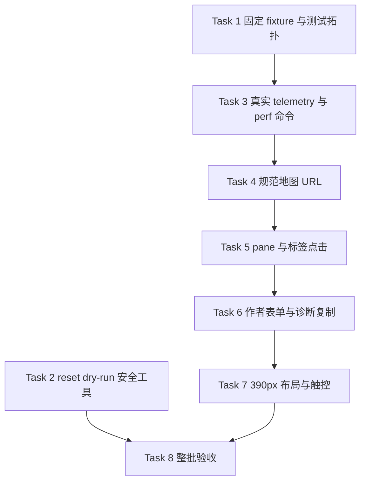

# 前端产品体验整改第一批实施计划

> 日期：2026-07-15
> 上游设计：[`2026-07-15-frontend-product-experience-remediation-design.md`](../specs/2026-07-15-frontend-product-experience-remediation-design.md)
> 状态：**Completed（2026-07-15 已实施并验收）**
> 批次边界：覆盖设计文档 Phase 0 的非破坏性安全/测量基线，以及 Phase 1 的现有交互缺陷；不进入项目收件箱、四类 proposal、导入闭环和性能优化。

## 1. 批次目标

第一批先建立可信的安全与测量基线，再清理不依赖新后端契约的现有作者路径缺陷：

1. 地图重置工具能安全地完成 dry-run、schema/引用/任务检查和备份恢复演练，但本批不提供正式删除入口。
2. 地图性能用例改为从真实页面实例读取公开 telemetry，使用固定 fixture 和真实输入，不再动态 import 另一个模块实例或直接循环 `_redraw()`。
3. 地图标签、聚合簇和下钻入口可由鼠标/触摸真实点击，Canvas 继续处理未被标签或控件消费的背景指针。
4. 所有地图入口都生成可刷新、可收藏、可前进/后退的规范 URL，不再只修改 `_activeMapId`。
5. 390px 下的世界书、Scene 列表、关键按钮和表单可用，复杂地图空间编辑显式转交桌面端。
6. 作者默认界面不再暴露 UUID、raw JSON 和内部枚举；诊断信息改为一次性、只读、脱敏复制。

本批完成后仍不宣称“适合真实作者长期使用”；该结论必须等收件箱、类型化导入、Fact 时间线和性能绝对预算全部通过。

## 2. 当前代码落点

| 问题 | 当前证据 | 第一批落点 |
|---|---|---|
| Canvas 遮挡标签 | `mapView.js` 把 Canvas 直接追加到容器，设置 `pointerEvents=auto` 和 `zIndex=400`；聚合簇没有 `data-action` | `mapView.js`、`styles.css`、Leaflet E2E stub、Vitest/Playwright |
| 地图入口不可恢复 | `mapWorkspaceView._openMap()` 修改内存状态后只调 `router.refresh()`；`_setViewMode()` 也不写 URL | `mapRouteContext.js`、`mapWorkspaceView.js`、`router.js` |
| 性能样本不可信 | `map.spec.js` 动态 import `mapView.js`，直接清空内部指标并循环 `_redraw()` | 公开页面 event/mark、固定 manifest、独立 perf spec/config |
| Scene 默认打开首项 | `_selectedSceneId()` / `_selectedSceneItem()` 回退到 `items[0]` | `sceneWorkbenchView.js` 及其 Vitest/Playwright |
| 390px 世界书头部拥挤 | `.world-bible-panel__header` 始终是水平 flex，没有窄屏专用规则 | `worldBibleView.js`、`styles.css`、`world-bible.spec.js` |
| 地图表单暴露技术细节 | `_showDynamicEditForm()` 可编辑 `time_anchor` / `spatial_anchor` / `source_ref` / `value_json` JSON 和来源证据 | `mapWorkspaceView.js`、新的诊断投影 helper、相关测试 |
| 地图测试拓扑漂移 | `test:e2e:map` 未覆盖 `map-path-mobile.spec.js`；`map-chaos.spec.js` 仍有 3 个 `skip` | `package.json`、Playwright 清单、实体回归用例 |

## 3. 影响、契约与风险

| 项目 | 第一批决定 |
|---|---|
| 影响模块 | `frontend-console`；`world/map` 仅增加开发管理工具，不改业务服务/API |
| 稳定接口 | 不新增或修改 contracts、facade 或 DI port |
| HTTP API 风险 | 无；本批不新增收件箱 API，不收紧 `MapObservationReviewUpdate` |
| 数据库/schema 风险 | 无 ORM/Alembic 变更；重置工具本批只能 dry-run/演练，不实施目标库删除 |
| 前端 wire 风险 | 不删除响应字段；新增的 `map:interactive` event 只是只读测量面；hash URL 规范化是有意的用户行为变更 |
| 安全风险 | 诊断复制只能使用 allowlist；不得包含 API Key、prompt、未脱敏 URL query 或跨 `novel_id` 信息 |
| ADR | 不需要；不更换 Vanilla JS/Leaflet，不改 MapFact 所有权 |
| 新依赖 | 无 |
| 需要用户再确认 | 只有未来正式清空 16 张 `map_*` 表时需要；本计划不授权该操作 |

来源字段的服务端只读强制、`expected_updated_at` CAS、confirm 行锁和 typed-only confirm 属于第二批。第一批只是停止前端展示/发送这些技术字段，不得把它宣称为已完成 API 安全收口。

## 4. 实施顺序



`Task 2` 可与纯前端任务分支开发；`Task 3–7` 会重叠修改 `mapView.js` / `mapWorkspaceView.js` / `styles.css`，应串行合并，不安排不同 Agent 同时修改这些文件。

## 5. 任务拆解

### Task 1：固定测试拓扑与确定性 fixture

**文件：**

- Modify: `frontend-console/package.json`
- Modify: `frontend-console/playwright.config.js`
- Add: `frontend-console/playwright.map-perf.config.js`
- Add: `frontend-console/e2e/helpers/fixtures/map-performance-manifest.json`
- Add: `frontend-console/e2e/helpers/map-performance-fixture.js`
- Add: `frontend-console/e2e/map-performance.spec.js`
- Modify: `frontend-console/e2e/map.spec.js`
- Modify: `frontend-console/e2e/map-chaos.spec.js`
- Modify: `frontend-console/e2e/map-path-mobile.spec.js`

- [x] 先为普通 24×18 地图和 200×200 混合压力地图建立固定 manifest，形状至少包含 tile、location binding、marker、territory、layer、label、Fact 和 candidate 的数量与语义 payload。
- [x] fixture helper 只通过现有 API 建立测试数据；manifest 对排除数据库随机 UUID 的规范语义 payload 计算固定 checksum，并在测试开始前校验。
- [x] 把现有 200×200 用例从 `map.spec.js` 移入独立 perf spec；不允许使用开发库存量地图作为基线。
- [x] 新增 `test:e2e:map-perf`：Chromium 1280×720、workers=1、retries=0、`PW_REUSE_EXISTING_SERVER=0`，并要求显式的独立 PostgreSQL `DATABASE_URL`。
- [x] 重建 `test:e2e:map` 清单，包含所有地图 spec 和移动 spec；命令结束后检查 `skipped=0` / `fixme=0`，不只看 exit code。
- [x] 将 `map-chaos.spec.js` 的 3 个占位 `skip` 转成真实回归；如已被其他 spec 等价覆盖，删除占位并在计划收尾记录对应用例，不保留 skip。
- [x] 本 Task 只固定样本和执行条件，不设 2s/3s 绝对通过线；绝对预算在后续性能优化批次启用。

### Task 2：实现非破坏性地图 reset dry-run 工具

**文件：**

- Add: `backend/tools/map_subsystem_reset.py`
- Add: `backend/scripts/reset_map_subsystem.py`
- Add: `backend/tests/unit/test_map_subsystem_reset.py`
- Add: `backend/tests/e2e/test_map_subsystem_reset_postgresql.py`
- Modify: `development-guide.md`

- [x] 建立单一 16 表 allowlist 和固定 FK 删除拓扑，但本批 CLI 不提供 `--execute` / `--yes` / DELETE 分支。
- [x] 默认 dry-run 输出规范化 host、port、database、user、server version、Alembic revision、环境、database fingerprint、16 表行数和受影响 novel 数；不回显密码或完整 DSN。
- [x] 拒绝 production；命令行的预期环境和预期 fingerprint 必须与实际数据库同时匹配，不只信任 `APP_ENV`。
- [x] 比对 ORM metadata、`information_schema` 和 16 表 allowlist；未知/缺失 `map_%` 表、白名单外 FK 或未知依赖直接 fail closed。
- [x] 使用明确的活跃资产扫描注册表检查世界书正式页/工作稿、当前/固定 synopsis、可进入 context 的 active derived content、activation profile 和其他 TargetRef；发现 `map` / `map_fact` 活跃引用即拒绝继续。
- [x] 检查 `pending/running/recovery-required` 的 deep-import、world extraction 和地图写入任务；dry-run 只报告 blocker，不停服务、不取消任务。
- [x] 增加显式 `--backup-restore-drill`：调用 `pg_dump --format=custom`，记录大小/SHA-256，运行 `pg_restore --list`，恢复到唯一临时数据库并核对 revision、16 表和关键非地图计数。
- [x] 子进程调用通过可注入 command runner 测试；测试覆盖错误 fingerprint、schema 漂移、外部 FK、活跃引用、运行任务、备份/校验/恢复失败和空库重复 dry-run。
- [x] PostgreSQL 集成测试必须证明 dry-run/恢复演练后目标库 16 表和非地图摘要完全不变。

### Task 3：建立真实地图 telemetry 和性能采样

**文件：**

- Add: `frontend-console/views/mapTelemetry.js`
- Modify: `frontend-console/views/mapView.js`
- Modify: `frontend-console/views/mapWorkspaceView.js`
- Modify: `frontend-console/views/mapLayoutEngine.js`
- Add: `frontend-console/tests/mapTelemetry.test.js`
- Modify: `frontend-console/tests/mapView.test.js`
- Modify: `frontend-console/e2e/map-performance.spec.js`

- [x] 路由提交时创建每次导航唯一的 `map-nav-start` mark/epoch；刷新或深链初始化也必须有等价起点。
- [x] 分段记录 API/解析、状态组装、Leaflet 初始化、布局、Canvas 首个非空 frame、标签首帧和控件/指针 handler 安装。
- [x] 只有上述条件全部满足时才发出一次 `map:interactive` `CustomEvent`；`detail` 使用深拷贝/冻结的 secret-free 读取快照，不暴露可被测试改写的模块内部对象。
- [x] 从真实 wheel/drag/touch 输入时间戳到下一次 paint 记录 `input_to_paint_ms`；同时单独记录 `redraw_cpu_ms` 和 long task。
- [x] 所有 percentile 用统一 nearest-rank 算法；空 telemetry、少于 100 帧、未点击真实 hex 或 retry 非 0 都要直接失败。
- [x] Playwright 在页面导航前监听 event，不得动态 import `mapView.js`，不得写 `_performanceMetrics`，不得直接调 `_redraw()` 代替输入。
- [x] 附件输出 commit、Chromium 版本、CPU/内存/供电与负载摘要、DB fingerprint、fixture checksum、冷启动、10 次热导航原始样本和分段指标。

### Task 4：收口规范地图 URL 和历史语义

**文件：**

- Modify: `frontend-console/router.js`
- Modify: `frontend-console/views/mapRouteContext.js`
- Modify: `frontend-console/views/mapWorkspaceView.js`
- Modify: `frontend-console/views/mapQuickCreateView.js`
- Modify: `frontend-console/views/worldView.js`
- Modify: `frontend-console/views/writingView.js`
- Modify: `frontend-console/tests/router.test.js`
- Modify: `frontend-console/tests/mapRouteContext.test.js`
- Modify: `frontend-console/tests/mapWorkspaceView.test.js`
- Modify: `frontend-console/tests/worldView.test.js`
- Modify: `frontend-console/tests/writingView.test.js`
- Modify: `frontend-console/e2e/map.spec.js`

- [x] `buildMapUrl()` 成为唯一地图 hash builder，覆盖 overview/dashboard/live/lens、Scene、entity、hex、path 和 layer focus。
- [x] `parseMapRouteContext()` 安全解析数字/非法 focus；旧 `mode=map` 首次读取后使用 `replace` 规范为 `mode=live`，旧链接继续可用。
- [x] 在 router 内提供小而明确的 replace 导航 seam，共用同一 `_normalizeRoute` / `canLeave` / render 流程，不让地图视图手工维护 router 内部状态。
- [x] 打开另一张地图或返回总览使用 push；同一地图内的 mode/Scene/focus 变更使用 replace。
- [x] 总览卡片、最近地图、地图树、面包屑、世界对象、写作页、quick-create 完成页都不得再只修改 `_activeMapId`。
- [x] 任何 URL 提交前先调 `mapView.canLeave()`；取消放弃草稿时 URL、history length 和当前地图必须不变。
- [x] 用 Vitest 覆盖 builder/parser/legacy normalization/push-vs-replace；用 Playwright 覆盖 refresh/back/forward/recent-map 和脏草稿。

### Task 5：修复 pane 层级、标签与聚合簇点击

**文件：**

- Modify: `frontend-console/views/mapView.js`
- Modify: `frontend-console/views/mapLayoutEngine.js`
- Modify: `frontend-console/styles.css`
- Modify: `frontend-console/e2e/helpers/leaflet-stub.js`
- Modify: `frontend-console/tests/mapView.test.js`
- Modify: `frontend-console/tests/mapLayoutEngine.test.js`
- Modify: `frontend-console/e2e/map.spec.js`

- [x] 建立显式层级：地图控件/弹层 > 地点标签/聚合簇/标记 > 只读时间线覆盖 > 可编辑 Canvas > 底图；不依赖 DOM 追加先后。
- [x] 地点标签使用专用交互 marker pane；Canvas 保持固定容器坐标，但只命中未被 marker/控件消费的背景事件。
- [x] 点击地点标签先打开地点信息框，不再立即下钻/建图；信息框内根据现状提供“进入详图”或“创建详图预览”。
- [x] 聚合簇使用 `cluster.items` 打开可读成员选择器；选择成员后进入同一地点信息流，不把簇点击透传给 Canvas。
- [x] “查看世界对象”必须带回同一 entity；无详图时预览取消不写库。
- [x] Leaflet stub 模拟 pane 和实际 stacking/pointer 行为；Playwright 必须使用 `locator.click()` / touch tap 命中标签与聚合簇，不得调用内部 handler。
- [x] 回归 Canvas 平移、缩放、hex 选择、Pointer 拖动和触摸，证明 pane 修复没有损坏背景交互。

### Task 6：去除默认技术表单，增加只读诊断复制

**文件：**

- Add: `frontend-console/views/mapDiagnosticInfo.js`
- Modify: `frontend-console/views/mapWorkspaceView.js`
- Modify: `frontend-console/tests/mapWorkspaceView.test.js`
- Add: `frontend-console/tests/mapDiagnosticInfo.test.js`
- Modify: `frontend-console/tests/xss-rendering.test.js`
- Modify: `frontend-console/e2e/map-dynamic-timeline.spec.js`

- [x] 地图对象信息框只展示作者可读的名称、类型、Scene/章节、时间、地点/线路/范围、证据、来源工作流、置信度和状态。
- [x] 删除默认表单中的 UUID、`dynamic_type`、`target_entity_type`、`time_anchor JSON`、`spatial_anchor JSON`、`source_ref JSON`、`value_json` 和 raw 枚举输入。
- [x] 已类型化的现有 V1 数据继续使用中文名称选择器/字段；无法安全结构化的 legacy 值本批改为只读说明，不再提供“保留旧格式 + 高级 JSON”回写。
- [x] 作者界面中的证据、原始置信度、source workflow 和来源时间只读；前端 PATCH 不再发送这些字段。
- [x] 新增“复制诊断信息”，只从 allowlist 组装 observation/fact/map/entity ID、raw refs、normalization error 和 revision；递归脱敏 secret/token/key/password/prompt 键和 URL query。
- [x] 诊断内容只进剪贴板/只读预览，不生成可回写 input，不放入 `innerHTML`。
- [x] Vitest 覆盖默认 HTML 无 JSON/UUID/内部枚举、脱敏 allowlist、XSS 字符串和前端 PATCH 窄 payload。

### Task 7：修复 390px 核心页布局、详情和触控边界

**文件：**

- Modify: `frontend-console/views/worldBibleView.js`
- Modify: `frontend-console/views/sceneWorkbenchView.js`
- Modify: `frontend-console/views/mapView.js`
- Modify: `frontend-console/views/ragView.js`
- Modify: `frontend-console/styles.css`
- Modify: `frontend-console/tests/worldBibleView.test.js`
- Modify: `frontend-console/tests/sceneWorkbenchView.test.js`
- Modify: `frontend-console/tests/ragView.test.js`
- Modify: `frontend-console/e2e/world-bible.spec.js`
- Modify: `frontend-console/e2e/scene-workbench.spec.js`
- Modify: `frontend-console/e2e/map-path-mobile.spec.js`
- Modify: `frontend-console/e2e/rag.spec.js`

- [x] 世界书活动页头部在 ≤760px 时改为单栏，标题/元信息占满宽度，操作区使用两列网格；编辑器与 AI 区域只能单栏，不得压缩正文。
- [x] Scene 工作台没有显式 `scene_id` 时 `_selectedSceneId()` 和 `_selectedSceneItem()` 不再回退首项；用户点击后才 push `scene_id` 并打开详情，关闭详情使用 replace 清除参数。
- [x] 390px 地图不显示地形绘制、线路节点精修、势力 hex 涂抹和递归图层编辑；对应数据保留只读摘要和“请在桌面端继续”。
- [x] 替换现有移动线路精修 E2E，改为验证只读摘要、桌面端转交和 Canvas 的 tap/drag 浏览；不保留 skip/fixme。
- [x] 在窄屏下将主要操作最小高度设为 44px，普通可点击控件设为 40px；不用仅靠文本断言的 Vitest 代替几何验收。
- [x] 为 RAG 搜索框、世界书正文/AI 编辑器和仍未被 `<label>` 关联的高级字段补 `label for` 或 `aria-label`。
- [x] Playwright 使用 390×844 + `hasTouch=true`，实测世界书标题/编辑器宽度、Scene 默认列表、按钮几何、accessible name、触摸标签、无横向溢出和复杂地图转交。

### Task 8：整批回归、文档同步与交付

**文件：**

- Modify: `frontend-console/README.md`
- Modify: `backend/modules/world/README.md`
- Modify: `docs/modules/14_frontend.md`
- Modify: `docs/modules/15_map.md`
- Modify: `testing-guide.md`
- Check: `docs/01_数据库设计.md`
- Check: `CONTEXT.md`

- [x] 按实际实现同步地图 URL、pane/标签、telemetry/perf 命令、390px 边界和诊断复制；上游 spec 保留为设计快照，不改写为当前契约。
- [x] `docs/01_数据库设计.md` 和 `CONTEXT.md` 仅做对照；因本批不改 schema/Fact 边界，预期无正文修改。
- [x] 运行 backend reset 工具单元测试和独立 PostgreSQL 集成测试，证明 dry-run 无写入。
- [x] 运行全量 Vitest、完整地图 Playwright 清单和 390px 代表流，受影响范围 `skipped/fixme=0`。
- [x] 运行一次参考 profile perf 采样并保存原始附件；本批只要求指标非空、样本足够、真实输入和元数据完整，不要求已达 2s/3s。
- [x] 运行 `make lint`、受影响后端格式检查和 `git diff --check`；不使用全仓库机械格式化混入无关差异。

## 6. 验证命令

聚焦开发循环：

```bash
cd backend
python -m pytest -q tests/unit/test_map_subsystem_reset.py

cd ../frontend-console
npm test -- mapTelemetry.test.js mapRouteContext.test.js mapView.test.js mapLayoutEngine.test.js mapWorkspaceView.test.js worldBibleView.test.js sceneWorkbenchView.test.js ragView.test.js xss-rendering.test.js
```

PostgreSQL 安全工具验收（必须使用显式独立测试库）：

```bash
cd backend
RUN_E2E_TESTS=1 E2E_DATABASE_URL='<dedicated-postgresql-url>' \
  python -m pytest -q tests/e2e/test_map_subsystem_reset_postgresql.py \
  -m "not real_llm and not external_data"
```

前端回归：

```bash
cd frontend-console
DATABASE_URL='<dedicated-postgresql-url>' \
  PW_REUSE_EXISTING_SERVER=0 npm run test:e2e:map

DATABASE_URL='<dedicated-postgresql-url>' \
  PW_REUSE_EXISTING_SERVER=0 npm run test:e2e:map-perf

npx playwright test e2e/world-bible.spec.js e2e/scene-workbench.spec.js e2e/rag.spec.js \
  --workers=1 --retries=0
```

整批收尾：

```bash
make test-fast
make test-frontend
make lint
git diff --check
```

## 7. 第一批完成标准

只有同时满足以下条件，才可将本计划标记为完成：

1. reset 工具完成 dry-run、schema/FK/引用/任务检查和备份恢复演练，且没有目标库删除入口。
2. 普通与 200×200 fixture 可重建且 checksum 稳定；性能采样从页面 `map:interactive` 事件获取，真实点击 hex 并采样 100+ 帧。
3. 地点标签、聚合簇、详图/创建预览和返回世界对象都通过真实 pointer/touch E2E，Canvas 背景交互无回归。
4. 所有地图入口都使用规范 URL；push/replace、refresh/back/forward、最近地图和脏草稿导航语义全部有回归。
5. 默认地图对象界面无 raw JSON/UUID/内部枚举；诊断复制 allowlist 和脱敏测试通过。
6. 390px 世界书、Scene 列表、地图浏览/桌面端转交、几何按钮、accessible name 和无横向溢出通过 Chromium 验收。
7. 全量 Vitest、完整地图 E2E、受影响 390px Playwright、backend 聚焦测试和 lint/diff check 全绿，受影响范围 `skipped/fixme=0`。
8. `frontend-console/README.md`、`backend/modules/world/README.md`、`docs/modules/14_frontend.md`、`docs/modules/15_map.md` 已按实际行为同步。

### 实施验收记录

- 地图 reset 工具 19 项单元测试通过；独立 PostgreSQL E2E 库上 dry-run 和
  `pg_dump` / 临时库 `pg_restore` 演练 2 项通过，目标库前后地图/非地图计数一致。
- 前端 Vitest 67 个文件、1297 项通过；`test:e2e:map` 20/20 通过，
  完整清单无 skip/fixme；390px 的 Scene/世界书/RAG 代表流 3/3 通过。
- 旧 `map-chaos.spec.js` 的三个占位已删除：过期最近地图对应
  `map.spec.js` 的 stale recent 回归，Scene 清除对应 scene timeline URL 回归，
  势力聚焦对应 territory focus 不写库回归。
- 200×200 压力 profile 通过：40,000 tiles、100 帧、100 个输入到帧样本，
  真实 hex 点击已记录；原始 `map-performance-profile.json` 由 Playwright 保留。
  本地本次冷路径交互约 3.1s，本批按边界仅建立基线，不宣称已达后续 2s/3s 预算。
- `make lint`、新增后端文件 Ruff 检查和 `git diff --check` 通过。
- `docs/01_数据库设计.md` 与 `CONTEXT.md` 已对照；本批未改 schema / Fact 归属，无需修改。

## 8. 明确留给后续批次

- 项目级地图收件箱与分配/退回。
- `MapObservationProposalV1` 四类 proposal、canonical 转换与服务端 eligibility。
- `MapObservationAuthorUpdate`、来源字段服务端只读、`expected_updated_at` CAS、confirm 行锁和并发测试。
- imports → world 稳定 contract/facade、确定性 observation UUID 和 payload hash 冲突。
- 深度导入成功页的 quick-create/先审核地点分流。
- RAG 首批 20 条、加载更多、URL 查询状态和旧请求取消。
- 地图首屏 2s/3s 与交互 p95 33ms 的实际优化和绝对门禁。
- 受控 reset 的正式删除分支、停服务窗口、包含 fingerprint 的二次确认和开发库 cutover。
