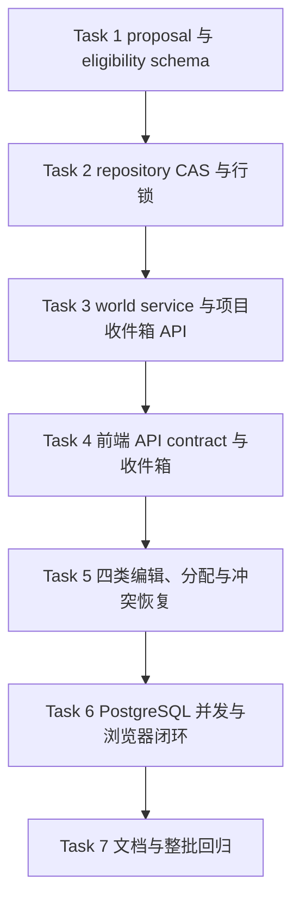

# 前端产品体验整改第二批实施计划

> 日期：2026-07-15
> 上游设计：[`2026-07-15-frontend-product-experience-remediation-design.md`](../specs/2026-07-15-frontend-product-experience-remediation-design.md)
> 前置批次：[`2026-07-15-frontend-product-experience-remediation-batch1.md`](./2026-07-15-frontend-product-experience-remediation-batch1.md)
> 状态：**Completed**
> 批次边界：只覆盖设计文档 Phase 2；不进入 imports → world 稳定候选 facade、深度导入 Prompt/映射、quick-create 成功页分流、RAG 分页、性能优化或正式地图数据清空。

## 1. 批次目标

第二批把第一批已经可点击、可恢复的地图工作台接上安全的候选审核闭环：

1. 地图总览提供项目级“地图收件箱”，只展示未分配且仍待处理的 observation。
2. 作者可以查看证据与缺失项，把候选分配到 active 地图、换图或退回收件箱；分配不会自动形成 Fact。
3. 人物位置、事件发生地、线路/阻隔、势力范围使用显式 proposal schema；proposal 与 canonical `MapDynamicValueV1` 不再混为同一种 JSON。
4. 服务端统一计算 `eligibility`，只有 canonical value、同项目已采用对象、有效地图/空间引用和合法时间来源齐全时才能确认。
5. 公共作者 PATCH 只接受作者拥有的字段；来源、证据、workflow、原始置信度、Scene/章节来源和来源时间在服务端强制只读。
6. PATCH、assign、ignore、confirm 和 batch-review 全部使用 `expected_updated_at` CAS；冲突返回 409 和最新只读摘要。
7. confirm 在 observation 行锁内重验资格并创建或复用 Fact；批量确认按 UUID 稳定顺序锁定并先全量验证，失败不部分写入。

本批完成后，人工或测试 fixture 已产生的四类候选可以走完“收件箱 → 分配/编辑 → 采用/忽略 → Fact”路径；真实 deep-import 自动产生这些 proposal 仍属于第三批。

## 2. 影响、稳定接口与风险

| 项目 | 第二批决定 |
|---|---|
| 影响模块 | `world/map`、`frontend-console`；测试与当前文档同步 |
| 稳定接口 | 不新增跨模块 facade/contracts；imports 消费的稳定候选 contract 明确留到第三批 |
| HTTP API | 新增项目收件箱 list/PATCH/assign/ignore；现有 map-scoped PATCH/confirm/ignore/batch-review 请求收紧为 CAS；response additive 增加 proposal/eligibility/updated_at |
| 数据库/schema | 不新增表、列、索引或 migration；继续复用 `map_observations.value_json/source_ref/updated_at` 与 observation 行锁 |
| 前端 wire | 新增 API wrapper；现有观察写请求增加 `expected_updated_at`；不删除 observation/fact 响应字段 |
| `novel_id` | 收件箱、分配、实体/Scene/path/hex 校验和行锁查询都必须带项目隔离；跨项目统一 404 |
| 安全 | source/evidence/workflow/confidence/source-time 出现在公共 PATCH 时由 Pydantic `extra=forbid` 返回 422；前端隐藏不是安全边界 |
| ADR | 不需要；MapFact 所有权、world/map 边界、技术栈和数据表均不变 |
| 新依赖 | 无 |
| 需要用户再确认 | 无；本批不执行任何地图数据清空，也不增加 reset execute 分支 |

若 PostgreSQL 行锁无法在现有 schema 下可靠串行化双 confirm，应立即停止并另行评审唯一索引 migration；不得退回无锁“先查再插”。

## 3. 实施顺序



## 4. 任务拆解

### Task 1：建立 proposal/canonical 分层与服务端 eligibility

**主要文件：**

- Modify: `backend/modules/world/map_schemas.py`
- Modify: `backend/modules/world/services/map/map_dynamic_projection.py`
- Modify: `backend/modules/world/services/map/map_observation_service.py`
- Modify: `backend/modules/world/tests/test_map_dynamic_facts.py`

- [x] 增加 `MapObservationProposalV1` discriminated union，覆盖人物位置、事件发生地、线路/阻隔、势力范围；固定 `payload_kind=proposal`，拒绝额外字段和自由动态 JSON。
- [x] proposal 读取投影保持 `normalization_state=untyped`，additive 返回 `proposal_value` / `proposal_type`，不伪装成 canonical typed value。
- [x] 增加 `MapObservationEligibility`，由 world 服务端检查 canonical value、目标对象类型/采用态、active map、地点/path/hex、Scene/章节或人工 initial-state。
- [x] `eligibility.missing_items` 使用稳定机器码并附作者可读文案；冲突原因单独返回。
- [x] confirm 与 batch confirm 只接受 `can_confirm=true`；proposal、legacy untyped、invalid、归档线路、越界 hex 或非 canonical 实体 fail closed。

### Task 2：实现 observation CAS、稳定锁序与 Fact 幂等

**主要文件：**

- Modify: `backend/modules/world/map_repositories.py`
- Modify: `backend/modules/world/services/map/map_observation_service.py`
- Modify: `backend/modules/world/map_schemas.py`

- [x] repository 增加 novel-scoped 条件更新和 `SELECT ... FOR UPDATE`；assign/PATCH/ignore 只允许 `candidate/conflicted` 且 `updated_at` 精确匹配。
- [x] 新请求统一携带 `expected_updated_at`；陈旧 revision、状态变化和双分配返回 409，并在 error context 返回最新只读 observation。
- [x] confirm 先锁 observation，再重验项目、地图、状态、revision、eligibility，然后查询或创建 Fact 并更新 observation。
- [x] batch-review 改为 `items=[{observation_id, expected_updated_at}]`，按 UUID 排序锁定；先验证全部，再统一写入。
- [x] 双 confirm 串行后复用同一 Fact；不得新增应用层无锁先查分支。

### Task 3：实现项目级收件箱和 map-scoped 语义收口

**主要文件：**

- Modify: `backend/modules/world/map_api.py`
- Modify: `backend/modules/world/services/map/map_dynamic_service.py`
- Modify: `backend/modules/world/services/map/map_observation_service.py`
- Modify: `backend/modules/world/services/map/map_dashboard_service.py`
- Modify: `backend/modules/world/services/map/map_playback_service.py`
- Modify: `backend/modules/world/map_repositories.py`

- [x] 增加项目收件箱 list/PATCH/assign/ignore API，支持 dynamic type/Scene 过滤、稳定分页和 `has_more`。
- [x] 收件箱只返回 `map_id IS NULL` 且 `review_state IN (candidate, conflicted)`；具体地图 dashboard/playback/list 不再混入未分配候选。
- [x] assign/reassign/unassign 只接受同项目 active map 或 null；已 confirmed observation 不可直接重分配。
- [x] 公共 PATCH 使用 `MapObservationAuthorUpdate`，仅允许目标对象、proposal 作者字段、空间选择和候选状态；来源字段显式拒绝。
- [x] map-scoped 与 project-scoped 写入口复用同一领域实现，不复制校验规则。

### Task 4：增加前端 API contract 与项目收件箱工作台

**主要文件：**

- Modify: `frontend-console/apiContracts.js`
- Modify: `frontend-console/api.js`
- Modify: `frontend-console/views/mapWorkspaceView.js`
- Modify: `frontend-console/styles.css`
- Modify: `frontend-console/tests/api-contract.test.js`
- Modify: `frontend-console/tests/mapWorkspaceView.test.js`

- [x] 增加收件箱 list/PATCH/assign/ignore wrapper，并冻结 method/path/query/body 契约。
- [x] 地图总览新增“地图收件箱 N”卡片，展示类型、对象、Scene/章节、证据、置信度和缺失项；加载失败保留筛选并提供重试。
- [x] “分配并继续”选择当前项目 active 地图，只执行 assign，随后打开规范地图 URL 和同一 observation 编辑器。
- [x] 提供换图和退回收件箱；已采用 Fact 不出现这些入口。
- [x] 忽略操作使用 CAS 并保留审计；复制诊断继续复用第一批 allowlist/脱敏实现。

### Task 5：完成四类作者表单与 409 本地恢复

**主要文件：**

- Modify: `frontend-console/views/mapWorkspaceView.js`
- Modify: `frontend-console/views/mapTimelineProjection.js`
- Modify: `frontend-console/tests/mapWorkspaceView.test.js`
- Modify: `frontend-console/tests/mapTimelineProjection.test.js`

- [x] proposal 表单只显示名称、状态、证据和缺失项；解析完成后提交完整 canonical `MapDynamicValueV1`，不把未解析名称塞入 UUID 字段。
- [x] 人物/事件地点使用已采用对象与地点选择器；线路状态选择 active path；势力范围选择已采用组织和明确 hex。
- [x] 采用按钮严格消费服务端 `eligibility.can_confirm`；前端不复制服务端资格规则，只展示 missing items。
- [x] PATCH/confirm/ignore/batch-review 都携带当前 `updated_at`；409 时保留本地输入并展示最新服务器摘要和重试入口。
- [x] 390px 允许人物/事件地点等轻量修改与忽略；线路创建和势力 hex 编辑继续提示桌面端。

### Task 6：并发、隔离和作者闭环验收

**主要文件：**

- Modify: `backend/modules/world/tests/test_map_dynamic_facts.py`
- Add: `backend/tests/e2e/test_map_observation_concurrency_postgresql.py`
- Modify: `frontend-console/e2e/map.spec.js`
- Modify: `frontend-console/e2e/map-path-mobile.spec.js`

- [x] backend 覆盖收件箱隔离、proposal、来源字段 422、typed-only confirm、归档引用、CAS、批量全有或全无和陈旧 revision。
- [x] 独立 PostgreSQL 覆盖 confirm/ignore 与双 confirm 行锁竞态、幂等唯一 Fact；assign/PATCH/batch 的 CAS 与原子性由 service/API 回归覆盖。
- [x] Playwright 覆盖未分配候选 → 分配 → 类型化编辑 → 采用 → Fact；Vitest 另覆盖退回、忽略和 409 表单保留。
- [x] 390px 代表流覆盖只读浏览、触控与复杂空间编辑转交，且无横向溢出。

### Task 7：文档同步与整批回归

**主要文件：**

- Modify: `backend/modules/world/README.md`
- Modify: `frontend-console/README.md`
- Modify: `docs/modules/14_frontend.md`
- Modify: `docs/modules/15_map.md`
- Modify: `docs/核心业务场景与预期行为.md`
- Check: `CONTEXT.md`
- Check: `docs/01_数据库设计.md`

- [x] 同步项目收件箱、proposal/canonical、eligibility、来源只读、CAS/行锁和前端工作流。
- [x] 因本批不改事实归属或 schema，复核后确认 `CONTEXT.md` / 数据库设计无需改动。
- [x] 运行 world 聚焦测试、独立 PostgreSQL 并发 E2E、全量 Vitest、完整地图 Playwright、390px 代表流、Ruff 与 `git diff --check`。
- [x] 上游 spec 保留为设计快照；本计划按实际实现记录验收，不替代模块 README。

## 5. 验证命令

```bash
cd backend
python -m pytest -q modules/world/tests/test_map_dynamic_facts.py modules/world/tests/test_map_api.py
python -m pytest -q tests/unit/test_map_subsystem_reset.py

RUN_E2E_TESTS=1 E2E_DATABASE_URL='<dedicated-postgresql-url>' \
  python -m pytest -q tests/e2e/test_map_observation_concurrency.py \
  -m "e2e and not real_llm and not external_data"

cd ../frontend-console
npm test -- api-contract.test.js mapWorkspaceView.test.js mapTimelineProjection.test.js
npm test

DATABASE_URL='<dedicated-postgresql-url>' PW_REUSE_EXISTING_SERVER=0 \
  npm run test:e2e:map

cd ..
make lint
git diff --check
```

## 6. 第二批完成标准

1. 收件箱只出现未分配 candidate/conflicted，地图 dashboard/playback/list 不再混入它们。
2. 四类 proposal 经显式 union 校验并保持 untyped；只有完整 canonical value 可形成 Fact。
3. eligibility 由服务端统一计算，跨项目、非 canonical 对象、无 Scene/章节、无 path/hex、越界和归档资产均不能确认。
4. 作者 PATCH 无法修改来源、证据、workflow、原始置信度和 Scene/章节来源。
5. assign/PATCH/ignore/confirm/batch-review 的 CAS 和 PostgreSQL 行锁测试通过；双 confirm 只产生一个逻辑 Fact，批量失败不部分写入。
6. 桌面端完成收件箱到 Fact 的人工闭环；390px 完成人物/事件地点轻量审核并正确转交复杂空间编辑。
7. 受影响 backend、Vitest、Playwright、Ruff 与 diff check 全绿，当前文档同步完成。

### 2026-07-15 执行验收

- world 模块回归：`669 passed`。
- 独立 PostgreSQL 行锁竞态：`2 passed`；确认事务持锁期间并发忽略/确认都会等待，提交后
  陈旧忽略以 `map_observation_revision_conflict` 失败，第二个确认复用同一个 Fact。
- 前端全量 Vitest：`67 files / 1330 passed`。
- 地图 Playwright：`22 passed`，包含新增“项目收件箱 → 分配 → 类型化编辑 → 采用 → Fact”
  真实浏览器闭环，以及 390px 势力 hex 转交桌面端的回归。
- `make lint` 与 `git diff --check` 通过。
- 实现未新增数据库表/列、migration、依赖、跨模块 facade/contracts 或 ADR；没有执行地图
  数据清空。第三批仍负责 imports → world 稳定候选 contract 与真实 deep-import 产出。

### 2026-07-15 子代理审查修复

- 后端保留只读 proposal subtype，并按人物地点/事件地点分别约束目标对象和空间引用；拒绝
  显式空 review state，已有目标对象的类型与名称始终由服务端重新派生。
- 项目收件箱的来源、置信度和 eligibility 改为服务端分页前过滤，同时兼容历史动态类型别名；
  补齐跨项目、归档地图、陈旧 PATCH 与批量零部分写入回归。
- 前端统一编辑、分配、换图、退回、忽略、确认和批量审查的 409 latest 合并与重试；修复跨项目
  页码、末页空页、缺失置信度显示、API body 元数据与筛选控件可访问名称。
- 390px 隐藏势力范围 hex 输入并显示桌面端转交提示，补充真实浏览器断言和移动触控目标门禁。

## 7. 明确留给第三批及以后

- `MapObservationCandidateInput` 跨模块稳定 contract/facade、确定性 UUID 和 payload hash 幂等。
- imports Phase 2/LLM schema 产生首批四类 proposal，worker-enabled mock integration。
- 深度导入成功页的“一键创建地图 / 先审核地点 / 查看地图收件箱”分流。
- observation → quick-create → timeline 的真实导入闭环 E2E。
- RAG 首批 20 条与 URL 查询恢复。
- 普通/200×200 地图 2s/3s、交互 p95 33ms 的优化和绝对预算门禁。
- reset 正式删除分支和开发环境 cutover；仍需独立二次确认。
