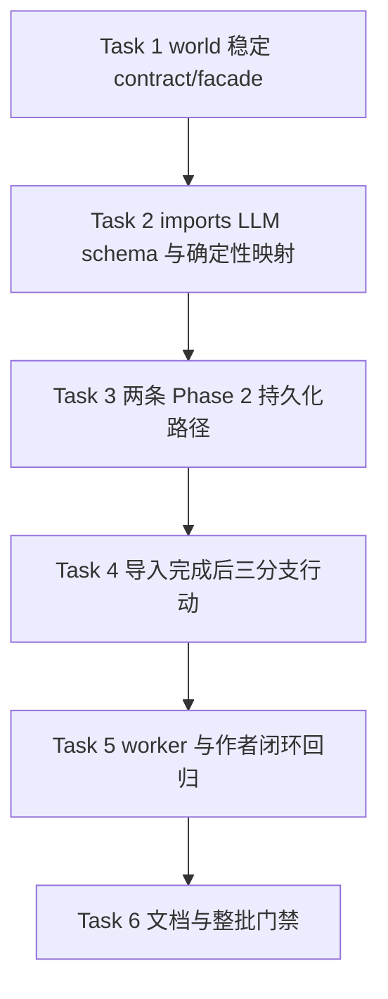

# 前端产品体验整改第三批实施计划

> 日期：2026-07-15
> 上游设计：[`2026-07-15-frontend-product-experience-remediation-design.md`](../specs/2026-07-15-frontend-product-experience-remediation-design.md)
> 前置批次：[`2026-07-15-frontend-product-experience-remediation-batch2.md`](./2026-07-15-frontend-product-experience-remediation-batch2.md)
> 状态：**Completed（第三批范围）**
> 批次边界：只覆盖设计文档 Phase 3；不做 RAG 分页/性能优化，不新增数据库 migration、前端框架或依赖，不执行正式地图数据重置。

## 1. 批次目标

第三批把第二批已具备的地图候选作者闭环接到真实深度导入结果：

1. `world` 提供稳定的 `MapObservationCandidateInput` 与批量 facade，只接收四种显式 proposal。
2. 候选身份由 `novel_id + workflow_id + scene_id + source_item_key + proposal_type` 确定；相同重试复用，身份相同但原始 payload 改变时 409 fail closed，绝不覆盖作者编辑。
3. imports 的逐 Scene 与窗口式 Phase 2 输出都能产生类型化地图 proposal，经确定性映射写入 world；旧通用 delta 地图入口只保留兼容，不承载新四类 proposal。
4. 深度导入完成后根据项目状态展示一个明确下一步：一键创建地图、先审核地点，或查看地图收件箱。
5. 完成“导入 proposal → 地图收件箱 → 分配/编辑 → 确认/忽略 → Fact → timeline/state-at/playback”的回归闭环。

## 2. 影响、稳定接口与风险

| 项目 | 第三批决定 |
|---|---|
| 影响模块 | `imports`、`world/map`、`frontend-console`、Prompt 与模块文档 |
| 稳定接口 | additive 新增 world contracts/facade；imports 只从 `modules.world.contracts` / `modules.world.facade` 导入 |
| HTTP API | 不新增或删除 HTTP 路由；复用地图 quick-create、项目收件箱与 world 候选审核接口 |
| 数据库/schema | 不新增表、列、索引或 migration；复用 observation UUID、`source_ref`、`value_json` |
| 前端 wire | 任务结果只读取 additive 的 workflow/asset 信息；现有任务字段不改名、不删除 |
| `novel_id` | Scene、目标对象、候选、地图和后续 Fact 全链路保持项目隔离；跨项目引用统一失败 |
| 幂等/并发 | 确定性 UUIDv5 + 原始 payload hash；批量先检查冲突再创建，避免部分写入 |
| 来源安全 | source identity、payload hash、Scene 指纹、evidence、workflow 与授权元数据写入只读来源；不得由公共作者 PATCH 修改 |
| LLM | 仍由确定性 deep-import workflow 编排；输出经 Pydantic schema 和映射，不允许自治工具调用或直接写 Fact |
| ADR / 新依赖 | 均不需要 |
| 需要用户再确认 | 无；本批不包含危险删除或正式 reset |

若现有 observation 表无法可靠承载确定性 UUID 或原子冲突检查，应停止并单独评审 schema/索引方案；不得通过“覆盖已有候选”规避冲突。

## 3. 实施顺序



## 4. 任务拆解

### Task 1：建立类型化候选稳定契约和幂等写入

- [x] 在 `modules.world.contracts` 公布四类 proposal、授权、候选输入和批量结果；输入 `extra=forbid`。
- [x] 在 map 领域服务计算 UUIDv5、canonical payload hash 和只读 `source_ref`；不在 facade 写业务判断。
- [x] 同一身份/同一 payload 返回 `reused`，同一身份/不同 payload 返回稳定 409；批量冲突时不创建任何新行。
- [x] 校验 novel-scoped Scene、scene_index、目标对象类型和授权；创建 observation，不自动分配地图或形成 Fact。
- [x] 更新 root facade/contracts 删除测试与 imports 静态边界回归。

### Task 2：扩展 Phase 2 LLM 输出和确定性映射

- [x] 逐 Scene 与窗口式输出新增 `map_observation_proposals` discriminated union，只允许人物地点、事件地点、线路状态、势力范围。
- [x] Prompt 明确 exact evidence、支持 Scene、字段白名单和无法确定时省略/进入 uncertain，不用 generic delta 猜测。
- [x] 增加 imports 纯映射器，稳定生成 `source_item_key`、evidence anchor 和 world candidate；保留 workflow、Scene、章节、context snapshot 与 Scene source fingerprint。
- [x] schema repair/partial list 与窗口 Scene 归属校验同步识别新字段；无授权、无 Scene 或不合法输出可见失败，不静默写入。

### Task 3：接通逐 Scene 与窗口式 Phase 2 持久化

- [x] 两条真实 Phase 2 路径都调用新的批量 facade；新四类 proposal 不经过 `create_map_observation_from_delta_event`。
- [x] 任务结果 additive 返回 created/reused 统计；冲突/无效输入以稳定错误和上下文中止当前批次，并保留已有对象、关系和 delta 统计。
- [x] 重试/恢复复用相同 observation；来源 payload 冲突让当前批次失败并保留诊断。
- [x] 单元/集成覆盖四类 proposal、降级、重试、跨项目、Scene 指纹和来源不可变。

### Task 4：实现导入完成后的明确下一步

- [x] 完成时加载 quick-create context：已有 active 地图优先“查看地图收件箱”；无地图且有 canonical 地点显示“一键创建地图”；只有 candidate 地点显示“先审核 N 个地点”。
- [x] 一键创建复用既有 preview/confirm modal，成功后打开 canonical map URL，并提示剩余候选。
- [x] 地点审核使用 `entity_type=location&source=deep_import&workflow_id=...` 精确深链；world 候选筛选把 `entity_type` 纳入 URL、请求和回退状态。
- [x] 带下一步行动的完成条不自动消失；用户完成或关闭后才清理。

### Task 5：worker 与作者闭环验收

- [x] backend 覆盖稳定 facade、原子冲突、无 Fact、imports 映射与两条持久化路径。
- [x] Vitest 覆盖三分支、恢复后完成态、quick-create 回调、地点深链和任务项目切换。
- [x] worker-enabled Playwright 使用固定三章来源并在 worker 完成后恢复写作页，断言地图 CTA；真实执行仍受 `RUN_WORKER_E2E=1` 和外部 LLM 环境门禁。
- [x] 地图 E2E 继续覆盖候选分配/编辑/确认/忽略，以及 Fact 对 timeline/state-at/playback 的可见性。

### Task 6：文档同步与整批回归

- [x] 更新 imports/world/frontend README、Prompt 清单和核心业务场景；说明新稳定 seam、来源身份与完成页分流。
- [x] 运行受影响 backend、public-surface/static-boundary、prompt-contract、Vitest、worker/map Playwright、Ruff 和 diff check。
- [x] 上游 spec 继续作为设计快照；本计划记录真实验收结果。

## 5. 验证命令

```bash
cd backend
python -m pytest -q tests/unit/test_facade_public_api.py modules/imports/tests/test_map_observation_candidates.py
python -m pytest -q modules/world/tests modules/imports/tests

cd ../frontend-console
npm test -- tests/writing/deepImportRecovery.test.js tests/worldView.test.js
npm test
RUN_WORKER_E2E=1 npx playwright test e2e/deep-import-worker.spec.js --reporter=list
npm run test:e2e:map

cd ..
make prompt-contracts
make lint
git diff --check
```

## 6. 完成标准

1. imports 生产代码只通过稳定 world seam 写入四类 proposal，generic delta 路径不承载新类型。
2. UUIDv5/原始 payload hash 重试幂等、冲突 fail closed，且不覆盖任何作者已编辑字段。
3. 新候选保留完整 workflow/Scene/章节/context/evidence/Scene 指纹来源并保持 `novel_id` 隔离。
4. 深度导入完成后恰好出现一个正确行动；quick-create、地点审核、地图收件箱均走规范 URL/已有能力。
5. 类型化 observation 能进入第二批作者闭环并形成唯一 Fact，timeline/state-at/playback 读取一致。
6. 受影响 backend、前端、Prompt、worker/E2E、lint 与 diff check 通过，文档已同步。

### 2026-07-15 执行验收

- world/imports 后端整组：`1257 passed, 6 deselected`；新增稳定 facade、四类 schema、重试复用、
  payload 冲突、无 Fact 和 imports 稳定边界回归通过。
- 前端全量 Vitest：`67 files / 1354 passed`；导入完成三分支、地点精确深链和完成条生命周期通过。
- 地图 Playwright：`22 passed`；候选分配/编辑/确认/忽略及 Fact 的 timeline/state-at/playback
  既有闭环保持通过。
- worker-enabled 用例已扩展为完成后恢复写作页并断言地图 CTA；未设置
  `RUN_WORKER_E2E=1` 时按设计 `1 skipped`，本轮未擅自启动真实外部 LLM worker。
- Prompt contracts `7 passed`，Ruff、`git diff --check` 通过。
- 浏览器加载检查使用仓库 Playwright fallback（本机没有 `agent-browser` CLI）：页面正文非空、
  41 个交互元素、无 Vite error overlay、无 console error。
- 未新增数据库 schema/migration、依赖或 ADR，未执行地图数据重置。

### 2026-07-15 子代理审查与修复

- backend/frontend/coverage 三路独立审查后，修复了稳定 `Protocol` 方法误置、
  proposal 分支额外字段被静默丢弃、同类 proposal 重排导致身份假冲突、批量/窗口
  路径错绑首个 Scene，以及窗口指纹没有包含实际消费正文的问题。
- 授权改为沿用 task 提交时冻结的 snapshot，world 验证 novel/章节 scope 并持久化
  snapshot fingerprint；PostgreSQL 首次确定性 UUID 并发写入增加缺行友好的事务锁，
  导入 proposal type 不再允许作者 PATCH 原地切换。
- 完成条现在跨刷新保留 CTA，忽略 done 任务上的残留恢复标记，丢弃 dispose/
  项目切换/新任务后的晚到异步响应。地点数量改为 workflow 精确统计；弹窗被拦截、
  回调失败、下一步或待处理列表加载失败时保留可见重试状态。
- 同 quote/同类型但不同目标的 proposal 改为按结构身份稳定排序后分配局部序号，
  重排不再交换 UUID 身份。quick-create 冻结原 task project，预览/确认/完成回调每次
  await 后重新校验 project/generation；新窗口使用可判定拦截且显式清除 opener 的打开方式。
- 新增回归覆盖授权跨项目拒绝、proposal type 不可变、缺行身份锁、批量 Scene
  归属、窗口 owned Scene/正文指纹、CTA 恢复和生命周期、workflow 精确数量与
  `entity_type=location` 筛选保留。
- 复审发现 Prompt contract 注册表的精确 ID 集合仍是旧 6 项，且
  `strict_schema_coverage` 未执行、Annotated discriminated union 未下钻。现已注册第 7 项
  `scene_entity_extraction`，开启真正的严格 root 覆盖，检查四分支、evidence 和持久化
  mapping，两份 golden fixture 都覆盖四种 proposal。Prompt contract 测试为 `18 passed`。
- 新增逐 Scene 与窗口两条集成回归，使用 SQLite 真实写入
  `map_observations`，断言稳定 facade、owned Scene、冻结授权和来源指纹，不再只检查
  mock recorder。本轮 batch-3 聚焦后端回归为 `35 passed`。
- PostgreSQL 真并发回归已写入 `tests/e2e/test_map_observation_concurrency.py`；本轮因未设置
  独立 `E2E_DATABASE_URL` 而按门禁停止，没有改用开发库或绕过数据安全检查。

### 并行工作区门禁说明

- 子代理复审期间，共享工作区的 World Generation Center / Context / World Bible
  另一组未完成改动仍在写入文件。最新全仓快速测试为
  `4014 passed, 15 failed, 31 deselected`，全仓 Ruff 还有 9 个该并行改动的问题。
- 只读归因确认这些失败是生成中心新旧 action/purpose/API 半迁移、outline facade 冻结
  集未同步，以及 synopsis `claims/source_refs` 与 `sections/source_keys` 半迁移；不在本批
  `imports → world/map` 范围，因此本轮未越界回退或完成该架构迁移。
- 第三批最终门禁为：后端聚焦 `35 passed`，前端全量 `67 files / 1354 passed`，
  Prompt contracts 7 份及其单测 `18 passed`，batch-3 受影响文件 Ruff/format 和
  `git diff --check` 通过。
