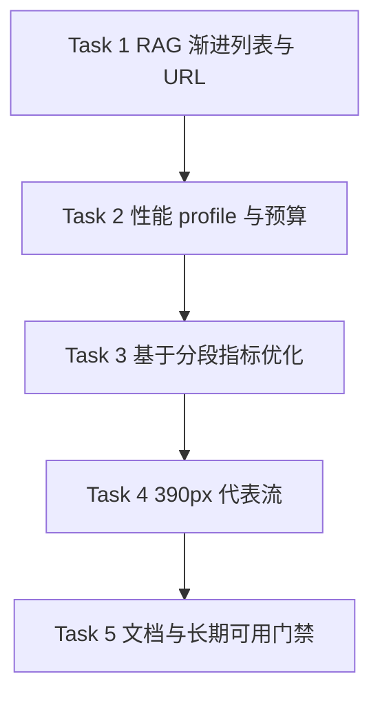

# 前端产品体验整改第四批实施计划

> 日期：2026-07-15
> 上游设计：[`2026-07-15-frontend-product-experience-remediation-design.md`](../specs/2026-07-15-frontend-product-experience-remediation-design.md)
> 前置批次：[`2026-07-15-frontend-product-experience-remediation-batch3.md`](./2026-07-15-frontend-product-experience-remediation-batch3.md)
> 状态：**Completed**
> 批次边界：只覆盖设计文档 Phase 4；不执行地图 reset/cutover，不运行真实 LLM 质量验收，不新增数据库 migration、前端框架或依赖。

## 1. 批次目标

第四批收口长期可用门禁，而不是继续扩展地图领域能力：

1. RAG 作者检索首批最多挂载 20 张结果卡，按 20 条渐进加载；检索词和筛选保存到 URL，浏览器前进/后退可恢复，查询切换会取消旧响应。
2. 地图性能基准同时覆盖固定 24×18 与 200×200 fixture，执行热样本 p75 `≤2s/≤3s`、任一热样本不超过预算两倍、真实输入到下一帧 p95 `≤33ms`。
3. 390px 代表流补齐短文本写作保存和 quick-create 预览/确认，并与已有世界书、Scene、RAG、地图轻量审核用例共同形成长期可用证据。
4. 完整验证使用确定性 seed/mock 数据；真实 LLM 保持 opt-in，不成为日常前端全绿条件。

## 2. 影响、稳定接口与风险

| 项目 | 第四批决定 |
|---|---|
| 影响模块 | `frontend-console`；RAG 仅改变作者检索展示和路由恢复；地图仅改变内部渲染/telemetry 与验收脚本 |
| 稳定接口 | 不新增或修改 backend `contracts.py` / `facade.py` / DI port |
| HTTP API | 不增删路由、不改 method/path；RAG 继续调用 context evidence API，地图继续读取既有全量 state wire |
| 数据库/schema | 不改 ORM、表、列、索引或 migration；性能数据只写入名称带 `test/e2e/audit` 的独立 PostgreSQL 数据库 |
| 前端 wire | 不改响应字段；RAG 在客户端对现有 `hits/total/warnings` 渐进投影，地图 telemetry 继续使用只读页面事件 |
| `novel_id` | URL、搜索请求和性能 fixture 都绑定当前项目；项目切换或生命周期结束后丢弃晚到响应 |
| 性能风险 | 绝对预算只在固定 Chromium、workers=1、retries=0、fresh server、独立数据库参考 profile 下判定；普通 CI 不冒充参考 profile |
| 安全 | 动态结果继续经 `esc()`；URL 只保存作者检索条件，不保存证据正文、诊断内容、游标或抽屉状态 |
| ADR / 新依赖 | 均不需要；内部性能与列表策略沿用已批准规格 |
| 需要用户再确认 | 无；本批不包含危险删除。正式地图 reset/cutover 仍需另行二次确认 |

若绝对预算失败，应先以 API/状态组装/Leaflet/Canvas/标签分段指标定位并做内部优化；不得删减语义 fixture、放宽预算、增加 retry，或改用空指标通过。

## 3. 实施顺序



## 4. 任务拆解

### Task 1：RAG 有界 DOM、路由恢复与竞态控制

- [x] 首次只渲染 20 张 `.rag-result-card`，每次“加载更多”再追加 20 条；展示 API `total`、当前已显示数和剩余数。
- [x] 搜索结果保留完整命中数组供证据抽屉使用，但临时显示游标不写 URL；新查询重置游标。
- [x] URL 保存 `q`、检索方式、正文版本、章节范围、可见视角、范围和 pending 开关；直接打开、刷新、前进和后退恢复表单并重新检索。
- [x] 每次新查询取消上一查询，使用 generation + project/lifecycle 双门禁；旧响应和 abort error 不覆盖新结果或错误状态。
- [x] Vitest 固定 58 条结果验证 `20 → 40 → 58`、无重复/丢失、切换查询竞态和 URL round-trip；Playwright 覆盖真实浏览器前进/后退。

### Task 2：把性能采样升级为参考 profile 门禁

- [x] 同一专用命令分别创建/校验 `standard` 24×18 和 `stress` 200×200 manifest/checksum fixture。
- [x] 每个 profile 记录冷启动、1 次预热和 10 次热导航，nearest-rank 输出 median/p75/max；p75 分别执行 2s/3s 预算，单样本不得超过预算两倍。
- [x] 对真实 click/drag/wheel/touch 后至少 100 个 frame 执行 `input.p95_to_paint_ms ≤33ms`，同时报告 `p95_redraw_cpu_ms` 和 long task。
- [x] telemetry 缺失、非 100 帧、未点击真实 hex、retry 非零或 fixture/DB 元数据不完整时直接失败；报告每个 profile 各自的原始样本。
- [x] 配置保持 bundled Chromium、1280×720、workers=1、retries=0、fresh backend/frontend 和独立 PostgreSQL 安全门禁。

### Task 3：按真实分段指标优化地图首屏

- [x] 先运行参考 profile，比较 API、状态组装、Leaflet 初始化、Canvas 首帧和标签布局；本机基线已满足预算，未制造无证据的生产优化。
- [x] 保留 40,000 tile 的全量 wire 与 fixture 语义数量，不通过削减 fixture 或跳过标签/动态层达标。
- [x] 复用视口裁剪、缓存和 render epoch；快速切图时旧请求/旧渲染不得覆盖当前地图。
- [x] 重复运行同一 profile 并将本机数值写入本计划；当前 README 记录可复现门禁与报告结构，不固化易漂移的工作站快照。结果只表述为本次参考 profile，不外推为普遍性能保证。

### Task 4：补齐 390px 作者代表流

- [x] 写作：在 390×844 下选择章节、编辑短文本、保存为工作稿，验证可恢复内容、主要按钮高度和无横向溢出。
- [x] quick-create：在 390×844 + touch 下打开预览、调整地点、确认创建，验证 Canvas/操作可见、目标尺寸和持久化布局。
- [x] RAG：固定 58 条结果验证 20 条首批、加载更多、证据查看、查询切换与 URL 恢复，无横向溢出。
- [x] 将已有世界书、Scene、地图轻量审核/桌面端转交用例纳入第四批代表流命令；受影响范围不得存在 skip/fixme。

### Task 5：文档同步与整批回归

- [x] 更新 `frontend-console/README.md`、RAG README、`docs/modules/14_frontend.md`、`docs/modules/15_map.md` 和 `testing-guide.md` 的当前行为与门禁。
- [x] 全量 Vitest、RAG/写作/世界书/Scene/地图 Playwright、地图完整子集和专用性能 profile 通过。
- [x] 运行适用 Ruff/仓库门禁与 `git diff --check`；并发工作区中的非第四批失败已单独归因，没有越界修改。
- [x] 上游 spec 保留为设计快照；第四批计划记录实际验收和未执行的 opt-in/cutover 边界。

## 5. 验证命令

```bash
cd frontend-console
npm test -- tests/ragView.test.js tests/mapTelemetry.test.js tests/mapView.test.js
npm test

DATABASE_URL='<dedicated-postgresql-url>' PW_REUSE_EXISTING_SERVER=0 \
  npx playwright test e2e/rag.spec.js e2e/writing.spec.js \
  e2e/world-bible.spec.js e2e/scene-workbench.spec.js e2e/map-path-mobile.spec.js \
  --workers=1 --retries=0

DATABASE_URL='<dedicated-postgresql-url>' PW_REUSE_EXISTING_SERVER=0 \
  npm run test:e2e:map

DATABASE_URL='<dedicated-postgresql-url>' PW_REUSE_EXISTING_SERVER=0 \
  npm run test:e2e:map-perf

cd ..
git diff --check
```

## 6. 完成标准

1. 任一 RAG 搜索首屏 DOM 结果卡不超过 20，58 条 fixture 可无重复/丢失地渐进展示完整；URL、前进/后退和查询取消行为稳定。
2. 普通/200×200 profile 都使用确定性语义 fixture 和页面公开 telemetry；热样本 p75 达到 2s/3s，所有热样本不超过预算两倍。
3. 真实交互至少 100 帧且 `input_to_paint` p95 `≤33ms`；redraw CPU 与 long task 单独报告，不能互相替代。
4. 390px 写作保存、quick-create、世界书、Scene、RAG 和地图轻量审核在真实 Chromium 下通过，无横向溢出，复杂空间编辑继续明确转交桌面端。
5. 全量 Vitest、完整地图 E2E、受影响 Playwright、专用性能命令和 diff check 通过；受影响范围 skip/fixme 为 0。
6. 当前 README/模块文档/测试指南按实现同步；真实 LLM 和正式 reset/cutover 仍保持 opt-in/独立确认。

## 7. 实施与验收记录

### 7.1 实际交付

- RAG 作者检索按 `20 → 40 → 全部` 渐进挂载，URL 可恢复检索条件；游标、证据正文和抽屉状态不进入 URL。新查询通过 `AbortController`、generation、项目和生命周期门禁丢弃旧响应。
- review 后证据抽屉改用独立 abort/generation/project/drawer 门禁；关闭抽屉、切换项目或打开另一条证据后，旧正文、引用与导航结果都不能回写。
- 地图参考 profile 使用固定 manifest/checksum、真实 Leaflet 1.9.4 和完整混合地形语义 fixture：`standard` 为 24×18 / 432 tiles，`stress` 为 200×200 / 40,000 tiles；实际 API payload checksum 必须匹配 manifest，未删减标签、动态层或全量 state wire。
- 390px 代表流覆盖短文本工作稿保存/刷新恢复、quick-create 预览/调整/确认，以及既有世界书、Scene、RAG、地图轻量审核和桌面端转交。
- review 后移动速记会实时同步编辑状态并回写首次保存的 draft id/version，连续保存不再重复创建工作稿；世界书移动流覆盖“未保存修改 → 保存成功 → 携带精确 source page id 转交生成中心”。
- 写作台完整重渲染会保留已展开的“AI 工具”菜单；Vite 不再监听 `tests/`、`e2e/` 和 Playwright 报告产物，避免测试期间无关文件变化触发整页重载。
- 世界书移动端断言已按当前“转交生成中心”产品契约更新；旧的内嵌 AI 侧栏选择器不再作为验收依据。

### 7.2 性能证据

以下数值来自本机 bundled Chromium、1280×720、workers=1、retries=0、fresh server 和独立 PostgreSQL 的本次参考运行：

| Profile | cold | hot median | hot p75 | hot max | input p95 | redraw CPU p95 | long tasks |
|---|---:|---:|---:|---:|---:|---:|---:|
| standard 24×18 | 3501.6ms | 7.9ms | 8.0ms | 9.8ms | 0.9ms | 0.6ms | 0 |
| stress 200×200 | 5032.3ms | 51.2ms | 52.1ms | 58.5ms | 2.8ms | 2.6ms | 0 |

两组 profile 均采集 1 次地图路由冷导航（不是应用进程冷启动）、1 次预热、10 次热导航和 100 个真实输入帧；p75、单样本上限和 `input_to_paint ≤33ms` 全部通过。报告包含 100 个 frame/input 原始数组，且 click/drag/wheel/touch 均有正样本。现有分段没有暴露需在本批追加的生产瓶颈，因此没有以扩大改动面换取无意义的基准优化。

### 7.3 最终门禁

| 门禁 | 结果 |
|---|---|
| 全量 Vitest | 67 files / 1408 tests passed |
| 第四批代表性 Playwright | 52 passed，workers=1，retries=0 |
| 地图完整子集 | 23 passed，workers=1，retries=0 |
| 地图性能 profile | 2 passed |
| 写作菜单竞态定向稳定性 | 连续 3 次通过 |
| Ruff | `make lint` → All checks passed |
| JS 语法 / diff / skip-fixme | 通过；受影响 E2E skip/fixme 为 0 |

本机未安装 `agent-browser` CLI，浏览器验收按既定 fallback 使用仓库 Playwright Chromium 完成。标准 `ai-novel-db` 在验证期间受其他本机流程启停影响，最终证据全部改用本轮独立临时 PostgreSQL 容器生成；被中断的跑次未计入验收。

### 7.4 未执行边界

- 未运行真实 LLM 质量验收；该门禁继续保持 opt-in。
- 未执行地图 reset/cutover、真实数据删除或 migration。
- 未修改 HTTP API、数据库 schema、backend facade/contracts/DI port 或前端响应 wire；未新增依赖或 ADR。
