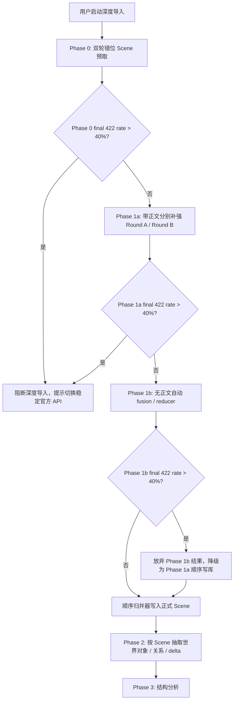

# 深度导入韧性 Scene 提取与恢复设计

## 1. 背景

一次真实 LLM 深度导入《诡秘之主 第一部 小丑》全 213 章时，观察到大量 `422` 错误，且世界对象没有正确识别 / 生成。当前深度导入虽然已有三阶段骨架，但存在几个核心问题：

- Phase 1 以固定 batch 切分正文，容易把跨 batch 的 Scene 从中间截断。
- 单次 LLM 输出质量不稳定时，后续世界对象抽取会被劣质 Scene 连锁污染。
- 浏览器刷新可恢复进度展示，但 worker / backend 意外中断后的自动恢复和断点续跑不完整。
- 用户整理大量导入结果时，缺少按状态、标签、来源和复核标记快速筛选的管理能力。

本文是 `docs/superpowers/specs/2026-06-13-deep-import-three-pass-design.md` 的增量设计，替换其中 Phase 1 Scene 切分、导入恢复、导入结果整理相关设计。三阶段总体目标不变：

1. Scene 提取与整理。
2. 基于 Scene 抽取世界对象 / 关系 / delta。
3. 结构分析生成剧情线、篇章纲、伏笔和揭示。

本 spec 不覆盖两个独立缺陷：RAG / embedding 已索引向量维度与 `EMBEDDING_DIM` 配置不一致，以及“世界对象”一级侧边栏点击后被强制跳转到地图的问题。这两个问题应作为独立 bug 修复，不混入深度导入流水线设计。

## 2. 目标

- 允许 Phase 0 高并发预处理快速打满 LLM，把可用 Scene 观察先收集回来。
- 通过两轮错位 batch 降低固定切分边界截断 Scene 的风险。
- Phase 1a 带正文分别补强两轮结果，提高每个候选 Scene 的质量。
- Phase 1a 作为受控正文补强器，不承担最终切分；当 provider 限流、网络错误、timeout 或 schema 问题出现时，保留可融合的低质量锚点，不静默丢章。
- Phase 1b 不带正文，只基于两轮补强后的候选做自动融合、切分、重排和回退决策。
- 在 LLM API 不稳定时及时阻断或降级，避免低质量结果污染正式 Scene 和世界对象。
- 支持 worker / backend 中断后由用户手动继续，允许局部重复任务以换取质量和幂等。
- 保留用户后续手动融合 Scene 的能力。
- 在 Scene / 世界对象等管理界面提供可查询筛选，方便整理 deprecated、needs_review、fallback 等结果。

## 3. 非目标

- 不引入新的队列、数据库、向量存储或多 Agent 运行时。
- 不新增任务状态枚举；继续使用 `pending / running / done / failed / cancelled`。
- 不把 Phase 0 / Phase 1a 中间候选升级为长期业务资产。
- 不在后台静默覆盖或删除已暴露给用户的正式 Scene。
- 不自动合并用户已确认的正史对象。

## 4. 新流程总览

## 5. Phase 0: 双轮 Scene 预取

Phase 0 是正式 Scene 提取前的机会主义预处理层。它允许高并发、允许缺失和错误，但必须记录诊断信息。

### 5.1 Batch 规则

- batch 是现有 Scene 切分批次的别名，不是新的领域对象。
- 每个 batch 默认约 4-5 章，当前固定为 5 章窗口。
- Round A：从第 1 章开始，按 `1-5, 6-10, 11-15...` 切分。
- Round B：从第 3 章开始，按 `3-7, 8-12, 13-17...` 切分。
- 不额外补书首边界；书尾不足 5 章时允许短 batch。
- 两轮结果地位平等，都是 Scene 候选观察，不预先拥有正式输出权。

### 5.2 并发与超时

- `PHASE0_PREFETCH_CONCURRENCY` 默认 `50`，可配置。
- Phase 0 超时时间默认与正式 Phase 1a 相同，因为输入正文规模相同。
- Phase 0 的差异在于并发、暂存和降级策略，而不是更短的请求预算。

### 5.3 Retry 与错误率

- 对 `422`、网络错误、timeout 允许 `1` 次 retry。
- schema 解析失败、空结果、质量不过提交门不 retry。
- `422` 错误率以两轮预取 batch 数为分母，不以章节数、成功 batch 数或实际请求次数为分母。
- 若 retry 后某 batch 最终仍为 `422`，才计入 final `422` 错误率。
- Phase 0 final `422` 错误率超过 `40%` 时，阻断深度导入。
- 初次失败、retry、最终失败类型和请求耗时必须写入 workflow 诊断信息，用于解释阻断或降级原因。

阻断提示文案：

> 推荐使用官方 API 以保障稳定性与质量（强推 DeepSeek-v4-flash，质量高价格低并发超快！）

### 5.4 结果分类

Phase 0 输出只写入 workflow 中间结果 / task result，不写入正式 `Scene` 表。

| 分类 | 条件 | 后续用途 |
|---|---|---|
| 高质量候选 | schema valid，source hash match，章节范围合法，覆盖目标章节，非空，未截断 | Phase 1a 强参考 |
| 低质量参考 | schema 可解析但未过提交门 | Phase 1a 可参考，但允许重写 |
| 失败记录 | schema 不可解析或空结果 | 只进入诊断，不进入参考 |

提交门是确定性结构可靠性边界，不做语义去重，不让 LLM 自评决定可写性。

## 6. Phase 1a: 带正文质量补强

Phase 1a 使用正文和 Phase 0 两轮结果，对 Round A / Round B 的每个 batch 分别补强。
它是正文级补强器，不是最终 Scene 切分器；输出目标是给 Phase 1b 提供稳定、
可追溯的候选锚点。

### 6.1 输入

- 当前 batch 正文；正文按预算收敛，避免把同一正文同时塞入多个 payload 字段。
- 当前 batch 对应的 compact Phase 0 reference，只保留候选 id、round、batch、章节、质量、短 scenes、boundary / confidence 等字段。
- 按章节意义取前后各 1 个 batch 的摘要或候选结果。
- 不使用 LLM 返回完成时间决定叙事顺序。

### 6.2 输出

Phase 1a 输出仍是中间候选，不写入正式 `Scene` 表。当前默认要求每个覆盖章节最多
1 个短候选，每 5 章窗口最多 5 个；每个 scene 只保留：

- title
- goal
- scene_chunks
- boundary_reason

输出写入中间候选前会 normalize：剥离非白名单字段、截断超长 title / goal /
boundary_reason，并把 scene_chunks 收敛为最小 anchor。

Phase 1a payload 仍可携带补强诊断字段：

- boundary_status
- evidence_anchors
- merge_hints
- split_hints
- confidence
- missing_or_uncertain_items
- source_round
- source_batch_id
- source_chapter_indices

Round A 和 Round B 必须分别补强，不在 Phase 1a 合并相交结果。两轮补强结果都交给 Phase 1b 作为平等观察。

这些字段用于 Phase 1b 自动整理和后续人工复核，不直接作为正式 Scene 的展示文案。
当前实现优先控制输出长度和可解析性；复杂语义判断继续后移到 Phase 1b。

### 6.3 并发、Retry 与阻断

- `PHASE1A_REINFORCE_CONCURRENCY` 默认 `6`，可配置。
- `PHASE1A_REINFORCE_BATCH_TIMEOUT_SECONDS` 默认 `180`，可配置；真实验收可临时缩短以验证 fallback。
- `PHASE1A_SCENE_MAX_TOKENS` 默认 `6144`，独立于 `PHASE01_SCENE_MAX_TOKENS`，避免全局参数放大 Phase 1a 输出，同时给 5 章补强结果留出完整 JSON 空间。
- `PHASE1A_STRUCTURED_MAX_FIX_ATTEMPTS` 默认 `1`，只在截断或轻量结构化失败时做一次 bounded repair，避免直接进入全 batch fallback。
- `PHASE1A_RETRYABLE_ERROR_TYPES` 默认 `network,rate_limit,empty_result`；timeout / schema_error 默认不重试。
- Phase 1a final `422` 错误率超过 `40%` 时，阻断深度导入，并提示 API 通道不稳定。
- 非 422 的 LLM 失败不会写正式 Scene，也不会静默吞错；系统生成 `degraded_fallback`
  中间候选，使用 Phase 0 anchor 为每个章节保留最小 `scene_chunks`，并在 diagnostics 中记录
  `original_error_type`、attempt、耗时和 provider 错误摘要。

## 7. Phase 1b: 自动 Fusion / Reducer

Phase 1b 不带正文。它只消费 Phase 1a 补强后的两轮 Scene 候选，负责决定正式 Scene 输出权。

### 7.1 目标

- 自动融合重复或互补的候选 Scene。
- 自动切分被 batch 截断或过长的候选 Scene。
- 保留合理重叠 Scene，不做机械去重。
- 按章节顺序整理最终输出。
- 对低置信、缺口、冲突或边界不确定的结果标记 `needs_review`。

Phase 1b 输出的 Scene 数量可以多于或少于 Phase 1a 候选数量。数量变化本身不是错误；只要章节覆盖、来源依赖、discard reason 和 fallback 规则完整，就视为有效整理。

### 7.2 窗口

- `PHASE1B_WINDOW_CHAPTERS = 10`
- `PHASE1B_WINDOW_OVERLAP = 2`
- `PHASE1B_CONCURRENCY = 4`
- Phase 1b 不做全书一次性整理。
- Phase 1b 是 compact reducer：优先沿用 Phase 1a 的 `title / goal / scene_chunks`，只输出短裁决和 provenance，不重写长摘要或补齐完整 Scene 文本。60 章大样本默认使用确定性 reducer；小样本或显式 `PHASE1B_USE_LLM=1` 时才调用 LLM reducer。非小样本 LLM reducer 只让模型输出 `use_primary_round` 最小决策，再由代码物化 Phase 1a 候选。
- 输出允许在窗口 overlap 覆盖范围内跨窗口边界形成连续 Scene，但不能越权覆盖远超当前窗口的章节。

Overlap 冲突处理：

- 同一来源候选被多个窗口覆盖时，优先采用其主要章节所在 core range 的主窗口输出。
- 非主窗口输出只作为边界参考或 fallback。

### 7.3 输出要求

每个 Phase 1b 输出 Scene 必须声明：

- source_candidate_ids
- source_rounds
- source_chapter_indices
- operation：`kept / merged / split / reordered / rewritten`
- confidence
- fallback_required
- discard_reasons（如有）
- boundary_status
- boundary_reason
- needs_review
- review_reason

被 Phase 1b 丢弃的 Phase 1a 中间候选必须记录原因，允许值包括：`merged`、`split`、`duplicate_candidate`、`low_confidence_unusable`、`outside_scope`。丢弃中间候选不等同于删除用户资产。

Phase 1b 可以生成或改写展示字段：

- title
- goal
- core_conflict
- emotional_beat
- narrative_tag

但必须保留来源章节和 `scene_chunks`，不能生成脱离来源的漂亮摘要。

### 7.4 段落边界

Phase 1b 可以调整 `scene_chunks.start_paragraph`，但只能基于：

- Phase 1a 候选原始范围。
- evidence anchors。
- 既有 source range。

没有可靠锚点时，应沿用来源候选值或 `0`，并标记边界不确定。

### 7.5 降级

- 对 `422`、网络错误、timeout 允许 `1` 次 retry。
- schema 解析失败或空结果不 retry。
- Phase 1b final `422` 错误率超过 `40%` 时，不阻断整个深度导入。
- 此时放弃 Phase 1b 自动整理结果，降级为 Phase 1a 候选顺序写库，并标记 `degraded`。
- 用户提示应说明“自动整理失败，已使用质量补强结果继续导入”，并建议切换官方 API。

局部失败按 Scene / 候选粒度降级：

- 成功整理的输出继续使用。
- 失败、无效或缺失覆盖的局部结果回退到对应 Phase 1a 候选。
- 未被任何 Phase 1b 输出引用且没有明确丢弃原因的 Phase 1a 候选必须 fallback 写入，避免内容丢失。

## 8. Scene 写库与 Provenance

正式 `Scene` 写库发生在 Phase 1b / reducer 之后。

### 8.1 元数据

不新增业务表。优先写入现有可承载元数据的 JSON 字段：

- auto_ingested
- workflow_id
- phase：`phase1b_fusion` / `phase1a_fallback`
- source_candidate_ids
- source_rounds
- source_chapter_indices
- fusion_operation
- confidence
- degraded_reason
- boundary_status
- boundary_reason
- needs_review
- review_reason
- provenance_key

### 8.2 幂等

`provenance_key` 由以下信息稳定生成：

- workflow_id
- source_candidate_ids
- fusion_operation
- source_chapter_indices

恢复或重跑时：

- 同 key 已存在：跳过。
- 同 key 缺失：写入。
- 同 key 已存在但 status 为 `deprecated`：不自动复活，记录 conflict，并标记 `needs_review / fallback`。

## 9. Phase 2 与 Phase 3 恢复语义

### 9.1 Phase 2 世界对象抽取

Phase 2 按正式 Scene 处理，并记录 per Scene checkpoint：

- scene_id
- scene_provenance_key
- status
- created_entity_ids
- created_relation_ids
- created_delta_ids
- error_kind
- retry_count

恢复时：

- 成功 Scene 跳过。
- failed / stale Scene 局部重跑。
- 若已创建实体后来被用户 deprecated，不自动复活，标记 needs_review。

### 9.2 Phase 3 结构分析

Phase 3 可整阶段重跑。

重跑前，只将同 `workflow_id` 且 `source=deep_import` 的自动生成结构资产标记 deprecated，然后写入新的 draft / candidate 结构结果。不得覆盖用户编辑过、canonical 或不属于该 workflow 的结构资产。

## 10. 中断恢复

### 10.1 检测

worker 启动时触发一次 interrupted task 检测；运行中循环检测 stale / interrupted `deep_import` 任务。

第一版不新增任务状态枚举。检测到 stale running deep_import 时，在 task result / meta / 可查询状态中写入：

- interrupted
- recoverable
- interrupted_at
- last_heartbeat_at
- recovery_required

### 10.2 用户确认继续

不自动继续。前端发现可恢复任务时提示：

> 检测到上次深度导入中断，可从当前阶段继续。

用户点击继续后：

- 复用原 deep_import task。
- 将原 task 恢复为可领取状态，例如 `pending`。
- 不新建 recovery task。
- 保持 localStorage 中的 task_id、workflow_id、checkpoint 和 provenance 稳定。

### 10.3 继续前摘要

继续前展示 checkpoint 摘要：

- 中断阶段。
- 已完成章节 / 窗口 / Scene。
- 已写入 Scene 数。
- 已抽取世界对象数。
- 将重跑的最小范围。
- 是否存在 deprecated / conflict / needs_review 资产。

### 10.4 恢复粒度

- Phase 0：按 batch。
- Phase 1a：按 batch。
- Phase 1b：按 window。
- Scene commit：按 Scene / provenance 补写。
- Phase 2：按 Scene。
- Phase 3：整阶段重跑。

允许稍微重复任务以保证质量，但所有写库阶段必须幂等。

### 10.5 放弃恢复

放弃恢复是破坏性清理操作，前端必须先警告。

用户确认后：

- 清理本次 workflow 已写入的派生 Scene / 自动实体 / 关系 / delta / 结构结果。
- 将原 task 标记 `cancelled`。
- 默认将已暴露的派生资产标记 `deprecated`。
- 只有纯中间且未暴露资产可硬删除。
- 不得删除用户编辑过、canonical 或不属于该 workflow 的资产。

## 11. 前端进度展示

主进度条周围显示质量统计和降级信息：

- Phase 0 两轮请求数、成功数、422 率、timeout 数、schema 失败数。
- Phase 1a 成功数、fallback 数、422 率。
- Phase 1b 自动整理窗口数、成功窗口数、降级窗口数、422 率。
- 最终写入 Scene 数。
- needs_review Scene 数。
- 是否使用 phase1a_fallback。

除主进度条外，动态显示当前处理位置：

- current_phase
- current_round
- current_chapter_range
- current_chapter
- current_scene_candidate_id
- current_window
- current_operation

主进度条和当前处理提示使用克制的光效 / 流动状态，表达任务仍在推进，避免用户误判为卡死。

这些字段必须持续写入 async task result，页面刷新、浏览器关闭重开或路由切走后，前端可通过 `GET /api/tasks/{task_id}` 恢复展示。

## 12. 手动 Scene 融合

自动整理不取消用户的手动整理权。

用户可在 Scene 管理界面选择多个已有 Scene，调用 LLM 生成融合后的新 Scene。融合结果出来后，用户选择：

- 保留原 Scene + 保存融合 Scene。
- 保存融合 Scene，并将原 Scene 标记为 deprecated。
- 放弃融合结果。
- 继续编辑融合结果后再保存。

保存的融合结果默认创建新的 `draft Scene`，并记录来源 Scene 依赖。原 Scene 只在用户明确选择时才标记 deprecated。

## 13. 管理界面筛选

Scene、世界对象和相关派生资产管理界面支持后端 API 查询参数筛选，并配合分页。前端可做轻量二次过滤，但不依赖全量拉取后本地筛选。

基础筛选项：

- status：draft / candidate / canonical / deprecated / ignored / conflicted / pending
- needs_review
- boundary_status
- review_reason
- source=deep_import
- workflow_id
- auto_ingested
- entity_type
- chapter_range
- phase1a_fallback
- phase1b_fusion
- recovery_conflict
- pending_confirmation

筛选只改变管理视图，不隐式修改资产状态。批量废弃、恢复、融合、忽略或提升为正史必须是显式用户操作。

## 14. 配置

| 配置 | 默认值 | 说明 |
|---|---:|---|
| `PHASE0_PREFETCH_CONCURRENCY` | `50` | Phase 0 双轮预取并发 |
| `PHASE1A_REINFORCE_CONCURRENCY` | `6` | Phase 1a 补强并发 |
| `PHASE1A_REINFORCE_BATCH_TIMEOUT_SECONDS` | `180` | Phase 1a 单 batch timeout |
| `PHASE1A_SCENE_MAX_TOKENS` | `6144` | Phase 1a 结构化输出 token 上限 |
| `PHASE1A_STRUCTURED_MAX_FIX_ATTEMPTS` | `1` | Phase 1a 结构化输出修复次数 |
| `PHASE1A_CHAPTER_TEXT_CHAR_LIMIT` | `1000` | Phase 1a 每章正文输入预算 |
| `PHASE1A_RETRYABLE_ERROR_TYPES` | `network,rate_limit,empty_result` | Phase 1a 可重试错误类型 |
| `PHASE1B_CONCURRENCY` | `4` | Phase 1b fusion/reducer 并发 |
| `PHASE1B_WINDOW_CHAPTERS` | `10` | Phase 1b 章节窗口 |
| `PHASE1B_WINDOW_OVERLAP` | `2` | Phase 1b 窗口 overlap |
| `PHASE1B_REDUCER_MAX_TOKENS` | `128` | Phase 1b 非小样本 LLM 决策输出 token 上限 |
| `PHASE1B_REDUCER_TIMEOUT_SECONDS` | `45` | Phase 1b 非小样本 LLM 决策单窗口 timeout |
| `PHASE1B_USE_LLM` | unset | 未设置时 7 章及以下用 LLM reducer，60 章大样本用确定性 reducer；设为 `1` 强制 LLM，设为 `0` 强制确定性 |
| `DEEP_IMPORT_422_BLOCK_THRESHOLD` | `0.40` | Phase 0 / Phase 1a 阻断阈值，Phase 1b 降级阈值 |
| `DEEP_IMPORT_LLM_RETRY_COUNT` | `1` | 422 / 网络 / timeout retry 次数 |

## 14.1 真实 LLM 验收与 batch repair

真实 LLM 验收入口是 test-only，不改变 HTTP API、数据库 schema 或前端主流程：

- `RUN_DEEP_IMPORT_60_PHASE0_REAL_LLM=1`：只跑 60 章 Phase 0。
- `RUN_DEEP_IMPORT_60_PHASE1A_REAL_LLM=1`：默认复用最近完整通过的 Phase 0 artifact，再跑
  Phase 1a 后停止；可用 `PHASE1A_PHASE0_ARTIFACT_PATH` 显式指定输入 artifact。后续
  phase-only 真实验收入口也默认消费上一个 phase 已通过 artifact。
- `RUN_DEEP_IMPORT_60_PHASE1B_REAL_LLM=1`：默认复用最近完整通过的 Phase 1a artifact，再跑
  Phase 1b 后停止；60 章默认确定性 reducer，可用 `PHASE1B_USE_LLM=1` 显式复测 LLM 决策 reducer。
- `RUN_DEEP_IMPORT_60_SCENE_REAL_LLM=1`：跑 Phase 0 / 1a / 1b / scene_commit 后停止。

Phase 0 / Phase 1a 验收会输出 JSONL、Markdown 和 `.artifact.json`。artifact
用于验收证据、复盘和 failed-batch repair，不是业务持久化模型：

- `PHASE0_REPAIR_SOURCE_ARTIFACT_PATH`：只重跑 Phase 0 失败 batch 并合并。
- `PHASE0_REPAIR_MAX_FAILED_BATCHES`：限制 Phase 0 单轮 repair 处理的失败 batch 数。
- `PHASE0_REPAIR_CONCURRENCY`：限制 Phase 0 repair 并发。
- `PHASE0_REPAIR_ATTEMPTS`：限制 Phase 0 repair 尝试次数。
- `PHASE1A_REPAIR_SOURCE_ARTIFACT_PATH`：只重跑 Phase 1a 失败 batch 并合并。
- `PHASE1A_REPAIR_MAX_FAILED_BATCHES`：限制 Phase 1a 单轮 repair 处理的失败 batch 数。
- `PHASE1A_REPAIR_ATTEMPTS`：限制 Phase 1a repair 尝试次数。
- `PHASE1A_REPAIR_BATCH_IDS`：可选，限制本轮 repair 的 batch id。

后续 Phase 1b / Phase 2 调参也应优先采用同样思路：先持久化阶段 artifact，
再对少量失败 batch/window 局部 repair，避免整轮真实 LLM 验收因瞬时 provider 波动报废。

## 15. 实施顺序

1. 增加 workflow 中间结果与 checkpoint 数据结构，先不改前端。
2. 实现 Phase 0 双轮预取、并发配置、retry、422 率统计和阻断。
3. 实现 Phase 1a 带正文补强与两轮分别处理。
4. 实现 Phase 1b windowed fusion / reducer、局部 fallback 和 provenance 输出。
5. 改造 Scene commit 幂等写库。
6. 接入 Phase 2 per Scene checkpoint 与恢复跳过逻辑。
7. 接入 worker interrupted 检测、用户继续和放弃恢复 API。
8. 更新前端进度展示、恢复提示和放弃恢复警告。
9. 为 Scene / 世界对象管理界面增加筛选参数与 UI。
10. 增加真实 LLM 验收脚本，用 213 章导入验证错误率、Scene 数、世界对象数和降级提示。

## 16. 验收标准

- Phase 0 对 213 章生成两轮错位 batch，能以默认并发 50 执行，并记录成功 / 422 / timeout / schema 失败统计。
- Phase 0 或 Phase 1a final `422` 率超过 40% 时阻断任务，并展示官方 API 推荐提示。
- Phase 1a 分别补强 Round A / Round B，不提前合并两轮。
- Phase 1b 按 10 章窗口、2 章 overlap、并发 4 执行，不带正文；真实 60 章 Phase1b-only 默认消费最近通过的 Phase1a artifact，避免重复消耗 Phase0/1a。
- Phase 1b 局部失败只 fallback 失败 Scene / 候选，不整批回退。
- Phase 1b `422` 率超过 40% 时降级为 Phase 1a 顺序写库，任务继续。
- 正式 Scene 写入包含 provenance_key，恢复重跑不会重复写入同一 Scene。
- worker / backend 中断后，前端能提示可恢复任务，用户点击继续后复用原 task_id。
- 用户放弃恢复时必须二次确认，并只清理同 workflow 派生资产。
- Scene / 世界对象管理界面能筛选 deprecated、needs_review、boundary uncertain、phase1a_fallback、phase1b_fusion 和 recovery_conflict。
- 前端进度条周围展示当前章节、当前 Scene / window、质量统计和降级状态，刷新后能恢复。
