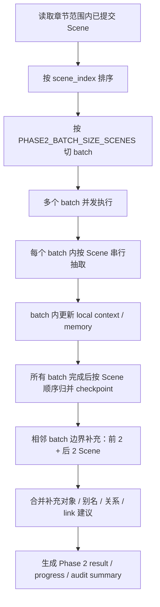

# Phase2 Batch 并发世界对象提取设计

## 1. 背景

深度导入已经拆分为三个用户可独立启动的阶段：

1. 场景（Scene）自动提取。
2. 世界对象与别名 / 关系自动提取。
3. 剧情线自动提取。

其中第二阶段当前基于已提交 Scene 执行 Phase 2a 世界对象 / Delta 抽取和
Phase 2b 别名 / 关系抽取。真实 LLM 测试显示：如果 Scene 数量很多，逐 Scene
串行抽取会明显拖慢 60 / 213 章导入；但完全按 Scene 并发又会丢掉剧情顺序带来的
rolling context，影响对象识别、别名判断和去重质量。

本设计聚焦 Phase 2 的世界对象提取调度方式：吸收旧世界对象自动识别服务中已有的
去重、动作分类、审计统计和候选可追踪思路，同时把 rolling context 从“全局串行”
改为“batch 内串行、batch 间并发”。

## 2. 目标

- 提高 Phase 2 在大量 Scene 下的真实 LLM 运行速度。
- 保留每个局部剧情段内的 Scene 顺序和 rolling context。
- 只在相邻 batch 边界做轻量补漏，不引入重型全局融合。
- 复用 world 模块既有去重能力，但保持 imports 到 world 的跨模块调用只走 facade。
- 让 Phase 2 日志能解释速度、失败、低质量、重复候选和边界补充效果。
- 将 batch 大小和并发数作为可调参数，后续通过真实 LLM 测试做模型调参式优化。

## 3. 非目标

- 不恢复前端旧“自动识别”主入口。
- 不把 Phase 2 改回 chapter text first；Phase 2 仍基于已提交 Scene。
- 不做跨远距离章节的全局对象融合扫描。
- 不自动合并用户已确认的正史对象。
- 不新增队列、数据库、向量存储或多 Agent 运行时。
- 不把旧 world extraction service 直接搬进 imports；imports 不直接 import world
  services / repositories。

## 4. 默认配置

默认参数偏速度，后续真实 LLM 测试可调：

```python
PHASE2_BATCH_SIZE_SCENES = 12
PHASE2_BATCH_CONCURRENCY = 6
PHASE2_BOUNDARY_SCENES = 2
```

候选调参组合：

| 组合 | batch size | batch concurrency | 取向 |
|---|---:|---:|---|
| 8x8 | 8 | 8 | 更快，重试成本低，边界窗口更多 |
| 12x6 | 12 | 6 | 默认推荐，速度和局部上下文平衡 |
| 16x6 | 16 | 6 | 更少 batch，单 batch 稍长 |
| 20x4 | 20 | 4 | 更重质量，速度优势较弱 |

## 5. 主流程



### 5.1 Batch 切分

- 只对当前用户选择章节范围内的已提交 Scene 生效。
- Scene 先按 `scene_index` 排序，再按固定 Scene 数切 batch。
- batch 是 Phase 2 调度单元，不是新的业务资产。
- batch id 只用于 checkpoint、日志和 provenance metadata。

### 5.2 Batch 间并发

- 并发单位是 batch，不是单个 Scene。
- 多个 batch 可以同时启动，上限由 `PHASE2_BATCH_CONCURRENCY` 控制。
- 一个 batch 失败不应阻塞其他 batch；失败 batch 进入 degraded / retry 统计。
- 所有 batch 完成后，再进行边界补充。

### 5.3 Batch 内串行

每个 batch 内 Scene 必须严格按顺序处理：

1. 用 batch 初始上下文调用当前 Scene 的 Phase 2a LLM。
2. 根据 LLM 输出执行 `suggested_action`、去重、入库或跳过。
3. 将本 Scene 的有效新增对象、link 建议和重要 delta 写入 batch-local
   rolling context。
4. 下一 Scene 使用更新后的 batch-local context。

这样保留局部剧情顺序，避免同一批中早出现的对象在后续 Scene 中被重复创建。

## 6. Batch 初始上下文

每个 batch 启动时可用的上下文是稳定快照，不依赖其他并发 batch 的实时结果：

- 任务启动前已有的 canonical / draft 世界对象。
- 当前 batch 的 Scene 摘要列表。
- 前一个 batch 末尾最多 2 个 Scene 的摘要或正文节选，作为前置边界参考。
- 后一个 batch 开头最多 2 个 Scene 的摘要，作为后置弱参考。

后置参考只能用于提示“可能即将出现的命名或关系”，不得让模型凭空提前创建没有
当前 Scene 证据的对象。

## 7. 边界补充

所有 batch 完成后，对相邻 batch 边界执行一次补充：

- 输入：前一批最后 `PHASE2_BOUNDARY_SCENES` 个 Scene，加后一批最前
  `PHASE2_BOUNDARY_SCENES` 个 Scene。
- 默认即相邻 batch 的 4 个 Scene。
- 只处理相邻 batch 边界。
- 不扫描非相邻 batch。
- 不做全局对象融合。

边界补充只允许产出以下结果：

- 漏抽对象。
- 别名候选。
- 候选关系。
- `link_to_existing` 建议。
- 冲突或低置信提示。

边界补充不得重写主 batch 的抽取结果，也不得删除已入库对象。补充结果应带独立
provenance，标明来源为 `phase2_boundary_supplement`。

## 8. 旧世界对象自动识别能力的整合方式

旧前端主入口已经下线，但后端旧世界对象自动识别服务中有几类能力应吸收到新
Phase 2：

### 8.1 去重

Phase 2 入库前应通过 world facade 使用既有去重能力：

- 名称相似。
- 别名相似。
- 可选 name embedding。
- 可选 summary / public_info embedding。

imports 不得直接 import `modules.world.services.dedup_service`。如果现有 facade 形状
不足以表达需要，应在 world facade 增补稳定函数，再由 imports 调用。

### 8.2 suggested_action 分类

Phase 2 LLM 输出必须保留动作分类：

- `create_new`
- `link_to_existing`
- `ignore`
- `temporary_only`

这些动作不是展示文案，而是入库、跳过、记录候选和审计统计的控制信号。

### 8.3 审计统计

Phase 2 result / progress 需要记录：

- action 分布。
- dedup skipped 数。
- linked_to_existing 数。
- ignored 数。
- temporary_only 数。
- low_confidence 数。
- boundary supplement 命中数。
- batch failed / retried / degraded 数。

### 8.4 可追踪候选

自动流水线可以直接写入 canonical 或 candidate，取决于现有 Phase 2 语义，但必须保留：

- workflow_id。
- batch_id。
- scene_id / scene_index。
- source_chapter_index。
- confidence。
- suggested_action。
- candidate_reason。
- context_snapshot_id。
- boundary supplement 来源标记。

## 9. 错误处理

- 单 Scene LLM 失败：记录 failed scene checkpoint，batch 继续后续 Scene。
- 单 batch 连续 transport failure 超阈值：该 batch degraded，其他 batch 继续。
- batch task 异常：记录 batch failed，进入最终 degraded result。
- 边界补充失败：只记录 boundary failed，不回滚主 batch 成果。
- 去重服务失败：降级为名称精确匹配和 `seen_entity_keys`，并记录
  `dedup_degraded=true`。
- embedding 失败：降级到词法去重，不阻断任务。

Phase 2 仍应保留“零实体输出时给出可解释原因”的验收要求。如果没有 Scene，应快速失败并提示用户先执行场景自动提取。

## 10. 进度与日志

`DeepImportProgress.quality_stats["phase2"]` 和 task result 应增加或保留以下字段：

- `phase2_batches_total`
- `phase2_batches_completed`
- `phase2_batch_size_scenes`
- `phase2_batch_concurrency`
- `phase2_boundary_windows_total`
- `phase2_boundary_windows_completed`
- `phase2_action_counts`
- `phase2_dedup_counts`
- `phase2_boundary_supplement_counts`
- `phase2_failed_batches`
- `phase2_degraded_batches`

`current_item` 应能显示当前 batch / scene / boundary window：

```json
{
  "phase": "phase2",
  "kind": "batch_scene",
  "batch_index": 2,
  "batch_total": 6,
  "scene_index": 37,
  "scene_total": 72
}
```

边界补充时：

```json
{
  "phase": "phase2_boundary",
  "kind": "boundary_window",
  "left_batch_index": 2,
  "right_batch_index": 3,
  "window_index": 2,
  "window_total": 5
}
```

## 11. 验收标准

- 60 / 213 章任务不再因为逐 Scene 全局串行而线性拖慢。
- batch 内 Scene 处理顺序可从 checkpoint 和日志中验证。
- batch 间并发数受 `PHASE2_BATCH_CONCURRENCY` 控制。
- 边界补充只覆盖相邻 batch 的 4 个 Scene。
- 边界补充失败不会回滚主 batch 已写结果。
- Phase 2 result 能解释 created、linked、ignored、temporary、dedup skipped、
  low confidence 和 boundary supplement 命中情况。
- imports 到 world 的去重调用只通过 facade，不直接 import world service。
- 参数调优测试能比较 `8x8 / 12x6 / 16x6 / 20x4` 的耗时、失败率、对象数量、
  重复率和边界补充命中率。

## 12. 测试计划

### 12.1 单元 / 集成测试

- 给定 30 个 Scene 和 batch size 12，应生成 3 个 batch。
- batch 间并发执行，但每个 batch 内 Scene 调用顺序严格递增。
- 一个 batch 内某 Scene 失败后，后续 Scene 继续处理并记录 failed checkpoint。
- 相邻 batch 边界补充只收到前 2 + 后 2 个 Scene。
- 边界补充失败时主 Phase 2 result 标记 degraded，但保留已创建对象。
- 去重 facade 返回高置信重复时，不创建新对象并记录 dedup skipped。
- embedding 失败时降级到词法去重并记录 dedup degraded。
- 无 Scene 时 world object stage 快速失败并提示“请先执行场景（scene）自动提取”。

### 12.2 真实 LLM 调参测试

先用小样本验证正确性，再用 60 章跑参数组：

- `8x8`
- `12x6`
- `16x6`
- `20x4`

对比指标：

- wall clock time。
- completed / failed scene 数。
- created entity 数。
- alias / relation 数。
- duplicate 或 link_to_existing 比例。
- low confidence 比例。
- boundary supplement 命中数。
- phase2 degraded 原因。

默认值保持 `12x6`，除非真实 LLM 测试显示其他组合在速度、质量和稳定性上明显更优。
