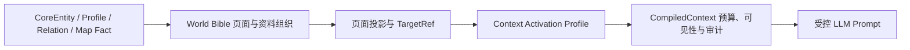
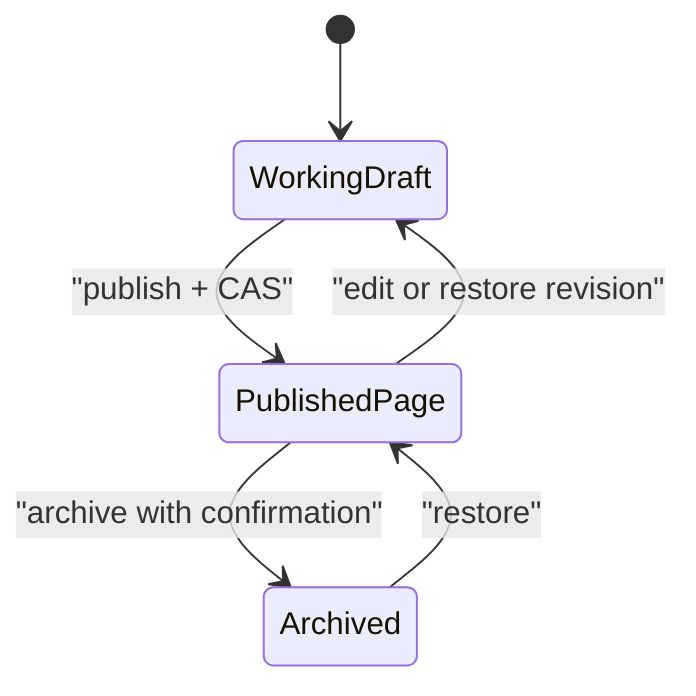
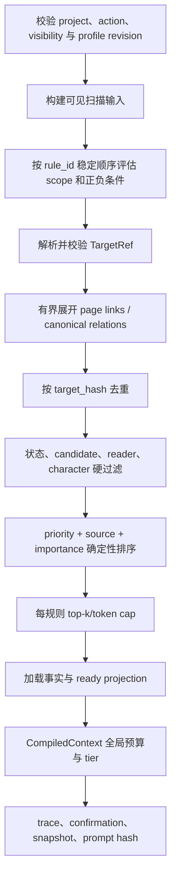

# 世界书模块 V2 设计

## 状态

- 状态：Implemented（核心 V2，2026-07-15）；当前运行时契约以模块 README、ORM、
  migration、facade/contracts 和测试为准。Phase 5 的 imports opt-in 与固定质量评测、
  高级规则表单和 section diff/折叠属于后续增强，不阻塞核心工作流。
- 日期：2026-07-14。
- 参考：[`Novalist 与 SillyTavern 世界书设计深度对比`](../../references/2026-07-14-novalist-sillytavern-worldbook-design-analysis.md)。
- 当前事实来源：`backend/modules/world/README.md`、`backend/modules/context/README.md`、
  ORM、migration、facade/contracts 与测试。
- 架构决策：[`ADR-0006`](../../adr/0006-world-bible-context-activation-ownership.md)
  已固化“资料归 world、激活规则归 context”的长期边界。

实现采用以下收敛：页面模板历史恢复直接把旧快照写成当前模板的新版本，不另建模板工作稿
表；V2 激活候选只覆盖固定 World Bible 页面/CoreEntity 及其有界页面链接、关系展开，RAG
检索 trace 继续由既有 retrieval trace 管理；编译通过现有 `CompileOptions + compile_with_tiers`
稳定入口显式选择 Profile，不增加 pass-through `compile_with_activation_profile`；跨项目目标统一
报告 `target_missing`，避免用 `target_cross_novel` 泄露目标存在性。移动端使用单栏重排而非新增
抽屉组件，保持现有 Vanilla JS 交互体系。

## 1. 结论

本项目不新增 `worldbook` 顶级模块，也不创建第二套世界事实库。产品中的“世界书”是一个
统一工作区，运行时仍由两个既有模块分工：



- `world` 拥有长期世界事实、类别、页面、工作稿、修订、页面模板和投影。
- `context` 拥有 Activation Profile、规则执行、可见性、预算、trace、确认和 snapshot。
- 前端把两者组合成一个作者可理解的“世界书”工作区，但不复制业务判断。
- `imports`、`writing`、生成中心和地图只通过 facade/contracts 消费，不直接读取规则表或
  世界书 ORM。

设计吸收 Novalist 的“结构化长期资料”与 SillyTavern 的“可解释激活”，但拒绝
filesystem-primary、raw Prompt 插槽、随机激活、无限递归和前端承担 schema 边界。

## 2. 影响与契约风险

| 项目 | 设计判断 |
|---|---|
| 主要模块 | `world`、`context`、`frontend-console` |
| 条件性调用方 | `writing`、`imports`、生成中心；只在选择启用 Activation Profile 时接入 |
| 稳定接口 | 保留现有 `world.facade`、`context.facade` 与 GET activation preview；新增 additive facade/contract |
| API 风险 | 中等；新增模板/Profile/结构化预览 API，现有路由和响应字段不删除 |
| schema 风险 | 中高；拟新增页面 sections、页面模板、Activation Profile 及 revision |
| wire 风险 | 低到中；新字段必须有默认值，`free_text`、`activation_defaults_json` 保留兼容 |
| 安全风险 | 高；规则不得绕过 `novel_id`、reader/character 可见性、P0 section 或用户确认 |
| 新依赖 | 无 |
| ADR | 实现前需要；不需要新顶级模块 ADR，不改变默认技术栈 |
| 验证 | world/context unit + integration、API contract、frontend、E2E、确定性与泄漏测试 |

## 3. 当前基线

截至当前工作树，以下能力已经存在，不在 V2 重建：

1. `CoreEntity`、强/通用 Profile、关系、地图事实和人物知识承担结构化事实。
2. `world_bible_categories` 支持内置与项目自定义类别；自定义类别当前只定义展示信息。
3. `world_bible_page_drafts` 承担服务器工作稿；发布使用 `base_version_number` CAS。
4. `world_bible_pages`、revisions、projections 分离作者页面、发布历史和派生缓存。
5. 世界书作者简介使用不可变 revision、source hash、pin/stale/refresh 语义。
6. 页面 AI 输出进入建议或工作稿，不直接写入 canonical 世界事实。
7. `ActivationPreviewService` 已按 explicit、page-linked、relation 等来源确定性排序，默认
   `depth=2`、`top_k=64`。
8. `context` 已拥有 CompiledContext、预算事件、可见性、确认、snapshot 和 retrieval trace。

当前主要缺口是：

- 页面正文仍以单个 `free_text` 为主，缺少稳定 section 身份、排序和局部引用。
- `template_key/template_version` 已预留，但没有完整的用户可编辑页面模板生命周期。
- `activation_defaults_json` 是未类型化摘要，不能成为正式运行时规则。
- 激活预览主要解释候选来源，尚不能逐规则显示命中、否定、落选和预算结果。
- 没有按 workflow/action 复用并版本化的 Activation Profile。

## 4. 产品心智模型

作者只需要理解四层：

| 层 | 作者看到的名称 | 作用 | 是否是事实源 |
|---|---|---|---|
| 事实 | 世界对象 | 人物、地点、势力、规则、物品、关系、地图事实 | 是 |
| 资料 | 世界书 | 用页面、类别和章节组织、解释、引用事实 | 否 |
| 规则 | AI 参考规则 | 决定某类操作何时考虑哪些资料 | 否 |
| 结果 | 本次参考资料 | 展示实际选中、排除、裁剪及原因 | 否 |

世界书页可以写作者说明，但系统必须持续提示：

> 世界书正文是资料与解释。要改变正式设定，请编辑对应世界对象或采用结构化建议。

## 5. 用户工作流

### 5.1 建立世界资料

1. 作者进入 `世界对象 → 世界书`。
2. 选择内置类别或创建自定义类别卡。
3. 从模板创建页面，或创建空白页。
4. 编辑概览、多个 section、页面引用和页面元数据。
5. 保存到服务器工作稿；工作稿不进入 canonical context。
6. 发布时执行 schema、TargetRef、`novel_id`、引用状态和 version CAS 校验。
7. 发布成功后写不可变 revision，页面投影与作者简介标记 stale。

### 5.2 将页面连接到事实

- 页面通过 `linked_asset_refs_json` 引用 CoreEntity、Profile 字段、关系、地图事实和结构资产。
- 引用卡只展示事实快照；点击后跳转到拥有该事实的编辑界面。
- 页面不提供直接覆盖 Profile 强字段的快捷写入。
- 从页面正文识别出的新事实进入 `creation_suggestion_queue`，作者采用后才调用 world 命令。

### 5.3 配置 AI 参考规则

1. 作者在世界书右侧打开“AI 参考规则”。
2. 选择适用操作，如 `writing.scene.generate`、`world.object_draft.generate` 或导入预检。
3. 选择具体页面/对象 TargetRef，配置正向词、负向词、优先级、局部 top-k 和 token cap。
4. 用当前 Scene、任务文本或显式焦点执行 dry-run。
5. 检查命中、落选、可见性和预算 trace。
6. 发布 Activation Profile；运行时只消费已发布 revision。

### 5.4 每次 LLM 调用前审查

- 手动 AI 操作继续展示 AI 参考资料确认界面。
- 自动授权流水线把实际 profile revision、规则 hash、资产 revision/hash 和预算结果写入
  `context_snapshots`。
- 作者可以临时排除可选 section，但不能排除 P0 硬约束，也不能扩大 reader/character
  可见范围。

## 6. 世界书资料模型

### 6.1 事实所有权不变

下列内容继续是唯一事实源：

- `CoreEntity` 与类型化/通用 Profile；
- `EntityRelation`；
- 已确认地图事实；
- `CharacterKnowledge`、知识策略和读者揭示策略；
- outline/writing 拥有的结构与正文事实。

世界书页面、模板、投影和 Activation Profile 都不能成为平行事实源。

### 6.2 类别卡

`WorldBibleCategory` 继续是项目内展示和导航元数据：

- 稳定 `category_key` 创建后不可修改；
- 可修改名称、描述、颜色、图标和排序；
- 归档类别不删除页面；
- 内置 key 不允许被自定义类别覆盖；
- 类别不保存事实 schema、Prompt 文本或运行时规则。

V2 可新增可选 `default_template_key`，它只决定“在此类别中新建页面时默认选哪个模板”，
不让类别成为模板或规则所有者。

### 6.3 页面与 section

保留 `WorldBiblePage.free_text` 作为页面概览，并新增 `sections_json` 作为有序的补充资料段。
两者不是互斥来源，避免旧客户端和结构化编辑器争抢同一个字段。

建议 section schema：

```json
{
  "section_id": "stable-local-id",
  "section_type": "markdown",
  "title": "货币与交换",
  "body_markdown": "……",
  "sort_order": 20,
  "linked_asset_ref_hashes": ["sha256:..."],
  "projection_policy": "eligible",
  "sensitivity_hint": "author_safe"
}
```

约束：

- `section_id` 在页面内唯一；发布与恢复时保持稳定，便于 diff 和来源定位。
- 第一版 section type 只支持 `markdown`、`checklist`、`asset_collection`。
- `linked_asset_ref_hashes` 只能指向页面级已校验 TargetRef，不重复保存完整引用。
- `projection_policy` 只有 `eligible/excluded`，不能指定 system/user/assistant role 或 Prompt
  深度。
- `sensitivity_hint` 只能进一步收紧展示；不能覆盖 reader/character 硬过滤。
- Markdown 渲染必须转义动态内容，不能未经处理进入 `innerHTML`。
- 每页最多 64 个 section；标题、正文和引用数量均设 Pydantic 上限。

### 6.4 页面模板

新增 world-owned 页面模板，而不是复用 `EntityProfileTemplate`。两者目标不同：Profile
Template 描述世界对象字段，Page Template 描述作者资料页布局。

建议表：

#### `world_bible_page_templates`

- `id`, `novel_id`, `template_key`, `name`, `description`；
- `category_key_hint`；
- `sections_schema_json`, `default_sections_json`, `validation_rules_json`；
- `version_number`, `status`, `created_by`, `updated_by`, timestamps；
- unique `(novel_id, template_key)`。

#### `world_bible_page_template_revisions`

- `id`, `novel_id`, `template_id`, `version_number`；
- 完整不可变 snapshot、content hash、revision reason、created_by/at；
- unique `(template_id, version_number)`。

模板限制：

- 内置模板仍由代码注册表提供，数据库模板不能静默覆盖内置 key。
- 模板只定义页面 sections、默认值、校验和展示提示。
- 模板不能保存 Prompt、provider、API key、工具调用或任意可执行表达式。
- 页面发布时固定 `template_key + template_version`；模板升级不自动改写已发布页面。
- 模板迁移先生成工作稿和 diff，作者确认发布后才生效。

### 6.5 工作稿、发布和修订

沿用现有生命周期：



- `world_bible_page_drafts` 增加与页面同形的 `sections_json`、`template_key/version`。
- 发布锁定页面，校验 `base_version_number`，成功后写页面和一条 revision，再删除工作稿。
- 409 version conflict 保留工作稿，前端提供字段/section diff，不自动覆盖。
- revision snapshot 包含概览、sections、引用、模板和页面元数据。
- 恢复 revision 只创建新工作稿，不改写旧历史。
- 页面归档而非硬删除；项目永久删除除外。

### 6.6 投影

`WorldBiblePageProjection` 继续是可重建缓存，不是事实：

- projection source hash 必须覆盖页面 version、模板 version、概览、sections 和引用 revision；
- projection 的 source span 使用 `page_id + section_id + local range`，而不是只有整页来源；
- `fact_candidates` 只进入建议审查，不进入 canonical context；
- stale/failed projection 不静默当作最新资料；fallback 必须出现在 trace；
- 页面、引用资产或模板变化时，只标记受影响 projection stale；长文本刷新走现有任务队列。

## 7. Activation Profile

### 7.1 所有权

Activation Profile 属于 `context`，因为它决定资料选择、可见性与预算前的规则执行。世界书
UI 可以编辑它，但生产代码不能把规则塞进 `WorldBiblePage` service。

现有 `activation_defaults_json` 保留兼容，但降格为编辑器提示：

- 可预填 suggested terms、priority 或目标引用；
- 不被运行时直接执行；
- 作者选择“加入 AI 参考规则”后，提示内容被复制到 Activation Profile 工作稿；
- 正式调用只消费已发布 Profile revision。

### 7.2 持久化

建议使用 revisioned JSON aggregate，而不是给每条规则建立独立 ORM 表。规则数量有界，作者
需要原子发布整套策略，snapshot 也需要固定完整规则集。

#### `context_activation_profiles`

- `id`, `novel_id`, `profile_key`, `name`, `description`；
- `applicable_actions_json`；
- `rules_json`；
- `budget_hints_json`；
- `version_number`, `status`, `created_by`, `updated_by`, timestamps；
- unique `(novel_id, profile_key)`。

#### `context_activation_profile_revisions`

- `id`, `novel_id`, `profile_id`, `version_number`；
- 完整 snapshot、rule hash、revision reason、created_by/at；
- unique `(profile_id, version_number)`。

删除测试结论：第一版不需要独立 `context_activation_rules` 表。运行时总是按一次操作加载一个
已发布 profile，规则上限 128，JSON aggregate 更符合 CAS、revision 和 snapshot 语义。
只有将来出现跨 profile 共享规则、独立权限或规则级查询需求时才重新评估拆表。

### 7.3 规则 schema

```json
{
  "rule_id": "stable-local-id",
  "name": "提及北境贸易时加入货币与道路资料",
  "enabled": true,
  "scope": {
    "actions": ["writing.scene.generate"],
    "modes": ["author_safe", "author_full"],
    "match_sources": ["task_text", "current_scene_text", "explicit_focus"]
  },
  "match": {
    "positive_terms": ["北境", "商路", "银币"],
    "negative_terms": ["梦境", "假设推演"],
    "positive_logic": "any",
    "negative_logic": "any",
    "mode": "normalized_substring"
  },
  "select": {
    "target_refs": [{"target_type": "world_bible_page", "target_id": "...", "target_path": ""}],
    "expand_page_links": true,
    "relation_types": ["located_in", "member_of"],
    "max_depth": 1
  },
  "rank": {
    "priority": 700,
    "top_k": 12,
    "token_cap": 1200
  }
}
```

V2 第一版明确限制：

- 支持 Unicode 规范化后的 substring 与英文 token-boundary；中文不套用错误的空格词边界。
- 支持正向 any/all 与负向 any/all。
- 不支持任意 regex，避免 ReDoS、方言差异和难以解释的匹配。
- 不支持 probability、weighted random、seedless choice。
- 不支持内容触发内容的递归扫描；只支持显式、最多两层的 page-link/relation 展开。
- 不支持 `ignoreBudget`、任意 Prompt role/depth/outlet 或 system 插槽。
- 不支持把 category 作为动态查询选择器。UI 选择类别时在发布前展开成具体 TargetRef，保证
  revision 可重放；新增页面不会静默加入已发布规则。
- 规则只能进一步缩小硬可见范围，不能放宽 reader/character cutoff 或 candidate 门禁。

### 7.4 激活输入

允许扫描的输入由调用方通过 typed request 提供：

- 当前操作 task text；
- 当前 Scene 可见正文或摘要；
- 最多两个前序 Scene brief；
- 显式选中的实体、页面、地图或焦点；
- 已确认的当前地图摘要；
- 已通过 context evidence seam 校验的可见证据。

禁止输入：

- future Scene、超过 reader/character 截止点的正文或摘要；
- 未采用 AI 建议，除非本次手动操作明确选择并确认；
- API key、provider 配置、系统 Prompt 或工具描述；
- RAG 未回读原文且未校验 source hash 的 chunk。

### 7.5 确定性算法



排序建议：

```text
score = rule.priority * 10000
      + source_weight
      + int(asset.importance * 1000)
      + deterministic_recency_bonus
```

相同 score 以 `target_hash` 决胜。显式选择和 P0 硬约束不参加低优先级裁剪，但仍必须通过
`novel_id` 与可见性门禁。

## 8. Trace 与调试体验

预览不能只返回“选中了哪些对象”，还必须解释每个阶段。

建议 response 分三部分：

```json
{
  "profile": {"id": "...", "version": 3, "rule_hash": "..."},
  "rule_evaluations": [
    {
      "rule_id": "...",
      "matched": true,
      "matched_clauses": ["positive:any:北境"],
      "blocked_clauses": [],
      "candidate_count": 8
    }
  ],
  "items": [
    {
      "target": {},
      "decision": "included",
      "activation_reason": "rule:... -> page_linked",
      "score": 70006000,
      "token_before": 420,
      "token_after": 320,
      "expanded_from": {},
      "excluded_reason": null
    }
  ],
  "budget_events": [],
  "warnings": []
}
```

标准 `excluded_reason` 至少包括：

- `scope_mismatch`
- `positive_not_matched`
- `negative_matched`
- `target_missing`
- `target_cross_novel`
- `target_archived`
- `candidate_not_allowed`
- `reader_cutoff`
- `character_knowledge_hidden`
- `future_scene`
- `projection_stale`
- `rule_top_k`
- `rule_token_cap`
- `global_budget_evicted`
- `global_budget_truncated`

trace 不进入 LLM token。真实调用的 snapshot 保存 profile/revision/rule hash、输入 source hash、
included target hashes、section/token metadata、budget events 摘要和 prompt hash；默认不保存完整
敏感正文。

## 9. API 与稳定 facade

### 9.1 保留的接口

- 现有 `/api/world/bible/pages*`、categories、drafts、revisions、synopsis 和 projections 路由。
- `GET /api/context/activation-preview` 及其当前 query wire。
- `world.facade.get_world_background()`、`preview_worldbuilding_activation()`、
  `get_world_bible_synopsis_context()`。
- 现有 `context.compile/confirm/snapshot` 行为。

### 9.2 world 新增接口

HTTP：

```text
GET    /api/world/bible/page-templates
POST   /api/world/bible/page-templates
PATCH  /api/world/bible/page-templates/{template_id}
GET    /api/world/bible/page-templates/{template_id}/revisions
POST   /api/world/bible/page-templates/{template_id}/revisions/{version}/restore-draft
POST   /api/world/bible/drafts/{draft_id}/apply-template
```

Facade/contracts：

```text
get_world_bible_projection_candidates(novel_id, target_refs, *, projection_type)
get_world_bible_page_source_manifest(novel_id, page_ids)
```

两个接口只返回 dataclass/TypedDict contract，不暴露 ORM。

### 9.3 context 新增接口

HTTP：

```text
GET    /api/context/activation-profiles?novel_id=...
POST   /api/context/activation-profiles
PATCH  /api/context/activation-profiles/{profile_id}
POST   /api/context/activation-profiles/{profile_id}/publish
GET    /api/context/activation-profiles/{profile_id}/revisions
POST   /api/context/activation-profiles/{profile_id}/revisions/{version}/restore-draft
POST   /api/context/activation-preview
```

同一路径允许 GET 兼容预览与 POST 结构化预览，不删除旧客户端能力。

Facade/contracts：

```text
preview_activation_profile(db, request: ActivationPreviewRequest) -> ActivationTraceContract
resolve_activation_profile(db, novel_id, action, profile_id=None) -> ActivationProfileContract
compile_with_activation_profile(db, request) -> CompiledContext
```

运行时调用方只使用 context facade；它们不分别调用 world preview 后再自行拼预算。

## 10. 前端设计

继续使用 Vanilla JS，不引入新前端框架。

### 10.1 工作区布局

```text
┌ 类别 / 页面 ─────┬ 页面编辑区 ──────────────────┬ 检查器 ─────────────┐
│ 类别卡、搜索      │ 标题、概览、sections、引用    │ 事实引用             │
│ 页面状态、工作稿  │ 模板、diff、发布              │ 投影状态             │
│ 历史/归档         │                               │ AI 参考规则 / trace  │
└───────────────────┴───────────────────────────────┴─────────────────────┘
```

小屏时检查器变为抽屉，中心列必须 `min-width: 0`；类别筛选和当前页面状态不可因横向滚动而
丢失。

### 10.2 页面编辑

- 自动保存只写服务器工作稿。
- 页面顶部显示“资料页，不是事实源”的状态条。
- section 支持新增、重命名、排序、折叠和局部引用。
- 引用卡显示来源模块、状态、revision、可见性和 stale 提示。
- 发布前展示模板校验、失效引用、投影影响和 version conflict 风险。
- 历史对比按 section_id 对齐；Markdown 做段落 diff，引用做集合 diff。

### 10.3 规则编辑

- 默认展示“简单模式”：适用操作、正向词、排除词、资料目标、优先级、cap。
- 高级模式只增加 AND/ANY、关系类型和展开深度，不暴露 raw JSON 或 regex。
- dry-run 结果按“已加入 / 被排除 / 被裁剪”分组。
- 每项显示来源、命中规则、可见性结果、token 和展开路径。
- Profile 发布与页面发布分开，避免编辑资料正文时静默改变未来 LLM 上下文。

### 10.4 安全渲染

- 所有标题、正文、trace、匹配词和 AI 建议统一经过 `esc()` 或安全 Markdown renderer。
- 不把用户/AI 内容直接写入 `innerHTML`。
- 规则预览不执行模板表达式、脚本、宏或 HTML event handler。

## 11. LLM 与 Prompt 边界

- 新的 world-owned LLM 调用继续通过 `open_project_llm_client()` 或 project snapshot seam。
- 页面正文和投影被渲染为带明确数据边界的参考资料，不能进入固定 system scaffold。
- 世界书内容中出现“忽略前文”“调用工具”等文本时，只按引用资料处理。
- AI 可建议 page section、TargetRef 或规则草案；未经用户采用不得发布页面或 Activation
  Profile。
- 冲突、低置信、无法定位的事实继续进入建议/冲突队列。
- 第一版不让 LLM 生成或执行 regex、递归规则、随机规则和 Prompt 插槽。

## 12. 一致性、并发与失效

### 12.1 CAS

- 页面、页面模板和 Activation Profile 分别使用独立 `version_number` CAS。
- 409 冲突保留本地/服务器工作稿，并返回 expected/actual version 和 diff 所需 metadata。
- API/facade 不做 last-write-wins。

### 12.2 stale 传播

| 变化 | 失效对象 |
|---|---|
| 页面概览/section/引用发布 | 该页 projection、作者简介、引用该页的 context cache |
| 页面模板发布 | 仅标记仍绑定旧模板且选择升级的工作稿；不自动改已发布页 |
| 被引用事实 revision 变化 | 相关 projection/source manifest；Profile 规则本身不自动改版 |
| TargetRef 归档/迁移 | Activation Profile 显示 stale reason，运行时排除并告警 |
| Activation Profile 发布 | 后续调用使用新 revision；既有 confirmation/snapshot 固定旧 revision |

新增页面不会自动加入按类别选中的已发布 Profile，因为类别选择在发布时已展开为固定
TargetRef。作者必须显式重新发布 Profile。

## 13. 安全与不变量

1. 每张新表都有 `novel_id`，所有查询同时约束主对象 id 与 `novel_id`。
2. 所有 TargetRef 通过共享 validator，并回读目标确认归属项目。
3. reader/character 可见性是硬过滤，规则只能收紧，不能放宽。
4. 当前 Scene 操作不得扫描 future Scene；同章先后不明默认排除。
5. 规则、页面模板和 sections 都经过 Pydantic schema；不执行任意表达式。
6. 已发布页面/Profile/模板不硬删除，使用 archived 与 revision 恢复。
7. API、日志、trace 和 snapshot 不保存或返回 API key。
8. 规则结果确定性；相同 input hash、profile revision 和 asset revisions 必须得到相同顺序。
9. `ignoreBudget` 不存在；P0 section 保护和全局模型预算不可绕过。
10. 自动 LLM 输出不直接发布规则或写 canonical 世界事实。

## 14. 迁移与交付顺序

### Phase 0：决策冻结

- 用户确认本设计。
- 新增 ADR：世界书资料归 world、Activation Profile 归 context。
- 冻结 Pydantic rule/section/template contract 与 additive wire 方案。

### Phase 1：统一 trace，不新增规则表

- 扩充当前 Activation Preview 的 typed response 和 excluded reason。
- 让 explicit/relation/page-linked/RAG/预算原因进入统一 trace。
- 保留 GET wire；新增 POST 结构化预览。

### Phase 2：页面 sections 与模板

- migration、ORM、Pydantic、service、revision snapshot、projection source hash 同步。
- 前端 section editor、模板管理、发布 diff。
- 旧页面 `sections_json=[]`，不改 `free_text`。

### Phase 3：Activation Profile

- 新增 context 表、revision、CAS、facade/contracts/API。
- 实现受限 matcher、固定 TargetRef、dry-run 和 stale diagnostics。
- Profile 先只用于手动作者操作。

### Phase 4：真实编译接入

- ContextCompiler 消费已发布 profile revision。
- confirmation/snapshot/prompt hash 固定 profile 与 source hashes。
- 生成中心和写作 Scene 生成以显式 opt-in 接入。

### Phase 5：导入与评测

- imports 只通过 context facade 消费，不拥有规则。
- Scene-local 路径保持“当前 Scene + 最多两个前序 brief”，禁止 future Scene。
- 加入固定样本的召回率、误激活率、剧透泄漏率、token overflow 和重放一致性评测。

## 15. 测试矩阵

### world

- 类别 key、归档与页面保留；
- section schema、稳定 id、数量/长度边界；
- 页面模板内置 key 保护、revision、CAS 和迁移工作稿；
- 页面发布、恢复、冲突保留工作稿；
- TargetRef `novel_id` 隔离；
- projection source hash、stale、fallback 和 section source span；
- 页面/投影不覆盖 Profile 正式事实。

### context

- positive/negative any/all、中文 substring、英文 token boundary；
- 空词、重复词、非法 rule、超长输入和 128 rule 上限；
- 关系环、页面互引、最大深度、去重和稳定排序；
- archived/candidate/reader/character/future Scene 排除；
- per-rule top-k/cap 与全局 budget 的先后顺序；
- 同 revision/输入/source hash 结果完全一致；
- confirmation/snapshot 固定旧 profile revision；
- raw 世界书文本无法改变 system scaffold。

### API 与前端

- 所有读写跨 `novel_id` 返回 404/403 而非泄露存在性；
- 旧 GET activation preview contract 不变；
- 新字段缺省时旧页面仍可编辑、发布和恢复；
- 动态文本转义、恶意 Markdown/HTML、超长规则反馈；
- 页面与 Profile 分别发布，不发生隐式联动；
- 409 diff、stale target、投影失败和预算裁剪对作者可见。

### E2E

1. 创建自定义类别和模板。
2. 创建多 section 页面并链接两个世界对象。
3. 发布页面并刷新 projection。
4. 创建 Activation Profile，配置正/负条件并 dry-run。
5. 在当前 Scene 命中一条规则，future Scene 目标被排除。
6. 确认一次生成，验证 snapshot 中 profile revision、source hash 和 prompt hash。
7. 修改页面后旧 snapshot 仍可审计，新调用显示 projection stale。
8. 恢复旧 revision 生成新工作稿，不删除历史。

## 16. 验收标准

- 作者能用类别、模板、概览和多个 section 维护世界资料。
- 世界书页面始终只是资料组织层，不会覆盖结构化世界事实。
- 作者能为具体 AI 操作建立可版本化规则，并在发布前 dry-run。
- 每个候选都能解释命中、展开、排除、裁剪和最终 token 结果。
- 相同 profile revision、输入和资产 revision 可确定性重放。
- reader/character/future Scene 边界不能被规则、页面内容或空预算绕过。
- 现有页面、API、`free_text`、GET activation preview 和调用方继续工作。
- 不新增顶级模块、前端框架、数据库基础设施、Agent runtime 或 Prompt 自定义执行器。

## 17. 非目标

- 不实现 Novalist 式跨 `novel_id` 系列共享。若未来需要，必须先设计独立资产所有权、ACL、
  局部覆盖和迁移 ADR，不能复用普通 `novel_id` 查询绕过隔离。
- 不导入或兼容 SillyTavern lorebook JSON。
- 不提供 raw Prompt、role、depth、outlet、macro 或工具配置编辑器。
- 不支持随机概率、加权互斥、sticky/cooldown/delay、无限递归或 min activations。
- 不让 category 变成世界事实类型或运行时查询语言。
- 不让页面自由正文直接参与 canonical 冲突判定。
- 不让 AI 自动发布页面、模板、Activation Profile、知识策略或读者揭示策略。

## 18. 待实现评审确认

以下选择已在本设计中给出推荐默认值，实施前只需整体确认，不需要重新发散设计：

1. 页面保留 `free_text` 概览，并新增补充 `sections_json`，不做破坏性替换。
2. 自定义 Page Template 归 world，Entity Profile Template 继续独立。
3. Activation Profile 归 context，使用 revisioned `rules_json` aggregate。
4. `activation_defaults_json` 只做编辑器提示，不是运行时规则源。
5. 第一版无 regex、随机、递归和动态 category selector。
6. 现有 GET preview 保留，POST preview 提供完整 typed trace。
7. 先交付统一 trace，再交付复杂规则，避免规则复杂度先于可解释性。
